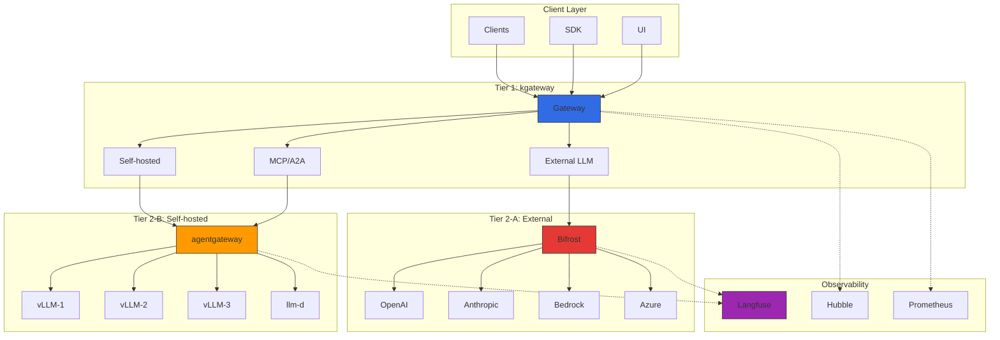
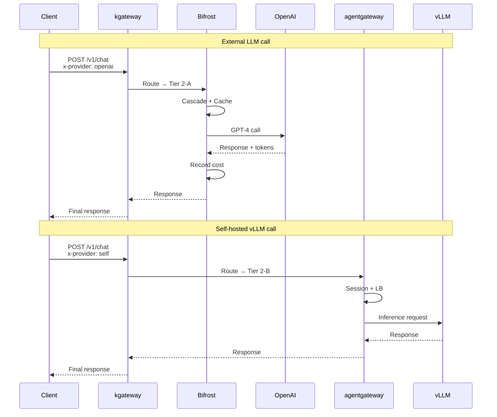
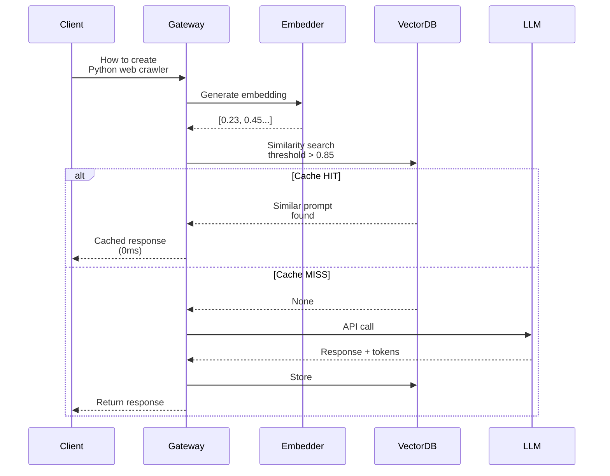
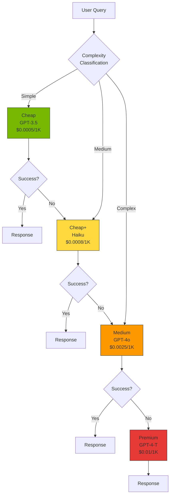
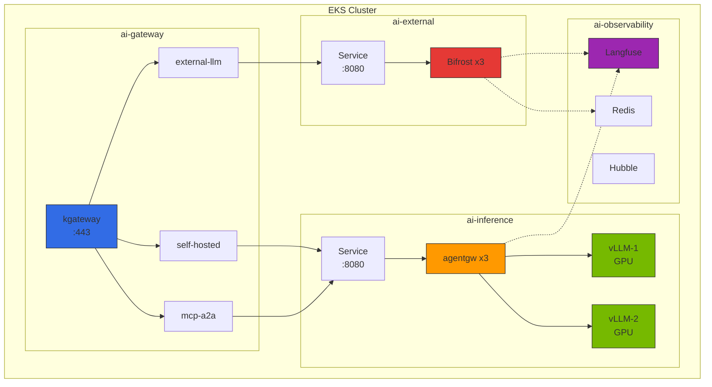

# LLM Gateway 2-Tier Architecture

> Created: 2026-03-16 | Updated: 2026-03-18 | Reading time: Approximately 20 minutes

## Overview

In LLM serving environments, infrastructure-level traffic management and LLM provider abstraction must be separated as two distinct concerns. Attempting to handle all functions with a single Gateway leads to exponentially increasing complexity and makes it difficult to optimize specialized functions for each layer.

### Limitations of a Single Gateway

| Concern | Requirements | Single Gateway Problems |
|--------|----------|-------------------|
| **Infrastructure Traffic Management** | Kubernetes native routing, mTLS, circuit breakers, network policies | Increased complexity when mixed with LLM-specific logic |
| **LLM Provider Abstraction** | 100+ provider integration, token counting, semantic caching, cost tracking | Non-standard dependencies when implemented as Envoy/Gateway API extensions |
| **AI Protocols** | MCP (Model Context Protocol), A2A (Agent-to-Agent), JSON-RPC sessions | General gateways lack support for stateful sessions |

### Advantages of 2-Tier Approach

**Tier 1 (Infrastructure Gateway)**: Uses Kubernetes Gateway API standard implementation (kgateway) to handle traffic control, routing, security, and network policies. Provides Envoy-based performance and Kubernetes ecosystem native integration.

**Tier 2 (LLM Gateway)**: Lightweight gateway specialized in LLM provider abstraction, handling 100+ provider integration, cost tracking, semantic caching, and cascade routing. Defaults to Bifrost (high-performance Go/Rust-based), with LiteLLM available as an alternative in Python ecosystems.

This separation enables:

- Each tier focuses on and optimizes its own concerns
- Tier 1 follows Kubernetes standards for portability
- Tier 2 responds agilely to the rapidly evolving LLM ecosystem
- Operations teams can independently manage infrastructure and AI workloads

### Key Objectives

- **Traffic Control**: Kubernetes Gateway API standard-based routing
- **Provider Abstraction**: Unified API for OpenAI/Anthropic/Bedrock/Azure/GCP
- **Cost Optimization**: Cascade routing, semantic caching, budget control
- **AI Protocol Support**: Native MCP/A2A routing

---

## 2-Tier Gateway Architecture

### Overall Structure Diagram



### Role Separation by Tier

| Tier | Component | Responsibility | Protocol |
|------|----------|------|----------|
| **Tier 1** | kgateway (Envoy-based) | Traffic routing, mTLS, rate limiting, network policies, LoadBalancing | HTTP/HTTPS, gRPC |
| **Tier 2-A** | Bifrost (or LiteLLM) | External LLM provider integration, cost tracking, cascade routing, semantic caching | OpenAI-compatible API |
| **Tier 2-B** | kgateway + agentgateway | Self-hosted inference infrastructure routing, MCP/A2A sessions, Tool Poisoning prevention | HTTP, JSON-RPC, MCP, A2A |

### Traffic Flow



---

## agentgateway Data Plane

### Overview

**agentgateway** is kgateway's AI workload-specific data plane. The existing Envoy data plane is optimized for stateless HTTP/gRPC traffic, but AI agents have special requirements such as stateful JSON-RPC sessions, MCP protocol, and Tool Poisoning prevention.

### Differences from Envoy Data Plane

| Item | Envoy Data Plane | agentgateway Data Plane |
|------|---------------------|---------------------------|
| **Session Management** | Stateless, HTTP cookie-based | Stateful JSON-RPC sessions, in-memory session store |
| **Protocol** | HTTP/1.1, HTTP/2, gRPC | MCP (Model Context Protocol), A2A (Agent-to-Agent), JSON-RPC |
| **Security** | mTLS, RBAC | Tool Poisoning prevention, per-session Authorization |
| **Routing** | Path/header-based | Session ID-based, tool call verification |
| **Observability** | HTTP metrics, Access Log | LLM token tracking, tool call chain, cost |

### Core Features

#### 1. Stateful JSON-RPC Session Management

MCP protocol requires long-lived JSON-RPC sessions between clients and servers. agentgateway tracks session IDs and routes requests from the same session to the same backend.

```yaml
# Session-based routing configuration
apiVersion: kgateway.dev/v1alpha1
kind: SessionPolicy
metadata:
  name: mcp-session-policy
spec:
  sessionIdHeader: "X-MCP-Session-ID"
  sessionTimeout: 30m
  stickySession: true
```

#### 2. Native MCP/A2A Protocol Support

```yaml
# MCP protocol routing
apiVersion: gateway.networking.k8s.io/v1
kind: HTTPRoute
metadata:
  name: mcp-route
spec:
  parentRefs:
    - name: ai-inference-gateway
      sectionName: https
  rules:
    - matches:
        - path:
            type: PathPrefix
            value: /mcp/v1
      backendRefs:
        - name: agentgateway-service
          port: 8080
      filters:
        - type: ExtensionRef
          extensionRef:
            group: kgateway.dev
            kind: MCPFilter
            name: mcp-session-handler
```

#### 3. Tool Poisoning Prevention

Prevents malicious clients from manipulating tool calls to perform operations outside their permissions.

```yaml
apiVersion: kgateway.dev/v1alpha1
kind: ToolPolicy
metadata:
  name: tool-validation-policy
spec:
  allowedTools:
    - name: "search_documents"
      allowedScopes: ["read:documents"]
    - name: "send_email"
      allowedScopes: ["write:email"]
  denyList:
    - "exec_shell"
    - "read_credentials"
```

#### 4. Per-session Authorization

```yaml
apiVersion: kgateway.dev/v1alpha1
kind: SessionAuthPolicy
metadata:
  name: session-auth
spec:
  authType: JWT
  jwtValidation:
    issuer: "https://auth.example.com"
    audience: "ai-agents"
  sessionBinding:
    enabled: true
    refreshInterval: 5m
```

### EKS Deployment Example

```yaml
apiVersion: apps/v1
kind: Deployment
metadata:
  name: agentgateway
  namespace: ai-gateway
spec:
  replicas: 3
  selector:
    matchLabels:
      app: agentgateway
  template:
    metadata:
      labels:
        app: agentgateway
    spec:
      serviceAccountName: agentgateway-sa
      containers:
        - name: agentgateway
          image: kgateway/agentgateway:v1.0.0
          ports:
            - containerPort: 8080
              name: http
            - containerPort: 9090
              name: metrics
          env:
            - name: SESSION_STORE_TYPE
              value: "redis"
            - name: REDIS_URL
              value: "redis://redis-master:6379"
            - name: MCP_ENABLED
              value: "true"
            - name: TOOL_VALIDATION_ENABLED
              value: "true"
          resources:
            requests:
              cpu: 500m
              memory: 512Mi
            limits:
              cpu: 1000m
              memory: 1Gi
          livenessProbe:
            httpGet:
              path: /healthz
              port: 8080
            initialDelaySeconds: 10
            periodSeconds: 10
          readinessProbe:
            httpGet:
              path: /ready
              port: 8080
            initialDelaySeconds: 5
            periodSeconds: 5
---
apiVersion: v1
kind: Service
metadata:
  name: agentgateway-service
  namespace: ai-gateway
spec:
  selector:
    app: agentgateway
  ports:
    - name: http
      port: 8080
      targetPort: 8080
    - name: metrics
      port: 9090
      targetPort: 9090
  type: ClusterIP
```

---

## LLM Gateway Solution Comparison (2026)

### Major Solution Comparison Table

| Solution | Language | Key Features | Provider Count | License | Suitable Environment |
|--------|------|-----------|---------------|----------|-----------|
| **Bifrost** | Go/Rust | 50x faster than Python, unified API, cascade routing | 20+ | Apache 2.0 | High performance, low cost, self-host focused |
| **LiteLLM** | Python | 100+ providers, extensive ecosystem, native Langfuse/Langsmith | 100+ | MIT | Python ecosystem, rapid prototyping, diverse providers |
| **Portkey** | TypeScript | Enterprise-grade, semantic caching, SOC2 certified, Virtual Keys | 250+ | Proprietary + OSS (Gateway only) | Enterprise, compliance, advanced caching |
| **Kong AI Gateway** | Lua/C | Plugin ecosystem, MCP support, leverage existing Kong infrastructure | 10+ (extensible via plugins) | Apache 2.0 / Enterprise | Existing Kong users, API management integration |
| **Cloudflare AI Gateway** | Edge Workers | Global CDN, edge caching, DDoS protection, instant start | 10+ | Proprietary (Free tier available) | Global deployment, edge latency, DDoS protection |
| **Helicone** | Rust | Gateway + Observability integration, high performance, real-time logging | 50+ | Apache 2.0 | High performance + observability simultaneously needed |
| **OpenRouter** | TypeScript | Hosted, instant start, 200+ models, unified API key | 200+ | Proprietary (Hosted) | Quick start, prototyping, vendor lock-in acceptable |

### Detailed Comparison

#### Bifrost

**Advantages:**
- Go/Rust implementation provides 50x faster throughput than Python
- Memory efficiency: 1/10 memory usage vs Python LiteLLM
- Native cascade routing support: automatic cheap → premium routing
- Kubernetes native deployment (Helm Chart)
- Unified API: OpenAI-compatible interface for all providers

**Disadvantages:**
- Fewer providers than LiteLLM (20+ vs 100+)
- Python ecosystem integration richer in LiteLLM
- Documentation more mature in LiteLLM

**Suitable Scenarios:**
- High performance, low cost are core requirements
- Self-host focused environments
- Kubernetes native deployment

#### LiteLLM (Python Ecosystem Alternative)

**Advantages:**
- 100+ provider support: OpenAI, Anthropic, Bedrock, Azure, GCP, Cohere, Hugging Face, etc.
- One-click Langfuse/LangSmith integration: `success_callback: ["langfuse"]`
- Extensive documentation and community
- Python ecosystem native: Direct LangChain, LlamaIndex integration
- Built-in Virtual Keys, Budget Control, Rate Limiting

**Disadvantages:**
- Python-based lower throughput vs Bifrost (50x difference)
- Higher memory usage (especially with large concurrent requests)

**Suitable Scenarios:**
- Python ecosystem (LangChain, LlamaIndex) focused environment
- Need diverse options among 100+ providers
- Rapid prototyping

#### Portkey

**Advantages:**
- Enterprise-grade features: SOC2 Type 2, HIPAA, GDPR compliance
- Semantic Caching: Embedding-based similar prompt caching (up to 40% cost reduction)
- Virtual Keys: Team/project-based API key management
- 250+ provider support
- Advanced Fallback, Retry, Load Balancing configuration

**Disadvantages:**
- Enterprise features are paid (OSS version is Gateway only)
- Hosted service dependent (self-hosted option is Enterprise plan)

**Suitable Scenarios:**
- Enterprise compliance required
- Semantic Caching essential for cost reduction
- Hosted service acceptable

#### Kong AI Gateway

**Advantages:**
- Integration as existing Kong API Gateway plugin
- Native MCP (Model Context Protocol) support
- Extensive plugin ecosystem (Auth, Rate Limiting, Caching)
- Mature enterprise support

**Disadvantages:**
- High introduction cost without Kong infrastructure
- Fewer LLM-specific features than Bifrost/LiteLLM
- Enterprise features are paid

**Suitable Scenarios:**
- Existing Kong users
- Need API management and LLM Gateway integration

#### Cloudflare AI Gateway

**Advantages:**
- Global CDN: 200+ cities, minimize latency
- Edge Caching: Response caching (identical prompts)
- DDoS Protection: Cloudflare network-level defense
- Instant Start: Just change URL, no code changes

**Disadvantages:**
- No Semantic Caching support (only identical prompt caching)
- Limited provider count (10+)
- Hosted service dependent

**Suitable Scenarios:**
- Global deployment, edge latency critical
- DDoS protection needed
- Using Cloudflare infrastructure

#### Helicone

**Advantages:**
- Rust implementation: High performance, low latency
- Gateway + Observability integration: No separate Langfuse needed
- Real-time logging and analysis
- 50+ provider support
- Self-hosted or Cloud options

**Disadvantages:**
- Smaller ecosystem than LiteLLM
- Observability features more limited than Langfuse

**Suitable Scenarios:**
- High performance + observability simultaneously needed
- Prefer Rust-based infrastructure
- Prefer all-in-one solutions

#### OpenRouter

**Advantages:**
- Hosted service: No infrastructure management needed
- 200+ models: GPT-4, Claude, Gemini, Llama, Mistral, etc.
- Single API key for all model access
- Instant Start: Start immediately after signup

**Disadvantages:**
- Hosted service dependent (no self-hosting)
- Limited customization
- Vendor lock-in risk

**Suitable Scenarios:**
- Quick start, prototyping
- Avoid infrastructure management
- Acceptable vendor lock-in

---

## Semantic Caching Strategy

### Overview

Semantic Caching detects **semantically similar prompts**, not just identical prompts, and reuses previous responses to reduce LLM API costs. Traditional exact match caching requires string exact matching, but semantic caching uses embedding-based similarity matching.

### How It Works



### Similarity Threshold

| Threshold | Meaning | Cache Hit Rate | Accuracy |
|-----------|------|-------------|--------|
| **0.95+** | Nearly identical sentences | Low (~10%) | Very high |
| **0.85-0.94** | Same meaning, slightly different expression | Medium (~30%) | High (recommended) |
| **0.75-0.84** | Similar topic | High (~50%) | Medium (false positive risk) |
| **0.70 or below** | Related topic | Very high | Low (inappropriate response risk) |

Recommended setting: **0.85** (cache reuse when meaning is same but expression differs)

### Cost Savings Effect

**Scenario**: 10,000 requests/day, 30% cache hit rate, GPT-4 Turbo

| Item | No Cache | Semantic Cache Applied |
|------|-----------|---------------------|
| Actual LLM calls | 10,000 | 7,000 (30% reduction) |
| Tokens (avg 500 out/req) | 5M tokens | 3.5M tokens |
| Cost ($0.03/1K out tokens) | $150/day | $105/day |
| **Monthly Cost** | **$4,500** | **$3,150 (30% reduction)** |

Additional costs:
- Embedding model (`text-embedding-3-small`): ~$0.5/month
- Redis/Milvus: ~$10-20/month

**Net Savings: ~$1,300/month (29%)**

### Portkey's Semantic Cache Implementation

```yaml
# Portkey Config
config:
  cache:
    mode: semantic
    embeddingModel: text-embedding-3-small
    similarityThreshold: 0.85
    ttl: 86400  # 24 hours
    maxCacheSize: 10000
```

### Helicone's Semantic Cache Implementation

```typescript
// Helicone Client
import { HeliconeAPIClient } from "@helicone/helicone";

const helicone = new HeliconeAPIClient({
  apiKey: process.env.HELICONE_API_KEY,
  cache: {
    enabled: true,
    semanticCache: {
      threshold: 0.85,
      embeddingProvider: "openai",
      embeddingModel: "text-embedding-3-small"
    }
  }
});
```

### Self-Implementation Based on Redis + Embedding

```python
# Python implementation example
import openai
import redis
import numpy as np
from sklearn.metrics.pairwise import cosine_similarity

redis_client = redis.Redis(host='localhost', port=6379, db=0)

def get_embedding(text: str) -> list[float]:
    response = openai.embeddings.create(
        model="text-embedding-3-small",
        input=text
    )
    return response.data[0].embedding

def semantic_cache_lookup(prompt: str, threshold: float = 0.85) -> str | None:
    # 1. Generate prompt embedding
    prompt_embedding = np.array(get_embedding(prompt))

    # 2. Query all cached embeddings from Redis
    cached_keys = redis_client.keys("cache:*")

    for key in cached_keys:
        cached_data = redis_client.hgetall(key)
        cached_embedding = np.array(eval(cached_data[b'embedding'].decode()))

        # 3. Calculate Cosine Similarity
        similarity = cosine_similarity(
            prompt_embedding.reshape(1, -1),
            cached_embedding.reshape(1, -1)
        )[0][0]

        # 4. Cache hit when threshold exceeded
        if similarity > threshold:
            return cached_data[b'response'].decode()

    return None

def semantic_cache_store(prompt: str, response: str):
    embedding = get_embedding(prompt)
    cache_key = f"cache:{hash(prompt)}"

    redis_client.hset(cache_key, mapping={
        'prompt': prompt,
        'embedding': str(embedding),
        'response': response
    })
    redis_client.expire(cache_key, 86400)  # 24-hour TTL
```

---

## Cascade Routing (Cost Optimization)

### Overview

Cascade Routing progressively tries cheap → cheap_plus → medium → premium models based on query complexity to optimize costs. Simple queries are handled by cheap models, and only escalate to higher models when they fail or quality is low.

### How It Works



### Cost Savings Example

**Scenario**: 10,000 requests/day

| Complexity Distribution | Model | Request Count | Unit Price ($/1K out) | Cost |
|-------------|------|---------|-----------------|------|
| Simple (50%) | GPT-3.5 Turbo | 5,000 | $0.0005 | $2.5 |
| Medium (30%) | Claude Haiku | 3,000 | $0.0008 | $2.4 |
| Complex (15%) | GPT-4o | 1,500 | $0.0025 | $3.75 |
| Very Complex (5%) | GPT-4 Turbo | 500 | $0.01 | $5 |
| **Total** | | 10,000 | | **$13.65/day** |

**Comparison: Process all requests with GPT-4 Turbo**
- Cost: 10,000 × 500 tokens × $0.01/1K = **$50/day**

**Savings: $36.35/day = 73% savings**

### Bifrost's Cascade Routing Configuration

```yaml
# bifrost-config.yaml
models:
  - name: cheap
    provider: openai
    model: gpt-3.5-turbo
    costPer1kTokens: 0.0005

  - name: cheap_plus
    provider: anthropic
    model: claude-3-haiku
    costPer1kTokens: 0.0008

  - name: medium
    provider: openai
    model: gpt-4o
    costPer1kTokens: 0.0025

  - name: premium
    provider: openai
    model: gpt-4-turbo
    costPer1kTokens: 0.01

routing:
  strategy: cascade
  cascade:
    order:
      - cheap
      - cheap_plus
      - medium
      - premium

    # Failure conditions for each step
    fallbackConditions:
      - statusCode: [500, 502, 503, 504]
      - errorType: ["rate_limit", "timeout"]
      - qualityScore: < 0.7  # Response quality score

    # Initial model selection based on complexity
    complexityClassifier:
      enabled: true
      rules:
        - condition: "tokens < 100 && no_code_blocks"
          startModel: cheap
        - condition: "tokens < 500"
          startModel: cheap_plus
        - condition: "tokens < 1500 || has_code"
          startModel: medium
        - condition: "tokens > 1500"
          startModel: premium
```

### LiteLLM's Cascade Routing Configuration (Python Ecosystem Alternative)

```yaml
# litellm-config.yaml
model_list:
  - model_name: cascade-router
    litellm_params:
      model: gpt-3.5-turbo
      fallbacks:
        - model: anthropic/claude-3-haiku
        - model: gpt-4o
        - model: gpt-4-turbo

router_settings:
  routing_strategy: "cost-based-routing"
  enable_pre_call_checks: true

  # Complexity classification
  content_moderation:
    enabled: true
    complexity_check:
      enabled: true
      rules:
        - if: "length < 100 and no_code"
          route_to: "gpt-3.5-turbo"
        - if: "length < 500"
          route_to: "anthropic/claude-3-haiku"
        - else:
          route_to: "gpt-4o"

  # Fallback on failure
  fallback_models:
    - gpt-4-turbo
```

---

## EKS Deployment Guide

### Overall Architecture (Inside EKS Cluster)



### Namespace Strategy

| Namespace | Purpose | Resources |
|-----------|------|--------|
| **ai-gateway** | Tier 1 Infrastructure Gateway | kgateway, HTTPRoute, Certificate |
| **ai-external** | Tier 2-A External LLM | Bifrost (or LiteLLM), Redis Cache |
| **ai-inference** | Tier 2-B Self-hosted Inference | agentgateway, vLLM, llm-d |
| **ai-observability** | Observability Stack | Langfuse, Hubble UI, Prometheus |

### Install kgateway (Helm)

```bash
# Install Gateway API CRD
kubectl apply -f https://github.com/kubernetes-sigs/gateway-api/releases/download/v1.2.0/standard-install.yaml

# Create namespace
kubectl create namespace ai-gateway

# Install kgateway Helm
helm repo add kgateway oci://cr.kgateway.dev/kgateway-dev/charts
helm repo update

helm install kgateway kgateway/kgateway \
  --namespace ai-gateway \
  --version 2.0.5 \
  --set controller.replicaCount=2 \
  --set controller.resources.requests.cpu=500m \
  --set controller.resources.requests.memory=512Mi \
  --set metrics.enabled=true \
  --set metrics.serviceMonitor.enabled=true
```

### Install Bifrost (Helm)

```bash
kubectl create namespace ai-external

# Bifrost Helm Chart (example)
helm repo add bifrost https://bifrost.dev/charts
helm install bifrost bifrost/bifrost \
  --namespace ai-external \
  --set replicaCount=3 \
  --set image.tag=v2.0.0 \
  --set config.semanticCache.enabled=true \
  --set config.semanticCache.redisUrl=redis://redis:6379 \
  --set config.cascadeRouting.enabled=true \
  --set config.observability.langfuse.enabled=true \
  --set config.observability.langfuse.host=http://langfuse.ai-observability:3000
```

Or direct Deployment:

```yaml
apiVersion: apps/v1
kind: Deployment
metadata:
  name: bifrost
  namespace: ai-external
spec:
  replicas: 3
  selector:
    matchLabels:
      app: bifrost
  template:
    metadata:
      labels:
        app: bifrost
    spec:
      containers:
        - name: bifrost
          image: bifrost/bifrost:v2.0.0
          ports:
            - containerPort: 8080
              name: http
          env:
            - name: BIFROST_CONFIG
              value: /etc/bifrost/config.yaml
          volumeMounts:
            - name: config
              mountPath: /etc/bifrost
          resources:
            requests:
              cpu: 500m
              memory: 512Mi
            limits:
              cpu: 1000m
              memory: 1Gi
      volumes:
        - name: config
          configMap:
            name: bifrost-config
---
apiVersion: v1
kind: Service
metadata:
  name: bifrost-service
  namespace: ai-external
spec:
  selector:
    app: bifrost
  ports:
    - port: 8080
      targetPort: 8080
  type: ClusterIP
```

### Install agentgateway

```bash
kubectl create namespace ai-inference

kubectl apply -f - <<EOF
apiVersion: apps/v1
kind: Deployment
metadata:
  name: agentgateway
  namespace: ai-inference
spec:
  replicas: 3
  selector:
    matchLabels:
      app: agentgateway
  template:
    metadata:
      labels:
        app: agentgateway
    spec:
      serviceAccountName: agentgateway-sa
      containers:
        - name: agentgateway
          image: kgateway/agentgateway:v1.0.0
          ports:
            - containerPort: 8080
              name: http
            - containerPort: 9090
              name: metrics
          env:
            - name: SESSION_STORE_TYPE
              value: "redis"
            - name: REDIS_URL
              value: "redis://redis.ai-observability:6379"
            - name: MCP_ENABLED
              value: "true"
            - name: TOOL_VALIDATION_ENABLED
              value: "true"
          resources:
            requests:
              cpu: 500m
              memory: 512Mi
            limits:
              cpu: 1000m
              memory: 1Gi
---
apiVersion: v1
kind: Service
metadata:
  name: agentgateway-service
  namespace: ai-inference
spec:
  selector:
    app: agentgateway
  ports:
    - port: 8080
      targetPort: 8080
    - port: 9090
      targetPort: 9090
  type: ClusterIP
EOF
```

### Integrated HTTPRoute Configuration

```yaml
# HTTPRoute: External LLM (Bifrost)
apiVersion: gateway.networking.k8s.io/v1
kind: HTTPRoute
metadata:
  name: external-llm-route
  namespace: ai-gateway
spec:
  parentRefs:
    - name: ai-inference-gateway
      namespace: ai-gateway
      sectionName: https

  hostnames:
    - "ai.example.com"

  rules:
    - matches:
        - path:
            type: PathPrefix
            value: /v1/chat/completions
          headers:
            - name: x-provider
              value: "external"
      backendRefs:
        - name: bifrost-service
          namespace: ai-external
          port: 8080
---
# HTTPRoute: Self-hosted vLLM (agentgateway)
apiVersion: gateway.networking.k8s.io/v1
kind: HTTPRoute
metadata:
  name: self-hosted-route
  namespace: ai-gateway
spec:
  parentRefs:
    - name: ai-inference-gateway
      namespace: ai-gateway

  rules:
    - matches:
        - path:
            type: PathPrefix
            value: /v1/chat/completions
          headers:
            - name: x-provider
              value: "self-hosted"
      backendRefs:
        - name: agentgateway-service
          namespace: ai-inference
          port: 8080
---
# HTTPRoute: MCP/A2A protocol
apiVersion: gateway.networking.k8s.io/v1
kind: HTTPRoute
metadata:
  name: mcp-a2a-route
  namespace: ai-gateway
spec:
  parentRefs:
    - name: ai-inference-gateway
      namespace: ai-gateway

  rules:
    - matches:
        - path:
            type: PathPrefix
            value: /mcp/v1
      backendRefs:
        - name: agentgateway-service
          namespace: ai-inference
          port: 8080
    - matches:
        - path:
            type: PathPrefix
            value: /a2a/v1
      backendRefs:
        - name: agentgateway-service
          namespace: ai-inference
          port: 8080
```

---

## Scenario-Based Recommendations

### Recommended Combination Table

| Scenario | Recommended Combination | Reason |
|----------|----------|------|
| **Startup/PoC** | OpenRouter standalone or kgateway + Bifrost | OpenRouter is hosted for instant start. Bifrost is low-cost self-host. |
| **Self-host Focused** | kgateway + agentgateway + vLLM | Minimize external API dependency, data sovereignty, MCP/A2A support. |
| **Enterprise Multi-Provider** | kgateway + Portkey + Langfuse | Compliance (SOC2/HIPAA), semantic caching, 250+ providers. |
| **LangChain Ecosystem** | kgateway + LiteLLM + LangSmith | Python native, LangChain direct integration, 100+ providers. |
| **Hybrid (External+Self)** | kgateway + Bifrost + agentgateway + vLLM | Full 2-tier: External LLM via Bifrost, self-hosted vLLM via agentgateway. |
| **High Performance + Observability** | kgateway + Helicone | Rust high performance, Gateway + Observability integration, no separate Langfuse needed. |
| **Global Deployment** | Cloudflare AI Gateway + kgateway | Edge caching, DDoS protection, 200+ city CDN. |
| **Existing Kong Users** | Kong AI Gateway + MCP plugin | Leverage existing Kong infrastructure, API management integration. |

### Detailed Scenarios

#### 1. Startup/PoC: Quick Start

**Recommended**: OpenRouter (hosted) or kgateway + Bifrost (self-host)

**OpenRouter (hosted)**
```bash
# Just replace URL with no code changes
export OPENAI_API_BASE=https://openrouter.ai/api/v1
export OPENAI_API_KEY=sk-or-v1-xxx

# 200+ models immediately available
curl https://openrouter.ai/api/v1/chat/completions \
  -H "Content-Type: application/json" \
  -H "Authorization: Bearer $OPENAI_API_KEY" \
  -d '{
    "model": "anthropic/claude-3-opus",
    "messages": [{"role": "user", "content": "Hello"}]
  }'
```

**kgateway + Bifrost (self-host)**
- 10-minute deployment: 2 Helm charts
- Cost: ~$30/month (ARM64 Spot)
- Control: Complete configuration control, data privacy

#### 2. Self-host Focused: Data Sovereignty

**Recommended**: kgateway + agentgateway + vLLM/llm-d

- No external API dependency
- Native MCP/A2A protocol support
- Tool Poisoning prevention
- Per-session Authorization
- Complete GPU infrastructure control

#### 3. Enterprise Multi-Provider

**Recommended**: kgateway + Portkey + Langfuse

```yaml
# Portkey Config
providers:
  - openai: gpt-4-turbo
  - anthropic: claude-3-opus
  - bedrock: claude-3-sonnet
  - azure: gpt-4
  - google: gemini-pro

features:
  semanticCache:
    enabled: true
    threshold: 0.85
  virtualKeys:
    enabled: true
    budget:
      monthly: 10000
  compliance:
    soc2: true
    hipaa: true
    gdpr: true
```

#### 4. LangChain Ecosystem

**Recommended**: kgateway + LiteLLM + LangSmith

```python
from langchain.llms import OpenAI
from langchain.callbacks import LangSmithCallback

# LiteLLM provides OpenAI-compatible API
llm = OpenAI(
    openai_api_base="http://litellm-proxy:4000",
    callbacks=[LangSmithCallback()]
)

# Use LangChain chains as-is
from langchain.chains import LLMChain
chain = LLMChain(llm=llm, prompt=prompt)
chain.run("What is LangChain?")
```

#### 5. Hybrid (External+Self)

**Recommended**: kgateway + Bifrost + agentgateway + vLLM

```yaml
# HTTPRoute: Complex queries to external LLM, simple queries to self-hosted vLLM
rules:
  - matches:
      - headers:
          - name: x-complexity
            value: "high"
    backendRefs:
      - name: bifrost-service  # → OpenAI GPT-4
        namespace: ai-external

  - matches:
      - headers:
          - name: x-complexity
            value: "low"
    backendRefs:
      - name: agentgateway-service  # → Self-hosted vLLM
        namespace: ai-inference
```

---

## Summary

### Key Points

1. **2-Tier Separation**: Tier 1 (infrastructure traffic management) + Tier 2 (LLM provider abstraction) separation of concerns
2. **agentgateway**: AI workload-specific data plane, MCP/A2A native, Tool Poisoning prevention
3. **Semantic Caching**: 30-40% cost savings through embedding-based similar prompt caching
4. **Cascade Routing**: 70% cost savings through complexity-based automatic model selection
5. **Solution Selection**: Default recommended (Bifrost - high performance, low cost), Python ecosystem (LiteLLM), Enterprise (Portkey), Integrated (Helicone), Hosted (OpenRouter)

### Next Steps

- [Inference Gateway and Dynamic Routing](./inference-gateway-routing.md) - Detailed kgateway routing
- [OpenClaw AI Gateway Deployment](./openclaw-ai-gateway.mdx) - Practical deployment example
- [Agent Monitoring](../operations-mlops/agent-monitoring.md) - Langfuse/LangSmith integration

---

## References

### Official Documentation

- [kgateway Official Documentation](https://kgateway.dev/docs/)
- [agentgateway GitHub](https://github.com/kgateway-dev/agentgateway)
- [Bifrost Official Documentation](https://bifrost.dev/docs)
- [LiteLLM Official Documentation](https://docs.litellm.ai/)
- [Portkey Official Documentation](https://portkey.ai/docs)
- [Kong AI Gateway](https://docs.konghq.com/gateway/latest/ai-gateway/)
- [Cloudflare AI Gateway](https://developers.cloudflare.com/ai-gateway/)
- [Helicone Official Documentation](https://docs.helicone.ai/)
- [OpenRouter](https://openrouter.ai/docs)

### Kubernetes & Gateway API

- [Kubernetes Gateway API](https://gateway-api.sigs.k8s.io/)
- [Gateway API v1.2.0 Release Notes](https://github.com/kubernetes-sigs/gateway-api/releases/tag/v1.2.0)

### Related Protocols

- [Model Context Protocol (MCP) Spec](https://modelcontextprotocol.io/specification)
- [Agent-to-Agent (A2A) Protocol](https://github.com/a2a-protocol/spec)

### LLM Providers

- [OpenAI API Reference](https://platform.openai.com/docs/api-reference)
- [Anthropic Claude API](https://docs.anthropic.com/claude/reference)
- [AWS Bedrock](https://docs.aws.amazon.com/bedrock/)
- [Azure OpenAI](https://learn.microsoft.com/en-us/azure/ai-services/openai/)
- [Google Vertex AI](https://cloud.google.com/vertex-ai/docs)
