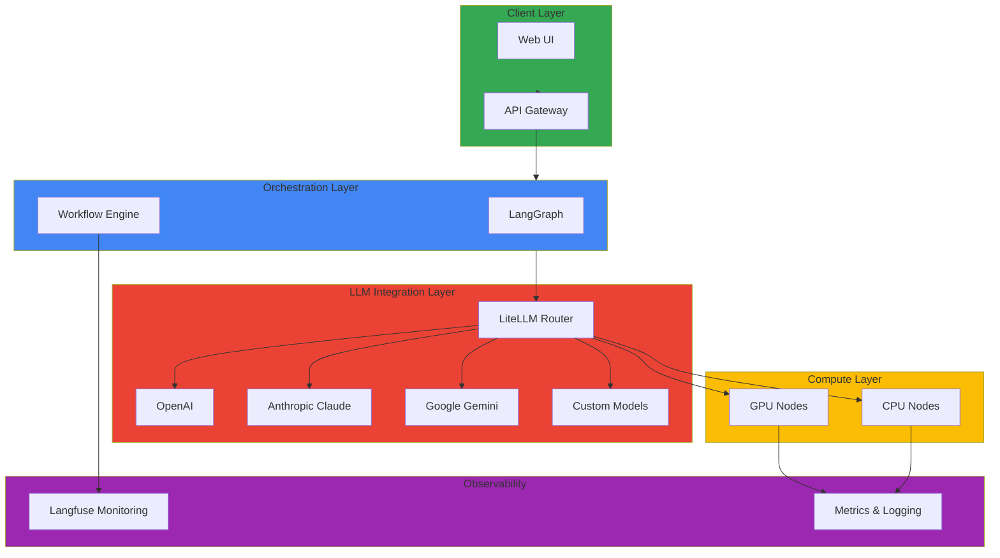

# Agentic AI Platform

Modern generative AI platforms require a comprehensive technology stack that goes beyond simple model serving to encompass complex agent systems, dynamic resource management, and cost-efficient operations. An Agentic AI platform built on Amazon EKS represents a contemporary approach that leverages Kubernetes' powerful orchestration capabilities to meet these demanding requirements. This platform delivers dynamic GPU resource allocation and scaling, intelligent routing across diverse LLM providers, and cost optimization through real-time monitoring as a unified, integrated system.

The core philosophy of the Kubernetes-native approach is to aggressively leverage the open-source ecosystem while maintaining enterprise-grade stability. Model serving through LiteLLM and vLLM, complex agent workflows based on LangGraph, vector database integration via Milvus, and end-to-end pipeline monitoring with Langfuse all operate harmoniously atop a Kubernetes cluster. Particularly when combining Karpenter-based node auto-scaling with the NVIDIA GPU Operator, GPU resources can be dynamically provisioned and released according to workload patterns, dramatically reducing cloud costs.

As practical starting points for production environment construction, AWS provides two essential sample repositories. The GenAI on EKS Starter Kit (aws-samples/sample-genai-on-eks-starter-kit) offers integrated configurations of essential components including LiteLLM, vLLM, SGLang, Langfuse, Milvus, Open WebUI, n8n, Strands Agents, and Agno to support rapid prototyping and development. Meanwhile, Scalable Model Inference and Agentic AI (aws-solutions-library-samples/guidance-for-scalable-model-inference-and-agentic-ai-on-amazon-eks) presents production-grade architectural patterns necessary for building Karpenter auto-scaling, Ray Serve-based distributed inference, LiteLLM gateway, OpenSearch-based RAG systems, and multi-agent systems.

This combination of technology stacks effectively addresses the four core challenges that arise in handling Frontier Model traffic. GPU scheduling and resource isolation ensure stable performance even in multi-tenant environments through MIG and Time-Slicing, while the dynamic routing layer performs intelligent request distribution considering model availability and cost. Agent lifecycle management is declaratively defined through Kagent CRDs, and system-wide observability is secured through Langfuse and Prometheus-based metrics. All of this combines with Kubernetes' self-healing capabilities to complete a platform capable of 24/7 uninterrupted operations.

## Key Documentation (Implementation Order)

### Phase 1: Understanding and Design
- [Technical Challenges and Kubernetes Necessity](./agentic-ai-challenges.md) - Understanding core challenges of Agentic AI platforms
- [Agentic AI Platform Architecture](./agentic-platform-architecture.md) - Overall architecture design

### Phase 2: GPU Infrastructure Configuration
- [GPU Resource Management](./gpu-resource-management.md) - GPU resource settings including MIG, Time-Slicing

### Phase 3: Model Serving (Basic → Advanced)
- [vLLM-based FM Deployment and Performance Optimization](./vllm-model-serving.md) - Basic model serving configuration
- [Ray Serve and vLLM Integration Architecture](./ray-serve-vllm-integration.md) - Distributed serving setup
- [MoE Model Serving](./moe-model-serving.md) - Mixture of Experts model serving
- [NeMo Framework](./nemo-framework.md) - Training and serving framework

### Phase 4: Inference Routing and Gateway
- [Inference Gateway and Dynamic Routing](./inference-gateway-routing.md) - Intelligent request routing

### Phase 5: RAG Data Layer
- [Milvus Vector Database](./milvus-vector-database.md) - Building vector storage

### Phase 6: AI Agent Deployment
- [Kagent Kubernetes Agent Management](./kagent-kubernetes-agents.md) - CRD-based agent management

### Phase 7: Operations and Monitoring
- [Agent Monitoring](./agent-monitoring.md) - Agent status and performance monitoring

### Phase 8: Evaluation and Validation
- [Ragas RAG Evaluation](./ragas-evaluation.md) - RAG pipeline quality evaluation

## 🎯 Learning Objectives

Through this section, you will learn:

- How to build scalable GenAI platforms on EKS
- Integration with multiple LLM providers (OpenAI, Anthropic, Google, etc.)
- Complex AI workflow design and implementation
- Efficient GPU resource utilization and optimization strategy
- Auto-scaling and resource management for AI/ML workloads
- AI model deployment and operations in production environments
- Cost tracking and optimization
- Performance monitoring and analysis

## 🏗️ Architecture Pattern

## 🔧 Key Technologies and Tools

| Technology | Description | Purpose |
|------------|-------------|---------|
| **LiteLLM** | Multi-LLM provider integration | LLM routing and fallback |
| **LangGraph** | AI workflow orchestration | Complex AI workflow implementation |
| **Langfuse** | GenAI application monitoring | Tracking, monitoring, analysis |
| **NVIDIA GPU Operator** | GPU resource management | GPU driver and runtime |
| **Karpenter** | Node auto-scaling | Cost-efficient resource management |
| **Ray** | Distributed machine learning | Large-scale model serving |

## 💡 Core Concepts

### LiteLLM Routing
- **Provider Abstraction**: Use various LLM APIs through unified interface
- **Fallback Mechanism**: Automatically switch to another provider on failure
- **Load Balancing**: Distribute requests across multiple models
- **Cost Optimization**: Automatically select cost-effective models

### LangGraph Workflow
- **State Management**: Clearly manage state at each step
- **Conditional Branching**: Dynamic flow control based on results
- **Parallel Processing**: Concurrent execution of independent tasks
- **Error Handling**: Robust exception handling mechanism

### Langfuse Monitoring
- **Request Tracking**: Record entire process of each API call
- **Cost Analysis**: Track costs by model and project
- **Performance Analysis**: Analyze metrics like response time and accuracy
- **User Feedback**: Collect feedback on generated results

### GPU Resource Optimization

#### MIG (Multi-Instance GPU)
- **GPU Partitioning**: Divide single GPU into multiple instances
- **Resource Isolation**: Provide complete computing isolation
- **Efficiency**: Stable in multi-tenant environments

#### Time-Slicing
- **Time Sharing**: Multiple tasks share GPU time
- **Flexibility**: Suitable for dev/test environments
- **Cost**: Less expensive than MIG but shares performance

## 📊 Performance and Cost Optimization

### Model Selection Criteria
| Model | Performance | Cost | Use Case |
|-------|-------------|------|----------|
| GPT-4 | Highest | High | Complex tasks |
| GPT-4 Turbo | High | Medium | Balanced choice |
| GPT-3.5 Turbo | Medium | Low | Fast response needed |
| Claude 3 Opus | Very High | Very High | High accuracy required |
| Open Source | Varied | Low | Complete control needed |

### Cost Optimization Strategies
- **Prompt Caching**: Cache repeated prompts
- **Batch Processing**: Process non-critical tasks in batches
- **Model Tiering**: Use different models by complexity
- **Context Minimization**: Remove unnecessary tokens

## 🔗 Related Categories

- [Operations & Observability](/docs/operations-observability) - AI/ML workload monitoring
- [Infrastructure Optimization](/docs/infrastructure-optimization) - GPU performance optimization
- [Hybrid Infrastructure](/docs/hybrid-infrastructure) - AI deployment in hybrid environments

---

:::tip Tip
GenAI workloads consume significant GPU resources. To optimize costs, actively use Spot instances and auto-scaling. Also continuously track and monitor costs through Langfuse.
:::

:::info Recommended Learning Path
1. Basic LiteLLM configuration and routing
2. Simple workflow using LangGraph
3. Langfuse monitoring integration
4. GPU resource optimization
5. Complete platform integration and operations
:::

:::warning Caution - Cost Management
Generative AI services can quickly accumulate API call costs. Initially set rate limiting and continuously monitor costs through Langfuse.
:::
