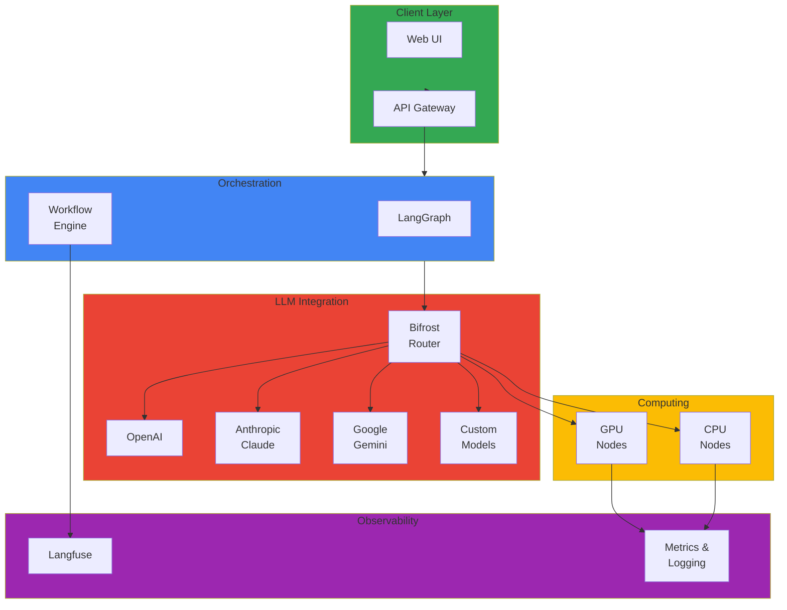

# Agentic AI Platform

> 📅 **Created**: 2025-02-05 | **Updated**: 2026-02-14 | ⏱️ **Reading time**: Approx. 9 minutes

Modern generative AI platforms require a comprehensive technology stack that goes beyond simple model serving to encompass complex agent systems, dynamic resource management, and cost-efficient operations. An Amazon EKS-based Agentic AI Platform is a contemporary approach that leverages Kubernetes' powerful orchestration capabilities to meet these requirements. This platform provides dynamic GPU resource allocation and scaling, intelligent routing between various LLM providers, and cost optimization through real-time monitoring as a single integrated system.

The core philosophy of the Kubernetes-native approach is to actively leverage the open source ecosystem while ensuring enterprise-grade stability. LLM serving through Bifrost and vLLM, non-LLM inference through Triton Inference Server (Embedding, Reranking, STT), complex agent workflows based on LangGraph, vector database integration using Milvus, and full pipeline monitoring through Langfuse all work harmoniously on Kubernetes clusters. In particular, combining node auto-scaling via Karpenter with the NVIDIA GPU Operator enables dramatic cloud cost reduction by dynamically provisioning and releasing GPU resources according to workload patterns.

AWS provides two core sample repositories as practical starting points for production environment construction. The GenAI on EKS Starter Kit (aws-samples/sample-genai-on-eks-starter-kit) provides integrated configurations of essential components including Bifrost, vLLM, SGLang, Langfuse, Milvus, Open WebUI, n8n, Strands Agents, and Agno to support rapid prototyping and development. Meanwhile, Scalable Model Inference and Agentic AI (aws-solutions-library-samples/guidance-for-scalable-model-inference-and-agentic-ai-on-amazon-eks) presents production-grade architectural patterns required for Karpenter auto-scaling, llm-d-based distributed inference, Bifrost gateway, OpenSearch-based RAG systems, and multi-agent system construction.

This combination of technology stacks effectively addresses four core challenges that arise in handling Frontier Model traffic. GPU scheduling and resource isolation ensure stable performance even in multi-tenant environments through MIG and Time-Slicing, while the dynamic routing layer performs intelligent request distribution considering model availability and cost. Agent lifecycle management is declaratively defined through Kagent CRDs, and system-wide observability is secured through Langfuse and Prometheus-based metrics. All of this combines with Kubernetes' self-healing capabilities to complete a platform capable of 24/7 uninterrupted operations.

## Key Documents (Implementation Order)

:::tip Document Completion Status
This section contains 22 documents organized into 4 subcategories.
:::

### [Design & Architecture](./design-architecture/index.md)

- [Technical Challenges](./design-architecture/agentic-ai-challenges.md) — Understanding core challenges
- [AWS Native Platform](./design-architecture/aws-native-agentic-platform.md) — Agent development with managed services
- [EKS-Based Solutions](./design-architecture/agentic-ai-solutions-eks.md) — Open architecture based on open source
- [Platform Architecture](./design-architecture/agentic-platform-architecture.md) — Overall architecture design

### [Model Serving & Inference Infrastructure](./model-serving/index.md)

- [EKS GPU Node Strategy](./model-serving/eks-gpu-node-strategy.md) — Auto Mode + Karpenter + Hybrid Node configuration
- [GPU Resource Management](./model-serving/gpu-resource-management.md) — Karpenter scaling, KEDA, DRA, cost optimization
- [vLLM Model Serving](./model-serving/vllm-model-serving.md) — Basic model serving configuration
- [llm-d Distributed Inference](./model-serving/llm-d-eks-automode.md) — Kubernetes-native distributed inference, Disaggregated Serving
- [MoE Model Serving](./model-serving/moe-model-serving.md) — Mixture of Experts model serving
- [NVIDIA GPU Stack](./model-serving/nvidia-gpu-stack.md) — GPU Operator, DCGM, MIG/Time-Slicing, Dynamo
- [NeMo Framework](./model-serving/nemo-framework.md) — Training and serving framework

### [Gateway & Agents](./gateway-agents/index.md)

- [Inference Gateway](./gateway-agents/inference-gateway-routing.md) — Intelligent request routing
- [Milvus Vector DB](./gateway-agents/milvus-vector-database.md) — Vector store construction
- [Kagent Agent Management](./gateway-agents/kagent-kubernetes-agents.md) — CRD-based agent management
- [Bedrock AgentCore & MCP](./gateway-agents/bedrock-agentcore-mcp.md) — AWS Bedrock agent integration
- [OpenClaw AI Gateway](./gateway-agents/openclaw-ai-gateway.mdx) — OpenClaw + Bifrost Auto-Router + Full Observability
- [LLM Gateway Architecture](./gateway-agents/llm-gateway-architecture.md) — 2-Tier Gateway design and solution selection
- [LLMOps Observability](./gateway-agents/llmops-observability.md) — Langfuse/LangSmith/Helicone comparison guide

### [Operations & MLOps](./operations-mlops/index.md)

- [Agent Monitoring & Operations](./operations-mlops/agent-monitoring.md) — Agent status and performance monitoring
- [Ragas Evaluation](./operations-mlops/ragas-evaluation.md) — RAG pipeline quality evaluation
- [MLOps Pipeline](./operations-mlops/mlops-pipeline-eks.md) — Kubeflow + MLflow + ArgoCD GitOps
- [SageMaker-EKS Integration](./operations-mlops/sagemaker-eks-integration.md) — SageMaker training + EKS serving hybrid

## 🎯 Learning Objectives

Through this section, you will learn:

- Understanding 5 core technical challenges in building Agentic AI platforms
- Methods for building scalable GenAI platforms on EKS
- Integration of multiple LLM providers (OpenAI, Anthropic, Google, etc.)
- Designing and implementing complex AI workflows
- Efficient GPU resource utilization and optimization strategies
- Auto-scaling and resource management for AI/ML workloads
- AI model deployment and operations in production environments
- Utilizing open source tools like Kagent, Kgateway, Milvus, Ragas, NeMo
- Cost tracking and optimization
- Performance monitoring and analysis

## 🏗️ Architecture Patterns

```mermaid
flowchart TB
    subgraph Client["Client Layer"]
        WebUI[Web UI]
        APIGateway[API Gateway]
    end

    subgraph Orchestration["Orchestration"]
        LangGraph[LangGraph]
        Workflow[Workflow<br/>Engine]
    end

    subgraph LLM["LLM Integration"]
        Bifrost[Bifrost<br/>Router]
        OpenAI[OpenAI]
        Anthropic[Anthropic<br/>Claude]
        Google[Google<br/>Gemini]
        Custom[Custom<br/>Models]
    end

    subgraph Compute["Computing"]
        GPU[GPU<br/>Nodes]
        CPU[CPU<br/>Nodes]
    end

    subgraph Observability["Observability"]
        Langfuse[Langfuse]
        Metrics[Metrics &<br/>Logging]
    end

    Client --> APIGateway
    APIGateway --> Orchestration
    Orchestration --> Bifrost
    Bifrost --> OpenAI
    Bifrost --> Anthropic
    Bifrost --> Google
    Bifrost --> Custom
    Bifrost --> GPU
    Bifrost --> CPU
    Workflow --> Langfuse
    GPU --> Metrics
    CPU --> Metrics

    style Client fill:#34a853
    style Orchestration fill:#4285f4
    style LLM fill:#ea4335
    style Compute fill:#fbbc04
    style Observability fill:#9c27b0
```

## 🔧 Key Technologies and Tools

| Technology | Version | Description | Purpose |
| --- | --- | --- | --- |
| **Kagent** | v0.3+ | Kubernetes Agent Management | CRD-based Agent Lifecycle |
| **Kgateway** | v2.0+ | Inference Gateway | Dynamic Routing and Load Balancing |
| **Milvus** | v2.4+ | Vector Database | RAG Pipeline Support |
| **Ragas / DeepEval** | v0.1+ / v1.x | RAG Evaluation Framework | Quality Measurement & CI/CD Integration |
| **NeMo** | v25.02 | LLM Training Framework | Fine-tuning and Optimization |
| **Bifrost** | v1.x | Multi-LLM Provider Integration | LLM Routing and Fallback (Rust-based) |
| **LangGraph** | v0.2+ | AI Workflow Orchestration | Complex AI Workflow Implementation |
| **Langfuse** | v3.x | GenAI Application Monitoring | Tracking, Monitoring, Analytics |
| **NVIDIA GPU Operator** | v24.9+ | GPU Resource Management | GPU Drivers and Runtime |
| **Karpenter** | v1.2+ | Node Auto-scaling | Cost-efficient Resource Management |
| **vLLM** | v0.7.x | High-performance LLM Serving | PagedAttention-based Inference |
| **Triton Inference Server** | v2.x+ | Non-LLM Inference Server | Embedding, Reranking, STT |
| **llm-d** | v0.3+ | Distributed Inference Scheduler | Prefix Caching-aware Routing |
| **MCP/A2A** | v1.0+ | Agent Protocol | Agent Tool Connection & Communication Standard |

## 💡 Core Concepts

### Bifrost Routing

- **Provider Abstraction**: Use various LLM APIs through a unified interface
- **Fallback Mechanism**: Automatically switch to another provider if one fails
- **Load Balancing**: Distribute requests across multiple models
- **Cost Optimization**: Automatically select cost-effective models
- **High Performance**: Rust-based, 50x faster than LiteLLM

### LangGraph Workflows

- **State Management**: Clearly manage state at each step
- **Conditional Branching**: Dynamic flow control based on results
- **Parallel Processing**: Concurrent execution of independent tasks
- **Error Handling**: Reliable exception handling mechanisms

### Langfuse Monitoring

- **Request Tracking**: Record the entire process of each API call
- **Cost Analysis**: Track costs by model and project
- **Performance Analysis**: Analyze metrics like response time and accuracy
- **User Feedback**: Collect feedback on generated results

### GPU Resource Optimization

#### MIG (Multi-Instance GPU)

- **Single GPU Partitioning**: Divide one GPU into multiple instances
- **Resource Isolation**: Provide complete compute isolation
- **Efficiency**: Stable in multi-tenant environments

#### Time-Slicing

- **Time Sharing**: Multiple tasks share GPU time
- **Flexibility**: Suitable for development/test environments
- **Cost**: Cheaper than MIG but shares performance

## 📊 Performance and Cost Optimization

### Model Selection Criteria

| Model | Performance | Cost | Use Case |
|------|------|------|------|
| GPT-4.1 | Highest | Medium | Complex tasks, balanced choice |
| GPT-4o mini | Medium | Low | When fast response needed |
| Claude 4.x Sonnet | Very High | Medium | Coding, analytical tasks |
| Claude 4.x Opus | Very High | Very High | When high accuracy needed |
| Gemini 2.5 | Very High | Medium | Multimodal tasks |
| Open Source (Llama 3) | Varies | Low | When full control needed |

### Cost Optimization Strategies

- **Prompt Caching**: Cache repetitive prompts
- **Batch Processing**: Batch non-business-critical tasks
- **Model Tiering**: Use different models based on complexity
- **Context Minimization**: Remove unnecessary tokens

## 🔗 Related Categories

- [Operations & Observability](/docs/operations-observability) - AI/ML workload monitoring
- [Infrastructure Optimization](/docs/infrastructure-optimization) - GPU performance optimization
- [Hybrid Infrastructure](/docs/hybrid-infrastructure) - AI deployment in hybrid environments

---

:::tip Tip
GenAI workloads consume significant GPU resources, so actively utilize Spot instances and auto-scaling for cost optimization. Also, track costs through Langfuse and monitor continuously.
:::

:::info Recommended Learning Path

**Agentic AI Platform Construction Path:**

1. [Technical Challenges](./design-architecture/agentic-ai-challenges.md) - Understanding core challenges
2. [AWS Native Platform](./design-architecture/aws-native-agentic-platform.md) or [EKS-Based Solutions](./design-architecture/agentic-ai-solutions-eks.md) - Choose approach
3. [Platform Architecture](./design-architecture/agentic-platform-architecture.md) - Architecture design
4. [EKS GPU Node Strategy](./model-serving/eks-gpu-node-strategy.md) - Node provisioning
5. [GPU Resource Management](./model-serving/gpu-resource-management.md) - Karpenter, KEDA, DRA
6. [Inference Gateway](./gateway-agents/inference-gateway-routing.md) - Dynamic routing configuration
7. [Agent Monitoring & Operations](./operations-mlops/agent-monitoring.md) - Operations framework

**GenAI Application Development Path:**

1. [vLLM Model Serving](./model-serving/vllm-model-serving.md) - Inference engine deployment
2. [llm-d Distributed Inference](./model-serving/llm-d-eks-automode.md) - KV Cache-aware routing
3. [Inference Gateway](./gateway-agents/inference-gateway-routing.md) - Traffic routing
4. [Milvus Vector DB](./gateway-agents/milvus-vector-database.md) - RAG data layer
5. [Kagent Agent Management](./gateway-agents/kagent-kubernetes-agents.md) - Agent deployment
6. [Ragas Evaluation](./operations-mlops/ragas-evaluation.md) - Quality evaluation
:::

:::warning Note - Cost Management
Generative AI service API call costs can accumulate quickly. Initially set rate limiting and continuously monitor costs with Langfuse.
:::
