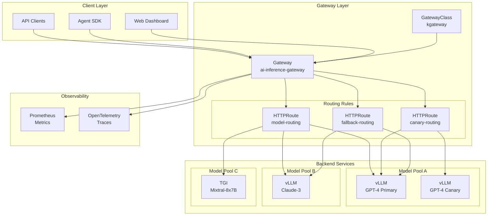
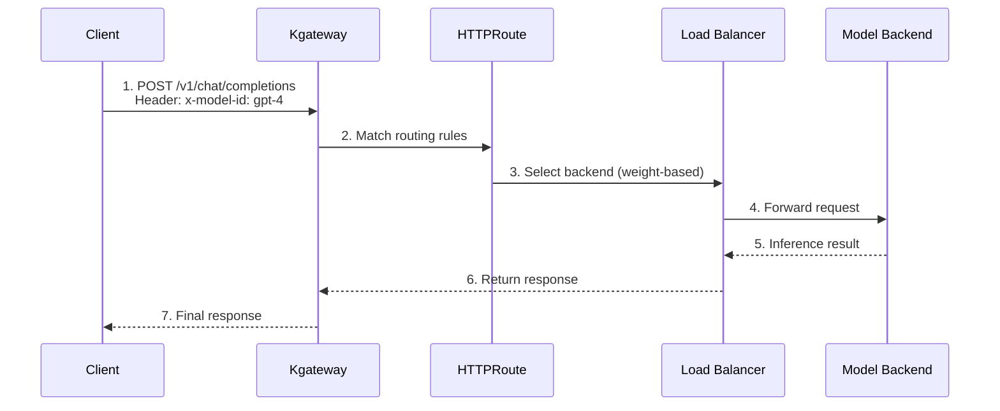

# Inference Gateway and Dynamic Routing

> **Written**: 2025-02-05 | **Reading time**: ~12 min

In large-scale AI model serving environments, efficiently routing and managing inference requests across various models is crucial. This document covers how to configure dynamic routing, load balancing, and failure response strategies for AI model inference requests using Kubernetes Gateway API and Kgateway.

## Overview

### Key Objectives

- **Intelligent Routing**: Select optimal model backend based on request characteristics
- **Traffic Distribution**: Provide stable service through weight-based load balancing
- **Gradual Deployment**: Enable safe model updates through canary and A/B testing
- **High Availability**: Ensure service continuity through fallback and retry policies

---

## Inference Gateway Architecture

### Complete Architecture Diagram



### Component Structure

| Component | Role | Description |
|---------|------|------|
| **GatewayClass** | Gateway implementation definition | Designate Kgateway controller |
| **Gateway** | Entry point definition | Configure listeners, TLS, addresses |
| **HTTPRoute** | Routing rules | Path, header-based routing |
| **Backend** | Model service | vLLM, TGI and other inference servers |

### Traffic Flow



:::info Gateway API Standard
Kgateway implements the Kubernetes Gateway API standard, enabling vendor-neutral configuration. This facilitates migration to other gateway implementations.
:::

---

## Kgateway Installation and Configuration

### Prerequisites

- Kubernetes 1.28 or later
- Helm 3.x
- Gateway API CRD installed

### Install Gateway API CRD

```bash
# Install standard Gateway API CRDs
kubectl apply -f https://github.com/kubernetes-sigs/gateway-api/releases/download/v1.2.0/standard-install.yaml

# Install with experimental features (HTTPRoute filters, etc.)
kubectl apply -f https://github.com/kubernetes-sigs/gateway-api/releases/download/v1.2.0/experimental-install.yaml
```

### Install Kgateway Helm Chart

```bash
# Add Helm repository
helm repo add kgateway https://kgateway-dev.github.io/kgateway/
helm repo update

# Create namespace
kubectl create namespace kgateway-system

# Install Kgateway
helm install kgateway kgateway/kgateway \
  --namespace kgateway-system \
  --set controller.replicaCount=2 \
  --set controller.resources.requests.cpu=500m \
  --set controller.resources.requests.memory=512Mi \
  --set controller.resources.limits.cpu=1000m \
  --set controller.resources.limits.memory=1Gi \
  --set metrics.enabled=true \
  --set metrics.serviceMonitor.enabled=true
```

### Detailed Helm Values Configuration

```yaml
# values.yaml
controller:
  replicaCount: 2

  resources:
    requests:
      cpu: 500m
      memory: 512Mi
    limits:
      cpu: 1000m
      memory: 1Gi

  # High availability configuration
  affinity:
    podAntiAffinity:
      preferredDuringSchedulingIgnoredDuringExecution:
        - weight: 100
          podAffinityTerm:
            labelSelector:
              matchLabels:
                app: kgateway
            topologyKey: kubernetes.io/hostname

# Metrics configuration
metrics:
  enabled: true
  port: 9090
  serviceMonitor:
    enabled: true
    interval: 15s
    labels:
      release: prometheus

# Logging configuration
logging:
  level: info
  format: json

# TLS configuration
tls:
  enabled: true
  certManager:
    enabled: true
    issuerRef:
      name: letsencrypt-prod
      kind: ClusterIssuer
```

---

## GatewayClass and Gateway Configuration

### GatewayClass Definition

Define the gateway implementation.

```yaml
apiVersion: gateway.networking.k8s.io/v1
kind: GatewayClass
metadata:
  name: kgateway
spec:
  controllerName: kgateway.dev/kgateway-controller
  description: "Kgateway for AI inference routing"
  parametersRef:
    group: kgateway.dev
    kind: GatewayClassConfig
    name: kgateway-config
---
apiVersion: kgateway.dev/v1alpha1
kind: GatewayClassConfig
metadata:
  name: kgateway-config
spec:
  # Proxy configuration
  proxy:
    replicas: 3
    resources:
      requests:
        cpu: "1"
        memory: "2Gi"
      limits:
        cpu: "2"
        memory: "4Gi"

  # Connection settings
  connectionSettings:
    maxConnections: 10000
    connectTimeout: 10s
    idleTimeout: 60s
```

### Gateway Resource Definition

```yaml
apiVersion: gateway.networking.k8s.io/v1
kind: Gateway
metadata:
  name: ai-inference-gateway
  namespace: ai-gateway
  annotations:
    # AWS ALB integration
    service.beta.kubernetes.io/aws-load-balancer-type: "external"
    service.beta.kubernetes.io/aws-load-balancer-nlb-target-type: "ip"
    service.beta.kubernetes.io/aws-load-balancer-scheme: "internet-facing"
spec:
  gatewayClassName: kgateway

  listeners:
    # HTTPS listener
    - name: https
      protocol: HTTPS
      port: 443
      hostname: "inference.example.com"
      tls:
        mode: Terminate
        certificateRefs:
          - name: inference-tls-cert
            kind: Secret
      allowedRoutes:
        namespaces:
          from: Selector
          selector:
            matchLabels:
              gateway-access: "true"

    # HTTP listener (for HTTPS redirect)
    - name: http
      protocol: HTTP
      port: 80
      hostname: "inference.example.com"
      allowedRoutes:
        namespaces:
          from: Same

    # Internal gRPC listener
    - name: grpc
      protocol: HTTPS
      port: 8443
      hostname: "inference-grpc.example.com"
      tls:
        mode: Terminate
        certificateRefs:
          - name: inference-grpc-tls-cert
      allowedRoutes:
        kinds:
          - kind: GRPCRoute
```

:::warning TLS Certificate Management
In production environments, use cert-manager to automatically manage TLS certificates. Manual certificate management risks service interruption due to certificate expiration.
:::

---

## Dynamic Routing Configuration

### Header-Based Routing

Route to appropriate model backend based on `x-model-id` header value.

```yaml
apiVersion: gateway.networking.k8s.io/v1
kind: HTTPRoute
metadata:
  name: model-header-routing
  namespace: ai-gateway
spec:
  parentRefs:
    - name: ai-inference-gateway
      namespace: ai-gateway
      sectionName: https

  hostnames:
    - "inference.example.com"

  rules:
    # GPT-4 model routing
    - matches:
        - path:
            type: PathPrefix
            value: /v1/chat/completions
          headers:
            - name: x-model-id
              value: "gpt-4"
      backendRefs:
        - name: vllm-gpt4-service
          namespace: ai-inference
          port: 8000
          weight: 100

    # Claude-3 model routing
    - matches:
        - path:
            type: PathPrefix
            value: /v1/chat/completions
          headers:
            - name: x-model-id
              value: "claude-3"
      backendRefs:
        - name: vllm-claude3-service
          namespace: ai-inference
          port: 8000
          weight: 100

    # Mixtral MoE model routing
    - matches:
        - path:
            type: PathPrefix
            value: /v1/chat/completions
          headers:
            - name: x-model-id
              value: "mixtral-8x7b"
      backendRefs:
        - name: tgi-mixtral-service
          namespace: ai-inference
          port: 8080
          weight: 100
```

### Path-Based Routing

Route to different services based on API path.

```yaml
apiVersion: gateway.networking.k8s.io/v1
kind: HTTPRoute
metadata:
  name: path-based-routing
  namespace: ai-gateway
spec:
  parentRefs:
    - name: ai-inference-gateway
      namespace: ai-gateway

  hostnames:
    - "inference.example.com"

  rules:
    # Chat Completions API
    - matches:
        - path:
            type: PathPrefix
            value: /v1/chat/completions
      backendRefs:
        - name: chat-completion-service
          port: 8000

    # Embeddings API
    - matches:
        - path:
            type: PathPrefix
            value: /v1/embeddings
      backendRefs:
        - name: embedding-service
          port: 8000

    # Completions API (Legacy)
    - matches:
        - path:
            type: PathPrefix
            value: /v1/completions
      backendRefs:
        - name: completion-service
          port: 8000

    # Health Check
    - matches:
        - path:
            type: Exact
            value: /health
      backendRefs:
        - name: health-check-service
          port: 8080
```

### Advanced Composite Routing

Advanced routing rules combining multiple conditions.

```yaml
apiVersion: gateway.networking.k8s.io/v1
kind: HTTPRoute
metadata:
  name: advanced-routing
  namespace: ai-gateway
spec:
  parentRefs:
    - name: ai-inference-gateway

  rules:
    # Premium customers + GPT-4 requests → dedicated backend
    - matches:
        - path:
            type: PathPrefix
            value: /v1/chat/completions
          headers:
            - name: x-model-id
              value: "gpt-4"
            - name: x-customer-tier
              value: "premium"
      backendRefs:
        - name: vllm-gpt4-premium
          port: 8000

    # Standard customers + GPT-4 requests → shared backend
    - matches:
        - path:
            type: PathPrefix
            value: /v1/chat/completions
          headers:
            - name: x-model-id
              value: "gpt-4"
            - name: x-customer-tier
              value: "standard"
      backendRefs:
        - name: vllm-gpt4-shared
          port: 8000
```

---

## Load Balancing Strategies

### Weight-Based Traffic Distribution

Distribute traffic between model versions by weight.

```yaml
apiVersion: gateway.networking.k8s.io/v1
kind: HTTPRoute
metadata:
  name: weighted-routing
  namespace: ai-gateway
spec:
  parentRefs:
    - name: ai-inference-gateway

  rules:
    - matches:
        - path:
            type: PathPrefix
            value: /v1/chat/completions
          headers:
            - name: x-model-id
              value: "gpt-4"
      backendRefs:
        # Primary backend: 80% traffic
        - name: vllm-gpt4-v1
          port: 8000
          weight: 80
        # Secondary backend: 20% traffic
        - name: vllm-gpt4-v2
          port: 8000
          weight: 20
```

### A/B Testing Routing

Expose new model version to specific user groups only.

```yaml
apiVersion: gateway.networking.k8s.io/v1
kind: HTTPRoute
metadata:
  name: ab-test-routing
  namespace: ai-gateway
spec:
  parentRefs:
    - name: ai-inference-gateway

  rules:
    # A/B test group A (baseline model)
    - matches:
        - path:
            type: PathPrefix
            value: /v1/chat/completions
          headers:
            - name: x-ab-test-group
              value: "control"
      backendRefs:
        - name: vllm-model-baseline
          port: 8000

    # A/B test group B (new model)
    - matches:
        - path:
            type: PathPrefix
            value: /v1/chat/completions
          headers:
            - name: x-ab-test-group
              value: "experiment"
      backendRefs:
        - name: vllm-model-new
          port: 8000
```

### Canary Deployment

Gradually roll out new model version.

```yaml
apiVersion: gateway.networking.k8s.io/v1
kind: HTTPRoute
metadata:
  name: canary-deployment
  namespace: ai-gateway
  annotations:
    # Track canary deployment stage
    deployment.kubernetes.io/canary-weight: "10"
spec:
  parentRefs:
    - name: ai-inference-gateway

  rules:
    - matches:
        - path:
            type: PathPrefix
            value: /v1/chat/completions
          headers:
            - name: x-model-id
              value: "gpt-4"
      backendRefs:
        # Stable version: 90%
        - name: vllm-gpt4-stable
          port: 8000
          weight: 90
        # Canary version: 10%
        - name: vllm-gpt4-canary
          port: 8000
          weight: 10
```

:::tip Canary Deployment Strategy

1. **Initial Stage**: Start with 5-10% traffic
2. **Monitoring**: Check error rate, latency, quality metrics
3. **Gradual Increase**: Without issues, increase to 25% → 50% → 75% → 100%
4. **Rollback Ready**: Instantly rollback to 0% if issues arise

:::

### Canary Deployment Timeline Example

```mermaid
gantt
    title Canary Deployment Timeline
    dateFormat  HH:mm
    axisFormat %H:%M

    section Traffic Ratio
    Canary 10%     :a1, 00:00, 30m
    Canary 25%     :a2, after a1, 30m
    Canary 50%     :a3, after a2, 60m
    Canary 75%     :a4, after a3, 60m
    Canary 100%    :a5, after a4, 60m

    section Monitoring
    Check Metrics  :b1, 00:00, 300m
```



---

## Failure Response Configuration

### Fallback Configuration

Automatically switch to alternate backend when primary fails.

```yaml
apiVersion: gateway.networking.k8s.io/v1
kind: HTTPRoute
metadata:
  name: fallback-routing
  namespace: ai-gateway
spec:
  parentRefs:
    - name: ai-inference-gateway

  rules:
    - matches:
        - path:
            type: PathPrefix
            value: /v1/chat/completions
          headers:
            - name: x-model-id
              value: "gpt-4"
      backendRefs:
        # Primary backend
        - name: vllm-gpt4-primary
          port: 8000
          weight: 100
      # Fallback configuration via BackendLBPolicy
---
apiVersion: gateway.networking.k8s.io/v1alpha2
kind: BackendLBPolicy
metadata:
  name: gpt4-fallback-policy
  namespace: ai-gateway
spec:
  targetRefs:
    - group: ""
      kind: Service
      name: vllm-gpt4-primary
  sessionPersistence:
    sessionName: "model-session"
    type: Cookie
  # Specify fallback backend
  default:
    backendRef:
      name: vllm-gpt4-fallback
      port: 8000
```

### Timeout Configuration

Set timeouts for inference requests.

```yaml
apiVersion: gateway.networking.k8s.io/v1
kind: HTTPRoute
metadata:
  name: timeout-config
  namespace: ai-gateway
spec:
  parentRefs:
    - name: ai-inference-gateway

  rules:
    - matches:
        - path:
            type: PathPrefix
            value: /v1/chat/completions
      backendRefs:
        - name: vllm-service
          port: 8000
      timeouts:
        # Request timeout (total request processing time)
        request: 120s
        # Backend connection timeout
        backendRequest: 60s
```

### Retry Policy

Configure automatic retries for transient failures.

```yaml
apiVersion: gateway.networking.k8s.io/v1
kind: HTTPRoute
metadata:
  name: retry-policy
  namespace: ai-gateway
spec:
  parentRefs:
    - name: ai-inference-gateway

  rules:
    - matches:
        - path:
            type: PathPrefix
            value: /v1/chat/completions
      backendRefs:
        - name: vllm-service
          port: 8000
      # Retry configuration (Kgateway extension)
      filters:
        - type: ExtensionRef
          extensionRef:
            group: kgateway.dev
            kind: RetryPolicy
            name: inference-retry-policy
---
apiVersion: kgateway.dev/v1alpha1
kind: RetryPolicy
metadata:
  name: inference-retry-policy
  namespace: ai-gateway
spec:
  # Maximum retry attempts
  numRetries: 3

  # Retry conditions
  retryOn:
    - "5xx"
    - "reset"
    - "connect-failure"
    - "retriable-4xx"

  # Per-try timeout
  perTryTimeout: 30s

  # Backoff configuration
  retryBackOff:
    baseInterval: 100ms
    maxInterval: 1s
```

### Circuit Breaker Configuration

Temporarily block backend on consecutive failures.

```yaml
apiVersion: kgateway.dev/v1alpha1
kind: CircuitBreakerPolicy
metadata:
  name: inference-circuit-breaker
  namespace: ai-gateway
spec:
  targetRefs:
    - group: ""
      kind: Service
      name: vllm-gpt4-service

  # Maximum concurrent connections
  maxConnections: 1000

  # Maximum pending requests
  maxPendingRequests: 100

  # Maximum concurrent requests
  maxRequests: 1000

  # Consecutive failure threshold
  consecutiveErrors: 5

  # Block duration
  interval: 10s

  # Test requests after unblocking
  maxEjectionPercent: 50
```

:::danger Failure Response Configuration Caution

- **Timeout Setting**: LLM inference can be time-consuming; set adequate timeout
- **Retry Limits**: Unlimited retries can cause system overload
- **Circuit Breaker**: Too sensitive settings may block normal traffic

:::

---

## Monitoring and Observability

### Prometheus Metrics

Key metrics exposed by Kgateway.

| Metric | Description | Usage |
|--------|------|------|
| `kgateway_requests_total` | Total request count | Traffic monitoring |
| `kgateway_request_duration_seconds` | Request processing time | Latency analysis |
| `kgateway_upstream_rq_xx` | Backend response codes | Error tracking |
| `kgateway_upstream_cx_active` | Active connections | Capacity planning |
| `kgateway_retry_count` | Retry count | Stability analysis |

### ServiceMonitor Configuration

```yaml
apiVersion: monitoring.coreos.com/v1
kind: ServiceMonitor
metadata:
  name: kgateway-metrics
  namespace: monitoring
spec:
  selector:
    matchLabels:
      app: kgateway
  namespaceSelector:
    matchNames:
      - kgateway-system
  endpoints:
    - port: metrics
      interval: 15s
      path: /metrics
```

### Grafana Dashboard Query Examples

```promql
# Requests per second (RPS)
sum(rate(kgateway_requests_total[5m])) by (route)

# P99 latency
histogram_quantile(0.99,
  sum(rate(kgateway_request_duration_seconds_bucket[5m])) by (le, route)
)

# Error rate
sum(rate(kgateway_upstream_rq_5xx[5m])) /
sum(rate(kgateway_requests_total[5m])) * 100

# Active connections by backend
sum(kgateway_upstream_cx_active) by (upstream_cluster)
```

### Alert Rules

```yaml
apiVersion: monitoring.coreos.com/v1
kind: PrometheusRule
metadata:
  name: kgateway-alerts
  namespace: monitoring
spec:
  groups:
    - name: kgateway-alerts
      rules:
        - alert: HighErrorRate
          expr: |
            sum(rate(kgateway_upstream_rq_5xx[5m])) /
            sum(rate(kgateway_requests_total[5m])) > 0.05
          for: 5m
          labels:
            severity: critical
          annotations:
            summary: "Inference Gateway error rate exceeds 5%"
            description: "Error rate in last 5m is {{ $value | humanizePercentage }}"

        - alert: HighLatency
          expr: |
            histogram_quantile(0.99,
              sum(rate(kgateway_request_duration_seconds_bucket[5m])) by (le)
            ) > 30
          for: 5m
          labels:
            severity: warning
          annotations:
            summary: "Inference Gateway P99 latency exceeds 30s"

        - alert: CircuitBreakerOpen
          expr: kgateway_circuit_breaker_open == 1
          for: 1m
          labels:
            severity: critical
          annotations:
            summary: "Circuit breaker activated"
            description: "Circuit breaker for {{ $labels.upstream_cluster }} is open"
```

---

## Operational Best Practices

### Routing Rule Management

1. **Version Control**: Manage HTTPRoutes with Git for change tracking
2. **Namespace Separation**: Separate namespaces per environment (dev/staging/prod)
3. **Labeling**: Use consistent labeling for easy resource management

### Performance Optimization

```yaml
# Connection pool optimization
apiVersion: kgateway.dev/v1alpha1
kind: ConnectionPoolSettings
metadata:
  name: inference-connection-pool
spec:
  targetRefs:
    - kind: Service
      name: vllm-service
  tcp:
    maxConnections: 1000
    connectTimeout: 10s
  http:
    h2UpgradePolicy: UPGRADE
    maxRequestsPerConnection: 100
    maxRetries: 3
```

### Security Configuration

```yaml
# Rate Limiting
apiVersion: kgateway.dev/v1alpha1
kind: RateLimitPolicy
metadata:
  name: inference-rate-limit
spec:
  targetRefs:
    - kind: HTTPRoute
      name: model-routing
  local:
    tokenBucket:
      maxTokens: 1000
      tokensPerFill: 100
      fillInterval: 1s
  # Per-tenant rate limits
  descriptors:
    - entries:
        - key: x-tenant-id
      limit:
        requestsPerUnit: 100
        unit: MINUTE
```

---

## Summary

Inference Gateway is a core component for traffic management in AI model serving environments.

### Key Takeaways

1. **Kubernetes Gateway API**: Standard-based configuration ensures portability
2. **Dynamic Routing**: Flexible header and path-based routing rules
3. **Load Balancing**: Weight-based traffic distribution supports gradual deployment
4. **Failure Response**: Timeouts, retries, and circuit breakers ensure reliability
5. **Observability**: Real-time monitoring via Prometheus metrics

### Next Steps

- [GPU Resource Management](./gpu-resource-management.md) - Dynamic resource allocation strategies
- [MoE Model Serving](./moe-model-serving.md) - Deploying Mixture of Experts models
- [Agent Monitoring](./agent-monitoring.md) - LangFuse integration guide

---

## References

- [Kubernetes Gateway API Official Documentation](https://gateway-api.sigs.k8s.io/)
- [Kgateway Official Documentation](https://kgateway.dev/docs/)
- [vLLM Official Documentation](https://docs.vllm.ai/)
- [Envoy Proxy Documentation](https://www.envoyproxy.io/docs/)
