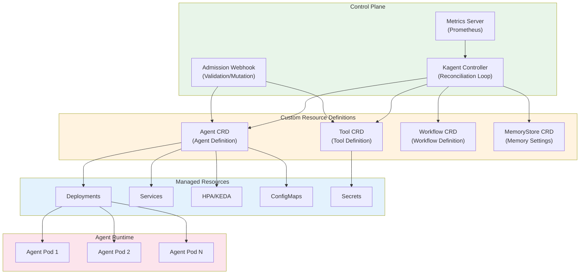
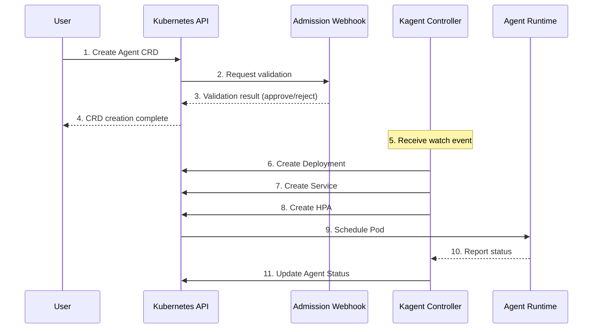
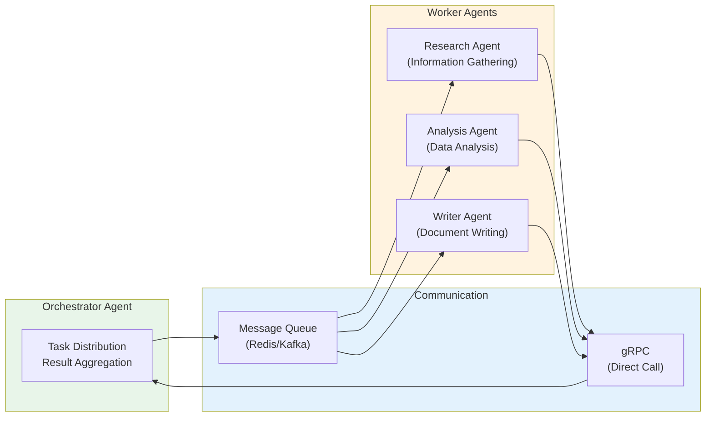

# Kagent - Kubernetes AI Agent Management

This document covers how to efficiently deploy and manage AI agents in Kubernetes environments using Kagent. Kagent is an open-source tool based on the Kubernetes Operator pattern that enables declarative management of the complete lifecycle of AI agents.

## Overview

Kagent is an open-source project for managing AI agents in a Kubernetes-native manner. Through Custom Resource Definitions (CRD), it allows declarative definition of agents, tools, and workflows, which the Operator then automatically deploys and manages.

### Key Features

- **Declarative Agent Management**: YAML-based agent definition and deployment
- **Tool Registry**: Centrally manage tools that agents can use via CRD
- **Auto-scaling**: Dynamic expansion through HPA/KEDA integration
- **Multi-Agent Orchestration**: Agent collaboration for complex workflows
- **Observability Integration**: Native integration with LangFuse and OpenTelemetry

:::info Target Audience
This document targets Kubernetes administrators, platform engineers, and MLOps engineers. Basic understanding of Kubernetes concepts (Pod, Deployment, CRD) is required.
:::

## Kagent Architecture

Kagent follows the Kubernetes Operator pattern and consists of Controller, CRD, and Webhook components.




### Component Description

| Component | Role | Description |
| -------- | ---- | ---- |
| **Kagent Controller** | Reconciliation loop | Detect CRD changes and reconcile resources to desired state |
| **Admission Webhook** | Validation/Mutation | Validate and set defaults on CRD creation/modification |
| **Metrics Server** | Metrics collection | Expose agent state and performance metrics |
| **Agent CRD** | Agent definition | Spec, model, and tool configuration for AI agents |
| **Tool CRD** | Tool definition | Define tools (API, search, etc.) for agent use |
| **Workflow CRD** | Workflow definition | Define multi-agent collaboration workflows |

### Component Interaction



## Kagent Installation

### Prerequisites

- Kubernetes cluster (v1.25 or later)
- kubectl CLI tool
- Helm v3 (for Helm installation)
- cert-manager (for Webhook TLS certificate management)

:::warning cert-manager Required
Kagent's Admission Webhook requires TLS certificates. cert-manager must be installed on the cluster before installation.
:::


### Helm Chart Installation

Helm installation is the recommended method.

#### 1. Add Helm Repository

```bash
# Add Kagent Helm repository
helm repo add kagent https://kagent-dev.github.io/kagent
helm repo update

# Check available versions
helm search repo kagent --versions
```

#### 2. Create Namespace

```bash
# Create Kagent system namespace
kubectl create namespace kagent-system

# Create namespace for agent deployment
kubectl create namespace ai-agents
```

#### 3. Configure values.yaml

```yaml
# values.yaml
controller:
  # Controller replica count (high availability)
  replicaCount: 2

  # Resource settings
  resources:
    requests:
      cpu: 100m
      memory: 128Mi
    limits:
      cpu: 500m
      memory: 512Mi

  # Log level
  logLevel: info

  # Metrics settings
  metrics:
    enabled: true
    port: 8080

webhook:
  # Enable webhook
  enabled: true

  # Certificate settings (use cert-manager)
  certManager:
    enabled: true
    issuerRef:
      name: kagent-selfsigned-issuer
      kind: Issuer

# Monitoring settings
monitoring:
  # Create ServiceMonitor (Prometheus Operator)
  serviceMonitor:
    enabled: true
    namespace: observability
    interval: 30s

# RBAC settings
rbac:
  create: true

# Service account
serviceAccount:
  create: true
  name: kagent-controller

# Node selector
nodeSelector:
  kubernetes.io/os: linux

# Tolerations
tolerations: []

# Affinity
affinity:
  podAntiAffinity:
    preferredDuringSchedulingIgnoredDuringExecution:
      - weight: 100
        podAffinityTerm:
          labelSelector:
            matchExpressions:
              - key: app.kubernetes.io/name
                operator: In
                values:
                  - kagent
          topologyKey: kubernetes.io/hostname
```

#### 4. Execute Helm Installation

```bash
# Install Kagent
helm install kagent kagent/kagent \
  --namespace kagent-system \
  --values values.yaml \
  --wait

# Check installation status
helm status kagent -n kagent-system
```


### Manifest Installation

Alternatively, apply manifests directly without Helm.

#### 1. Install CRDs

```bash
# Download and apply CRD manifests
kubectl apply -f https://github.com/kagent-dev/kagent/releases/latest/download/crds.yaml

# Verify CRD installation
kubectl get crds | grep kagent
```

Expected output:

```text
agents.kagent.dev                    2025-02-05T00:00:00Z
tools.kagent.dev                     2025-02-05T00:00:00Z
workflows.kagent.dev                 2025-02-05T00:00:00Z
memorystores.kagent.dev              2025-02-05T00:00:00Z
```

#### 2. Deploy Controller

```yaml
# kagent-controller.yaml
apiVersion: v1
kind: Namespace
metadata:
  name: kagent-system
---
apiVersion: v1
kind: ServiceAccount
metadata:
  name: kagent-controller
  namespace: kagent-system
---
apiVersion: rbac.authorization.k8s.io/v1
kind: ClusterRole
metadata:
  name: kagent-controller-role
rules:
  - apiGroups: ["kagent.dev"]
    resources: ["agents", "tools", "workflows", "memorystores"]
    verbs: ["*"]
  - apiGroups: ["kagent.dev"]
    resources: ["agents/status", "workflows/status"]
    verbs: ["get", "update", "patch"]
  - apiGroups: ["apps"]
    resources: ["deployments"]
    verbs: ["*"]
  - apiGroups: [""]
    resources: ["services", "configmaps", "secrets", "pods"]
    verbs: ["*"]
  - apiGroups: ["autoscaling"]
    resources: ["horizontalpodautoscalers"]
    verbs: ["*"]
  - apiGroups: ["keda.sh"]
    resources: ["scaledobjects"]
    verbs: ["*"]
---
apiVersion: rbac.authorization.k8s.io/v1
kind: ClusterRoleBinding
metadata:
  name: kagent-controller-binding
roleRef:
  apiGroup: rbac.authorization.k8s.io
  kind: ClusterRole
  name: kagent-controller-role
subjects:
  - kind: ServiceAccount
    name: kagent-controller
    namespace: kagent-system
---
apiVersion: apps/v1
kind: Deployment
metadata:
  name: kagent-controller
  namespace: kagent-system
spec:
  replicas: 2
  selector:
    matchLabels:
      app: kagent-controller
  template:
    metadata:
      labels:
        app: kagent-controller
    spec:
      serviceAccountName: kagent-controller
      containers:
        - name: controller
          image: ghcr.io/kagent-dev/kagent-controller:latest
          args:
            - --leader-elect=true
            - --metrics-bind-address=:8080
            - --health-probe-bind-address=:8081
          ports:
            - containerPort: 8080
              name: metrics
            - containerPort: 8081
              name: health
          resources:
            requests:
              cpu: 100m
              memory: 128Mi
            limits:
              cpu: 500m
              memory: 512Mi
          livenessProbe:
            httpGet:
              path: /healthz
              port: 8081
            initialDelaySeconds: 15
            periodSeconds: 20
          readinessProbe:
            httpGet:
              path: /readyz
              port: 8081
            initialDelaySeconds: 5
            periodSeconds: 10
```

```bash
# Deploy controller
kubectl apply -f kagent-controller.yaml
```


### Installation Verification

Verify installation status after completion.

```bash
# Check controller Pod status
kubectl get pods -n kagent-system

# Expected output:
# NAME                                 READY   STATUS    RESTARTS   AGE
# kagent-controller-5d4f6b7c8d-abc12   1/1     Running   0          2m
# kagent-controller-5d4f6b7c8d-def34   1/1     Running   0          2m

# Verify CRDs
kubectl get crds | grep kagent.dev

# Check controller logs
kubectl logs -n kagent-system -l app=kagent-controller --tail=50

# Verify webhook status (for Helm installation)
kubectl get validatingwebhookconfigurations | grep kagent
kubectl get mutatingwebhookconfigurations | grep kagent
```

:::tip Installation Troubleshooting
If controller fails to start:

1. Check events: `kubectl describe pod -n kagent-system <pod-name>`
2. Verify RBAC permissions are correct
3. Verify cert-manager is functioning properly (if using webhooks)
:::

## Agent CRD Definition

Agent CRD declaratively defines all agent configuration.

### Agent Resource Spec

```yaml
apiVersion: kagent.dev/v1alpha1
kind: Agent
metadata:
  name: customer-support-agent
  namespace: ai-agents
  labels:
    app: customer-support
    team: support
    environment: production
spec:
  # Agent basic information
  displayName: "Customer Support Agent"
  description: "AI agent that responds to customer inquiries and creates tickets"

  # Model configuration
  model:
    provider: openai          # openai, anthropic, bedrock, vllm
    name: gpt-4-turbo
    endpoint: ""              # Custom endpoint (vLLM, etc.)
    temperature: 0.7
    maxTokens: 4096
    topP: 0.9
    frequencyPenalty: 0.0
    presencePenalty: 0.0
    # API key reference
    apiKeySecretRef:
      name: openai-api-key
      key: api-key

  # System prompt
  systemPrompt: |
    You are a helpful and professional customer support agent.

    ## Role
    - Provide accurate and helpful answers to customer inquiries
    - Search knowledge base when needed
    - Create tickets for unresolved issues

    ## Guidelines
    - Always maintain a polite and empathetic tone
    - Be honest about what you don't know
    - Guide through verification when sensitive information is requested

  # List of tools to use
  tools:
    - name: search-knowledge-base
    - name: create-ticket
    - name: get-customer-info

  # Memory configuration
  memory:
    type: redis
    config:
      host: redis-master.ai-data.svc.cluster.local
      port: 6379
      database: 0
      ttl: 3600           # Session TTL (seconds)
      maxHistory: 50      # Maximum conversation history
    secretRef:
      name: redis-credentials
      key: password

  # Scaling configuration
  scaling:
    minReplicas: 2
    maxReplicas: 10
    metrics:
      - type: cpu
        target:
          type: Utilization
          averageUtilization: 70
      - type: memory
        target:
          type: Utilization
          averageUtilization: 80
    # KEDA scaling (optional)
    keda:
      enabled: true
      triggers:
        - type: prometheus
          metadata:
            serverAddress: http://prometheus.observability.svc:9090
            metricName: agent_active_sessions
            threshold: "50"
            query: sum(agent_active_sessions{agent="customer-support"})

  # Resource limits
  resources:
    requests:
      memory: "512Mi"
      cpu: "250m"
    limits:
      memory: "1Gi"
      cpu: "500m"

  # Environment variables
  env:
    - name: LOG_LEVEL
      value: "info"
    - name: LANGFUSE_ENABLED
      value: "true"
    - name: LANGFUSE_HOST
      value: "http://langfuse.observability.svc:3000"

  # Observability configuration
  observability:
    tracing:
      enabled: true
      provider: langfuse
      sampleRate: 1.0
    metrics:
      enabled: true
      port: 9090

  # Health check
  healthCheck:
    enabled: true
    path: /health
    port: 8080
    initialDelaySeconds: 10
    periodSeconds: 30
```


### Tool CRD Definition

Tool CRD defines tools that agents can use.

```yaml
apiVersion: kagent.dev/v1alpha1
kind: Tool
metadata:
  name: search-knowledge-base
  namespace: ai-agents
  labels:
    category: retrieval
spec:
  # Tool type: api, retrieval, code, human
  type: retrieval

  # Tool description (referenced by LLM for tool selection)
  displayName: "Knowledge Base Search"
  description: |
    Search company knowledge base for relevant documents.
    Use to find information for answering customer inquiries.

  # Retrieval configuration
  retrieval:
    vectorStore:
      type: milvus
      host: milvus.ai-data.svc.cluster.local
      port: 19530
      collection: support-knowledge
    embedding:
      provider: openai
      model: text-embedding-3-small
      dimension: 1536
    search:
      topK: 5
      scoreThreshold: 0.7
      filter: ""

  # Define input parameters
  parameters:
    - name: query
      type: string
      required: true
      description: "Search question or keywords"
    - name: category
      type: string
      required: false
      description: "Filter document category (e.g., faq, manual, policy)"
      enum: ["faq", "manual", "policy", "all"]
      default: "all"

  # Output schema
  output:
    type: array
    items:
      type: object
      properties:
        content:
          type: string
          description: "Document content"
        score:
          type: number
          description: "Similarity score"
        metadata:
          type: object
          description: "Document metadata"
---
apiVersion: kagent.dev/v1alpha1
kind: Tool
metadata:
  name: create-ticket
  namespace: ai-agents
  labels:
    category: api
spec:
  type: api

  displayName: "Create Ticket"
  description: |
    Create a customer inquiry ticket.
    Use when the agent cannot resolve the issue directly.

  # API configuration
  api:
    endpoint: http://ticketing-service.support.svc:8080/api/v1/tickets
    method: POST
    timeout: 30s
    retries: 3
    headers:
      Content-Type: application/json
    # Authentication settings
    authentication:
      type: bearer
      secretRef:
        name: ticketing-api-token
        key: token

  parameters:
    - name: title
      type: string
      required: true
      description: "Ticket title"
      maxLength: 200
    - name: description
      type: string
      required: true
      description: "Detailed problem description"
    - name: priority
      type: string
      required: false
      description: "Priority level"
      enum: ["low", "medium", "high", "urgent"]
      default: "medium"
    - name: category
      type: string
      required: true
      description: "Inquiry category"
      enum: ["billing", "technical", "general", "complaint"]
    - name: customer_id
      type: string
      required: true
      description: "Customer ID"

  output:
    type: object
    properties:
      ticket_id:
        type: string
        description: "Created ticket ID"
      status:
        type: string
        description: "Ticket status"
      created_at:
        type: string
        description: "Creation time"
---
apiVersion: kagent.dev/v1alpha1
kind: Tool
metadata:
  name: get-customer-info
  namespace: ai-agents
  labels:
    category: api
spec:
  type: api

  displayName: "Get Customer Info"
  description: |
    Retrieve customer information by ID.
    Use when customer verification is needed.

  api:
    endpoint: http://customer-service.crm.svc:8080/api/v1/customers/{customer_id}
    method: GET
    timeout: 10s
    authentication:
      type: bearer
      secretRef:
        name: crm-api-token
        key: token

  parameters:
    - name: customer_id
      type: string
      required: true
      description: "Customer ID to retrieve"
      pattern: "^[A-Z0-9]{8}$"

  output:
    type: object
    properties:
      id:
        type: string
      name:
        type: string
      email:
        type: string
      tier:
        type: string
      created_at:
        type: string
```


### Memory Configuration

Memory configuration to store agent conversation context and state.

```yaml
apiVersion: kagent.dev/v1alpha1
kind: MemoryStore
metadata:
  name: agent-memory-redis
  namespace: ai-agents
spec:
  # Memory type: redis, postgres, in-memory
  type: redis

  # Redis configuration
  redis:
    host: redis-master.ai-data.svc.cluster.local
    port: 6379
    database: 0
    # TLS settings
    tls:
      enabled: true
      secretRef:
        name: redis-tls-cert
    # Authentication
    auth:
      secretRef:
        name: redis-credentials
        passwordKey: password

  # Memory policy
  policy:
    # Session TTL
    sessionTTL: 3600
    # Maximum conversation history
    maxConversationHistory: 100
    # Memory compression (summarize long conversations)
    compression:
      enabled: true
      threshold: 50
      model: gpt-3.5-turbo
    # Long-term memory settings
    longTermMemory:
      enabled: true
      vectorStore:
        type: milvus
        collection: agent-memories
```

### Scaling Configuration

Detailed scaling settings for agent auto-scaling.

```yaml
# HPA-based scaling
scaling:
  minReplicas: 2
  maxReplicas: 20

  # Scaling behavior settings
  behavior:
    scaleDown:
      stabilizationWindowSeconds: 300
      policies:
        - type: Percent
          value: 10
          periodSeconds: 60
    scaleUp:
      stabilizationWindowSeconds: 0
      policies:
        - type: Percent
          value: 100
          periodSeconds: 15
        - type: Pods
          value: 4
          periodSeconds: 15
      selectPolicy: Max

  # Metric-based scaling
  metrics:
    - type: Resource
      resource:
        name: cpu
        target:
          type: Utilization
          averageUtilization: 70
    - type: Resource
      resource:
        name: memory
        target:
          type: Utilization
          averageUtilization: 80
    # Custom metrics
    - type: Pods
      pods:
        metric:
          name: agent_requests_per_second
        target:
          type: AverageValue
          averageValue: "100"
```

## Agent Lifecycle Management

### Agent Deployment Procedure

#### 1. Preparation

```bash
# Create namespace
kubectl create namespace ai-agents

# Create API key secret
kubectl create secret generic openai-api-key \
  --namespace ai-agents \
  --from-literal=api-key='sk-your-api-key-here'

# Create Redis credentials secret
kubectl create secret generic redis-credentials \
  --namespace ai-agents \
  --from-literal=password='your-redis-password'
```

#### 2. Deploy Tool Resources

```bash
# Apply Tool CRDs
kubectl apply -f tools/search-knowledge-base.yaml
kubectl apply -f tools/create-ticket.yaml
kubectl apply -f tools/get-customer-info.yaml

# Check Tool status
kubectl get tools -n ai-agents
```

#### 3. Deploy Agent Resource

```bash
# Apply Agent CRD
kubectl apply -f agents/customer-support-agent.yaml

# Check deployment status
kubectl get agents -n ai-agents

# Check detailed status
kubectl describe agent customer-support-agent -n ai-agents
```

#### 4. Verify Deployment

```bash
# Check created resources
kubectl get deployments -n ai-agents
kubectl get services -n ai-agents
kubectl get hpa -n ai-agents

# Check Pod status
kubectl get pods -n ai-agents -l app=customer-support-agent

# Check logs
kubectl logs -n ai-agents -l app=customer-support-agent --tail=100

# Test agent endpoint
kubectl port-forward svc/customer-support-agent 8080:8080 -n ai-agents

# Test in another terminal
curl -X POST http://localhost:8080/chat \
  -H "Content-Type: application/json" \
  -d '{"message": "Hello, I have a billing question."}'
```


### Update Procedure

Procedure for updating agent configuration.

#### Update and Apply Configuration

```bash
# Check current configuration
kubectl get agent customer-support-agent -n ai-agents -o yaml

# Edit configuration (uses default editor)
kubectl edit agent customer-support-agent -n ai-agents

# Or modify file and reapply
kubectl apply -f agents/customer-support-agent.yaml
```

#### Monitor Rolling Update

```bash
# Monitor update status
kubectl rollout status deployment/customer-support-agent -n ai-agents

# Check Pod replacement status
kubectl get pods -n ai-agents -l app=customer-support-agent -w

# Check events
kubectl get events -n ai-agents --sort-by='.lastTimestamp' | grep customer-support
```

#### Canary Deployment (Optional)

```yaml
apiVersion: kagent.dev/v1alpha1
kind: Agent
metadata:
  name: customer-support-agent-canary
  namespace: ai-agents
  labels:
    app: customer-support
    version: canary
spec:
  # Test with new model or configuration
  model:
    provider: openai
    name: gpt-4o  # New model
    temperature: 0.5

  # Test with minimal replicas
  scaling:
    minReplicas: 1
    maxReplicas: 2

  # Rest of configuration is same...
```

### Rollback Procedure

Procedure to roll back to previous version if issues occur.

#### Deployment Rollback

```bash
# Check rollout history
kubectl rollout history deployment/customer-support-agent -n ai-agents

# Check specific revision details
kubectl rollout history deployment/customer-support-agent -n ai-agents --revision=2

# Rollback to previous version
kubectl rollout undo deployment/customer-support-agent -n ai-agents

# Rollback to specific revision
kubectl rollout undo deployment/customer-support-agent -n ai-agents --to-revision=2

# Check rollback status
kubectl rollout status deployment/customer-support-agent -n ai-agents
```

#### Agent CRD Rollback

```bash
# Apply previous version of Agent CRD
kubectl apply -f agents/customer-support-agent-v1.yaml

# Or restore from Git
git checkout HEAD~1 -- agents/customer-support-agent.yaml
kubectl apply -f agents/customer-support-agent.yaml
```

:::danger Rollback Caution

- Backup current state before rollback
- Verify database schema compatibility if schema changes existed
- Test all functionality after rollback
:::

## Multi-Agent Orchestration

Complex tasks handled through agent collaboration via workflows.

### Agent Inter-Communication




### Workflow Definition

Define multi-agent workflows using Workflow CRD.

```yaml
apiVersion: kagent.dev/v1alpha1
kind: Workflow
metadata:
  name: research-report-workflow
  namespace: ai-agents
spec:
  displayName: "Research Report Generation Workflow"
  description: "Conduct research on a topic and generate an analysis report"

  # Workflow inputs
  input:
    - name: topic
      type: string
      required: true
      description: "Research topic"
    - name: depth
      type: string
      required: false
      default: "standard"
      enum: ["quick", "standard", "deep"]

  # Workflow step definitions
  steps:
    # Step 1: Information Gathering
    - name: research
      agent: research-agent
      input:
        topic: "{{ .input.topic }}"
        sources: ["web", "academic", "news"]
      output:
        - name: research_data
          path: ".result.data"
      timeout: 300s
      retries: 2

    # Step 2: Data Analysis (Parallel Execution)
    - name: analyze-trends
      agent: analysis-agent
      dependsOn: [research]
      input:
        data: "{{ .steps.research.output.research_data }}"
        analysis_type: "trend"
      output:
        - name: trend_analysis
          path: ".result"
      parallel: true

    - name: analyze-sentiment
      agent: analysis-agent
      dependsOn: [research]
      input:
        data: "{{ .steps.research.output.research_data }}"
        analysis_type: "sentiment"
      output:
        - name: sentiment_analysis
          path: ".result"
      parallel: true

    # Step 3: Report Writing
    - name: write-report
      agent: writer-agent
      dependsOn: [analyze-trends, analyze-sentiment]
      input:
        research: "{{ .steps.research.output.research_data }}"
        trends: "{{ .steps.analyze-trends.output.trend_analysis }}"
        sentiment: "{{ .steps.analyze-sentiment.output.sentiment_analysis }}"
        format: "markdown"
      output:
        - name: report
          path: ".result.document"

    # Step 4: Review and Revision
    - name: review
      agent: reviewer-agent
      dependsOn: [write-report]
      input:
        document: "{{ .steps.write-report.output.report }}"
        criteria: ["accuracy", "clarity", "completeness"]
      output:
        - name: final_report
          path: ".result.reviewed_document"

  # Workflow outputs
  output:
    report: "{{ .steps.review.output.final_report }}"
    metadata:
      research_sources: "{{ .steps.research.output.research_data.sources }}"
      analysis_summary: "{{ .steps.analyze-trends.output.trend_analysis.summary }}"

  # Error handling
  errorHandling:
    # Action on step failure
    onStepFailure: retry
    maxRetries: 3
    # Action on workflow failure
    onWorkflowFailure: notify
    notificationChannel:
      type: slack
      webhook:
        secretRef:
          name: slack-webhook
          key: url

  # Timeout setting
  timeout: 1800s  # 30 minutes

  # Concurrency limits
  concurrency:
    maxConcurrent: 5
    policy: queue  # queue, reject, replace
```

### Workflow Execution

```bash
# Apply workflow definition
kubectl apply -f workflows/research-report-workflow.yaml

# Execute workflow (create WorkflowRun)
cat <<EOF | kubectl apply -f -
apiVersion: kagent.dev/v1alpha1
kind: WorkflowRun
metadata:
  name: research-run-001
  namespace: ai-agents
spec:
  workflowRef:
    name: research-report-workflow
  input:
    topic: "2024 AI Trends Analysis"
    depth: "deep"
EOF

# Check execution status
kubectl get workflowruns -n ai-agents

# Check detailed status
kubectl describe workflowrun research-run-001 -n ai-agents

# Check execution logs
kubectl logs -n ai-agents -l workflow-run=research-run-001 --tail=100
```

### Workflow Monitoring

```yaml
# Check workflow run status
apiVersion: kagent.dev/v1alpha1
kind: WorkflowRun
metadata:
  name: research-run-001
status:
  phase: Running  # Pending, Running, Succeeded, Failed
  startTime: "2025-02-05T10:00:00Z"
  steps:
    - name: research
      phase: Succeeded
      startTime: "2025-02-05T10:00:00Z"
      completionTime: "2025-02-05T10:03:00Z"
    - name: analyze-trends
      phase: Running
      startTime: "2025-02-05T10:03:00Z"
    - name: analyze-sentiment
      phase: Running
      startTime: "2025-02-05T10:03:00Z"
    - name: write-report
      phase: Pending
    - name: review
      phase: Pending
  conditions:
    - type: Initialized
      status: "True"
    - type: Running
      status: "True"
```


## Operational Guide

### Monitoring Configuration

```yaml
# ServiceMonitor for Prometheus
apiVersion: monitoring.coreos.com/v1
kind: ServiceMonitor
metadata:
  name: kagent-agents
  namespace: observability
spec:
  selector:
    matchLabels:
      kagent.dev/monitored: "true"
  namespaceSelector:
    matchNames:
      - ai-agents
  endpoints:
    - port: metrics
      interval: 15s
      path: /metrics
---
# PrometheusRule for Alerts
apiVersion: monitoring.coreos.com/v1
kind: PrometheusRule
metadata:
  name: kagent-alerts
  namespace: observability
spec:
  groups:
    - name: kagent-agent-alerts
      rules:
        - alert: AgentHighErrorRate
          expr: |
            sum(rate(agent_request_errors_total[5m])) by (agent) /
            sum(rate(agent_request_total[5m])) by (agent) > 0.05
          for: 5m
          labels:
            severity: critical
          annotations:
            summary: "Agent {{ $labels.agent }} error rate increased"
            description: "Error rate exceeded 5%. Current: {{ $value | humanizePercentage }}"

        - alert: AgentHighLatency
          expr: |
            histogram_quantile(0.99,
              sum(rate(agent_request_duration_seconds_bucket[5m])) by (agent, le)
            ) > 30
          for: 5m
          labels:
            severity: warning
          annotations:
            summary: "Agent {{ $labels.agent }} response delayed"
            description: "P99 latency exceeded 30s"

        - alert: AgentPodNotReady
          expr: |
            kube_deployment_status_replicas_ready{deployment=~".*-agent"} /
            kube_deployment_status_replicas{deployment=~".*-agent"} < 0.5
          for: 5m
          labels:
            severity: critical
          annotations:
            summary: "Agent Pod availability degraded"
            description: "Ready Pods for {{ $labels.deployment }} below 50%"
```

### Logging Configuration

```yaml
# Agent logging ConfigMap
apiVersion: v1
kind: ConfigMap
metadata:
  name: agent-logging-config
  namespace: ai-agents
data:
  logging.yaml: |
    version: 1
    disable_existing_loggers: false
    formatters:
      json:
        class: pythonjsonlogger.jsonlogger.JsonFormatter
        format: "%(asctime)s %(name)s %(levelname)s %(message)s"
    handlers:
      console:
        class: logging.StreamHandler
        formatter: json
        stream: ext://sys.stdout
    loggers:
      kagent:
        level: INFO
        handlers: [console]
        propagate: false
      langchain:
        level: WARNING
        handlers: [console]
        propagate: false
    root:
      level: INFO
      handlers: [console]
```

### Troubleshooting

#### Common Issues Resolution

| Issue | Cause | Solution |
| ---- | ---- | --------- |
| Pod CrashLoopBackOff | API key error, insufficient memory | Verify secrets, increase resources |
| High latency | Model response delay, network issues | Adjust timeout, change model |
| Tool execution failure | Endpoint error, auth failure | Verify tool config, refresh secret |
| Scaling not working | Metric collection failed, HPA config error | Check Prometheus connection, validate HPA |

#### Debugging Commands

```bash
# Check agent status in detail
kubectl describe agent <agent-name> -n ai-agents

# Check Pod events
kubectl get events -n ai-agents --field-selector involvedObject.name=<pod-name>

# Check container logs (including previous)
kubectl logs <pod-name> -n ai-agents --previous

# Stream logs in real-time
kubectl logs -f -l app=<agent-name> -n ai-agents

# Access pod interior
kubectl exec -it <pod-name> -n ai-agents -- /bin/sh

# Test network connectivity
kubectl run debug --rm -it --image=curlimages/curl -- \
  curl -v http://customer-support-agent.ai-agents.svc:8080/health
```

## Conclusion

Kagent enables declarative management of AI agents in Kubernetes environments. Key benefits:

- **Declarative Management**: YAML-based agent definition enables GitOps workflow
- **Automated Operations**: Operator pattern provides automatic recovery and scaling
- **Standardization**: CRDs standardize agent definition
- **Scalability**: Leverage Kubernetes-native scaling mechanisms
- **Observability**: Integrated monitoring and tracing support

:::tip Next Steps

- [Agentic AI Platform Architecture](./agentic-platform-architecture.md) - Complete platform design
- [Agent Monitoring](./agent-monitoring.md) - LangFuse integration guide
- [GPU Resource Management](./gpu-resource-management.md) - Dynamic resource allocation

:::

## References

- [Kagent GitHub Repository](https://github.com/kagent-dev/kagent)
- [Kagent Documentation](https://kagent.dev/docs)
- [Kubernetes Operator Pattern](https://kubernetes.io/docs/concepts/extend-kubernetes/operator/)
- [Custom Resource Definitions](https://kubernetes.io/docs/concepts/extend-kubernetes/api-extension/custom-resources/)
- [Horizontal Pod Autoscaler](https://kubernetes.io/docs/tasks/run-application/horizontal-pod-autoscale/)
- [KEDA Documentation](https://keda.sh/docs/)
