# llm-d on EKS Auto Mode Inference Deployment Guide

> **📌 Current Version**: llm-d v0.4 (2025). The deployment examples in this document are based on the Intelligent Inference Scheduling well-lit path.

> 📅 **Published**: 2026-02-10 | ⏱️ **Reading Time**: ~15 minutes

## Overview

llm-d is a Kubernetes-native distributed inference stack led by Red Hat under the Apache 2.0 license. It combines the vLLM inference engine, an Envoy-based Inference Gateway, and the Kubernetes Gateway API to provide intelligent inference routing for large language models.

While traditional vLLM deployments rely on simple Round-Robin load balancing, llm-d uses intelligent routing that is aware of KV Cache state, directing requests with the same prefix to the Pod that already holds the corresponding KV Cache. This significantly reduces Time To First Token (TTFT) and saves GPU computation.

This document covers the entire process of deploying llm-d on an Amazon EKS Auto Mode environment and configuring an inference service with the Qwen3-32B model. EKS Auto Mode provides Karpenter-based automatic node provisioning and automatic NVIDIA GPU driver management, greatly reducing the complexity of GPU infrastructure setup.

### Key Objectives

- **Understanding llm-d Architecture**: How Inference Gateway and KV Cache-aware routing work
- **EKS Auto Mode GPU Configuration**: Setting up automatic provisioning of p5.48xlarge nodes
- **Qwen3-32B Deployment**: Integrated deployment and verification using helmfile
- **Inference Testing**: Inference requests and streaming via OpenAI-compatible API
- **Operational Optimization**: Monitoring, cost optimization, and troubleshooting

### llm-d's 3 Well-Lit Paths

llm-d provides three validated deployment paths.

| Well-Lit Path | Description | Suitable Workloads |
| --- | --- | --- |
| **Intelligent Inference Scheduling** | Intelligent request distribution with KV Cache-aware routing | General-purpose LLM serving (this guide) |
| **Prefill/Decode Disaggregation** | Separates Prefill and Decode stages for processing | Large batch processing, long context handling |
| **Wide Expert-Parallelism** | Distributes MoE model Experts across multiple nodes | MoE models (Mixtral, DeepSeek, etc.) |

---

## Architecture

The Intelligent Inference Scheduling architecture of llm-d is structured as follows.


### llm-d vs Traditional vLLM Deployment Comparison

| Feature | Traditional vLLM Deployment | llm-d Deployment |
| --- | --- | --- |
| Routing Method | Round-Robin / Random | KV Cache-aware Intelligent Routing |
| Gateway Integration | Separate Ingress/Service configuration | Native Gateway API integration |
| Scaling Management | Manual HPA configuration | Automatic management via InferencePool |
| KV Cache Utilization | Independent management per Pod | Cross-pod prefix reuse for reduced TTFT |
| Installation Method | Combining individual Helm charts | Unified helmfile deployment (single command) |
| Model Definition | Writing Deployment YAML directly | Declarative management via InferenceModel CRD |

### Why Qwen3-32B Was Selected

| Item | Details |
| --- | --- |
| Model Name | Qwen/Qwen3-32B |
| Parameters | 32B (Dense) |
| License | Apache 2.0 |
| Precision | BF16 (~65GB VRAM) |
| Context | Up to 32,768 tokens |
| Features | Official default model for llm-d, excellent multilingual support, most popular among open-source LLMs |

:::info Why Qwen3-32B
Qwen3-32B is the official default model for llm-d and is freely available for commercial use under the Apache 2.0 license. It requires approximately 65GB VRAM at BF16 precision, allowing stable serving on H100 80GB GPUs with TP=2 (2× GPU).
:::

---

## Prerequisites

| Item | Requirement | Notes |
| --- | --- | --- |
| AWS Account | p5.48xlarge quota approved | Service Quotas → Running On-Demand P instances ≥ 192 |
| eksctl | >= 0.200.0 | Version supporting EKS Auto Mode |
| kubectl | >= 1.31 | Compatible with EKS 1.31 |
| Helm | >= 3.0 | For Helm chart deployment |
| helmfile | Latest version | llm-d unified deployment tool |
| yq | >= 4.0 | YAML processing tool |
| HuggingFace Token | Access to Qwen3-32B | https://huggingface.co/settings/tokens |
| AWS CLI | v2 latest | Credentials configured |

### Client Tool Installation

```bash
# Install eksctl (macOS)
brew tap weaveworks/tap
brew install weaveworks/tap/eksctl

# Install helmfile
brew install helmfile

# Install yq
brew install yq

# Verify versions
eksctl version
kubectl version --client
helm version
helmfile --version
yq --version
```

:::warning Verify p5.48xlarge Quota
p5.48xlarge uses 192 vCPUs. Verify that your **Running On-Demand P instances** limit in AWS Service Quotas is at least 192. Quota increase requests may take 1-3 business days to be approved.

```bash
# Check current P instance quota
aws service-quotas get-service-quota \
  --service-code ec2 \
  --quota-code L-417A185B \
  --region us-west-2 \
  --query 'Quota.Value'
```

:::

---

## Creating the EKS Auto Mode Cluster

### Cluster Configuration File

```yaml
# cluster-config.yaml
apiVersion: eksctl.io/v1alpha5
kind: ClusterConfig
metadata:
  name: llm-d-cluster
  region: us-west-2
  version: "1.31"
autoModeConfig:
  enabled: true
```

```bash
# Create cluster (takes approximately 15-20 minutes)
eksctl create cluster -f cluster-config.yaml

# Verify cluster status
kubectl get nodes
kubectl cluster-info
```

### Creating the GPU NodePool

Create a Karpenter NodePool for automatic provisioning of p5.48xlarge instances in EKS Auto Mode.

```yaml
# gpu-nodepool.yaml
apiVersion: karpenter.sh/v1
kind: NodePool
metadata:
  name: gpu-p5
spec:
  template:
    spec:
      requirements:
        - key: eks.amazonaws.com/instance-family
          operator: In
          values: ["p5"]
        - key: kubernetes.io/arch
          operator: In
          values: ["amd64"]
        - key: karpenter.sh/capacity-type
          operator: In
          values: ["on-demand"]
      nodeClassRef:
        group: eks.amazonaws.com
        kind: NodeClass
        name: default
      taints:
        - key: nvidia.com/gpu
          effect: NoSchedule
  limits:
    cpu: "384"
    memory: 4096Gi
    nvidia.com/gpu: "16"
  disruption:
    consolidationPolicy: WhenEmpty
    consolidateAfter: 30s
```

```bash
kubectl apply -f gpu-nodepool.yaml

# Verify NodePool status
kubectl get nodepool gpu-p5
```

:::info GPU Support in EKS Auto Mode
EKS Auto Mode automatically installs and manages NVIDIA GPU drivers. There is no need to separately install the GPU Operator or NVIDIA Device Plugin. Using the `default` NodeClass allows Auto Mode to automatically select the optimal AMI and driver version.
:::

### p5.48xlarge Instance Specifications

| Item | Specification |
| --- | --- |
| GPU | 8× NVIDIA H100 80GB HBM3 |
| GPU Memory | 640GB total |
| vCPU | 192 |
| System Memory | 2,048 GiB |
| GPU Interconnect | NVSwitch (900 GB/s) |
| Network | EFA 3,200 Gbps |
| Storage | 8× 3.84TB NVMe SSD |

---

## Deploying llm-d

### 5.1 Creating Namespace and Secrets

```bash
export NAMESPACE=llm-d
kubectl create namespace ${NAMESPACE}

# Create HuggingFace token secret
kubectl create secret generic llm-d-hf-token \
  --from-literal=HF_TOKEN=<your-huggingface-token> \
  -n ${NAMESPACE}

# Verify secret creation
kubectl get secret llm-d-hf-token -n ${NAMESPACE}
```

### 5.2 Cloning the llm-d Repository

```bash
git clone https://github.com/llm-d/llm-d.git
cd llm-d/guides/inference-scheduling
```

Directory structure:

```text
guides/inference-scheduling/
├── helmfile.yaml          # Unified deployment definition
├── values/
│   ├── vllm-values.yaml   # vLLM server configuration
│   ├── gateway-values.yaml # Gateway configuration
│   └── ...
└── README.md
```

### 5.3 Installing Gateway API CRDs

llm-d uses the Kubernetes Gateway API and Inference Extension CRDs.

```bash
# Install standard Gateway API CRDs
kubectl apply -f https://github.com/kubernetes-sigs/gateway-api/releases/download/v1.2.1/standard-install.yaml

# Install Inference Extension CRDs (InferencePool, InferenceModel)
kubectl apply -f https://github.com/kubernetes-sigs/gateway-api-inference-extension/releases/download/v0.3.0/manifests.yaml
```

Installed CRDs:

| CRD | Role |
| --- | --- |
| `Gateway` | Defines Envoy-based proxy instances |
| `HTTPRoute` | Defines routing rules |
| `InferencePool` | Defines vLLM Pod groups (serving endpoint pools) |
| `InferenceModel` | Maps model names to InferencePools |

```bash
# Verify CRD installation
kubectl get crd | grep -E "gateway|inference"
```

### 5.4 Installing the Gateway Control Plane

```bash
# Install Istio-based Gateway control plane
helmfile apply -n ${NAMESPACE} -l component=gateway-control-plane
```

### 5.5 Full llm-d Deployment

```bash
# Deploy all components (vLLM + Gateway + InferencePool + InferenceModel)
helmfile apply -n ${NAMESPACE}
```

Default deployment configuration:

| Setting | Default Value | Description |
| --- | --- | --- |
| Model | Qwen/Qwen3-32B | Apache 2.0, BF16 ~65GB VRAM |
| Tensor Parallelism | TP=2 | 2 GPUs per replica |
| Replicas | 8 | 16 GPUs total (2× p5.48xlarge) |
| Max Model Length | 32,768 | Maximum context length |
| GPU Memory Utilization | 0.90 | KV Cache allocation ratio |

:::tip Resource Adjustment
The default configuration uses 8 replicas × 2 GPUs = 16 GPUs. For testing purposes, you can reduce the `replicaCount` in `helmfile.yaml` to save costs. For example, setting 4 replicas allows operation on a single p5.48xlarge (8 GPUs).
:::

### 5.6 Verifying the Deployment

```bash
# Verify Helm releases
helm list -n ${NAMESPACE}

# Check all resources
kubectl get all -n ${NAMESPACE}

# Check InferencePool status
kubectl get inferencepool -n ${NAMESPACE}

# Check InferenceModel status
kubectl get inferencemodel -n ${NAMESPACE}

# Check vLLM Pod status (including GPU allocation)
kubectl get pods -n ${NAMESPACE} -o wide

# Wait until Pods are Ready (model loading takes 5-10 minutes)
kubectl wait --for=condition=Ready pods -l app=vllm \
  -n ${NAMESPACE} --timeout=600s
```

:::warning Model Loading Time
Qwen3-32B (BF16, ~65GB) may take 10-20 minutes for the initial download from HuggingFace Hub depending on network speed. Subsequent deployments will leverage the node's local cache, significantly reducing loading time.
:::

---

## Inference Request Testing

### 6.1 Port Forwarding

```bash
# Port forward the Inference Gateway
kubectl port-forward svc/inference-gateway -n ${NAMESPACE} 8080:8080
```

### 6.2 Basic curl Test

```bash
curl -s http://localhost:8080/v1/chat/completions \
  -H "Content-Type: application/json" \
  -d '{
    "model": "Qwen/Qwen3-32B",
    "messages": [
      {
        "role": "user",
        "content": "What is Kubernetes? Please explain briefly."
      }
    ],
    "max_tokens": 256,
    "temperature": 0.7
  }' | jq .
```

Expected response structure:

```json
{
  "id": "chatcmpl-...",
  "object": "chat.completion",
  "model": "Qwen/Qwen3-32B",
  "choices": [
    {
      "index": 0,
      "message": {
        "role": "assistant",
        "content": "Kubernetes is an open-source platform for automating the deployment, scaling..."
      },
      "finish_reason": "stop"
    }
  ],
  "usage": {
    "prompt_tokens": 15,
    "completion_tokens": 128,
    "total_tokens": 143
  }
}
```

### 6.3 Python Client

```python
from openai import OpenAI

client = OpenAI(
    base_url="http://localhost:8080/v1",
    api_key="not-needed"  # llm-d does not require separate authentication
)

response = client.chat.completions.create(
    model="Qwen/Qwen3-32B",
    messages=[
        {"role": "system", "content": "You are a cloud native expert."},
        {"role": "user", "content": "Explain 3 advantages of EKS Auto Mode."}
    ],
    max_tokens=512,
    temperature=0.7
)
print(response.choices[0].message.content)
```

### 6.4 Streaming Response Test

```python
stream = client.chat.completions.create(
    model="Qwen/Qwen3-32B",
    messages=[
        {"role": "user", "content": "How does llm-d's KV Cache-aware routing work?"}
    ],
    max_tokens=512,
    stream=True
)

for chunk in stream:
    if chunk.choices[0].delta.content:
        print(chunk.choices[0].delta.content, end="", flush=True)
print()
```

### 6.5 Checking the Model List

```bash
curl -s http://localhost:8080/v1/models | jq .
```

:::info OpenAI-Compatible API
llm-d provides an OpenAI-compatible API. Applications using the existing OpenAI SDK can start using it immediately by simply changing the `base_url`. It supports the `/v1/chat/completions`, `/v1/completions`, and `/v1/models` endpoints.
:::

---

## Understanding KV Cache-aware Routing

The core differentiator of llm-d is its intelligent routing that is aware of KV Cache state.

```mermaid
sequenceDiagram
    participant C as Client
    participant GW as Inference Gateway
    participant P1 as vLLM Pod 1<br/>(Cache: "What is K8s")
    participant P2 as vLLM Pod 2<br/>(Cache: "What is AWS")
    participant P3 as vLLM Pod 3<br/>(Empty)
    
    Note over GW: KV Cache-aware Routing
    
    C->>GW: "What is K8s?"
    GW->>GW: Check Prefix Match
    GW->>P1: Route (Cache Hit!)
    P1->>C: Fast Response (TTFT ↓)
    
    C->>GW: "What is AWS?"
    GW->>GW: Check Prefix Match
    GW->>P2: Route (Cache Hit!)
    P2->>C: Fast Response (TTFT ↓)
    
    C->>GW: "A completely new question"
    GW->>GW: Cache Miss
    GW->>P3: Load Balancing Fallback
    P3->>C: Normal Response
```



### How Routing Works

1. **Request Received**: Client sends an inference request to the Inference Gateway
2. **Prefix Analysis**: Gateway hashes the prompt prefix of the request for identification
3. **Cache Lookup**: Checks the KV Cache state of each vLLM Pod to find one holding the matching prefix
4. **Intelligent Routing**: Routes to the matching Pod on cache hit; falls back to load-based balancing on miss
5. **Response Returned**: vLLM returns the inference result to the client through the Gateway

### Effects of KV Cache-aware Routing

| Metric | Cache Miss (Traditional) | Cache Hit (llm-d) | Improvement |
| --- | --- | --- | --- |
| TTFT (Time To First Token) | High (full prefill required) | Low (prefill skipped) | 50-80% reduction |
| GPU Computation | Full prompt processing | Only new tokens processed | Computation savings |
| Throughput | Baseline | Improved | 1.5-3x improvement |

:::tip Maximizing Cache Hit Rate
KV Cache-aware routing is most effective in applications that use the same system prompt. For example, in RAG pipelines that repeatedly reference the same context documents, reusing the KV Cache for that prefix can significantly reduce TTFT.
:::

---

## Monitoring and Verification

### 8.1 Checking vLLM Metrics

```bash
# Access the vLLM Pod's metrics endpoint
VLLM_POD=$(kubectl get pods -n ${NAMESPACE} -l app=vllm -o jsonpath='{.items[0].metadata.name}')
kubectl port-forward ${VLLM_POD} -n ${NAMESPACE} 9090:9090

# Query metrics
curl -s http://localhost:9090/metrics | grep -E "vllm_"
```

### Key Monitoring Metrics

| Metric | Description | Normal Range |
| --- | --- | --- |
| `vllm_num_requests_running` | Number of currently processing requests | Varies by workload |
| `vllm_num_requests_waiting` | Number of waiting requests | < 50 |
| `vllm_gpu_cache_usage_perc` | GPU KV Cache utilization | 60-90% |
| `vllm_avg_generation_throughput_toks_per_s` | Tokens generated per second | Varies by model/GPU |
| `vllm_avg_prompt_throughput_toks_per_s` | Prompt tokens processed per second | Varies by model/GPU |
| `vllm_e2e_request_latency_seconds` | End-to-end request latency | P95 < 30s |

### 8.2 Checking GPU Utilization

```bash
# Run nvidia-smi on a specific vLLM Pod
kubectl exec -it ${VLLM_POD} -n ${NAMESPACE} -- nvidia-smi

# Real-time GPU monitoring (1-second interval)
kubectl exec -it ${VLLM_POD} -n ${NAMESPACE} -- nvidia-smi dmon -s u -d 1
```

### 8.3 Checking Gateway Logs

```bash
# Check Inference Gateway logs
kubectl logs -f deployment/inference-gateway -n ${NAMESPACE}

# Detailed InferencePool status check
kubectl describe inferencepool -n ${NAMESPACE}
```

### 8.4 Prometheus ServiceMonitor Configuration

```yaml
apiVersion: monitoring.coreos.com/v1
kind: ServiceMonitor
metadata:
  name: llm-d-vllm-monitor
  namespace: monitoring
spec:
  selector:
    matchLabels:
      app: vllm
  endpoints:
    - port: metrics
      path: /metrics
      interval: 15s
  namespaceSelector:
    matchNames:
      - llm-d
```

---

## Operational Considerations

### 9.1 S3 Model Caching

Downloading the model from HuggingFace Hub every time increases Cold Start time. You can cache model weights in S3 to reduce loading time.

```yaml
# Add S3 cache path to vLLM environment variables
env:
  - name: VLLM_S3_MODEL_CACHE
    value: "s3://your-bucket/model-cache/qwen3-32b/"
```

| Loading Method | Estimated Time | Notes |
| --- | --- | --- |
| HuggingFace Hub (initial) | 10-20 min | Varies by network speed |
| S3 Cache | 3-5 min | Loading from same-region S3 |
| Node Local Cache | 1-2 min | When redeploying on the same node |

### 9.2 HPA (Horizontal Pod Autoscaler) Configuration

You can configure auto-scaling based on the number of waiting vLLM requests.

```yaml
apiVersion: autoscaling/v2
kind: HorizontalPodAutoscaler
metadata:
  name: vllm-hpa
  namespace: llm-d
spec:
  scaleTargetRef:
    apiVersion: apps/v1
    kind: Deployment
    name: vllm-deployment
  minReplicas: 2
  maxReplicas: 8
  metrics:
    - type: Pods
      pods:
        metric:
          name: vllm_num_requests_waiting
        target:
          type: AverageValue
          averageValue: "5"
  behavior:
    scaleUp:
      stabilizationWindowSeconds: 60
      policies:
        - type: Pods
          value: 2
          periodSeconds: 120
    scaleDown:
      stabilizationWindowSeconds: 300
      policies:
        - type: Pods
          value: 1
          periodSeconds: 180
```

:::info HPA and Karpenter Integration
When HPA increases vLLM replicas and additional GPUs are needed, Karpenter automatically provisions new p5.48xlarge nodes. In EKS Auto Mode, this process is fully automated.
:::

### 9.3 Cost Optimization

| Strategy | Description | Estimated Savings |
| --- | --- | --- |
| Savings Plans | 1-year/3-year Compute Savings Plans commitment | 30-60% |
| Off-Peak Scale Down | Reduce replicas during nights/weekends (using CronJob) | 40-60% |
| Model Quantization | Reduce GPU count with INT8/INT4 | 50% GPU cost |
| Spot Instances | Apply to fault-tolerant workloads (risk of interruption) | 60-90% |
| TP Optimization | Use minimum TP value appropriate for model size | Avoid unnecessary GPUs |

:::warning Cost Warning
p5.48xlarge costs approximately $98.32 per hour (us-west-2 On-Demand pricing). Running 2 instances costs approximately **$141,580 per month**. Be sure to clean up resources after testing is complete.

```bash
# Clean up resources
helmfile destroy -n ${NAMESPACE}
kubectl delete namespace ${NAMESPACE}
kubectl delete nodepool gpu-p5

# Delete cluster (if needed)
eksctl delete cluster --name llm-d-cluster --region us-west-2
```

:::

---

## Troubleshooting

### Common Issues and Solutions

| Symptom | Cause | Solution |
| --- | --- | --- |
| GPU node not provisioning | Insufficient Service Quotas | Check and request increase for P instance quota in AWS Console |
| Pod stuck in Pending state | NodePool configuration error or insufficient GPUs | Check events with `kubectl describe pod`, verify instance-family in NodePool |
| CUDA OOM (Out of Memory) | Insufficient GPU memory | Increase TP value or lower `gpu-memory-utilization` (0.85) |
| Model loading timeout | Slow HuggingFace download | Enable S3 model caching, increase `initialDelaySeconds` |
| Gateway routing failure | CRDs not installed | Verify Gateway API CRD and Inference Extension CRD installation |
| HuggingFace token error | Secret not created or insufficient permissions | Check `kubectl get secret -n llm-d`, verify HF token permissions |
| NCCL communication error | Inter-GPU communication issue | Add `NCCL_DEBUG=INFO` environment variable, verify EFA support |
| InferencePool not Ready | vLLM Pods not ready | Check Pod status, wait for model loading to complete |

### Debugging Command Reference

```bash
# Check Pod status and events
kubectl describe pod <pod-name> -n llm-d

# Check vLLM logs (last 100 lines)
kubectl logs <vllm-pod> -n llm-d --tail=100

# Check GPU status
kubectl exec -it <vllm-pod> -n llm-d -- nvidia-smi

# Detailed InferencePool status check
kubectl describe inferencepool -n llm-d

# Check InferenceModel status
kubectl describe inferencemodel -n llm-d

# Check Gateway logs
kubectl logs -f deployment/inference-gateway -n llm-d

# Check node GPU resources
kubectl get nodes -o custom-columns=\
  NAME:.metadata.name,\
  GPU:.status.allocatable.nvidia\\.com/gpu,\
  STATUS:.status.conditions[-1].type

# Check Karpenter logs (for node provisioning issues)
kubectl logs -f deployment/karpenter -n kube-system
```

:::tip NCCL Debugging
If multi-GPU communication issues occur, add the following environment variables to enable detailed logging:

```yaml
env:
  - name: NCCL_DEBUG
    value: "INFO"
  - name: NCCL_DEBUG_SUBSYS
    value: "ALL"
```

:::

---

## Next Steps

This guide covered the Intelligent Inference Scheduling path of llm-d. As next steps, you can explore advanced features.

- **Prefill/Decode Disaggregation**: Separate Prefill and Decode stages into distinct Pod groups to maximize throughput for large batch processing and long context workloads
- **Expert Parallelism**: Distribute Experts of MoE models (Mixtral, DeepSeek, etc.) across multiple nodes for ultra-large model serving
- **LoRA Adapter Hot-Swap**: Dynamically load/unload multiple LoRA adapters on a single base model for multi-task serving
- **Prometheus + Grafana Dashboard**: Build real-time monitoring dashboards based on vLLM metrics
- **Multi-Model Serving**: Serve multiple models simultaneously on a single llm-d cluster using InferenceModel CRDs

### Related Documents

- [vLLM-based FM Deployment and Performance Optimization](./vllm-model-serving.md) — vLLM fundamentals and deployment
- [MoE Model Serving Guide](./moe-model-serving.md) — Mixture of Experts model serving
- [Inference Gateway and Dynamic Routing](./inference-gateway-routing.md) — Inference routing strategies
- [GPU Resource Management](./gpu-resource-management.md) — GPU cluster resource management

---

## References

- [llm-d GitHub](https://github.com/llm-d/llm-d)
- [llm-d Deployer (Helm Charts)](https://github.com/llm-d/llm-d-deployer)
- [EKS Auto Mode Documentation](https://docs.aws.amazon.com/eks/latest/userguide/automode.html)
- [Gateway API Inference Extension](https://gateway-api.sigs.k8s.io/geps/gep-3567/)
- [vLLM Official Documentation](https://docs.vllm.ai/)
- [Qwen3-32B HuggingFace](https://huggingface.co/Qwen/Qwen3-32B)
- [Kubernetes Gateway API](https://gateway-api.sigs.k8s.io/)
