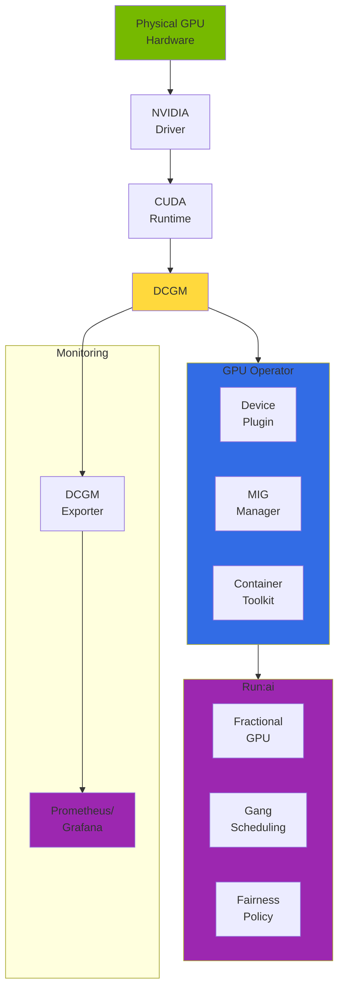
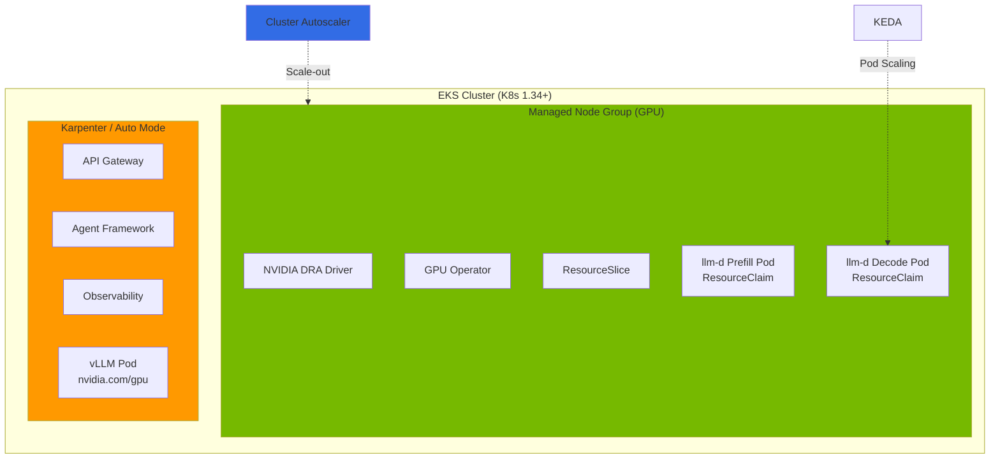
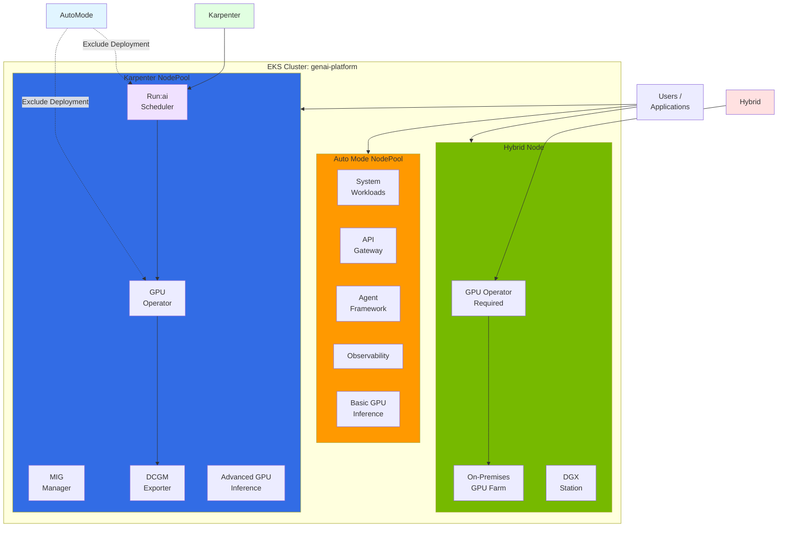
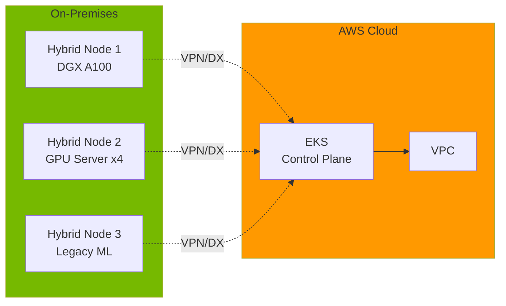
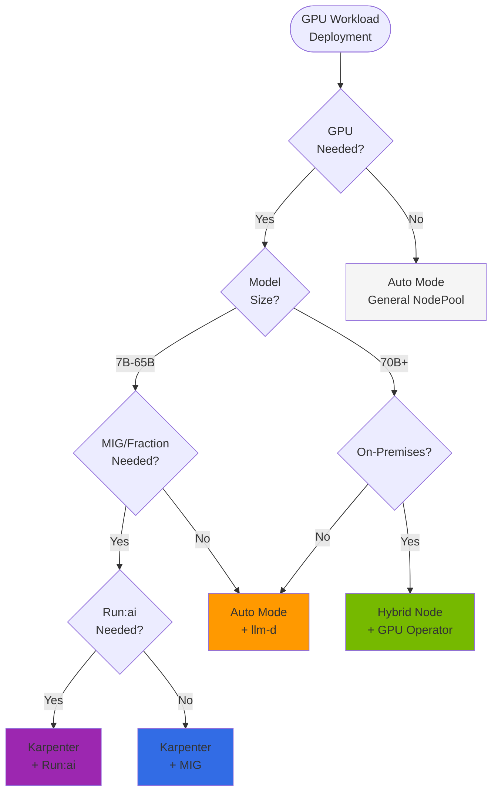
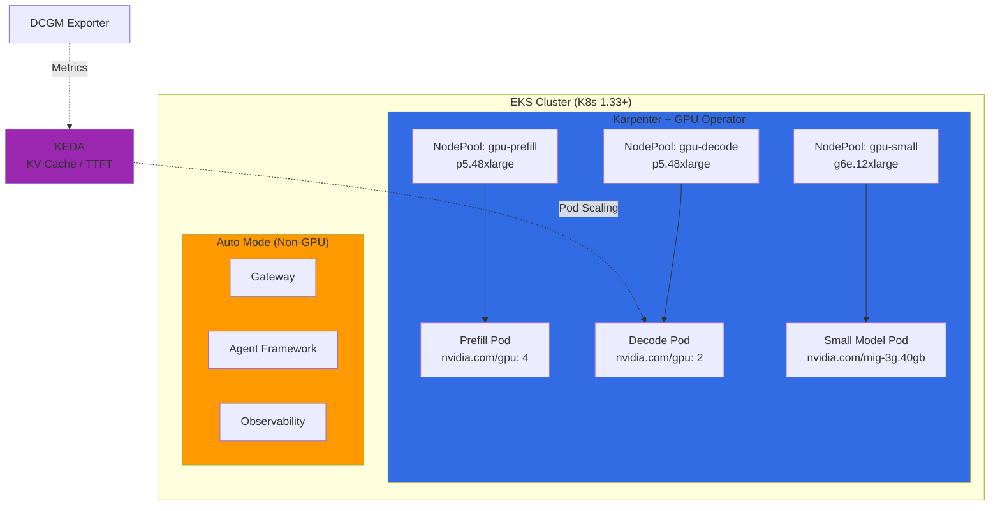

# EKS GPU Node Strategy: Auto Mode + Karpenter + Hybrid Node

## 1. Overview

When operating GPU workloads on EKS, node type selection directly impacts operational complexity, cost, and feature utilization. GPU inference and training workloads have special requirements different from general container workloads:

- **Driver Dependencies**: NVIDIA GPU driver, Container Toolkit, Device Plugin
- **Advanced Features**: MIG (Multi-Instance GPU), vGPU, Time-Slicing
- **Monitoring**: DCGM (Data Center GPU Manager) based metrics
- **Scheduling**: Fractional GPU, Topology-Aware Placement, Gang Scheduling

AWS EKS provides 4 node types for GPU workloads:

1. **EKS Auto Mode**: AWS manages entire node lifecycle (driver pre-installed)
2. **Karpenter (Self-Managed)**: Auto-scaling + user customizable
3. **Managed Node Group**: AWS-managed node groups (limited auto-scaling)
4. **Hybrid Node**: Connect on-premises servers to EKS cluster

**Core Principle**: You can operate multiple node types simultaneously in one EKS cluster. Leverage this to configure optimal node strategies for workload characteristics.

### Key Objectives

- Understand Auto Mode constraints (especially why GPU Operator is impossible)
- Advantages of Karpenter + GPU Operator combination
- Dependency relationships of Run:ai, DCGM, GPU Operator
- Hybrid architecture design (Auto Mode + Karpenter + Hybrid Node)

---

## 2. EKS Node Type Comparison

| Characteristic | Auto Mode | Karpenter | Managed Node Group | Hybrid Node |
|------|-----------|-----------|-------------------|-------------|
| **Management Entity** | AWS Fully Managed | Self-Managed (User) | AWS Managed | On-Premises Management |
| **Auto Scaling** | Automatic (AWS Control) | Automatic (NodePool Based) | Manual/Limited | Manual |
| **Custom AMI** | Not possible | Possible | Possible | Possible |
| **SSH Access** | Not possible | Possible | Possible | Possible |
| **GPU Driver** | Pre-installed (AWS) | User Installation | User Installation | User Installation |
| **GPU Operator Compatible** | **Not possible** | **Possible** | Possible | Possible |
| **Privileged DaemonSet** | Limited | Possible | Possible | Possible |
| **Root Filesystem** | Read-Only | Read-Write | Read-Write | Read-Write |
| **SELinux** | Enforcing | Permissive | Permissive | User Configuration |
| **MIG Support** | Not possible (NodeClass read-only) | Possible | Possible | Possible |
| **DRA Compatible** | **Not possible** (internal Karpenter-based) | **Not possible** ([#1231](https://github.com/kubernetes-sigs/karpenter/issues/1231)) | **Possible** (Recommended) | Possible |
| **DCGM Exporter** | GPU Operator auto-installs | Included in GPU Operator | Manual installation | Included in GPU Operator |
| **Run:ai Compatible** | **Possible** (Device Plugin label disable) | **Possible** | Possible | Possible |
| **Cost** | Low (no management needed) | Medium | Medium | Low (Capex) |
| **Suitable Workload** | Simple Inference | Advanced GPU Features | Static Workload | On-Premises Integration |

**Core Insights**:

- **Auto Mode**: GPU drivers pre-installed for immediate use. GPU Operator installation possible but Device Plugin only disabled by label (DCGM, NFD, GFD work normally)
- **Auto Mode + GPU Operator**: Can use KAI Scheduler, Run:ai, and other ClusterPolicy-dependent projects. MIG not possible due to NodeClass read-only constraint
- **Karpenter + GPU Operator**: Maximum flexibility with MIG, Custom AMI, etc.
- **Managed Node Group**: The only option for DRA (Dynamic Resource Allocation) workloads. Karpenter and Auto Mode don't support DRA
- **Hybrid Node**: Integrate on-premises GPU servers into EKS (GPU Operator required)

---

## 3. EKS Auto Mode GPU Support and Constraints

### 3.1 GPU Stack Auto-Provided by Auto Mode

EKS Auto Mode pre-installs the following on GPU instances (p5, g6e, g5, etc.):

```yaml
# Components automatically provided on Auto Mode GPU Nodes

1. NVIDIA GPU Driver
   - AWS-managed driver version
   - Automatic /dev/nvidia* device creation

2. NVIDIA Container Toolkit
   - Automatic containerd plugin configuration
   - nvidia-container-runtime installation

3. NVIDIA Device Plugin
   - Automatic kubernetes.io/nvidia-gpu resource registration
   - GPU device scheduling enabled

4. GPU Resource Registration
   - Can request nvidia.com/gpu: 1 in Pods
   - Topology-aware scheduling support
```

**Advantage**: Immediate GPU usage in Pods

```yaml
apiVersion: v1
kind: Pod
metadata:
  name: gpu-test
spec:
  containers:
  - name: cuda-test
    image: nvidia/cuda:12.2.0-runtime-ubuntu22.04
    command: ["nvidia-smi"]
    resources:
      limits:
        nvidia.com/gpu: 1
  nodeSelector:
    karpenter.sh/nodepool: auto-mode-gpu  # Auto Mode NodePool
```

### 3.2 GPU Operator Installation on Auto Mode: Device Plugin Disable Pattern

GPU Operator can be **installed** on Auto Mode. The key is to **disable only the Device Plugin with node labels** while running the remaining components (DCGM Exporter, NFD, GFD, MIG Manager) normally. This pattern was validated in [awslabs/ai-on-eks PR #288](https://github.com/awslabs/ai-on-eks/pull/288).

#### GPU Operator Component Status on Auto Mode

| GPU Operator Component | Auto Mode Setting | Reason |
|---------------------|--------------|------|
| **Driver** | `enabled: false` | Pre-installed in AMI (AL2023/Bottlerocket) |
| **Container Toolkit** | `enabled: false` | Pre-installed in AMI |
| **Device Plugin** | Label disable | AWS manages its own Device Plugin |
| **DCGM Exporter** | `enabled: true` | Collect detailed GPU metrics |
| **NFD** | `enabled: true` | Hardware feature detection |
| **GFD** | `enabled: true` | GPU property labeling |
| **MIG Manager** | `enabled: true` | Provides ClusterPolicy (actual MIG partitioning not possible due to NodeClass constraint) |

#### NodePool Label Configuration

```yaml
apiVersion: karpenter.sh/v1
kind: NodePool
metadata:
  name: gpu-auto-mode
spec:
  template:
    metadata:
      labels:
        nvidia.com/gpu.deploy.device-plugin: "false"  # Disable Device Plugin
    spec:
      requirements:
        - key: eks.amazonaws.com/instance-family
          operator: In
          values: ["p5", "p4d", "g6e", "g5"]
      nodeClassRef:
        group: eks.amazonaws.com
        kind: NodeClass
        name: default
```

#### Helm Values (for Auto Mode)

```yaml
driver:
  enabled: false          # Pre-installed in AMI
toolkit:
  enabled: false          # Pre-installed in AMI
devicePlugin:
  enabled: true           # Global enable, selectively disable by node label
dcgmExporter:
  enabled: true
  serviceMonitor:
    enabled: true
nfd:
  enabled: true
gfd:
  enabled: true
migManager:
  enabled: true
nodeStatusExporter:
  enabled: false
sandboxDevicePlugin:
  enabled: false
```

:::caution Actual Auto Mode Constraints
GPU Operator installation is possible, but the following are not possible because Auto Mode NodeClass is read-only:
- **MIG Partitioning**: Cannot set MIG profile in NodeClass (GPU Operator's MIG Manager installs and provides ClusterPolicy, but actual GPU partitioning cannot be applied)
- **Custom AMI**: Cannot pin specific driver version
- **SSH/SSM Access**: Cannot directly debug nodes

If you need MIG-based GPU partitioning, switch to Karpenter + GPU Operator.
:::

### 3.3 Why KAI Scheduler and Run:ai Need GPU Operator

KAI Scheduler, Run:ai, and several other projects depend on GPU Operator's **ClusterPolicy CRD**. Without ClusterPolicy, these projects won't even start.

```
ClusterPolicy CRD (GPU Operator)
  ↓ depends on
KAI Scheduler (GPU-aware Pod placement)
Run:ai (Fractional GPU, Gang Scheduling)
  ↓ reads
DCGM Exporter (GPU metrics)
NFD/GFD (hardware labels)
```

This is why GPU Operator must be installed even on Auto Mode. If you disable only the Device Plugin, the remaining components work normally, ClusterPolicy is created, and dependent projects operate correctly.

---

## 4. Karpenter + GPU Operator: Optimal Combination

### 4.1 Why Karpenter

Karpenter maintains Auto Mode's auto-scaling advantages while fully utilizing GPU Operator.

| Feature | Auto Mode | Karpenter | Self-Managed Node Group |
|------|-----------|-----------|------------------------|
| **Auto Scaling** | Automatic (AWS Control) | Automatic (NodePool Based) | Manual (ASG Based) |
| **GPU Operator** | Possible (Device Plugin disable) | Possible | Possible |
| **Custom AMI** | Not possible | Possible | Possible |
| **Root Filesystem** | Read-Only | Read-Write | Read-Write |
| **MIG Support** | Not possible (NodeClass read-only) | Possible | Possible |
| **Run:ai Compatible** | Possible (Device Plugin disable) | Possible | Possible |
| **Spot Instance** | Limited | Full Support | Limited |
| **Node Replacement Speed** | Fast | Very Fast | Slow (ASG) |
| **Cost Optimization** | AWS Automatic | User Control | User Control |

**Conclusion**: Karpenter provides both Auto Mode's automation + Self-Managed flexibility.

### 4.2 Karpenter GPU NodePool Configuration

```yaml
apiVersion: karpenter.sh/v1
kind: NodePool
metadata:
  name: gpu-inference
  namespace: karpenter
spec:
  # Node template
  template:
    metadata:
      labels:
        node-type: gpu-inference
        gpu-operator: enabled
        workload: llm-inference
    spec:
      # Instance type constraints
      requirements:
        # GPU instance types
        - key: node.kubernetes.io/instance-type
          operator: In
          values:
            - p5.48xlarge      # H100 x8 (640GB HBM3)
            - g6e.12xlarge     # L40S x4 (192GB GDDR6)
            - g5.12xlarge      # A10G x4 (96GB GDDR6)
            - g5.48xlarge      # A10G x8 (192GB GDDR6)

        # Capacity Type (exclude Spot - inference workloads recommend On-Demand)
        - key: karpenter.sh/capacity-type
          operator: In
          values: [on-demand]

        # Availability Zone (Multi-AZ distribution)
        - key: topology.kubernetes.io/zone
          operator: In
          values: [us-west-2a, us-west-2b, us-west-2c]

      # GPU node Taints (prevent general workload placement)
      taints:
        - key: nvidia.com/gpu
          effect: NoSchedule
          value: "true"

      # Kubelet configuration
      kubelet:
        # GPU workloads are memory-intensive
        maxPods: 110
        # Adjust eviction thresholds
        evictionHard:
          memory.available: "10Gi"
          nodefs.available: "10%"
        # Parallelize image pulls
        imageGCHighThresholdPercent: 85
        imageGCLowThresholdPercent: 80

  # Disruption policy (cost optimization)
  disruption:
    # Terminate after 5 minutes if node empty
    consolidationPolicy: WhenEmpty
    consolidateAfter: 5m
    # Maintain nodes in use
    budgets:
      - nodes: "100%"
        duration: 10m

  # Resource limits (prevent cost explosion)
  limits:
    cpu: "1000"
    memory: "4000Gi"
    nvidia.com/gpu: "32"  # Max 32 GPUs (4x p5.48xlarge)

---
apiVersion: karpenter.sh/v1
kind: NodePool
metadata:
  name: gpu-training
  namespace: karpenter
spec:
  template:
    metadata:
      labels:
        node-type: gpu-training
        gpu-operator: enabled
        workload: model-training
    spec:
      requirements:
        - key: node.kubernetes.io/instance-type
          operator: In
          values:
            - p5.48xlarge      # H100 x8 (training optimized)
            - p4d.24xlarge     # A100 x8 (40GB)

        # Allow Spot Instance (training tolerates interruptions)
        - key: karpenter.sh/capacity-type
          operator: In
          values: [spot, on-demand]

      taints:
        - key: workload
          effect: NoSchedule
          value: "training"

      kubelet:
        maxPods: 50  # Limit Pod count for training workloads
        evictionHard:
          memory.available: "20Gi"  # Training needs memory buffer

  disruption:
    # 10-minute grace period even for Spot interruptions
    consolidationPolicy: WhenUnderutilized
    consolidateAfter: 10m

  limits:
    nvidia.com/gpu: "64"  # Max 64 GPUs (8x p5.48xlarge)
```

### 4.3 EC2NodeClass Configuration

```yaml
apiVersion: karpenter.k8s.aws/v1
kind: EC2NodeClass
metadata:
  name: gpu-inference
  namespace: karpenter
spec:
  # AMI selection (GPU optimized AMI)
  amiSelectorTerms:
    - alias: al2023  # Amazon Linux 2023 (recommended)
      # Or Custom AMI:
      # id: ami-0123456789abcdef (NVIDIA driver pre-installed)

  # IAM Role
  role: KarpenterNodeRole-eks-genai-cluster

  # Subnet selection (Private Subnet)
  subnetSelectorTerms:
    - tags:
        karpenter.sh/discovery: eks-genai-cluster
        subnet-type: private

  # Security Group
  securityGroupSelectorTerms:
    - tags:
        karpenter.sh/discovery: eks-genai-cluster

  # User Data (GPU Operator installation preparation)
  userData: |
    #!/bin/bash
    set -ex

    # Pre-work for GPU Operator

    # 1. Install NVIDIA Fabric Manager (if NVLink needed)
    # p5.48xlarge, p4d.24xlarge use NVLink
    if [[ $(ec2-metadata --instance-type | grep -E "p5|p4d") ]]; then
      yum install -y nvidia-fabricmanager
      systemctl enable nvidia-fabricmanager
      systemctl start nvidia-fabricmanager
    fi

    # 2. Install Kernel Headers (GPU Operator compiles driver)
    yum install -y kernel-devel-$(uname -r) kernel-headers-$(uname -r)

    # 3. Configure Containerd (prepare nvidia-container-runtime)
    mkdir -p /etc/containerd
    containerd config default > /etc/containerd/config.toml
    sed -i 's/SystemdCgroup = false/SystemdCgroup = true/' /etc/containerd/config.toml
    systemctl restart containerd

    # 4. Expand disk for large model downloads
    # Expand EBS volume to 200Gi (configured in NodeClass blockDeviceMappings)

    # 5. Add node labels (GPU Operator NodeSelector)
    echo "KUBELET_EXTRA_ARGS='--node-labels=gpu-operator=enabled'" >> /etc/sysconfig/kubelet

  # EBS volume configuration
  blockDeviceMappings:
    - deviceName: /dev/xvda
      ebs:
        volumeSize: 200Gi      # LLM model caching
        volumeType: gp3
        iops: 16000            # High IOPS (improve model loading speed)
        throughput: 1000       # 1000 MB/s
        encrypted: true
        deleteOnTermination: true

  # Metadata Options (require IMDSv2)
  metadataOptions:
    httpEndpoint: enabled
    httpProtocolIPv6: disabled
    httpPutResponseHopLimit: 2
    httpTokens: required  # IMDSv2

  # Tags (cost tracking)
  tags:
    Environment: production
    Team: ml-platform
    ManagedBy: karpenter
    Workload: gpu-inference
```

### 4.4 GPU Operator Installation (Karpenter Node Exclusive)

```yaml
# Helm Values for GPU Operator
# helm install gpu-operator nvidia/gpu-operator -f gpu-operator-values.yaml

# 1. Driver configuration
driver:
  enabled: true
  version: "550.90.07"  # CUDA 12.4 compatible
  repository: nvcr.io/nvidia
  image: driver

  # Deploy only to Karpenter nodes
  nodeSelector:
    gpu-operator: enabled

  tolerations:
    - key: nvidia.com/gpu
      operator: Exists
      effect: NoSchedule

  # License configuration (if using vGPU)
  licensingConfig:
    configMapName: ""  # Not needed for general GPUs

# 2. Toolkit configuration
toolkit:
  enabled: true
  version: 1.14.6-ubuntu22.04

  nodeSelector:
    gpu-operator: enabled

  tolerations:
    - key: nvidia.com/gpu
      operator: Exists
      effect: NoSchedule

# 3. Device Plugin configuration
devicePlugin:
  enabled: true
  version: v0.15.0

  # Resource name configuration
  config:
    name: time-slicing-config  # ConfigMap name
    default: "any"

  nodeSelector:
    gpu-operator: enabled

  tolerations:
    - key: nvidia.com/gpu
      operator: Exists
      effect: NoSchedule

# 4. MIG Manager configuration
migManager:
  enabled: true
  version: v0.7.0

  # MIG strategy (impossible on Auto Mode)
  config:
    name: mig-parted-config
    default: "all-balanced"  # Evenly partition all GPUs

  nodeSelector:
    gpu-operator: enabled

  tolerations:
    - key: nvidia.com/gpu
      operator: Exists
      effect: NoSchedule

# 5. DCGM Exporter configuration (Prometheus metrics)
dcgmExporter:
  enabled: true
  version: 3.3.5-3.4.1-ubuntu22.04

  # Metric collection interval
  config:
    name: dcgm-exporter-metrics

  serviceMonitor:
    enabled: true
    interval: 15s
    honorLabels: true

  nodeSelector:
    gpu-operator: enabled

  tolerations:
    - key: nvidia.com/gpu
      operator: Exists
      effect: NoSchedule

# 6. Node Feature Discovery
nfd:
  enabled: true  # Automatic GPU feature detection

# 7. GFD (GPU Feature Discovery)
gfd:
  enabled: true

  nodeSelector:
    gpu-operator: enabled

# 8. Operator itself configuration
operator:
  # Exclude Auto Mode nodes (important!)
  nodeSelector:
    node-type: gpu-inference  # Karpenter NodePool label

  tolerations:
    - key: nvidia.com/gpu
      operator: Exists
      effect: NoSchedule

  defaultRuntime: containerd

  # Disable Validator (prevent conflict with Auto Mode nodes)
  validator:
    nodeSelector:
      gpu-operator: enabled
```

**Key Configuration**:

1. **nodeSelector: gpu-operator: enabled**: Exclude Auto Mode nodes
2. **Enable MIG Manager**: MIG functionality impossible on Auto Mode
3. **DCGM Exporter**: Automatic GPU metric collection (Prometheus integration)

---

## 5. GPU Operator / DCGM / Run:ai Architecture

### 5.1 Hierarchical Diagram



**Dependency Relationship**:

```
Run:ai (Top-level scheduling layer)
  ↓ depends on
GPU Operator (Infrastructure automation layer)
  ↓ includes
DCGM (Monitoring engine)
  ↓ requires
NVIDIA Driver (Kernel module)
  ↓
Physical GPU (Hardware)
```

### 5.2 GPU Operator's Role

GPU Operator is an infrastructure layer that automates GPU workloads in Kubernetes.

| Component | Role | Auto Mode | Karpenter |
|----------|------|-----------|-----------|
| **nvidia-driver** | Install GPU kernel module | AWS pre-installed | GPU Operator installs |
| **container-toolkit** | Container runtime integration | AWS pre-configured | GPU Operator configures |
| **device-plugin** | GPU resource registration | AWS Device Plugin | GPU Operator Plugin |
| **gpu-feature-discovery** | GPU property labeling | Limited | Fully Supported |
| **mig-manager** | MIG profile management | Not possible | Possible |
| **dcgm-exporter** | Prometheus metrics | Manual installation | Automatically included |
| **node-status-exporter** | Node status metrics | Not possible | Automatically included |

**GPU Operator's Core Value**:

```yaml
# Without GPU Operator, manual configuration required:
# 1. SSH access to each node
# 2. Manually install NVIDIA driver
# 3. Manually configure Container Toolkit
# 4. Manually deploy Device Plugin Manifest
# 5. Manually install DCGM
# 6. Manually configure MIG
# → Repeat 100 times for 100 nodes

# With GPU Operator:
helm install gpu-operator nvidia/gpu-operator
# → Automatic deployment to all nodes, automatic upgrades, automatic monitoring
```

### 5.3 DCGM's Role

DCGM (Data Center GPU Manager) is NVIDIA GPU's monitoring engine.

#### Types of Collected Metrics

**1. Performance Metrics**

```promql
# GPU SM (Streaming Multiprocessor) utilization
DCGM_FI_DEV_GPU_UTIL{gpu="0", namespace="inference"} 75

# Tensor Core utilization (AI workload core metric)
DCGM_FI_PROF_PIPE_TENSOR_ACTIVE{gpu="0"} 92

# Memory utilization
DCGM_FI_DEV_FB_USED{gpu="0"} 68719476736  # 64GB / 80GB (A100)

# PCIe/NVLink Throughput
DCGM_FI_PROF_PCIE_TX_BYTES{gpu="0"} 15728640000  # 15 GB/s
DCGM_FI_PROF_NVLINK_TX_BYTES{gpu="0"} 629145600000  # 600 GB/s (p5.48xlarge)

# Power Consumption
DCGM_FI_DEV_POWER_USAGE{gpu="0"} 450  # 450W / 700W (H100)

# Temperature
DCGM_FI_DEV_GPU_TEMP{gpu="0"} 68  # 68°C
```

**2. Health Check**

```promql
# ECC (Error Correcting Code) errors
DCGM_FI_DEV_ECC_DBE_VOL_TOTAL{gpu="0"} 0  # Double Bit Errors (critical)

# XID errors (hardware error codes)
DCGM_FI_DEV_XID_ERRORS{gpu="0"} 0

# Thermal Throttling (performance degradation due to overheating)
DCGM_FI_DEV_THERMAL_VIOLATION{gpu="0"} 0

# Clock Throttling Reason
DCGM_FI_DEV_CLOCK_THROTTLE_REASONS{gpu="0", reason="hw_thermal"} 0
```

**3. Profiling**

```promql
# Per-Process GPU memory usage
DCGM_FI_DEV_FB_USED_BY_PROCESS{pid="12345", process="python3"} 17179869184  # 16GB

# Per MIG Instance metrics
DCGM_FI_DEV_GPU_UTIL{gpu="0", mig_instance="1g.10gb"} 45

# Per-User GPU utilization (Run:ai integration)
runai_gpu_utilization{user="data-scientist-1", team="ml-team"} 0.87
```

### 5.4 Run:ai's Role

Run:ai is a **scheduling and orchestration** layer operating above GPU Operator + DCGM.

#### Run:ai Core Features

**1. Advanced GPU Scheduling Features**

```yaml
# Fractional GPU (GPU partitioning scheduling)
apiVersion: run.ai/v1
kind: RunaiJob
metadata:
  name: inference-job
spec:
  gpuFraction: 0.5  # Request 0.5 of 1 GPU (2 Pods share 1 GPU)
  gpuMemory: 20Gi   # Set memory limit

  # Run:ai automatically handles:
  # - CUDA_VISIBLE_DEVICES environment variable configuration
  # - GPU memory limiting (nvidia-smi based)
  # - Time-Slicing scheduling

---
# Dynamic MIG (runtime MIG profile change)
apiVersion: run.ai/v1
kind: RunaiJob
metadata:
  name: training-job
spec:
  migProfile: "3g.40gb"  # MIG 3-slice (A100 40GB → 3 instances)

  # Run:ai automatically handles:
  # - nvidia-smi mig command execution
  # - Automatic MIG UUID allocation
  # - MIG Instance mapping to Pod

---
# Gang Scheduling (simultaneous start of distributed training)
apiVersion: run.ai/v1
kind: DistributedJob
metadata:
  name: llama-70b-training
spec:
  workers: 8        # Need 8 Pods simultaneously
  gpusPerWorker: 8  # 8 GPUs per Pod

  # Run:ai automatically handles:
  # - Schedule only when 64 GPUs simultaneously Available
  # - Start all Pods simultaneously
  # - Rollback entire job if any fails

---
# Bin Packing + Topology-Aware
apiVersion: run.ai/v1
kind: RunaiJob
spec:
  topology: "same-node"  # GPUs must be on same node

  # Run:ai automatically handles:
  # - Match GPUs connected via NVLink
  # - Optimize PCIe Bandwidth
  # - Consider NUMA Affinity
```

**2. Resource Management**

```yaml
# Department → Project → User hierarchy
Department: "ML Platform Team"
  ├── Project: "LLM Inference"
  │   ├── GPU Quota: 32
  │   ├── Over-Quota: 16 (usable when idle)
  │   └── Users:
  │       ├── ml-engineer-1 (Quota: 8)
  │       └── ml-engineer-2 (Quota: 4)
  └── Project: "Model Training"
      ├── GPU Quota: 64
      ├── Over-Quota: 32
      └── Fairness Policy: "DRF"  # Dominant Resource Fairness

# Preemption (priority-based preemption)
Job: high-priority-inference
  Priority: 100
  → Preempt lower priority Jobs and secure GPUs

# Fairness (fairness algorithm)
Algorithm: "Dominant Resource Fairness"
  → Track each User's GPU usage time
  → Prioritize Users with less usage
```

**3. Visibility and Governance**

```yaml
# Metrics provided by Run:ai Dashboard (DCGM-based)

Per-User GPU Utilization:
  ml-engineer-1: 87% (8 GPUs, 87% average utilization)
  ml-engineer-2: 45% (4 GPUs, 45% average utilization)

Per-Team GPU Cost:
  ML Platform Team: $12,450/month (64 GPUs)
  ├── LLM Inference: $8,200/month (32 GPUs)
  └── Model Training: $4,250/month (32 GPUs)

Idle GPU Detection:
  gpu-node-5: GPUs 2,3 Idle (12 hours) → Send alert

Job Queueing:
  Pending Jobs: 8
  ├── training-job-1: Waiting (need 16 GPUs, currently 8 Available)
  └── inference-job-2: Running (using 4 GPUs)
```

### 5.5 Dependency Relationship Summary

| Combination | Possible? | Use Case |
|------|------|----------|
| **GPU Operator Only** | YES | Basic GPU inference, simple training |
| **GPU Operator + DCGM** | YES | GPU monitoring + Alerting |
| **GPU Operator + Run:ai** | YES | Enterprise GPU management (recommended) |
| **DCGM Only** | YES | Bare-metal environment GPU monitoring |
| **Run:ai Only** | NO | GPU Operator required (Driver, Plugin needed) |
| **Auto Mode + Run:ai** | YES | GPU Operator installation + Device Plugin label disable |
| **Auto Mode + DCGM Exporter** | YES | GPU Operator installation (limited features) |

**Core Insights**:

- **Run:ai operates only above GPU Operator** (Driver, Device Plugin required)
- **Auto Mode can install GPU Operator with Device Plugin label disable → Run:ai usable**
- **Karpenter + GPU Operator + Run:ai = Optimal enterprise GPU platform configuration**

---

## 5.6 DRA Workloads with Managed Node Group Strategy

DRA (Dynamic Resource Allocation) was promoted to GA in K8s 1.34, providing advanced GPU management beyond Device Plugin including fine-grained GPU memory allocation, MIG/MPS/Time-Slicing selection, and NVLink topology-aware scheduling. **However, DRA cannot be used with Karpenter and EKS Auto Mode.**

:::danger DRA + Karpenter/Auto Mode Incompatibility
Karpenter skips node provisioning when it detects `spec.resourceClaims` in Pods ([PR #2384](https://github.com/kubernetes-sigs/karpenter/pull/2384)). EKS Auto Mode uses Karpenter internally, so the same constraint applies. Node management for DRA workloads is only officially supported with **Managed Node Group**.

This isn't just a CRD interpretation issue. Karpenter simulates Pod requirements to calculate optimal instances, but DRA's ResourceSlice is only published by the DRA Driver after nodes exist, making **pre-node-creation simulation impossible** (chicken-and-egg problem). In contrast, Cluster Autoscaler makes simple decisions like "Pending Pod exists, scale up MNG" without needing to interpret DRA.

**Reference**: [AWS EKS Official Documentation — Manage hardware devices](https://docs.aws.amazon.com/eks/latest/userguide/device-management.html)
:::

#### Karpenter `IGNORE_DRA_REQUESTS` Workaround (PoC Use Only)

Enabling Karpenter's `IGNORE_DRA_REQUESTS` flag allows ignoring DRA requirements and provisioning nodes based on nodeSelector/labels.

```yaml
# Enable DRA ignore in Karpenter
env:
  - name: IGNORE_DRA_REQUESTS
    value: "true"

---
# NodePool: GPU label matching
apiVersion: karpenter.sh/v1
kind: NodePool
metadata:
  name: gpu-dra-h100
spec:
  template:
    metadata:
      labels:
        gpu-class: h100-80gb
    spec:
      requirements:
        - key: node.kubernetes.io/instance-type
          operator: In
          values: ["p5.48xlarge"]

---
# DRA Pod: instance hint via label + GPU allocation via ResourceClaim
apiVersion: v1
kind: Pod
spec:
  nodeSelector:
    gpu-class: h100-80gb          # Karpenter provisions based on this
  resourceClaims:
    - name: gpu
      resourceClaimTemplateName: gpu-claim  # kube-scheduler handles this
```

**Operation**: Karpenter ignores ResourceClaim → matches NodePool by nodeSelector → provisions node → DRA Driver deploys → kube-scheduler matches DRA → Pod placement

:::warning Not Recommended for Production

| Risk | Description |
|---|---|
| **Bin-packing errors** | Karpenter doesn't know DRA resource consumption, may overcommit GPU capacity |
| **Scale-down misjudgment** | May consider nodes using DRA resources as empty |
| **Temporary flag** | Will be removed when official DRA support arrives |

Use only for PoC/single Pod-per-Node configurations. **For production, use MNG + Cluster Autoscaler.**
:::

### DRA Hybrid Architecture



**Core Configuration Principles:**

| Workload | Node Type | GPU Allocation | Scaling |
|---|---|---|---|
| DRA workloads (llm-d, P6e-GB200) | **Managed Node Group** | ResourceClaim (DRA) | Cluster Autoscaler |
| General GPU inference (vLLM standalone) | Karpenter / Auto Mode | `nvidia.com/gpu` (Device Plugin) | Karpenter dynamic provisioning |
| Non-GPU workloads | Karpenter / Auto Mode | - | Karpenter dynamic provisioning |

### DRA Scale-out: KEDA + Cluster Autoscaler

GPU node provisioning takes several minutes, so scale-out should start proactively based on LLM metrics before Pods go Pending:

1. **Proactive**: KEDA monitors KV Cache usage, TTFT, queued requests → Pod scale-out
2. **Reactive**: Pod Pending occurs → Cluster Autoscaler increases MNG desired capacity → GPU node provisioning

For detailed configuration, see [GPU Resource Management — DRA Scale-out Strategy](./gpu-resource-management.md#dra-scale-out-strategy).

---

## 6. Recommended Hybrid Architecture

Strategy for simultaneously operating 3 node types in one EKS cluster.



### 6.1 Workload-specific Node Placement Strategy

| Workload Type | Node Type | GPU Operator | Reason |
|--------------|-----------|--------------|------|
| **System Components** | Auto Mode | Not needed | No management needed, minimize cost |
| **API Gateway** | Auto Mode | Not needed | CPU workload |
| **Agent Orchestration** | Auto Mode | Not needed | CPU workload |
| **Simple GPU Inference** | Auto Mode | Not needed | MIG unnecessary, fast scaling |
| **MIG-based Inference** | Karpenter | Required | MIG Manager needed |
| **Fractional GPU** | Karpenter | Required | Run:ai needed |
| **Model Training** | Karpenter | Required | Gang Scheduling needed |
| **On-Premises GPU** | Hybrid Node | Required | No AWS-managed GPU stack |

### 6.2 Karpenter NodePool Configuration (Detailed)

```yaml
# 1. Simple inference (handled by Auto Mode)
apiVersion: karpenter.sh/v1
kind: NodePool
metadata:
  name: auto-mode-gpu-simple
spec:
  template:
    spec:
      requirements:
        - key: node.kubernetes.io/instance-type
          operator: In
          values: [g5.xlarge, g5.2xlarge]  # Small GPUs
        - key: karpenter.sh/capacity-type
          operator: In
          values: [on-demand]
  limits:
    nvidia.com/gpu: "8"

---
# 2. Advanced inference (Karpenter + GPU Operator)
apiVersion: karpenter.sh/v1
kind: NodePool
metadata:
  name: karpenter-gpu-advanced
spec:
  template:
    metadata:
      labels:
        gpu-operator: enabled
        runai-enabled: "true"
    spec:
      requirements:
        - key: node.kubernetes.io/instance-type
          operator: In
          values: [p5.48xlarge, g6e.12xlarge]
      taints:
        - key: nvidia.com/gpu
          effect: NoSchedule
  limits:
    nvidia.com/gpu: "64"

---
# 3. Model training (Karpenter + Spot)
apiVersion: karpenter.sh/v1
kind: NodePool
metadata:
  name: karpenter-gpu-training
spec:
  template:
    metadata:
      labels:
        gpu-operator: enabled
        workload: training
    spec:
      requirements:
        - key: node.kubernetes.io/instance-type
          operator: In
          values: [p5.48xlarge]  # H100 only
        - key: karpenter.sh/capacity-type
          operator: In
          values: [spot, on-demand]  # Spot priority
      taints:
        - key: workload
          effect: NoSchedule
          value: "training"
  disruption:
    consolidationPolicy: WhenUnderutilized
    consolidateAfter: 30m  # Prevent training interruptions
  limits:
    nvidia.com/gpu: "128"
```

### 6.3 GPU Operator Deployment (Karpenter Nodes Only)

```yaml
# GPU Operator Helm Values
operator:
  # Exclude Auto Mode nodes (core configuration)
  affinity:
    nodeAffinity:
      requiredDuringSchedulingIgnoredDuringExecution:
        nodeSelectorTerms:
          - matchExpressions:
              # Only nodes with gpu-operator=enabled label
              - key: gpu-operator
                operator: In
                values: [enabled]
              # Exclude Auto Mode nodes
              - key: eks.amazonaws.com/compute-type
                operator: NotIn
                values: [auto]

driver:
  nodeSelector:
    gpu-operator: enabled

migManager:
  enabled: true
  nodeSelector:
    gpu-operator: enabled
  config:
    name: mig-config
    default: all-balanced

dcgmExporter:
  enabled: true
  nodeSelector:
    gpu-operator: enabled
  serviceMonitor:
    enabled: true

runai:
  enabled: true  # Enable Run:ai integration
```

---

## 7. EKS Hybrid Node GPU Farm

### 7.1 Hybrid Node Concept

EKS Hybrid Node **registers on-premises servers to EKS cluster** (GA November 2024).



**Core Features**:

- Register on-premises GPU servers to EKS (IAM, Kubelet authentication)
- No AWS-managed GPU stack → **GPU Operator Required**
- VPN or AWS Direct Connect required
- EKS Control Plane AWS-managed, worker nodes on-premises

### 7.2 Hybrid Node Registration

```bash
# 1. Create Hybrid Node IAM Role
aws iam create-role \
  --role-name EKSHybridNodeRole \
  --assume-role-policy-document file://hybrid-node-trust-policy.json

aws iam attach-role-policy \
  --role-name EKSHybridNodeRole \
  --policy-arn arn:aws:iam::aws:policy/AmazonEKSWorkerNodePolicy

# 2. Register Hybrid Node (run on on-premises server)
curl -o hybrid-node-installer.sh https://hybrid.eks.amazonaws.com/installer
chmod +x hybrid-node-installer.sh

sudo ./hybrid-node-installer.sh \
  --cluster-name genai-platform \
  --region us-west-2 \
  --role-arn arn:aws:iam::123456789012:role/EKSHybridNodeRole \
  --credential-provider ssm  # Authentication via AWS SSM

# 3. Automatic GPU Operator installation (when Hybrid Node detected)
kubectl apply -f - <<EOF
apiVersion: v1
kind: ConfigMap
metadata:
  name: gpu-operator-config
  namespace: gpu-operator
data:
  hybrid-node-detected: "true"
  auto-install-driver: "true"
EOF

# 4. Verify node
kubectl get nodes -l node.kubernetes.io/instance-type=hybrid
NAME                STATUS   ROLES    AGE   VERSION
dgx-a100-station-1  Ready    <none>   5m    v1.29.0
gpu-server-pool-1   Ready    <none>   5m    v1.29.0
```

### 7.3 Hybrid Node GPU Operator Installation

```yaml
# GPU Operator Helm Values (Hybrid Node exclusive)
operator:
  nodeSelector:
    node.kubernetes.io/instance-type: hybrid

driver:
  enabled: true
  # Hybrid Nodes run various OS like Ubuntu/RHEL
  repository: nvcr.io/nvidia
  version: "550.90.07"

  nodeSelector:
    node.kubernetes.io/instance-type: hybrid

toolkit:
  enabled: true
  nodeSelector:
    node.kubernetes.io/instance-type: hybrid

devicePlugin:
  enabled: true
  nodeSelector:
    node.kubernetes.io/instance-type: hybrid

migManager:
  enabled: true
  nodeSelector:
    node.kubernetes.io/instance-type: hybrid

dcgmExporter:
  enabled: true
  nodeSelector:
    node.kubernetes.io/instance-type: hybrid
  serviceMonitor:
    enabled: true
    additionalLabels:
      location: on-premises
```

### 7.4 3-Node Type Coexistence Strategy

```yaml
# Pod placement strategy (NodeSelector + Affinity)

# 1. Simple inference → Auto Mode
apiVersion: v1
kind: Pod
metadata:
  name: simple-inference
spec:
  containers:
  - name: llama-7b
    resources:
      limits:
        nvidia.com/gpu: 1
  nodeSelector:
    eks.amazonaws.com/compute-type: auto  # Auto Mode node

---
# 2. MIG-based inference → Karpenter
apiVersion: v1
kind: Pod
metadata:
  name: mig-inference
spec:
  containers:
  - name: llama-70b
    resources:
      limits:
        nvidia.com/mig-1g.10gb: 1  # MIG Instance
  nodeSelector:
    gpu-operator: enabled
  affinity:
    nodeAffinity:
      requiredDuringSchedulingIgnoredDuringExecution:
        nodeSelectorTerms:
          - matchExpressions:
              - key: node.kubernetes.io/instance-type
                operator: In
                values: [p5.48xlarge, g6e.12xlarge]

---
# 3. On-premises GPU → Hybrid Node
apiVersion: v1
kind: Pod
metadata:
  name: onprem-training
spec:
  containers:
  - name: pytorch-ddp
    resources:
      limits:
        nvidia.com/gpu: 8
  nodeSelector:
    node.kubernetes.io/instance-type: hybrid
  tolerations:
    - key: on-premises
      operator: Exists
      effect: NoSchedule
```

---

## 8. llm-d and Model Size-based Node Strategy

### 8.1 llm-d on EKS Auto Mode: Possible but with Constraints

[llm-d](./llm-d-eks-automode.md) is a Kubernetes-native inference scheduler providing KV-cache aware routing and distributed inference. llm-d's core value is **request routing optimization, not GPU partitioning**, so core functionality works on Auto Mode.

| llm-d Feature | Auto Mode | Karpenter + GPU Operator |
|---|---|---|
| InferencePool/InferenceModel CRD | Works | Works |
| KV-cache aware routing | Works | Works |
| Prefix caching routing | Works | Works |
| Model metric-based load balancing | Works | Works |
| Pod/node auto-scaling | Works | Works |
| Pod placement after GPU partitioning with MIG | **Not possible** | Works |
| Fractional GPU (0.5 GPU) | **Not possible** | Works |
| Detailed DCGM GPU metrics | Limited | Works |

However, **without GPU fraction control, GPU utilization efficiency varies greatly by model size.**

### 8.2 GPU Utilization Efficiency by Model Size

#### Large Models (70B+) -- Auto Mode Suitable

```
Qwen3-72B on H100 80GB
┌────────────────────────────────────────────┐
│ ████████████████████████████████████████░░ │
│ GPU memory usage: ~75GB / 80GB (93%)       │
│ GPU Utilization: 85-95%                    │
│ llm-d KV-cache routing: Effective          │
│ → Almost full GPU usage, no waste          │
└────────────────────────────────────────────┘
```

#### Small to Medium Models (7B-13B) -- Auto Mode Inefficient

```
Llama-3-8B on H100 80GB
┌────────────────────────────────────────────┐
│ ████████░░░░░░░░░░░░░░░░░░░░░░░░░░░░░░░░ │
│ GPU memory usage: ~16GB / 80GB (20%)       │
│ GPU Utilization: 20-40%                    │
│ llm-d KV-cache routing: Effective          │
│ → Routing optimal but 80% GPU idle         │
└────────────────────────────────────────────┘
```

#### With MIG Partitioning (Karpenter + GPU Operator)

```
Partition H100 into MIG 3g.40gb x 2
┌───────────────────┐ ┌───────────────────┐
│ MIG 1: Llama-8B   │ │ MIG 2: Llama-8B   │
│ ████████░░░░░░░░░ │ │ ████████░░░░░░░░░ │
│ 16GB / 40GB       │ │ 16GB / 40GB       │
│ Pod A             │ │ Pod B             │
└───────────────────┘ └───────────────────┘
→ Operate 2 model instances on one GPU
→ 50% cost savings + llm-d routing applied
```

### 8.3 Cost Impact Simulation

Based on p5.48xlarge (H100 x8), monthly cost approximately $98,000:

| Configuration | 7B Model Instances | GPU Usage | GPU Utilization | Effective Cost/Instance |
|---|---|---|---|---|
| Auto Mode (full GPU allocation) | 8 | 8 GPUs | ~25% | $12,250 |
| Karpenter + MIG (4-partition) | 8 | 2 GPUs | ~80% | **$3,063** |
| **Savings** | Same | **75% savings** | **3.2x improvement** | **75% savings** |

:::warning Model Size and Cost Efficiency
The smaller the model parameter count, the greater GPU waste on Auto Mode. Running 7B models on H100 leaves 80% of GPU memory idle, which is direct cost waste. MIG partitioning is essential.
:::

### 8.4 Recommended Node Strategy by Model Size

| Model Size | Example | Recommended Node | Reason |
|---|---|---|---|
| **70B+** | Qwen3-72B, Llama-3-70B | Auto Mode + llm-d | Nearly full GPU usage, operational convenience |
| **30B-65B** | Qwen3-32B, CodeLlama-34B | Auto Mode or Karpenter | 50%+ GPU memory usage, choose based on situation |
| **13B-30B** | Llama-3-13B | Karpenter + MIG 2-partition | Need GPU utilization improvement |
| **7B and below** | Llama-3-8B, Mistral-7B | Karpenter + MIG 4-7 partition | Severe GPU waste, MIG required |
| **Multi-model Serving** | Multiple concurrent models | Karpenter + MIG | Separate MIG partitions per model |
| **Development/Testing** | Model agnostic | Auto Mode | Fast start, not cost-sensitive |

### 8.5 Practical Hybrid Deployment Example

```yaml
# Large model: Auto Mode + llm-d (full GPU usage)
apiVersion: inference.ai/v1alpha2
kind: InferencePool
metadata:
  name: qwen3-72b-pool
  namespace: ai-inference
spec:
  targetPortNumber: 8000
  selector:
    app: vllm-qwen3-72b
  extensionRef:
    name: llm-d-endpoint-picker
---
apiVersion: apps/v1
kind: Deployment
metadata:
  name: vllm-qwen3-72b
  namespace: ai-inference
spec:
  replicas: 4
  template:
    spec:
      containers:
        - name: vllm
          image: vllm/vllm-openai:latest
          args: ["--model", "Qwen/Qwen3-72B", "--tensor-parallel-size", "4"]
          resources:
            limits:
              nvidia.com/gpu: 4           # Full GPU usage (Auto Mode OK)
      nodeSelector:
        eks.amazonaws.com/compute-type: auto

---
# Small model: Karpenter + MIG + llm-d (GPU partitioning)
apiVersion: inference.ai/v1alpha2
kind: InferencePool
metadata:
  name: llama3-8b-pool
  namespace: ai-inference
spec:
  targetPortNumber: 8000
  selector:
    app: vllm-llama3-8b
  extensionRef:
    name: llm-d-endpoint-picker
---
apiVersion: apps/v1
kind: Deployment
metadata:
  name: vllm-llama3-8b
  namespace: ai-inference
spec:
  replicas: 8
  template:
    spec:
      containers:
        - name: vllm
          image: vllm/vllm-openai:latest
          args: ["--model", "meta-llama/Llama-3-8B", "--gpu-memory-utilization", "0.9"]
          resources:
            limits:
              nvidia.com/mig-3g.40gb: 1   # Use MIG instance (Karpenter)
      nodeSelector:
        gpu-operator: enabled
      tolerations:
        - key: nvidia.com/gpu
          operator: Exists
          effect: NoSchedule
```

---

## 9. Node Strategy Decision Flowchart



### Decision Table

| Question | Answer | Recommended Node Type | GPU Operator | Reason |
|------|------|---------------|--------------|------|
| GPU Not Needed | - | Auto Mode | Not needed | Minimize cost |
| Simple GPU Inference | MIG unnecessary | Auto Mode GPU | Not needed | Fast deployment |
| MIG Needed | - | Karpenter | Required | MIG Manager needed |
| **DRA Needed** | - | **Managed Node Group** | **Required** | **Karpenter/Auto Mode unsupported** |
| Fractional GPU | - | Karpenter | Required | Run:ai needed |
| Run:ai Scheduling | - | Karpenter | Required | GPU Operator based |
| On-Premises GPU | - | Hybrid Node | Required | No AWS driver |
| Minimize Cost | Allow Spot | Karpenter Spot | Required | Flexible Spot management |
| Large-scale Training | Gang Scheduling | Karpenter + Run:ai | Required | Guarantee simultaneous start |
| **P6e-GB200** | DRA required | **Managed Node Group** | **Required** | Device Plugin unsupported |

---

## 10. Summary

### 10.1 Optimal Scenarios by Node Type

| Scenario | Node Type | GPU Operator | Run:ai | Configuration Complexity | Cost |
|----------|-----------|--------------|--------|------------|------|
| **Simple GPU Inference** | Auto Mode | Optional | Optional (Device Plugin disable) | Low | Low |
| **MIG-based Inference** | Karpenter | Required | Optional | Medium | Medium |
| **DRA-based GPU Management** | **Managed Node Group** | Required | Optional | Medium | Medium |
| **Fractional GPU** | Karpenter | Required | Required | High | Medium |
| **Model Training** | Karpenter | Required | Optional | Medium | High |
| **Gang Scheduling** | Karpenter | Required | Required | High | High |
| **P6e-GB200 UltraServer** | **Managed Node Group** | Required | Optional | High | High |
| **On-Premises GPU** | Hybrid Node | Required | Optional | High | Low (Capex) |
| **Hybrid Cloud** | Auto + Karpenter + Hybrid | Partially Required | Optional | Very High | Mixed |

### 10.2 Core Principles

**1. Understand Auto Mode Characteristics**

```yaml
# Auto Mode can install GPU Operator (Device Plugin disable pattern)
Pattern:
  - driver.enabled: false (pre-installed in AMI)
  - toolkit.enabled: false (pre-installed in AMI)
  - NodePool label: nvidia.com/gpu.deploy.device-plugin: "false"
  - DCGM Exporter, NFD, GFD: work normally

Constraints:
  → MIG partitioning not possible (NodeClass read-only)
  → Custom AMI not possible
  → SSH/SSM access not possible
```

**2. Karpenter is the Optimal Balance Point**

```yaml
Advantages:
  - Maintain Auto Mode's auto-scaling
  - Can fully install GPU Operator
  - Custom AMI support
  - Flexible Spot Instance management

Disadvantages:
  - Self-Managed (user manages upgrades)
  - Initial configuration complexity

Conclusion:
  → Standard for enterprise GPU platforms
```

**3. Hybrid Node is On-Premises Integration Exclusive**

```yaml
Use Cases:
  - Leverage existing GPU server assets
  - Data Residency
  - Legacy system integration

Required Prerequisites:
  - GPU Operator required
  - VPN / Direct Connect needed
  - Consider network latency

Conclusion:
  → Cloud + on-premises hybrid strategy
```

### 10.3 Current Optimal Configuration (2026.03)

For most LLM serving environments, DRA is not yet essential. Device Plugin + MIG combination sufficiently covers GPU partitioning and topology placement, and Karpenter's fast scale-out is more advantageous for LLM serving SLO than MNG + Cluster Autoscaler.

#### Recommended: Karpenter + GPU Operator (Device Plugin)



**Why This Configuration is Optimal:**

| Criterion | Karpenter + Device Plugin | MNG + DRA |
|---|---|---|
| **Scale-out Speed** | Fast (Karpenter) | Slow (Cluster Autoscaler) |
| **GPU Partitioning** | MIG support (GPU Operator) | DRA native |
| **Operational Complexity** | Single stack | MNG + Karpenter mixed |
| **llm-d Compatibility** | Device Plugin fully supported | DRA supported (MNG only) |
| **K8s Version** | 1.32+ | 1.34+ (DRA GA) |
| **Ecosystem Maturity** | Production validated | Early stage |

#### Scale-based Recommendations

**Small Startup (< 32 GPUs)**

```yaml
Configuration: Auto Mode + Karpenter (GPU dedicated)
  - Auto Mode: General workloads
  - Karpenter: GPU inference (Device Plugin)
  - GPU Operator: DCGM monitoring

Cost: $5,000 - $15,000/month
Complexity: Low
```

**Medium Enterprise (32 - 128 GPUs)**

```yaml
Configuration: Karpenter + GPU Operator + KEDA
  - Karpenter NodePool: Separate Prefill / Decode / Small models
  - GPU Operator: MIG, DCGM, NFD/GFD
  - KEDA: Pod scaling based on KV Cache / TTFT

Cost: $15,000 - $80,000/month
Complexity: Medium
```

**Large Enterprise (> 128 GPUs)**

```yaml
Configuration: Karpenter + GPU Operator + Run:ai + Hybrid Node
  - Karpenter: GPU Operator + Run:ai (Fractional GPU, Gang Scheduling)
  - Hybrid Node: On-premises GPU farm integration
  - When introducing P6e-GB200: Add MNG + DRA (hybrid)

Cost: $80,000 - $500,000/month (cloud) + Capex (on-premises)
Complexity: High
```

#### DRA Transition Timing

| Condition | Transition Required |
|---|---|
| **P6e-GB200 UltraServer introduction** | Required (Device Plugin unsupported) |
| **Multi-Node NVLink / IMEX needed** | Required (ComputeDomain DRA-only) |
| **CEL-based fine-grained GPU attribute selection** | Recommended |
| **GPU sharing (MPS)** | Recommended |
| **Karpenter DRA support GA** | Optimal transition point (MNG unnecessary) |

:::tip Transition Strategy
**Now**: Karpenter + GPU Operator (Device Plugin + MIG) — fastest production-ready configuration

**When introducing P6e-GB200**: MNG (DRA, GPU) + Karpenter (non-GPU) hybrid

**After Karpenter DRA GA**: Karpenter + DRA integration — final target configuration
:::

---

## 11. Next Steps & References

### 11.1 Next Steps

1. **Test EKS Auto Mode**
   ```bash
   eksctl create cluster --name test-auto \
     --region us-west-2 \
     --node-type=auto
   ```

2. **Karpenter + GPU Operator PoC**
   ```bash
   helm install karpenter oci://public.ecr.aws/karpenter/karpenter
   helm install gpu-operator nvidia/gpu-operator
   ```

3. **Run:ai Trial**
   - [Apply for Run:ai Free Trial](https://www.run.ai/trial)
   - Free for 30 days (up to 16 GPUs)

4. **Hybrid Node Pilot**
   ```bash
   curl -o hybrid-installer.sh https://hybrid.eks.amazonaws.com/installer
   sudo ./hybrid-installer.sh --cluster-name test-cluster
   ```

### 11.2 References

**AWS Official Documentation**

- [EKS Auto Mode Official Documentation](https://docs.aws.amazon.com/eks/latest/userguide/auto-mode.html)
- [Karpenter Official Documentation](https://karpenter.sh)
- [EKS Hybrid Nodes](https://docs.aws.amazon.com/eks/latest/userguide/hybrid-nodes.html)

**NVIDIA Documentation**

- [GPU Operator Official Documentation](https://docs.nvidia.com/datacenter/cloud-native/gpu-operator/latest/index.html)
- [DCGM Official Documentation](https://docs.nvidia.com/datacenter/dcgm/latest/index.html)
- [MIG User Guide](https://docs.nvidia.com/datacenter/tesla/mig-user-guide/index.html)

**Run:ai Documentation**

- [Run:ai Documentation](https://docs.run.ai)
- [Run:ai + EKS Integration Guide](https://docs.run.ai/latest/admin/runai-setup/cluster-setup/eks/)

**Community Resources**

- [NVIDIA GPU Cloud](https://ngc.nvidia.com)
- [Karpenter Slack](https://kubernetes.slack.com/archives/C02SFFZSA2K)
- [AWS Containers Roadmap](https://github.com/aws/containers-roadmap)

**Related Documentation**

- [GPU Resource Management](./gpu-resource-management.md) - Karpenter, DCGM, KEDA based scaling
- [llm-d Distributed Inference](./llm-d-eks-automode.md) - Kubernetes-native distributed inference (Auto Mode & Karpenter)
- [EKS-based Solutions](../design-architecture/agentic-ai-solutions-eks.md) - Overall platform architecture

---

**Last Updated**: 2026-03-30
**Author**: devfloor9
**Tags**: `eks` `gpu` `auto-mode` `karpenter` `hybrid-node` `gpu-operator` `nvidia` `run-ai`
