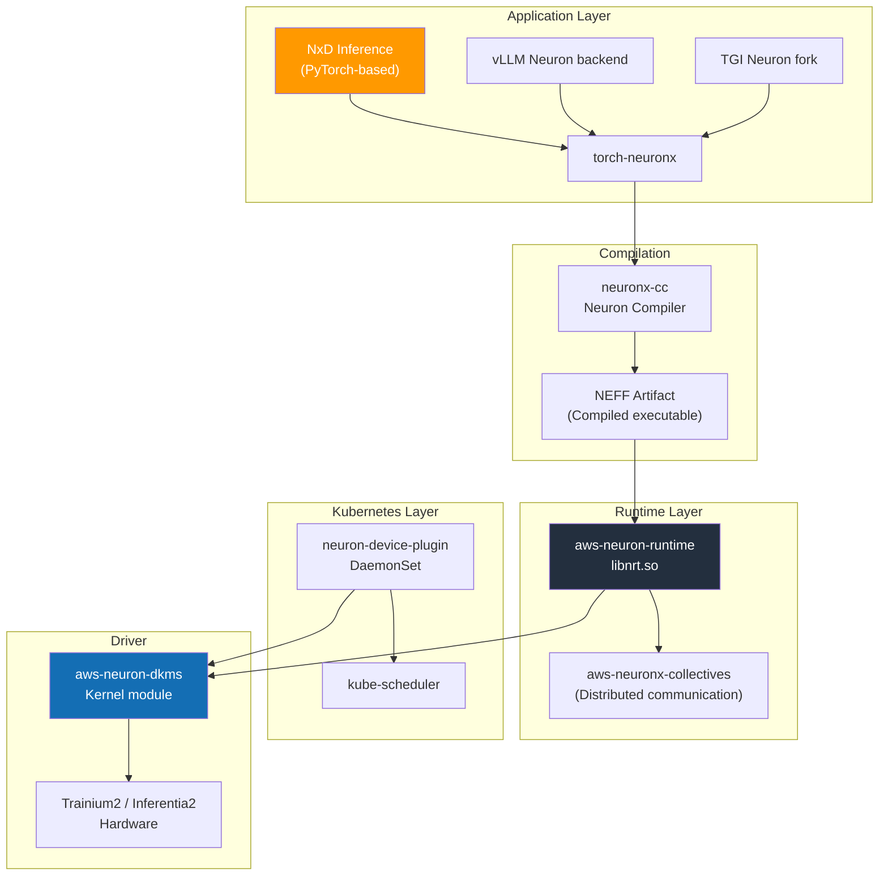
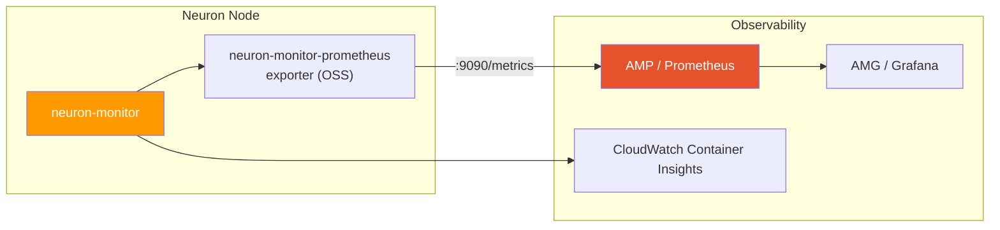

# AWS Neuron Stack

AWS Neuron is a software stack for running training and inference workloads on AWS-designed AI accelerators (Trainium, Inferentia). Similar to how NVIDIA's CUDA + GPU Operator combination works on NVIDIA GPUs, Neuron SDK + Neuron Device Plugin abstracts Trainium/Inferentia chips as Kubernetes resources on EKS.

This document covers the Neuron software stack, Device Plugin, Karpenter configuration, and inference framework selection criteria for operating Trainium2/Inferentia2 instances on EKS. For NVIDIA GPU-based stacks, refer to [NVIDIA GPU Stack](./nvidia-gpu-stack.md); for overall node type selection, see [EKS GPU Node Strategy](./eks-gpu-node-strategy.md).

| Layer | Role | Core Components |
|-------|------|----------------|
| **Infrastructure Automation** | Neuron driver, runtime, Device Plugin | aws-neuron-dkms, neuron-device-plugin |
| **Compiler** | Model → NEFF (Neuron Executable) compilation | neuronx-cc (Neuron Compiler) |
| **Runtime** | NeuronCore execution, memory management | aws-neuron-runtime, neuronx-collectives |
| **Inference Framework** | Large-scale LLM serving | NxD Inference, vLLM Neuron backend, TGI Neuron |
| **Observability** | NeuronCore metrics, profiling | neuron-monitor, neuron-top, neuron-ls |

---

## 1. Why Neuron

### 1.1 Three Reasons to Choose Neuron

**1) Cost Efficiency (Per-Token TCO)**

Based on AWS official materials, Trainium2/Inferentia2 have lower per-token costs compared to similar-performance GPUs. The effect is particularly significant under these conditions:

- Stable inference traffic sustained long-term (> 3 months)
- Standard Transformer-family models based on FP8/INT8/BF16
- Workloads eligible for AWS Reserved/Savings Plans

**2) Capacity Availability**

When NVIDIA H100/H200/B200 supply is tight, Trainium2 is relatively easier to procure. Particularly when p5/p5en inventory is scarce in certain US/Asia regions, Neuron becomes a practical alternative.

**3) Continuity with Bedrock**

Some FMs served by Bedrock (Claude, Llama, Titan, etc.) run internally on the Neuron stack. Choosing Neuron in the Bedrock → Self-hosted migration path allows reuse of compiled artifacts and operational patterns.

### 1.2 Suitable/Unsuitable Workloads

| Category | Workloads |
|----------|-----------|
| **Suitable** | Standard Llama/Mistral/Qwen-family inference, large-scale long-term operations, FP8/BF16-based serving, Bedrock-style governance |
| **Caution Required** | Newly released models with novel architectures (support delay), workloads dependent on custom CUDA kernels, some AWQ/GPTQ quantization formats |
| **Unsuitable** | Research/experimental environments with frequent model architecture changes, code tightly coupled to CUDA-only libraries (Triton inference server custom kernels) |

:::info Neuron vs NVIDIA Decision Principles
- **Model ecosystem recency is critical** → NVIDIA GPU (H100/H200/B200)
- **Long-term operational TCO / Capacity is critical** → Trainium2 / Inferentia2
- **Hybrid operations with Bedrock** → Prioritize Neuron review
:::

---

## 2. Instance Lineup

This is the Neuron instance lineup as of 2026-04 based on AWS official product pages and EC2 user guides. Actual regional availability must be verified in the AWS console.

### 2.1 Inference-Only Instances (Inferentia2)

| Instance | Chips | NeuronCore | Total Accelerator Memory | vCPU | Memory | Network |
|----------|-------|-----------|-------------------------|------|--------|---------|
| inf2.xlarge | 1× Inferentia2 | 2 | 32 GB | 4 | 16 GB | Up to 15 Gbps |
| inf2.8xlarge | 1× Inferentia2 | 2 | 32 GB | 32 | 128 GB | Up to 25 Gbps |
| inf2.24xlarge | 6× Inferentia2 | 12 | 192 GB | 96 | 384 GB | 50 Gbps |
| inf2.48xlarge | 12× Inferentia2 | 24 | 384 GB | 192 | 768 GB | 100 Gbps |

### 2.2 Training/Inference Dual-Purpose Instances (Trainium1/Trainium2)

| Instance | Chips | NeuronCore | Total Accelerator Memory | vCPU | Memory | Network |
|----------|-------|-----------|-------------------------|------|--------|---------|
| trn1.2xlarge | 1× Trainium1 | 2 | 32 GB | 8 | 32 GB | Up to 12.5 Gbps |
| trn1.32xlarge | 16× Trainium1 | 32 | 512 GB | 128 | 512 GB | 800 Gbps EFA |
| trn1n.32xlarge | 16× Trainium1 | 32 | 512 GB | 128 | 512 GB | 1,600 Gbps EFA |
| trn2.48xlarge | 16× Trainium2 | 128 | 1.5 TB (HBM3) | 192 | 2 TiB | 3.2 Tbps EFA v3 |
| **trn2 Ultra** (trn2u.48xlarge, preview/limited availability) | 64× Trainium2 (4×trn2 NeuronLink) | 512 | 6 TB (HBM3) | - | - | 12.8 Tbps |

:::caution Version and Specification Notes
- NeuronCore counts and memory capacity are based on AWS official materials and reporting units may vary with SDK releases. Verify actual devices with `neuron-ls` before deployment.
- **trn2 Ultra (trn2u)** is defined in AWS official announcements as "ultraserver combining 4 trn2s with NeuronLink." **As of 2026-04, it may be in preview or limited availability**; general availability, regional scope, and Spot support must be confirmed with AWS account teams or official documentation.
- inf1 (1st generation Inferentia) is not covered in this document. Use Inferentia2/Trainium2 for new deployments.
:::

---

## 3. Neuron SDK 2.x Stack Architecture

### 3.1 Layer Structure



### 3.2 Core Components

| Component | Description | Deployment Form |
|-----------|-------------|-----------------|
| **aws-neuron-dkms** | Linux kernel module. Creates `/dev/neuron*` device nodes | Pre-installed in AMI or DKMS package |
| **aws-neuron-runtime (libnrt)** | NeuronCore execution, memory management, scheduling | Included in container image |
| **aws-neuronx-collectives** | Collectives for distributed training/inference (AllReduce, AllGather, etc.) | Included in container image |
| **neuronx-cc** | Graph compiler. Converts PyTorch/JAX models to NEFF | Used in development/build stage |
| **torch-neuronx** | PyTorch 2.x frontend. `torch.compile(backend="neuronx")` | pip package |
| **neuron-device-plugin** | Kubernetes Device Plugin. Registers `aws.amazon.com/neuron*` resources | DaemonSet |
| **neuron-monitor / neuron-top / neuron-ls** | Observability and profiling tools | Container image/CLI |

:::info Neuron SDK 2.x (Latest stable version as of 2026-04)
Neuron SDK is regularly updated in the 2.x release train. Key features of the latest stable version as of 2026-04:

- Official support for Trainium2 (trn2) + trn2 Ultra (NeuronLink)
- NxD Inference LLM library (pre-compiled checkpoints for Llama 3/4, DBRX, Mistral families)
- Official vLLM Neuron backend support (continuous batching, PagedAttention-like structure)
- PyTorch 2.5+ / JAX compatibility
- FP8 (E4M3/E5M2) inference path

Check exact minor version in [AWS Neuron SDK Release Notes](https://awsdocs-neuron.readthedocs-hosted.com/en/latest/release-notes/).
:::

### 3.3 Compilation Model and NEFF

Neuron uses an **Ahead-of-Time (AOT) compilation model**. It doesn't run directly in PyTorch eager mode; `neuronx-cc` must convert the computation graph into NeuronCore hardware instructions (NEFF, Neuron Executable File Format) for execution.

```
PyTorch / JAX model
        ↓  torch-neuronx trace/compile
Neuron IR (HLO)
        ↓  neuronx-cc
NEFF (Neuron Executable) — Initial compilation 5-30 min, then cache reuse
        ↓  aws-neuron-runtime
Trainium / Inferentia hardware execution
```

**Operational Implications:**
- First Pod startup can take 20-30+ minutes for NEFF compilation → **Pre-compile and cache in S3/ECR**
- Model weight changes require recompilation → Manage NEFF artifacts in CI pipeline
- NxD Inference provides **pre-compiled checkpoints** for official models to reduce initial startup time

---

## 4. EKS Integration

### 4.1 Neuron Device Plugin Deployment

Neuron Device Plugin registers the node's `/dev/neuron*` devices as Kubernetes extended resources. Use AWS official YAML/Helm charts.

```bash
# Example deployment with official YAML
kubectl apply -f https://raw.githubusercontent.com/aws-neuron/aws-neuron-sdk/master/src/k8/k8s-neuron-device-plugin.yml
kubectl apply -f https://raw.githubusercontent.com/aws-neuron/aws-neuron-sdk/master/src/k8/k8s-neuron-device-plugin-rbac.yml
```

After deployment, the following appears in node resources:

```bash
kubectl describe node <trn2-node> | grep aws.amazon.com
# Allocatable:
#   aws.amazon.com/neuron:       16    # trn2.48xlarge: Trainium2 chip count
#   aws.amazon.com/neuroncore:  128    # Total NeuronCore count
#   aws.amazon.com/neurondevice: 16    # Device file count
```

### 4.2 Resource Request Patterns

When requesting Neuron resources in Pod specs, choose one of three units:

| Resource | Meaning | When to Use |
|----------|---------|-------------|
| `aws.amazon.com/neuron` | Neuron chip unit (Trainium2 chips in trn2) | When chip-level allocation is clear |
| `aws.amazon.com/neuroncore` | NeuronCore unit (8 per trn2 chip) | For fine-grained core-level scheduling |
| `aws.amazon.com/neurondevice` | `/dev/neuron*` device file unit | For legacy / specific tool compatibility |

```yaml
# Example: Use entire trn2.48xlarge (16 chips = 128 NeuronCores)
apiVersion: v1
kind: Pod
metadata:
  name: llama3-70b-neuron
spec:
  nodeSelector:
    node.kubernetes.io/instance-type: trn2.48xlarge
  tolerations:
    - key: aws.amazon.com/neuron
      operator: Exists
      effect: NoSchedule
  containers:
    - name: server
      image: public.ecr.aws/neuron/pytorch-inference-neuronx:2.x
      resources:
        limits:
          aws.amazon.com/neuron: "16"
        requests:
          aws.amazon.com/neuron: "16"
```

```yaml
# Example: Use only 4 NeuronCores (2 inf2.xlarge + half NeuronCores)
resources:
  limits:
    aws.amazon.com/neuroncore: "4"
```

### 4.3 Node Taint / Toleration Pattern

Recommend the same pattern as NVIDIA GPU nodes.

```yaml
# Apply taint to node (configured in Karpenter NodePool)
taints:
  - key: aws.amazon.com/neuron
    effect: NoSchedule
```

```yaml
# Declare toleration in Pod
tolerations:
  - key: aws.amazon.com/neuron
    operator: Exists
    effect: NoSchedule
```

### 4.4 AMI Selection

| AMI | Neuron Driver | Recommended Use |
|-----|--------------|-----------------|
| **EKS Optimized AMI (Neuron)** | Pre-installed | Production standard — `--ami-type AL2023_x86_64_NEURON` or equivalent |
| **Deep Learning AMI (Neuron)** | Pre-installed + Neuron SDK tools | Development/debugging nodes |
| **General AL2023** | Manual installation (DKMS) | Not recommended |

When using Neuron-optimized AMI with EKS managed node groups, `nodeadm` automatically configures Neuron drivers.

---

## 5. Karpenter NodePool Examples

### 5.1 trn2 Training/Large Inference NodePool

```yaml
apiVersion: karpenter.sh/v1
kind: NodePool
metadata:
  name: neuron-trn2
spec:
  template:
    metadata:
      labels:
        accelerator: neuron
        accelerator-family: trainium2
    spec:
      requirements:
        - key: karpenter.k8s.aws/instance-family
          operator: In
          values: ["trn2"]
        - key: karpenter.sh/capacity-type
          operator: In
          values: ["spot", "on-demand"]
        - key: topology.kubernetes.io/zone
          operator: In
          values: ["us-east-2a", "us-east-2b", "us-east-2c"]
      taints:
        - key: aws.amazon.com/neuron
          effect: NoSchedule
      nodeClassRef:
        group: karpenter.k8s.aws
        kind: EC2NodeClass
        name: neuron-nodeclass
  disruption:
    consolidationPolicy: WhenEmpty
    consolidateAfter: 10m
  limits:
    aws.amazon.com/neuron: "64"
```

### 5.2 inf2 Low-Cost Inference NodePool

```yaml
apiVersion: karpenter.sh/v1
kind: NodePool
metadata:
  name: neuron-inf2
spec:
  template:
    metadata:
      labels:
        accelerator: neuron
        accelerator-family: inferentia2
    spec:
      requirements:
        - key: karpenter.k8s.aws/instance-family
          operator: In
          values: ["inf2"]
        - key: karpenter.sh/capacity-type
          operator: In
          values: ["spot", "on-demand"]
      taints:
        - key: aws.amazon.com/neuron
          effect: NoSchedule
      nodeClassRef:
        group: karpenter.k8s.aws
        kind: EC2NodeClass
        name: neuron-nodeclass
  limits:
    aws.amazon.com/neuron: "48"
```

### 5.3 EC2NodeClass (Neuron AMI)

```yaml
apiVersion: karpenter.k8s.aws/v1
kind: EC2NodeClass
metadata:
  name: neuron-nodeclass
spec:
  amiSelectorTerms:
    - alias: al2023@latest   # When using Neuron-optimized AMI variant, explicit id specification recommended
  role: KarpenterNodeRole-eks-genai
  subnetSelectorTerms:
    - tags:
        karpenter.sh/discovery: eks-genai
        subnet-type: private
  securityGroupSelectorTerms:
    - tags:
        karpenter.sh/discovery: eks-genai
  blockDeviceMappings:
    - deviceName: /dev/xvda
      ebs:
        volumeSize: 500Gi   # NEFF cache + model weights storage
        volumeType: gp3
        iops: 16000
        throughput: 1000
        encrypted: true
  metadataOptions:
    httpTokens: required
```

:::tip AMI Selection Notes
In Karpenter EC2NodeClass `amiSelectorTerms`, the `al2023` alias refers to the standard AL2023 AMI. To use variants with pre-installed Neuron drivers, specify the SSM parameter or explicit AMI ID for the Neuron-optimized AMI published by AWS. Installing Neuron DKMS via UserData is possible but not recommended.
:::

---

## 6. Inference Frameworks

There are three main frameworks for serving LLMs on Neuron.

### 6.1 NxD Inference (Neuron Distributed Inference)

AWS officially maintains this **large-scale LLM inference library**. Based on PyTorch, provides Tensor/Pipeline Parallelism, Continuous Batching, PagedAttention-like memory management, and Speculative Decoding for Llama families and major public models.

**Features:**
- Llama 3/4, DBRX, Mistral, Mixtral etc. **pre-compiled checkpoint Official provision**
- TP/PP configuration API at NeuronCore level
- Optimization profile similar to Bedrock internal serving path
- Apache 2.0 / AWS Official Supported

### 6.2 vLLM Neuron backend

vLLM's Neuron backend was introduced experimentally in 2024, and feature parity has been rapidly improving in 2025~2026. As of 2026-04, continuous batching and OpenAI-compatible API serving are available for major LLMs (Llama 3/4, Qwen, Mistral).

**Features:**
- Compatible with existing vLLM deployment scripts using `vllm --device neuron --tensor-parallel-size N`
- While PagedAttention itself is a CUDA implementation, the Neuron backend provides equivalent block-based KV management
- Neuron parity for latest vLLM features (speculative decoding, chunked prefill, prefix caching) varies by feature, so **must check release notes**

### 6.3 TGI (Text Generation Inference) Neuron fork

HuggingFace maintains a TGI fork based on **optimum-neuron**. Through `optimum[neuronx]`, HuggingFace models can be easily compiled and served on Neuron.

**Features:**
- Tightly integrated with HuggingFace Hub-based workflows
- TGI itself has been in maintenance mode since 2025 → new features are slower compared to vLLM
- Compatible with SageMaker's HuggingFace LLM DLC

### 6.4 Framework Comparison

| Aspect | NxD Inference | vLLM Neuron backend | TGI Neuron fork |
|------|--------------|--------------------|-----------------| 
| **Maintainer** | AWS Official | vLLM community + AWS contributions | HuggingFace + AWS contributions |
| **Model Coverage** | AWS-selected official models (Llama/Mistral/DBRX, etc.) | Neuron-ported vLLM-supported models | optimum-neuron supported HuggingFace models |
| **pre-compiled checkpoint** | Provided | Partial | Partial |
| **OpenAI-compatible API** | Supported | Supported | Supported |
| **Continuous Batching** | Supported | Supported | Supported |
| **Speculative Decoding** | Supported (model-specific) | Partially supported | Limited |
| **Prefix Caching** | Model-specific | Limited | Limited |
| **Update Speed** | AWS release cycle | vLLM release cycle (fast) | Slow (maintenance mode) |
| **Recommended Use** | Large-scale production with AWS official models | Diverse models and latest vLLM features | HuggingFace ecosystem continuity |

:::tip Framework Selection Guide
- **Large-scale Llama production** → NxD Inference (pre-compiled checkpoint advantage)
- **Diverse models and latest vLLM features** → vLLM Neuron backend
- **Existing HuggingFace Hub-based pipelines** → TGI Neuron fork
- **New projects** are recommended to choose between NxD Inference or vLLM Neuron
:::

---

## 7. Supported Model Matrix

Based on AWS Neuron official Model Zoo and NxD Inference support matrix. For the latest support coverage, check [AWS Neuron Samples GitHub](https://github.com/aws-neuron/aws-neuron-samples) and [NxD Inference documentation](https://awsdocs-neuron.readthedocs-hosted.com/en/latest/libraries/nxd-inference/index.html).

### 7.1 Major Officially Supported Models (as of 2026-04)

| Model | Size | Recommended Instance | Pre-compiled | Notes |
|------|-----|------------|-------------|------|
| Llama 3.1 8B / 70B | 8B / 70B | inf2.48xlarge / trn2.48xlarge | ✅ | NxD Official |
| Llama 3.3 70B | 70B | trn2.48xlarge | ✅ | NxD Official |
| Llama 4 (Scout/Maverick) | 17B-400B | trn2.48xlarge / trn2 Ultra | Check release status | NxD support expanding |
| Mistral 7B / Mixtral 8x7B | 7B / 47B | inf2.48xlarge | ✅ | NxD/vLLM Supported |
| Mixtral 8x22B | 141B | trn2.48xlarge | Partial | MoE, EP required |
| Qwen3 series | 4B-32B | inf2 / trn2 | Partial | vLLM Neuron backend recommended |
| DBRX 132B | 132B | trn2.48xlarge | ✅ | NxD Official (MoE) |
| DeepSeek V3 | 671B MoE | trn2 Ultra | Limited | Check compilation & memory constraints |

:::caution Future Model Support
Latest large MoE models (DeepSeek V3, Llama 4 Maverick, GLM-5, etc.) are being added to Neuron support incrementally. Before deployment, always check the **NxD Inference support matrix and Release Notes at that time**. This document's table is for reference purposes and does not guarantee specific version support.
:::

### 7.2 Quantization Support

| Format | Neuron Support |
|------|------------|
| BF16 | Default |
| FP16 | Supported |
| FP8 (E4M3, E5M2) | Trainium2 Supported, Inferentia2 Limited |
| INT8 (weights) | Supported (model-specific) |
| AWQ | Limited (check model & version) |
| GPTQ | Limited |
| GGUF | Not supported |

---

## 8. Observability

### 8.1 Neuron-Specific Tools

| Tool | Role | When to Use |
|-----|------|---------|
| **neuron-ls** | List Neuron devices on the node | Initial diagnosis |
| **neuron-top** | Real-time NeuronCore utilization, memory, power | Real-time monitoring |
| **neuron-monitor** | Stream metrics in JSON format | Prometheus exporter input |
| **neuron-profile** | Profile NEFF execution | Performance optimization |

### 8.2 Prometheus / CloudWatch Integration



**Collection chain:**
- `neuron-monitor` outputs NeuronCore utilization, HBM usage, device temperature, execution latency, etc. as JSON stream
- OSS community `neuron-monitor-prometheus` exporter converts this to Prometheus format
- AMP (Amazon Managed Prometheus) collects via remote-write and AMG (Amazon Managed Grafana) dashboards
- CloudWatch Container Insights Neuron metrics can also be utilized

For detailed AMP/AMG configuration, refer to [Monitoring·Observability Setup](../../reference-architecture/monitoring-observability-setup.md) .

### 8.3 Key Metrics

| Metric | Description | Usage |
|-------|------|------|
| `neuron_core_utilization` | NeuronCore utilization (%) | HPA/KEDA trigger |
| `neuron_device_memory_used` | HBM usage (MB) | OOM prevention, capacity planning |
| `neuron_execution_latency` | Inference request processing latency | SLO monitoring |
| `neuron_hardware_ecc_events` | ECC error count | Hardware health check |
| `neuron_power_watts` | Power per chip (W) | Thermal & cost management |

---

## 9. Limitations and Considerations

### 9.1 Feature Constraints

| Category | Constraint |
|------|------|
| **Custom Kernels** | CUDA-only kernels (FlashAttention custom impl, etc.) require direct porting to Neuron |
| **Quantization** | AWQ/GPTQ some variants, GGUF not supported |
| **Compilation Time** | New model initial compilation 20-30+ minutes → NEFF cache essential |
| **Debugging** | nvidia-smi GPU telemetry tool ecosystem is narrower |
| **Open Source Ecosystem** | No equivalent "integrated orchestrator" like NVIDIA GPU Operator / DCGM — combination of Neuron Device Plugin + separate exporter |

### 9.2 Operational Considerations

:::warning Pre-Production Deployment Checklist
- [ ] Verify that target model is **supported in current version** by NxD Inference or vLLM Neuron backend
- [ ] **Pre-compile model NEFF in CI stage** and manage as artifact in S3/ECR
- [ ] Configure considering first Pod startup delay `readinessProbe` / `startupProbe` configuration (with sufficiently large initialDelaySeconds)
- [ ] HPA/KEDA trigger metrics verify that `neuron_core_utilization` is properly collected
- [ ] Verify Trainium2 capacity by region and establish Spot interrupt policy
- [ ] Document model version synchronization policy for hybrid operations with Bedrock
:::

### 9.3 Workloads to Avoid on Neuron

- R&D experiments changing model architecture weekly — compilation cost occurs repeatedly
- Triton Inference Server + custom Python backend deeply coupled with existing stack
- Rare calls with very small requests (&lt;10 tokens/sec) — warmup/compilation overhead is relatively large

---

## 10. Related Documents

- [EKS GPU Node Strategy](./eks-gpu-node-strategy.md) — AWS accelerator selection guide, NVIDIA vs Neuron
- [NVIDIA GPU Stack](./nvidia-gpu-stack.md) — Comparison criteria with NVIDIA stack
- [GPU Resource Management](./gpu-resource-management.md) — Karpenter/KEDA/DRA-based autoscaling
- [vLLM Model Serving](../inference-frameworks/vllm-model-serving.md) — vLLM-based inference engine (CUDA path)
- [MoE Model Serving](../inference-frameworks/moe-model-serving.md) — MoE architecture concepts and Trainium2 deployment strategy
- [Monitoring·Observability Setup](../../reference-architecture/monitoring-observability-setup.md) — AMP/AMG, Langfuse, OTel

## References

- [AWS Neuron SDK GitHub (aws-neuron)](https://github.com/aws-neuron/aws-neuron-sdk)
- [AWS Neuron Documentation](https://awsdocs-neuron.readthedocs-hosted.com/)
- [AWS Neuron Samples](https://github.com/aws-neuron/aws-neuron-samples)
- [NxD Inference Documentation](https://awsdocs-neuron.readthedocs-hosted.com/en/latest/libraries/nxd-inference/index.html)
- [Neuron SDK Release Notes](https://awsdocs-neuron.readthedocs-hosted.com/en/latest/release-notes/)
- [AWS Trainium2 Product Page](https://aws.amazon.com/machine-learning/trainium/)
- [AWS Inferentia2 Product Page](https://aws.amazon.com/machine-learning/inferentia/)
- [vLLM Neuron Backend Documentation](https://docs.vllm.ai/en/latest/getting_started/installation.html#neuron-installation)
- [optimum-neuron (HuggingFace)](https://github.com/huggingface/optimum-neuron)
- [AWS Neuron Kubernetes Device Plugin](https://github.com/aws-neuron/aws-neuron-sdk/tree/master/src/k8)
