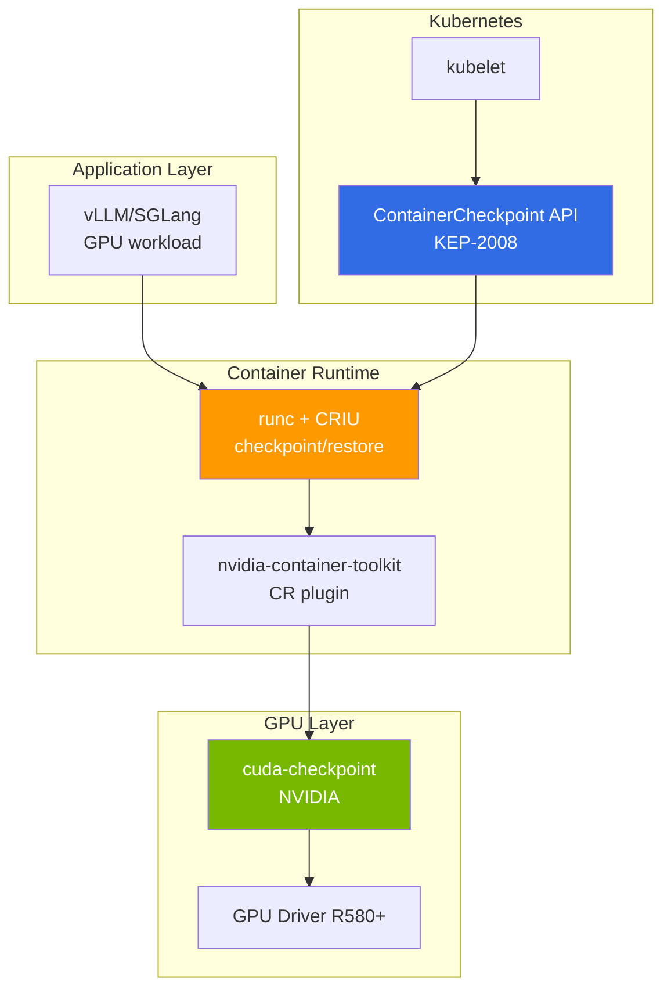

:::caution Experimental / Research Preview
As of April 2026, GPU CRIU is in alpha/beta state with NVIDIA cuda-checkpoint + CRIU + runc integration and not production-ready. This document provides technology trends and validation checklists.
:::

:::caution Verification pending
The practical alternative (graceful drain + warm start) ordering and EKS Auto Mode constraints are in a pre-verification state awaiting GLM-5 operator real-world validation. Timing and ordering measured values and banner will be updated upon completion.

Verification tracking: [Issue #7](https://github.com/devfloor9/engineering-playbook/issues/7)
:::

# CRIU-based GPU Live Migration (Preview)

## 1. Why CRIU: Spot Reclaim and KV Cache Loss Problems

### Problem Statement

Spot instance usage is a core cost reduction strategy in large-scale LLM serving environments (85-94% savings). However, Spot reclaim events cause critical issues:

**GLM-5 (744B MoE) Case on p5en.48xlarge H200×8:**

| Item | Time | Notes |
|------|-----|------|
| Spot reclaim warning | 2min | Only time AWS provides |
| Model reloading time | 15-20min | 744B parameter weight loading |
| KV Cache warmup | 5-10min | Major prefix regeneration |
| **Total recovery time** | **22-32min** | Cannot handle urgent requests |
| **Cost** | $40-65/reclaim | Based on p5en ~$120/hr |

**Fundamental Limitations of Spot Reclaim:**

```
Spot reclaim warning (2min)
  ↓
  ├─ gracefulShutdown (1-2min) — Complete in-flight requests
  ├─ Model unload (30sec-1min) — Memory deallocation
  └─ Pod termination
       ↓
  New node provisioning (3-5min)
       ↓
  Model reloading (15-20min) ← bottleneck
       ↓
  KV Cache warmup (5-10min) ← bottleneck
       ↓
  Resume serving (total 25-37min)
```

### Limitations of Existing Alternatives

| Alternative | Advantages | Limitations |
|------|------|------|
| **Warm Replica** | Immediate failover | GPU 2× cost ($240/hr → $480/hr) |
| **llm-d KV Offload** | KV Cache-only network transfer | Model reloading still required |
| **On-Demand fallback** | Stable | 10× cost vs Spot |
| **Multi-AZ distribution** | AZ fault tolerance | Does not solve Spot reclaim itself |

### Core Problem CRIU Aims to Solve

CRIU (Checkpoint/Restore In Userspace) saves the **entire state** of a running process to disk (checkpoint) and enables resumption from that point on another node (restore).

**Expected benefits when applied to GPU workloads:**

```
Spot reclaim warning (2min)
  ↓
  CRIU checkpoint (1-2min) — GPU memory + process state dump
  ↓
  New node provisioning (3-5min)
  ↓
  CRIU restore (1-3min) ← Model reloading omitted
  ↓
  Resume serving (total 5-10min, 70-80% reduction)
```

**Savings effect:**

- **Recovery time**: 25-37min → 5-10min (70-80% reduction)
- **Cost**: $40-65/reclaim → $10-20 (50-70% savings)
- **SLA**: Urgent requests can be handled in 5min instead of 22min

---

## 2. Technology Stack Status (2026.04)

### Overall Architecture



### Core Component Maturity

| Component | Version | Status | Notes |
|---------|------|------|------|
| **CRIU** | v4.0+ | Stable | CPU workloads production-verified |
| **cuda-checkpoint** | driver 570+ | **Active Development** | NVIDIA Labs, no official release tags, UVM/IPC memory unsupported ([repo](https://github.com/NVIDIA/cuda-checkpoint)) |
| **nvidia-container-toolkit** | v1.17+ | Experimental | CR (checkpoint/restore) plugin included |
| **runc** | v1.2+ | Alpha | CRIU integration, GPU CR support |
| **K8s ContainerCheckpoint API** | **1.30 Beta (default enabled)** | **Beta** | KEP-2008, 1.25 Alpha → 1.30 Beta (default `true`). GA schedule unconfirmed |
| **K8s GPU checkpoint official support** | - | **Unsupported** | KEP-2008 documentation: "external hardware device (GPU, InfiniBand) access may fail". Only AMD partially works |
| **EKS support** | - | **Unsupported** | Auto Mode cannot control feature gates, Standard Mode also lacks official GPU CR validation |

:::warning Maturity Warning (2026-04-20 Re-validation)
- **cuda-checkpoint**: NVIDIA Labs project, no tagged releases on GitHub. Driver 570+ explicitly states "actively developed". UVM·IPC memory unsupported, x64 only
- **K8s ContainerCheckpoint API**: 1.25 Alpha → **1.30 Beta (default enabled)**. GA schedule not confirmed in Kubernetes enhancements tracker (as of 2026-04)
- **K8s KEP-2008 own note**: "Checkpointing anything with access to an external hardware device like a GPU or InfiniBand can fail" — **NVIDIA GPU not officially supported**, only AMD partially works
- **EKS**: Auto Mode cannot control feature gates. Standard Mode also lacks AWS official GPU CR documentation
- **Production cases**: No public large-scale LLM GPU CRIU production cases (as of 2026-04)
:::

### Technology Stack Details

#### CRIU (Checkpoint/Restore In Userspace)

- **Role**: Checkpoint Linux process memory, file descriptors, network sockets, thread state
- **GPU Constraints**: Does not recognize GPU memory by default → cuda-checkpoint required
- **Maturity**: CPU workloads stable with 10+ years history. Used by Docker/Podman

#### cuda-checkpoint (NVIDIA)

- **GitHub**: [NVIDIA/cuda-checkpoint](https://github.com/NVIDIA/cuda-checkpoint)
- **Role**: Dump/restore CUDA context, GPU memory (device memory), unified memory
- **Constraints**:
  - H100/H200: device memory max 80GB/141GB → checkpoint file size identical
  - PCIe BAR remapping: restore only to nodes with identical GPU UUID
  - NVLink topology fixed: Multi-GPU workloads require identical topology
  - CUDA version match: checkpoint/restore requires identical CUDA version

#### nvidia-container-toolkit CR plugin

- **Role**: Automatically calls cuda-checkpoint when containerd/runc checkpoint/restores GPU containers
- **Configuration**: `checkpoint-restore = true` in `/etc/nvidia-container-runtime/config.toml`
- **Status**: Experimental support in v1.17+

#### K8s ContainerCheckpoint API (KEP-2008)

```yaml
# K8s 1.30+ (Beta, feature gate default enabled)
apiVersion: v1
kind: Pod
metadata:
  name: vllm-pod
spec:
  enableServiceLinks: false
  containers:
  - name: vllm
    image: vllm/vllm-openai:latest
    # checkpoint target container
```

**checkpoint creation:**

```bash
kubectl checkpoint create <pod-name> \
  --container=vllm \
  --output=/var/lib/kubelet/checkpoints/vllm-ckpt.tar
```

**restore (on new node):**

```bash
kubectl apply -f pod-restore.yaml  # checkpoint path reference
```

:::caution K8s API Constraints (2026-04-20 Re-validation)
- 1.30: **Beta, default enabled** — No separate feature gate activation required (but CRI-O default, containerd partial support)
- GPU checkpoint: KEP-2008 officially unsupported (AMD limited, NVIDIA requires separate cuda-checkpoint + nvidia-container-toolkit CR plugin configuration)
- EKS Auto Mode: containerd-based with kubelet/container runtime tuning restrictions → effectively unusable
- EKS Standard Mode: CRI-O replacement + Custom AMI + driver pinning is realistic path, no AWS official support
:::

---

## 3. Fundamental Constraints of GPU State Checkpoint

### Device Memory Dump Size

| GPU | VRAM | checkpoint file size | Transfer time (10GbE) | Transfer time (100GbE) |
|-----|------|-------------------|-----------------|------------------|
| A100 40GB | 40GB | ~40GB | 32sec | 3.2sec |
| H100 80GB | 80GB | ~80GB | 64sec | 6.4sec |
| H200 141GB | 141GB | ~141GB | 113sec | 11.3sec |
| H200 x8 | 1,128GB | ~1,128GB | **15min** | **1.5min** |

:::warning Network bottleneck
p5en.48xlarge (H200×8) checkpoint is **1.1TB**. If cross-node transfer is required:
- 10GbE: 15min (impossible within 2min Spot reclaim)
- 100GbE: 1.5min (possible within 2min Spot reclaim, but ENA constraints)
- **Cross-node migrate effectively impossible**, only same-node restart realistic
:::

### PCIe BAR Remapping Constraints

GPUs communicate with CPU through PCIe Base Address Register (BAR). BAR addresses saved during checkpoint are **hardware-dependent**, with the following constraints:

| Scenario | Feasibility | Reason |
|---------|---------|------|
| Same node restart | ✅ | Same PCIe slot, same BAR address |
| Same instance type (same AZ) | ⚠️ Experimental | GPU UUID match difficult to guarantee |
| Same instance type (Cross-AZ) | ❌ | Different PCIe topology |
| Heterogeneous (H200→H100) | ❌ | Different architecture·memory size |

### NVLink Topology Fixed

Multi-GPU workloads (TP=4, TP=8) depend on NVLink connection structure between GPUs. Checkpoint saves **GPU index and NVLink topology as absolute paths**, so:

```
Original:
  GPU 0 <--NVLink--> GPU 1
  GPU 2 <--NVLink--> GPU 3

Restore on different topology:
  GPU 0 <--PCIe--> GPU 1  ← NVLink broken
  GPU 2 <--NVLink--> GPU 3
  → Tensor Parallelism communication failure
```

**Conclusion**: TP>1 workloads can **only restore to nodes with identical NVLink configuration**

### CUDA Context Version Match

- **CUDA Runtime Version**: checkpoint/restore requires identical CUDA version (12.2 ↔ 12.3 impossible)
- **Driver ABI Compatibility**: GPU driver major version match required (R580 ↔ R570 impossible)
- **AMI Pinning**: EKS Auto Mode cannot control driver versions → Karpenter + Custom AMI required

---

## 4. EKS Application Scenario Matrix

### Scenario-specific Feasibility

| Scenario | Feasibility | Complexity | Notes |
|---------|-----------|-------|------|
| **(a) Same node restart** | ✅ Ready | Medium | OS update, kubelet restart |
| **(b) Same instance type migrate** | ⚠️ Experimental | High | GPU UUID match difficult to guarantee |
| **(c) Heterogeneous migrate (H200↔H100)** | ❌ Blocked | - | Different architecture |
| **(d) Cross-AZ migrate** | ❌ Blocked | - | NIXL recommended |

### (a) Same node restart — Ready

**Use Case:**
- Node OS update without Spot reclaim
- kubelet/containerd restart
- GPU driver update (same major version)

**Procedure:**

```bash
# 1. Checkpoint creation
kubectl checkpoint create gpu-pod-1 \
  --container=vllm \
  --output=/mnt/efs/checkpoints/vllm-$(date +%s).tar

# 2. Node maintenance
kubectl drain <node> --ignore-daemonsets
# ... OS update, driver update
kubectl uncordon <node>

# 3. Restore
kubectl apply -f vllm-pod-restore.yaml
```

**Constraints:**
- EFS/FSx checkpoint storage required (local disk deleted on restart)
- Same GPU index (CUDA_VISIBLE_DEVICES) maintenance required
- kubelet feature gate `ContainerCheckpoint=true` required (EKS Standard)

**Expected effect:**
- Restart time: 20-30min → 3-5min (80-85% reduction)
- Maintenance window: 1hr → 10min

### (b) Same instance type migrate — Experimental

**Use Case:**
- Migrate to same instance type node during Spot reclaim
- Node replacement (hardware failure)

**Prerequisites:**
- Same instance type (p5en.48xlarge → p5en.48xlarge)
- Same AZ (us-east-2a → us-east-2a)
- **Same GPU UUID** — Not guaranteed by AWS ⚠️

**GPU UUID pre-verification:**

```bash
# Collect GPU UUID of all p5en nodes
kubectl get nodes -l node.kubernetes.io/instance-type=p5en.48xlarge \
  -o json | jq '.items[].metadata.labels["nvidia.com/gpu.uuid"]'
```

**NodePool constraints:**

```yaml
apiVersion: karpenter.sh/v1
kind: NodePool
metadata:
  name: gpu-checkpoint-pool
spec:
  template:
    spec:
      requirements:
        - key: node.kubernetes.io/instance-type
          operator: In
          values: ["p5en.48xlarge"]  # Single type pinned
        - key: topology.kubernetes.io/zone
          operator: In
          values: ["us-east-2a"]  # Single AZ pinned
        # GPU UUID match cannot be guaranteed — AWS API unsupported
```

**Problems:**
- AWS does not provide GPU UUID pre-reservation API
- Fallback to cold start required on checkpoint/restore failure
- Checkpoint + network transfer + restore impossible within 2min Spot reclaim

**Conclusion:** Technically possible but **not operationally viable**. For validation environment experiments

### (c) Heterogeneous migrate (H200↔H100) — Blocked

**Impossible reasons:**
- Different GPU architecture (Hopper vs Ada)
- Different VRAM size (141GB vs 80GB)
- Different CUDA Compute Capability (9.0 vs 8.0)
- cuda-checkpoint does not support cross-architecture conversion

### (d) Cross-AZ migrate — Blocked

**Use Case:**
- Migrate to different AZ during AZ failure

**Alternative: llm-d NIXL KV Offload**

Cross-AZ GPU workload migration is better suited for **llm-d NIXL** instead of CRIU:

```
AZ-A:
  Prefill Pod → NIXL transmit KV Cache to AZ-B

AZ-B:
  Decode Pod ← Receive KV Cache → Model already loaded
```

| Item | CRIU | llm-d NIXL |
|------|------|-----------|
| Transfer data | Entire GPU memory (1TB+) | KV Cache only (tens of GB) |
| Transfer time | 15min+ | Seconds |
| Model reloading | Unnecessary | Required (but Decode Pod already loaded) |
| Network | 10GbE → bottleneck | RDMA/NVLink → ultra-fast |

**Details**: [llm-d EKS Auto Mode — Disaggregated Serving](../inference-frameworks/llm-d-eks-automode.md#disaggregated-serving-concept)

---

## 5. Practical Alternatives and Combination Strategies

### Alternative Comparison Table

| Strategy | Recovery time | Cost | Complexity | Maturity | Recommended |
|------|---------|-----|-------|-------|:----:|
| **Warm Replica** | Immediate | 2× | Low | Production | ⭐⭐⭐ |
| **llm-d NIXL KV Offload** | 5-10min | 1× | Medium | GA | ⭐⭐⭐⭐ |
| **vLLM Prefix Cache Warm-up** | 10-15min | 1× | Low | GA | ⭐⭐⭐ |
| **Karpenter do-not-evict** | - | Spot unavailable | Low | GA | ⭐⭐ |
| **2-replica Hot Standby** | 1-2min | 2× | Low | Production | ⭐⭐⭐⭐⭐ |
| **CRIU (same node)** | 3-5min | 1× | High | Experimental | ⭐ |
| **CRIU (Cross-node)** | Impossible | - | - | Blocked | ❌ |

### llm-d NIXL KV Offload

llm-d's Disaggregated Serving separates Prefill/Decode and transmits KV Cache via NIXL. During Spot reclaim:

```
Prefill Pod (Spot, p5en.48xlarge):
  - Spot reclaim warning → checkpoint KV Cache to S3/FSx (seconds)
  - Pod termination

Decode Pod (On-Demand, p5.48xlarge):
  - Continue serving existing model
  - Perform decode only without prefill (temporary TTFT increase)

New Prefill Pod:
  - Restore KV Cache from S3/FSx (5-10sec)
  - Resume serving
```

**Advantages:**
- Decode Pod uninterrupted
- Prefill recovery only 5-10sec
- Model reloading unnecessary

**Disadvantages:**
- TTFT temporarily increases (during Prefill Pod recovery)

**Details**: [llm-d EKS Auto Mode](../inference-frameworks/llm-d-eks-automode.md)

### vLLM Prefix Cache Warm-up

vLLM v0.18+ supports automatic prefix caching. Major prefixes can be pre-processed to warm up the cache before Spot reclaim:

```python
# warm-up script
prefixes = [
    "You are a helpful assistant...",
    "Analyze the following document...",
    # ... major system prompts
]

for prefix in prefixes:
    client.completions.create(
        model="gpt-4",
        prompt=prefix,
        max_tokens=1  # Minimal generation for cache warmup only
    )
```

**Advantages:**
- vLLM default feature, no separate tools required
- Major prefixes respond quickly after Spot reclaim

**Disadvantages:**
- Model reloading still requires 15-20min
- Full KV Cache recovery impossible

### Karpenter do-not-evict

Karpenter's `do-not-evict` annotation can exclude specific Pods from Spot reclaim targets:

```yaml
apiVersion: v1
kind: Pod
metadata:
  annotations:
    karpenter.sh/do-not-evict: "true"
spec:
  # ... GPU Pod definition
```

**Advantages:**
- Uninterrupted

**Disadvantages:**
- Use Spot instances like On-Demand → Cost benefit lost
- Cannot prevent AWS Spot reclaim itself (annotation only controls Karpenter's voluntary consolidation)

### 2-replica Hot Standby (Recommended)

The most stable strategy in production environments is **running 2 replicas**:

```yaml
apiVersion: apps/v1
kind: Deployment
metadata:
  name: vllm-serving
spec:
  replicas: 2  # Maintain minimum 2
  template:
    spec:
      containers:
      - name: vllm
        # ... Same model serving
      affinity:
        podAntiAffinity:
          requiredDuringSchedulingIgnoredDuringExecution:
          - labelSelector:
              matchLabels:
                app: vllm-serving
            topologyKey: kubernetes.io/hostname  # Place on different nodes
```

**Cost:**
- Running 2 instances doubles cost → With Spot usage **similar to On-Demand 1 instance cost**
- p5.48xlarge Spot $12/hr × 2 = $24/hr vs On-Demand $98/hr × 1

**Advantages:**
- Remaining 1 replica handles traffic during 1 replica Spot reclaim
- No service interruption during recovery
- 2× throughput via load balancing

**Disadvantages:**
- 2× GPU usage (but Spot achieves On-Demand 1 instance cost level)

### Combination Strategy

The realistic optimal configuration is **2-replica Hot Standby + llm-d NIXL**:

```
┌─────────────────────┐
│ llm-d Gateway       │
│ (KV Cache-aware LB) │
└──────────┬──────────┘
           │
    ┌──────┴───────┐
    │              │
┌───▼───┐      ┌───▼───┐
│Replica│      │Replica│
│   1   │      │   2   │
│ Spot  │      │ Spot  │
│p5.48x │      │p5.48x │
└───────┘      └───────┘
  Different AZ   Different AZ

Replica 1 Spot reclaim:
  → llm-d switches traffic to Replica 2
  → KV Cache shared via NIXL (as needed)
  → Service normal during Replica 1 recovery (15min)
```

**Advantages:**
- No service interruption
- TTFT reduction via KV Cache reuse
- Cost-effective with Spot utilization

---

## 6. Roadmap and Validation Points

### CNCF/Kubernetes Community Trends (2026-04-20 Re-validation)

| Period | Major Milestone | Actual Status |
|------|-----------|---------|
| K8s 1.25 | ContainerCheckpoint API **Alpha** | Completed |
| K8s 1.30 | ContainerCheckpoint API **Beta (default enabled)** | Completed |
| K8s 1.31+ | GA promotion | **Schedule unconfirmed** (no target milestone announcement in enhancements tracker) |
| - | KEP-2008 official GPU support | **Not included** — Explicitly states "external hardware device checkpoint may fail" |
| **2026.04** | **Current position** | **Beta (CPU), GPU only has NVIDIA Labs experimental implementation** |

:::info CNCF WG Activity
CNCF Batch Working Group and AI Working Group are discussing GPU checkpoint, but **no GPU-specific KEP has been proposed**. The only realistic progress is the combination of nvidia-container-toolkit CR plugin (experimental) and cuda-checkpoint (driver 570+, no tagged releases). Separate KEP needed for LLM serving workload (TP>1, NVLink-dependent) checkpoint.
:::

### Self-validation Checklist

To experiment with CRIU GPU checkpoint, check the following checklist:

#### Infrastructure Requirements

- [ ] **EKS Standard Mode** — Auto Mode cannot control feature gates
- [ ] **K8s 1.30+** — ContainerCheckpoint API required
- [ ] **kubelet feature gate** — `ContainerCheckpoint=true`
- [ ] **GPU Driver R580+** — cuda-checkpoint compatible version
- [ ] **Custom AMI** — Driver version pinning required
- [ ] **EFS/FSx mount** — checkpoint file storage (HDD slow, SSD recommended)

#### Software Stack

- [ ] **runc v1.2+** — CRIU integration version
- [ ] **CRIU v4.0+** — GPU support build
- [ ] **cuda-checkpoint beta** — Download from NVIDIA Labs
- [ ] **nvidia-container-toolkit v1.17+** — CR plugin enabled
- [ ] **Same CUDA version** — checkpoint/restore node match

#### Node Configuration

- [ ] **NodePool single instance type** — Heterogeneous impossible
- [ ] **Single AZ** — Cross-AZ impossible
- [ ] **GPU UUID collection** — Create pre-mapping table
- [ ] **NVLink topology match** — Required for multi-GPU

#### Test Scenarios

1. **Same node restart test** (Low Risk)
   - Test Pod checkpoint/restore
   - Compare model loading time vs checkpoint time
   - Verify memory integrity (inference result consistency)

2. **Same instance type migrate test** (High Risk)
   - Manual GPU UUID mapping
   - Checkpoint network transfer
   - Measure restore success rate
   - Verify fallback procedure on failure

3. **Spot reclaim simulation** (Production Readiness)
   - Forced checkpoint with 2min timer
   - Measure recovery time
   - Analyze SLA impact

### Actions on Verification Failure

| Failure Type | Action |
|---------|------|
| checkpoint creation failure | Check cuda-checkpoint logs, verify GPU driver version |
| restore failure (GPU UUID mismatch) | Restore only to same node, redesign NodePool |
| restore failure (CUDA version mismatch) | Pin AMI version, prohibit driver updates |
| Spot reclaim not completed within 2min | Reduce checkpoint size, expand network bandwidth, or abandon CRIU |
| Performance degradation | Measure CRIU overhead, consider warm-up time |

---

## References

- **CRIU official documentation**: [criu.org](https://criu.org/)
- **NVIDIA cuda-checkpoint GitHub**: [github.com/NVIDIA/cuda-checkpoint](https://github.com/NVIDIA/cuda-checkpoint)
- **K8s KEP-2008**: [ContainerCheckpoint API](https://github.com/kubernetes/enhancements/tree/master/keps/sig-node/2008-forensic-container-checkpointing)
- **nvidia-container-toolkit CR plugin**: [NVIDIA Container Toolkit Docs](https://docs.nvidia.com/datacenter/cloud-native/container-toolkit/latest/)
- **llm-d NIXL**: [llm-d GitHub](https://github.com/llm-d/llm-d) — KV Cache network transfer alternative

## Related Documents

- [EKS GPU Node Strategy](./eks-gpu-node-strategy.md) — Spot/On-Demand strategy, cost optimization
- [GPU Resource Management](./gpu-resource-management.md) — Karpenter autoscaling
- [llm-d EKS Auto Mode](../inference-frameworks/llm-d-eks-automode.md) — Disaggregated Serving + NIXL KV Offload
- [vLLM Model Serving](../inference-frameworks/vllm-model-serving.md) — Prefix Cache, KV Cache management
