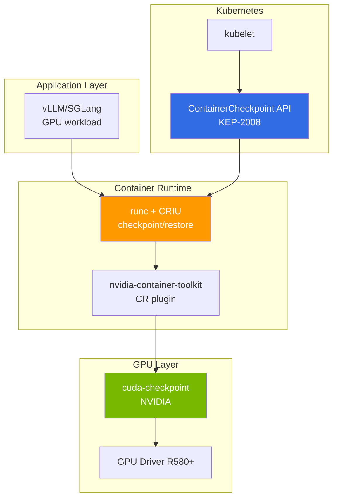

:::caution Experimental / Research Preview
As of April 2026, GPU CRIU is in alpha/beta state with NVIDIA cuda-checkpoint + CRIU + runc integration and not production-ready. This document provides technology trends and validation checklists.
:::

:::caution Verification pending
The practical alternative (graceful drain + warm start) ordering and EKS Auto Mode constraints are in a pre-verification state awaiting GLM-5 operator real-world validation. Timing and ordering measured values and banner will be updated upon completion.

Verification tracking: [Issue #7](https://github.com/devfloor9/engineering-playbook/issues/7)
:::


# CRIU-based GPU Live Migration (Preview)

## 1. Why CRIU: Spot Reclaim and KV Cache Loss Problems

### Problem Statement

Spot instance usage is a core cost reduction strategy in large-scale LLM serving environments (85-94% savings). However, Spot reclaim events cause critical issues:

**GLM-5 (744B MoE) Case on p5en.48xlarge H200×8:**

| Item | time | Notes |
|------|-----|------|
| Spot reclaim warning | 2min | AWSthat characters œê³µí•˜is charactersœ characters¼í•œ time |
| Model reloading time | 15-20min | 744B parameter weight loading |
| KV Cache warmup | 5-10min | Major prefix regeneration |
| **Total recovery time** | **22-32min** | Cannot handle urgent requests |
| **Cost** | $40-65/reclaim | p5en per hour ~$120 based on |

**Fundamental Limitations of Spot Reclaim:**

```
Spot reclaim warning (2min)
  ↓
  ├─ gracefulShutdown (1-2min) — Complete in-flight requests
  ├─ 모델 characters–¸ë¡œë“œ (30sec-1min) — Memory deallocation
  └─ Pod termination
       ↓
  New node provisioning (3-5min)
       ↓
  Model reloading (15-20min) ← bottleneck
       ↓
  KV Cache warmup (5-10min) ← bottleneck
       ↓
  Resume serving (characters´ 25-37min)
```

### Limitations of Existing Alternatives

| Alternative | Advantages | Limitations |
|------|------|------|
| **Warm Replica** | Immediate failover | GPU 2× Cost ($240/hr → $480/hr) |
| **llm-d KV Offload** | KV Cacheonly network transfer | Model reloadingis characters—¬characters „히 required |
| **On-Demand fallback** | Stable | Spot vs. 10× Cost |
| **Multi-AZ mincharacters‚°** | AZ Fault tolerance | Spot reclaim does not solve reclaim itself |

### CRIU Core Problem CRIU Aims to Solve

CRIU(Checkpoint/Restore In Userspace)is of a running process **entire state**to save to disk(checkpoint)and, resume from that point on another node(restore)enables you to.

**GPU Expected benefits when applied to GPU workloads:**

```
Spot reclaim warning (2min)
  ↓
  CRIU checkpoint (1-2min) — GPU memory + process status dump
  ↓
  New node provisioning (3-5min)
  ↓
  CRIU restore (1-3min) ← Model reloading omitted
  ↓
  Resume serving (characters´ 5-10min, 70-80% reduction)
```

**Savings effect:**

- **복구 time**: 25-37min → 5-10min (70-80% reduction)
- **Cost**: reclaimper $40-65 → $10-20 (50-70% savings)
- **SLA**: urgent requests 22min instead of 5min can be handled within

---

## 2. Technology Stack Status (2026.04)

### Overall Architecture



### Core Component Maturity

| Component | Version | status | Notes |
|---------|------|------|------|
| **CRIU** | v4.0+ | Stable | CPU workloads production-verified |
| **cuda-checkpoint** | alpha/beta | **Experimental** | NVIDIA Official tool, GPU memory dump |
| **nvidia-container-toolkit** | v1.17+ | Beta | CR(checkpoint/restore) plugin included |
| **runc** | v1.2+ | Alpha | CRIU integration, GPU CR support |
| **K8s ContainerCheckpoint API** | 1.30 alpha | **Alpha** | KEP-2008, feature gate required |
| **EKS support** | - | **Not supported** | Self-validation required |

:::warning Maturity Warning
- **cuda-checkpoint**: NVIDIA Labs project beta or below. No official support
- **K8s API**: 1.30 alpha, 1.34until beta expected. GAthe 1.35+ projected
- **EKS**: ContainerCheckpoint APIthat feature gatecharacters´ë¯€to EKSunclear if enabled in
- **production cases**: publicly available GPU CRIU no production cases (2026.04 based on)
:::

### Technology Stack Details

#### CRIU (Checkpoint/Restore In Userspace)

- **Role**: Linux process memory, file descriptors, network sockets, charactersŠ¤ë ˆë“œ statusto checkpoint
- **GPU Constraints**: by default GPU memorydoes not recognize → cuda-checkpoint required
- **characters„±charactersˆ™ë„**: CPU workloadis 10years+ characters—­characters‚¬to Stable. Docker/Podmanalso used

#### cuda-checkpoint (NVIDIA)

- **GitHub**: [NVIDIA/cuda-checkpoint](https://github.com/NVIDIA/cuda-checkpoint)
- **Role**: CUDA context, GPU memory(device memory), unified memoryto dump/restore
- **Constraintscharacters‚¬í•­**:
  - H100/H200: device memory charactersµœëŒ€ 80GB/141GB → checkpoint 파characters¼ Size 동characters¼
  - PCIe BAR remapping: 동characters¼ GPU UUID 노드로only restore that능
  - NVLink topology Fixed: Multi-GPU workloadrequires same topology required
  - CUDA Version match: checkpoint/restore characters‹œ 동characters¼ CUDA Version required

#### nvidia-container-toolkit CR plugin

- **Role**: containerd/runcthat GPU containerto checkpoint/restore할 때 cuda-checkpointto automatic call
- **Configuration**: `/etc/nvidia-container-runtime/config.toml`at `checkpoint-restore = true`
- **Status**: v1.17+at experimental support

#### K8s ContainerCheckpoint API (KEP-2008)

```yaml
# K8s 1.30+ (alpha, feature gate required)
apiVersion: v1
kind: Pod
metadata:
  name: vllm-pod
spec:
  enableServiceLinks: false
  containers:
  - name: vllm
    image: vllm/vllm-openai:latest
    # checkpoint target container
```

**checkpoint creation:**

```bash
kubectl checkpoint create <pod-name> \
  --container=vllm \
  --output=/var/lib/kubelet/checkpoints/vllm-ckpt.tar
```

**restore (on new node):**

```bash
kubectl apply -f pod-restore.yaml  # checkpoint path reference
```

:::caution K8s API Constraints
- 1.30: alpha, feature gate `ContainerCheckpoint=true` required
- EKS Auto Mode: feature gate cannot control → unavailable
- EKS Standard Mode: kube-apiserver/kubelet flag modification required
:::

---

## 3. GPU status checkpointof fundamental Constraints

### Device Memory Dump Size

| GPU | VRAM | checkpoint 파characters¼ Size | Transfer time (10GbE) | Transfer time (100GbE) |
|-----|------|-------------------|-----------------|------------------|
| A100 40GB | 40GB | ~40GB | 32sec | 3.2sec |
| H100 80GB | 80GB | ~80GB | 64sec | 6.4sec |
| H200 141GB | 141GB | ~141GB | 113sec | 11.3sec |
| H200 x8 | 1,128GB | ~1,128GB | **15min** | **1.5min** |

:::warning Network bottleneck
p5en.48xlarge (H200×8)of checkpointis **1.1TB**is. cross-node Transferis requiring ê²½charactersš°:
- 10GbE: 15min (Spot reclaim 2min within impossible)
- 100GbE: 1.5min (Spot reclaim 2min within that능, but ENA Constraints)
- **characters‹¤characters§ˆcharacters with cross-node migrateis impossible**, only same-node restart is realistic
:::

### PCIe BAR remapping Constraints

GPUthe PCIe Base Address Register(BAR)to through CPUand communicates. checkpoint saved during BAR address is **hardware-dependent**characters´ë¯€to 다charactersŒ Constraintsis charactersžˆcharactersŠµë‹ˆë‹¤:

| Scenario | Feasibility | Reason |
|---------|---------|------|
| 동characters¼ 노드 restart | ✅ | 동characters¼ PCIe slot, 동characters¼ BAR address |
| 동characters¼ instance type (동characters¼ AZ) | ⚠️ Experimental | GPU UUID UUID match difficult to guarantee |
| 동characters¼ instance type (Cross-AZ) | ❌ | PCIe different topology |
| Heterogeneous (H200→H100) | ❌ | architecture·memory Size charactersƒis |

### NVLink Topology Fixed

Multi-GPU workload(TP=4, TP=8)the GPU between NVLink characters—°ê²° 구characters¡°to ofcharacters¡´. checkpointthe **GPU indexand NVLink topologyto characters ˆëŒ€ pathto save**하므로:

```
Original:
  GPU 0 <--NVLink--> GPU 1
  GPU 2 <--NVLink--> GPU 3

Restore on different topology:
  GPU 0 <--PCIe--> GPU 1  ← NVLink 끊김
  GPU 2 <--NVLink--> GPU 3
  → Tensor Parallelism 통characters‹  characters‹¤íŒ¨
```

**ê²°ë¡ **: TP>1 workloadis **동characters¼ NVLink 구characters„± 노드로only** restore that능

### CUDA Context Version characters¼characters¹˜

- **CUDA Runtime Version**: checkpoint/restore characters‹œ 동characters¼ CUDA Version required (12.2 ↔ 12.3 불that)
- **Driver ABI 호환characters„±**: GPU driver major Version characters¼characters¹˜ required (R580 ↔ R570 불that)
- **AMI Fixed**: EKS Auto Modeis driver Version cannot control → Karpenter + Custom AMI required

---

## 4. EKS characters charactersš© Scenario 매트릭charactersŠ¤

### Scenario별 Feasibility

| Scenario | Feasibility | Complexity | Notes |
|---------|-----------|-------|------|
| **(a) 동characters¼ 노드 restart** | ✅ Ready | Medium | OS update, kubelet restart |
| **(b) 동characters¼ instance type migrate** | ⚠️ Experimental | High | GPU UUID UUID match difficult to guarantee |
| **(c) Heterogeneous migrate (H200↔H100)** | ❌ Blocked | - | characters•„키텍characters²˜ charactersƒis |
| **(d) Cross-AZ migrate** | ❌ Blocked | - | NIXL recommended |

### (a) 동characters¼ 노드 restart — Ready

**Use Case:**
- Spot reclaim without 노드 OS update
- kubelet/containerd restart
- GPU driver update (동characters¼ major Version)

**Procedure:**

```bash
# 1. Checkpoint charactersƒcharacters„±
kubectl checkpoint create gpu-pod-1 \
  --container=vllm \
  --output=/mnt/efs/checkpoints/vllm-$(date +%s).tar

# 2. 노드 maintenance
kubectl drain <node> --ignore-daemonsets
# ... OS update, driver update
kubectl uncordon <node>

# 3. Restore
kubectl apply -f vllm-pod-restore.yaml
```

**Constraintscharacters‚¬í•­:**
- EFS/FSxto checkpoint save required (local disk is restart deleted on)
- 동characters¼ GPU index(CUDA_VISIBLE_DEVICES) maintain required
- kubelet feature gate `ContainerCheckpoint=true` required (EKS Standard)

**expected 효과:**
- restart time: 20-30min → 3-5min (80-85% reduction)
- maintenance charactersœˆë„charactersš°: 1time → 10min

### (b) 동characters¼ instance type migrate — Experimental

**Use Case:**
- Spot reclaim characters‹œ 동characters¼ instance type 노드to migration
- node replacement (hardware failure)

**Prerequisites:**
- 동characters¼ instance type (p5en.48xlarge → p5en.48xlarge)
- 동characters¼ AZ (us-east-2a → us-east-2a)
- **동characters¼ GPU UUID** — AWSnot guaranteed by AWS ⚠️

**GPU UUID Pre-verification:**

```bash
# all p5en 노드of GPU UUID collect
kubectl get nodes -l node.kubernetes.io/instance-type=p5en.48xlarge \
  -o json | jq '.items[].metadata.labels["nvidia.com/gpu.uuid"]'
```

**NodePool Constraints:**

```yaml
apiVersion: karpenter.sh/v1
kind: NodePool
metadata:
  name: gpu-checkpoint-pool
spec:
  template:
    spec:
      requirements:
        - key: node.kubernetes.io/instance-type
          operator: In
          values: ["p5en.48xlarge"]  # 단characters¼ type Fixed
        - key: topology.kubernetes.io/zone
          operator: In
          values: ["us-east-2a"]  # 단characters¼ AZ Fixed
        # GPU UUID characters¼characters¹˜ ë³´charactersž¥ impossible — AWS API Not supported
```

**문characters œcharacters :**
- AWSthe GPU UUID characters‚¬characters „ characters˜ˆcharacters•½ API not provided
- checkpoint/restore on failure fallbackwith cold start required
- Spot reclaim 2min within checkpoint + network Transfer + restore impossible

**Conclusion:** Technically possible but **not operationally viable**. for validation environment experiments

### (c) Heterogeneous migrate (H200↔H100) — Blocked

**impossible한 Reason:**
- GPU characters•„키텍characters²˜ charactersƒis (Hopper vs Ada)
- VRAM Size charactersƒis (141GB vs 80GB)
- CUDA Compute Capability charactersƒis (9.0 vs 8.0)
- cuda-checkpointthat characters•„키텍characters²˜ between 변환 Not supported

### (d) Cross-AZ migrate — Blocked

**Use Case:**
- AZ failure characters‹œ different AZto migration

**Alternative: llm-d NIXL KV Offload**

Cross-AZ GPU workload migrationis CRIU instead of **llm-d NIXL**is 더 characters í•©í•©ë‹ˆë‹¤:

```
AZ-A:
  Prefill Pod → KV Cacheto AZ-Bto NIXL Transfer

AZ-B:
  Decode Pod ← KV Cache receive → 모델is is미 to드된 status
```

| Item | CRIU | llm-d NIXL |
|------|------|-----------|
| Transfer Data | entire GPU memory (1TB+) | KV Cacheonly (charactersˆ˜characters‹­ GB) |
| Transfer time | 15min+ | charactersˆ˜ sec |
| Model reloading | 불required | required (but Decode Podis is미 to드) |
| network | 10GbE → bottleneck | RDMA/NVLink → secê³ characters† |

**charactersƒcharacters„¸**: [llm-d EKS Auto Mode — Disaggregated Serving](../inference-frameworks/llm-d-eks-automode.md#disaggregated-serving-replica념)

---

## 5. characters‹¤characters „ Alternativeê³¼ Combination Strategy

### Alternative comparison표

| strategy | 복구 time | Cost | Complexity | characters„±charactersˆ™also | recommended |
|------|---------|-----|-------|-------|:----:|
| **Warm Replica** | characters¦‰characters‹œ | 2× | Low | Production | ⭐⭐⭐ |
| **llm-d NIXL KV Offload** | 5-10min | 1× | Medium | GA | ⭐⭐⭐⭐ |
| **vLLM Prefix Cache Warm-up** | 10-15min | 1× | Low | GA | ⭐⭐⭐ |
| **Karpenter do-not-evict** | - | Spot 불that | Low | GA | ⭐⭐ |
| **2-replica Hot Standby** | 1-2min | 2× | Low | Production | ⭐⭐⭐⭐⭐ |
| **CRIU (동characters¼ 노드)** | 3-5min | 1× | High | Experimental | ⭐ |
| **CRIU (Cross-node)** | impossible | - | - | Blocked | ❌ |

### llm-d NIXL KV Offload

llm-dof Disaggregated Servingis Prefill/Decodeto min리and, KV Cacheto NIXLto Transfer. Spot reclaim characters‹œ:

```
Prefill Pod (Spot, p5en.48xlarge):
  - Spot reclaim warning → checkpoint KV Cache to S3/FSx (charactersˆ˜ sec)
  - Pod termination

Decode Pod (On-Demand, p5.48xlarge):
  - 기characters¡´ 모델 계characters† characters„œë¹™
  - Prefill without decodeonly charactersˆ˜í–‰ (characters¼characters‹œcharacters  TTFT characters¦that)

charactersƒˆ Prefill Pod:
  - KV Cacheto S3/FSxat 복구 (5-10sec)
  - Resume serving
```

**Advantages:**
- Decode Podis no interruption
- Prefill 복구only 5-10sec
- Model reloading 불required

**단characters :**
- TTFTthat temporarily increases (Prefill Pod during recovery)

**charactersƒcharacters„¸**: [llm-d EKS Auto Mode](../inference-frameworks/llm-d-eks-automode.md)

### vLLM Prefix Cache Warm-up

vLLM v0.18+is automatic prefix caching/ support. Spot reclaim characters „ characters£¼charactersš” prefixto 미리 characters²˜ë¦¬í•˜characters—¬ charactersºcharacters‹œto warmup할 charactersˆ˜ charactersžˆcharactersŠµë‹ˆë‹¤:

```python
# warm-up script
prefixes = [
    "You are a helpful assistant...",
    "Analyze the following document...",
    # ... characters£¼charactersš” characters‹œcharactersŠ¤í…œ prompt
]

for prefix in prefixes:
    client.completions.create(
        model="gpt-4",
        prompt=prefix,
        max_tokens=1  # charactersµœcharacters†Œ charactersƒcharacters„±with charactersºcharacters‹œonly warmup
    )
```

**Advantages:**
- vLLM default feature, 별also also구 불required
- Spot reclaim after characters£¼charactersš” prefixfast response

**단characters :**
- Model reloadingis characters—¬characters „히 15-20min required
- entire KV Cache recovery impossible

### Karpenter do-not-evict

Karpenterof `do-not-evict` with annotation, specific Podto Spot reclaim can exclude from target:

```yaml
apiVersion: v1
kind: Pod
metadata:
  annotations:
    karpenter.sh/do-not-evict: "true"
spec:
  # ... GPU Pod characters •of
```

**Advantages:**
- no interruption

**단characters :**
- Spot characters¸charactersŠ¤í„´charactersŠ¤to On-Demanduse like → Cost ischaracters  charactersƒcharacters‹¤
- AWS Spot reclaim cannot prevent itself (annotationis Karpenterof charactersžë°œcharacters  consolidationonly characters œcharacters–´)

### 2-replica Hot Standby (recommended)

Production 환경at thatcharactersž¥ Stablecharacters¸ strategyis **2replica replica operation**:

```yaml
apiVersion: apps/v1
kind: Deployment
metadata:
  name: vllm-serving
spec:
  replicas: 2  # charactersµœcharacters†Œ 2replica maintain
  template:
    spec:
      containers:
      - name: vllm
        # ... 동characters¼ 모델 characters„œë¹™
      affinity:
        podAntiAffinity:
          requiredDuringSchedulingIgnoredDuringExecution:
          - labelSelector:
              matchLabels:
                app: vllm-serving
            topologyKey: kubernetes.io/hostname  # different 노드to ×characters¹˜
```

**Cost:**
- 2대 operation characters‹œ Cost 2× → Spot when using **On-Demand 1similar to Cost**
- p5.48xlarge Spot $12/hr × 2 = $24/hr vs On-Demand $98/hr × 1

**Advantages:**
- 1replica replica Spot reclaim remaining when 1replicahandles traffic
- during recovery characters„œë¹„charactersŠ¤ no interruption
- throughput via load balancing 2×

**단characters :**
- GPU 2× usage (but Spotwith On-Demand 1level Cost)

### Combination Strategy

The realistic optimal configuration is **2-replica Hot Standby + llm-d NIXL**:

```
┌─────────────────────┐
│ llm-d Gateway       │
│ (KV Cache-aware LB) │
└──────────┬──────────┘
           │
    ┌──────┴───────┐
    │              │
┌───▼───┐      ┌───▼───┐
│Replica│      │Replica│
│   1   │      │   2   │
│ Spot  │      │ Spot  │
│p5.48x │      │p5.48x │
└───────┘      └───────┘
  different AZ        different AZ

Replica 1 Spot reclaim:
  → llm-dthat Replica 2switch traffic to
  → KV Cacheis NIXLto share (required characters‹œ)
  → Replica 1 복구 (15min) characters¤‘characters—also characters„œë¹„charactersŠ¤ characters •charactersƒ
```

**Advantages:**
- no service interruption
- KV Cache charactersž¬usagewith TTFT reduction
- Spot 활charactersš©with Cost 효charactersœ¨characters 

---

## 6. Roadmap and Validation Points

### CNCF/Kubernetes Community Trends

| Period | Major Milestone | status |
|------|-----------|------|
| K8s 1.30 | ContainerCheckpoint API alpha | Completed (2024.04) |
| K8s 1.32 | ContainerCheckpoint API beta | expected (2024.12) |
| K8s 1.34 | ContainerCheckpoint API GA | expected (2025.08) |
| K8s 1.35 | GPU checkpoint official support | 희망 (2026.02) |
| **2026.04** | **현charactersž¬ charactersœ„characters¹˜** | **Alpha/Beta Mixed** |

:::info CNCF WG Activity
CNCF Batch Working Groupê³¼ AI Working Groupat GPU checkpointto 논of characters¤‘is. However official KEPthe does not exist yet, nvidia-container-toolkitof Experimental 구현only characters¡´charactersž¬.
:::

### Self-validation characters²´í¬ë¦¬charactersŠ¤íŠ¸

CRIU GPU checkpointto characters‹¤í—˜í•˜ë ¤ë©´ 다charactersŒ characters²´í¬ë¦¬charactersŠ¤íŠ¸to 확characters¸í•˜characters„¸charactersš”:

#### Infrastructure Requirements

- [ ] **EKS Standard Mode** — Auto Modeis feature gate cannot control
- [ ] **K8s 1.30+** — ContainerCheckpoint API required
- [ ] **kubelet feature gate** — `ContainerCheckpoint=true`
- [ ] **GPU Driver R580+** — cuda-checkpoint 호환 Version
- [ ] **Custom AMI** — driver Version Fixed required
- [ ] **EFS/FSx mount** — checkpoint 파characters¼ save (HDDis 느림, SSD recommended)

#### Software Stack

- [ ] **runc v1.2+** — CRIU integration Version
- [ ] **CRIU v4.0+** — GPU support build
- [ ] **cuda-checkpoint beta** — NVIDIA Labsat 다charactersš´ë¡œë“œ
- [ ] **nvidia-container-toolkit v1.17+** — CR plugin enable
- [ ] **동characters¼ CUDA Version** — checkpoint/restore 노드 characters¼characters¹˜

#### 노드 Configuration

- [ ] **NodePool 단characters¼ instance type** — Heterogeneous 불that
- [ ] **단characters¼ AZ** — Cross-AZ 불that
- [ ] **GPU UUID collect** — characters‚¬characters „ 매핑 table create
- [ ] **NVLink topology characters¼characters¹˜** — Multi-GPU characters‹œ required

#### test Scenario

1. **동characters¼ 노드 restart test** (Low Risk)
   - test Pod checkpoint/restore
   - 모델 loading time vs checkpoint time comparison
   - memory integrity verification (inference result consistency)

2. **동characters¼ instance type migrate test** (High Risk)
   - GPU UUID manual mapping
   - checkpoint network Transfer
   - restore success rate measurement
   - on failure fallback procedure verification

3. **Spot reclaim simulation** (Production Readiness)
   - 2min forced with timer checkpoint
   - 복구 time measurement
   - SLA characters˜í–¥ mincharacters„

### verification on failure Action

| Failure Type | Action |
|---------|------|
| checkpoint charactersƒcharacters„± characters‹¤íŒ¨ | cuda-checkpoint check logs, GPU driver Version verification |
| restore characters‹¤íŒ¨ (GPU UUID mismatch) | 동characters¼ 노드로only restore, NodePool redesign |
| restore characters‹¤íŒ¨ (CUDA Version mismatch) | AMI Version Fixed, driver update prohibit |
| Spot reclaim 2min within 미Completed | checkpoint Size reduce, network 대characters—­í­ expand, 또is CRIU abandon |
| performance degradation | CRIU overhead measurement, warm-up time consider |

---

## References

- **CRIU official 문characters„œ**: [criu.org](https://criu.org/)
- **NVIDIA cuda-checkpoint GitHub**: [github.com/NVIDIA/cuda-checkpoint](https://github.com/NVIDIA/cuda-checkpoint)
- **K8s KEP-2008**: [ContainerCheckpoint API](https://github.com/kubernetes/enhancements/tree/master/keps/sig-node/2008-forensic-container-checkpointing)
- **nvidia-container-toolkit CR plugin**: [NVIDIA Container Toolkit Docs](https://docs.nvidia.com/datacenter/cloud-native/container-toolkit/latest/)
- **llm-d NIXL**: [llm-d GitHub](https://github.com/llm-d/llm-d) — KV Cache network Transfer Alternative

## Related Documents

- [EKS GPU 노드 strategy](./eks-gpu-node-strategy.md) — Spot/On-Demand strategy, Cost charactersµœcharacters í™”
- [GPU 리characters†ŒcharactersŠ¤ management](./gpu-resource-management.md) — Karpenter characters˜¤í† charactersŠ¤characters¼€characters¼ë§
- [llm-d EKS Auto Mode](../inference-frameworks/llm-d-eks-automode.md) — Disaggregated Serving + NIXL KV Offload
- [vLLM 모델 characters„œë¹™](../inference-frameworks/vllm-model-serving.md) — Prefix Cache, KV Cache management
