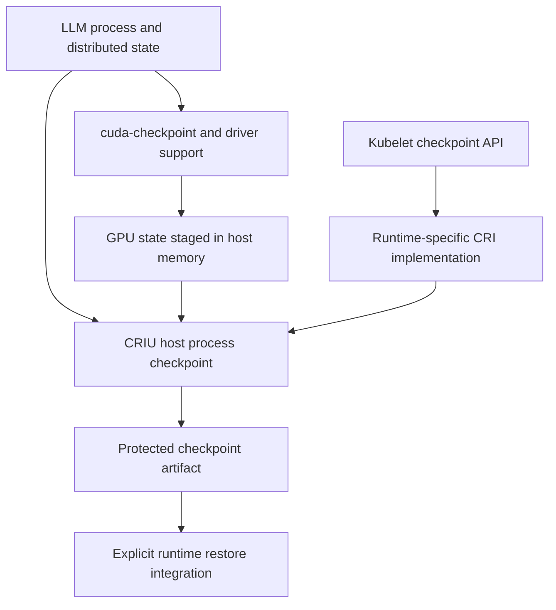

:::caution Experimental / Verification pending
This document describes GPU checkpoint/restore constraints and an operator verification procedure. NVIDIA features and Kubernetes API support do not establish operational acceptance of a particular EKS/LLM deployment. This review performed no GPU execution, drain, Spot interruption, or load test. Recovery-time, cost, and savings claims from the earlier draft lacked evidence and have been removed.

Operational verification: [Issue #7](https://github.com/devfloor9/engineering-playbook/issues/7). Public-source review: 2026-09-18.
:::

## 1. Why CRIU: Spot Reclaim and KV Cache Loss Problems

Preserving node process state and preserving service availability are separate design problems during Spot interruption.

### Problem Statement

EC2 Spot stop/terminate notices are normally issued about two minutes before interruption, on a best-effort basis. Hibernation can begin immediately. Do not treat two minutes as a guaranteed drain budget. Measure model loading, prefill, and node readiness with pinned model, weight format, storage, driver, and distributed configuration.

### Limitations of Existing Alternatives

| Alternative | What it preserves | Remaining constraint |
|---|---|---|
| Warm replica | Separate ready serving capacity | Spare throughput, failure domains, cost |
| KV transfer/external cache | KV blocks supported by the connector | Not full process or in-flight stream restoration |
| On-Demand capacity | Reduced Spot-reclamation exposure | Capacity, model readiness, ordinary failures |
| Multi-AZ | Some failure-domain separation | Correlated interruption, network, capacity |

### Core Problem CRIU Aims to Solve

CRIU saves supported Linux process state. GPU state requires integration with NVIDIA driver checkpoint functionality, plus review of host RAM, sockets, files, and distributed communication. Checkpoint, transfer, and restore are not guaranteed to beat cold start. Service continuity depends on ready alternative capacity and request handling.

## 2. Technology Stack Review (2026-09-18) {#2-technology-stack-status-202604}

The earlier April description was reviewed against public sources on 2026-09-18. The following is a version-specific feature review, not workload acceptance.

### Overall Architecture

This is a conceptual integration, not a standard automatic Kubernetes GPU migration controller.


```mermaid
flowchart TB
    APP[LLM process and distributed state] --> CRIU[CRIU host process checkpoint]
    APP --> CUDA[cuda-checkpoint and driver support]
    CUDA --> HOST[GPU state staged in host memory]
    HOST --> CRIU
    KUBELET[Kubelet checkpoint API] --> CRI[Runtime-specific CRI implementation]
    CRI --> CRIU
    CRIU --> ARTIFACT[Protected checkpoint artifact]
    ARTIFACT --> RESTORE[Explicit runtime restore integration]
```

### Core Component Maturity

| Component | Established scope | Operator must pin |
|---|---|---|
| CRIU | Linux process checkpoint/restore | CRIU, kernel, runtime build and features |
| cuda-checkpoint | Driver-specific capabilities: 550 baseline, 570 API, 580 migration | Utility commit/SHA256, driver, CUDA, release notes |
| ContainerCheckpoint | Kubernetes 1.30 beta (enabled by default) | Deployed Kubernetes/CRI checkpoint support |
| Restore | Separate runtime procedure from checkpoint API | Artifact format, restore tooling, observed results |
| EKS Auto Mode | AWS-managed OS, kubelet, runtime, and AMI | Tests within supported management boundaries |

### Technology Stack Details

A minimum version alone does not make an LLM stack restorable. Verify driver capabilities, CRIU integration, CRI checkpointing, and distributed runtime separately.

#### CRIU (Checkpoint/Restore In Userspace)

CRIU alone does not capture every NVIDIA device state. Combine the NVIDIA-side process of preserving CUDA state on the host and releasing device resources with host-process checkpointing. Artifacts may contain sensitive memory and tokens; control encryption, access, and retention.

#### cuda-checkpoint (NVIDIA)

The [NVIDIA cuda-checkpoint README](https://github.com/NVIDIA/cuda-checkpoint) distinguishes capabilities by driver version and describes GPU migration in driver 580. Verify source-to-target GPU mapping and device compatibility for the selected release. The reviewed README explicitly lists **UVM and `cuMemExportToShareableHandle` as unsupported**. Check IPC support for the selected driver release, and record the utility commit, binary hash, and driver version used for validation.

#### NVIDIA Container Toolkit Integration Boundary {#nvidia-container-toolkit-cr-plugin}

No official basis was established for a universal checkpoint-restore = true setting or a Toolkit 1.17+ CR plugin. Those instructions have been removed. Distinguish GPU device exposure by NVIDIA Container Toolkit from CRIU CUDA integration and verify the actual runtime integration.

#### K8s ContainerCheckpoint API (KEP-2008)

The standard interface is an authenticated kubelet POST /checkpoint/{namespace}/{pod}/{container}, with an optional timeout query. There is no standard kubectl checkpoint create command. Checkpointing creates a host artifact; referencing a path in ordinary Pod YAML does not restore it. Runtime support and kubelet authorization are required. GPU/InfiniBand restoration guarantees are outside this API’s scope.

## 3. Fundamental Constraints of GPU State Checkpoint

Actual captured allocations and host state determine checkpoint size, transfer, and restoration. The sum of nominal GPU VRAM is not a measured artifact size.

### Device Memory Dump Size

The ideal transfer lower bound is 8 × bytes / bits_per_second. **Assuming** 1,128 decimal GB gives 902.4 seconds at 10 Gbit/s or 90.24 seconds at 100 Gbit/s. This arithmetic excludes dump, restore, CPU copies, storage, protocol overhead, and contention. A 90.24-second lower bound does not establish completion within a Spot deadline.

### PCIe BAR Remapping Constraints

Matching BAR addresses or AZ does not determine support. Verify NVIDIA-supported device mapping, target GPU properties, driver conditions, and runtime restoration. A GPU UUID identifies a device; identical UUID reservation on another instance is not a general prerequisite.

### NVLink Topology Fixed

For tensor/pipeline parallel workloads, review every rank, NCCL communicator, CUDA IPC allocation, RDMA registration, and external peer. Equal topology does not guarantee restoration. A single CUDA process example does not validate a multi-GPU/multi-node LLM.

### CUDA Context Version Match

Record source/target kernel, AMI, CUDA runtime, driver, utility, CRIU, container runtime, and GPU properties. Determine compatibility from pinned release documentation and results. Custom AMIs, user driver pinning, and replacing the runtime with CRI-O are not Auto Mode operating options.

## 4. EKS Application Scenario Matrix

Every scenario awaits operational evidence. Location or instance name alone does not establish Ready/Blocked status.

### Scenario-specific Feasibility

| Scenario | Documentation assessment | Required evidence |
|---|---|---|
| Same host | Candidate for verification | Artifact survival, process/device restoration |
| Another host with equivalent GPUs | Version-dependent candidate | Device mapping, network, distributed state |
| Different GPU SKU | Compatibility must be established | NVIDIA release conditions, memory, kernel support |
| Cross-AZ | AZ alone is not a prohibition | Bandwidth, latency, cost, storage, application recovery |
| Auto Mode | Host stack cannot be replaced | AWS management/support boundary; no standard migration procedure claimed |

### (a) Same Node Restart — Verification Pending {#a-same-node-restart--ready}

The earlier Ready classification is withdrawn. Even same-host restart requires testing driver reset, storage lifetime, external connections, and workload integrity. Reboot and termination differ; not all local disks are erased by reboot. Keep required recovery artifacts outside a host that will terminate.

### (b) Same instance type migrate — Experimental

An identical instance type simplifies comparison but does not establish success. Map source GPUs to target GPUs and separately verify checkpoint, transfer, restore, and cold-start fallback. Restricting to one AZ reduces capacity options and is not a general prerequisite.

### (c) Heterogeneous Migration (H200↔H100) — Compatibility Review {#c-heterogeneous-migrate-h200h100--blocked}

H100 and H200 are both Hopper GPUs with compute capability 9.0. The earlier Hopper/Ada and 9.0/8.0 comparison was incorrect. This does not guarantee cross-SKU restoration: verify migration conditions, available memory, and used APIs against pinned NVIDIA documentation.

### (d) Cross-AZ Migration — Verification Pending {#d-cross-az-migrate--blocked}

An AZ boundary neither inherently prohibits CRIU nor guarantees seconds-long NIXL transfer. NIXL is a data-transfer layer; NVLink does not connect AZs. Verify cross-AZ routing, security, bandwidth, transfer cost, and a target replica with its model ready.

## 5. Practical Alternatives and Combination Strategies

Choose a recovery strategy using service SLOs, redundant capacity, cache compatibility, and operability. No fixed recovery time or zero downtime is guaranteed.

### Alternative Comparison Table

| Strategy | Condition to verify |
|---|---|
| Ready replica | Surviving capacity and failure-domain separation |
| Prefix warm-up | Recompute approved prefixes after replacement model readiness |
| Disaggregated serving | Actual connector/routing, decode KV possession, replacement prefill |
| CRIU | Supported stack, durable artifacts, restoration integrity, cold-start fallback |

### llm-d NIXL KV Transfer {#llm-d-nixl-kv-offload}

Disaggregated prefill/decode and NIXL transfer in llm-d/vLLM do not imply automatic S3 checkpointing. Whether decode can continue existing generation depends on already-received KV, connector, and rank state. New requests need an available prefill path. A lost prefill Pod still needs model loading on replacement. Validate durability, version compatibility, and failure policy separately for any external KV cache.

### vLLM Prefix Cache Warm-up

vLLM automatic prefix caching reuses prefill computation for matching prefixes. Its default in-memory cache is lost on process exit. Warming a terminating replica does not warm its replacement. After the replacement loads its model, process approved fixed prefixes and observe TTFT/cache hits. This is not restoration of all KV or active generation state. No warm-up calls were run in this review.

### Karpenter do-not-disrupt {#karpenter-do-not-evict}

The current Karpenter annotation is karpenter.sh/do-not-disrupt. It controls voluntary disruption and cannot prevent EC2 Spot interruption or node failure. PDBs and long grace periods do not extend EC2 termination deadlines. Verify interruption handling and NodePool terminationGracePeriod in the pinned Karpenter version.

### 2-replica Hot Standby (Recommended)

Two replicas alone guarantee neither availability nor twice the throughput. Verify matching selectors/labels, different nodes/failure domains, survivor capacity, model readiness, PDBs, and routing. Include loss of both replicas in a correlated Spot pool. Calculate cost using actual region, capacity type, and readiness duration.

### Combination Strategy

The graceful-drain and warm-start sequence below is an **operator procedure requiring approved execution**, not a record of a completed run.

```text
PREPARE (before interruption)
  Pin model/runtime/config; provision or identify ready alternate capacity.
  Load replacement model; warm approved prefixes on that replica.
  Verify serving readiness, capacity, model identity, and routing.

ON INTERRUPTION / MAINTENANCE
  Record notice arrival and actual termination deadline; do not assume 120 s.
  Cordon prevents scheduling only; separately stop new application admission.
  Route new requests to the ready replacement; record endpoint propagation.
  Let admitted requests/streams finish within the remaining budget.
  Cancel or report incomplete requests explicitly at the deadline.
  Terminate after drain completion or budget exhaustion.

RECOVERY
  Replenish capacity; warm replacement prefixes after model load.
  Verify first-token latency, errors, cache hits, and survivor capacity.
  If no replacement is ready, use approved fallback or return explicit errors.
```

preStop consumes the Pod terminationGracePeriodSeconds budget. The application drain budget is the minimum remaining EC2, Pod, and NodePool deadline, minus propagation time and safety margin. In a manual kubectl drain --grace-period=X --timeout=Y --ignore-daemonsets, X is Pod grace and Y is the CLI wait limit, not an availability guarantee. Drain affects workloads across namespaces on the node: inventory all affected workloads and PDBs. Do not race a separate drain controller against Karpenter/Auto Mode termination handling. Do not bypass failures with --force, --disable-eviction, or --delete-emptydir-data.

## 6. Roadmap and Validation Points

Track upstream support separately from deployment verification. Do not use an unversioned “no tagged release” claim as a support assessment.

### Kubernetes and NVIDIA Support Review {#cncfkubernetes-community-trends-2026-04-20-re-validation}

The official kubelet API page and KEP status describe ContainerCheckpoint as beta since 1.30, enabled by default. A target stable milestone in the KEP is not evidence of a shipped release. This is not GA of Kubernetes GPU live migration. Record pinned NVIDIA utility, driver, and CRIU commits/releases and repeat compatibility review when they change.

### Self-validation Checklist

Acceptance must link evidence in all four categories below. Local static checks cannot complete these items.

#### Infrastructure Requirements

- [ ] Record UTC test window, private account/profile/region, cluster/namespace/node manifest, and blast radius.
- [ ] Distinguish Auto Mode from user-managed GPU nodes; do not replace Auto Mode runtime, AMI, or drivers.
- [ ] Verify recovery capacity, storage lifetime, network, encryption/access control, and rollback ownership.

#### Software Stack

- [ ] Pin model revision/tokenizer, weights/quantization, TP/PP, serving engine, CUDA, NCCL, driver, kernel, CRI, CRIU, and utility commit/hash.
- [ ] Match used UVM/IPC/RDMA APIs to release support.
- [ ] Distinguish prefix caching, external KV storage, and process checkpoint persistence.

#### Node Configuration

- [ ] Record source/target GPU properties, UUID mapping, topology, host RAM, artifact size, and transfer path.
- [ ] Record PDB, readiness, preStop, Pod/NodePool deadlines, and interruption-handler ownership.
- [ ] Define fallback/error behavior for no warm capacity and correlated Spot loss.

#### Test Scenarios

1. In an operator-approved environment, record a fixed non-sensitive request fixture and load conditions. Distinguish synthetic/local review from real GPU testing.
2. Use a common UTC clock to record notice, deadline, admission stop, endpoint switch, last completed stream, SIGTERM/SIGKILL, replacement model readiness, and first token.
3. Reconcile success, cancellation, partial response, and duplicate execution by request ID. Use cache metrics/logs to establish whether KV was transferred, restored, or recomputed.
4. Report warm/cold TTFT p50/p95/p99, errors, drain completion fraction, unfinished count, and model readiness time. Preregister minimum samples, repetitions, and acceptable degradation.
5. For checkpointing, also verify restoration integrity, healthy distributed ranks, and cold-start fallback. A new release tag triggers review, not automatic approval.

### Actions on Verification Failure

On deadline overrun or restore failure, route to validated capacity and stop reusing the checkpoint. Preserve artifacts, configuration, and logs in controlled storage. Do not blindly replay broken streams; use deduplication procedures for tool operations with uncertain outcomes. Keep Experimental / Verification pending until operator acceptance is linked to deidentified evidence.

## References

Check these primary sources together with the deployed versions.

- [NVIDIA cuda-checkpoint](https://github.com/NVIDIA/cuda-checkpoint) — driver-specific features and restrictions
- [Kubelet checkpoint API](https://kubernetes.io/docs/reference/node/kubelet-checkpoint-api/) — request interface and feature state
- [Kubernetes Pod termination](https://kubernetes.io/docs/concepts/workloads/pods/pod-lifecycle/#pod-termination) — grace period and preStop
- [EKS Auto Mode managed instances](https://docs.aws.amazon.com/eks/latest/userguide/automode-learn-instances.html) — OS/runtime ownership
- [EC2 Spot interruption notices](https://docs.aws.amazon.com/AWSEC2/latest/UserGuide/spot-instance-termination-notices.html) — notice timing
- [Karpenter disruption](https://karpenter.sh/docs/concepts/disruption/) — interruption and do-not-disrupt
- [NVIDIA CUDA GPU capabilities](https://developer.nvidia.com/cuda/gpus) — H100/H200 compute capability
- [vLLM automatic prefix caching](https://docs.vllm.ai/en/latest/features/automatic_prefix_caching/) — cache reuse semantics
- [vLLM disaggregated prefill](https://docs.vllm.ai/en/latest/features/disagg_prefill/) — connector-dependent KV transfer
- [NVIDIA Container Toolkit](https://docs.nvidia.com/datacenter/cloud-native/container-toolkit/latest/) — container integration

## Related Documents

- [EKS GPU Node Strategy](./eks-gpu-node-strategy.md) — Spot/On-Demand strategy, cost optimization
- [GPU Resource Management](./gpu-resource-management.md) — Karpenter autoscaling
- [llm-d EKS Auto Mode](../inference-frameworks/llm-d-eks-automode.md) — Disaggregated Serving + NIXL KV Offload
- [vLLM Model Serving](../inference-frameworks/vllm-model-serving.md) — Prefix Cache, KV Cache management
