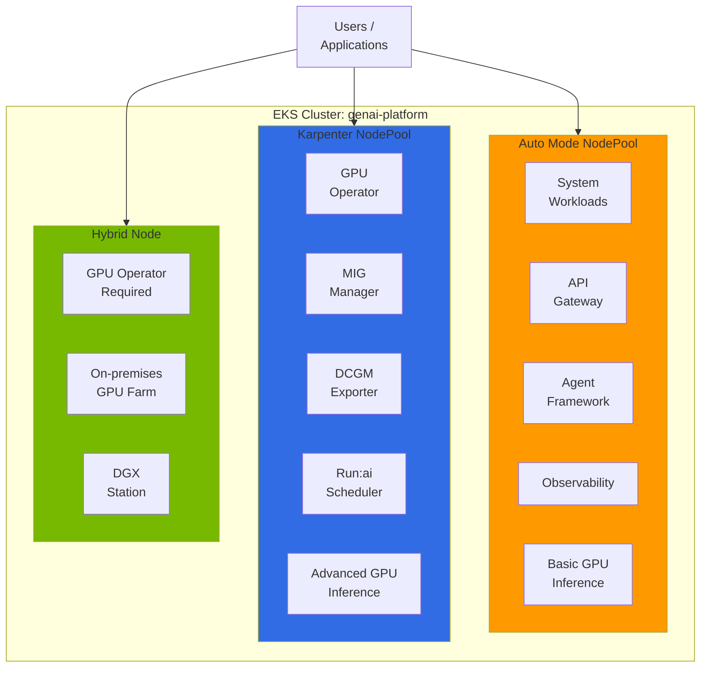
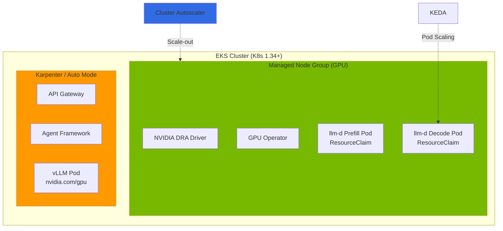
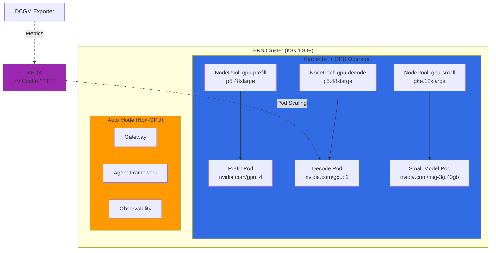
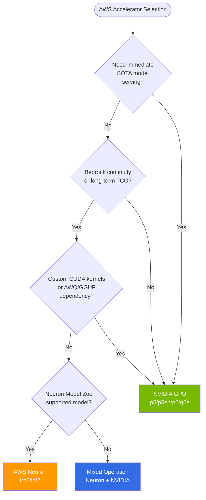
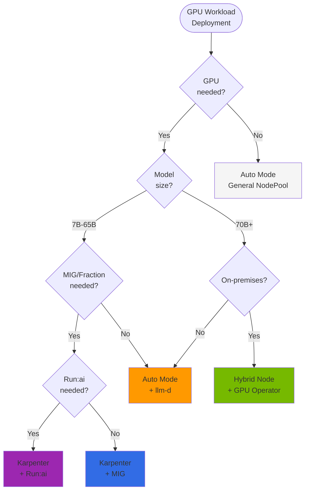

## Overview

When operating GPU workloads on EKS, node type selection directly impacts operational complexity, cost, and feature utilization. GPU inference and training workloads have special requirements unlike general container workloads:

- **Driver dependencies**: NVIDIA GPU drivers, Container Toolkit, Device Plugin
- **Advanced features**: MIG (Multi-Instance GPU), Time-Slicing, Fractional GPU
- **Monitoring**: DCGM (Data Center GPU Manager)-based metrics
- **Scheduling**: Topology-Aware Placement, Gang Scheduling

AWS EKS provides 4 node types for GPU workloads:

| Node Type | Description |
|-----------|-------------|
| **EKS Auto Mode** | AWS fully manages the entire node lifecycle (GPU drivers pre-installed) |
| **Karpenter** | Auto-scaling + Custom AMI, MIG, full user customization |
| **Managed Node Group** | AWS-managed node groups, only option supporting DRA (Dynamic Resource Allocation) |
| **Hybrid Node** | Connect on-premises GPU servers to the EKS cluster |

:::tip Core Principle
You can operate multiple node types **simultaneously** in a single EKS cluster. Configure the optimal node combination matching your workload characteristics.
:::

### Scope of This Document

This document focuses on **node type selection and hybrid architecture design**. Detailed NVIDIA software stack (GPU Operator/DCGM/Dynamo), GPU autoscaling, llm-d distributed inference, and security/troubleshooting are covered in their respective specialized documents (see Section 7 Related Documents).

---

## 2. Node Type Comparison

### 2.1 Feature Comparison Table

| Feature | Auto Mode | Karpenter | Managed Node Group | Hybrid Node |
|---------|-----------|-----------|-------------------|-------------|
| **Management Owner** | AWS fully managed | Self-Managed | AWS managed | On-Premises |
| **Auto-scaling** | Automatic (AWS controlled) | Automatic (NodePool-based) | Manual/Limited | Manual |
| **Custom AMI** | Not available | Available | Available | Available |
| **SSH Access** | Not available | Available | Available | Available |
| **GPU Driver** | Pre-installed (AWS) | User-installed | User-installed | User-installed |
| **GPU Operator** | **Available** (Device Plugin label disabled) | **Available** | Available | Available |
| **Root Filesystem** | Read-Only | Read-Write | Read-Write | Read-Write |
| **MIG Support** | Not available (NodeClass read-only) | Available | Available | Available |
| **DRA Compatible** | **Not available** (internal Karpenter-based) | **Not available** ([#1231](https://github.com/kubernetes-sigs/karpenter/issues/1231)) | **Available** (recommended) | Available |
| **DCGM Exporter** | Install via GPU Operator | Included in GPU Operator | Manual installation | Included in GPU Operator |
| **Run:ai Compatible** | **Available** (Device Plugin disabled) | **Available** | Available | Available |
| **Cost** | Low (no management needed) | Medium | Medium | Low (Capex) |
| **Suitable Workloads** | Simple inference | Advanced GPU features | DRA workloads | On-premises integration |

### 2.2 Selection Guide: When to Use Which Node

**Choose Auto Mode when:**
- You want to quickly start inference services without GPU driver management burden
- Serving large models (70B+) that don't require MIG or Fractional GPU
- System/non-GPU workloads (API Gateway, Agent, Observability)

**Choose Karpenter when:**
- You need flexible control over MIG partitioning, Custom AMI, Spot Instances
- Using projects dependent on GPU Operator ClusterPolicy (Run:ai, KAI Scheduler)
- Optimizing GPU utilization for small/medium models (MIG partitioning)

**Choose Managed Node Group when:**
- DRA (Dynamic Resource Allocation)-based GPU management is required
- Using DRA-exclusive instances like P6e-GB200 UltraServer

**Choose Hybrid Node when:**
- Integrating existing on-premises GPU server assets into EKS
- Data residency requirements

---

## 3. EKS Auto Mode GPU Support and Limitations

### 3.1 GPU Stack Auto-Provided by Auto Mode

EKS Auto Mode pre-installs the following on GPU instances:

1. **NVIDIA GPU Driver** - AWS-managed version, `/dev/nvidia*` devices auto-created
2. **NVIDIA Container Toolkit** - containerd plugin auto-configured
3. **NVIDIA Device Plugin** - `nvidia.com/gpu` resource auto-registered
4. **GPU Resource Registration** - Pods can immediately request `nvidia.com/gpu: 1`

```yaml
apiVersion: v1
kind: Pod
metadata:
  name: gpu-test
spec:
  containers:
  - name: cuda-test
    image: nvidia/cuda:12.2.0-runtime-ubuntu22.04
    command: ["nvidia-smi"]
    resources:
      limits:
        nvidia.com/gpu: 1
```

### 3.2 Installing GPU Operator on Auto Mode: Device Plugin Disable Pattern

GPU Operator **can be installed** on Auto Mode. The key is to **disable only the Device Plugin via node labels** while keeping other components (DCGM Exporter, NFD, GFD) running normally. This pattern was validated in [awslabs/ai-on-eks PR #288](https://github.com/awslabs/ai-on-eks/pull/288).

**Why is GPU Operator needed?** Several projects including KAI Scheduler and Run:ai depend on GPU Operator's **ClusterPolicy CRD**. Without ClusterPolicy, these projects cannot even start. This is the core reason for installing GPU Operator on Auto Mode.

For complete GPU Operator architecture and component details, see [NVIDIA GPU Stack](./nvidia-gpu-stack.md).

```
ClusterPolicy CRD (GPU Operator)
  ↓ depends on
KAI Scheduler (GPU-aware Pod placement)
Run:ai (Fractional GPU, Gang Scheduling)
  ↓ reads
DCGM Exporter (GPU metrics)
NFD/GFD (Hardware labels)
```

| GPU Operator Component | Auto Mode Setting | Reason |
|----------------------|------------------|--------|
| **Driver** | `enabled: false` | Pre-installed in AMI |
| **Container Toolkit** | `enabled: false` | Pre-installed in AMI |
| **Device Plugin** | Disabled via label | AWS manages its own Device Plugin |
| **DCGM Exporter** | `enabled: true` | GPU metrics collection |
| **NFD / GFD** | `enabled: true` | Hardware feature detection and GPU attribute labeling |

NodePool label configuration to disable Device Plugin:

```yaml
apiVersion: karpenter.sh/v1
kind: NodePool
metadata:
  name: gpu-auto-mode
spec:
  template:
    metadata:
      labels:
        nvidia.com/gpu.deploy.device-plugin: "false"
    spec:
      requirements:
        - key: eks.amazonaws.com/instance-family
          operator: In
          values: ["p5", "g6e", "g5"]
      nodeClassRef:
        group: eks.amazonaws.com
        kind: NodeClass
        name: default
```

Helm Values (for Auto Mode):

```yaml
driver:
  enabled: false
toolkit:
  enabled: false
devicePlugin:
  enabled: true           # Globally enabled, selectively disabled via node labels
dcgmExporter:
  enabled: true
  serviceMonitor:
    enabled: true
nfd:
  enabled: true
gfd:
  enabled: true
```

:::caution Actual Auto Mode Limitations
While GPU Operator installation is possible, since NodeClass is read-only, the following are not available:
- **MIG Partitioning**: Cannot configure MIG profiles in NodeClass
- **Custom AMI**: Cannot pin specific driver versions
- **SSH/SSM Access**: Cannot directly debug nodes

If MIG-based GPU partitioning is needed, switch to Karpenter + GPU Operator.
:::

### 3.3 Large GPU Instance Support Status (Verified 2026.04)

Auto Mode large GPU instance support status confirmed during GLM-5 (744B MoE) deployment. p5.48xlarge Spot provisioning was successful, but p5en/p6 have current limitations.

**Detailed Support Status**: See [EKS Auto Mode GPU Instance Support Status](../inference-frameworks/llm-d-eks-automode.md#eks-auto-mode-gpu-instance-support-status-verified-202604)

### 3.4 Auto Mode + MNG Hybrid Limitation

The hybrid pattern of adding MNG to an Auto Mode cluster for p5en/p6 usage is **currently not possible**:

- MNG creation stalls in `CREATING` state for 30+ minutes
- CloudFormation stack `Resources` field remains `null`
- Auto Mode's managed compute layer conflicts internally with MNG's ASG-based management

**Conclusion**: For large GPUs (H200+, B200), use **EKS Standard Mode + Karpenter + MNG**.

### 3.5 Device Plugin Conflict Resolution

Installing GPU Operator with `devicePlugin.enabled=true` on Auto Mode nodes conflicts with the built-in Device Plugin.

```bash
kubectl describe node <gpu-node> | grep nvidia.com/gpu
# Allocatable: nvidia.com/gpu: 0  (expected: 8)
```

**Solution**: Add `nvidia.com/gpu.deploy.device-plugin: "false"` label to NodePool (see Section 3.2)

### 3.6 Node Force Termination Not Available

EC2 instances managed by Auto Mode block `ec2:TerminateInstances`. Abnormal node recovery procedure:

1. Delete workload: `kubectl delete pod <gpu-pod>`
2. Delete NodeClaim: `kubectl delete nodeclaim <nodeclaim-name>`
3. Karpenter detects empty node and auto-terminates (5-10 min)
4. New NodeClaim creation starts a healthy node

### 3.7 How to Verify Auto Mode Instance Support

You can pre-verify specific instance type support with a NodePool dry-run:

```yaml
apiVersion: karpenter.sh/v1
kind: NodePool
metadata:
  name: gpu-test-dryrun
spec:
  template:
    spec:
      requirements:
        - key: node.kubernetes.io/instance-type
          operator: In
          values: ["p5en.48xlarge"]
      nodeClassRef:
        group: eks.amazonaws.com
        kind: NodeClass
        name: default
  limits:
    nvidia.com/gpu: "8"
```

If `NoCompatibleInstanceTypes` appears in `kubectl get nodeclaim` events after dry-run, that instance type is not supported in Auto Mode.

---

## 4. Karpenter GPU NodePool Configuration

### 4.1 Why Karpenter

Karpenter is the optimal balance point that maintains Auto Mode's auto-scaling advantages while fully utilizing GPU Operator.

| Feature | Auto Mode | Karpenter |
|---------|-----------|-----------|
| **Auto-scaling** | Automatic (AWS controlled) | Automatic (NodePool-based) |
| **GPU Operator** | Available (Device Plugin disabled) | Fully available |
| **Custom AMI** | Not available | Available |
| **MIG Support** | Not available | Available |
| **Spot Instance** | Limited | Fully supported |
| **Node Replacement Speed** | Fast | Very fast |

### 4.2 Inference Workload NodePool

```yaml
apiVersion: karpenter.sh/v1
kind: NodePool
metadata:
  name: gpu-inference
spec:
  template:
    metadata:
      labels:
        node-type: gpu-inference
        gpu-operator: enabled
    spec:
      requirements:
        - key: node.kubernetes.io/instance-type
          operator: In
          values:
            - p5.48xlarge      # H100 x8 (640GB HBM3)
            - g6e.12xlarge     # L40S x4 (192GB GDDR6)
            - g5.12xlarge      # A10G x4 (96GB GDDR6)
        - key: karpenter.sh/capacity-type
          operator: In
          values: [on-demand]
        - key: topology.kubernetes.io/zone
          operator: In
          values: [us-west-2a, us-west-2b, us-west-2c]
      taints:
        - key: nvidia.com/gpu
          effect: NoSchedule
          value: "true"
      kubelet:
        maxPods: 110
        evictionHard:
          memory.available: "10Gi"
  disruption:
    consolidationPolicy: WhenEmpty
    consolidateAfter: 5m
  limits:
    cpu: "1000"
    memory: "4000Gi"
    nvidia.com/gpu: "32"
```

### 4.3 Training Workload NodePool (Spot + On-Demand fallback)

```yaml
apiVersion: karpenter.sh/v1
kind: NodePool
metadata:
  name: gpu-training
spec:
  template:
    metadata:
      labels:
        node-type: gpu-training
        gpu-operator: enabled
    spec:
      requirements:
        - key: node.kubernetes.io/instance-type
          operator: In
          values:
            - p5.48xlarge      # H100 x8
        - key: karpenter.sh/capacity-type
          operator: In
          values: [spot, on-demand]  # Spot first, On-Demand fallback
      taints:
        - key: workload
          effect: NoSchedule
          value: "training"
      kubelet:
        maxPods: 50
        evictionHard:
          memory.available: "20Gi"
  disruption:
    consolidationPolicy: WhenUnderutilized
    consolidateAfter: 30m  # Prevent training interruption
  limits:
    nvidia.com/gpu: "64"
```

### 4.4 EC2NodeClass Configuration

```yaml
apiVersion: karpenter.k8s.aws/v1
kind: EC2NodeClass
metadata:
  name: gpu-inference
spec:
  amiSelectorTerms:
    - alias: al2023
  role: KarpenterNodeRole-eks-genai-cluster
  subnetSelectorTerms:
    - tags:
        karpenter.sh/discovery: eks-genai-cluster
        subnet-type: private
  securityGroupSelectorTerms:
    - tags:
        karpenter.sh/discovery: eks-genai-cluster
  blockDeviceMappings:
    - deviceName: /dev/xvda
      ebs:
        volumeSize: 200Gi
        volumeType: gp3
        iops: 16000
        throughput: 1000
        encrypted: true
        deleteOnTermination: true
  metadataOptions:
    httpEndpoint: enabled
    httpPutResponseHopLimit: 2
    httpTokens: required  # IMDSv2
  tags:
    Environment: production
    ManagedBy: karpenter
```

### 4.5 GPU Operator Helm Values (for Karpenter Nodes)

```yaml
# helm install gpu-operator nvidia/gpu-operator -f values.yaml
driver:
  enabled: false          # AL2023: Pre-installed in AMI

toolkit:
  enabled: false          # AL2023: Pre-installed in AMI

devicePlugin:
  enabled: true
  nodeSelector:
    gpu-operator: enabled
  tolerations:
    - key: nvidia.com/gpu
      operator: Exists
      effect: NoSchedule

migManager:
  enabled: true
  nodeSelector:
    gpu-operator: enabled
  config:
    name: mig-parted-config
    default: "all-balanced"

dcgmExporter:
  enabled: true
  serviceMonitor:
    enabled: true
    interval: 15s
  nodeSelector:
    gpu-operator: enabled

nfd:
  enabled: true

gfd:
  enabled: true
  nodeSelector:
    gpu-operator: enabled

operator:
  nodeSelector:
    node-type: gpu-inference  # Karpenter NodePool label
  tolerations:
    - key: nvidia.com/gpu
      operator: Exists
      effect: NoSchedule
  defaultRuntime: containerd
```

**Key Configuration Points:**
- `nodeSelector: gpu-operator: enabled` -- Excludes Auto Mode nodes
- `driver/toolkit: false` -- Pre-installed in AL2023 AMI
- `migManager: true` -- Enables MIG functionality on Karpenter nodes

### 4.6 GPU Topology-Based Scheduling

In distributed training, placing GPUs connected via NVLink on the same node is critical for performance:

```yaml
# GPU topology hints in Pod configuration
apiVersion: v1
kind: Pod
spec:
  containers:
  - name: pytorch-ddp
    resources:
      limits:
        nvidia.com/gpu: 4
  # Place GPUs within the same NVLink domain
  topologySpreadConstraints:
    - maxSkew: 1
      topologyKey: topology.kubernetes.io/zone
      whenUnsatisfiable: DoNotSchedule
      labelSelector:
        matchLabels:
          app: distributed-training
```

### 4.7 Spot Price Comparison (us-east-2, 2026.04)

| Instance | On-Demand | Spot (Lowest) | VRAM | Savings |
|---------|-----------|------------|------|---------|
| p5.48xlarge | $98/hr | $12.5/hr | 640GB | 87% |
| p5en.48xlarge | ~$120/hr | $12.1/hr | 1,128GB | 90% |
| p6-b200.48xlarge | $180/hr | $11.4/hr | 1,536GB | 94% |

:::tip Spot Usage Recommendation
Large GPU instances can achieve 85-94% cost savings with Spot. Actively use Spot for PoC/demo environments, and set `consolidationPolicy: WhenEmpty` to prevent unnecessary disruption. Prices are approximate; verify real-time pricing at [AWS Spot Pricing](https://aws.amazon.com/ec2/spot/pricing/).
:::

---

## 5. Recommended Hybrid Architecture

### 5.1 3-Node Type Coexistence Architecture

Operate Auto Mode + Karpenter + Hybrid Node simultaneously in a single EKS cluster.



### 5.2 Per-Workload Node Placement Strategy

| Workload Type | Node Type | GPU Operator | Reason |
|--------------|-----------|--------------|--------|
| **System Components** | Auto Mode | Not needed | No management needed, cost minimization |
| **API Gateway / Agent** | Auto Mode | Not needed | CPU workloads |
| **Simple GPU Inference (70B+)** | Auto Mode | Optional (needed for DCGM) | MIG not needed, fast scaling |
| **MIG-Based Inference** | Karpenter | Required | MIG Manager needed |
| **Fractional GPU** | Karpenter | Required | Run:ai needed |
| **Model Training** | Karpenter | Required | Gang Scheduling, Spot |
| **DRA Workloads** | Managed Node Group | Required | Not supported on Karpenter/Auto Mode |
| **On-Premises GPU** | Hybrid Node | Required | No AWS-managed GPU stack |

### 5.3 MNG Hybrid for DRA Workloads

DRA (Dynamic Resource Allocation) was promoted to GA in K8s 1.34, providing advanced GPU management beyond Device Plugin including fine-grained GPU memory allocation and NVLink topology-aware scheduling. **However, DRA cannot be used with Karpenter and Auto Mode.**

:::danger DRA + Karpenter/Auto Mode Incompatibility
Karpenter skips node provisioning when it detects `spec.resourceClaims` in a Pod ([PR #2384](https://github.com/kubernetes-sigs/karpenter/pull/2384)). Karpenter simulates Pod requirements to calculate optimal instances, but DRA's ResourceSlice is only issued by the DRA Driver after a node exists — making **pre-node-creation simulation impossible** (chicken-and-egg problem).

The only officially supported node management method for DRA workloads is **Managed Node Group + Cluster Autoscaler**.
:::



| Workload | Node Type | GPU Allocation Method | Scaling |
|---|---|---|---|
| DRA Workloads (llm-d, P6e-GB200) | **Managed Node Group** | ResourceClaim (DRA) | Cluster Autoscaler |
| Standard GPU Inference (vLLM standalone) | Karpenter / Auto Mode | `nvidia.com/gpu` (Device Plugin) | Karpenter |
| Non-GPU Workloads | Karpenter / Auto Mode | - | Karpenter |

For detailed DRA scale-out strategies, see [GPU Resource Management](./gpu-resource-management.md#dra-workload-scale-out).

### 5.4 Recommended Node Strategy by Model Size

| Model Size | Example | Recommended Node | Reason |
|---|---|---|---|
| **70B+** | Qwen3-72B, Llama-3-70B | Auto Mode + llm-d | Uses nearly all GPU, management convenience |
| **30B-65B** | Qwen3-32B | Auto Mode or Karpenter | 50%+ GPU usage, choose based on situation |
| **13B-30B** | Llama-3-13B | Karpenter + MIG 2-way split | GPU utilization improvement needed |
| **7B and below** | Llama-3-8B, Mistral-7B | Karpenter + MIG 4-7 way split | Severe GPU waste, MIG essential |
| **Multi-Model** | Multiple models simultaneously | Karpenter + MIG | Separate MIG partitions per model |
| **Dev/Test** | Model agnostic | Auto Mode | Quick start |

### 5.5 Cost Impact by Model Size

Based on p5.48xlarge (H100 x8), monthly cost approximately $98,000:

| Configuration | 7B Model Instances | GPU Usage | GPU Utilization | Effective Cost/Instance |
|---|---|---|---|---|
| Auto Mode (full GPU allocation) | 8 | 8 GPUs | ~25% | $12,250 |
| Karpenter + MIG (4-way split) | 8 | 2 GPUs | ~80% | **$3,063** |
| **Savings** | Same | **75% reduction** | **3.2x improvement** | **75% reduction** |

:::warning Model Size and Cost Efficiency
The smaller the model parameters, the greater the GPU waste on Auto Mode. Running a 7B model on H100 leaves 80% of GPU memory idle, which is a direct cost waste. MIG partitioning is essential for small/medium models.
:::

### 5.6 Optimal Configuration for Current Timeframe (2026.04)

For most LLM serving environments, DRA is not yet essential. Device Plugin + MIG combination can sufficiently cover GPU partitioning and topology placement, and Karpenter's fast scale-out is more favorable for LLM serving SLOs than MNG + Cluster Autoscaler.



| Criteria | Karpenter + Device Plugin | MNG + DRA |
|---|---|---|
| **Scale-out Speed** | Fast (Karpenter) | Slow (Cluster Autoscaler) |
| **GPU Partitioning** | MIG supported (GPU Operator) | DRA native |
| **Operational Complexity** | Single stack | MNG + Karpenter mixed |
| **K8s Version** | 1.32+ | 1.34+ (DRA GA) |
| **Ecosystem Maturity** | Production-proven | Early stage |

### 5.7 Recommended Configuration by Scale

**Small Scale (< 32 GPUs)**

```yaml
Configuration: Auto Mode + Karpenter (GPU dedicated)
  - Auto Mode: General workloads
  - Karpenter: GPU inference (Device Plugin)
  - GPU Operator: DCGM monitoring
Cost: $5,000 - $15,000/month
```

**Medium Scale (32 - 128 GPUs)**

```yaml
Configuration: Karpenter + GPU Operator + KEDA
  - Karpenter NodePool: Separate Prefill / Decode / Small models
  - GPU Operator: MIG, DCGM, NFD/GFD
  - KEDA: KV Cache / TTFT-based Pod scaling
Cost: $15,000 - $80,000/month
```

**Large Scale (> 128 GPUs)**

```yaml
Configuration: Karpenter + GPU Operator + Run:ai + Hybrid Node
  - Karpenter: GPU Operator + Run:ai
  - Hybrid Node: On-premises GPU farm integration
  - When adopting P6e-GB200: Add MNG + DRA
Cost: $80,000 - $500,000/month (cloud) + Capex (on-premises)
```

### 5.8 DRA Transition Timing

| Condition | Transition Required |
|---|---|
| P6e-GB200 UltraServer Adoption | Required (Device Plugin not supported) |
| Multi-Node NVLink / IMEX Needed | Required (ComputeDomain is DRA-exclusive) |
| CEL-Based Fine-Grained GPU Attribute Selection | Recommended |
| GPU Sharing (MPS) | Recommended |
| Karpenter DRA Support GA | Optimal transition timing (MNG not needed) |

:::tip Transition Strategy
**Now**: Karpenter + GPU Operator (Device Plugin + MIG) -- Fastest and most operationally viable production configuration

**When Adopting P6e-GB200**: MNG (DRA, GPU) + Karpenter (non-GPU) hybrid

**After Karpenter DRA GA**: Karpenter + DRA integration -- Final target configuration
:::

---

## 6. AWS Accelerator Selection Guide (NVIDIA vs Neuron)

EKS GPU node strategies have traditionally been designed around NVIDIA GPUs (p/g series), but as of 2026, **Trainium2/Inferentia2** based AWS custom accelerators have matured as production alternatives. Neuron stack details are covered in [AWS Neuron Stack](./aws-neuron-stack.md), while this section only summarizes selection criteria for node strategy planning.

### 6.1 NVIDIA GPU vs AWS Neuron Decision Matrix

| Criteria | NVIDIA GPU (p5/p5en/p6/g6e) | AWS Neuron (trn2/inf2) |
|------|---------------------------|---------------------|
| **Model Ecosystem Recency** | Immediate support (new models Day-1) | AWS porting cycle delay (weeks to months) |
| **Long-Term TCO** | Higher (H100/H200/B200 Spot still expensive) | Favorable cost per token (per AWS data) |
| **Capacity Availability** | Tight depending on region/timing | Relatively easier to secure |
| **Custom CUDA Kernels** | Full support | Not supported (NEFF compilation required) |
| **Quantization Formats** | AWQ/GPTQ/GGUF extensive | BF16/FP16/FP8, AWQ/GPTQ limited |
| **Observability Ecosystem** | GPU Operator + DCGM mature | neuron-monitor + OSS exporter |
| **Open-Source Serving** | vLLM, SGLang, TRT-LLM rich | NxD Inference / vLLM Neuron / TGI Neuron |
| **Bedrock Continuity** | Unrelated | Same path as Bedrock internal stack |
| **Hybrid (On-Premises)** | Possible with Hybrid Node | EC2 only (on-premises not available) |

### 6.2 Selection Flow



### 6.3 Recommended Mixed Operation Pattern

- **Frontier (Latest Models) Layer**: NVIDIA GPU (p5en/p6) — Rapid adoption of new models
- **Volume (High-Frequency Inference) Layer**: Neuron (trn2/inf2) — Low-cost serving of stable models at scale
- **Edge/On-Premises**: Hybrid Node + NVIDIA GPU — Neuron is EC2-only

For detailed Neuron SDK, Device Plugin, Karpenter NodePool, and inference framework selection (NxD Inference / vLLM Neuron / TGI Neuron), see [AWS Neuron Stack](./aws-neuron-stack.md).

---

## 7. Node Strategy Decision Flowchart



### Decision Summary Table

| Question | Answer | Recommended Node Type | GPU Operator |
|----------|--------|----------------------|-------------|
| GPU not needed | - | Auto Mode | Not needed |
| Simple GPU inference (no MIG) | - | Auto Mode GPU | Optional |
| MIG needed | - | Karpenter | Required |
| DRA needed | - | **Managed Node Group** | Required |
| Fractional GPU / Run:ai | - | Karpenter | Required |
| On-premises GPU | - | Hybrid Node | Required |
| Cost minimization (Spot acceptable) | - | Karpenter Spot | Required |
| Large-scale training (Gang Scheduling) | - | Karpenter + Run:ai | Required |
| P6e-GB200 | DRA required | **Managed Node Group** | Required |

---

## 8. Related Documents

### GPU Stack and Monitoring

For detailed NVIDIA GPU software stack including GPU Operator, DCGM, MIG, Time-Slicing, KAI Scheduler, and Dynamo, see the dedicated document.

- **[NVIDIA GPU Stack](./nvidia-gpu-stack.md)** - GPU Operator, DCGM Exporter, MIG Manager, Dynamo, KAI Scheduler

### GPU Resource Management

For GPU autoscaling strategies based on Karpenter, KEDA, and DRA, see:

- **[GPU Resource Management](./gpu-resource-management.md)** - Karpenter NodePool, KEDA Scaling, DRA Scale-out Strategy

### Inference Engines

- **[llm-d EKS Auto Mode](../inference-frameworks/llm-d-eks-automode.md)** - llm-d distributed inference, KV-cache aware routing, Auto Mode/Karpenter node strategy
- **[vLLM Model Serving](../inference-frameworks/vllm-model-serving.md)** - vLLM deployment and optimization

### Hybrid Infrastructure

For EKS Hybrid Node registration of on-premises GPU servers, VPN/Direct Connect configuration, and GPU Operator installation, see:

- **[Hybrid Infrastructure](/docs/hybrid-infrastructure)** - On-premises + cloud hybrid architecture

### Deployment and Security

For production deployment YAML, security policies (Pod Security Standards, NetworkPolicy, IAM), and troubleshooting guides for GPU workloads, see Reference Architecture.

- **[Reference Architecture: GPU Infrastructure](../../reference-architecture/model-lifecycle/custom-model-deployment.md)** - GPU security, troubleshooting, deployment guide

### Platform Architecture

- **[EKS-Based Open Architecture](../../design-architecture/platform-selection/agentic-ai-solutions-eks.md)** - Overall Agentic AI platform architecture
