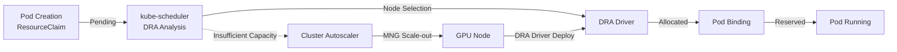
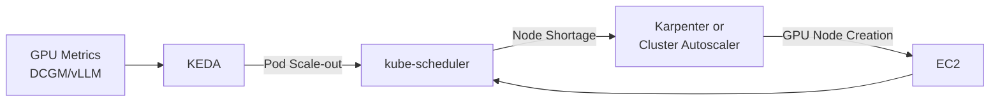
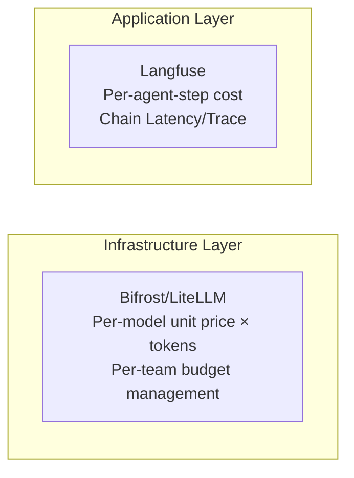

import Tabs from '@theme/Tabs';
import TabItem from '@theme/TabItem';
import { SpecificationTable, ComparisonTable } from '@site/src/components/tables';
import { DraLimitationsTable, ScalingDecisionTable } from '@site/src/components/GpuResourceTables';
import {
  SpotInstancePricingInference,
  SavingsPlansPricingTraining,
  CostOptimizationStrategies,
  KarpenterGpuOptimization
} from '@site/src/components/AgenticSolutionsTables';

GPU resource management strategies in EKS environments are organized around three axes.

| Axis | Key Question | Core Technologies |
|---|---|---|
| **Provisioning** | Which GPU nodes to create and when? | Karpenter, EKS Auto Mode, Managed Node Group |
| **Scheduling** | Which node to place GPU Pods on? | Device Plugin, DRA, Topology-Aware Routing |
| **Scaling** | How to respond to traffic changes? | KEDA, HPA, Cluster Autoscaler |

This document covers the architecture and design decision criteria for each axis. For GPU Operator details (ClusterPolicy, DCGM, MIG, Time-Slicing, Dynamo, KAI Scheduler, and other NVIDIA software stack components), see [NVIDIA GPU Stack](./nvidia-gpu-stack.md).

---

## Karpenter GPU NodePool

:::info Karpenter GA (v1.0+)
Karpenter has been GA since v1.0, and all examples in this document use the `karpenter.sh/v1` API. The DRA allocator was added to core (`kubernetes-sigs/karpenter`) v1.14.0, and the AWS Provider (`karpenter-provider-aws`) **v1.14.0** that includes it was released on 2026-07-11. So **installing self-managed Karpenter v1.14.0+** enables DRA node provisioning on EKS. However, the controller setting `ignoreDRARequests` **defaults to `true` (DRA requests ignored)**, so it must be flipped to `false` for DRA to actually work. See [Node Provisioning Compatibility](#node-provisioning-compatibility) and [Karpenter DRA Enablement Parameters](#karpenter-dra-enablement-parameters-v1140) below.
:::

### GPU Node Auto-Provisioning Concept

Karpenter analyzes Pending Pod resource requests (`nvidia.com/gpu`, memory, CPU) to automatically provision the optimal EC2 instance. The core value of Karpenter for GPU workloads includes:

- **Instance diversity**: Support for various GPU instances (p4d, p5, g5, g6e, etc.) in a single NodePool
- **Spot/On-Demand mix**: Balance cost and stability with capacity-type
- **Consolidation**: Automatically clean up idle GPU nodes for cost savings
- **Taint-based isolation**: Set `nvidia.com/gpu` taint on GPU nodes to exclude non-GPU workloads

### NodePool Configuration Example

```yaml
apiVersion: karpenter.sh/v1
kind: NodePool
metadata:
  name: gpu-inference-pool
spec:
  template:
    metadata:
      labels:
        node-type: gpu-inference
        workload: genai
    spec:
      requirements:
        - key: kubernetes.io/arch
          operator: In
          values: ["amd64"]
        - key: karpenter.sh/capacity-type
          operator: In
          values: ["on-demand", "spot"]
        - key: node.kubernetes.io/instance-type
          operator: In
          values:
            - p4d.24xlarge    # 8x A100 40GB
            - p5.48xlarge     # 8x H100 80GB
            - g5.48xlarge     # 8x A10G 24GB
        - key: karpenter.k8s.aws/instance-gpu-count
          operator: Gt
          values: ["0"]
      nodeClassRef:
        group: karpenter.k8s.aws
        kind: EC2NodeClass
        name: gpu-nodeclass
      taints:
        - key: nvidia.com/gpu
          value: "true"
          effect: NoSchedule
  limits:
    cpu: 1000
    memory: 4000Gi
    nvidia.com/gpu: 64
  disruption:
    consolidationPolicy: WhenEmptyOrUnderutilized
    consolidateAfter: 30s
  weight: 100
```

**Design Points:**

- `limits.nvidia.com/gpu: 64` — Cluster-wide GPU cap to prevent cost runaway
- `disruption.consolidateAfter: 30s` — Quick cleanup is key since GPU nodes are expensive
- `weight: 100` — Priority setting among multiple NodePools

### GPU Instance Type Comparison

<ComparisonTable
  headers={['Instance Type', 'GPU', 'GPU Memory', 'vCPU', 'Memory', 'Network', 'Use Case']}
  rows={[
    { id: '1', cells: ['p4d.24xlarge', '8x A100', '40GB x 8', '96', '1152 GiB', '400 Gbps EFA', 'Large-scale LLM inference'], recommended: true },
    { id: '2', cells: ['p5.48xlarge', '8x H100', '80GB x 8', '192', '2048 GiB', '3200 Gbps EFA', 'Ultra-large models, training'] },
    { id: '3', cells: ['p5e.48xlarge', '8x H200', '141GB x 8', '192', '2048 GiB', '3200 Gbps EFA', 'Large model training/inference'] },
    { id: '4', cells: ['g5.48xlarge', '8x A10G', '24GB x 8', '192', '768 GiB', '100 Gbps', 'Small/medium model inference'] },
    { id: '5', cells: ['g6e.xlarge ~ g6e.48xlarge', 'NVIDIA L40S', 'Up to 8x48GB', 'Up to 192', 'Up to 768 GiB', 'Up to 100 Gbps', 'Cost-efficient inference'] },
    { id: '6', cells: ['trn2.48xlarge', '16x Trainium2', '-', '192', '2048 GiB', '1600 Gbps', 'AWS native training'] }
  ]}
/>

:::tip Instance Selection Guide
- **p5e.48xlarge**: 100B+ parameter models, maximize H200 memory
- **p5.48xlarge**: 70B+ parameter models, highest performance requirements
- **p4d.24xlarge**: 13B-70B parameter models, balanced cost-performance
- **g6e**: 13B-70B models, cost-efficient inference with L40S
- **g5.48xlarge**: 7B and below models, cost-efficient inference
- **trn2.48xlarge**: AWS native training workloads
:::

:::tip EKS Auto Mode
EKS Auto Mode automatically detects GPU workloads and provisions appropriate GPU instances. Without separate NodePool configuration, it selects optimal instances based on Pod resource requests.
:::

---

## Kubernetes GPU Scheduling

### Device Plugin Model

The default method for using GPUs in Kubernetes is the NVIDIA Device Plugin. It registers `nvidia.com/gpu` extended resources with kubelet, and Pods specify GPU count in `resources.requests`.

```yaml
resources:
  requests:
    nvidia.com/gpu: 1
  limits:
    nvidia.com/gpu: 1
```

Device Plugin is simple and stable but can only allocate GPUs as **whole units** and cannot do attribute-based selection (e.g., MIG profiles, specific GPU models).

### Topology-Aware Routing

Topology-Aware Routing, stabilized in K8s 1.33+, minimizes network latency between GPU nodes. It prioritizes routing traffic to GPU nodes within the same AZ (availability zone), particularly improving performance for multi-node tensor parallelism workloads.

```yaml
apiVersion: v1
kind: Service
metadata:
  name: vllm-inference
spec:
  selector:
    app: vllm
  ports:
    - port: 8000
  trafficDistribution: PreferSameZone
```

:::caution Using the trafficDistribution field
- `PreferSameZone` is the standard (`PreferClose` is a deprecated alias).
- If the `service.kubernetes.io/topology-mode: Auto` annotation is used together, the annotation takes precedence over the `trafficDistribution` field, so the field is ignored. The annotation is slated for deprecation, so use only the `trafficDistribution` field.
:::

### Gang Scheduling

For large-scale LLM training or tensor parallel inference, multiple GPU Pods must be scheduled **simultaneously**. If only some are placed, the rest remain Pending and occupy resources, creating a deadlock.

**Solutions:**
- **Coscheduling Plugin** (scheduler-plugins): PodGroup CRD to specify minimum Pod count for all-or-nothing scheduling
- **Volcano**: Batch scheduler with native Gang Scheduling support
- **KAI Scheduler**: NVIDIA's GPU-aware scheduler with GPU topology-aware Gang Scheduling (details in [NVIDIA GPU Stack](./nvidia-gpu-stack.md#kai-scheduler))

---

## DRA (Dynamic Resource Allocation)

### Concept and Necessity

DRA is a Kubernetes resource allocation paradigm that overcomes Device Plugin limitations. DRA itself is not GPU-specific — it is a general-purpose framework covering specialized devices such as NICs, interconnects, and FPGAs. The core API model (DeviceClass, ResourceClaim, ResourceSlice) and the per-resource-type driver ecosystem are covered in [Kubernetes DRA](./kubernetes-dra.md). This section focuses on **operating DRA in EKS GPU environments**.

<DraLimitationsTable />

:::info DRA Maturity
The DRA core reached GA in K8s 1.34 (`resource.k8s.io/v1`, enabled by default) and is locked-to-default in 1.35. For the version history and per-feature maturity, see [Kubernetes DRA — Version History](./kubernetes-dra.md#version-history).
:::

### GPU Allocation Flow

DRA separates **declarative resource requests** (ResourceClaim) from **immediate allocation**. When a Pod requests GPUs based on attributes like "1 H100 GPU, MIG 3g.20gb profile", the DRA Driver matches it with actual hardware. For the general API object model and CEL matching principles, see [Kubernetes DRA — Core Model](./kubernetes-dra.md#the-dra-core-model). The flow below shows GPU allocation combined with node scale-out on EKS.



### DRA vs Device Plugin Comparison

<ComparisonTable
  headers={['Item', 'Device Plugin', 'DRA']}
  rows={[
    { id: '1', cells: ['Resource Allocation', 'Static registration at node start', 'Dynamic allocation at Pod scheduling'] },
    { id: '2', cells: ['Allocation Unit', 'Whole GPU only', 'GPU partitioning possible (MIG, Time-Slicing)'] },
    { id: '3', cells: ['Attribute-based Selection', 'Not possible (index-based)', 'GPU attribute matching via CEL expressions'] },
    { id: '4', cells: ['Multi-resource Coordination', 'Not possible', 'Pod-level coordination of multiple resources'] },
    { id: '5', cells: ['Karpenter Compatible', 'Fully supported', 'Supported on v1.14.0+ (ignoreDRARequests=false); not supported on v1.13 or below'] },
    { id: '6', cells: ['Maturity', 'Production', 'K8s 1.34+ GA'], recommended: true }
  ]}
/>

### Node Provisioning Compatibility

:::warning DRA node provisioning compatibility (as of 2026.07)

| Node Provisioning | DRA Compatible | Notes |
|---|---|---|
| **Managed Node Group** | ✅ Supported | Recommended (all versions), with Cluster Autoscaler |
| **Self-Managed Node Group** | ✅ Supported | Manual configuration required |
| **Self-managed Karpenter v1.14.0+** | ✅ Supported | AWS Provider v1.14.0 (2026-07-11) includes the core v1.14.0 DRA allocator ([PR #3113](https://github.com/kubernetes-sigs/karpenter/pull/3113)); consumable capacity & partitionable devices supported |
| **Self-managed Karpenter ≤ v1.13** | ❌ Not supported | Skips Pods with `spec.resourceClaims` ([PR #2384](https://github.com/kubernetes-sigs/karpenter/pull/2384)) |
| **EKS Auto Mode** | ❌ Not supported (current) | AWS-managed internal Karpenter — users cannot bump the version. DRA is unavailable until Auto Mode's Karpenter is updated to v1.14+ |
:::

**Behavior differences by version:**

The DRA allocator was merged into core Karpenter v1.14.0, and the AWS Provider v1.14.0 that includes it has also been released. So **installing self-managed Karpenter v1.14.0+** enables DRA node provisioning on EKS. Karpenter before v1.14.0 skipped Pods with `spec.resourceClaims` due to the following structural constraints:

1. **ResourceSlice is created after node exists**: DRA Driver issues ResourceSlice after detecting GPUs on the node, but Karpenter needs this information before node creation (chicken-and-egg problem)
2. **No instance→ResourceSlice mapping**: With Device Plugin, `p5.48xlarge → nvidia.com/gpu: 8` is statically known, but with DRA the content varies by Driver implementation
3. **CEL expression simulation impossible**: ResourceSlice attribute values needed for evaluation don't exist before node creation

The v1.14.0 DRA allocator resolves this simulation problem at the core level. However, **EKS Auto Mode uses an AWS-managed internal Karpenter**, so users cannot raise its version arbitrarily — DRA remains unavailable until Auto Mode's Karpenter reaches v1.14+. In that case **MNG + Cluster Autoscaler** is recommended (Cluster Autoscaler works without interpreting DRA — it only needs "there are Pending Pods, so scale up" — and has no version constraint).

### Karpenter DRA Enablement Parameters (v1.14.0+)

Karpenter v1.14.0+ ships the DRA allocator code, but the **controller is deployed to ignore DRA requests by default**. To enable DRA node provisioning on self-managed Karpenter, the following parameters must be set explicitly.

| Layer | Parameter | Default | Setting for DRA |
|---|---|---|---|
| **Karpenter controller** | `settings.ignoreDRARequests` (env `IGNORE_DRA_REQUESTS`) | `true` (ignore DRA requests) | **`false`** — reflect Pods' DRA requests in scheduling simulations |
| **Karpenter version** | core + provider-aws | — | **v1.14.0+** (v1.13 and below skip `spec.resourceClaims` Pods) |

```yaml
# Karpenter Helm values (karpenter-provider-aws v1.14.0+)
settings:
  # Flip the default true (ignore DRA requests) to false so DRA scheduling simulation works
  ignoreDRARequests: false
```

```bash
# When upgrading an existing installation
helm upgrade karpenter oci://public.ecr.aws/karpenter/karpenter \
  --version "1.14.0" \
  --namespace kube-system \
  --reuse-values \
  --set settings.ignoreDRARequests=false
```

:::caution `ignoreDRARequests` is a temporary flag
The official Karpenter documentation notes that this flag "**will be removed once formal DRA support is GA in Karpenter**." That is, the current (v1.14.x) DRA support is early-stage; a future version may enable it by default and drop the flag itself. Check the release notes when upgrading.
:::

:::info NodePool spec requires no changes
The Karpenter upgrade guide's statement that "DRA is additive and requires no configuration changes to existing NodePools" refers to the **NodePool CRD spec**. The `ignoreDRARequests` above is a **controller-global setting** — a separate concern that must be flipped to use DRA.
:::

This Karpenter setting alone does not allocate GPUs. The component that actually advertises and allocates GPUs via DRA is the **NVIDIA DRA driver**, so the cluster and driver layer parameters below must also be in place.

### Full DRA Stack Parameters (3 Layers)

To use GPUs via DRA, parameters across three layers must all be satisfied: **node provisioning (Karpenter) + cluster DRA enablement + NVIDIA DRA driver**.

| Layer | Parameter | Default | Setting for DRA |
|---|---|---|---|
| **1. K8s feature gate** | `DynamicResourceAllocation` | on by default on K8s 1.34+ | on (on 1.33 and below, set `--feature-gates=DynamicResourceAllocation=true` on kube-apiserver, scheduler, controller-manager, and kubelet) |
| **1. K8s API group** | `--runtime-config=resource.k8s.io/v1=true` | served by default on 1.34+ | served (EKS control-plane-managed — automatic if cluster is 1.34/1.35) |
| **2. Node provisioning** | Karpenter `ignoreDRARequests` | `true` | **`false`** (see table above) |
| **3. NVIDIA DRA driver GPU allocation** | `resources.gpus.enabled` (v25.10+ charts use `gpuResourcesEnabledOverride`) | **`false`** (GPU subsystem disabled by default) | **`true`** |
| **3. Disable Device Plugin** | GPU Operator `devicePlugin.enabled` | `true` | **`false`** (avoid conflict with DRA driver) |
| **3. Container runtime CDI** | containerd/CRI-O CDI | on by default in GPU Operator v25.10+ | enabled (requires NVIDIA Driver 580+) |

```bash
# Install NVIDIA DRA driver — enable the GPU allocation subsystem (disabled by default)
helm install nvidia-dra-driver-gpu nvidia/nvidia-dra-driver-gpu \
  --namespace nvidia-dra-driver-gpu --create-namespace \
  --set gpuResourcesEnabledOverride=true \
  --set nvidiaDriverRoot=/run/nvidia/driver

# Deploy GPU Operator with the Device Plugin disabled (avoid GPU allocation conflict with the DRA driver)
helm upgrade -i gpu-operator nvidia/gpu-operator \
  --namespace gpu-operator --create-namespace \
  --set devicePlugin.enabled=false
```

:::warning The NVIDIA DRA driver GPU subsystem is disabled by default
The NVIDIA DRA driver (`nvidia-dra-driver-gpu`) consists of two subsystems: **GPU allocation** and **ComputeDomain** (Multi-Node NVLink). The **GPU allocation subsystem (`resources.gpus.enabled`) defaults to `false`** in the Helm chart, so it must be explicitly enabled to allocate GPUs via DRA. NVIDIA Driver 580+ and container-runtime CDI enablement are prerequisites.
:::

### DRA Selection Guide

:::tip When to use DRA
**DRA is needed when:**
- GPU partitioning required (MIG, Time-Slicing, MPS)
- CEL-based GPU attribute selection in multi-tenant environments
- Topology-aware scheduling (NVLink, NUMA)
- P6e-GB200 UltraServer environments (DRA required)
- K8s 1.34+ environments

**Device Plugin is sufficient when:**
- Only whole GPU allocation needed
- Using EKS Auto Mode (internal Karpenter below v1.14)
- K8s 1.33 or below
:::

---

## KEDA GPU-Based Autoscaling

### Scaling Architecture

GPU workload autoscaling operates as a **2-stage chain**.



1. **Workload Scaling (KEDA/HPA)**: Adjust Pod count based on GPU metrics
2. **Node Scaling (Karpenter/CA)**: Auto-provision GPU nodes when Pending Pods occur

### LLM Serving Metrics-Based ScaledObject

For LLM serving, **KV Cache saturation**, **TTFT**, and **queue depth** are more sensitive scaling signals than simple GPU utilization.

```yaml
apiVersion: keda.sh/v1alpha1
kind: ScaledObject
metadata:
  name: llm-serving-scaler
spec:
  scaleTargetRef:
    name: llm-serving
  minReplicaCount: 2
  maxReplicaCount: 10
  triggers:
    # KV Cache saturation — most sensitive signal for LLM serving
    - type: prometheus
      metadata:
        query: avg(vllm:kv_cache_usage_perc{model="exaone"})
        threshold: "80"
    # Waiting request count
    - type: prometheus
      metadata:
        query: sum(vllm:num_requests_waiting{model="exaone"})
        threshold: "10"
    # TTFT SLO violation approaching
    - type: prometheus
      metadata:
        query: |
          histogram_quantile(0.95,
            rate(vllm_time_to_first_token_seconds_bucket[5m]))
        threshold: "2"
```

### Disaggregated Serving Scaling Criteria

When operating Prefill and Decode separately, the bottleneck signals differ for each role.

| | Prefill | Decode |
|---|---|---|
| **Bottleneck Signal** | TTFT increase, input queue backlog | TPS decrease, KV Cache saturation |
| **Scale Criteria** | Input token processing wait time | Concurrent generation session count |
| **Scale Unit** | GPU compute intensive | GPU memory intensive |

### Recommended Scaling Thresholds

<SpecificationTable
  headers={['Workload Type', 'Scale Up Threshold', 'Scale Down Threshold', 'Cooldown']}
  rows={[
    { id: '1', cells: ['Real-time Inference', 'GPU 70%', 'GPU 30%', '60s'] },
    { id: '2', cells: ['Batch Processing', 'GPU 85%', 'GPU 40%', '300s'] },
    { id: '3', cells: ['Conversational Service', 'GPU 60%', 'GPU 25%', '30s'] }
  ]}
/>

### DRA Workload Scale-out

DRA workload node scale-out is configured with **self-managed Karpenter v1.14.0+ (`ignoreDRARequests=false`)** or **MNG + Cluster Autoscaler**. EKS Auto Mode cannot bump its internal Karpenter version, so the latter is required there. The flow below shows the MNG + Cluster Autoscaler + KEDA combination.

```
LLM Metrics (KV Cache, TTFT, Queue)
  → KEDA: Pod scale-out
    → kube-scheduler: ResourceClaim matching attempt
      ├─ Success → Place on existing node
      └─ Failure → Pod Pending
           → Cluster Autoscaler: MNG +1
             → New GPU node → DRA Driver install
               → ResourceSlice creation → Pod placement
```

---

## Cost Optimization Strategies

### GPU Workload Cost Comparison

#### Inference Workloads (per hour)

<SpotInstancePricingInference />

#### Training Workloads (per hour)

<SavingsPlansPricingTraining />

### Cost Optimization Strategy Effects

<CostOptimizationStrategies />

### 4 Key Karpenter-Based Cost Optimization Strategies

<KarpenterGpuOptimization />

| Strategy | Core Mechanism | Expected Savings | Target |
|----------|---------------|-----------------|--------|
| **Spot Instance Priority** | `capacity-type: spot` + diverse instance types | 60-90% | Inference (stateless) workloads |
| **Time-based Disruption Budget** | Business hours `nodes: 10%`, off-hours `nodes: 50%` | 30-40% | Services with clear business hour patterns |
| **Consolidation** | `WhenEmptyOrUnderutilized` + `consolidateAfter: 30s` | 20-30% | All GPU workloads |
| **Per-workload Instance Optimization** | Small models→g5, large models→p5, weight for priority | 15-25% | Operating various model sizes |

:::tip Combined Cost Optimization Effect
**Inference workloads:** Spot (70%) + Consolidation (20%) + Time-based scheduling (30%) = **~85% total savings**

**Training workloads:** Savings Plans 1-year commitment (35%) + Spot for experiments (40%) + checkpoint restart = **~60% total savings**
:::

### LLMOps Cost Governance

Both infrastructure costs and **token-level costs** must be tracked for complete cost visibility.



- **Infrastructure Layer** (Bifrost/LiteLLM): Per-model token pricing, per-team/project budget allocation, monthly cost reports
- **Application Layer** (Langfuse): Per-agent-workflow-step token consumption, end-to-end cost, trace-based bottleneck analysis

:::warning Spot Instance Cautions
- **Interruption handling**: 2-minute advance notice. Implement graceful shutdown with `terminationGracePeriodSeconds` and `preStop` hooks
- **Workload suitability**: Suitable for stateless inference workloads
- **Availability**: Spot availability for specific instance types may be low; specify diverse types
:::

### Cost Optimization Checklist

<SpecificationTable
  headers={['Item', 'Description', 'Expected Savings']}
  rows={[
    { id: '1', cells: ['Spot Instance Usage', 'Non-production and fault-tolerant workloads', '60-90%'] },
    { id: '2', cells: ['Enable Consolidation', 'Auto-cleanup of idle nodes', '20-30%'] },
    { id: '3', cells: ['Right-sizing', 'Select instances matching workloads', '15-25%'] },
    { id: '4', cells: ['Schedule-based Scaling', 'Reduce resources during off-hours', '30-40%'] }
  ]}
/>

---

## Related Documents

- [Kubernetes DRA](./kubernetes-dra.md) — DRA as a general-purpose framework — core model, non-GPU resource types, adoption criteria
- [NVIDIA GPU Stack](./nvidia-gpu-stack.md) — GPU Operator, DCGM, MIG, Time-Slicing, Dynamo
- [EKS GPU Node Strategy](./eks-gpu-node-strategy.md) — Auto Mode + Karpenter + Hybrid Node configuration
- [vLLM Model Serving](../inference-frameworks/vllm-model-serving.md) — Inference engine deployment

## References

- [Karpenter Official Documentation](https://karpenter.sh/)
- [KEDA Official Documentation](https://keda.sh/)
- [AWS GPU Instance Guide](https://aws.amazon.com/ec2/instance-types/#Accelerated_Computing)
- [Kubernetes DRA Documentation](https://kubernetes.io/docs/concepts/scheduling-eviction/dynamic-resource-allocation/)
