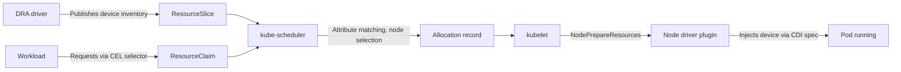

DRA (Dynamic Resource Allocation) is not a GPU-only feature — it is a **general-purpose device allocation framework** that Kubernetes designed for requesting, configuring, and sharing specialized hardware of all kinds. Once a vendor provides a DRA driver, any device — GPUs, high-performance NICs, RDMA adapters, NVLink interconnects, FPGAs — can be dynamically allocated through the same API.

This document covers DRA from a framework perspective — the core API model, the resource types DRA handles, and adoption criteria with prerequisites. The parameters for actually enabling DRA in EKS GPU environments (Karpenter `ignoreDRARequests`, the NVIDIA DRA driver 3-layer settings) are covered in [GPU Resource Management](./gpu-resource-management.md).

---

## Background — Limitations of the Device Plugin Model

Kubernetes' existing extended resource model (Device Plugin) represents devices only as **opaque integer counters** such as `nvidia.com/gpu: 1`. The model is simple and stable, but it cannot express the following requirements.

| Limitation | Description |
|---|---|
| **Static registration** | Device count is fixed at node startup. No runtime reconfiguration (e.g., changing partitioning) |
| **Whole-unit allocation** | Devices are allocated only in their entirety. Partial allocation and sharing cannot be expressed |
| **No attribute-based selection** | Requests like "a GPU with 80GB+ memory" or "an RDMA-capable NIC" are impossible |
| **No multi-resource coordination** | Relationships between devices — "1 GPU + 1 NIC on the same NUMA node" — cannot be expressed |
| **Per-device-type implementations** | GPUs, NICs, and FPGAs each require a separate Device Plugin and counter scheme |

DRA solves these limitations by having drivers **declare device attributes and capacity as structured data**, which workloads then **select with CEL (Common Expression Language) expressions**. This approach is called structured parameters (KEP-4381), and it allows the scheduler to simulate allocation without depending on vendor drivers.

## The DRA Core Model

### The Four API Objects

DRA consists of four objects in the `resource.k8s.io/v1` API group.

| Object | Created by | Role |
|---|---|---|
| **DeviceClass** | Cluster admin / driver | Defines device categories (e.g., `gpu.nvidia.com`, `mrdma.google.com`) with common selection criteria and configuration |
| **ResourceSlice** | DRA driver | Publishes the actual device inventory of a node (or cluster) — attributes, capacity, topology metadata |
| **ResourceClaim** | Workload operator | A request for specific devices. Matches attributes via CEL selectors; lifecycle is independent of the Pod |
| **ResourceClaimTemplate** | Workload operator | A template that auto-creates a ResourceClaim per Pod (used with Deployments and other multi-replica workloads) |

### Allocation Flow



1. The DRA driver publishes the attributes and capacity of the devices it manages as ResourceSlices.
2. The workload declares desired device conditions in a ResourceClaim (Template) using CEL selectors.
3. kube-scheduler computes the allocation and selects a node using ResourceSlice data alone — no driver call happens at this point, which is the essence of structured parameters.
4. kubelet delegates preparation to the node driver plugin, which injects the device into the container via a CDI (Container Device Interface) spec.

ResourceClaim example — requesting "1 GPU with at least 80GB of memory" by attribute.

```yaml
apiVersion: resource.k8s.io/v1
kind: ResourceClaimTemplate
metadata:
  name: large-gpu-template
spec:
  spec:
    devices:
      requests:
        - name: gpu
          exactly:
            deviceClassName: gpu.nvidia.com
            selectors:
              - cel:
                  expression: device.capacity['nvidia.com'].memory.compareTo(quantity('80Gi')) >= 0
```

### Version History

| K8s version | Status | Notes |
|---|---|---|
| 1.26 | Alpha | classic DRA (KEP-3063, later deprecated) |
| 1.30 | Alpha | structured parameters introduced (KEP-4381) |
| 1.32 | Beta | v1beta1, new implementation baseline (disabled by default) |
| 1.34 | **GA** | `resource.k8s.io/v1`, enabled by default |
| 1.35 | Stable (locked) | feature gate locked-to-default |

The core framework reached GA in 1.34; individual advanced capabilities have varying maturity, as described in [Advanced Capabilities](#advanced-capabilities-as-a-general-purpose-framework) below.

## Resource Types Covered by DRA

DRA's extension point is the driver. Once a vendor or project writes a driver for its device and publishes ResourceSlices, the scheduler allocates it with the same matching logic regardless of device kind.

| Resource type | Representative driver | Target devices | Maturity (2026.07) |
|---|---|---|---|
| **GPU** | NVIDIA `k8s-dra-driver-gpu` (v0.4.x), AMD/Intel drivers | Whole GPUs, MIG partitions | GPU allocation subsystem disabled by default (early stage) |
| **Network devices** | DraNet (`kubernetes-sigs/dranet`, v1.3.0) | RDMA NICs, gVNIC, Multi-NIC | Beta → heading to GA. GKE offers managed DRANET |
| **High-performance interconnects** | NVIDIA ComputeDomain (`k8s-dra-driver-gpu` subsystem) | Multi-Node NVLink (MNNVL), IMEX domains | Used on rack-scale systems such as GB200 NVL72 |
| **FPGAs, custom accelerators** | Custom drivers (based on `kubernetes-sigs/dra-example-driver`) | FPGAs, ASICs, video capture, etc. | Driver development kit available; varies by vendor |

### GPU

The most mature application area. The NVIDIA DRA driver consists of two subsystems — **GPU allocation** and **ComputeDomain** — and the GPU allocation subsystem provides capabilities impossible with the Device Plugin, such as dynamic creation and allocation of MIG partitions. For the enablement parameters and Karpenter combination on EKS, see [GPU Resource Management](./gpu-resource-management.md#full-dra-stack-parameters-3-layers).

### Network Devices — DraNet

DraNet is a Kubernetes SIG project that allocates network interfaces via DRA. It treats RDMA interfaces as **first-class schedulable resources** for AI/HPC workloads, without CNI chaining or annotation gymnastics. GKE ships managed DRANET alongside its A4X Max (GB300 NVL72) instances and auto-installs the `mrdma.google.com` (RDMA) and `netdev.google.com` (general NIC) DeviceClasses. EKS has no managed integration yet, so self-deployment is required.

```yaml
# DraNet — requesting an RDMA-capable NIC by attribute
apiVersion: resource.k8s.io/v1
kind: ResourceClaimTemplate
metadata:
  name: rdma-nic-template
spec:
  spec:
    devices:
      requests:
        - name: rdma-nic
          exactly:
            deviceClassName: dra.net
            selectors:
              - cel:
                  expression: device.attributes['dra.net'].rdma == true
```

### High-Performance Interconnects — ComputeDomain

The ComputeDomain subsystem of the NVIDIA DRA driver abstracts a group of GPUs connected via Multi-Node NVLink into a single domain. It guarantees NVLink reachability and isolation between Pods within the domain, and automatically configures IMEX (Internode Memory Exchange) channels. It allocates **the GPU interconnect topology itself** rather than "a number of GPU cards" — a flagship example of DRA going beyond simple device counting.

### FPGAs and Custom Accelerators

`kubernetes-sigs/dra-example-driver` is a forkable reference implementation for developing DRA drivers for your own devices. It provides the boilerplate for ResourceSlice publication, the kubelet plugin, and CDI integration, so devices without vendor drivers — in-house FPGAs, dedicated ASICs — can also be integrated into the DRA scheme.

## Advanced Capabilities as a General-Purpose Framework

These are DRA-specific capabilities that the Device Plugin model cannot express. Even after core GA (1.34), individual features have differing maturity, so verify before adopting.

| Capability | Description | Maturity (as of K8s 1.36) |
|---|---|---|
| **Prioritized list** (`firstAvailable`) | Ranked alternatives such as "H100 first, otherwise A100" | Stable (1.36) |
| **Admin access** | Privileged access to in-use devices for monitoring/diagnostic tools | Beta |
| **Partitionable devices** | Drivers dynamically create and advertise partitions (e.g., MIG) — the scheduler understands the physical-device-to-partition relationship | Beta (1.36) |
| **Consumable capacity** | Multiple ResourceClaims share one device's capacity — Claims share a device the way Pods share node resources | Beta (1.36) |
| **Device taints/tolerations** | The device-level version of node taints — mark specific devices for repair or isolation | Beta (1.36) |
| **Device binding conditions** | The scheduler waits for fabric-attached devices to become ready before binding | Beta (1.35) |

Of these, **multi-heterogeneous-resource coordination** matters most in practice. Requesting a GPU and a NIC in a single ResourceClaim with a "same PCIe switch / same NUMA node" constraint aligns GPU and NIC placement and eliminates communication bottlenecks in distributed training and inference. This was impossible under the Device Plugin scheme, where the GPU plugin and the SR-IOV plugin were unaware of each other.

## Adoption Criteria and Prerequisites

### Cluster Requirements

| Item | Requirement |
|---|---|
| Kubernetes version | 1.34+ (DRA core GA, enabled by default). EKS 1.34/1.35 serves `resource.k8s.io/v1` automatically |
| Container runtime | CDI support (containerd 1.7+ / CRI-O 1.23+) |
| DRA driver | Deploy the vendor driver for the target device (GPU: NVIDIA DRA driver, NIC: DraNet, etc.) |
| Node autoscaling | Karpenter v1.14.0+ (`ignoreDRARequests=false`) or MNG + Cluster Autoscaler — see [GPU Resource Management](./gpu-resource-management.md#karpenter-dra-enablement-parameters-v1140) |
| When using beta features | Enable the relevant feature gates and API groups (EKS control plane is managed, so check supported scope) |

### Device Plugin vs DRA Decision Criteria

| Situation | Recommendation |
|---|---|
| Only whole-GPU allocation needed, single device type | Keep Device Plugin (mature, simple) |
| Attribute-based device selection (memory size, model, firmware) | DRA |
| Device partitioning/sharing (dynamic MIG creation, capacity splitting) | DRA (partitionable/consumable capacity) |
| Aligned placement of heterogeneous devices such as GPU + NIC | DRA (impossible with Device Plugin) |
| Managing RDMA/Multi-NIC as schedulable resources | DRA + DraNet |
| Multi-Node NVLink (GB200 NVL72, etc.) | DRA required (ComputeDomain) |
| Using EKS Auto Mode | DRA currently unavailable — internal Karpenter is below v1.14. See [GPU Resource Management](./gpu-resource-management.md#node-provisioning-compatibility) |

Migration can proceed incrementally. To avoid the Device Plugin and DRA driver double-advertising the same devices, switch per workload group; for GPUs, the turning point is when you flip GPU Operator's `devicePlugin.enabled=false`.

## Summary

DRA is Kubernetes' general-purpose device allocation framework, not limited to GPUs. With the DeviceClass/ResourceClaim/ResourceSlice model and CEL attribute matching, any device published by a vendor driver can be requested, configured, and shared through the same API. Beyond GPUs, RDMA NICs (DraNet), Multi-Node NVLink (ComputeDomain), and FPGAs/custom accelerators already operate in the DRA ecosystem. The core reached GA in K8s 1.34, but advanced capabilities such as partitionable devices and consumable capacity remain Beta, so verify per-feature maturity and adopt incrementally per workload group.

## References

### Official Documentation
- [Kubernetes: Dynamic Resource Allocation](https://kubernetes.io/docs/concepts/scheduling-eviction/dynamic-resource-allocation/) — Official DRA concepts and per-feature maturity
- [Kubernetes: Set Up DRA in a Cluster](https://kubernetes.io/docs/tasks/configure-pod-container/assign-resources/set-up-dra-cluster/) — DRA configuration guide for cluster administrators
- [KEP-4381: DRA Structured Parameters](https://github.com/kubernetes/enhancements/tree/master/keps/sig-node/4381-dra-structured-parameters) — Structured parameters design proposal
- [DraNet](https://github.com/kubernetes-sigs/dranet) — DRA-based network device driver (RDMA, gVNIC)
- [NVIDIA k8s-dra-driver-gpu](https://github.com/NVIDIA/k8s-dra-driver-gpu) — GPU allocation and ComputeDomain subsystems
- [dra-example-driver](https://github.com/kubernetes-sigs/dra-example-driver) — Reference implementation for developing custom DRA drivers

### Related Documents (Internal)
- [GPU Resource Management](./gpu-resource-management.md) — DRA enablement parameters, Karpenter combination, and selection guide for EKS GPU environments
- [EKS GPU Node Strategy](./eks-gpu-node-strategy.md) — Node provisioning strategies for DRA workloads
- [NVIDIA GPU Stack](./nvidia-gpu-stack.md) — GPU Operator, MIG, Time-Slicing details
