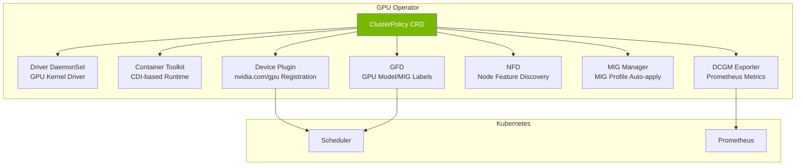
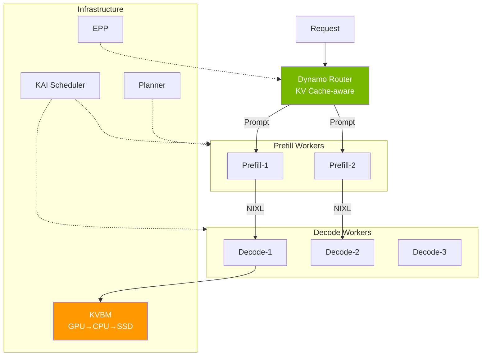

import Tabs from '@theme/Tabs';
import TabItem from '@theme/TabItem';
import { SpecificationTable, ComparisonTable } from '@site/src/components/tables';

# NVIDIA GPU Stack

The NVIDIA GPU software stack is organized in a layered structure for operating GPUs in Kubernetes environments.

| Layer | Role | Core Component |
|-------|------|---------------|
| **Infrastructure Automation** | Declaratively manage GPU drivers, runtimes, and plugins | GPU Operator (ClusterPolicy CRD) |
| **Monitoring** | Collect GPU state and expose Prometheus metrics | DCGM, DCGM Exporter |
| **Partitioning** | Share a single GPU across multiple workloads | MIG, Time-Slicing |
| **Inference Optimization** | Datacenter-scale LLM serving | Dynamo, KAI Scheduler |

This document covers the architecture and design decision criteria for each component. For GPU node provisioning (Karpenter), scaling (KEDA), and cost optimization, see [GPU Resource Management](./gpu-resource-management.md).

---

## GPU Operator Architecture

### Concept

GPU Operator is an orchestration layer that bundles the entire GPU stack under a single **ClusterPolicy CRD**. Each component can be independently enabled/disabled, and GPU environments are automatically configured when nodes are added.

:::info GPU Operator v25.10.1 (as of 2026.03)

| Component | Version | Role |
|-----------|---------|------|
| GPU Operator | **v25.10.1** | GPU stack lifecycle management |
| NVIDIA Driver | **580.126.18** | GPU kernel driver |
| DCGM | **v4.5.2** | GPU monitoring engine |
| DCGM Exporter | **v4.5.2-4.8.1** | Prometheus metrics exposure |
| Device Plugin | **v0.19.0** | K8s GPU resource registration |
| GFD | **v0.19.0** | GPU node labeling |
| MIG Manager | **v0.13.1** | MIG partition auto-management |
| Container Toolkit (CDI) | **v1.17.5** | Container GPU runtime |

**v25.10.1 Key New Features:** Blackwell (B200/GB200) support, HPC Job Mapping, CDMM (Confidential Computing), CDI (Container Device Interface)
:::

### Component Structure



**Component Roles:**

- **Driver DaemonSet**: Installs GPU kernel driver on nodes. Set `enabled: false` for AL2023/Bottlerocket as it's pre-installed in the AMI
- **Container Toolkit (CDI)**: Injects GPU devices into container runtime. CDI (Container Device Interface)-based for runtime independence
- **Device Plugin**: Registers `nvidia.com/gpu` extended resource with kubelet. Enables kube-scheduler to place GPU Pods
- **GFD (GPU Feature Discovery)**: Exposes GPU model, driver version, MIG profiles as node labels. Used for nodeSelector/nodeAffinity
- **NFD (Node Feature Discovery)**: Exposes hardware features (CPU, PCIe, NUMA, etc.) as node labels
- **MIG Manager**: Auto-applies MIG profiles based on ConfigMap. Reconfigures on node label changes
- **DCGM Exporter**: Exposes DCGM metrics in Prometheus format

### GPU Operator Configuration per EKS Environment

| Environment | Driver | Toolkit | Device Plugin | MIG | Notes |
|-------------|--------|---------|---------------|-----|-------|
| **EKS Auto Mode** | No (AWS auto) | No (AWS auto) | No (disabled via label) | No | DCGM/NFD/GFD work normally |
| **Karpenter (Self-Managed)** | No (AL2023 AMI) | No (AL2023 AMI) | Yes | Yes | Full support |
| **Managed Node Group** | No (AL2023 AMI) | No (AL2023 AMI) | Yes | Yes | Full support |
| **Hybrid Node (On-premises)** | Yes (required) | Yes (required) | Yes | Yes | GPU Operator required |

:::caution AMI-specific GPU Driver Constraints
- **AL2023 / Bottlerocket**: GPU driver pre-installed in AMI. Both `driver` and `toolkit` must be `enabled: false`
- **EKS Auto Mode**: AWS auto-manages drivers. Device Plugin disabled via node label `nvidia.com/gpu.deploy.device-plugin: "false"`
:::

### GPU Operator on EKS Auto Mode

On Auto Mode, AWS manages GPU drivers and Device Plugin, but **GPU Operator installation is still useful when**:

- **DCGM Exporter**: GPU metrics collection (Auto Mode itself does not provide DCGM)
- **GFD/NFD**: Per-GPU-model node labeling for nodeSelector usage
- **KAI Scheduler**: Compatibility with projects depending on ClusterPolicy

```yaml
# Auto Mode NodePool — Only Device Plugin disabled via label
apiVersion: karpenter.sh/v1
kind: NodePool
metadata:
  name: gpu-auto-mode
spec:
  template:
    metadata:
      labels:
        nvidia.com/gpu.deploy.device-plugin: "false"
    spec:
      requirements:
        - key: eks.amazonaws.com/instance-family
          operator: In
          values: ["p5", "p4d"]
      nodeClassRef:
        group: eks.amazonaws.com
        kind: NodeClass
        name: default
```

---

## DCGM Monitoring

### Overview

NVIDIA DCGM (Data Center GPU Manager) is a monitoring engine that collects GPU state and exposes metrics to Prometheus. GPU Operator automatically deploys DCGM Exporter as a DaemonSet.

### Deployment Method Selection

<Tabs>
  <TabItem value="daemonset" label="DaemonSet (Recommended)" default>

| Item | Details |
|------|---------|
| **Resource Efficiency** | 1 instance per node — minimal overhead |
| **Management** | Auto-managed by GPU Operator |
| **Metrics Scope** | Collects all GPU metrics on the node |
| **Suitable Environment** | Production environments (most cases) |

  </TabItem>
  <TabItem value="sidecar" label="Sidecar (Special Use)">

| Item | Details |
|------|---------|
| **Resource Efficiency** | 1 instance per Pod — higher overhead |
| **Metrics Scope** | Collects only the Pod's GPU metrics |
| **Suitable Environment** | Multi-tenant billing, when per-Pod isolation is needed |

K8s 1.33+ stabilized Sidecar Containers (`restartPolicy: Always`) can be used to operate alongside the Pod lifecycle.

  </TabItem>
</Tabs>

### Key GPU Metrics

<SpecificationTable
  headers={['Metric', 'Description', 'Usage']}
  rows={[
    { id: '1', cells: ['DCGM_FI_DEV_GPU_UTIL', 'GPU core utilization (%)', 'HPA/KEDA trigger'] },
    { id: '2', cells: ['DCGM_FI_DEV_MEM_COPY_UTIL', 'Memory bandwidth utilization (%)', 'Memory bottleneck detection'] },
    { id: '3', cells: ['DCGM_FI_DEV_FB_USED / FB_FREE', 'Framebuffer used/free (MB)', 'OOM prevention, capacity planning'] },
    { id: '4', cells: ['DCGM_FI_DEV_POWER_USAGE', 'Power usage (W)', 'Cost and thermal management'] },
    { id: '5', cells: ['DCGM_FI_DEV_GPU_TEMP', 'GPU temperature (C)', 'Thermal throttling prevention'] },
    { id: '6', cells: ['DCGM_FI_DEV_SM_CLOCK', 'SM clock speed (MHz)', 'Performance monitoring'] }
  ]}
/>

### Prometheus Integration Concept

DCGM Exporter exposes Prometheus-format metrics at the `:9400/metrics` endpoint. Setting `dcgmExporter.serviceMonitor.enabled=true` during GPU Operator installation auto-creates the ServiceMonitor.

**Collection chain:**

```
GPU Hardware → DCGM Engine → DCGM Exporter (:9400) → Prometheus → Grafana/KEDA
```

**Key design decisions:**
- **Collection interval**: 15s (default). For LLM serving, 10s recommended
- **Metrics filtering**: Control cardinality by collecting only needed metrics via `/etc/dcgm-exporter/dcp-metrics-included.csv`
- **Pod-GPU mapping**: Setting `DCGM_EXPORTER_KUBERNETES=true` adds `pod`, `namespace`, `container` labels to metrics

---

## GPU Partitioning Strategies

### MIG (Multi-Instance GPU)

MIG partitions Ampere/Hopper/Blackwell architecture GPUs (A100, H100, H200, B200) into up to 7 **hardware-isolated** GPU instances. Each MIG instance has independent memory, cache, and SM (Streaming Multiprocessor), guaranteeing stable performance without inter-workload interference.

**MIG Core Value:**
- **Hardware isolation**: Memory, SM, L2 cache completely separated for QoS guarantee
- **Concurrent execution**: Multiple inference workloads run simultaneously without performance degradation
- **GPU Operator auto-management**: MIG Manager auto-applies profiles based on ConfigMap

**A100 40GB MIG Profiles:**

<SpecificationTable
  headers={['Profile', 'Memory', 'SM Count', 'Use Case', 'Expected Throughput']}
  rows={[
    { id: '1', cells: ['1g.5gb', '5GB', '14', 'Small models (3B and below)', '~20 tok/s'] },
    { id: '2', cells: ['1g.10gb', '10GB', '14', 'Small models (3B-7B)', '~25 tok/s'] },
    { id: '3', cells: ['2g.10gb', '10GB', '28', 'Medium models (7B-13B)', '~50 tok/s'] },
    { id: '4', cells: ['3g.20gb', '20GB', '42', 'Medium-large models (13B-30B)', '~100 tok/s'] },
    { id: '5', cells: ['4g.20gb', '20GB', '56', 'Large models (13B-30B)', '~130 tok/s'] },
    { id: '6', cells: ['7g.40gb', '40GB', '84', 'Full GPU (70B+)', '~200 tok/s'] }
  ]}
/>

**MIG Profile Management:**

GPU Operator's MIG Manager watches node labels (`nvidia.com/mig.config`) and auto-applies MIG profiles. Define profiles in a ConfigMap, and MIG Manager reconfigures GPUs when node labels change.

```yaml
# MIG Profile ConfigMap (mig-parted format)
apiVersion: v1
kind: ConfigMap
metadata:
  name: default-mig-parted-config
  namespace: gpu-operator
data:
  config.yaml: |
    version: v1
    mig-configs:
      all-1g.5gb:          # 7 small instances
        - devices: all
          mig-enabled: true
          mig-devices:
            "1g.5gb": 7
      mixed-balanced:      # Mixed configuration
        - devices: all
          mig-enabled: true
          mig-devices:
            "3g.20gb": 1
            "2g.10gb": 1
            "1g.5gb": 2
      single-7g:           # Single large
        - devices: all
          mig-enabled: true
          mig-devices:
            "7g.40gb": 1
```

Pods request MIG devices using `nvidia.com/mig-<profile>` resources.

```yaml
resources:
  requests:
    nvidia.com/mig-1g.5gb: 1
  limits:
    nvidia.com/mig-1g.5gb: 1
```

### Time-Slicing

Time-Slicing shares GPU computing time across multiple Pods based on time division. Unlike MIG, it's **available on all NVIDIA GPUs** but lacks inter-workload memory isolation.

**Configuration:**

GPU Operator's ClusterPolicy references a ConfigMap to enable Time-Slicing.

```yaml
# Time-Slicing ConfigMap
apiVersion: v1
kind: ConfigMap
metadata:
  name: time-slicing-config
  namespace: gpu-operator
data:
  any: |-
    version: v1
    sharing:
      timeSlicing:
        resources:
          - name: nvidia.com/gpu
            replicas: 4    # Each GPU shared by 4 Pods
```

Pods request `nvidia.com/gpu: 1` as usual. On Time-Slicing-enabled nodes, a GPU slice is allocated.

### MIG vs Time-Slicing Comparison

<ComparisonTable
  headers={['Item', 'MIG', 'Time-Slicing']}
  rows={[
    { id: '1', cells: ['Isolation level', 'Hardware isolation (memory, SM, cache)', 'Software time-sharing (no isolation)'] },
    { id: '2', cells: ['Supported GPUs', 'A100, H100, H200, B200', 'All NVIDIA GPUs'] },
    { id: '3', cells: ['Max partitions', '7 instances', 'Unlimited (performance degrades proportionally)'] },
    { id: '4', cells: ['Performance predictability', 'Guaranteed (QoS)', 'Varies with concurrent workload count'] },
    { id: '5', cells: ['Memory safety', 'OOM does not affect other instances', 'OOM affects other workloads'] },
    { id: '6', cells: ['Suitable environment', 'Production inference, multi-tenant', 'Dev/test, batch inference'], recommended: true }
  ]}
/>

:::warning Time-Slicing Performance Characteristics
- **Context switching overhead**: ~1% level, negligible
- **Concurrent execution degradation**: **50-100% performance drop** as GPU memory and compute are shared
- **No memory isolation**: One workload's OOM affects others
- **Suitable**: Batch inference, dev/test environments | **Not suitable**: Real-time inference (SLA), high-performance training
:::

---

## Dynamo: Datacenter-Scale Inference Optimization

### Overview

**NVIDIA Dynamo** is an open-source framework that optimizes datacenter-scale LLM inference. It supports vLLM, SGLang, and TensorRT-LLM as backends, achieving **up to 7x performance improvement** over baselines.

:::info Dynamo v1.0 GA (2026.03)
- **Serving modes**: Aggregated + Disaggregated equally supported
- **Core technologies**: Flash Indexer, NIXL, KAI Scheduler, Planner, EPP
- **Deployment**: Kubernetes Operator + CRD (DGDR)
- **License**: Apache 2.0
:::

### Core Architecture

Dynamo supports both Aggregated Serving and Disaggregated Serving. In Disaggregated mode, Prefill (prompt processing) and Decode (token generation) are separated for independent scaling.



### Core Components

| Component | Role | Benefit |
|-----------|------|---------|
| **Disaggregated Serving** | Separate Prefill/Decode workers | Independent per-phase scaling, maximize GPU utilization |
| **Flash Indexer** | Radix tree-based per-worker KV cache indexing | Prefix matching optimization, maximize KV reuse |
| **KVBM** | GPU → CPU → SSD 3-tier cache | Maximize memory efficiency, support large-scale contexts |
| **NIXL** | NVIDIA Inference Transfer Library | Ultra-fast GPU-to-GPU KV Cache transfer (NVLink/RDMA). Shared by Dynamo, llm-d, production-stack, aibrix |
| **Planner** | SLO-based autoscaling | Profiling → SLO target-based automatic Prefill/Decode scaling |
| **EPP** | Endpoint Picker Protocol | Native integration with K8s Gateway API |
| **AIConfigurator** | Auto TP/PP recommendation | Optimal parallelization based on model size, GPU memory, network topology |

### llm-d Selection Guide

llm-d and Dynamo both handle LLM inference routing/scheduling and **compete at the routing layer**, so you choose one.

```
llm-d:    Client → llm-d Router → vLLM Workers
Dynamo:   Client → Dynamo Router → Prefill Workers → (NIXL) → Decode Workers
```

<ComparisonTable
  headers={['Item', 'llm-d', 'Dynamo']}
  rows={[
    { id: '1', cells: ['Architecture', 'Aggregated + Disaggregated', 'Aggregated + Disaggregated (equal support)'] },
    { id: '2', cells: ['KV Cache Routing', 'Prefix-aware', 'Prefix-aware + Flash Indexer (radix tree)'] },
    { id: '3', cells: ['KV Cache Transfer', 'NIXL', 'NIXL (NVLink/RDMA)'] },
    { id: '4', cells: ['Pod Scheduling', 'K8s default scheduler', 'KAI Scheduler (GPU-aware)'] },
    { id: '5', cells: ['Autoscaling', 'HPA/KEDA integration', 'Planner (SLO-based) + KEDA/HPA'] },
    { id: '6', cells: ['Backend', 'vLLM', 'vLLM, SGLang, TRT-LLM'] },
    { id: '7', cells: ['Complexity', 'Low — add router to existing vLLM', 'High — replace entire serving stack'] },
    { id: '8', cells: ['Maturity', 'v0.5+', 'v1.0 GA'] }
  ]}
/>

| Scenario | Recommendation |
|----------|---------------|
| Add routing to existing vLLM | **llm-d** |
| Small-medium scale (8 GPUs or less) | **llm-d** |
| Gateway API-based K8s native | **llm-d** |
| Large scale (16+ GPUs), maximize throughput | **Dynamo** |
| Long context (128K+) workloads | **Dynamo** (3-tier KV cache) |
| Fast adoption, low operational complexity | **llm-d** |

:::tip Migration Path
Starting with llm-d and transitioning to Dynamo as scale grows is practical. Both share vLLM backend and NIXL KV transfer. The key differences are Dynamo's Flash Indexer, KAI Scheduler, and Planner. Dynamo 1.0 can integrate llm-d as an internal component, making it viewable as a superset rather than a complete alternative.
:::

---

## KAI Scheduler

KAI Scheduler is NVIDIA's **GPU-aware Kubernetes Pod scheduler**. Unlike the default kube-scheduler, it recognizes GPU topology (NVLink, PCIe), MIG slices, and Gang Scheduling to determine optimal Pod placement.

### Core Features

| Feature | Description |
|---------|-------------|
| **GPU Topology Awareness** | Minimizes communication cost by recognizing NVLink/PCIe connection structure |
| **MIG-aware Scheduling** | Recognizes MIG slices as individual scheduling units |
| **Gang Scheduling** | Guarantees all Pods are placed simultaneously in distributed training |
| **Fair-share Scheduling** | Per-namespace/team GPU quota management |
| **Preemption** | Priority-based Pod replacement |

### Design Considerations

- **ClusterPolicy dependency**: KAI Scheduler requires GPU Operator's ClusterPolicy to be installed
- **EKS Auto Mode**: KAI Scheduler usable after installing GPU Operator with Device Plugin disabled via label
- **Relationship with kube-scheduler**: KAI Scheduler does not replace kube-scheduler; it operates as a Secondary Scheduler delegated only for GPU workloads

:::info KAI Scheduler =/= Autoscaling
KAI Scheduler is a scheduler that decides **which node to place Pods on**. It is separate from autoscaling (KEDA/HPA) that increases Pod count or provisioning (Karpenter) that adds nodes.
:::

---

## Related Documents

- [GPU Resource Management](./gpu-resource-management.md) — Karpenter, KEDA, DRA, cost optimization
- [EKS GPU Node Strategy](./eks-gpu-node-strategy.md) — Auto Mode + Karpenter + Hybrid Node configuration
- [vLLM Model Serving](../inference-frameworks/vllm-model-serving.md) — vLLM-based inference engine
- [llm-d EKS Auto Mode](../inference-frameworks/llm-d-eks-automode.md) — llm-d detailed architecture

## References

- [NVIDIA GPU Operator Documentation](https://docs.nvidia.com/datacenter/cloud-native/gpu-operator/latest/)
- [NVIDIA DCGM Exporter](https://github.com/NVIDIA/dcgm-exporter)
- [NVIDIA Dynamo GitHub](https://github.com/ai-dynamo/dynamo)
- [NIXL - NVIDIA Inference Transfer Library](https://github.com/ai-dynamo/nixl)
- [KAI Scheduler](https://github.com/NVIDIA/KAI-Scheduler)
