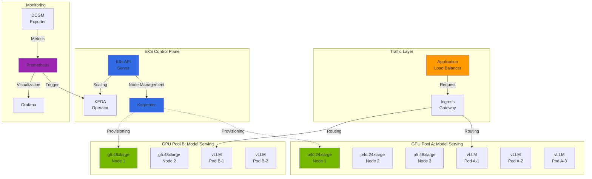
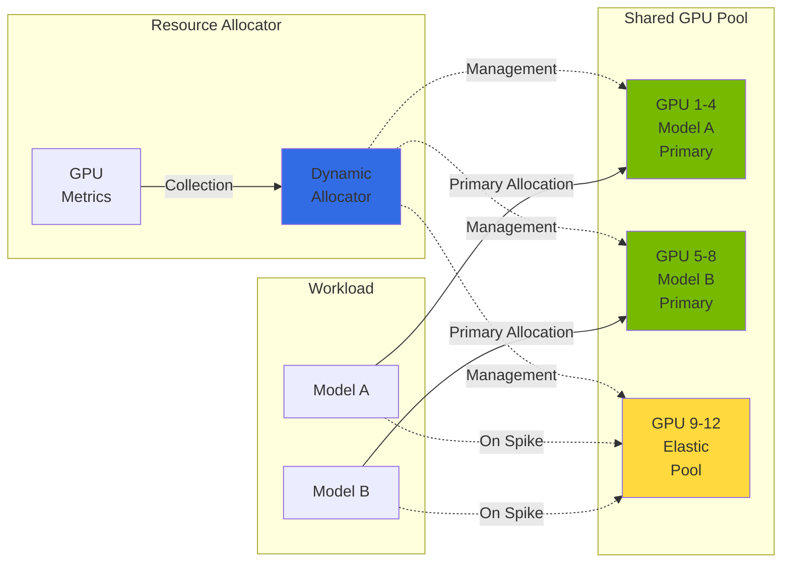
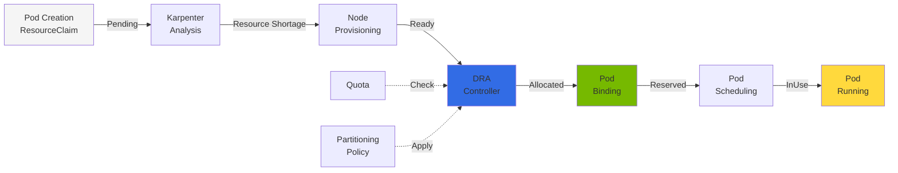
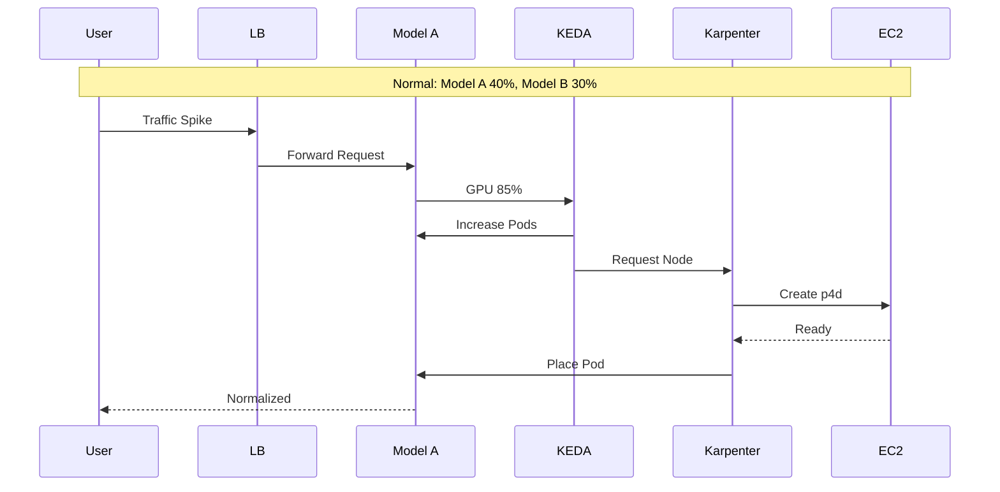

import Tabs from '@theme/Tabs';
import TabItem from '@theme/TabItem';
import { SpecificationTable, ComparisonTable } from '@site/src/components/tables';
import { DraLimitationsTable, ScalingDecisionTable } from '@site/src/components/GpuResourceTables';

# EKS GPU Cluster Dynamic Resource Management

> 📅 **Created**: 2025-02-09 | **Updated**: 2026-03-20 | ⏱️ **Reading Time**: Approximately 8 minutes


## Overview

In large-scale GenAI service environments, efficiently managing multiple GPU clusters and dynamically reallocating resources based on traffic changes is critical. This document covers GPU node autoscaling with Karpenter in Amazon EKS, workload autoscaling with KEDA, DRA (Dynamic Resource Allocation)-based GPU resource management, and cost optimization strategies.

### Key Objectives

- **Resource Efficiency**: Minimize GPU resource idle time
- **Cost Optimization**: Cost reduction through Spot instance utilization and Consolidation
- **Automated Scaling**: Automatic resource adjustment based on traffic patterns
- **Service Stability**: Ensure adequate resources to meet SLA requirements

---

## Multi-GPU Cluster Architecture

### Overall Architecture Diagram



### Resource Sharing Architecture

Architecture for efficient GPU resource sharing between multiple models.



:::info Resource Sharing Principles

- **Primary Pool**: Base GPU resources allocated to each model
- **Elastic Pool**: Shared resources dynamically allocated during traffic spikes
- **Priority-based Allocation**: Protect critical workloads through priority-based resource allocation

:::

---

## Karpenter-based Node Scaling

:::info Karpenter v1.0+ GA Status
Karpenter has been GA (Generally Available) since v1.0 and can be used reliably in production environments. All examples in this document use the Karpenter v1 API (`karpenter.sh/v1`).
:::

### NodePool Configuration

Example Karpenter NodePool configuration for GPU workloads.

```yaml
apiVersion: karpenter.sh/v1
kind: NodePool
metadata:
  name: gpu-inference-pool
spec:
  template:
    metadata:
      labels:
        node-type: gpu-inference
        workload: genai
    spec:
      requirements:
        - key: kubernetes.io/arch
          operator: In
          values: ["amd64"]
        - key: karpenter.sh/capacity-type
          operator: In
          values: ["on-demand", "spot"]
        - key: node.kubernetes.io/instance-type
          operator: In
          values:
            - p4d.24xlarge    # 8x A100 40GB
            - p5.48xlarge     # 8x H100 80GB
            - g5.48xlarge     # 8x A10G 24GB
        - key: karpenter.k8s.aws/instance-gpu-count
          operator: Gt
          values: ["0"]
      nodeClassRef:
        group: karpenter.k8s.aws
        kind: EC2NodeClass
        name: gpu-nodeclass
      taints:
        - key: nvidia.com/gpu
          value: "true"
          effect: NoSchedule
  limits:
    cpu: 1000
    memory: 4000Gi
    nvidia.com/gpu: 64
  disruption:
    consolidationPolicy: WhenEmptyOrUnderutilized
    consolidateAfter: 30s
  weight: 100
```

### EC2NodeClass Configuration

EC2NodeClass configuration for GPU instances.

```yaml
apiVersion: karpenter.k8s.aws/v1
kind: EC2NodeClass
metadata:
  name: gpu-nodeclass
spec:
  role: KarpenterNodeRole-${CLUSTER_NAME}
  amiSelectorTerms:
    - alias: al2023@latest
  subnetSelectorTerms:
    - tags:
        karpenter.sh/discovery: ${CLUSTER_NAME}
  securityGroupSelectorTerms:
    - tags:
        karpenter.sh/discovery: ${CLUSTER_NAME}
  blockDeviceMappings:
    - deviceName: /dev/xvda
      ebs:
        volumeSize: 500Gi
        volumeType: gp3
        iops: 10000
        throughput: 500
        encrypted: true
        deleteOnTermination: true
  instanceStorePolicy: RAID0
  userData: |
    #!/bin/bash
    # NVIDIA Driver and Container Toolkit setup
    nvidia-smi

    # GPU Memory Mode setting (Persistence Mode)
    nvidia-smi -pm 1

    # EFA Driver load (for p4d, p5 instances)
    modprobe efa
  tags:
    Environment: production
    Workload: genai-inference
```

### GPU Instance Type Comparison

<ComparisonTable
  headers={['Instance Type', 'GPU', 'GPU Memory', 'vCPU', 'Memory', 'Network', 'Use Case']}
  rows={[
    { id: '1', cells: ['p4d.24xlarge', '8x A100', '40GB x 8', '96', '1152 GiB', '400 Gbps EFA', 'Large-scale LLM inference'], recommended: true },
    { id: '2', cells: ['p5.48xlarge', '8x H100', '80GB x 8', '192', '2048 GiB', '3200 Gbps EFA', 'Ultra-large models, training'] },
    { id: '3', cells: ['p5e.48xlarge', '8x H200', '141GB x 8', '192', '2048 GiB', '3200 Gbps EFA', 'Large-scale model training/inference'] },
    { id: '4', cells: ['g5.48xlarge', '8x A10G', '24GB x 8', '192', '768 GiB', '100 Gbps', 'Small-medium model inference'] },
    { id: '5', cells: ['g6e.xlarge ~ g6e.48xlarge', 'NVIDIA L40S', 'Up to 8x48GB', 'Up to 192', 'Up to 768 GiB', 'Up to 100 Gbps', 'Cost-efficient inference'] },
    { id: '6', cells: ['trn2.48xlarge', '16x Trainium2', '-', '192', '2048 GiB', '1600 Gbps', 'AWS native training'] }
  ]}
/>

:::tip Instance Selection Guide

- **p5e.48xlarge**: 100B+ parameter models, maximum H200 memory utilization
- **p5.48xlarge**: 70B+ parameter models, when highest performance is required
- **p4d.24xlarge**: 13B-70B parameter models, balanced cost-performance
- **g6e.xlarge~48xlarge**: 13B-70B models, cost-efficient L40S inference
- **g5.48xlarge**: 7B and smaller models, cost-efficient inference
- **trn2.48xlarge**: AWS native training workload, Trainium2 optimization

:::

:::tip EKS Auto Mode GPU Scheduling
EKS Auto Mode automatically detects GPU workloads and provisions appropriate GPU instances. Even without NodePool configuration, it selects optimal instances based on GPU Pod resource requests.
:::

---

## Kubernetes GPU Resource Management

### K8s 1.33/1.34 Major Features

Kubernetes versions 1.33 and 1.34 introduced several important features for GPU workload management.

<Tabs>
  <TabItem value="k8s133" label="Kubernetes 1.33+" default>

| Feature | Description | GPU Workload Impact |
|---------|-------------|---------------------|
| **Stable Sidecar Containers** | Init containers can run throughout Pod lifecycle | Stabilization of GPU metrics collection and logging sidecars |
| **Topology-Aware Routing** | Traffic routing based on node topology | Optimal path selection between GPU nodes, reduced latency |
| **In-Place Resource Resizing** | Resource adjustment without Pod restart | Dynamic GPU memory adjustment (limited) |
| **DRA v1beta1 Stabilization** | Dynamic Resource Allocation API stabilization | Production GPU partitioning support |

  </TabItem>
  <TabItem value="k8s134" label="Kubernetes 1.34+">

| Feature | Description | GPU Workload Impact |
|---------|-------------|---------------------|
| **Projected Service Account Tokens** | Enhanced service account token management | Enhanced GPU Pod security |
| **DRA Prioritized Alternatives** | Resource allocation priority alternatives | Intelligent scheduling during GPU resource contention |
| **Improved Resource Quota** | Granular resource quota | Precise allocation control per GPU tenant |

  </TabItem>
</Tabs>

### DRA Deep Dive: Dynamic Resource Allocation

#### DRA Background and Necessity

:::info DRA (Dynamic Resource Allocation) Status Update

- **K8s 1.26-1.30**: Alpha (feature gate required, `v1alpha2` API)
- **K8s 1.31**: Promoted to Beta, enabled by default (`v1alpha2` API)
- **K8s 1.32**: Transition to new implementation (KEP #4381), `v1beta1` API (disabled by default)
- **K8s 1.33+**: `v1beta1` API stabilization, significant performance improvements, production-ready
- **K8s 1.34+**: DRA prioritized alternatives support, enhanced scheduling
- In EKS 1.32+, you must explicitly enable the `DynamicResourceAllocation` feature gate to use DRA.
- In EKS 1.33+, DRA is enabled by default and ready for stable production use.
:::

In early Kubernetes, GPU resource allocation used the **Device Plugin** model. This model has the following fundamental limitations:

<DraLimitationsTable />

**DRA (Dynamic Resource Allocation)** was introduced as Alpha in Kubernetes 1.26 and promoted to Beta in 1.31+, overcoming these limitations.

#### DRA Core Concepts

DRA is a new paradigm that separates **declarative resource requests from immediate allocation**:



#### ResourceClaim Lifecycle

The core of DRA is a new Kubernetes resource called **ResourceClaim**:

:::warning API Version Notice
The examples below are based on the `v1alpha2` API for K8s 1.31 and earlier.

**K8s 1.32+**: Transition to `resource.k8s.io/v1beta1` API, use DeviceClass instead of ResourceClass, ResourceClaim spec structure changed

**K8s 1.33+**: `v1beta1` API stabilization, production use recommended

**K8s 1.34+**: DRA prioritized alternatives support, enhanced resource scheduling

Use the API appropriate for your cluster version in production deployments.
:::

```yaml
# 1. Lifecycle State Description

# PENDING state: Waiting for resource allocation
apiVersion: resource.k8s.io/v1alpha2
kind: ResourceClaim
metadata:
  name: gpu-claim-vllm
  namespace: ai-inference
spec:
  resourceClassName: gpu.nvidia.com
  parametersRef:
    apiGroup: gpu.nvidia.com
    kind: GpuClaimParameters
    name: h100-params
status:
  phase: Pending  # Not yet allocated

---

# ALLOCATED state: DRA controller completed resource reservation
status:
  phase: Allocated
  allocation:
    resourceHandle: "gpu-handle-12345"
    shareable: false

---

# RESERVED state: Ready for Pod binding
status:
  phase: Reserved
  allocation:
    resourceHandle: "gpu-handle-12345"
    nodeName: "gpu-node-01"

---

# INUSE state: Pod actively running
status:
  phase: InUse
  allocation:
    resourceHandle: "gpu-handle-12345"
    nodeName: "gpu-node-01"
  reservedFor:
    - kind: Pod
      name: vllm-inference
      namespace: ai-inference
      uid: "abc123"
```

To transition from one state to the next, specific conditions must be met:

- **Pending -> Allocated**: DRA driver confirms and reserves available resources
- **Allocated -> Reserved**: Pod specifies ResourceClaim and scheduler determines node
- **Reserved -> InUse**: Pod actually starts running on the node

#### DRA vs Device Plugin Detailed Comparison

<ComparisonTable
  headers={['Item', 'Device Plugin', 'DRA']}
  rows={[
    { id: '1', cells: ['Resource Allocation Timing', 'At node startup (static)', 'At Pod scheduling (dynamic)'] },
    { id: '2', cells: ['Allocation Unit', 'Whole GPU only', 'GPU divisible (MIG, time-slicing)'] },
    { id: '3', cells: ['Priority Support', 'None (first-come-first-served)', 'ResourceClaim priority support'] },
    { id: '4', cells: ['Multi-resource Coordination', 'Not possible', 'Multiple resources coordinated at Pod level'] },
    { id: '5', cells: ['Performance Constraint Policy', 'None', 'Performance policy definable via ResourceClass'] },
    { id: '6', cells: ['Allocation Resilience', 'Manual cleanup on node failure', 'Automatic recovery mechanism'] },
    { id: '7', cells: ['Kubernetes Version', '1.8+', '1.26+ (Alpha), 1.32+ (v1beta1)'] },
    { id: '8', cells: ['Maturity', 'Production', '1.33+ production-ready'], recommended: true }
  ]}
/>

:::tip DRA Selection Guide
**When to use DRA:**

- When GPU partitioning is needed (MIG, time-slicing)
- Fair resource distribution required in multi-tenant environments
- When resource priority needs to be applied
- When dynamic scaling is critical
- **K8s 1.33+ environment**: DRA `v1beta1` API stabilization, production use recommended
- **K8s 1.34+ environment**: Leverage enhanced scheduling with DRA prioritized alternatives

**When Device Plugin is sufficient:**

- Simply allocating GPUs in whole units
- Legacy system compatibility is important
- Kubernetes version is 1.32 or earlier
:::

### Topology-Aware Routing Utilization

Select optimal paths between GPU nodes to minimize latency.

```yaml
apiVersion: v1
kind: Service
metadata:
  name: vllm-inference
  namespace: ai-inference
  annotations:
    # K8s 1.33+ Topology-Aware Routing
    service.kubernetes.io/topology-mode: "Auto"
spec:
  selector:
    app: vllm
  ports:
    - port: 8000
      targetPort: 8000
  # Enable topology-aware routing
  trafficDistribution: PreferClose
```

---

## Workload Autoscaling

### KEDA ScaledObject Configuration

Configure GPU metrics-based autoscaling using KEDA. GPU metrics are collected through DCGM Exporter. For DCGM deployment and metric details, refer to [NVIDIA GPU Stack](./nvidia-gpu-stack.md#dcgm-monitoring).

```yaml
apiVersion: keda.sh/v1alpha1
kind: ScaledObject
metadata:
  name: model-a-gpu-scaler
  namespace: inference
spec:
  scaleTargetRef:
    apiVersion: apps/v1
    kind: Deployment
    name: model-a-serving
  pollingInterval: 15
  cooldownPeriod: 60
  minReplicaCount: 2
  maxReplicaCount: 10
  fallback:
    failureThreshold: 3
    replicas: 3
  advanced:
    horizontalPodAutoscalerConfig:
      behavior:
        scaleDown:
          stabilizationWindowSeconds: 300
          policies:
            - type: Percent
              value: 25
              periodSeconds: 60
        scaleUp:
          stabilizationWindowSeconds: 0
          policies:
            - type: Percent
              value: 100
              periodSeconds: 15
            - type: Pods
              value: 4
              periodSeconds: 15
          selectPolicy: Max
  triggers:
    - type: prometheus
      metadata:
        serverAddress: http://prometheus-server.monitoring:9090
        metricName: gpu_utilization
        query: |
          avg(DCGM_FI_DEV_GPU_UTIL{pod=~"model-a-.*"})
        threshold: "70"
        activationThreshold: "50"
```

### Autoscaling Thresholds

Recommended thresholds based on workload characteristics.

<SpecificationTable
  headers={['Workload Type', 'Scale Up Threshold', 'Scale Down Threshold', 'Cooldown']}
  rows={[
    { id: '1', cells: ['Real-time Inference', 'GPU 70%', 'GPU 30%', '60s'] },
    { id: '2', cells: ['Batch Processing', 'GPU 85%', 'GPU 40%', '300s'] },
    { id: '3', cells: ['Interactive Service', 'GPU 60%', 'GPU 25%', '30s'] }
  ]}
/>

:::tip Threshold Tuning Guide

1. **Initial Setup**: Start with conservative values (Scale Up 80%, Scale Down 20%)
2. **Monitoring**: Observe actual traffic patterns for 2-3 days
3. **Adjustment**: Gradually adjust considering response time SLA and cost
4. **Validation**: Validate configuration through load testing

:::

### HPA and KEDA Integration

Configuration when using basic HPA together with KEDA.

```yaml
apiVersion: autoscaling/v2
kind: HorizontalPodAutoscaler
metadata:
  name: model-a-hpa
  namespace: inference
spec:
  scaleTargetRef:
    apiVersion: apps/v1
    kind: Deployment
    name: model-a-serving
  minReplicas: 2
  maxReplicas: 10
  metrics:
    - type: External
      external:
        metric:
          name: gpu_utilization
          selector:
            matchLabels:
              scaledobject.keda.sh/name: model-a-gpu-scaler
        target:
          type: AverageValue
          averageValue: "70"
```

### Dynamic Resource Allocation Strategy

#### Traffic Spike Scenario

Traffic spike scenarios that can occur in actual operational environments and response strategies.



#### Inter-Model Resource Reallocation Procedure

Specific procedure for allocating Model B's idle resources to Model A when traffic spikes in Model A.

**Step 1: Metrics Collection and Analysis**

```yaml
# Key metrics collected by DCGM Exporter
# - DCGM_FI_DEV_GPU_UTIL: GPU utilization
# - DCGM_FI_DEV_MEM_COPY_UTIL: Memory copy utilization
# - DCGM_FI_DEV_FB_USED: Framebuffer usage
```

**Step 2: Scaling Decision**

<ScalingDecisionTable />

**Step 3: Execute Resource Reallocation**

```bash
# Reduce Model B replica count (free idle resources)
kubectl scale deployment model-b-serving --replicas=1 -n inference

# Increase Model A replica count
kubectl scale deployment model-a-serving --replicas=5 -n inference

# Or let KEDA handle it automatically
```

**Step 4: Node-level Scaling**

Karpenter automatically provisions additional nodes or cleans up idle nodes.

:::warning Caution

To ensure Model B's minimum SLA during resource reallocation, you must set `minReplicas`. Complete resource recovery can cause service interruption.

:::

---

## Cost Optimization Strategies

### Spot Instance Utilization

Reduce costs by up to 90% by utilizing GPU Spot instances.

```yaml
apiVersion: karpenter.sh/v1
kind: NodePool
metadata:
  name: gpu-spot-pool
spec:
  template:
    spec:
      requirements:
        - key: karpenter.sh/capacity-type
          operator: In
          values: ["spot"]
        - key: node.kubernetes.io/instance-type
          operator: In
          values:
            - g5.12xlarge
            - g5.24xlarge
            - g5.48xlarge
      nodeClassRef:
        group: karpenter.k8s.aws
        kind: EC2NodeClass
        name: gpu-spot-nodeclass
      taints:
        - key: nvidia.com/gpu
          value: "true"
          effect: NoSchedule
        - key: karpenter.sh/capacity-type
          value: "spot"
          effect: NoSchedule
  limits:
    nvidia.com/gpu: 32
  disruption:
    consolidationPolicy: WhenEmpty
    consolidateAfter: 30s
  weight: 50
```

:::warning Spot Instance Cautions

- **Interruption Handling**: Spot instances receive 2-minute interruption notices. Proper graceful shutdown implementation required
- **Workload Suitability**: Suitable for stateless inference workloads
- **Availability**: Spot availability for specific instance types may be low, so specifying various types is recommended

:::

### Spot Interruption Handling

```yaml
apiVersion: apps/v1
kind: Deployment
metadata:
  name: model-serving-spot
  namespace: inference
spec:
  template:
    spec:
      terminationGracePeriodSeconds: 120
      containers:
        - name: vllm
          lifecycle:
            preStop:
              exec:
                command:
                  - /bin/sh
                  - -c
                  - |
                    # Stop receiving new requests
                    curl -X POST localhost:8000/drain
                    # Wait for in-progress requests to complete
                    sleep 90
      tolerations:
        - key: karpenter.sh/capacity-type
          operator: Equal
          value: "spot"
          effect: NoSchedule
```

### Consolidation Policy

Automatically clean up idle nodes to optimize costs.

```yaml
apiVersion: karpenter.sh/v1
kind: NodePool
metadata:
  name: gpu-inference-pool
spec:
  disruption:
    # Consolidate when nodes are empty or underutilized
    consolidationPolicy: WhenEmptyOrUnderutilized
    # Consolidation wait time
    consolidateAfter: 30s
    # Budget settings - limit number of nodes that can be disrupted simultaneously
    budgets:
      - nodes: "20%"
      - nodes: "0"
        schedule: "0 9 * * 1-5"  # Prevent disruption during weekday business hours
        duration: 8h
```

### Cost Optimization Checklist

<SpecificationTable
  headers={['Item', 'Description', 'Expected Savings']}
  rows={[
    { id: '1', cells: ['Spot Instance Utilization', 'Non-production and fault-tolerant workloads', '60-90%'] },
    { id: '2', cells: ['Enable Consolidation', 'Automatic idle node cleanup', '20-30%'] },
    { id: '3', cells: ['Right-sizing', 'Select instances appropriate for workload', '15-25%'] },
    { id: '4', cells: ['Schedule-based Scaling', 'Reduce resources during off-hours', '30-40%'] }
  ]}
/>

:::tip Cost Monitoring

Use Kubecost or AWS Cost Explorer to track GPU workload-specific costs and regularly review optimization opportunities.

:::

---

## Operational Best Practices

### GPU Resource Request Configuration

```yaml
apiVersion: apps/v1
kind: Deployment
metadata:
  name: model-a-serving
  namespace: inference
spec:
  template:
    spec:
      containers:
        - name: vllm
          resources:
            requests:
              nvidia.com/gpu: 1
              memory: "32Gi"
              cpu: "8"
            limits:
              nvidia.com/gpu: 1
              memory: "64Gi"
              cpu: "16"
```

### Monitoring Dashboard Configuration

Key panels to monitor in Grafana dashboard:

1. **GPU Utilization Trend**: GPU utilization changes over time
2. **Memory Usage**: GPU memory usage and available space
3. **Pod Scaling Events**: HPA/KEDA scaling history
4. **Node Provisioning**: Karpenter node creation/deletion events
5. **Cost Tracking**: Hourly/daily GPU costs

### Alert Configuration

```yaml
apiVersion: monitoring.coreos.com/v1
kind: PrometheusRule
metadata:
  name: gpu-alerts
  namespace: monitoring
spec:
  groups:
    - name: gpu-alerts
      rules:
        - alert: HighGPUUtilization
          expr: avg(DCGM_FI_DEV_GPU_UTIL) > 90
          for: 5m
          labels:
            severity: warning
          annotations:
            summary: "GPU utilization exceeded 90%"

        - alert: GPUMemoryPressure
          expr: (DCGM_FI_DEV_FB_USED / (DCGM_FI_DEV_FB_USED + DCGM_FI_DEV_FB_FREE)) > 0.9
          for: 2m
          labels:
            severity: critical
          annotations:
            summary: "GPU memory shortage risk"
```

---

## Summary

Dynamic resource management of EKS GPU clusters is a critical factor determining the performance and cost efficiency of GenAI services.

### Key Points

1. **Karpenter Utilization**: Maximize resource efficiency through automatic provisioning and cleanup of GPU nodes
2. **DRA-based Management**: Dynamic allocation and partitioning of GPU resources with Dynamic Resource Allocation
3. **KEDA Integration**: Workload autoscaling based on GPU metrics
4. **Spot Instances**: Cost reduction by utilizing Spot for appropriate workloads
5. **Consolidation**: Cost optimization through automatic cleanup of idle resources

### Next Steps

- [NVIDIA GPU Software Stack](./nvidia-gpu-stack.md) -- GPU Operator, DCGM, MIG, Time-Slicing, Dynamo
- [EKS GPU Node Strategy](./eks-gpu-node-strategy.md) -- Auto Mode + Karpenter + Hybrid Node Configuration
- [vLLM Model Serving](./vllm-model-serving.md) -- Inference Engine Deployment

---

## References

- [Karpenter Official Documentation](https://karpenter.sh/)
- [KEDA Official Documentation](https://keda.sh/)
- [AWS GPU Instance Guide](https://aws.amazon.com/ec2/instance-types/#Accelerated_Computing)
- [Kubernetes DRA Documentation](https://kubernetes.io/docs/concepts/scheduling-eviction/dynamic-resource-allocation/)
