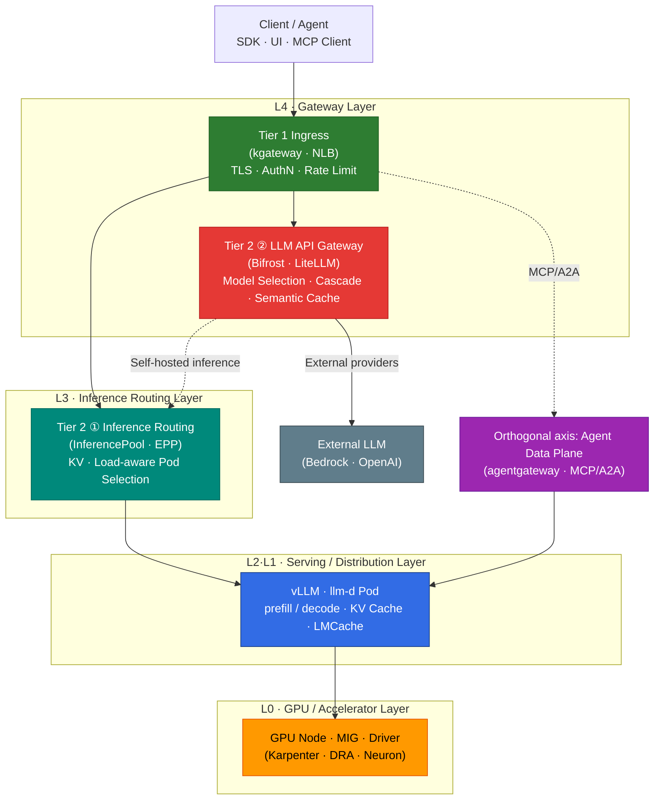

import { DocCard, DocCardGrid } from '@site/src/components/DocCards';
import { TieredGatewayDiagram } from '@site/src/components/GatewayApiTables';

## Overview

This document is the entry point for the **Model Serving & Inference Infrastructure** category, which covers deploying and serving LLMs on GPUs and accelerators. It explains **how LLM inference operates at the infrastructure level** across the entire request path and organizes what can be tuned at each layer into a single map. The intended audience is platform engineers who design and operate inference platforms on EKS.

Inference optimization is achieved not by a single technology but by **a combination of multiple layers**. From GPU node placement to serving engine memory management, distributed topology, in-cluster routing, gateway policies, and cache layers — each stage has its own tuning levers. This document serves as a map that **organizes and connects those levers layer by layer**, with detailed content for each topic linked to dedicated deep-dive documents. The body focuses on concepts and relationships, while implementation and deployment procedures are covered in the linked documents.

## Category Structure

- **GPU Infrastructure Layer**: The layer that manages GPU instances, drivers, schedulers, and partitioning on top of Kubernetes. Determines which nodes get GPU allocation and how.
- **Inference Framework Layer**: The AI framework layer that actually serves models, performs distributed inference, and fine-tunes on the secured GPUs. vLLM, llm-d, MoE, and NeMo belong here.
- **Inference Optimization & Routing Layer**: The layer that optimizes performance and cost through KV cache, Disaggregated Serving, LMCache, cache-hit strategy, and gateway routing.

<DocCardGrid columns={3}>
  <DocCard
    to="/docs/agentic-ai-platform/model-serving/gpu-infrastructure"
    icon="🖥️"
    title="GPU Infrastructure"
    description="EKS GPU node strategy, Karpenter·KEDA·DRA-based resource management, NVIDIA GPU stack (ClusterPolicy·DCGM·MIG·Time-Slicing), AWS Neuron Stack (Trainium2/Inferentia2)."
    color="#326ce5"
  />
  <DocCard
    to="/docs/agentic-ai-platform/model-serving/inference-frameworks"
    icon="🚀"
    title="Inference Frameworks"
    description="vLLM PagedAttention·Multi-LoRA, llm-d distributed inference·KV Cache-aware routing, MoE model serving, NVIDIA NeMo training·fine-tuning framework."
    color="#ff6b6b"
  />
  <DocCard
    to="/docs/agentic-ai-platform/model-serving/inference-optimization"
    icon="⚡"
    title="Inference Optimization & Routing"
    description="KV Cache optimization, Disaggregated Serving, LMCache, cache-hit strategy, tiered gateway and Cascade routing strategies."
    color="#00897b"
  />
</DocCardGrid>

:::tip Learning Order
After grasping the full picture with the map below, reading in the order **GPU Infrastructure → Inference Frameworks → Inference Optimization & Routing** is natural. First decide "which nodes, partitioning, and driver stack to use" in GPU Infrastructure, then cover "how to deploy vLLM and llm-d on top of that" in Inference Frameworks, and finally "how to optimize performance/cost and route traffic" in Inference Optimization & Routing.
:::

## End-to-End Path of an Inference Request

An LLM inference request passes through multiple layers from the client to GPU computation. Each layer has a different responsibility, and which decisions are made at which layer changes latency, throughput, and cost.

Each layer's role is as follows.

- **L4 Gateway**: Handles external traffic ingress (Tier 1) and model abstraction, Cascade, and caching (Tier 2 ②).
- **L3 Inference Routing**: For self-hosted models, decides which Pod to send a request to, considering KV cache and load.
- **L2·L1 Serving/Distribution**: The layer that actually generates tokens — handles prefill/decode processing and KV cache management.
- **L0 GPU/Accelerator**: The physical layer where computation runs — covers node selection, partitioning, and the driver stack.

### Two Kinds of Routing — Routing ≠ Inference

Inference infrastructure contains **two routing decisions with different natures**, and conflating them leads to misaligned gateway choices.

- **Across-model routing (Tier 2 ②)**: Decides "which **model** to send to." Complexity-based Cascade, cost tracking, and external provider fallback fall here. Handled by LLM API Gateways such as Bifrost or LiteLLM.
- **Within-model routing (Tier 2 ①)**: Decides "which **Pod** of the same model to send to among many." Selection is based on KV cache locality and real-time load metrics. Handled by the Gateway API Inference Extension (InferencePool · EPP).

Definitions and the correspondence between the two layers are covered in detail in [Tiered Gateway Architecture](./inference-routing/tiered-gateway-architecture.md) and [Routing Strategy — Gateway Layer Separation](./inference-routing/routing-strategy.md#gateway-layer-separation).

## Layered Tuning Model

The tuning levers that govern inference performance, organized by layer, are as follows. For detailed behavior and configuration of each lever, refer to the deep-dive documents on the right.

| Layer | Key Tuning Levers | Affected Metrics | Deep-Dive Document |
|------|--------------|----------|----------|
| **L0** GPU/Accelerator | Instance selection · MIG · Time-Slicing · DRA · Neuron | GPU utilization · cost | [GPU Resource Management](./gpu-infrastructure/gpu-resource-management.md) |
| **L1** Serving Engine | PagedAttention · Continuous Batching · FP8 KV · Prefix Caching · Chunked Prefill · Speculative Decoding · Quantization · TP/PP/EP | TTFT · TPS · memory | [vLLM Model Serving](./inference-frameworks/vllm-model-serving.md) · [KV Cache Optimization](./inference-optimization/kv-cache-optimization.md) |
| **L2** Distributed Topology | Prefill/Decode disaggregation · NIXL · LWS multi-node | Large-model throughput | [Disaggregated Serving](./inference-optimization/disaggregated-serving.md) |
| **L3** Inference Routing | KV cache-aware · context-aware · prefix-cache scorer | Cache hit rate · P99 | [KV Cache-Aware Routing](./inference-optimization/kv-cache-optimization.md#kv-cache-aware-routing) |
| **L4** Gateway | Model Cascade · cost tracking · Rate Limit · L7 limitations | Cost · availability | [Tiered Gateway](./inference-routing/tiered-gateway-architecture.md) · [Routing Strategy](./inference-routing/routing-strategy.md) |
| **L5** Cache Layer | KV/Prefix cache · Prompt cache · Semantic cache · LMCache | Cache hit rate · cost | [LMCache](./inference-optimization/lmcache.md) · [Cache-Hit Strategy](./inference-optimization/cache-hit-strategy.md) |

:::tip Reading order
Reading from lower layers (L0 GPU) upward (L4 Gateway) gives the infrastructure perspective; reading along the request path (L4 → L0) gives the traffic perspective. For performance metrics (TTFT · TPS · cache hit rate) and the recommended 3-Tier composition, see [Inference Optimization Overview](./inference-optimization/index.md).
:::

## Roles and Functions of the Inference Gateway

The "Inference Gateway" is not a single component but a bundle of multiple layers with different responsibilities. Across the platform, in-cluster inference Pod routing and external LLM provider proxying are explicitly separated.

<TieredGatewayDiagram />

| Layer | Role | Representative Implementations |
|------|------|------------|
| **Tier 1** Ingress | Receive external traffic, TLS termination, authentication, rate limiting | kgateway · AWS LBC · Envoy Gateway |
| **Tier 2 ①** Inference Routing | In-cluster inference Pod selection (KV · load-aware) | Gateway API Inference Extension |
| **Tier 2 ②** LLM API Gateway | Model abstraction, Cascade, cost tracking, Semantic Caching | Bifrost · LiteLLM · OpenRouter |

Each layer's role definition and solution selection criteria are covered in [Tiered Gateway Architecture](./inference-routing/tiered-gateway-architecture.md), and solution comparisons along with Cascade and Semantic strategies are covered in [Routing Strategy](./inference-routing/routing-strategy.md).

## Limitations of Conventional L7 Gateways

General-purpose L7 gateways (NGINX, default Envoy, and others) are designed to distribute HTTP requests in a stateless manner and cannot recognize the characteristics of LLM inference traffic. This results in the following limitations.

- **Round-Robin neutralizes Prefix Cache**: When requests sharing the same system prompt are distributed to different Pods each time, each Pod repeats the same prefill computation. As a result, KV cache reuse drops and TTFT increases.
- **Unaware of token-based billing and streaming**: L7 gateways judge load only by request count and cannot reflect the actual computational cost, which scales with token length.
- **No model server metrics**: They lack awareness of inference engine internal state such as KV cache usage and queue depth, so they may forward requests to overloaded Pods.

To overcome these limitations, a separate inference routing layer (Tier 2 ①) that is KV- and load-aware is required. For detailed rationale, see [KV Cache Optimization — Existing Problem: Round-Robin Limitations](./inference-optimization/kv-cache-optimization.md#existing-problem-round-robin-limitations) and [Routing Strategy — Gateway Layer Separation](./inference-routing/routing-strategy.md#gateway-layer-separation).

## Prefill / Decode / Disaggregated Serving

LLM inference is split into a **prefill stage** that processes the input prompt in one shot, and a **decode stage** that generates tokens one at a time. The two stages have different computational characteristics (prefill is compute-bound, decode is memory-bandwidth-bound), and placing them on the same GPU degrades each other's efficiency.

**Disaggregated Serving** is an architecture that separates prefill and decode onto distinct GPU groups and moves the KV cache between them via a transport engine such as NIXL. 700B+ large MoE models combine this with multi-node deployment based on LWS (LeaderWorkerSet). Detailed architecture and a GLM-5 deployment example are covered in [Disaggregated Serving](./inference-optimization/disaggregated-serving.md), and the AWS managed implementation is covered in [HyperPod Inference Operator — Disaggregated Prefill/Decode](./inference-frameworks/hyperpod-inference-operator.md#disaggregated-prefilldecode-dpd).

## Context-aware Routing

Context-aware routing is a strategy that selects an appropriate model or path by looking at the **content and complexity** of the request. Simple queries are sent to lightweight models, and complex reasoning is sent to large models, balancing cost and quality.

- **LLM Classifier**: Routes by classifying requests into complexity tiers
- **RouteLLM**: Selects models via an MF (Matrix Factorization) classifier
- **vLLM Semantic Router**: Meaning-based routing

For detailed implementations and evaluation results, see [Request Cascading — Intelligent Model Routing](./inference-routing/request-cascading.md). The relationship to meaning-based caching is covered in [Semantic Caching Strategy](./inference-optimization/semantic-caching-strategy.md).

## KV Cache-Aware Routing

KV cache-aware routing is a strategy that, among multiple Pods of the same model, sends a request to **the Pod that already holds a KV cache matching the request's prefix**. By avoiding prefill recomputation, it lowers TTFT and increases throughput.

- **prefix-cache scorer**: Scores each Pod's prefix cache holdings
- **EPP (Endpoint Picker)**: Delegated via ext-proc to pick the optimal Pod
- **llm-d vs NVIDIA Dynamo**: Different implementation approaches and KV offload layers

For a detailed comparison, see [KV Cache Optimization — KV Cache-Aware Routing](./inference-optimization/kv-cache-optimization.md#kv-cache-aware-routing) and [Routing Strategy — Gateway API Inference Extension](./inference-routing/routing-strategy.md#gateway-api-inference-extension).

## LMCache

**LMCache** is a KV cache tier that offloads KV cache beyond GPU memory to CPU and disk layers and shares it across inference instances. Unlike vLLM's in-GPU prefix cache, which is valid only within a single Pod, LMCache enables KV cache reuse across Pods and nodes, extending the effectiveness of `kvaware` routing.

The concept, layer structure, and relationships with vLLM/NIXL are covered in [LMCache](./inference-optimization/lmcache.md).

## Cache-Hit Strategy

Inference caches are split into **three layers**, not a single one, and each has different hit conditions and effects.

| Cache Layer | Hit Condition | Effect |
|----------|----------|------|
| **KV / Prefix Cache** | Same prefix (system prompts, etc.) | Avoids prefill recomputation, reduces TTFT |
| **Prompt Cache** | Exact identical request | Avoids full inference |
| **Semantic Cache** | Semantically similar request (embedding similarity) | Avoids inference for similar queries |

A unified decision framework for how to raise hit rates and where to measure them at each layer is covered in [Cache-Hit Strategy](./inference-optimization/cache-hit-strategy.md). For threshold design of the Semantic cache, see [Semantic Caching Strategy](./inference-optimization/semantic-caching-strategy.md); for Prefix cache effects, see [KV Cache Optimization](./inference-optimization/kv-cache-optimization.md).

## References

### Official Documentation
- [Gateway API Inference Extension](https://gateway-api-inference-extension.sigs.k8s.io/) — The standard for in-cluster inference routing (InferencePool · EPP)
- [vLLM Documentation](https://docs.vllm.ai/) — Official guide to the vLLM serving engine

### Papers / Tech Blogs
- [PagedAttention (SOSP 2023)](https://arxiv.org/abs/2309.06180) — The vLLM KV cache management paper
- [DistServe (OSDI 2024)](https://arxiv.org/abs/2401.09670) — Research on Prefill/Decode disaggregation (Disaggregated Serving)

### Related Documents (Internal)
- [Inference Optimization Overview](./inference-optimization/index.md) — Core metrics such as TTFT and TPS and the recommended 3-Tier composition
- [Tiered Gateway Architecture](./inference-routing/tiered-gateway-architecture.md) — Single definition of gateway layers
- [KV Cache Optimization](./inference-optimization/kv-cache-optimization.md) — vLLM deep-dive and KV Cache-Aware Routing
