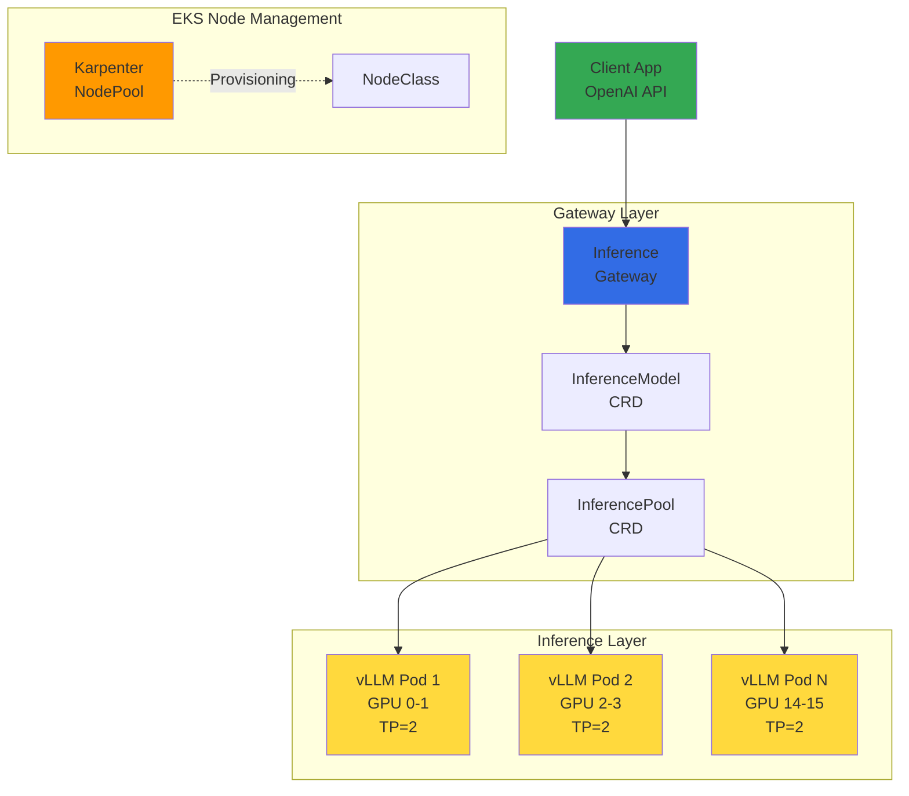
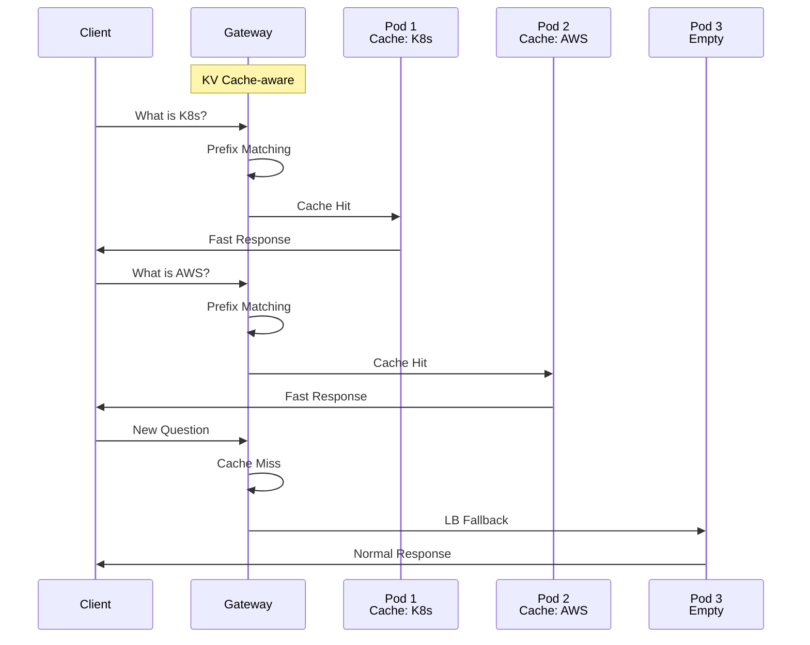
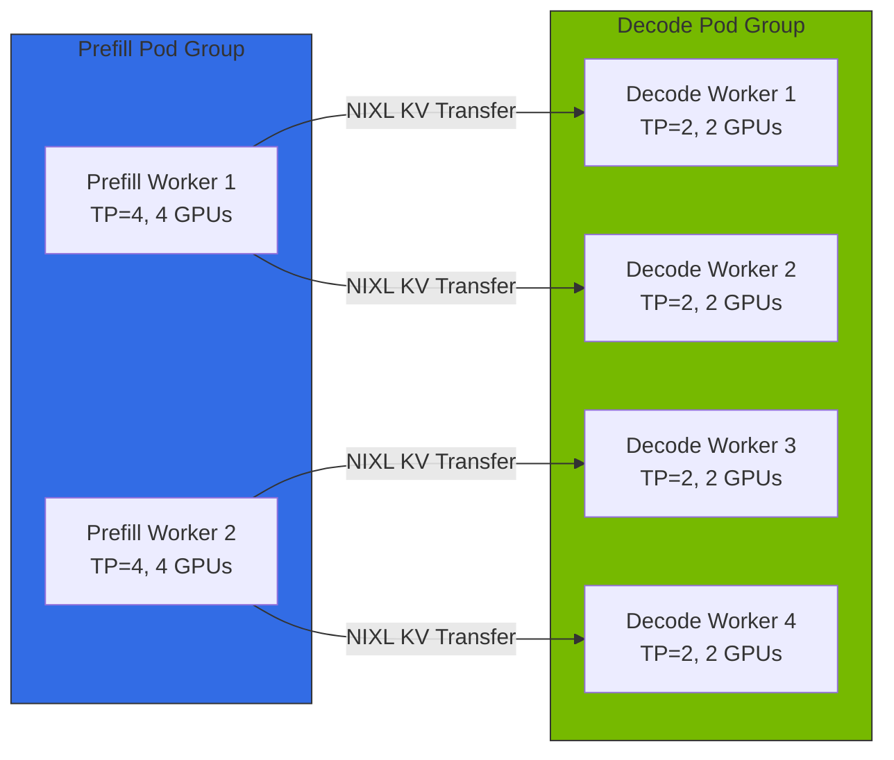
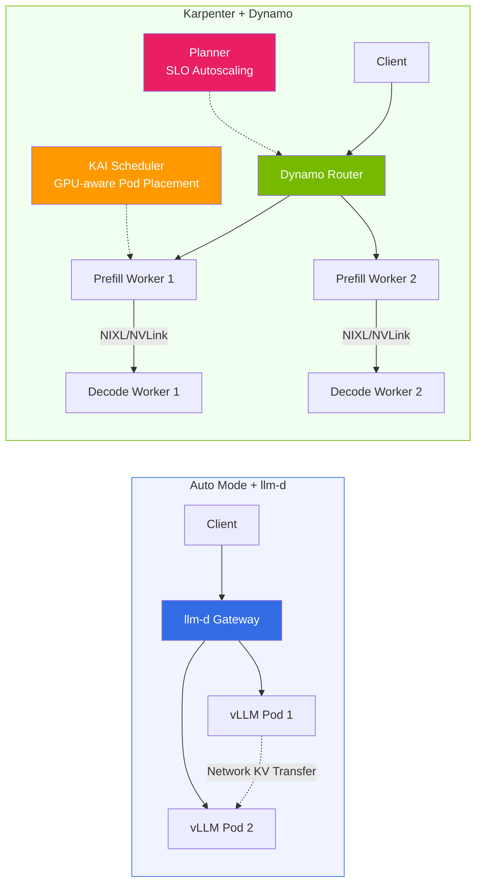

import { ComparisonTable, SpecificationTable } from '@site/src/components/tables';
import {
  WellLitPathTable,
  VllmComparisonTable,
  Qwen3SpecsTable,
  P5InstanceTable,
  P5eInstanceTable,
  GatewayCRDTable,
  DefaultDeploymentTable,
  KVCacheEffectsTable,
  MonitoringMetricsTable,
  ModelLoadingTable,
  CostOptimizationTable
} from '@site/src/components/LlmdTables';

# llm-d Based EKS Distributed Inference Guide

> **Current version**: llm-d v0.5+ (2026.03)

> **Written**: 2026-02-10 | **Updated**: 2026-04-06 | **Reading time**: ~8 min

## Overview

llm-d is an Apache 2.0-licensed Kubernetes-native distributed inference stack led by Red Hat. It combines the vLLM inference engine, Envoy-based Inference Gateway, and Kubernetes Gateway API to provide intelligent inference routing for large language models.

While existing vLLM deployments rely on simple Round-Robin load balancing, llm-d delivers intelligent routing that is KV Cache state-aware, forwarding requests with identical prefixes to Pods that already hold the corresponding KV Cache. This significantly reduces Time To First Token (TTFT) and saves GPU computation.

:::tip Production Deployment Guide
For llm-d EKS deployment YAML, helmfile commands, and cluster creation, see the [Custom Model Deployment Guide](../reference-architecture/custom-model-deployment.md).
:::

:::warning llm-d Inference Gateway =/= General-purpose Gateway API Implementation
llm-d's Envoy-based Inference Gateway is a **special-purpose gateway designed exclusively for LLM inference requests**.

- **llm-d Gateway**: InferenceModel/InferencePool CRD-based, KV Cache-aware routing, inference traffic only
- **General Gateway API**: HTTPRoute/GRPCRoute-based, TLS/auth/Rate Limiting, cluster-wide traffic management

In production, the recommended architecture has a general Gateway API implementation handling the cluster entry point, with llm-d optimizing AI inference traffic underneath.
:::

### llm-d's 3 Well-Lit Paths

llm-d provides three validated deployment paths.

<WellLitPathTable />

---

## Architecture

llm-d's Intelligent Inference Scheduling architecture is composed as follows.



### llm-d vs Traditional vLLM Deployment Comparison

<VllmComparisonTable />

### Gateway API CRD

llm-d uses Kubernetes Gateway API and Inference Extension CRDs.

<GatewayCRDTable />

### Default Deployment Configuration

<DefaultDeploymentTable />

### Qwen3-32B Model Selection Rationale

<Qwen3SpecsTable />

:::info Qwen3-32B Selection Background
Qwen3-32B is llm-d's official default model and is Apache 2.0-licensed for free commercial use. Requiring ~65GB VRAM at BF16, it can be stably served with TP=2 (2x GPU) on H100 80GB.
:::

---

## KV Cache-aware Routing

The core differentiator of llm-d is intelligent routing that is aware of KV Cache state.



### Routing Operation Principles

1. **Request reception**: Client sends inference request to Inference Gateway
2. **Prefix analysis**: Gateway hashes the request's prompt prefix for identification
3. **Cache lookup**: Checks KV Cache state of each vLLM Pod to find Pods holding the prefix
4. **Intelligent routing**: Routes to matching Pod on cache hit; load-balanced on miss
5. **Response return**: vLLM returns inference results to client via Gateway

### KV Cache-aware Routing Effects

<KVCacheEffectsTable />

:::tip Maximizing Cache Hit Rate
KV Cache-aware routing is most effective in applications using identical system prompts. For example, in RAG pipelines that repeatedly reference the same context documents, reusing the prefix's KV Cache can significantly reduce TTFT.
:::

---

## EKS Auto Mode Integration

### Auto Mode Advantages and Limitations

**Advantages:**

- **Automatic GPU driver management**: AWS automatically installs and updates NVIDIA GPU drivers
- **Automatic NodeClass selection**: Using `default` NodeClass lets Auto Mode auto-select optimal AMI and driver version
- **Operational simplification**: Eliminates driver installation, CUDA version management, and driver compatibility verification burden
- **GPU Operator installable**: Only Device Plugin disabled via label; DCGM/NFD/GFD operate normally

**Limitations:**

- **MIG/Time-Slicing not available**: Auto Mode's NodeClass is AWS-managed (read-only), so GPU partitioning configuration is not possible
- **Custom AMI not available**: Cannot pin specific CUDA versions or drivers

### Auto Mode vs Karpenter + GPU Operator Comparison

| Criteria | EKS Auto Mode | Auto Mode + GPU Operator | Karpenter + GPU Operator |
|------|:---:|:---:|:---:|
| **Suitable model size** | 70B+ (full GPU utilization) | 70B+ (full GPU utilization) | 7B-30B (MIG partitioning possible) |
| **GPU driver management** | AWS auto-managed | AWS auto-managed | AMI pre-installed |
| **Device Plugin** | AWS managed | Disabled via label | GPU Operator managed |
| **DCGM monitoring** | Basic metrics only | DCGM Exporter detailed metrics | DCGM Exporter detailed metrics |
| **MIG / Time-Slicing** | Not available | Not available | Available |
| **KAI Scheduler** | Not available | Available (ClusterPolicy dependency) | Available |
| **Operational complexity** | Low | Medium | Medium |

For per-model-size detailed cost analysis, see [EKS GPU Node Strategy](./eks-gpu-node-strategy.md).

### GPU Instance Specifications

<P5InstanceTable />

<P5eInstanceTable />

:::tip Instance Selection Guide
- **p5e.48xlarge (H200)**: 100B+ parameter models, maximum memory utilization
- **p5.48xlarge (H100)**: 70B+ parameter models, highest performance
- **g6e family (L40S)**: 13B-70B models, cost-efficient inference
:::

:::danger llm-d + DRA Node Constraints
When llm-d ModelService requests GPUs via **DRA (ResourceClaim)**, node provisioning does not work on Karpenter and EKS Auto Mode. Since DRA's ResourceSlice is issued by the DRA Driver after node creation, Karpenter cannot perform the simulation needed before node creation.

- **DRA-based deployment**: Must use **Managed Node Group + Cluster Autoscaler** for GPU node management
- **Non-DRA deployment** (`nvidia.com/gpu` Device Plugin method): Works normally on Auto Mode and Karpenter
- **P6e-GB200 UltraServer**: DRA is required (Device Plugin not supported)

Details: [EKS GPU Node Strategy — MNG Strategy for DRA Workloads](./eks-gpu-node-strategy.md#56-mng-strategy-for-dra-workloads)
:::

---

## llm-d v0.5+ Key Features

| Feature | Description | Status |
|---------|-------------|:------:|
| **Prefill/Decode Disaggregation** | Separate Prefill and Decode into distinct Pod groups, maximizing throughput for large batches and long contexts | GA |
| **Expert Parallelism** | Distributed serving of MoE model (Mixtral, DeepSeek) Experts across multiple nodes | GA |
| **LoRA Adapter Hot-swap** | Dynamically load/unload multiple LoRA adapters on a single base model | GA |
| **Multi-model Serving** | Simultaneously serve multiple models via InferenceModel CRD in a single cluster | GA |
| **Gateway API Inference Extension** | K8s-native routing based on InferencePool/InferenceModel CRDs | GA |

### Disaggregated Serving Concept

Disaggregated Serving separates the two phases of LLM inference for independent optimization:



| Phase | Characteristics | Optimization Direction |
|-------|----------------|----------------------|
| **Prefill** | Processes entire prompt at once (compute-bound) | GPU computing focused, high TP |
| **Decode** | Autoregressive token-by-token generation (memory-bound) | GPU memory focused, low TP |

**NIXL (NVIDIA Inference Xfer Library)**: Common KV transfer engine used by most projects including Dynamo, llm-d, production-stack, and aibrix. Transfers KV Cache at ultra-high speed via direct GPU communication (NVLink/RDMA).

### Disaggregated Serving on EKS Auto Mode

Since MIG partitioning is not possible on Auto Mode, **Prefill/Decode roles are separated at the instance (node) level**.

```
Prefill NodePool (compute-heavy):
  p5.48xlarge x N → Prefill Pod (each TP=4, 4 GPUs)

Decode NodePool (memory-heavy):
  p5.48xlarge x N → Decode Pod (each TP=2, 2 GPUs x 4 Pods/node)
```

| Item | Auto Mode (Node Separation) | Karpenter + GPU Operator (MIG Separation) |
|------|---------------------------|------------------------------------------|
| **Separation Unit** | Instance (node) | GPU unit (MIG partition) |
| **GPU Utilization** | Optimizable with Decode Pod TP=2 x 4/node | High utilization with intra-GPU MIG partitioning |
| **Operational Complexity** | Low | Medium (GPU Operator + MIG configuration) |
| **Scaling** | Easy independent Prefill/Decode scaling | Node-level MIG reconfiguration causes disruption |

:::tip Minimizing GPU Idle
**Recommended strategy**: Validate on Auto Mode first, then transition to Karpenter + GPU Operator + MIG when cost optimization is needed.
:::

---

## llm-d vs NVIDIA Dynamo

llm-d and NVIDIA Dynamo both provide LLM inference routing/scheduling but with different approaches. For detailed comparison, see [NVIDIA GPU Stack — llm-d vs Dynamo Selection Guide](./nvidia-gpu-stack.md#llm-d-selection-guide).

| Item | llm-d | NVIDIA Dynamo |
|------|-------|---------------|
| **Lead** | Red Hat (Apache 2.0) | NVIDIA (Apache 2.0) |
| **Architecture** | Aggregated + Disaggregated | Aggregated + Disaggregated (equal support) |
| **KV Cache Transfer** | NIXL (network supported) | NIXL (NVLink/RDMA ultra-fast) |
| **KV Cache Indexing** | Prefix-aware routing | Flash Indexer (radix tree-based) |
| **Routing** | Gateway API + Envoy EPP | Dynamo Router + custom EPP (Gateway API integration) |
| **Pod Scheduling** | K8s default scheduler | KAI Scheduler (GPU-aware Pod placement) |
| **Autoscaling** | HPA/KEDA integration | Planner (SLO-based: profiling → autoscale) + KEDA/HPA |
| **GPU Operator Required** | Optional (Auto Mode compatible) | Required (KAI Scheduler's ClusterPolicy dependency) |
| **Complexity** | Low | High |
| **Strengths** | K8s native, lightweight, fast adoption | Flash Indexer, KAI Scheduler, Planner SLO autoscaling |

:::tip Selection Guide
- **EKS Auto Mode + quick start**: llm-d (GPU Operator optional)
- **Small-medium scale (16 GPUs or less)**: llm-d
- **Large scale (16+ GPUs), maximum throughput**: Dynamo (Flash Indexer + Planner)
- **Long context (128K+)**: Dynamo (3-tier KV Cache: GPU→CPU→SSD)
- **K8s Gateway API standard compliance**: llm-d

Starting with llm-d and transitioning to Dynamo as scale grows is practical. Dynamo 1.0 can integrate llm-d as an internal component, making it more of a superset than a complete alternative.
:::

### Migration Path



**Phased transition path:**

| Phase | Configuration | Suitable For |
|-------|--------------|-------------|
| **Phase 1** | Auto Mode + llm-d | PoC, dev environments, 16 GPUs or less |
| **Phase 1.5** | Auto Mode + GPU Operator + llm-d | Enhanced monitoring/scheduling |
| **Phase 2a** | Karpenter + llm-d Disaggregated | Mid-scale production, MIG utilization |
| **Phase 2b** | MNG + DRA + llm-d | P6e-GB200, DRA-required environments |
| **Phase 3** | Karpenter + Dynamo | Large scale (16+ GPUs), maximum performance |

:::caution Transition Notes
Auto Mode and self-managed Karpenter can coexist in the same cluster. In Phase 1.5, add the `nvidia.com/gpu.deploy.device-plugin: "false"` label to Auto Mode NodePool to prevent Device Plugin conflicts.
:::

---

## Monitoring

### Key Monitoring Metrics

<MonitoringMetricsTable />

### Model Loading Time

<ModelLoadingTable />

### Cost Optimization

<CostOptimizationTable />

:::warning Cost Caution
p5.48xlarge costs approximately $98.32/hr (us-west-2 On-Demand). Running 2 instances costs **~$141,580/month**. Always clean up resources after testing.
:::

---

## EKS Auto Mode GPU Instance Support Status (Verified 2026.04)

### Instance Support Matrix

| Instance Type | GPU | VRAM (Total) | Auto Mode Support | Verification Status |
|-------------|-----|-----------|---------------|-------------------|
| g5.xlarge~48xlarge | A10G | 24~192GB | Normal | Provisioning confirmed |
| g6.xlarge~48xlarge | L4 | 24~192GB | Normal | Provisioning confirmed |
| g6e.xlarge~48xlarge | L40S | 48~384GB | Normal | Provisioning confirmed |
| p4d.24xlarge | A100 40GB x 8 | 320GB | Normal | Dry-run confirmed |
| p5.48xlarge | H100 80GB x 8 | 640GB | Normal | **Spot provisioning confirmed** (us-east-2) |
| p5en.48xlarge | H200 141GB x 8 | 1,128GB | Limited | Dry-run passes, offering matching may fail |
| **p6-b200.48xlarge** | **B200 192GB x 8** | **1,536GB** | **Not supported** | **`NoCompatibleInstanceTypes` error** |

:::warning p6 Instance Not Supported
As of April 2026, EKS Auto Mode's managed Karpenter **cannot provision p6-b200.48xlarge**. Use EKS Standard Mode + Karpenter if p6 instances are needed.
:::

### Per-Region GPU Capacity Availability

| Region | p5.48xlarge On-Demand | p5.48xlarge Spot | Spot Price |
|--------|---------------------|-----------------|-----------|
| ap-northeast-2 (Seoul) | InsufficientCapacity | Unconfirmed | -- |
| **us-east-2 (Ohio)** | Availability varies | **Successfully acquired** | **$13-15/hr** |

**Spot Price Comparison (us-east-2, 2026.04)**:

| Instance | On-Demand | Spot (Lowest) | VRAM | Savings |
|---------|-----------|------------|------|---------|
| p5.48xlarge | $55/hr | $12.5/hr | 640GB | 77% |
| p5en.48xlarge | ~$76/hr | $12.1/hr | 1,128GB | 84% |
| p6-b200.48xlarge | $114/hr | $11.4/hr | 1,536GB | 90% |

### GPU Quota Notes

| Quota Name | Applicable Instances | Default |
|-----------|---------------------|---------|
| Running On-Demand P instances | p4d, p4de, p5, p5en | 384 |
| Running On-Demand G and VT instances | g5, g6, g6e | **64** |

:::caution G Instance Quota Trap
When setting `instance-category: [g, p]` together in GPU NodePool, Karpenter may try G-type instances first. To use P-type only, explicitly specify `instance-category: [p]`.
:::

---

## Next Steps

- [EKS GPU Node Strategy](./eks-gpu-node-strategy.md) -- Auto Mode vs Karpenter vs Hybrid Node, per-model-size cost analysis
- [vLLM Model Serving and Performance Optimization](./vllm-model-serving.md) -- vLLM basics and deployment
- [MoE Model Serving Guide](./moe-model-serving.md) -- Mixture of Experts model serving
- [GPU Resource Management](./gpu-resource-management.md) -- GPU cluster resource management

---

## References

- [llm-d GitHub](https://github.com/llm-d/llm-d)
- [llm-d Deployer (Helm Charts)](https://github.com/llm-d/llm-d-deployer)
- [EKS Auto Mode Documentation](https://docs.aws.amazon.com/eks/latest/userguide/automode.html)
- [Gateway API Inference Extension](https://gateway-api.sigs.k8s.io/geps/gep-3567/)
- [vLLM Official Documentation](https://docs.vllm.ai/)
- [Qwen3-32B HuggingFace](https://huggingface.co/Qwen/Qwen3-32B)
