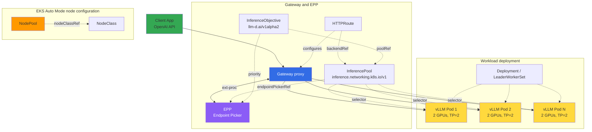
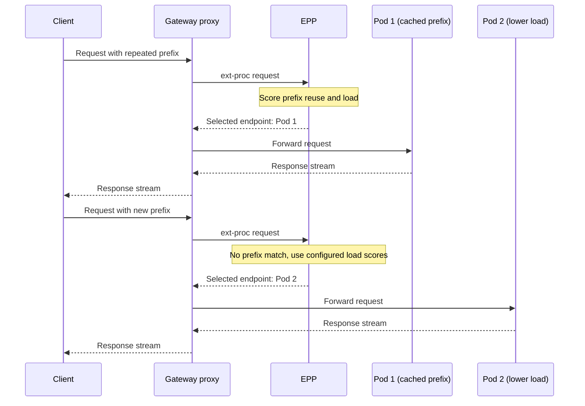
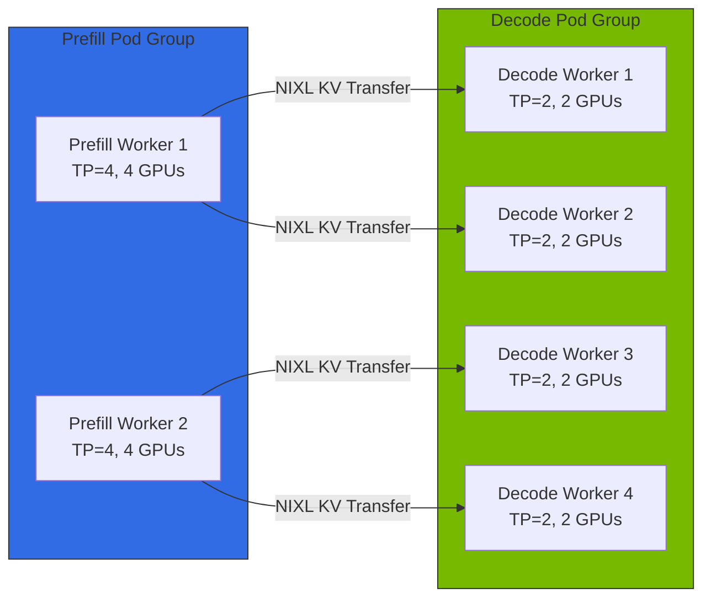
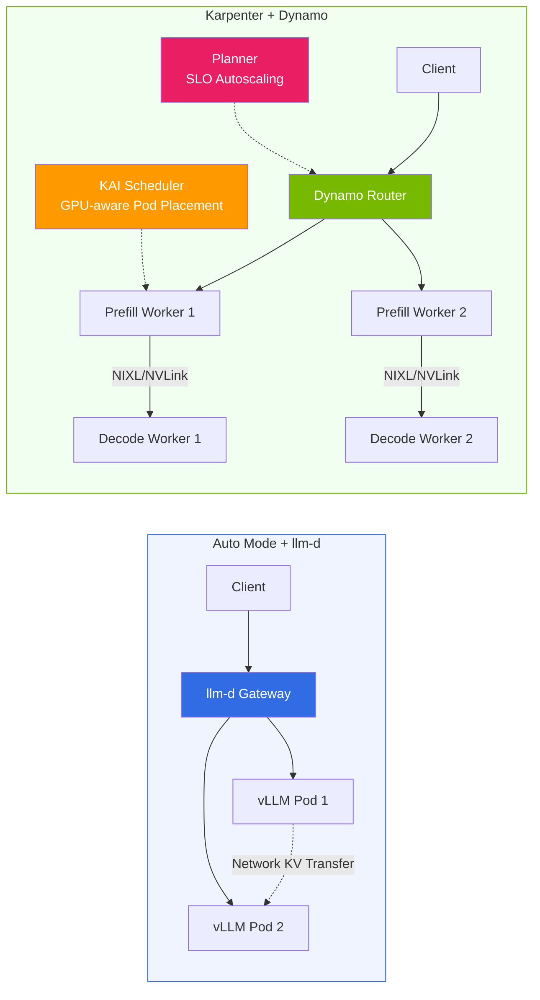

import { ComparisonTable, SpecificationTable } from '@site/src/components/tables';
import {
  WellLitPathTable,
  VllmComparisonTable,
  Qwen3SpecsTable,
  P5InstanceTable,
  P5eInstanceTable,
  GatewayCRDTable,
  KVCacheEffectsTable,
  MonitoringMetricsTable,
  ModelLoadingTable,
  CostOptimizationTable
} from '@site/src/components/LlmdTables';

> **Reviewed baseline**: [llm-d v0.8.1](https://github.com/llm-d/llm-d/releases/tag/v0.8.1) (released 2026-06-26; documentation reviewed 2026-09-18). Components: llm-d Router v0.9.0, GIE v1.5.0, Gateway API v1.5.1. Joining CNCF Sandbox in March 2026 is a separate milestone from this release.

## Overview

llm-d is an Apache 2.0-licensed Kubernetes-native distributed inference stack led by Red Hat. It combines the vLLM inference engine, an Inference Gateway connecting a compatible proxy to an EPP, and Kubernetes Gateway API to provide intelligent inference routing for large language models.

While existing vLLM deployments rely on simple Round-Robin load balancing, llm-d delivers intelligent routing that is KV Cache state-aware, forwarding requests with identical prefixes to Pods that already hold the corresponding KV Cache. This significantly reduces Time To First Token (TTFT) and saves GPU computation.

:::tip Production Deployment Guide
For llm-d EKS deployment design and cluster preparation, see the [Custom Model Deployment Guide](../../reference-architecture/model-lifecycle/custom-model-deployment.md).
:::

:::info Choosing a Gateway topology
llm-d v0.8.1 [Gateway Mode](https://github.com/llm-d/llm-d/blob/v0.8.1/docs/architecture/core/router/proxy.md) integrates an existing Gateway API implementation with an EPP (Endpoint Picker). **One compatible Gateway can route to both traditional Services and InferencePools.** The EPP selects endpoints; it is not a second traffic proxy.

- **Single Gateway**: The selected implementation and version must support `HTTPRoute → InferencePool` and EPP external processing integration. Check its policies and configuration for TLS, authentication, and rate limiting.
- **Separate edge and inference Gateways**: Choose this when retaining an existing ingress or separating security boundaries, ownership, or scaling. Account for the extra proxy hop, latency, cost, and consistent timeout, retry, streaming, authentication-header, and observability handling.

Two Gateways are not a universal llm-d deployment requirement. The diagram below shows a single Gateway configuration.
:::

### llm-d's 3 Well-Lit Paths

The table summarizes three representative patterns. The complete v0.8.1 [Well-Lit Paths](https://github.com/llm-d/llm-d/blob/v0.8.1/docs/well-lit-paths/README.md) are organized into Foundations and Workloads; [Optimized Baseline](https://github.com/llm-d/llm-d/blob/v0.8.1/guides/optimized-baseline/README.md) is the current starting point for Intelligent Inference Scheduling.

<WellLitPathTable />

---

## Architecture

llm-d's Intelligent Inference Scheduling architecture is composed as follows.

Solid lines show requests/responses and ext-proc calls; dotted lines show configuration references and Pod management. GPU counts and TP are illustrative workload values. InferencePool selects existing Pods and references an EPP; images, GPU requests, and replica counts belong to workloads such as Deployment/LeaderWorkerSet.


```mermaid
flowchart TB
    CLIENT[Client App<br/>OpenAI API]
    subgraph Routing["Gateway and EPP"]
        GW[Gateway proxy]
        EPP[EPP<br/>Endpoint Picker]
        HR[HTTPRoute]
        IP[InferencePool<br/>inference.networking.k8s.io/v1]
        IO[InferenceObjective<br/>llm-d.ai/v1alpha2]
    end
    subgraph Workload["Workload deployment"]
        DEP[Deployment / LeaderWorkerSet]
        V1[vLLM Pod 1<br/>2 GPUs, TP=2]
        V2[vLLM Pod 2<br/>2 GPUs, TP=2]
        VN[vLLM Pod N<br/>2 GPUs, TP=2]
    end
    subgraph Nodes["EKS Auto Mode node configuration"]
        NP[NodePool]
        NC[NodeClass]
    end
    CLIENT --> GW
    GW <-->|ext-proc| EPP
    GW --> V1
    GW --> V2
    GW --> VN
    HR -.->|configures| GW
    HR -.->|backendRef| IP
    IP -.->|endpointPickerRef| EPP
    IP -.->|selector| V1
    IP -.->|selector| V2
    IP -.->|selector| VN
    IO -.->|poolRef| IP
    IO -.->|priority| EPP
    DEP -.-> V1
    DEP -.-> V2
    DEP -.-> VN
    NP -.->|nodeClassRef| NC
    style CLIENT fill:#34a853
    style GW fill:#326ce5,color:#fff
    style EPP fill:#8b5cf6,color:#fff
    style V1 fill:#ffd93d
    style V2 fill:#ffd93d
    style VN fill:#ffd93d
    style NP fill:#ff9900
```

### llm-d vs Traditional vLLM Deployment Comparison

<VllmComparisonTable />

### Gateway API CRD

This guide uses the following Gateway Mode resources. Gateway API/GIE CRDs and the optional llm-d InferenceObjective CRD have different owners and installation packages. Baseline schemas: [llm-d v0.8.1](https://github.com/llm-d/llm-d/releases/tag/v0.8.1), [InferencePool v1](https://github.com/kubernetes-sigs/gateway-api-inference-extension/blob/v1.5.0/config/crd/bases/inference.networking.k8s.io_inferencepools.yaml), [InferenceObjective v1alpha2](https://github.com/llm-d/llm-d-router/blob/v0.9.0/config/crd/bases/llm-d.ai_inferenceobjectives.yaml), [HTTPRoute v1](https://github.com/kubernetes-sigs/gateway-api/blob/v1.5.1/config/crd/standard/gateway.networking.k8s.io_httproutes.yaml).

<GatewayCRDTable />

### Default Deployment Configuration

This configuration follows the NVIDIA GPU example in [Optimized Baseline v0.8.1](https://github.com/llm-d/llm-d/blob/v0.8.1/guides/optimized-baseline/README.md). These are recipe values, not EKS-validated defaults or universal defaults for every deployment path. This release uses a router Helm chart and model-server Kustomize manifests.

| Setting | Example value | Defined in |
|---------|---------------|------------|
| Model | `Qwen/Qwen3-32B` | Model-server arguments |
| vLLM image | `vllm/vllm-openai:v0.23.0` | Workload container image, per the release component table |
| Replicas | 8 | Workload replica configuration |
| Tensor Parallelism / GPU | TP=2 / 2 GPUs per replica | Model-server arguments and Pod GPU requests |
| Total GPUs | 16 | 8 replicas × 2 GPUs; node placement is a separate decision |

InferencePool selects this workload's Pod labels. InferenceObjective expresses request policy and does not replace these deployment settings.

### Qwen3-32B Model Selection Rationale

<Qwen3SpecsTable />

:::info Qwen3-32B Selection Background
Qwen3-32B is the default model in the Optimized Baseline example above and is Apache 2.0-licensed for free commercial use. Requiring ~65GB VRAM at BF16, it can be stably served with TP=2 (2x GPU) on H100 80GB.
:::

---

## KV Cache-aware Routing

The core differentiator of llm-d is intelligent routing that is aware of KV Cache state.

This flow is a simplified example of configured EPP plugins. A Pod with cached prefixes may still lose selection because of load.


```mermaid
sequenceDiagram
    participant C as Client
    participant GW as Gateway proxy
    participant E as EPP
    participant P1 as Pod 1 (cached prefix)
    participant P2 as Pod 2 (lower load)
    C->>GW: Request with repeated prefix
    GW->>E: ext-proc request
    Note over E: Score prefix reuse and load
    E-->>GW: Selected endpoint: Pod 1
    GW->>P1: Forward request
    P1-->>GW: Response stream
    GW-->>C: Response stream
    C->>GW: Request with new prefix
    GW->>E: ext-proc request
    Note over E: No prefix match, use configured load scores
    E-->>GW: Selected endpoint: Pod 2
    GW->>P2: Forward request
    P2-->>GW: Response stream
    GW-->>C: Response stream
```

### Routing Operation Principles

1. **Request reception**: Client sends inference request to Inference Gateway
2. **Prefix analysis**: Gateway calls the EPP through ext-proc; configured EPP plugins analyze the prefix
3. **Cache lookup**: EPP evaluates candidate Pods using the configured cache index and metrics
4. **Intelligent routing**: EPP combines cache and load scores to select an endpoint; Gateway proxies to that Pod
5. **Response return**: vLLM returns inference results to client via Gateway

### KV Cache-aware Routing Effects

<KVCacheEffectsTable />

:::tip Maximizing Cache Hit Rate
KV Cache-aware routing is most effective in applications using identical system prompts. For example, in RAG pipelines that repeatedly reference the same context documents, reusing the prefix's KV Cache can significantly reduce TTFT.
:::

---

## EKS Auto Mode Integration

### Auto Mode Advantages and Limitations

**Advantages:**

- **Automatic GPU driver management**: AWS automatically installs and updates NVIDIA GPU drivers
- **Automatic NodeClass selection**: Using `default` NodeClass lets Auto Mode auto-select optimal AMI and driver version
- **Operational simplification**: Eliminates driver installation, CUDA version management, and driver compatibility verification burden
- **GPU Operator installable**: Only Device Plugin disabled via label; DCGM/NFD/GFD operate normally

**Limitations:**

- **MIG/Time-Slicing restrictions**: Users cannot change the NVIDIA device plugin configuration managed by Auto Mode. This does not mean that NodeClass itself is read-only.
- **Custom AMI not available**: Cannot pin specific CUDA versions or drivers

### Auto Mode vs Karpenter + GPU Operator Comparison

Auto Mode is suitable for large model serving without GPU driver management burden, while Karpenter is advantageous for workloads requiring advanced GPU features like MIG/Time-Slicing.

**Detailed comparison and cost analysis**: See [EKS GPU Node Strategy — Node Type Comparison](../gpu-infrastructure/eks-gpu-node-strategy.md#2-node-type-comparison)

### GPU Instance Specifications

<P5InstanceTable />

<P5eInstanceTable />

:::tip Instance Selection Guide
- **p5e.48xlarge (H200)**: 100B+ parameter models, maximum memory utilization
- **p5.48xlarge (H100)**: 70B+ parameter models, highest performance
- **g6e family (L40S)**: 13B-70B models, cost-efficient inference
:::

:::danger llm-d + DRA Karpenter version constraints
When llm-d ModelService requests GPUs via DRA (ResourceClaim), support depends on the Karpenter version and deployment method.
- **Self-managed Karpenter v1.14.0+**: DRA is supported (AWS Provider v1.14.0 includes the core v1.14.0 DRA allocator, with consumable capacity & partitionable devices). Versions ≤ v1.13 skip Pods with `spec.resourceClaims`.
- **EKS Auto Mode**: Not supported today — it uses an AWS-managed internal Karpenter that users cannot bump to v1.14+. With Auto Mode, **Managed Node Group + Cluster Autoscaler** is the recommended approach.

Details: [EKS GPU Node Strategy — MNG Hybrid for DRA Workloads](../gpu-infrastructure/eks-gpu-node-strategy.md#53-mng-hybrid-for-dra-workloads)
:::

---

## llm-d v0.8.1 Key Features {#llm-d-v05-key-features}

Status follows the [v0.8.1 release](https://github.com/llm-d/llm-d/releases/tag/v0.8.1) and documentation at that tag. Deployment patterns, implemented features, and API stability describe different things.

| Feature | Description | Status at the reviewed baseline |
|---------|-------------|---------------------------------|
| **Prefill/Decode Disaggregation** | Deploy separate Prefill and Decode Pod groups with KV transfer | [Well-lit path](https://github.com/llm-d/llm-d/blob/v0.8.1/docs/well-lit-paths/foundations/pd-disaggregation.md) |
| **Expert Parallelism (Wide EP)** | Distribute experts for supported MoE model and hardware combinations | [Well-lit path](https://github.com/llm-d/llm-d/blob/v0.8.1/docs/well-lit-paths/foundations/wide-expert-parallelism.md) |
| **LoRA-aware scheduling** | `lora-affinity-scorer` considers loaded adapters and loading capacity; dynamic loading depends on model-server configuration | [Implemented plugin](https://github.com/llm-d/llm-d-router/blob/v0.9.0/pkg/epp/framework/plugins/scheduling/scorer/loraaffinity/README.md), not a blanket GA hot-swap guarantee |
| **Multi-model routing** | HTTPRoute paths, headers, and weights select per-model InferencePools; routing on the JSON `model` body requires separate implementation/configuration | [Gateway Mode pattern](https://github.com/llm-d/llm-d/blob/v0.8.1/docs/architecture/core/router/proxy.md); distinguish the IPP proposal from default behavior |
| **Gateway API Inference Extension** | InferencePool `inference.networking.k8s.io/v1`; optional request policy uses llm-d InferenceObjective `llm-d.ai/v1alpha2` | GIE v1 API / llm-d alpha API |
| **Flow control** | Integer InferenceObjective `priority` orders request queues | Graduated to production in the release; the [configuration guide](https://github.com/llm-d/llm-d/blob/v0.8.1/docs/architecture/core/router/epp/flow-control.md) requires explicitly enabling the `flowControl` feature gate |

`InferenceModel` is the historical name of the earlier policy API. These schemas do not define model images, GPU allocation, or replica counts, and `priority` does not reserve GPUs.
### Disaggregated Serving Concept

Disaggregated Serving separates the two phases of LLM inference for independent optimization:


```mermaid
flowchart LR
    subgraph Prefill["Prefill Pod Group"]
        P1[Prefill Worker 1<br/>TP=4, 4 GPUs]
        P2[Prefill Worker 2<br/>TP=4, 4 GPUs]
    end

    subgraph Decode["Decode Pod Group"]
        D1[Decode Worker 1<br/>TP=2, 2 GPUs]
        D2[Decode Worker 2<br/>TP=2, 2 GPUs]
        D3[Decode Worker 3<br/>TP=2, 2 GPUs]
        D4[Decode Worker 4<br/>TP=2, 2 GPUs]
    end

    P1 -->|NIXL KV Transfer| D1
    P1 -->|NIXL KV Transfer| D2
    P2 -->|NIXL KV Transfer| D3
    P2 -->|NIXL KV Transfer| D4

    style Prefill fill:#326ce5,stroke:#333
    style Decode fill:#76b900,stroke:#333
```

| Phase | Characteristics | Optimization Direction |
|-------|----------------|----------------------|
| **Prefill** | Processes entire prompt at once (compute-bound) | GPU computing focused, high TP |
| **Decode** | Autoregressive token-by-token generation (memory-bound) | GPU memory focused, low TP |

**NIXL (NVIDIA Inference Xfer Library)**: Common KV transfer engine used by most projects including Dynamo, llm-d, production-stack, and aibrix. Transfers KV Cache at ultra-high speed via direct GPU communication (NVLink/RDMA).

### Disaggregated Serving on EKS Auto Mode

Allocate GPUs through Pod `nvidia.com/gpu` requests, as in the [AWS GPU workload example](https://docs.aws.amazon.com/eks/latest/userguide/auto-accelerated.html). Auto Mode [does not support MIG](https://docs.aws.amazon.com/eks/latest/userguide/device-management-nvidia-mig.html), but this does not require Prefill and Decode to run on different nodes. Pods can request different whole GPUs on the same multi-GPU node; placement depends on available GPUs, memory, and Pod scheduling constraints.

Separate NodePools are a design option when hardware or scaling policies need isolation. The counts below are illustrative, not measured performance results.

```text
Prefill NodePool: TP=4, nvidia.com/gpu: 4 per Pod
Decode NodePool: TP=2, nvidia.com/gpu: 2 per Pod
```

Configure replicas, GPU requests, and nodeSelector/affinity in the model-server workload; use InferencePool to select those Pods. InferenceObjective request priority does not replace node placement or GPU isolation.
---

## llm-d vs NVIDIA Dynamo

llm-d and NVIDIA Dynamo both provide LLM inference routing/scheduling but with different approaches. For detailed comparison, see [NVIDIA GPU Stack — llm-d vs Dynamo Selection Guide](../gpu-infrastructure/nvidia-gpu-stack.md#llm-d-selection-guide).

| Item | llm-d | NVIDIA Dynamo |
|------|-------|---------------|
| **Lead** | Red Hat (Apache 2.0) | NVIDIA (Apache 2.0) |
| **Architecture** | Aggregated + Disaggregated | Aggregated + Disaggregated (equal support) |
| **KV Cache Transfer** | NIXL (network supported) | NIXL (NVLink/RDMA ultra-fast) |
| **KV Cache Indexing** | Prefix-aware routing | Flash Indexer (radix tree-based) |
| **Routing** | Gateway API + Envoy EPP | Dynamo Router + custom EPP (Gateway API integration) |
| **Pod Scheduling** | K8s default scheduler | KAI Scheduler (GPU-aware Pod placement) |
| **Autoscaling** | HPA/KEDA integration | Planner (SLO-based: profiling → autoscale) + KEDA/HPA |
| **GPU Operator Required** | Optional (Auto Mode compatible) | Required (KAI Scheduler's ClusterPolicy dependency) |
| **Complexity** | Low | High |
| **Strengths** | K8s native, lightweight, fast adoption | Flash Indexer, KAI Scheduler, Planner SLO autoscaling |

:::tip Selection Guide
- **EKS Auto Mode + quick start**: llm-d (GPU Operator optional)
- **Small-medium scale (16 GPUs or less)**: llm-d
- **Large scale (16+ GPUs), maximum throughput**: Dynamo (Flash Indexer + Planner)
- **Long context (128K+)**: Dynamo (3-tier KV Cache: GPU→CPU→SSD)
- **K8s Gateway API standard compliance**: llm-d

Starting with llm-d and transitioning to Dynamo as scale grows is practical. Dynamo 1.0 can integrate llm-d as an internal component, making it more of a superset than a complete alternative.
:::

### Migration Path


```mermaid
flowchart LR
    subgraph AutoMode["Auto Mode + llm-d"]
        direction TB
        C1[Client] --> GW1[llm-d Gateway]
        GW1 --> VP1[vLLM Pod 1]
        GW1 --> VP2[vLLM Pod 2]
        VP1 -.->|Network KV Transfer| VP2
    end

    subgraph KarpenterDynamo["Karpenter + Dynamo"]
        direction TB
        C2[Client] --> DR[Dynamo Router]
        DR --> PW1[Prefill Worker 1]
        DR --> PW2[Prefill Worker 2]
        PW1 -->|NIXL/NVLink| DW1[Decode Worker 1]
        PW2 -->|NIXL/NVLink| DW2[Decode Worker 2]
        KAI[KAI Scheduler<br/>GPU-aware Pod Placement] -.-> PW1
        PLAN[Planner<br/>SLO Autoscaling] -.-> DR
    end

    style AutoMode fill:#f0f4ff,stroke:#326ce5
    style KarpenterDynamo fill:#f0fff0,stroke:#76b900
    style GW1 fill:#326ce5,color:#fff
    style DR fill:#76b900,color:#fff
    style KAI fill:#ff9900,color:#fff
    style PLAN fill:#e91e63,color:#fff
```

**Phased transition path:**

| Phase | Configuration | Suitable For |
|-------|--------------|-------------|
| **Phase 1** | Auto Mode + llm-d | PoC, dev environments, 16 GPUs or less |
| **Phase 1.5** | Auto Mode + GPU Operator + llm-d | Enhanced monitoring/scheduling |
| **Phase 2a** | Karpenter + llm-d Disaggregated | Mid-scale production, MIG utilization |
| **Phase 2b** | MNG + DRA + llm-d | P6e-GB200, DRA-required environments |
| **Phase 3** | Karpenter + Dynamo | Large scale (16+ GPUs), maximum performance |

:::caution Transition Notes
Auto Mode and self-managed Karpenter can coexist in the same cluster. In Phase 1.5, add the `nvidia.com/gpu.deploy.device-plugin: "false"` label to Auto Mode NodePool to prevent Device Plugin conflicts.
:::

---

## Monitoring

### Key Monitoring Metrics

<MonitoringMetricsTable />

### Model Loading Time

<ModelLoadingTable />

### Cost Optimization

<CostOptimizationTable />

:::warning Cost Caution
p5.48xlarge costs approximately $98.32/hr (us-west-2 On-Demand). Running 2 instances costs **~$141,580/month**. Always clean up resources after testing.
:::

---

## EKS Auto Mode GPU Instance Support Status (Verified 2026.04)

### Instance Support Matrix

| Instance Type | GPU | VRAM (Total) | Auto Mode Support | Verification Status |
|-------------|-----|-----------|---------------|-------------------|
| g5.xlarge~48xlarge | A10G | 24~192GB | Normal | Provisioning confirmed |
| g6.xlarge~48xlarge | L4 | 24~192GB | Normal | Provisioning confirmed |
| g6e.xlarge~48xlarge | L40S | 48~384GB | Normal | Provisioning confirmed |
| p4d.24xlarge | A100 40GB x 8 | 320GB | Normal | Dry-run confirmed |
| p5.48xlarge | H100 80GB x 8 | 640GB | Normal | **Spot provisioning confirmed** (us-east-2) |
| p5en.48xlarge | H200 141GB x 8 | 1,128GB | Limited | Dry-run passes, offering matching may fail |
| **p6-b200.48xlarge** | **B200 192GB x 8** | **1,536GB** | **Not supported** | **`NoCompatibleInstanceTypes` error** |

:::warning p6 Instance Not Supported
As of April 2026, EKS Auto Mode's managed Karpenter **cannot provision p6-b200.48xlarge**. Use EKS Standard Mode + Karpenter if p6 instances are needed.
:::

### Per-Region GPU Capacity Availability

| Region | p5.48xlarge On-Demand | p5.48xlarge Spot | Spot Price |
|--------|---------------------|-----------------|-----------|
| ap-northeast-2 (Seoul) | InsufficientCapacity | Unconfirmed | -- |
| **us-east-2 (Ohio)** | Availability varies | **Successfully acquired** | **$13-15/hr** |

**Spot Price Comparison (us-east-2, 2026.04)**: p5 instances offer 85-90% cost savings on Spot. For detailed pricing, see [GPU Resource Management — Cost Optimization Strategies](../gpu-infrastructure/gpu-resource-management.md#cost-optimization-strategies).

### GPU Quota Notes

| Quota Name | Applicable Instances | Default |
|-----------|---------------------|---------|
| Running On-Demand P instances | p4d, p4de, p5, p5en | 384 |
| Running On-Demand G and VT instances | g5, g6, g6e | **64** |

:::caution G Instance Quota Trap
When setting `instance-category: [g, p]` together in GPU NodePool, Karpenter may try G-type instances first. To use P-type only, explicitly specify `instance-category: [p]`.
:::

---

## Next Steps

- [EKS GPU Node Strategy](../gpu-infrastructure/eks-gpu-node-strategy.md) -- Auto Mode vs Karpenter vs Hybrid Node, per-model-size cost analysis
- [vLLM Model Serving and Performance Optimization](./vllm-model-serving.md) -- vLLM basics and deployment
- [MoE Model Serving Guide](./moe-model-serving.md) -- Mixture of Experts model serving
- [GPU Resource Management](../gpu-infrastructure/gpu-resource-management.md) -- GPU cluster resource management

---

## References

- [llm-d GitHub](https://github.com/llm-d/llm-d)
- [llm-d Deployer (Helm Charts)](https://github.com/llm-d/llm-d-deployer)
- [EKS Auto Mode Documentation](https://docs.aws.amazon.com/eks/latest/userguide/automode.html)
- [Gateway API Inference Extension](https://gateway-api.sigs.k8s.io/geps/gep-3567/)
- [vLLM Official Documentation](https://docs.vllm.ai/)
- [Qwen3-32B HuggingFace](https://huggingface.co/Qwen/Qwen3-32B)
