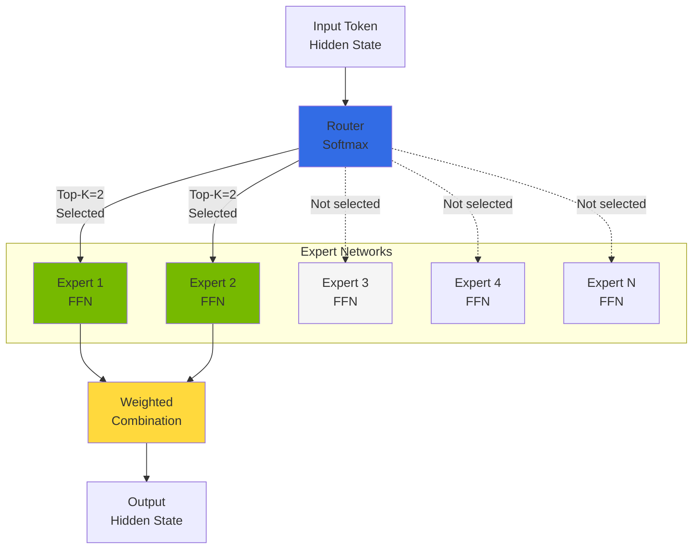
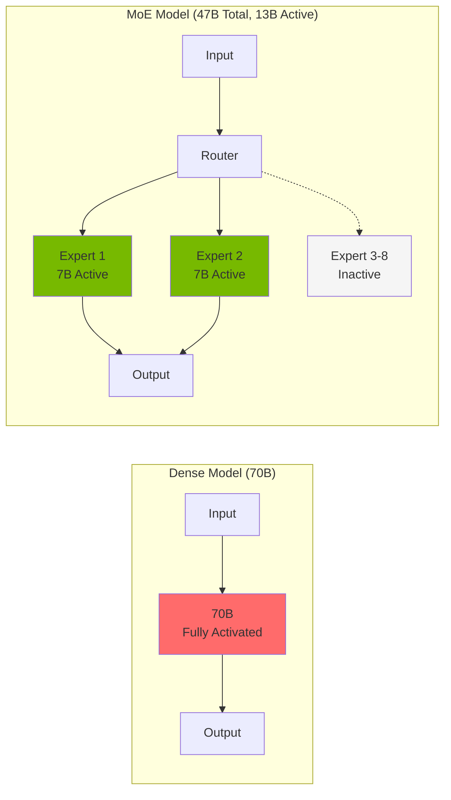
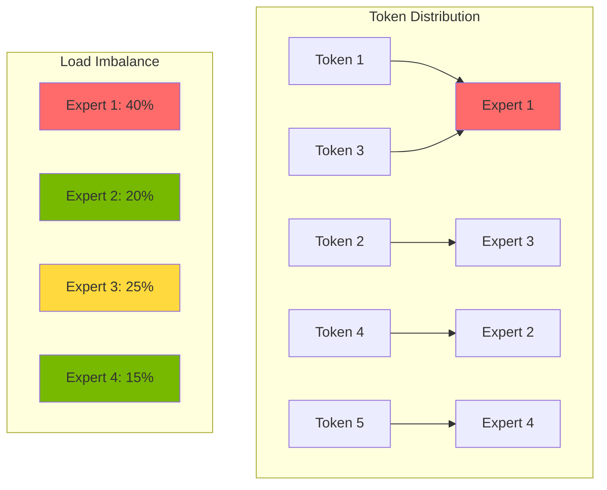
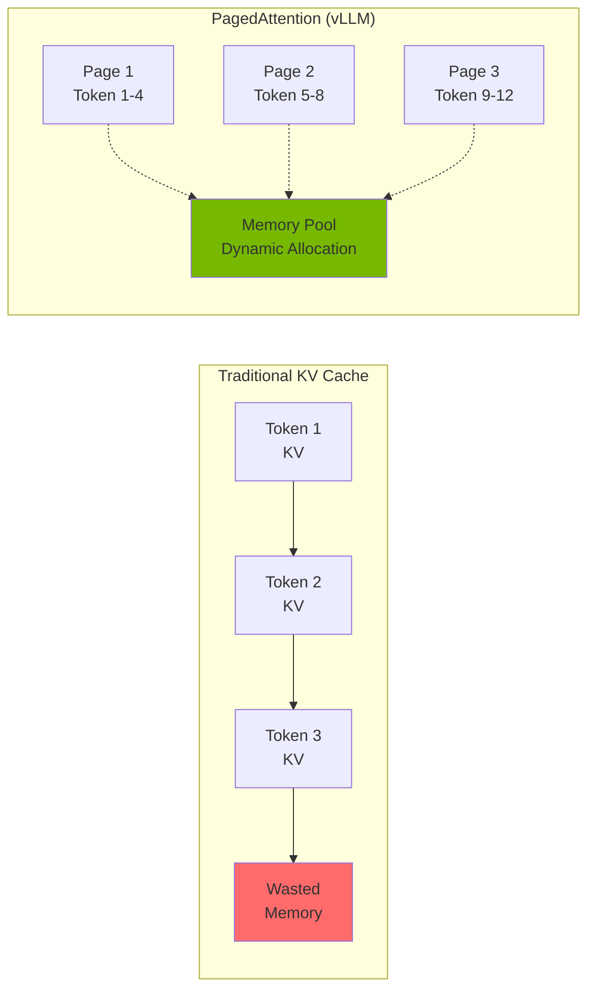
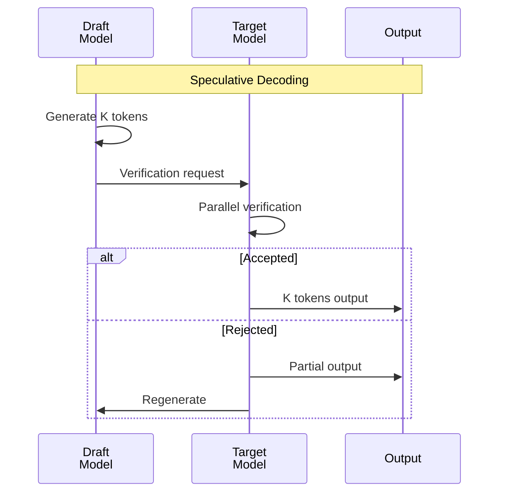

import { RoutingMechanisms, MoeVsDense, GpuMemoryRequirements, ParallelizationStrategies, TensorParallelismConfig, VllmVsTgi, KvCacheConfig, BatchOptimization, MonitoringMetrics, GpuVsTrainium2 } from '@site/src/components/MoeModelTables';

# MoE Model Serving Concept Guide

> **Current version**: vLLM v0.18+ / v0.19.x (as of 2026-04)

> **Written**: 2025-02-09 | **Updated**: 2026-04-06 | **Reading time**: ~6 min

## Overview

Mixture of Experts (MoE) models are an architecture that maximizes the efficiency of large language models. By activating only a subset of Experts from the total parameters, they achieve equivalent quality with less computation compared to Dense models.

This document covers the core concepts of MoE architecture, per-model resource requirements, and distributed deployment strategies.

:::tip Production Deployment Guide
For MoE model EKS deployment YAML, helm commands, and multi-node configuration, see the [Custom Model Deployment Guide](../reference-architecture/custom-model-deployment.md).
:::

---

## Understanding MoE Architecture

### Expert Network Structure

MoE models consist of multiple "Expert" networks and a "Router (Gate)" network that selects them.

### Routing Mechanisms

The core of MoE models is the routing mechanism that selects appropriate Experts based on input tokens.

<RoutingMechanisms />

:::info Routing Operation Principles

1. **Gate computation**: Pass the input token's hidden state through the Gate network
2. **Expert selection**: Select Top-K Experts from Softmax output
3. **Parallel processing**: Selected Experts process the input in parallel
4. **Weighted summation**: Combine Expert outputs with Gate weights

:::

### MoE vs Dense Model Comparison

<MoeVsDense />

:::tip Advantages of MoE Models

- **Computational efficiency**: Faster inference by activating only a portion of total parameters
- **Scalability**: Model capacity expandable by adding Experts
- **Specialization**: Each Expert can specialize in specific domains/tasks

:::

---

## GPU Memory Requirements

MoE models activate fewer parameters but must load all Experts into memory.

<GpuMemoryRequirements />

:::info Latest MoE Model Memory Optimization

**DeepSeek-V3**: Uses Multi-head Latent Attention (MLA) architecture to significantly reduce KV cache memory. Achieves ~40% memory savings compared to traditional MHA, so actual memory requirements may be lower than listed.

**GLM-5** (released Feb 2026): 744B total parameters / 40B active, 8 of 256 experts activated. SWE-bench Verified 77.8%, Agentic Coding #1 (55.00), MIT license. FP8 quantized version requires ~744GB VRAM (2x p5.48xlarge, PP=2). HuggingFace: `zai-org/GLM-5-FP8`

**Kimi K2.5** (released Jan 2026): ~1T total parameters / 32B active, Modified DeepSeek V3 MoE architecture. SWE-bench Verified 76.8%, HumanEval 99%, Agent Swarm support. INT4 quantized version requires ~500GB VRAM (1x p5.48xlarge, TP=8). HuggingFace: `moonshotai/Kimi-K2.5`

Exact memory requirements vary with batch size and sequence length, so profiling is recommended.
:::

:::warning Memory Calculation Considerations

- **KV Cache**: Additional memory needed based on batch size and sequence length
- **Activation Memory**: Storage space for intermediate activation values during inference
- **CUDA Context**: ~1-2GB CUDA overhead per GPU
- **Safety Margin**: Recommended 10-20% headroom in production

:::

---

## Distributed Deployment Strategies

Large MoE models cannot be loaded on a single GPU, making distributed deployment essential.

```mermaid
flowchart TB
    subgraph TP["Tensor Parallelism (TP=4)"]
        TP1[GPU 0<br/>Shard 1/4]
        TP2[GPU 1<br/>Shard 2/4]
        TP3[GPU 2<br/>Shard 3/4]
        TP4[GPU 3<br/>Shard 4/4]
        TP1 <-->|All-Reduce| TP2
        TP2 <-->|All-Reduce| TP3
        TP3 <-->|All-Reduce| TP4
    end

    subgraph EP["Expert Parallelism (EP=2)"]
        EP1[GPU 0-1<br/>Expert 1-4]
        EP2[GPU 2-3<br/>Expert 5-8]
        EP1 -.->|Routing| EP2
    end

    subgraph PP["Pipeline Parallelism (PP=2)"]
        PP1[GPU 0-3<br/>Layer 1-16]
        PP2[GPU 4-7<br/>Layer 17-32]
        PP1 -->|Sequential| PP2
    end

    style TP1 fill:#76b900
    style TP2 fill:#76b900
    style EP1 fill:#326ce5
    style EP2 fill:#326ce5
    style PP1 fill:#ffd93d
    style PP2 fill:#ffd93d
```

<ParallelizationStrategies />

### Tensor Parallelism Configuration

Tensor Parallelism distributes each model layer across multiple GPUs.

<TensorParallelismConfig />

:::tip Tensor Parallelism Optimization

- **NVLink utilization**: Use NVLink-supported instances for high-speed inter-GPU communication
- **TP size selection**: Choose minimum TP size based on model size and GPU memory
- **Communication overhead**: Larger TP size increases All-Reduce communication

:::

### Expert Parallelism

Expert Parallelism distributes MoE model Experts across multiple GPUs. In vLLM v0.6+, Experts are automatically distributed within TP.

### Expert Activation Patterns

Understanding Expert activation patterns is important for MoE model performance optimization.

:::info Expert Load Balancing

- **Auxiliary Loss**: Auxiliary loss during training to encourage even distribution across Experts
- **Capacity Factor**: Maximum token limit per Expert
- **Token Dropping**: Drop tokens on capacity overflow (recommended to disable during inference)

:::

### 700B+ MoE Model Multi-node Deployment Concepts

700B+ MoE models like GLM-5 and Kimi K2.5 cannot be loaded on a single node, making multi-node deployment essential. vLLM v0.18+ supports multi-node deployment based on **LeaderWorkerSet (LWS)**.

| Model | Total Parameters | Active Parameters | Recommended Config | VRAM Requirement |
|-------|-----------------|-------------------|-------------------|-----------------|
| GLM-5 FP8 | 744B | 40B | 2x p5.48xlarge, PP=2, TP=8 | ~744GB |
| Kimi K2.5 INT4 | ~1T | 32B | 1x p5.48xlarge, TP=8 | ~500GB |
| DeepSeek-V3 | 671B | 37B | 2x p5.48xlarge, PP=2, TP=8 | ~671GB |
| Mixtral 8x22B | 141B | 39B | 1x p5.48xlarge, TP=4 | ~282GB |
| Mixtral 8x7B | 47B | 13B | 1x p4d.24xlarge, TP=2 | ~94GB |

:::tip 700B+ MoE Model Deployment Recommendations

- **Use LeaderWorkerSet**: Kubernetes-native multi-node deployment without Ray dependency
- **Pipeline Parallelism**: PP=2 or more to partition layers across nodes
- **FP8 Quantization**: Memory savings (GLM-5 FP8 version recommended)
- **Network Optimization**: NCCL configuration for inter-node communication optimization (EFA recommended)
- **INT4/AWQ Quantization**: Consider when single-node deployment is possible (Kimi K2.5)

:::

:::warning Multi-node Deployment Cautions

- **Network bandwidth**: Overhead from inter-node All-Reduce communication (EFA recommended)
- **Loading time**: 700B+ models may take 20-30 minutes for initial loading
- **Memory headroom**: 10-15% safety margin required
- **LeaderWorkerSet CRD**: LWS Operator must be installed on the cluster

:::

---

## vLLM-Based MoE Serving Features

vLLM v0.18+ provides the following optimizations for MoE models:

- **Expert Parallelism**: Expert distribution across multiple GPUs
- **Tensor Parallelism**: Intra-layer tensor splitting
- **PagedAttention**: Efficient KV Cache management
- **Continuous Batching**: Dynamic batch processing
- **FP8 KV Cache**: 2x memory savings
- **Improved Prefix Caching**: 400%+ throughput improvement
- **Multi-LoRA Serving**: Simultaneous serving of multiple LoRA adapters on a single base model
- **GGUF Quantization**: GGUF format quantized model support

:::warning TGI Maintenance Mode
Text Generation Inference (TGI) entered maintenance mode in 2025. **Use vLLM for new deployments.** When migrating from existing TGI, vLLM provides an OpenAI-compatible API, minimizing client code changes.
:::

### vLLM vs TGI Performance Comparison

<VllmVsTgi />

---

## AWS Trainium2-Based MoE Inference

### Trainium2 Overview

AWS Trainium2 is AWS's 2nd-generation ML accelerator, providing cost-efficient inference compared to GPUs.

**Key features:**
- **High performance**: Llama 3.1 405B inference possible on a single trn2.48xlarge
- **Cost efficiency**: Up to 50% cost savings vs GPU
- **NeuronX SDK**: PyTorch 2.5+ support, minimal code changes for model onboarding
- **NxD Inference**: PyTorch-based library simplifying large-scale LLM deployment
- **FP8 Quantization**: Memory efficiency improvement
- **Flash Decoding**: Speculative Decoding support

### GPU vs Trainium2 Cost Comparison

<GpuVsTrainium2 />

:::tip Trainium2 Recommended Scenarios

- **Cost optimization**: When 50%+ cost savings vs GPU are needed
- **Large-scale deployment**: Operating tens to hundreds of inference endpoints
- **Stable workloads**: Production environments where stability and cost matter more than experimental features
- **AWS native**: Preference for fully managed solutions within the AWS ecosystem

:::

:::warning Trainium2 Limitations

- **Model support**: Not all models are supported; NeuronX SDK compatibility check needed
- **Custom kernels**: Some custom CUDA kernels need porting to Neuron
- **Debugging**: Debugging tools are more limited compared to GPU
- **Regional availability**: Available only in certain AWS regions

:::

---

## Performance Optimization Concepts

### KV Cache Optimization

KV Cache is a key factor significantly impacting inference performance.

<KvCacheConfig />

### Speculative Decoding

Speculative Decoding uses a small draft model to improve inference speed.

:::info Speculative Decoding Effect

- **Speed improvement**: 1.5x - 2.5x throughput increase (varies by workload)
- **Quality maintained**: Output quality is identical (guaranteed by verification process)
- **Additional memory**: Extra GPU memory needed for the draft model

:::

### Batch Processing Optimization

<BatchOptimization />

---

## Monitoring Metrics

### Key Monitoring Metrics

<MonitoringMetrics />

Key alert criteria:

| Metric | Threshold | Severity | Description |
|--------|-----------|----------|-------------|
| P95 Response Latency | > 30s | Warning | MoE model response delay |
| KV Cache Utilization | > 95% | Critical | May reject new requests |
| Waiting Request Count | > 100 | Warning | Scale-out needed |

---

## Summary

### Key Points

1. **Architecture understanding**: Grasp the operating principles of Expert networks and routing mechanisms
2. **Memory planning**: Secure sufficient GPU memory as all Experts must be loaded
3. **Distributed deployment**: Appropriately combine Tensor Parallelism and Expert Parallelism
4. **Inference engine selection**: vLLM recommended (latest optimization techniques and active updates)
5. **Performance optimization**: Apply KV Cache, Speculative Decoding, and batch processing optimization

### Next Steps

- [GPU Resource Management](./gpu-resource-management.md) - GPU cluster dynamic resource allocation
- [Inference Gateway Routing](../reference-architecture/inference-gateway-routing.md) - Multi-model routing strategies
- [Agentic AI Platform Architecture](../design-architecture/agentic-platform-architecture.md) - Overall platform structure

---

## References

- [vLLM Official Documentation](https://docs.vllm.ai/)
- [Mixtral Model Card](https://huggingface.co/mistralai/Mixtral-8x7B-Instruct-v0.1)
- [MoE Architecture Paper](https://arxiv.org/abs/2101.03961)
- [PagedAttention Paper](https://arxiv.org/abs/2309.06180)
