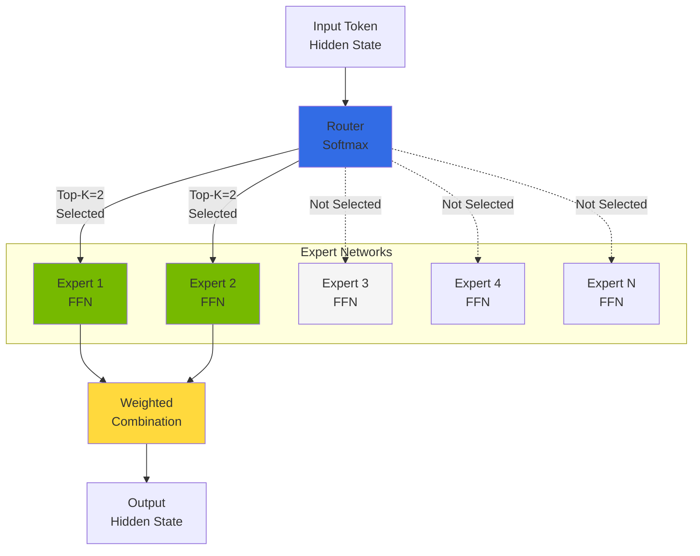
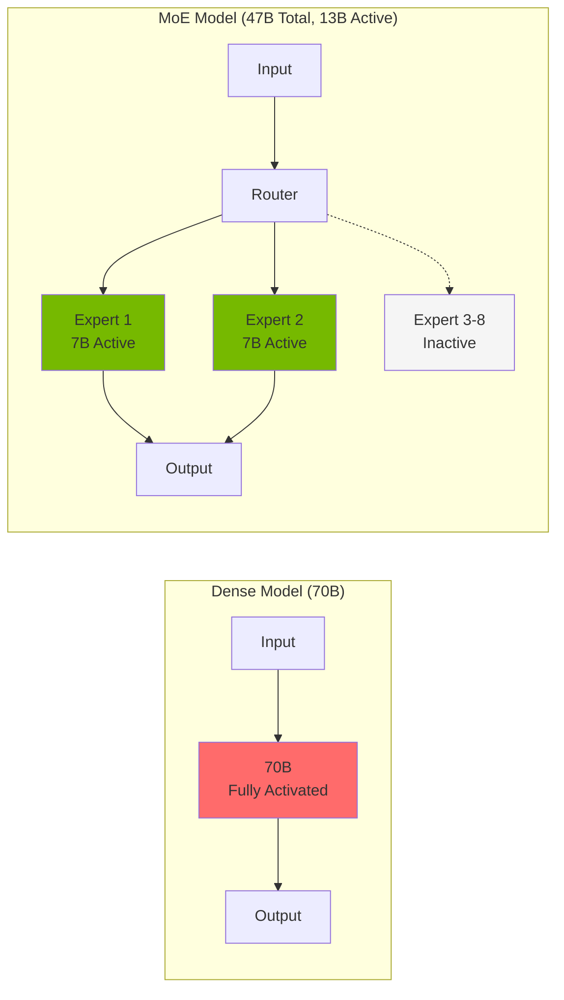
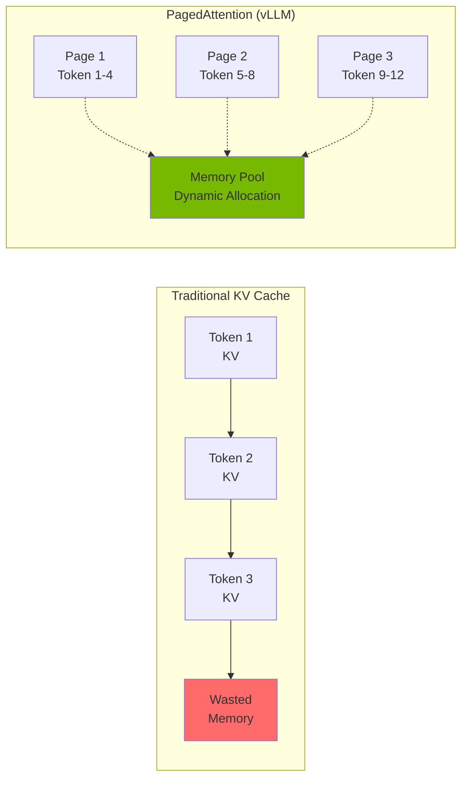
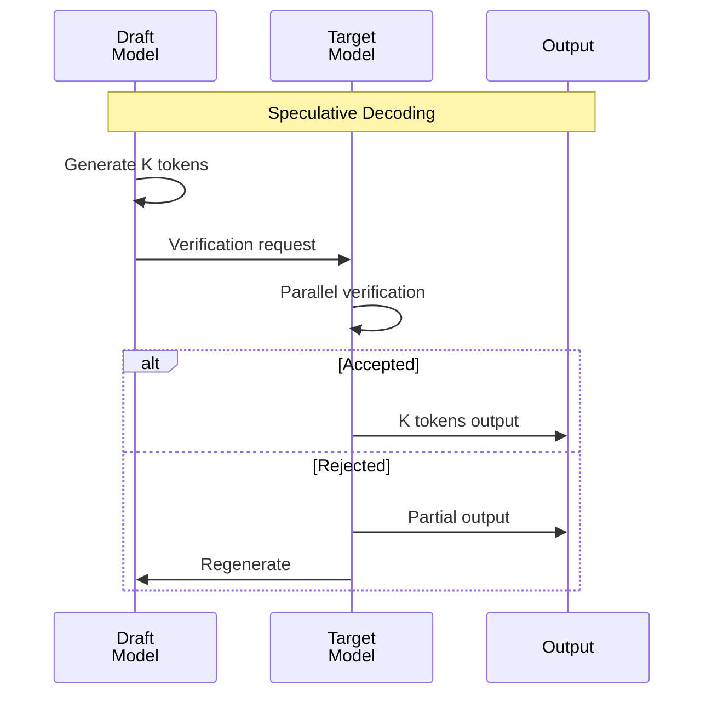

import { RoutingMechanisms, MoeVsDense, GpuMemoryRequirements, ParallelizationStrategies, TensorParallelismConfig, VllmVsTgi, KvCacheConfig, BatchOptimization, MonitoringMetrics, GpuVsTrainium2 } from '@site/src/components/MoeModelTables';

> **Current version**: vLLM v0.18+ / v0.19.x (as of April 2026)

## Overview

A Mixture of Experts (MoE) model contains multiple expert networks, and a router selects a subset to process each token. Computing only those experts can reduce work per token. Evaluate the resulting quality for the model and task rather than assuming it matches a dense model. Fewer active experts also do not remove the need to account for memory that holds the complete model weights.

This document covers the core concepts of MoE architecture, per-model resource requirements, and distributed deployment strategies.

:::tip Production Deployment Guide
For practical deployment including EKS deployment YAML, helm commands, and multi-node configuration for MoE models, refer to the [Custom Model Deployment Guide](../../reference-architecture/model-lifecycle/custom-model-deployment.md).
:::

---

## Understanding MoE Architecture

### Expert Network Structure

MoE models consist of multiple "Expert" networks and a "Router (Gate)" network that selects them.

```mermaid
flowchart TB
    INPUT[Input Token<br/>Hidden State]

    GATE[Router<br/>Softmax]

    subgraph Experts["Expert Networks"]
        E1[Expert 1<br/>FFN]
        E2[Expert 2<br/>FFN]
        E3[Expert 3<br/>FFN]
        E4[Expert 4<br/>FFN]
        EN[Expert N<br/>FFN]
    end

    COMBINE[Weighted<br/>Combination]
    OUTPUT[Output<br/>Hidden State]

    INPUT --> GATE
    GATE -->|Top-K=2<br/>Selected| E1
    GATE -->|Top-K=2<br/>Selected| E2
    GATE -.->|Not Selected| E3
    GATE -.->|Not Selected| E4
    GATE -.->|Not Selected| EN
    E1 --> COMBINE
    E2 --> COMBINE
    COMBINE --> OUTPUT

    style GATE fill:#326ce5
    style E1 fill:#76b900
    style E2 fill:#76b900
    style E3 fill:#f5f5f5
    style COMBINE fill:#ffd93d
```

### Routing Mechanisms

The core of MoE models is the routing mechanism that selects appropriate Experts based on input tokens.

<RoutingMechanisms />

:::info Routing Operation Principles

1. **Gate Computation**: Pass the input token's hidden state through the Gate network
2. **Expert Selection**: Select Top-K Experts from Softmax output
3. **Parallel Processing**: Selected Experts process the input in parallel
4. **Weighted Summation**: Combine Expert outputs with Gate weights

:::

### MoE vs Dense Model Comparison

<MoeVsDense />

```mermaid
flowchart LR
    subgraph Dense["Dense Model (70B)"]
        D_IN[Input] --> D_ALL[70B<br/>Fully Activated]
        D_ALL --> D_OUT[Output]
    end

    subgraph MoE["MoE Model (47B Total, 13B Active)"]
        M_IN[Input] --> M_GATE[Router]
        M_GATE --> M_E1[Expert 1<br/>7B Active]
        M_GATE --> M_E2[Expert 2<br/>7B Active]
        M_E1 --> M_OUT[Output]
        M_E2 --> M_OUT
        M_GATE -.-> M_E3[Expert 3-8<br/>Inactive]
    end

    style D_ALL fill:#ff6b6b
    style M_E1 fill:#76b900
    style M_E2 fill:#76b900
    style M_E3 fill:#f5f5f5
```

:::tip Advantages of MoE Models

- **Computational Efficiency**: Faster inference by activating only a portion of total parameters
- **Scalability**: Model capacity expandable by adding Experts
- **Specialization**: Each Expert can specialize in specific domains/tasks

:::

---

## GPU Memory Requirements

MoE models activate fewer parameters but must load all Experts into memory.

<GpuMemoryRequirements />

:::info Distinguish weight size from serving memory

The table estimates **weights only** by multiplying total parameter count by 2, 1, or 0.5 bytes. B means one billion parameters; GB means 10⁹ bytes, not GiB. The 8-bit column describes the storage width of INT8/FP8, and the 4-bit column assumes ideal packing. These columns do not imply that a checkpoint or serving engine supports every precision.

- **DeepSeek-V3**: The 671B main model needs about 1,342GB at 16-bit or 671GB at 8-bit. The [official model summary](https://github.com/deepseek-ai/DeepSeek-V3#2-model-summary) describes a 685B checkpoint including a 14B MTP module. MLA reduces KV cache size; it does not reduce weight size at a fixed precision.
- **GLM-5**: The [model card](https://huggingface.co/zai-org/GLM-5) specifies 744B total / 40B active parameters. 744GB is an ideal 8-bit weight estimate, not a total VRAM requirement.
- **Kimi K2.5**: The [model card](https://huggingface.co/moonshotai/Kimi-K2.5) specifies 1T total / 32B active parameters and native INT4. About 500GB is the ideal 4-bit size; the 8-bit estimate is about 1,000GB. Actual checkpoints may include quantization metadata and tensors stored at other precisions.

:::

:::warning Weight size alone does not determine GPU count

Pin the checkpoint revision, weight and KV cache precision, engine version, and parallelism configuration. Measure at the intended maximum context and concurrency. Include KV cache, activations, CUDA graphs, communication buffers, runtime allocations, and replicated tensors. Check headroom on the **most heavily loaded rank**, not just total HBM. No GPU count or single-node fit is presented here as a validated deployment.

:::

---

## Distributed Deployment Strategies

Large MoE models cannot be loaded on a single GPU, making distributed deployment essential.

```mermaid
flowchart TB
    subgraph TP["Tensor Parallelism (TP=4)"]
        TP1[GPU 0<br/>Shard 1/4]
        TP2[GPU 1<br/>Shard 2/4]
        TP3[GPU 2<br/>Shard 3/4]
        TP4[GPU 3<br/>Shard 4/4]
        TP1 <-->|All-Reduce| TP2
        TP2 <-->|All-Reduce| TP3
        TP3 <-->|All-Reduce| TP4
    end

    subgraph EP["Expert Parallelism (EP=2)"]
        EP1[GPU 0-1<br/>Expert 1-4]
        EP2[GPU 2-3<br/>Expert 5-8]
        EP1 -.->|Routing| EP2
    end

    subgraph PP["Pipeline Parallelism (PP=2)"]
        PP1[GPU 0-3<br/>Layer 1-16]
        PP2[GPU 4-7<br/>Layer 17-32]
        PP1 -->|Sequential| PP2
    end

    style TP1 fill:#76b900
    style TP2 fill:#76b900
    style EP1 fill:#326ce5
    style EP2 fill:#326ce5
    style PP1 fill:#ffd93d
    style PP2 fill:#ffd93d
```

<ParallelizationStrategies />

### Tensor Parallelism Configuration

Tensor Parallelism distributes each model layer across multiple GPUs.

<TensorParallelismConfig />

:::tip Tensor Parallelism Optimization

- **NVLink Utilization**: Use NVLink-supported instances for high-speed inter-GPU communication
- **TP Size Selection**: Choose minimum TP size based on model size and GPU memory
- **Communication Overhead**: Larger TP size increases All-Reduce communication

:::

### Expert Parallelism

Expert Parallelism distributes MoE model Experts across multiple GPUs. In vLLM v0.19.x, Experts are automatically distributed within TP.

### Expert Activation Patterns

Understanding Expert activation patterns is important for MoE model performance optimization.

```mermaid
flowchart TB
    subgraph Dist["Token Distribution"]
        T1[Token 1] --> E1[Expert 1]
        T2[Token 2] --> E3[Expert 3]
        T3[Token 3] --> E1
        T4[Token 4] --> E2[Expert 2]
        T5[Token 5] --> E4[Expert 4]
    end

    subgraph Load["Load Imbalance"]
        E1_LOAD[Expert 1: 40%]
        E2_LOAD[Expert 2: 20%]
        E3_LOAD[Expert 3: 25%]
        E4_LOAD[Expert 4: 15%]
    end

    style E1 fill:#ff6b6b
    style E1_LOAD fill:#ff6b6b
    style E2_LOAD fill:#76b900
    style E3_LOAD fill:#ffd93d
    style E4_LOAD fill:#76b900
```

:::info Expert Load Balancing

- **Auxiliary Loss**: Auxiliary loss during training to encourage even distribution across Experts
- **Capacity Factor**: Maximum token limit per Expert
- **Token Dropping**: Drop tokens on capacity overflow (recommended to disable during inference)

:::

### 700B+ MoE Model Multi-node Deployment Concepts

Parameter count alone does not determine whether multiple nodes are required. Check checkpoint precision, usable HBM per node, KV cache budget, and target concurrency. Kimi K2.5's ideal INT4 weight size does not prove either single-node fit or a mandatory multi-node configuration.

1. Inspect the actual checkpoint files and memory after the engine loads them. Use the table above only for weight-size arithmetic.
2. Select TP, PP, and EP combinations supported by the engine and model, including layer and expert partitioning constraints.
3. Check the inter-node transport and bandwidth. Communication can be the bottleneck even when total GPU memory is sufficient.
4. Measure peak memory per rank, TTFT, and throughput at maximum context and concurrency. Record the configuration alongside the results.

Deployment tools such as LeaderWorkerSet manage distributed worker placement. Using one does not establish that a model fits in memory or meets a performance target.

:::warning Multi-node Deployment Cautions

- **Network Bandwidth**: Overhead from inter-node All-Reduce communication (EFA recommended)
- **Loading Time**: 700B+ models may take 20-30 minutes for initial loading
- **Memory Headroom**: 10-15% safety margin required
- **LeaderWorkerSet CRD**: LWS Operator must be installed on the cluster

:::

---

## vLLM-Based MoE Serving Features

vLLM v0.18+ provides the following optimizations for MoE models:

- **Expert Parallelism**: Expert distribution across multiple GPUs
- **Tensor Parallelism**: Intra-layer tensor splitting
- **PagedAttention**: Efficient KV Cache management
- **Continuous Batching**: Dynamic batch processing
- **FP8 KV Cache**: 2x memory savings
- **Improved Prefix Caching**: 400%+ throughput improvement
- **Multi-LoRA Serving**: Simultaneous serving of multiple LoRA adapters on a single base model
- **GGUF Quantization**: GGUF format quantized model support

:::warning TGI Maintenance Mode
Text Generation Inference (TGI) entered maintenance mode in 2025. **Use vLLM for new deployments.** When migrating from existing TGI, vLLM provides an OpenAI-compatible API, minimizing client code changes.
:::

### vLLM vs TGI Performance Comparison

<VllmVsTgi />

---

## AWS Trainium2-Based MoE Inference

AWS Trainium2 / Inferentia2 provide a cost-efficient alternative to GPUs for large-scale MoE models (DBRX, Mixtral 8x22B, Llama 4 MoE, etc.), with lower per-token costs. The Neuron stack maps Expert Parallelism and Tensor Parallelism to NeuronCore units and serves via **NxD Inference** or **vLLM Neuron backend**.

### Summary

| Item | Overview |
|------|----------|
| Hardware | trn2.48xlarge (Trainium2 16 chips / NeuronCore 128 / HBM 1.5TB), inf2 series |
| SDK | AWS Neuron SDK 2.x, torch-neuronx, neuronx-cc |
| Inference Framework | NxD Inference (AWS official), vLLM Neuron backend, TGI Neuron fork |
| Quantization | BF16/FP16/FP8(E4M3/E5M2). Some AWQ/GPTQ, GGUF not supported |
| Suitable MoE | DBRX 132B, Mixtral 8x7B/8x22B, Llama 4 MoE (within NxD support scope) |

### GPU vs Trainium2 Cost Comparison

<GpuVsTrainium2 />

:::info Refer to Separate Document for Detailed Guide
For Neuron SDK architecture, instance lineup, Device Plugin deployment, Karpenter NodePool, inference framework comparison (NxD / vLLM Neuron / TGI Neuron), supported model matrix, observability, limitations and considerations, refer to the dedicated document below.

→ **[AWS Neuron Stack — Trainium2/Inferentia2 on EKS](../gpu-infrastructure/aws-neuron-stack.md)**

For NVIDIA vs Neuron decision-making at the node selection stage, refer to [EKS GPU Node Strategy](../gpu-infrastructure/eks-gpu-node-strategy.md#6-aws-accelerator-selection-guide-nvidia-vs-neuron).
:::

---

## Performance Optimization Concepts

### KV Cache Optimization

KV Cache is a key factor significantly impacting inference performance.

```mermaid
flowchart LR
    subgraph Trad["Traditional KV Cache"]
        T1[Token 1<br/>KV] --> T2[Token 2<br/>KV]
        T2 --> T3[Token 3<br/>KV]
        T3 --> WASTE[Wasted<br/>Memory]
    end

    subgraph Paged["PagedAttention (vLLM)"]
        P1[Page 1<br/>Token 1-4]
        P2[Page 2<br/>Token 5-8]
        P3[Page 3<br/>Token 9-12]
        POOL[Memory Pool<br/>Dynamic Allocation]
        P1 -.-> POOL
        P2 -.-> POOL
        P3 -.-> POOL
    end

    style WASTE fill:#ff6b6b
    style POOL fill:#76b900
```

<KvCacheConfig />

### Speculative Decoding

Speculative Decoding uses a small draft model to improve inference speed.

```mermaid
sequenceDiagram
    participant Draft as Draft<br/>Model
    participant Target as Target<br/>Model
    participant Out as Output

    Note over Draft,Out: Speculative Decoding

    Draft->>Draft: Generate K tokens
    Draft->>Target: Verification request
    Target->>Target: Parallel verification

    alt Accepted
        Target->>Out: K tokens output
    else Rejected
        Target->>Out: Partial output
        Target->>Draft: Regenerate
    end
```

:::info Speculative Decoding Effect

- **Speed Improvement**: 1.5x - 2.5x throughput increase (varies by workload)
- **Quality Maintained**: Output quality is identical (guaranteed by verification process)
- **Additional Memory**: Extra GPU memory needed for the draft model

:::

### Batch Processing Optimization

<BatchOptimization />

---

## Monitoring Metrics

### Key Monitoring Metrics

<MonitoringMetrics />

Key alert criteria:

| Metric | Threshold | Severity | Description |
|--------|-----------|----------|-------------|
| P95 Response Latency | &gt; 30s | Warning | MoE model response delay |
| KV Cache Utilization | &gt; 95% | Critical | May reject new requests |
| Waiting Request Count | &gt; 100 | Warning | Scale-out needed |

---

## Summary

### Key Points

1. **Architecture Understanding**: Grasp the operating principles of Expert networks and routing mechanisms
2. **Memory Planning**: Secure sufficient GPU memory as all Experts must be loaded
3. **Distributed Deployment**: Appropriately combine Tensor Parallelism and Expert Parallelism
4. **Inference Engine Selection**: vLLM recommended (latest optimization techniques and active updates)
5. **Performance Optimization**: Apply KV Cache, Speculative Decoding, and batch processing optimization

### Next Steps

- [GPU Resource Management](../gpu-infrastructure/gpu-resource-management.md) - GPU cluster dynamic resource allocation
- [Inference Gateway Routing](../../model-serving/inference-routing/routing-strategy.md) - Multi-model routing strategies
- [Agentic AI Platform Architecture](../../design-architecture/foundations/agentic-platform-architecture.md) - Overall platform structure

---

## References

- [vLLM Official Documentation](https://docs.vllm.ai/)
- [Mixtral Model Card](https://huggingface.co/mistralai/Mixtral-8x7B-Instruct-v0.1)
- [MoE Architecture Paper](https://arxiv.org/abs/2101.03961)
- [PagedAttention Paper](https://arxiv.org/abs/2309.06180)
