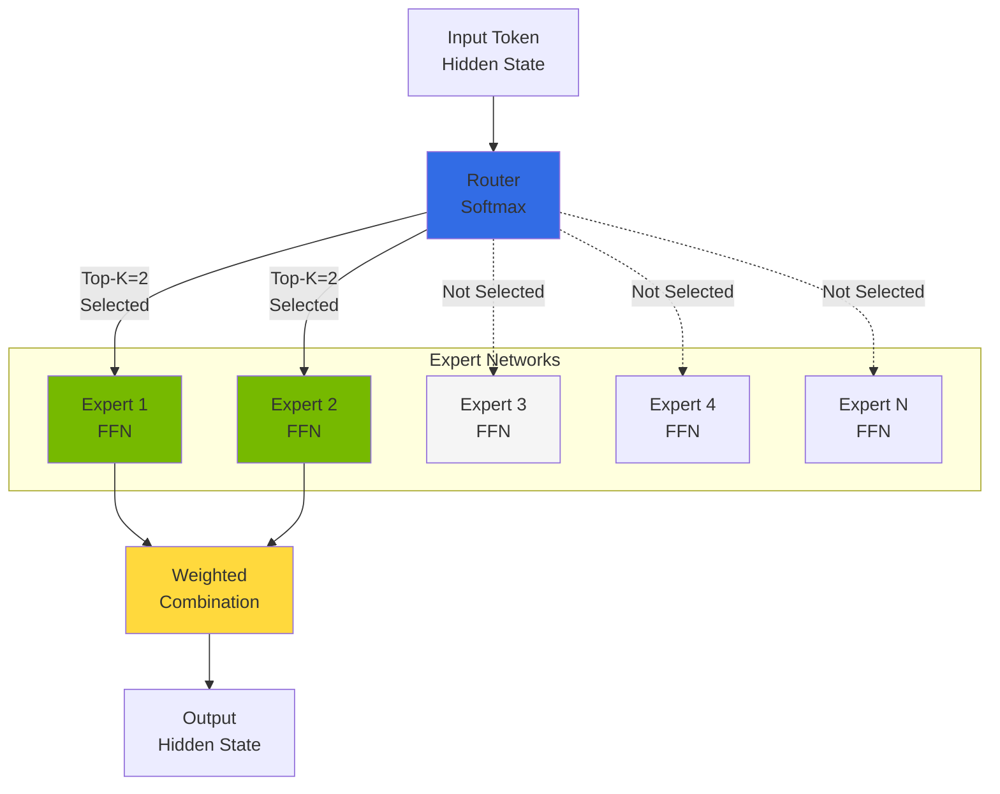
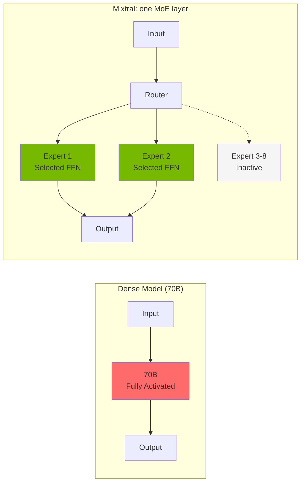
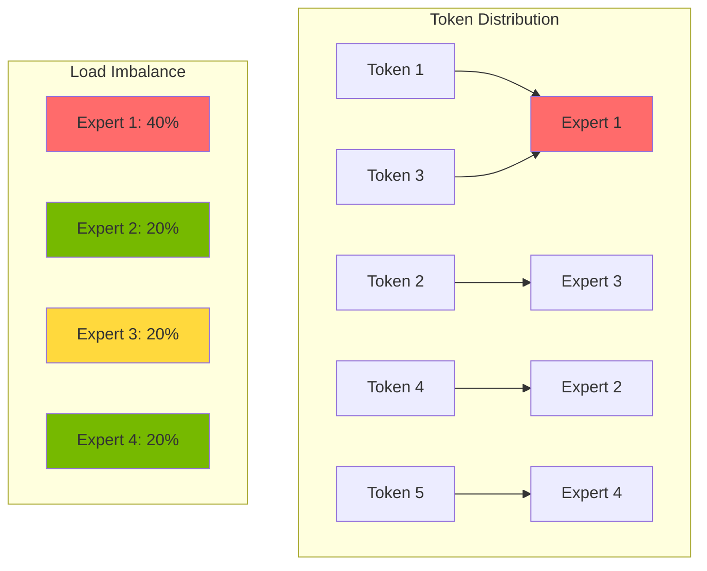
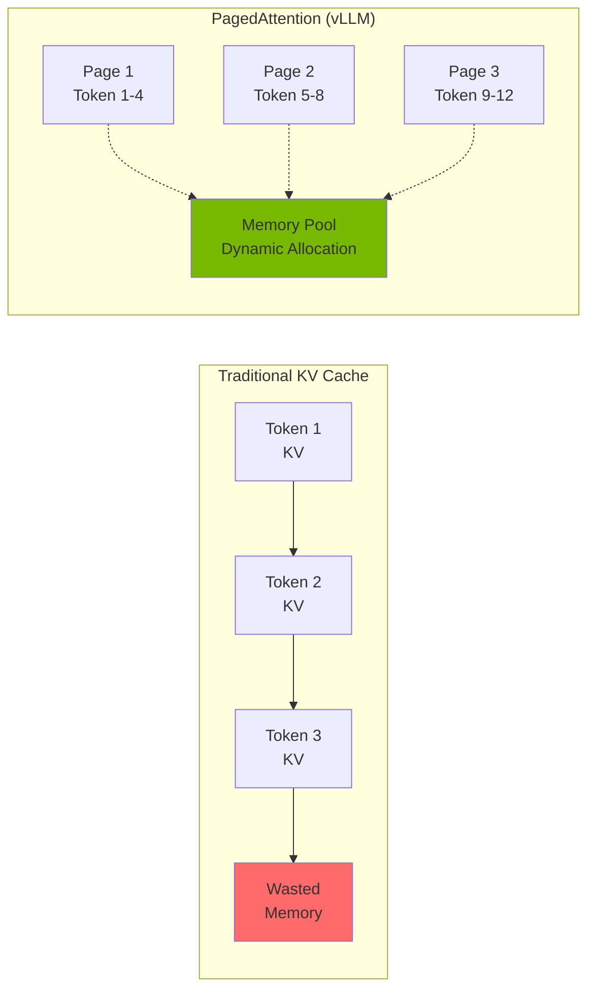
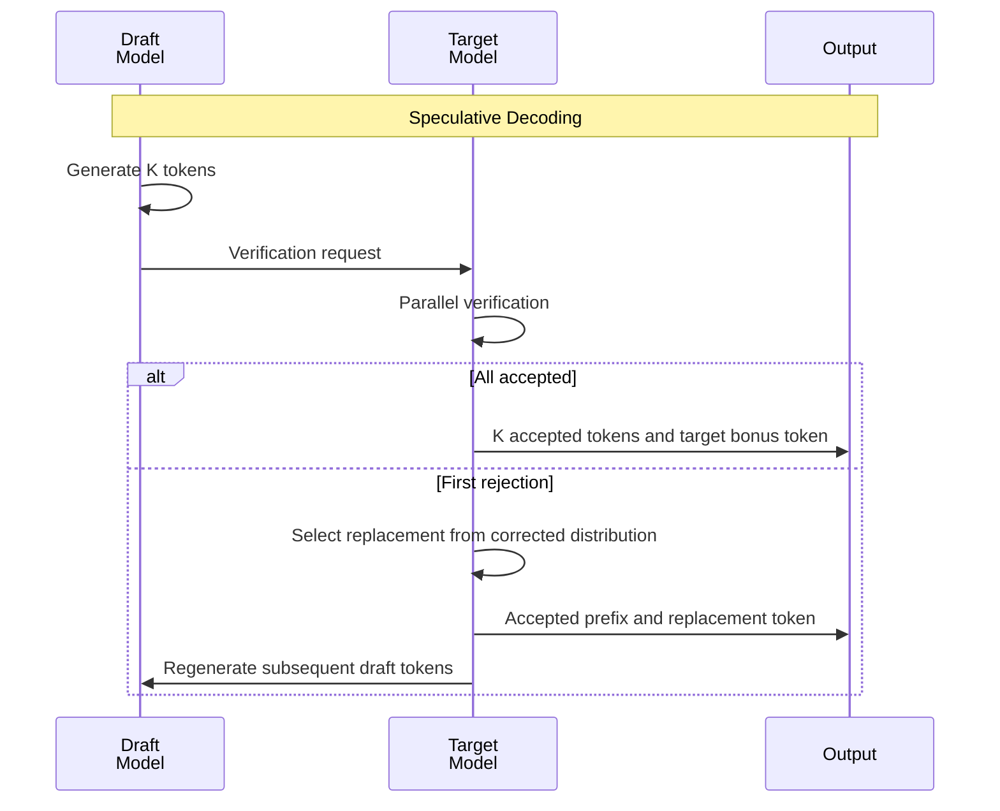

import { GpuMemoryRequirements, ParallelizationStrategies } from '@site/src/components/MoeModelTables';

> **Reference version**: vLLM v0.25.0 (released July 11, 2026). The vLLM features, options, and metrics below refer to this version.

## Overview

A Mixture of Experts (MoE) model contains multiple expert networks, and a router selects a subset to process each token. Computing only those experts can reduce work per token. Evaluate the resulting quality for the model and task rather than assuming it matches a dense model. Fewer active experts also do not remove the need to account for memory that holds the complete model weights.

This document covers the core concepts of MoE architecture, per-model resource requirements, and distributed deployment strategies.

:::tip Production Deployment Guide
For practical deployment including EKS deployment YAML, helm commands, and multi-node configuration for MoE models, refer to the [Custom Model Deployment Guide](../../reference-architecture/model-lifecycle/custom-model-deployment.md).
:::

---

## Understanding MoE Architecture

### Expert Network Structure

MoE models consist of multiple "Expert" networks and a "Router (Gate)" network that selects them.


```mermaid
flowchart TB
    INPUT[Input Token<br/>Hidden State]

    GATE[Router<br/>Softmax]

    subgraph Experts["Expert Networks"]
        E1[Expert 1<br/>FFN]
        E2[Expert 2<br/>FFN]
        E3[Expert 3<br/>FFN]
        E4[Expert 4<br/>FFN]
        EN[Expert N<br/>FFN]
    end

    COMBINE[Weighted<br/>Combination]
    OUTPUT[Output<br/>Hidden State]

    INPUT --> GATE
    GATE -->|Top-K=2<br/>Selected| E1
    GATE -->|Top-K=2<br/>Selected| E2
    GATE -.->|Not Selected| E3
    GATE -.->|Not Selected| E4
    GATE -.->|Not Selected| EN
    E1 --> COMBINE
    E2 --> COMBINE
    COMBINE --> OUTPUT

    style GATE fill:#326ce5
    style E1 fill:#76b900
    style E2 fill:#76b900
    style E3 fill:#f5f5f5
    style COMBINE fill:#ffd93d
```

### Routing Mechanisms

The core of MoE models is the routing mechanism that selects appropriate Experts based on input tokens.

| Method | Selection unit and behavior | Example and evidence |
|--------|-----------------------------|----------------------|
| Token-choice Top-K | Each token selects the K experts with the highest router scores | [Mixtral uses K=2](https://arxiv.org/html/2401.04088v1); [Switch Transformer uses K=1](https://arxiv.org/html/2101.03961v3) |
| Expert Choice | Each expert selects its highest-scoring tokens within a fixed capacity. A token can be selected by a variable number of experts | [Expert Choice Routing paper](https://arxiv.org/abs/2202.09368) |
| Soft MoE | Weighted combinations of input tokens form slots for experts; expert outputs are then combined | The [Soft MoE paper](https://arxiv.org/abs/2308.00951) describes a different mechanism from Top-K token selection |
| Hash Routing | Hash input features such as token identity to assign a set of weights, instead of learning a router | [Hash Layers paper](https://arxiv.org/abs/2106.04426) |

:::info Routing Operation Principles

These steps describe **token-choice Top-K** routing in the diagram above.

1. **Gate computation**: Compute expert scores from the input token's hidden state
2. **Expert selection**: Select the K highest-scoring experts
3. **Expert computation**: Run the selected FFNs; the engine and device placement determine how they execute in parallel
4. **Weighted summation**: Combine the selected expert outputs using routing weights

:::

### MoE vs Dense Model Comparison

| Characteristic | Dense | MoE |
|----------------|-------|-----|
| Parameter activation | Uses the weights of dense layers for each token | Uses shared layers and selected expert weights; the active fraction varies by model |
| Work per token | Depends on layer size, architecture, and sequence length | Avoids computing every expert, but adds router and communication work |
| Weight memory | Account for all weights and their storage precision | Inactive experts still need storage, so account for all weights. Offloading adds transfer costs |
| Training | Choose model size for the data and compute budget | Expert count, routing, and load balance must be trained together |
| Scaling | Increase capacity through layer width, depth, or other changes | Adding experts can increase capacity, but also changes training, memory, and communication requirements |

For example, [Mixtral 8x7B](https://arxiv.org/html/2401.04088v1) activates 12.9B / 46.7B ≈ **27.6%** of its parameters. The model cards below give 40B / 744B ≈ **5.4%** for GLM-5 and 32B / 1,000B = **3.2%** for Kimi K2.5. These fractions are neither weight-memory savings nor measured throughput.

Mixtral's approximately 47B total / 13B active parameters describe the **whole model**. The right side below illustrates selecting two of eight FFNs in one MoE layer; each expert is not an independent 7B model. Shared attention and the remaining layers are omitted.


```mermaid
flowchart LR
    subgraph Dense["Dense Model (70B)"]
        D_IN[Input] --> D_ALL[70B<br/>Fully Activated]
        D_ALL --> D_OUT[Output]
    end

    subgraph MoE["Mixtral: one MoE layer"]
        M_IN[Input] --> M_GATE[Router]
        M_GATE --> M_E1[Expert 1<br/>Selected FFN]
        M_GATE --> M_E2[Expert 2<br/>Selected FFN]
        M_E1 --> M_OUT[Output]
        M_E2 --> M_OUT
        M_GATE -.-> M_E3[Expert 3-8<br/>Inactive]
    end

    style D_ALL fill:#ff6b6b
    style M_E1 fill:#76b900
    style M_E2 fill:#76b900
    style M_E3 fill:#f5f5f5
```

:::tip Advantages of MoE Models

- **Computational efficiency**: Computing selected experts can reduce work per token compared with a dense architecture of the same total parameter count. Memory access and communication also affect actual speed.
- **Scalability**: More experts can increase capacity, but require corresponding training and routing design.
- **Specialization**: Routing is learned, but experts are not guaranteed to separate into domain specialists. The [Mixtral analysis](https://arxiv.org/html/2401.04088v1) did not find obvious topic-based expert assignment patterns.

:::

---

## GPU Memory Requirements

An MoE model still needs storage for all its weights even when each token uses only some experts. Keeping every weight on GPUs or offloading some weights to other memory changes both GPU memory requirements and transfer costs.

<GpuMemoryRequirements />

:::info Distinguish weight size from serving memory

The table estimates **weights only** by multiplying total parameter count by 2, 1, or 0.5 bytes. B means one billion parameters; GB means 10⁹ bytes, not GiB. The 8-bit column describes the storage width of INT8/FP8, and the 4-bit column assumes ideal packing. These columns do not imply that a checkpoint or serving engine supports every precision.

- **DeepSeek-V3**: The 671B main model needs about 1,342GB at 16-bit or 671GB at 8-bit. The [official model summary](https://github.com/deepseek-ai/DeepSeek-V3#2-model-summary) describes a 685B checkpoint including a 14B MTP module. MLA reduces KV cache size; it does not reduce weight size at a fixed precision.
- **GLM-5**: The [model card](https://huggingface.co/zai-org/GLM-5) specifies 744B total / 40B active parameters. 744GB is an ideal 8-bit weight estimate, not a total VRAM requirement.
- **Kimi K2.5**: The [model card](https://huggingface.co/moonshotai/Kimi-K2.5) specifies 1T total / 32B active parameters and native INT4. About 500GB is the ideal 4-bit size; the 8-bit estimate is about 1,000GB. Actual checkpoints may include quantization metadata and tensors stored at other precisions.

:::

:::warning Weight size alone does not determine GPU count

Pin the checkpoint revision, weight and KV cache precision, engine version, and parallelism configuration. Measure at the intended maximum context and concurrency. Include KV cache, activations, CUDA graphs, communication buffers, runtime allocations, and replicated tensors. Check headroom on the **most heavily loaded rank**, not just total HBM. No GPU count or single-node fit is presented here as a validated deployment.

:::

---

## Distributed Deployment Strategies

When weights at the selected precision plus KV cache and runtime allocations exceed one GPU's usable memory, a memory strategy such as parallel partitioning or offloading is needed. Base the deployment on that complete budget and target load, rather than active parameter count.


```mermaid
flowchart TB
    subgraph TP["Tensor Parallelism (TP=4)"]
        TP1[GPU 0<br/>Shard 1/4]
        TP2[GPU 1<br/>Shard 2/4]
        TP3[GPU 2<br/>Shard 3/4]
        TP4[GPU 3<br/>Shard 4/4]
        TP1 <-->|All-Reduce| TP2
        TP2 <-->|All-Reduce| TP3
        TP3 <-->|All-Reduce| TP4
    end

    subgraph EP["Expert Parallelism (EP=2, TP=1)"]
        EP1[GPU 0<br/>Expert 1-4]
        EP2[GPU 1<br/>Expert 5-8]
        EP1 -.->|Routing| EP2
    end

    subgraph PP["Pipeline Parallelism (PP=2)"]
        PP1[GPU 0-3<br/>Layer 1-16]
        PP2[GPU 4-7<br/>Layer 17-32]
        PP1 -->|Sequential| PP2
    end

    style TP1 fill:#76b900
    style TP2 fill:#76b900
    style EP1 fill:#326ce5
    style EP2 fill:#326ce5
    style PP1 fill:#ffd93d
    style PP2 fill:#ffd93d
```

<ParallelizationStrategies />

Parallelism divides weights and computation. Compare candidate configurations under the same request distribution, measuring per-rank memory, compute and communication time, TTFT, ITL and throughput.

### Tensor Parallelism Configuration

Tensor Parallelism distributes each model layer across multiple GPUs.

The following is an **arithmetic example assuming uniform partitioning** of BF16 weights across N ranks. N is neither a recommended GPU count nor a supported TP configuration. Actual TP also requires accounting for replicated tensors, partitioning constraints, uneven rank usage, and allocations beyond weights.

| Model | Total parameters | BF16 weights only (GB) | Assumed rank count N | Weights/N (GB/rank) |
|-------|------------------|-----------------------|----------------------|--------------------|
| Mixtral 8x7B | 46.7B | 93.4 | 2 | 46.7 |
| Mixtral 8x22B | 141B | 282 | 4 | 70.5 |
| DeepSeek-MoE 16B | 16.4B | 32.8 | 1 | 32.8 |
| DBRX | 132B | 264 | 4 / 8 | 66 / 33 |

For example, 70.5GB/rank alone does not establish that a serving configuration fits on an 80GB GPU. Check the most heavily loaded rank at the actual maximum load.

:::tip Tensor Parallelism Optimization

- **NVLink utilization**: Verify that the selected GPUs are connected by NVLink and inspect the TP communication path.
- **TP size selection**: Compare candidates that satisfy model partitioning constraints and per-rank memory requirements.
- **Communication overhead**: Increasing TP can reduce weights per rank but changes collective communication costs. Compare TTFT and throughput with topology and load held constant.

:::

### Expert Parallelism

Expert Parallelism partitions expert weights among GPU ranks. The [vLLM v0.25.0 EP documentation](https://github.com/vllm-project/vllm/blob/v0.25.0/docs/serving/expert_parallel_deployment.md) requires **explicitly setting `--enable-expert-parallel`**. Specifying a TP size does not automatically enable EP.

With EP enabled, the MoE layers use an EP size of `TP × DP`. For example, `--tensor-parallel-size 2`, `--data-parallel-size 4`, and `--enable-expert-parallel` create eight EP ranks for MoE layers, while attention uses TP=2 within each of four DP groups. With TP=1, attention weights are replicated across DP ranks. This explains the options; it does not establish that a particular checkpoint fits on eight GPUs. This release labels EP experimental, so also check model, kernel, and communication-backend constraints.

### Expert Activation Patterns

The following is a **Top-1 arithmetic example** in which five tokens each select one expert. The counts are 2, 1, 1, and 1, giving shares of 40%, 20%, 20%, and 20%. It represents neither Mixtral's Top-2 routing nor a measured load distribution.


```mermaid
flowchart TB
    subgraph Dist["Token Distribution"]
        T1[Token 1] --> E1[Expert 1]
        T2[Token 2] --> E3[Expert 3]
        T3[Token 3] --> E1
        T4[Token 4] --> E2[Expert 2]
        T5[Token 5] --> E4[Expert 4]
    end

    subgraph Load["Load Imbalance"]
        E1_LOAD[Expert 1: 40%]
        E2_LOAD[Expert 2: 20%]
        E3_LOAD[Expert 3: 20%]
        E4_LOAD[Expert 4: 20%]
    end

    style E1 fill:#ff6b6b
    style E1_LOAD fill:#ff6b6b
    style E2_LOAD fill:#76b900
    style E3_LOAD fill:#ffd93d
    style E4_LOAD fill:#76b900
```

:::info Expert Load Balancing

- **Auxiliary loss**: Some models use an auxiliary training loss to distribute load across experts.
- **Capacity factor**: Capacity-limited routing sets an expert's token capacity relative to batch size and expert count.
- **Token dropping**: Some training approaches let overflow tokens bypass that expert computation. This does not mean deleting tokens from a client request. Check the model and engine's overflow behavior; do not assume a universal inference option disables it. [Switch Transformer](https://arxiv.org/html/2101.03961v3) and [Expert Choice](https://arxiv.org/abs/2202.09368) also use different capacity and selection rules.

:::

### 700B+ MoE Model Multi-node Deployment Concepts

Parameter count alone does not determine whether multiple nodes are required. Check checkpoint precision, usable HBM per node, KV cache budget, and target concurrency. Kimi K2.5's ideal INT4 weight size does not prove either single-node fit or a mandatory multi-node configuration.

1. Inspect the actual checkpoint files and memory after the engine loads them. Use the table above only for weight-size arithmetic.
2. Select TP, PP, and EP combinations supported by the engine and model, including layer and expert partitioning constraints.
3. Check the inter-node transport and bandwidth. Communication can be the bottleneck even when total GPU memory is sufficient.
4. Measure peak memory per rank, TTFT, and throughput at maximum context and concurrency. Record the configuration alongside the results.

Deployment tools such as LeaderWorkerSet manage distributed worker placement. Using one does not establish that a model fits in memory or meets a performance target.

:::warning Multi-node Deployment Cautions

- **Network bandwidth**: Distinguish TP collectives from EP token dispatch/combine paths, and check instance and driver requirements for a backend using EFA or another transport.
- **Loading time**: Measure startup with checkpoint size, storage throughput, parallel loading, and compilation behavior recorded.
- **Memory headroom**: Set headroom from peak per-rank memory at maximum context and concurrency, including recomputation.
- **LeaderWorkerSet CRD**: The Operator and CRDs are required when using an LWS deployment. They are not prerequisites for every multi-node serving setup.

:::

---

## vLLM-Based MoE Serving Features

The following describes vLLM v0.25.0. Usable combinations depend on model architecture, checkpoint, accelerator, and backend.

- **Expert Parallelism**: Distributes expert weights across ranks when explicitly enabled
- **Tensor Parallelism**: Partitions supported layer tensors across ranks
- **PagedAttention**: Manages KV cache in blocks
- **Continuous Batching**: Removes completed requests and adds waiting requests to the processing batch
- **FP8 KV Cache**: Storing FP16/BF16 KV elements in eight bits halves the storage width of that data. It does not halve model weights or total VRAM; check scales, accuracy, and the attention backend. [KV quantization documentation](https://github.com/vllm-project/vllm/blob/v0.25.0/docs/features/quantization/quantized_kvcache.md)
- **Automatic Prefix Caching**: Reduces duplicate prefill work when reusable prefix KV blocks remain cached. It neither skips decoding nor guarantees a fixed throughput gain. [APC documentation](https://github.com/vllm-project/vllm/blob/v0.25.0/docs/features/automatic_prefix_caching.md)
- **Multi-LoRA Serving**: Serves multiple adapters for supported base models and target modules. Check LoRA support for the specific MoE architecture and its parallelism and quantization combination. [LoRA documentation](https://github.com/vllm-project/vllm/blob/v0.25.0/docs/features/lora.md)
- **GGUF Quantization**: This release describes GGUF support as experimental and under-optimized, with compatibility constraints involving other features. It does not imply that every MoE model can be served in GGUF format. [GGUF documentation](https://github.com/vllm-project/vllm/blob/v0.25.0/docs/features/quantization/gguf.md)

:::warning TGI Maintenance Mode
As checked on September 19, 2026, the [official TGI repository](https://github.com/huggingface/text-generation-inference/blob/main/README.md) describes maintenance mode accepting minor bug fixes, documentation, and lightweight maintenance. For new deployments, consider that maintenance scope and model support when choosing an engine. An OpenAI-compatible endpoint does not establish identical request options, chat templates, streaming, or error responses; verify the client contract before migration.
:::

### vLLM vs TGI Performance Comparison

Establish performance rankings through measurements with the same model revision, precision, input/output lengths, concurrency, and hardware. The table lists what to record when comparing vLLM v0.25.0 with a selected TGI release.

| Comparison | Evidence and measurement |
|------------|--------------------------|
| Throughput | Record output tokens meeting quality and latency SLOs, and the measurement duration |
| TTFT | Record first-token latency percentiles and error rates under the same request distribution |
| Memory | Measure peak HBM at the same context and concurrency. TGI also uses PagedAttention; the feature name alone establishes no ranking |
| MoE and parallelism | Check support for the model architecture and checkpoint, TP/EP combinations, and kernel constraints in both engines |
| Quantization | Check model, device, kernel, and release compatibility, beyond the format name |
| API | Compare the endpoints, sampling options, chat templates, streaming, and error handling used by the client through contract tests |
| Maintenance | Evaluate the pinned vLLM release above and TGI's officially stated maintenance scope |

Sources: [vLLM v0.25.0 quantization documentation](https://github.com/vllm-project/vllm/blob/v0.25.0/docs/features/quantization/README.md) and [TGI's feature and maintenance description](https://github.com/huggingface/text-generation-inference/blob/main/README.md). This table contains no comparative execution results for the two engines.

---

## AWS Trainium2-Based MoE Inference

AWS Trainium2 and Inferentia2 use the Neuron software stack. When evaluating them alongside GPUs, first check the target model's Neuron implementation, checkpoint format, and compilation and parallelism constraints. Using NxD Inference or a vLLM Neuron backend alone establishes neither support for every MoE model nor lower cost per token.

### Summary

| Item | Overview |
|------|----------|
| Hardware | trn2.48xlarge has 16 Trainium2 chips, each with eight physical NeuronCore-v3 cores: 128 per instance. Default LNC=2 exposes 64 logical NeuronCores |
| LNC configuration | LNC=1 exposes 128 logical cores per instance. Compiler and runtime LNC settings must agree |
| SDK and framework | Pin the Neuron SDK, compiler, runtime, and NxD Inference or vLLM Neuron backend versions together |
| Precision and quantization | A chip's dtype operations and an engine's support for a checkpoint format are separate. Check the model, backend, and device combination |
| Models | Names such as DBRX, Mixtral, or Llama 4 do not establish deployability; check the exact architecture and revision against the framework's model-support documentation |

The physical/logical core distinction and configuration requirements follow the [Neuron LNC documentation](https://awsdocs-neuron.readthedocs-hosted.com/en/latest/about-neuron/arch/neuron-features/logical-neuroncore-config.html). Do not apply these Trainium2 core counts or LNC settings to Inferentia2.

### GPU vs Trainium2 Cost Comparison

First distinguish the hardware units being priced. HBM uses the **GiB** values in the [Neuron architecture documentation](https://awsdocs-neuron.readthedocs-hosted.com/en/latest/about-neuron/arch/neuron-hardware/trn2-arch.html); UltraServer is not another name for a single instance.

| Comparison unit | Accelerator configuration | Device memory in Neuron documentation | EFA network specification |
|-----------------|---------------------------|---------------------------------------|---------------------------|
| One trn2.48xlarge | 16 Trainium2 chips | 1,536GiB | 3,200Gbps per instance |
| One Trn2 UltraServer | Four trn2u.48xlarge instances, 64 chips total | 6,144GiB per UltraServer | 12,800Gbps in aggregate per the [EC2 product documentation](https://aws.amazon.com/ec2/instance-types/trn2/) |

The bandwidth values are product specifications, not measured application transfer rates. HBM also does not mean a single GPU memory space that every process can use without constraints.

:::info Specifications still to confirm
On September 19, 2026, the [EC2 instance specification table](https://docs.aws.amazon.com/ec2/latest/instancetypes/ac.html) listed 8,192GiB of accelerator memory for trn2.48xlarge and no accelerators for trn2u.48xlarge, conflicting with the Neuron documentation above. Neuron's UltraServer network table lists 3,200Gbps, while the EC2 product page gives 12.8Tbps across four instances. The table above attributes values to their sources; it does not resolve these differences. Confirm the target configuration before using the figures for capacity or cost planning.
:::

| Cost-comparison candidate | Conditions to hold constant and record |
|---------------------------|----------------------------------------|
| p5.48xlarge (8 H100 GPUs) | Model revision, precision, context and concurrency, GPU engine and kernel, parallelism |
| p4d.24xlarge (8 A100 GPUs) | Fit, quality, latency SLOs, and successful output tokens under the same conditions |
| trn2.48xlarge or Trn2 UltraServer | The same conditions plus Neuron version, compiler settings, LNC, and the number of billed instances |

For interval cost, record rates by region, purchase option, and measurement date; billed duration; and included storage, network, or other charges. Compare **cost per million output tokens = interval cost × 1,000,000 / output tokens meeting quality and latency requirements**. The ratio is undefined when that denominator is zero. Hourly price differences alone cannot establish 78% or 34% inference-cost savings, and no execution results here validate those savings.

:::info Refer to Separate Document for Detailed Guide
For Neuron SDK architecture, instance lineup, Device Plugin deployment, Karpenter NodePool, inference framework comparison (NxD / vLLM Neuron / TGI Neuron), supported model matrix, observability, limitations and considerations, refer to the dedicated document below.

→ **[AWS Neuron Stack — Trainium2/Inferentia2 on EKS](../gpu-infrastructure/aws-neuron-stack.md)**

For NVIDIA vs Neuron decision-making at the node selection stage, refer to [EKS GPU Node Strategy](../gpu-infrastructure/eks-gpu-node-strategy.md#6-aws-accelerator-selection-guide-nvidia-vs-neuron).
:::

---

## Performance Optimization Concepts

### KV Cache Optimization

KV Cache is a key factor significantly impacting inference performance.


```mermaid
flowchart LR
    subgraph Trad["Traditional KV Cache"]
        T1[Token 1<br/>KV] --> T2[Token 2<br/>KV]
        T2 --> T3[Token 3<br/>KV]
        T3 --> WASTE[Wasted<br/>Memory]
    end

    subgraph Paged["PagedAttention (vLLM)"]
        P1[Page 1<br/>Token 1-4]
        P2[Page 2<br/>Token 5-8]
        P3[Page 3<br/>Token 9-12]
        POOL[Memory Pool<br/>Dynamic Allocation]
        P1 -.-> POOL
        P2 -.-> POOL
        P3 -.-> POOL
    end

    style WASTE fill:#ff6b6b
    style POOL fill:#76b900
```

| vLLM v0.25.0 option | Meaning and tuning criterion |
|--------------------|------------------------------|
| `--gpu-memory-utilization` | GPU memory fraction for this vLLM instance's model executor. It is neither measured whole-device utilization nor a reservation mechanism among processes |
| `--kv-cache-memory-bytes` | Explicit KV cache byte budget per GPU; when set, it replaces `gpu-memory-utilization` for KV budget calculation |
| `--max-model-len` | Maximum request length including input and output; choose within the model context limit and KV budget |
| `--max-num-batched-tokens` | Token budget for one scheduling iteration; affects the TTFT/ITL tradeoff between long prefills and decode |
| `--enable-chunked-prefill` | Splits long prefills to batch with decode. V1 enables this when possible; inspect the setting for the actual model |

A fixed memory fraction is not a universal recommendation for MoE deployments. Use the [cache configuration definition](https://github.com/vllm-project/vllm/blob/v0.25.0/vllm/config/cache.py) and [V1 tuning guide](https://github.com/vllm-project/vllm/blob/v0.25.0/docs/configuration/optimization.md), and check peak memory, recomputation counts, TTFT, and ITL together.

### Speculative Decoding

The diagram illustrates speculative decoding with a small draft model whose proposed tokens are verified by the target. It emits the accepted prefix followed by a token selected by the verification algorithm, and regenerates draft tokens after the first rejection. Throughput benefit depends on draft cost, acceptance rate, batching, and load.


```mermaid
sequenceDiagram
    participant Draft as Draft<br/>Model
    participant Target as Target<br/>Model
    participant Out as Output

    Note over Draft,Out: Speculative Decoding

    Draft->>Draft: Generate K tokens
    Draft->>Target: Verification request
    Target->>Target: Parallel verification

    alt All accepted
        Target->>Out: K accepted tokens and target bonus token
    else First rejection
        Target->>Target: Select replacement from corrected distribution
        Target->>Out: Accepted prefix and replacement token
        Target->>Draft: Regenerate subsequent draft tokens
    end
```

:::info Speculative Decoding Effect

- **Speed**: Measure TTFT, ITL, throughput, and acceptance rate under the same load instead of assuming a fixed multiplier. There may be no benefit when draft work costs more than the target work it saves.
- **Output distribution**: Correct speculative sampling is designed to preserve the target distribution. [vLLM's losslessness description](https://github.com/vllm-project/vllm/blob/v0.25.0/docs/features/speculative_decoding/README.md) distinguishes floating-point and batching differences from logprob instability. It does not guarantee identical strings or logprobs across executions.
- **Additional memory**: A separate draft model needs a budget for its weights, KV cache, and runtime allocations. Check support for the selected speculation method and model.

:::

### Batch Processing Optimization

| Technique | Behavior | Measurement and scope |
|-----------|----------|-----------------------|
| Continuous Batching | Removes completed requests and adds waiting requests to subsequent processing batches | Compare throughput, waiting time, and errors under the same load; there is no universal 2–3× improvement |
| Chunked Prefill | Splits long prefills within a token budget and batches them with decode | Measure the TTFT/ITL tradeoff together with vLLM v0.25.0's `max-num-batched-tokens` setting |
| Dynamic SplitFuse | Splits and combines prompt and generation work in [DeepSpeed-FastGen](https://arxiv.org/abs/2401.08671) | This is not a separate vLLM option; measurements cannot be transferred unchanged between engines |

For vLLM scheduling behavior, see the [tuning guide for this release](https://github.com/vllm-project/vllm/blob/v0.25.0/docs/configuration/optimization.md).

---

## Monitoring Metrics

### Key Monitoring Metrics

The vLLM names below follow the [v0.25.0 V1 exporter definitions](https://github.com/vllm-project/vllm/blob/v0.25.0/vllm/v1/metrics/loggers.py). Inspect the actual series and labels at the deployed `/metrics` endpoint; preserve `model_name` and `engine` distinctions before choosing aggregation scope.

| Metric or PromQL | Unit and interpretation |
|------------------|-------------------------|
| `vllm:num_requests_running` | Currently running request count (gauge) |
| `vllm:num_requests_waiting` | Waiting request count (gauge) |
| `vllm:kv_cache_usage_perc` | KV cache fraction from 0–1: `0.95` means 95%, relative to the vLLM executor's cache |
| `rate(vllm:prompt_tokens_total[5m])` | Per-second increase in prompt tokens counted by the exporter; check cache and multi-engine aggregation semantics |
| `rate(vllm:generation_tokens_total[5m])` | Per-second increase in generation tokens counted by the exporter |
| `DCGM_FI_DEV_GPU_UTIL` | GPU utilization percentage; by itself it does not establish a latency SLO violation |
| `DCGM_FI_DEV_FB_USED`, `DCGM_FI_DEV_FB_FREE` | Used and free framebuffer memory in **MiB**, respectively; `FB_USED` itself is not a percentage |

Following the [DCGM exporter unit definitions](https://github.com/NVIDIA/dcgm-exporter/blob/main/etc/default-counters.csv), compute the ratio from valid used/free series with matching GPU/MIG identity and scrape labels. The following PromQL example checks whether **used/(used+free) exceeds 0.95**. Reserved memory is excluded from this denominator, so distinguish it from a fraction of total physical HBM.

```promql
(
  DCGM_FI_DEV_FB_USED
  / (DCGM_FI_DEV_FB_USED + DCGM_FI_DEV_FB_FREE)
) > 0.95
and
(DCGM_FI_DEV_FB_USED + DCGM_FI_DEV_FB_FREE) > 0
```

This expression assumes matching label sets for both series. Inspect missing or invalid collector values first; do not sum used and free memory over different GPU sets. The five-minute rate window and 0.95 threshold are examples to evaluate for the operating environment.

Configure alerts with SLOs and durations established through load tests. These observations guide investigation; they are not automatic failure or scale-out rules.

| Observation | What to investigate |
|-------------|---------------------|
| Rising P95 response latency | Separate TTFT and decode time, and check input/output lengths, errors, and queueing |
| High KV cache fraction | Check [V1 preemption and recomputation](https://github.com/vllm-project/vllm/blob/v0.25.0/docs/configuration/optimization.md) and their latency impact. A particular fraction alone does not establish rejection of new requests |
| Increasing waiting requests | Check arrival rate, request lengths, service rate, concurrency limits, and device headroom before changing capacity or scheduling |

---

## Summary

### Key Points

1. Do not size GPU memory from active parameters. Include all weights, KV cache, runtime allocations and the offload configuration.
2. Setting TP size does not enable EP. Check the parallelism combinations supported by the chosen model and engine release.
3. Size the deployment for the busiest rank at peak load, rather than the sum of device HBM.
4. Check model, precision, device and API support before comparing engines under the same request distribution and quality/latency targets.
5. Measure caching, batching and speculative decoding separately. Higher throughput is not an improvement if latency or errors exceed the target.

### Next Steps

- [GPU Resource Management](../gpu-infrastructure/gpu-resource-management.md) - GPU cluster dynamic resource allocation
- [Inference Gateway Routing](../../model-serving/inference-routing/routing-strategy.md) - Multi-model routing strategies
- [Agentic AI Platform Architecture](../../design-architecture/foundations/agentic-platform-architecture.md) - Overall platform structure

---

## References

- [vLLM Official Documentation](https://docs.vllm.ai/)
- [Mixtral Model Card](https://huggingface.co/mistralai/Mixtral-8x7B-Instruct-v0.1)
- [MoE Architecture Paper](https://arxiv.org/abs/2101.03961)
- [PagedAttention Paper](https://arxiv.org/abs/2309.06180)
