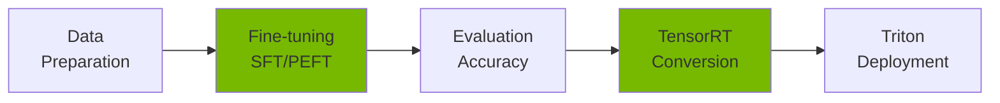
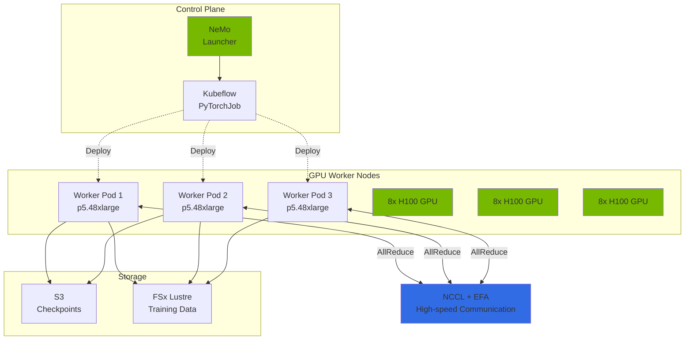
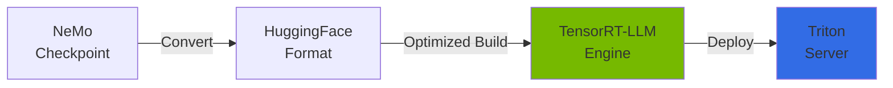
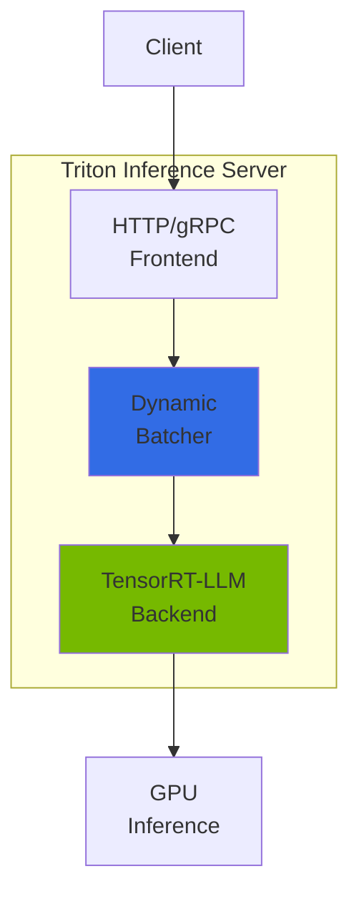
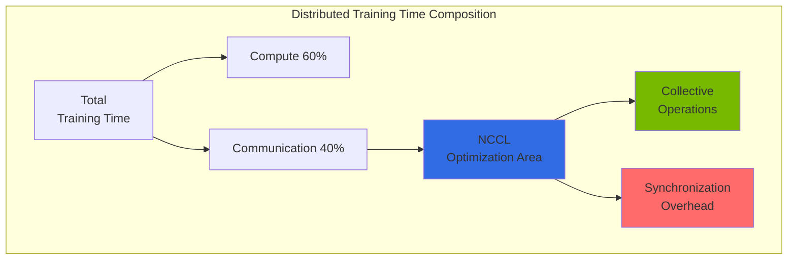
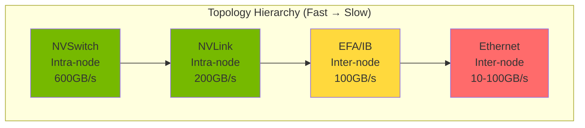

import { NemoComponents, GPURequirements, CheckpointSharding, MonitoringMetrics, NCCLImportance } from '@site/src/components/NemoTables';

# NeMo Framework

> **Written**: 2026-02-13 | **Updated**: 2026-04-05 | **Reading time**: ~4 min

NVIDIA NeMo is an end-to-end framework for training, fine-tuning, and optimizing large language models (LLMs). It supports distributed training and efficient model deployment in Kubernetes environments.

## Overview

### Problems NeMo Solves

When using general-purpose LLMs (GPT-4, Claude, etc.) in Agentic AI platforms, the following limitations exist:

- **Lack of domain knowledge**: Insufficient understanding of industry/company-specific terminology and context
- **Cost issues**: API costs surge with large-scale calls (token-per-request billing)
- **Latency**: Response delays from external API calls
- **Data privacy**: Cannot transmit sensitive data to external services
- **On-premises requirements**: Regulated industries (finance/healthcare) need self-hosted infrastructure

NeMo addresses these problems through **domain-specific model fine-tuning**.

### NeMo Core Features



<NemoComponents />

**Key Value:**

- **Efficient fine-tuning**: Train only 0.1% of total parameters with LoRA/QLoRA
- **Distributed training**: Automatic multi-node, multi-GPU parallelization (Tensor/Pipeline/Data Parallelism)
- **Inference optimization**: 2-4x performance improvement through TensorRT-LLM conversion
- **Enterprise support**: Checkpoint management, monitoring, production deployment pipeline

---

## EKS Deployment Architecture

### NeMo on EKS Configuration



### Container Configuration

**NeMo Container Image:**

```
nvcr.io/nvidia/nemo:25.02
├── PyTorch 2.5.1
├── CUDA 12.6
├── NCCL 2.23+
├── Megatron-LM (NeMo integrated)
├── TensorRT-LLM 0.13+
└── Triton Inference Server 2.50+
```

**Key Dependencies:**

- **Kubeflow Training Operator**: Distributed training orchestration via PyTorchJob CRD
- **GPU Operator**: Automatic NVIDIA driver, Device Plugin, DCGM installation
- **EFA Device Plugin**: Enable inter-node RDMA communication
- **Karpenter**: GPU node autoscaling

<GPURequirements />

---

## Fine-tuning Guide

### SFT (Supervised Fine-Tuning) Concept

**What is SFT?**: A method to improve specific task performance by additionally training a pre-trained model with domain-specific instruction-response data.

```
Pre-trained Model (general) → SFT → Domain-specific Model
```

**When to use?**

- Customer FAQ chatbot: Train on specific product/service Q&A
- Financial report generation: Train on financial terminology and formats
- Medical diagnostic assistance: Train on medical terminology and diagnostic patterns

**Data Format:**

```json
{"input": "What is EKS Auto Mode?", "output": "EKS Auto Mode is a fully managed Kubernetes compute option where AWS automatically handles node provisioning, scaling, and security patching."}
{"input": "What are Karpenter's key features?", "output": "Karpenter provides automatic node provisioning, bin-packing optimization, Spot instance integration, and drift detection capabilities."}
```

### PEFT/LoRA: Efficient Fine-tuning

**PEFT (Parameter-Efficient Fine-Tuning)**: Instead of training all model parameters, **train only adapter layers** to save memory and time.

**LoRA (Low-Rank Adaptation)**: The representative PEFT method that freezes original weights and **trains only two low-rank matrices (A, B)**.

```
Original weights W (freeze) + LoRA delta (A x B) = Final weights
```

**LoRA Key Parameters:**

| Parameter | Description | Recommended | Impact |
|-----------|-------------|-------------|--------|
| `r` (rank) | Rank of low-rank matrices | 8-64 | Higher = more expressive, more memory |
| `alpha` | Scaling factor | Same as r | Controls LoRA weight influence |
| `dropout` | Dropout rate | 0.1 | Prevents overfitting |
| `target_modules` | Layers to train | q_proj, v_proj | Attention layer selection |

**Memory Savings:**

- **Full Fine-Tuning (7B model)**: ~120GB VRAM needed (A100 80GB x 2)
- **LoRA Fine-Tuning (7B model)**: ~24GB VRAM needed (A100 80GB x 1)
- **Savings**: ~80% memory reduction

### Fine-tuning Execution Example

```python
# nemo_lora_finetune.py
from nemo.collections.llm import finetune
from nemo.collections.llm.peft import LoRA

# LoRA configuration
lora_config = LoRA(
    r=32,  # rank
    alpha=32,  # scaling
    dropout=0.1,
    target_modules=["q_proj", "v_proj", "k_proj", "o_proj"],
)

# Execute fine-tuning
model = finetune(
    model_path="/models/llama-3.1-8b.nemo",
    data_path="/data/train.jsonl",
    peft_config=lora_config,
    trainer_config={
        "devices": 8,  # 8 GPU
        "max_epochs": 3,
        "precision": "bf16",  # BFloat16 (A100/H100)
    },
    output_path="/output/llama-3.1-8b-finetuned",
)
```

**Detailed pipeline**: For data preprocessing, multi-node distributed training, and hyperparameter tuning, see the [Custom Model Pipeline](../reference-architecture/custom-model-pipeline.md) document.

---

## Checkpoint Management

### S3-based Checkpoint Storage

NeMo periodically saves **checkpoints (model state snapshots)** during training. This enables:

- **Training resumption**: Restart from last checkpoint on failure
- **Optimal model selection**: Select checkpoint with lowest validation loss
- **Version management**: Compare checkpoints across experiments

**S3 storage structure:**

```
s3://nemo-checkpoints/
└── llama-3.1-8b-finetune/
    ├── checkpoint-epoch=1-step=500/
    │   ├── model_weights.ckpt
    │   ├── optimizer_states.ckpt
    │   └── metadata.yaml
    ├── checkpoint-epoch=2-step=1000/
    └── checkpoint-epoch=3-step=1500/
```

### Large Model Checkpoint Sharding

For 70B+ large models, single checkpoint files reach hundreds of GB. NeMo uses **sharding** to split storage across multiple files.

<CheckpointSharding />

**Sharding configuration:**

```yaml
trainer:
  checkpoint:
    save_sharded_checkpoint: true
    shard_size_gb: 10  # Split in 10GB units
    num_workers: 8  # Parallel save workers
    compression: "gzip"  # Compression (optional)
```

### Checkpoint Conversion

```bash
# NeMo → HuggingFace conversion
python -m nemo.collections.llm.scripts.convert_nemo_to_hf \
  --input_path /checkpoints/llama-finetuned.nemo \
  --output_path /models/llama-finetuned-hf \
  --model_type llama
```

---

## TensorRT-LLM Conversion

### What is TensorRT-LLM?

NVIDIA TensorRT-LLM is an optimization engine for LLM inference. It converts PyTorch models into **highly optimized execution graphs**, improving inference speed by 2-4x.



### Performance Improvement Comparison

| Optimization Technique | Memory Savings | Speed Improvement | Description |
|----------------------|---------------|-------------------|-------------|
| **FP8 Quantization** | 50% | 1.5-2x | BFloat16 → FP8 (H100 only) |
| **PagedAttention** | 40% | - | KV Cache dynamic memory management |
| **In-flight Batching** | - | 2-3x | Continuous batch processing |
| **Kernel Fusion** | - | 1.3-1.5x | Operation kernel fusion |
| **Combined Effect** | **60-70%** | **2-4x** | Compound effect of above techniques |

### Conversion Concept

```python
from tensorrt_llm import LLM

# Convert HuggingFace model to TensorRT-LLM engine
llm = LLM(
    model="/models/llama-finetuned-hf",
    max_input_len=4096,
    max_output_len=2048,
    max_batch_size=64,
    dtype="fp8",  # FP8 quantization
    enable_paged_kv_cache=True,
    enable_chunked_context=True,
)

# Save engine
llm.save("/engines/llama-finetuned-trt")
```

**Conversion time**: ~10-20 minutes for a 7B model (1x A100)

---

## Triton Inference Server

### Triton and NeMo Relationship

**Triton Inference Server** is NVIDIA's production inference server that serves TensorRT-LLM engines via HTTP/gRPC API.

```
Client → Triton Server → TensorRT-LLM Backend → GPU
```

### Triton Architecture Concept



**Core Features:**

- **Dynamic batching**: Automatically group multiple requests to optimize GPU utilization
- **Model ensemble**: Connect multiple models in a pipeline (e.g., Tokenizer → LLM → Detokenizer)
- **Backend support**: TensorRT-LLM, PyTorch, ONNX, TensorFlow, etc.
- **Metrics collection**: Prometheus-compatible metrics (throughput, latency, GPU utilization)

---

## NCCL Distributed Communication

### NCCL's Role

**NCCL (NVIDIA Collective Communication Library)** is the core library responsible for **high-speed multi-GPU communication** in distributed GPU training.



**Why is it important?**

<NCCLImportance />

### Collective Operation Concepts

#### 1. AllReduce (Most Important)

Sums data from all GPUs and distributes the result to all GPUs.

```
Initial state:
GPU 0: [1, 2, 3]
GPU 1: [4, 5, 6]
GPU 2: [7, 8, 9]
GPU 3: [10, 11, 12]

After AllReduce:
All GPUs: [22, 26, 30]  # Element-wise sum
```

**Use case**: Averaging gradients from each GPU in distributed training

#### 2. AllGather

Collects data from all GPUs and distributes the full data to each GPU.

```
Initial state:
GPU 0: [1, 2]
GPU 1: [3, 4]

After AllGather:
All GPUs: [1, 2, 3, 4]
```

**Use case**: Gathering distributed tensors in Tensor Parallelism

#### 3. ReduceScatter

First sums data, then partitions and distributes to each GPU (inverse of AllGather).

```
Initial state:
GPU 0: [1, 2, 3, 4]
GPU 1: [5, 6, 7, 8]

After ReduceScatter:
GPU 0: [6, 8]   # (1+5), (2+6)
GPU 1: [10, 12] # (3+7), (4+8)
```

**Use case**: Passing intermediate results in Pipeline Parallelism

#### 4. Broadcast

Copies one GPU's data to all GPUs.

```
Initial state:
GPU 0: [1, 2, 3]
GPU 1: [0, 0, 0]

After Broadcast:
All GPUs: [1, 2, 3]
```

**Use case**: Distributing model checkpoints from the master GPU

### Network Topology Optimization

NCCL automatically detects the physical connection topology between GPUs and selects the optimal path.



**Per-topology algorithm selection:**

- **NVSwitch (H100 nodes)**: Tree algorithm (parallel broadcast)
- **NVLink (A100 nodes)**: Ring algorithm (circular transfer)
- **EFA inter-node**: Hierarchical algorithm (intra-node Ring → inter-node Tree)

### NCCL Tuning Parameters

```bash
# Core NCCL environment variables

# 1. Algorithm selection
export NCCL_ALGO=Ring  # or Tree

# 2. Protocol
export NCCL_PROTO=Simple  # Simple (throughput) or LL (latency)

# 3. Channel count (important!)
export NCCL_MIN_NCHANNELS=4
export NCCL_MAX_NCHANNELS=8  # More = higher bandwidth, more overhead

# 4. EFA settings (AWS)
export FI_PROVIDER=efa
export FI_EFA_USE_DEVICE_RDMA=1
export NCCL_IB_DISABLE=0

# 5. Debug
export NCCL_DEBUG=INFO  # Useful for diagnosing performance issues
```

**Recommended channel counts:**

- **8 GPU intra-node**: 4-8 channels
- **Multi-node (16+ GPUs)**: 8-16 channels
- **Large-scale (64+ GPUs)**: 16-32 channels

---

## Monitoring

### Key Metrics

<MonitoringMetrics />

**Monitoring stack**: Prometheus + Grafana + DCGM Exporter

For detailed monitoring setup, see [Monitoring and Observability Setup](../reference-architecture/monitoring-observability-setup.md).

---

## Related Documents

- [GPU Resource Management](./gpu-resource-management.md) - Karpenter, KEDA, DRA-based GPU autoscaling
- [vLLM Model Serving](./vllm-model-serving.md) - Production inference server
- [MoE Model Serving](./moe-model-serving.md) - Mixture of Experts architecture
- [Custom Model Pipeline](../reference-architecture/custom-model-pipeline.md) - Full pipeline from data preparation to deployment

:::tip Recommendations

- **Before fine-tuning**: Measure baseline performance with the base model
- **LoRA first**: 80% memory savings vs full fine-tuning
- **TensorRT-LLM essential**: 2-4x inference performance improvement
- **NCCL tuning**: 20-30% performance improvement possible through channel count and algorithm optimization in multi-node training

:::

:::warning Cautions

- **GPU costs**: Large-scale training can cost hundreds of thousands per hour. Actively use Spot instances and checkpoints
- **Checkpoints essential**: Configure automatic saving to persistent storage like S3 (prepare for node failure)
- **EFA security groups**: All traffic must be allowed within the same security group when using EFA
- **Memory overflow**: On OOM, decrease `micro_batch_size` or enable `gradient_checkpointing`

:::
