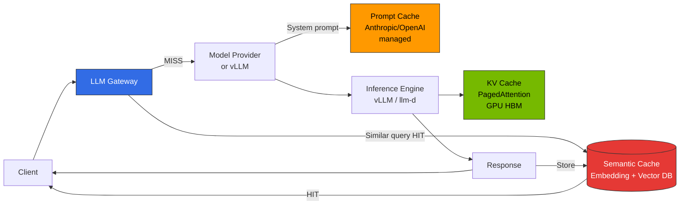
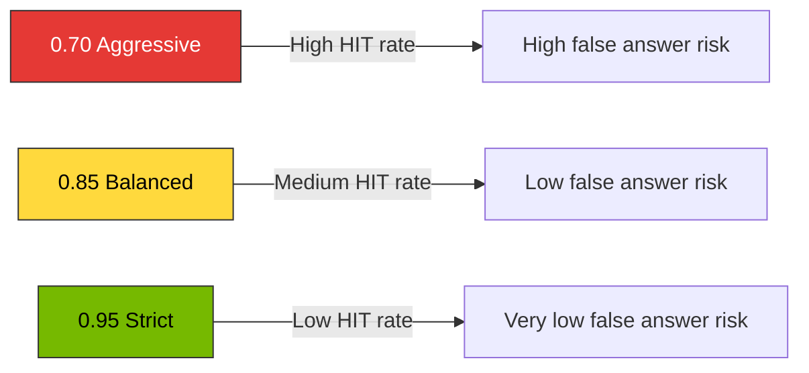

This document covers design principles and operational considerations for **gateway-level semantic caching** in LLM inference pipelines.

**Implementation Guide**: For tool comparison tables, gateway integration patterns, configuration examples, and deployment snippets, refer to [Inference Gateway Setup Guide — Semantic Caching Implementation Options](../../reference-architecture/inference-gateway/setup/advanced-features).

## 1. Overview

### Why Semantic Cache is Needed

In large-scale LLM services, user queries are often **semantically identical but differently expressed**. Traditional caches (HTTP cache, Redis key-value) that match exact strings cannot eliminate such duplicates. Semantic Cache detects semantically similar requests using **embedding-based similarity** and reuses previous responses, simultaneously improving three issues:

- **Token Cost Reduction**: Skip LLM calls on cache HITs, saving API costs and GPU time
- **Latency Reduction**: Respond with vector lookup (few ms) instead of generation latency (hundreds of ms to seconds)
- **GPU Capacity Expansion**: Effectively increase throughput in self-hosted vLLM/llm-d environments

### Expected Savings by Threshold

Savings rates vary significantly based on **user query repetitiveness**, **domain** (FAQ/customer support/code generation), and **prompt structure**, so the figures below are general ranges observed in public implementation documentation and vendor blogs. Each organization must validate actual effects through **progressive rollout** and A/B evaluation.

| Similarity Threshold | Operation Policy | Observed Savings Range | Characteristics |
|---------------------|------------------|------------------------|----------------|
| **0.95 (Strict)** | Cache only nearly identical queries | approximately 10-15% | Very low false positive risk, strict quality requirements |
| **0.85 (Balanced)** | Allow same meaning with different expressions | approximately 30-40% | Recommended default for general LLM chat/assistants |
| **0.70 (Aggressive)** | Group related topics together | approximately 50-60% | Only for FAQ/static KB with very high repetition |

Reference sources: [Redis — Building an LLM semantic cache](https://redis.io/blog/building-llm-applications-with-kernel-memory-and-redis/), [Portkey Semantic Cache docs](https://docs.portkey.ai/docs/product/ai-gateway/cache-simple-and-semantic), [Helicone Caching docs](https://docs.helicone.ai/features/advanced-usage/caching), [GPTCache README](https://github.com/zilliztech/GPTCache).

:::warning Always Validate Savings Numbers
The above figures are **rough ranges** based on public materials. Not all domains achieve the same HIT rate. Measure **actual HIT rate and false-positive rate for your workload** with dashboards (§6) before finalizing thresholds.
:::

---

## 2. Cache Layer Distinctions

LLM inference pipelines have **3 different cache layers**. Each operates at different positions, stores different units, and has different cost impacts. Semantic Cache **complements rather than replaces** the other two layers.

### 3-Layer Cache Flow

### Layer-by-Layer Comparison

| Aspect | KV Cache (vLLM PagedAttention) | Prompt Cache (Anthropic/OpenAI managed) | Semantic Cache (Gateway level) |
|--------|--------------------------------|----------------------------------------|-------------------------------|
| **Operation Location** | Inside inference engine (GPU HBM) | Model provider side | Gateway (Bifrost/LiteLLM/Portkey) front |
| **Storage Unit** | Token-level KV blocks | Explicit `cache_control` marked sections | Entire response object (text/JSON) |
| **Matching Method** | **Prefix exact match** | Provider-internal hash-based exact match | **Embedding cosine similarity** |
| **Primary Purpose** | TTFT & throughput improvement | Repeated system prompt cost reduction | **Eliminate duplicate LLM calls entirely** |
| **Cost Impact** | GPU time savings (self-hosted) | Input token price discount (managed) | Skip API calls entirely |
| **Failure Impact** | Performance degradation only | Cache not applied → regular pricing | **Direct response quality impact** (false answer risk) |
| **Related Docs** | [vLLM Model Serving](./vllm-model-serving.md) | Provider official docs | This document |

:::tip Three Layers Can Combine Independently
Semantic Cache HIT → immediate response (skip LLM call). On MISS, provider call → Prompt Cache reduces system prompt input cost → inference engine KV Cache improves generation speed. The three layers are **orthogonal** to each other, so enabling all simultaneously is common.
:::

### Application Timing Comparison

- **Prototype/single model**: KV Cache (automatic) + Prompt Cache (if provider supports) is sufficient
- **Multi-tenant/multi-provider**: Add Gateway-level Semantic Cache — absorbs patterns where identical queries repeat across multiple users
- **FAQ/chatbot/fixed KB**: Lower Semantic Cache threshold (0.80-0.85) for aggressive reuse
- **Code generation/IDE agents**: Apply Semantic Cache **conservatively** (0.95) or disable — similar queries often have different file contexts making reuse risky

---

## 3. Similarity Threshold Design

### Threshold Trade-offs

### Threshold Selection Criteria

| Threshold | Suitable Workloads | Unsuitable Workloads | Notes |
|-----------|-------------------|---------------------|-------|
| **0.95 and above** | Code generation, legal/medical assistants, financial advisory | (Broadly applicable) | Only HITs on identical queries with minimal expression differences |
| **0.85-0.94 (Recommended)** | General chatbots, customer support, document summarization, product Q&A | Code generation (context-sensitive) | Same meaning with different expressions allowed. Default for most services |
| **0.75-0.84** | FAQ, static KB, internal document search explanations | Conversational reasoning, multi-turn | Increased false positives — response validation layer needed |
| **0.70 and below** | Rarely used — limited to high-volume FAQ | All general services | Risk of grouping unrelated queries |

### Considerations When Setting Thresholds

1. **User Error Tolerance**: Lower if "closest answer" suffices like customer support; higher for code/calculations
2. **Domain Vocabulary Diversity**: Domains with many term synonyms (medical/legal) tend to group meanings well even at lower thresholds
3. **Embedding Model Quality**: Stronger embeddings (e.g., `text-embedding-3-large`, `bge-m3`) maintain safety even at lower thresholds
4. **Conversation Context**: Multi-turn conversations must include previous turns in hash keys (§5)
5. **Language/Locale**: Multilingual services should separate namespaces by language to prevent cross-contamination

:::warning Thresholds are Not Fixed Values but Tuning Targets Based on Observation
Start conservatively at 0.90, then adjust by 0.05 increments while monitoring **HIT rate and user dissatisfaction metrics (👎, regenerate clicks)** on Langfuse/Grafana dashboards.
:::

---

## 4. Implementation Considerations

When implementing Semantic Cache, select solutions considering these factors.

### Key Considerations

1. **Existing Infrastructure Reusability**: Can implement without additional backends if Redis/Milvus vector DB already exists
2. **Gateway Integration Needs**: Whether to integrate routing, guardrails, and cache in unified management or separate layers
3. **Managed vs Self-hosted**: Operational burden, compliance, cost trade-offs
4. **Observability Requirements**: Cache HIT/MISS tracking, false-positive monitoring level
5. **Vector Search Engine Preference**: Organization's standard stack among Redis/Milvus/FAISS/Qdrant

### Implementation Patterns

**Pattern A: Gateway All-in-one** — Routing, cache, observability in single product (e.g., Portkey, Helicone)
- Pros: Integrated configuration, rapid deployment
- Cons: Vendor lock-in, advanced features depend on managed plans

**Pattern B: Modular** — Gateway (Bifrost/LiteLLM) + independent cache layer (RedisVL, GPTCache)
- Pros: Independent layer replacement possible, open source first
- Cons: Increased integration complexity

**Pattern C: Managed** — Redis Enterprise LangCache, Portkey SaaS
- Pros: Minimal operational burden, compliance certifications included
- Cons: Cost, region constraints

For specific tool comparison tables, configuration examples, and deployment snippets, refer to [Inference Gateway Setup Guide — Semantic Caching Implementation Options](../../reference-architecture/inference-gateway/setup/advanced-features).

---

## 5. Cache Key Design and Multi-tenancy

Since Semantic Cache sits **at the gateway front** and skips LLM calls entirely, cache key design and namespace separation directly impact response quality, security, and multi-tenancy.

### Cache Key Components

The simplest key is just `embedding(user_query)`, but in real services, the following elements **must** be included in the key:

**Required Components:**
- `model_id`: Prevent cross-contamination between model types/versions (e.g., `glm-5` ≠ `qwen3-4b`)
- `system_prompt_hash`: Different system prompts produce completely different answers
- `tenant_id | user_id`: Multi-tenant/per-user isolation
- `language | locale`: Prevent language cross-contamination
- `tool_set_hash`: Agent's available tool set
- `embedding(user_query)`: Semantic similarity matching target

### Multi-tenant Namespace Strategy

| Layer | Namespace Pattern Example | Isolation Purpose |
|-------|--------------------------|-------------------|
| **Organization / Tenant** | `cache:{tenantId}:*` | Data isolation, audit boundaries |
| **User** | `cache:{tenantId}:{userId}:*` | Prevent cross-user leakage of PII-containing queries |
| **Language** | `cache:{tenantId}:ko:*` / `:en:*` | Prevent cross-contamination in multilingual services |
| **Domain** | `cache:{tenantId}:support:*` / `:billing:*` | Block reuse between domains with different contexts |
| **Model Version** | `cache:{...}:glm-5:v2026-03:*` | Enable bulk invalidation on model upgrades |

### Non-determinism Handling

Requests with `temperature > 0`, `top_p < 1`, or tool calls produce **different responses each time**, so simple reuse can degrade user experience.

**Recommended Policy:**
- **Default cache disabled** for streaming/agent-type requests
- Selectively allow only on endpoints with guaranteed reproducibility (e.g., `/summarize`, `/classify`)
- Recommend routing rules that cache only `temperature=0` requests

For specific gateway integration patterns (kgateway, LiteLLM, Bifrost), configuration examples, and code snippets, refer to [Inference Gateway Setup Guide — Semantic Caching Implementation Options](../../reference-architecture/inference-gateway/setup/advanced-features).

---

## 6. Observability (Langfuse Integration)

Semantic Cache is a layer that **directly impacts users**, making it unoperational without observability. Collect the following with Langfuse or equivalent observability stack:

### Langfuse Trace Tags

Attach these attributes to each request trace (Langfuse Python/TypeScript SDK supports via `metadata` or `tags`):

- `cache_hit`: `true` / `false`
- `similarity_score`: `0.92` (on HIT, highest matched similarity)
- `cache_source`: `redis-semantic` / `portkey` / `helicone`, etc.
- `cache_namespace`: `{tenant}:{lang}:{domain}` (no PII)
- `cache_ttl_remaining_s`: Remaining TTL (for debugging)
- `cache_eviction_reason`: MISS cause (`below_threshold`, `namespace_miss`, `ttl_expired`)

### Recommended Dashboard Panels

Visualize the following with Langfuse custom dashboards or Prometheus + Grafana:

| Panel | Query/Metric | Target Value |
|-------|--------------|--------------|
| **Overall HIT Rate** | `count(cache_hit=true) / count(*)` | 15-40% (varies by service characteristics) |
| **HIT Rate by Namespace** | group by `cache_namespace` | Monitor tenant variance |
| **similarity_score Distribution** | histogram of `similarity_score` on HIT | Watch for excessive bins near threshold |
| **False-positive Proxy** | 👎 feedback / regenerate click rate (where cache_hit=true) | No increase vs baseline |
| **Total Saved Tokens** | `sum(tokens_saved)` on HIT | Cost reporting |
| **Cache Store Size** | Redis `DBSIZE`, memory usage | Check TTL & eviction policy |

### Alert Rules

| Alert | Condition | Severity |
|-------|-----------|----------|
| HIT Rate Plunge | HIT rate &lt; 50% of previous 24h average | Warning — possible embedding/Redis failure |
| Abnormal HIT Rate Increase | HIT rate &gt; 70% + false-positive proxy increase | Critical — suspected threshold misconfiguration |
| similarity_score Concentration | HIT ratio within threshold ±0.02 &gt; 40% | Warning — excessive borderline matching |
| Redis Latency | P99 &gt; 20ms | Warning — cache becoming bottleneck |

### Langfuse OTel Integration Reference

For Bifrost/LiteLLM OTel transmission configuration, follow existing [LLMOps Observability](../../operations-mlops/observability/llmops-observability) and [Inference Gateway Setup Guide](../../reference-architecture/inference-gateway/setup) documents. Cache-related tags are added as span attributes at the application/gateway plugin layer.

---

## 7. Practical Checklist

### Security & Privacy

- Prohibit caching prompts containing PII (place Guardrails **before** Semantic Cache)
- Prohibit cache storage on prompt injection detection
- Prevent cross-tenant leakage (enforce namespace design with unit tests)
- Retain audit logs for minimum 90 days (HIT/MISS, namespace, similarity_score)

### Operations & Lifecycle

- **TTL**: Static KB 7-30 days / product info 1-24h / news & time-series disable
- **Model Version Replacement**: Include version in key (`glm-5:v2026-03`) → natural expiration
- **Embedding Model Replacement**: Full rebuild required
- **Failure Fallback**: Fail-open on Redis failure (secure original rate limit in advance)
- **Progressive Rollout**: Validate new policies with A/B testing

### Quality Guardrails

- Prohibit or use short TTL for large responses & tool call results
- Auto-evict entries on user 👎 feedback
- Weekly evaluation of cache HIT samples (Ragas/LLM-judge)

### Pre-deployment Checklist

- [ ] Cache key includes `model_id`, `system_prompt_hash`, `tenant_id`, `language`
- [ ] Guardrails positioned before cache
- [ ] Record `cache_hit`, `similarity_score` in Langfuse traces
- [ ] Configure HIT rate / false-positive dashboard
- [ ] Validate Redis failure fail-open scenario

---

## 8. Domain-specific Application Patterns

Even with the same Semantic Cache engine, **key composition, thresholds, and TTL** vary significantly by domain.

| Domain | Threshold | TTL | Characteristics |
|--------|-----------|-----|----------------|
| **FAQ / Product Q&A** | 0.80-0.85 | 24-72h | Repetitive queries, fixed answers. Key: `tenant+language+product_version` |
| **Internal KB** | 0.85-0.90 | 1-7d | Prioritize isolation by permission. Key: `tenant+role_hash+language` |
| **Customer Support** | 0.85 | 6-24h | Redact PII with Guardrails before embedding. Key: `tenant+intent+language` |
| **Code Generation/IDE** | 0.97+ or disabled | 30m-2h | High context dependency. Disable for refactoring/debugging |

**Considerations:**
- FAQ/Product Q&A: Natural invalidation via `product_version` key on product changes
- Internal KB: Flush user namespace on ACL changes
- Customer Support: PII (names, order numbers) must pass through Guardrails
- Code Generation: Different file/repo contexts require different answers for same queries

---

## 9. FAQ

**Q1. How do Semantic Cache and RAG differ?**  
RAG retrieves context from vector DB to generate new responses; Semantic Cache reuses existing complete responses. RAG augments input before LLM calls; Semantic Cache avoids LLM calls entirely.

**Q2. Can streaming responses be cached?**  
Yes, but reassembly/replay complexity is high. Recommend starting with non-streaming endpoints.

**Q3. What are embedding model selection criteria?**  
Multilingual: `bge-m3`, `text-embedding-3-large`. English-only: `text-embedding-3-small`. Full cache invalidation required on model changes.

**Q4. Why is caching `temperature > 0` requests risky?**  
Users deliberately set high temperature for diverse answers; returning the same answer violates expectations. Disable cache by default for creative endpoints.

**Q5. What if cache HIT rate is low?**  
Check namespace over-segmentation → lower threshold by 0.05 → evaluate embedding model quality in that order. 10-15% HIT rate is normal for non-FAQ workloads.

**Q6. What about compliance for cached responses?**  
Medical/financial/legal domains may require audit log recording even for cache HITs. Always log `cache_hit=true` and comply with regulatory retention periods.

---

## 10. References

### Official Documentation & Repositories

- [Redis — Semantic Caching (RedisVL)](https://redis.io/docs/latest/develop/ai/redisvl/user_guide/semantic_caching/)
- [Redis LangCache (managed)](https://redis.io/langcache/)
- [Portkey — Semantic Cache](https://docs.portkey.ai/docs/product/ai-gateway/cache-simple-and-semantic)
- [Helicone — Caching](https://docs.helicone.ai/features/advanced-usage/caching)
- [LiteLLM — Caching](https://docs.litellm.ai/docs/proxy/caching)
- [Bifrost Official Docs](https://www.getmaxim.ai/bifrost/docs)
- [GPTCache (Zilliz)](https://github.com/zilliztech/GPTCache)

### Related Documents

- **Implementation Guide**: [Inference Gateway Setup Guide — Semantic Caching Implementation Options](../../reference-architecture/inference-gateway/setup/advanced-features) — Tool comparison tables, configuration examples, deployment snippets
- [Inference Gateway Routing Strategy](../../reference-architecture/inference-gateway/routing-strategy)
- [OpenClaw AI Gateway Deployment](../../reference-architecture/inference-gateway/openclaw-example.md)
- [LLMOps Observability](../../operations-mlops/observability/llmops-observability)
- [Milvus Vector Database](../../operations-mlops/data-infrastructure/milvus-vector-database)
- [Ragas Evaluation](../../operations-mlops/governance/ragas-evaluation)

### Research & Background

- [Anthropic — Prompt Caching](https://docs.anthropic.com/en/docs/build-with-claude/prompt-caching)
- [OpenAI — Prompt Caching](https://platform.openai.com/docs/guides/prompt-caching)
- [vLLM — PagedAttention (KV Cache)](https://docs.vllm.ai/en/latest/design/paged_attention.html)
