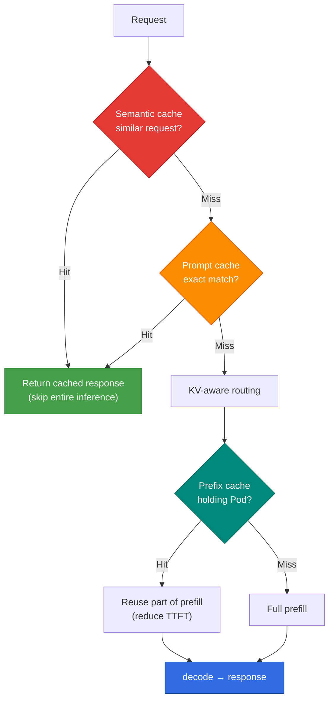

## Overview

Inference caching is not a single layer but consists of **three layers with different hit conditions**. Each layer avoids a different scope of computation and has different levers to raise its hit rate and different measurement points. This document unifies the KV/Prefix, Prompt, and Semantic caches into a single decision framework and organizes per-layer hit-rate targets and tuning methods.

The detailed implementation of each layer is covered in dedicated documents. This document serves as a map for **looking at all three layers together to decide where to tune**. Its position in the overall inference infrastructure corresponds to the L5 cache layer in the [Inference Infrastructure Overview](../index.md).

## 3-Layer Cache Comparison

| Layer | Hit Condition | Computation Avoided | Hit Unit | Detailed Document |
|------|----------|-------------|----------|----------|
| **KV / Prefix Cache** | Same prefix (system prompts, common context) | Part of prefill | Pod or shared KV layer | [KV Cache Optimization](./kv-cache-optimization.md) |
| **Prompt Cache** | Exact-match request | Entire inference | Gateway / app | [Routing Strategy](../inference-routing/routing-strategy.md) |
| **Semantic Cache** | Semantically similar request (embedding similarity) | Entire inference | Gateway / app | [Semantic Caching Strategy](./semantic-caching-strategy.md) |

The three layers are not mutually exclusive. It is common to **stack them**: avoid entire inference at the gateway via Semantic and Prompt caches, and on cache miss reduce prefill via KV/Prefix cache at the serving engine.

## Hit-Rate Strategy by Layer

### KV / Prefix Cache

Prefix cache reuses prefill for requests that share the same system prompt or common context. The levers that raise the hit rate are as follows.

- **Prompt structure alignment**: Fixing the invariant part (system prompts and few-shot examples) at the front of the request lengthens the prefix-match segment.
- **KV cache-aware routing**: Sends requests sharing the same prefix to the Pod holding the cache. Round-Robin neutralizes this cache (see [Limitations of Conventional L7 Gateways](../index.md#limitations-of-conventional-l7-gateways)).
- **Shared KV layer (LMCache)**: Extends the cache outside the GPU, allowing reuse across Pods and nodes (see [LMCache](./lmcache.md)).

For detailed behavior, see [KV Cache Optimization](./kv-cache-optimization.md).

### Prompt Cache (Exact Match)

Returns a stored response for a completely identical request. The implementation is simple and free of false-hit risk, but a single-character difference produces a miss. It is effective for formalized requests (fixed templates, batch jobs).

### Semantic Cache (Similarity Match)

Converts requests to embeddings and returns the response of a **semantically similar** past request. Hit rate and accuracy depend on the similarity threshold.

- **High threshold**: Accurate but low hit rate.
- **Low threshold**: High hit rate but increased risk of returning inaccurate responses (false hits).

Threshold design, cache key composition, and multi-tenancy handling are covered in detail in [Semantic Caching Strategy](./semantic-caching-strategy.md).

## Hit-Rate Targets and Measurement

Cache effectiveness cannot be managed without measurement. Hit rates must be measured separately per layer, looking at both gateway and serving-engine metrics.

| Metric | Measurement Point | Reference Target |
|------|----------|----------|
| **KV Cache Hit Rate** | Serving engine (vLLM metrics) | 60%+ in shared-prompt workloads |
| **Semantic Cache Hit Rate** | LLM API Gateway | Workload-dependent; 30%+ produces a clear cost effect |
| **False Hit Rate** | Semantic cache quality verification | Minimize via threshold tuning |

:::warning Cache hit rates are workload-dependent
The targets above are reference values for workloads with many shared prompts and repeated queries. For high-diversity requests, the same targets may be unrealistic, so start from a baseline measured on actual traffic.
:::

For observability integration (Langfuse OTel) and dashboard panel composition, see [Semantic Caching Strategy — Observability](./semantic-caching-strategy.md#6-observability-langfuse-integration) and [Routing Strategy — Monitoring & Observability](../inference-routing/routing-strategy.md#monitoring--observability).

## References

### Official Documentation
- [vLLM Automatic Prefix Caching](https://docs.vllm.ai/en/latest/features/automatic_prefix_caching.html) — Official vLLM Prefix Caching documentation
- [Langfuse Documentation](https://langfuse.com/docs) — Observability tool for tracking cache hit rates

### Papers / Tech Blogs
- [PagedAttention (SOSP 2023)](https://arxiv.org/abs/2309.06180) — Foundational paper on KV cache management
- [GPTCache](https://github.com/zilliztech/GPTCache) — Open-source implementation of a Semantic cache

### Related Documents (Internal)
- [KV Cache Optimization](./kv-cache-optimization.md) — Prefix Caching and KV Cache-Aware Routing
- [Semantic Caching Strategy](./semantic-caching-strategy.md) — Similarity threshold and cache-key design
- [LMCache](./lmcache.md) — Shared KV cache layer
