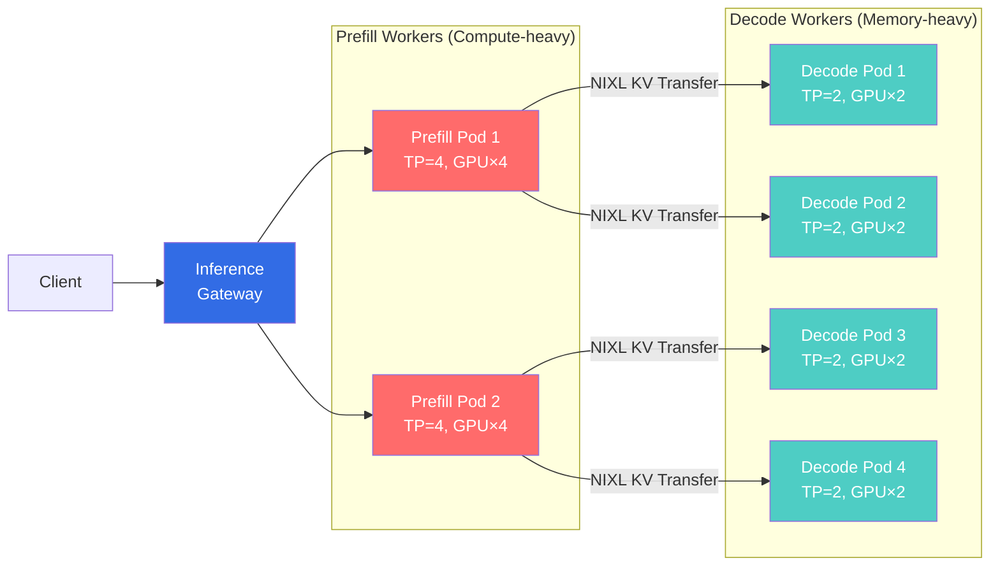
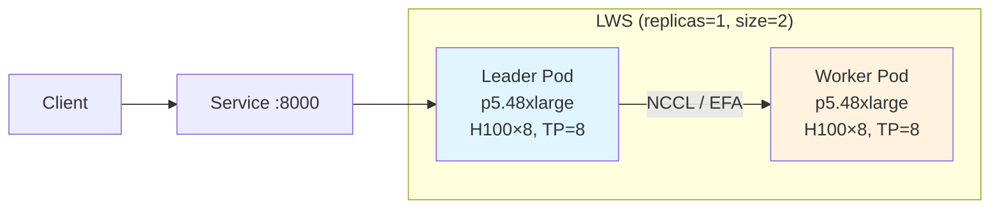

## Overview

Large LLM inference is divided into two fundamentally different computational stages (Prefill / Decode), each with different hardware requirement profiles. 700B+ models cannot fit in a single node, requiring multi-node pipeline parallelization. This document covers **Disaggregated Serving** architecture and **LeaderWorkerSet (LWS)**-based multi-node deployment patterns.

## Disaggregated Serving

### Need for Prefill/Decode Separation

LLM inference consists of two fundamentally different computational stages.

| Stage | Characteristics | Bottleneck | GPU Requirements |
|------|------|------|---------|
| **Prefill** | Process entire input prompt | Compute-bound | High compute capability (TP=4) |
| **Decode** | Sequential token-by-token generation | Memory-bound | High memory bandwidth (TP=2) |

Processing both stages in the same Pod causes Prefill's compute load to worsen Decode's latency. Separation enables independent scaling of each stage, maximizing GPU utilization.

### Separation Architecture



### NIXL: Common KV Cache Transfer Engine

NIXL (NVIDIA Inference Xfer Library) is the common KV transfer engine used by most projects including llm-d, Dynamo, production-stack, and aibrix. It provides ultra-fast GPU-to-GPU KV Cache transfer leveraging NVLink/RDMA.

### Disaggregated Serving on EKS Auto Mode

Since MIG partitioning is not possible on Auto Mode, **roles are separated at the instance (node) level**.

```yaml
# Prefill-dedicated NodePool
apiVersion: karpenter.sh/v1
kind: NodePool
metadata:
  name: gpu-prefill
spec:
  template:
    metadata:
      labels:
        llm-d-role: prefill
    spec:
      requirements:
        - key: eks.amazonaws.com/instance-family
          operator: In
          values: ["p5"]
      nodeClassRef:
        group: eks.amazonaws.com
        kind: NodeClass
        name: default
      taints:
        - key: llm-d-role
          value: prefill
          effect: NoSchedule
---
# Decode-dedicated NodePool
apiVersion: karpenter.sh/v1
kind: NodePool
metadata:
  name: gpu-decode
spec:
  template:
    metadata:
      labels:
        llm-d-role: decode
    spec:
      requirements:
        - key: eks.amazonaws.com/instance-family
          operator: In
          values: ["p5"]
      nodeClassRef:
        group: eks.amazonaws.com
        kind: NodeClass
        name: default
      taints:
        - key: llm-d-role
          value: decode
          effect: NoSchedule
```

**GPU Placement Strategy:**
- Prefill: 2 Prefill Pods per p5.48xlarge (each TP=4, 4 GPUs)
- Decode: 4 Decode Pods per p5.48xlarge (each TP=2, 2 GPUs)
- Minimizes GPU idle time

## LWS-Based Multi-Node Large Model Serving

### LeaderWorkerSet Overview

700B+ large MoE models cannot fit in a single node (8× GPUs), requiring multi-node pipeline parallelization. [LeaderWorkerSet (LWS)](https://github.com/kubernetes-sigs/lws) is a Kubernetes-native multi-node workload pattern that enables **multi-node Pipeline Parallelism without Ray**.



### LWS vs Ray Comparison

| Item | LWS + vLLM | Ray + vLLM |
|------|-----------|-----------|
| **Dependencies** | LWS CRD only | Ray Cluster (head + worker) |
| **Complexity** | Low | High |
| **Pod Management** | K8s StatefulSet-based | Ray's own scheduler |
| **Failure Recovery** | RecreateGroupOnPodRestart | Ray reconnection |
| **EKS Auto Mode** | Compatible | Compatible |

### Deployment Example: GLM-5 744B (PP=2, TP=8)

```yaml
apiVersion: leaderworkerset.x-k8s.io/v1
kind: LeaderWorkerSet
metadata:
  name: vllm-glm5-fp8
  namespace: agentic-serving
spec:
  replicas: 1
  leaderWorkerTemplate:
    size: 2  # leader + worker = 2 pods (16 GPUs)
    restartPolicy: RecreateGroupOnPodRestart
    leaderTemplate:
      spec:
        tolerations:
          - key: nvidia.com/gpu
            operator: Exists
            effect: NoSchedule
        containers:
          - name: vllm
            image: vllm/vllm-openai:v0.18.1
            command: ["vllm", "serve"]
            args:
              - "zai-org/GLM-5-FP8"
              - "--tensor-parallel-size=8"
              - "--pipeline-parallel-size=2"
              - "--gpu-memory-utilization=0.92"
              - "--enable-prefix-caching"
            env:
              - name: VLLM_USE_DEEP_GEMM
                value: "1"
              - name: NCCL_DEBUG
                value: "INFO"
            resources:
              requests:
                nvidia.com/gpu: "8"
            volumeMounts:
              - name: model-cache
                mountPath: /models
              - name: dshm
                mountPath: /dev/shm
        volumes:
          - name: model-cache
            emptyDir:
              sizeLimit: 1Ti
          - name: dshm
            emptyDir:
              medium: Memory
              sizeLimit: 32Gi
    workerTemplate:
      spec:
        # Same container spec as leader (only node-rank differs in args)
        tolerations:
          - key: nvidia.com/gpu
            operator: Exists
            effect: NoSchedule
        containers:
          - name: vllm
            image: vllm/vllm-openai:v0.18.1
            command: ["vllm", "serve"]
            args:
              - "zai-org/GLM-5-FP8"
              - "--tensor-parallel-size=8"
              - "--pipeline-parallel-size=2"
              - "--gpu-memory-utilization=0.92"
              - "--enable-prefix-caching"
            env:
              - name: VLLM_USE_DEEP_GEMM
                value: "1"
            resources:
              requests:
                nvidia.com/gpu: "8"
            volumeMounts:
              - name: model-cache
                mountPath: /models
              - name: dshm
                mountPath: /dev/shm
        volumes:
          - name: model-cache
            emptyDir:
              sizeLimit: 1Ti
          - name: dshm
            emptyDir:
              medium: Memory
              sizeLimit: 32Gi
```

### NCCL / EFA Network Optimization

Inter-node communication performance is critical in multi-node pipeline parallelization. p5.48xlarge provides 3,200 Gbps EFA (Elastic Fabric Adapter).

```yaml
# NCCL environment variable optimization (add to LWS Pod)
env:
  - name: NCCL_DEBUG
    value: "INFO"
  - name: FI_PROVIDER
    value: "efa"
  - name: FI_EFA_USE_DEVICE_RDMA
    value: "1"
  - name: NCCL_ALGO
    value: "Ring"           # Ring is suitable for multi-node PP
  - name: NCCL_PROTO
    value: "Simple"         # Stable on EFA
  - name: NCCL_MIN_NCHANNELS
    value: "4"
```

:::tip LWS Failure Recovery
Setting `restartPolicy: RecreateGroupOnPodRestart` recreates the entire group when either Leader or Worker Pod fails. Multi-node NCCL communication requires all nodes to be synchronized, making full restart more stable than partial restart.
:::

## References

### Official Documentation
- [LeaderWorkerSet GitHub](https://github.com/kubernetes-sigs/lws) — K8s native multi-node workload
- [NVIDIA Dynamo Disaggregated Serving](https://developer.nvidia.com/dynamo) — Prefill/Decode separation design
- [Elastic Fabric Adapter (EFA)](https://docs.aws.amazon.com/AWSEC2/latest/UserGuide/efa.html) — p5.48xlarge 3,200Gbps RDMA
- [NCCL Tuning Guide](https://docs.nvidia.com/deeplearning/nccl/user-guide/docs/env.html) — Multi-node communication optimization

### Papers & Technical Blogs
- [DistServe (OSDI 2024)](https://arxiv.org/abs/2401.09670) — "DistServe: Disaggregating Prefill and Decoding for Goodput-optimized Large Language Model Serving"
- [Splitwise Paper (Microsoft)](https://arxiv.org/abs/2311.18677) — "Splitwise: Efficient Generative LLM Inference Using Phase Splitting"
- [llm-d Disaggregated Design](https://llm-d.ai/docs/architecture/disaggregated-serving) — llm-d disaggregated serving architecture
- [NIXL Overview (NVIDIA)](https://developer.nvidia.com/blog/introducing-nvidia-dynamo-a-low-latency-distributed-inference-framework-for-scaling-reasoning-ai-models/) — Common KV transfer engine

### Related Documentation
- [KV Cache Optimization (vLLM Deep Dive + Cache-Aware Routing)](./kv-cache-optimization.md) — vLLM parallelization strategies
- [GPU Resources · Observability · Hybrid Node · Lessons Learned](./cost-optimization.md) — NodePool-based autoscaling
- [MoE Model Serving Guide](../inference-frameworks/moe-model-serving.md) — MoE model deployment
- [llm-d-based EKS Distributed Inference](../inference-frameworks/llm-d-eks-automode.md) — llm-d deployment guide
