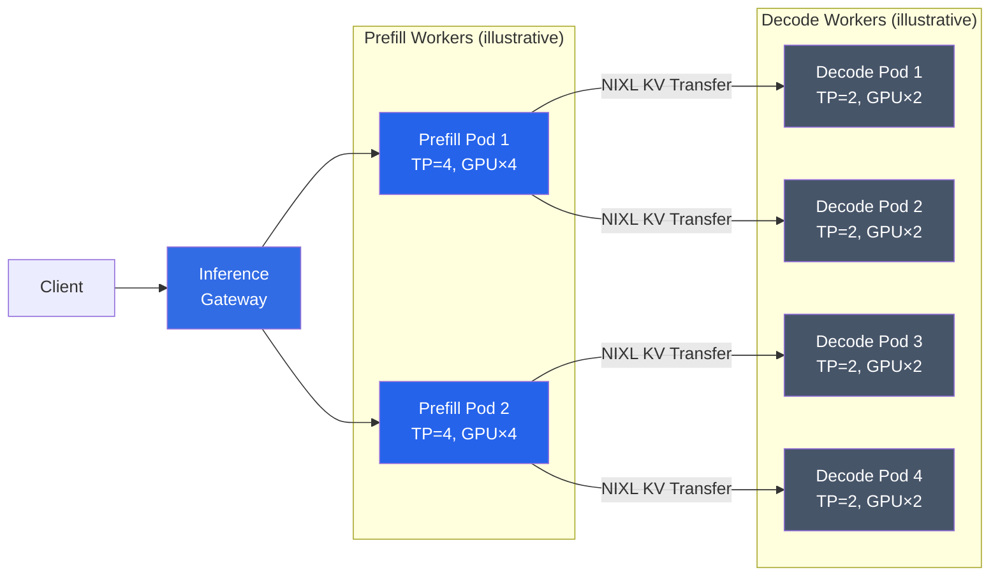
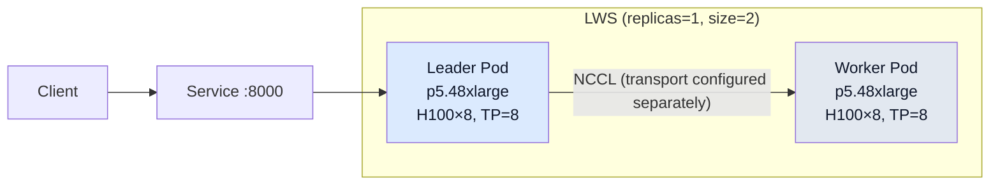

## Overview

LLM inference has two stages: prefill processes the input, and decode generates subsequent tokens. Their resource demands depend on the model, request lengths and batching. The weights, KV cache and runtime state kept on the GPU must fit its available memory. Quantization, offloading and supported parallelism strategies change that calculation. Check host-memory capacity separately when using offloading.

This document explains two configurations. **Disaggregated Serving** runs prefill and decode separately. The later **LeaderWorkerSet (LWS)** example uses TP/PP to run one model replica across two nodes.

## Disaggregated Serving

### Need for Prefill/Decode Separation

LLM inference consists of two fundamentally different computational stages.

| Stage | Characteristics | Common limiting resource | Sizing considerations |
|------|------|------|---------|
| **Prefill** | Process the input prompt | Compute throughput, especially for long inputs | Input length, batching, available compute and model memory |
| **Decode** | Generate subsequent tokens sequentially | Weight/KV memory traffic, especially at small batch sizes | Active sequences, context length, memory bandwidth and capacity |

These are workload-dependent tendencies. TP=4 and TP=2 in the diagram are illustrative choices, not requirements of either stage. Each stage must independently fit its model and runtime state at its chosen parallelism.

When prefill for a long input overlaps another request's decode in the same Pod, processing the input can delay token generation. Separating the stages lets you adjust Pod counts for prefill and decode independently. The stages must then transfer KV-cache data between them, so compare transfer cost and token-generation latency alongside GPU utilization.

### Separation Architecture

The diagram shows one possible allocation and the direction of KV transfer. The serving framework must also coordinate prefill/decode selection, KV metadata and the response stream; those control and response paths are omitted. This layout is not the GLM-5 deployment later in this document.


```mermaid
flowchart LR
    C[Client] --> GW[Inference<br/>Gateway]

    subgraph Prefill["Prefill Workers (illustrative)"]
        PF1[Prefill Pod 1<br/>TP=4, GPU×4]
        PF2[Prefill Pod 2<br/>TP=4, GPU×4]
    end

    subgraph Decode["Decode Workers (illustrative)"]
        DC1[Decode Pod 1<br/>TP=2, GPU×2]
        DC2[Decode Pod 2<br/>TP=2, GPU×2]
        DC3[Decode Pod 3<br/>TP=2, GPU×2]
        DC4[Decode Pod 4<br/>TP=2, GPU×2]
    end

    GW --> PF1
    GW --> PF2
    PF1 -->|"NIXL KV Transfer"| DC1
    PF1 -->|"NIXL KV Transfer"| DC2
    PF2 -->|"NIXL KV Transfer"| DC3
    PF2 -->|"NIXL KV Transfer"| DC4

    style GW fill:#326ce5,color:#fff
    style PF1 fill:#2563eb,color:#fff
    style PF2 fill:#2563eb,color:#fff
    style DC1 fill:#475569,color:#fff
    style DC2 fill:#475569,color:#fff
    style DC3 fill:#475569,color:#fff
    style DC4 fill:#475569,color:#fff
```

### NIXL: Common KV Cache Transfer Engine

[NIXL](https://github.com/ai-dynamo/nixl/blob/492aca7ce6743570b4cc0857983628ae34ca13c9/README.md) provides a plugin-based data-transfer layer that frameworks can use for KV-cache movement. It is not a scheduler and does not make disaggregation automatic. The [llm-d v0.8.1 P/D guide](https://github.com/llm-d/llm-d/blob/v0.8.1/docs/well-lit-paths/foundations/pd-disaggregation.md) describes NIXL integration and supports TCP while recommending high-bandwidth networking. GPU-direct transfer and achievable bandwidth depend on the selected backend, device visibility, drivers and physical topology. Do not assume that NVLink connects separate EC2 nodes or that installing NIXL establishes an RDMA path.

### Disaggregated Serving on EKS Auto Mode

P/D separation does not require MIG: separate Pods can request distinct whole GPUs on the same node when resources and scheduling constraints permit. **Dedicated role NodePools** are an optional placement and scaling policy. The following examples assume EKS Auto Mode GPU support and an existing `default` NodeClass; they select `p5.48xlarge` explicitly so the eight-GPU arithmetic refers to that instance type.

```yaml
# Prefill-dedicated NodePool
apiVersion: karpenter.sh/v1
kind: NodePool
metadata:
  name: gpu-prefill
spec:
  template:
    metadata:
      labels:
        llm-d-role: prefill
    spec:
      requirements:
        - key: node.kubernetes.io/instance-type
          operator: In
          values: ["p5.48xlarge"]
      nodeClassRef:
        group: eks.amazonaws.com
        kind: NodeClass
        name: default
      taints:
        - key: llm-d-role
          value: prefill
          effect: NoSchedule
---
# Decode-dedicated NodePool
apiVersion: karpenter.sh/v1
kind: NodePool
metadata:
  name: gpu-decode
spec:
  template:
    metadata:
      labels:
        llm-d-role: decode
    spec:
      requirements:
        - key: node.kubernetes.io/instance-type
          operator: In
          values: ["p5.48xlarge"]
      nodeClassRef:
        group: eks.amazonaws.com
        kind: NodeClass
        name: default
      taints:
        - key: llm-d-role
          value: decode
          effect: NoSchedule
```

**GPU Placement Strategy:**

- Eight GPU slots allow at most two four-GPU prefill Pods or four two-GPU decode Pods by GPU count alone. This is neither a measured stage ratio nor a utilization guarantee.
- The model must fit each stage's GPU allocation; CPU, memory, storage, topology constraints and other workloads can further limit placement.
- A NodePool does not configure stage workloads. Merge the following placement/resource fields into the corresponding framework Deployments, retaining their image, commands, ports and KV-transfer/routing configuration. Configure TP=4/TP=2 in those runtimes only after checking model fit and framework support. These are Pod-spec fragments, not standalone workloads.

```yaml
# Prefill Deployment.spec.template.spec fragment
nodeSelector:
  llm-d-role: prefill
tolerations:
  - key: llm-d-role
    operator: Equal
    value: prefill
    effect: NoSchedule
containers:
  - name: vllm
    resources:
      requests:
        nvidia.com/gpu: "4"
      limits:
        nvidia.com/gpu: "4"
---
# Decode Deployment.spec.template.spec fragment
nodeSelector:
  llm-d-role: decode
tolerations:
  - key: llm-d-role
    operator: Equal
    value: decode
    effect: NoSchedule
containers:
  - name: vllm
    resources:
      requests:
        nvidia.com/gpu: "2"
      limits:
        nvidia.com/gpu: "2"
```

## LWS-Based Multi-Node Large Model Serving

### LeaderWorkerSet Overview

[LeaderWorkerSet (LWS)](https://github.com/kubernetes-sigs/lws) manages groups of leader/worker Pods. Its controller manages Pod lifecycle; the inference runtime establishes ranks, communication and model parallelism. The [vLLM v0.23.0 multi-node `mp` contract](https://github.com/vllm-project/vllm/blob/0fc695fc6d1d82e9a5ac6835ac8e4e1c83703665/docs/serving/parallelism_scaling.md#running-vllm-with-multiprocessing) allows TP/PP without Ray when node count, ranks and a shared rendezvous address are supplied. The example below constructs **one coupled TP/PP replica**, not separate prefill and decode workers. Model memory must still be sized for the chosen checkpoint and hardware.

Here, TP=8 divides each pipeline stage's computation across eight GPUs, while PP=2 divides the model layers between two stages. Both stages serve requests together as one model replica.


```mermaid
graph LR
    subgraph "LWS (replicas=1, size=2)"
        L["Leader Pod<br/>p5.48xlarge<br/>H100×8, TP=8"] -->|"NCCL (transport configured separately)"| W["Worker Pod<br/>p5.48xlarge<br/>H100×8, TP=8"]
    end
    C[Client] --> S["Service :8000"]
    S --> L
    style L fill:#dbeafe,color:#0f172a
    style W fill:#e2e8f0,color:#0f172a
```

### LWS vs Ray Comparison

| Item | LWS + vLLM `mp` | vLLM with a Ray runtime |
|------|-----------|-----------|
| **Dependencies** | LWS CRD, controller and admission webhooks; vLLM in each Pod | A compatible Ray installation and reachable head/worker processes, plus vLLM |
| **Runtime setup** | Explicit node count, rank and rendezvous address | Ray cluster membership and vLLM's Ray executor configuration |
| **Pod Management** | LWS reconciles StatefulSets and Pod groups; Kubernetes schedules Pods | Kubernetes still schedules Pods; a controller such as KubeRay can manage them while Ray schedules actors |
| **Failure Recovery** | Group recreation according to the LWS restart policy; the engine must reinitialize | Depends on the Ray/controller/application recovery configuration; reconnection alone is not a serving-availability guarantee |
| **EKS Auto Mode** | Validate GPU, storage and network requirements for the chosen runtime | The same infrastructure validation is required; choosing Ray does not establish compatibility |

LWS and Ray are not mutually exclusive: the LWS v0.8.0 vLLM example itself starts a Ray cluster. This document instead specifies vLLM's `mp` backend.

### Deployment Example: GLM-5 744B (PP=2, TP=8)

This template uses LWS **v0.8.0** and vLLM **v0.23.0** in both Pods. The [GLM-5-FP8 model card](https://huggingface.co/zai-org/GLM-5-FP8/tree/4f96cc5eec29dcee5d6ded54f7ffe889438f9516) describes a 744B-total-parameter model; its active parameter count is not its weight-storage requirement. For scale, 744 billion parameters at one byte each are about 744 GB before scales and other tensors, already more than the 640 GB aggregate GPU memory of one `p5.48xlarge`. That estimate is not the exact checkpoint footprint. The two-node layout does not establish fit, supported context length or measured performance.

Prepare these prerequisites before using the manifest:

1. Install the LWS v0.8.0 controller and admission webhooks, not just its CRD. The `agentic-serving` namespace, Auto Mode GPU support and `default` NodeClass must exist.
2. Provide a bound PVC named `model-glm5-fp8` in that namespace, backed by storage that permits simultaneous access from both nodes (for example, a driver supporting ReadOnlyMany or ReadWriteMany). Populate its `GLM-5-FP8` directory with the complete [model revision `4f96cc5eec29dcee5d6ded54f7ffe889438f9516`](https://huggingface.co/zai-org/GLM-5-FP8/tree/4f96cc5eec29dcee5d6ded54f7ffe889438f9516), including tokenizer/configuration files. Verify file integrity and usable capacity. A typical single-node ReadWriteOnce volume does not meet this two-node access requirement.
3. Resolve and record the image digest for the selected tag and validate the CUDA/driver combination. The CPU/memory budgets, 8,192-token context cap, maximum eight active sequences and GPU memory fraction below are starting configuration choices, not tested capacity recommendations.
4. Restrict inter-Pod communication to trusted participants and allow the runtime's rendezvous and data channels between both Pods. vLLM's distributed traffic is not an authenticated, encrypted public protocol. The ClusterIP API also needs an appropriate caller-access policy; this example adds no public ingress.

The dedicated `gpu-glm5` NodePool is separate from the P/D pools above. Each Pod requests all eight GPUs of a `p5.48xlarge`, so one two-Pod group requires two such nodes.

```yaml
# Separate capacity for this coupled TP/PP replica, not P/D stage workers.
apiVersion: karpenter.sh/v1
kind: NodePool
metadata:
  name: gpu-glm5
spec:
  template:
    metadata:
      labels:
        serving-workload: glm5
    spec:
      requirements:
        - key: node.kubernetes.io/instance-type
          operator: In
          values: ["p5.48xlarge"]
        - key: karpenter.sh/capacity-type
          operator: In
          values: ["on-demand"]
      nodeClassRef:
        group: eks.amazonaws.com
        kind: NodeClass
        name: default
      taints:
        - key: nvidia.com/gpu
          value: "true"
          effect: NoSchedule
---
apiVersion: leaderworkerset.x-k8s.io/v1
kind: LeaderWorkerSet
metadata:
  name: vllm-glm5-fp8
  namespace: agentic-serving
spec:
  replicas: 1
  startupPolicy: LeaderCreated
  leaderWorkerTemplate:
    size: 2  # 1 leader + 1 worker; TP 8 * PP 2 = 16 GPU processes
    restartPolicy: RecreateGroupOnPodRestart
    leaderTemplate:
      metadata:
        labels:
          role: leader
      spec:
        automountServiceAccountToken: false
        nodeSelector:
          serving-workload: glm5
          node.kubernetes.io/instance-type: p5.48xlarge
        tolerations:
          - key: nvidia.com/gpu
            operator: Exists
            effect: NoSchedule
        containers:
          - name: vllm
            image: vllm/vllm-openai:v0.23.0
            command: ["vllm", "serve"]
            args:
              - "/models/GLM-5-FP8"
              - "--served-model-name=zai-org/GLM-5-FP8"
              - "--distributed-executor-backend=mp"
              - "--tensor-parallel-size=8"
              - "--pipeline-parallel-size=2"
              - "--nnodes=$(LWS_GROUP_SIZE)"
              - "--node-rank=$(LWS_WORKER_INDEX)"
              - "--master-addr=$(LWS_LEADER_ADDRESS)"
              - "--master-port=29501"
              - "--host=0.0.0.0"
              - "--port=8000"
              - "--max-model-len=8192"
              - "--max-num-seqs=8"
              - "--gpu-memory-utilization=0.92"
              - "--enable-prefix-caching"
            env:
              - name: VLLM_HOST_IP
                valueFrom:
                  fieldRef:
                    fieldPath: status.podIP
              - name: HF_HUB_OFFLINE
                value: "1"
            ports:
              - name: http
                containerPort: 8000
            readinessProbe:
              httpGet:
                path: /health
                port: http
              periodSeconds: 10
              timeoutSeconds: 5
            resources:
              requests:
                cpu: "32"
                memory: 512Gi
                nvidia.com/gpu: "8"
              limits:
                memory: 1Ti
                nvidia.com/gpu: "8"
            volumeMounts:
              - name: model
                mountPath: /models
                readOnly: true
              - name: dshm
                mountPath: /dev/shm
        volumes:
          - name: model
            persistentVolumeClaim:
              claimName: model-glm5-fp8
              readOnly: true
          - name: dshm
            emptyDir:
              medium: Memory
              sizeLimit: 32Gi
    workerTemplate:
      spec:
        automountServiceAccountToken: false
        nodeSelector:
          serving-workload: glm5
          node.kubernetes.io/instance-type: p5.48xlarge
        tolerations:
          - key: nvidia.com/gpu
            operator: Exists
            effect: NoSchedule
        containers:
          - name: vllm
            image: vllm/vllm-openai:v0.23.0
            command: ["vllm", "serve"]
            args:
              - "/models/GLM-5-FP8"
              - "--served-model-name=zai-org/GLM-5-FP8"
              - "--distributed-executor-backend=mp"
              - "--tensor-parallel-size=8"
              - "--pipeline-parallel-size=2"
              - "--nnodes=$(LWS_GROUP_SIZE)"
              - "--node-rank=$(LWS_WORKER_INDEX)"
              - "--master-addr=$(LWS_LEADER_ADDRESS)"
              - "--master-port=29501"
              - "--headless"
              - "--max-model-len=8192"
              - "--max-num-seqs=8"
              - "--gpu-memory-utilization=0.92"
              - "--enable-prefix-caching"
            env:
              - name: VLLM_HOST_IP
                valueFrom:
                  fieldRef:
                    fieldPath: status.podIP
              - name: HF_HUB_OFFLINE
                value: "1"
            resources:
              requests:
                cpu: "32"
                memory: 512Gi
                nvidia.com/gpu: "8"
              limits:
                memory: 1Ti
                nvidia.com/gpu: "8"
            volumeMounts:
              - name: model
                mountPath: /models
                readOnly: true
              - name: dshm
                mountPath: /dev/shm
        volumes:
          - name: model
            persistentVolumeClaim:
              claimName: model-glm5-fp8
              readOnly: true
          - name: dshm
            emptyDir:
              medium: Memory
              sizeLimit: 32Gi
---
apiVersion: v1
kind: Service
metadata:
  name: vllm-glm5-fp8-api
  namespace: agentic-serving
spec:
  type: ClusterIP
  selector:
    leaderworkerset.sigs.k8s.io/name: vllm-glm5-fp8
    role: leader
  ports:
    - name: http
      port: 8000
      targetPort: http
```

LWS injects `LWS_GROUP_SIZE=2`, worker indices `0`/`1` and the same leader DNS address into both containers. Kubernetes expands `$(...)` in container arguments. The leader hosts the HTTP API; rank 1 uses `--headless` and does not host another API server.

`startupPolicy: LeaderCreated` lets the worker start before the leader becomes healthy. This engine initializes with the worker, so `LeaderReady` would make each side wait for the other: worker creation would wait for leader readiness. LWS's headless discovery Service publishes addresses before readiness, while the separate API Service selects only the ready leader.

The checkpoint path passed to vLLM is the actual read-only volume path, so both Pods load the same prepared files. An `emptyDir` mount by itself does not redirect Hugging Face downloads, and `sizeLimit: 1Ti` would neither allocate a terabyte of node disk nor preserve files after Pod deletion. If using Pod-local downloads instead, set `--download-dir` to the mounted path, request sufficient ephemeral storage and provision the backing node disk. The 32 GiB memory-backed `/dev/shm` in this template consumes Pod/container memory; account for its use within the configured memory budget.

Readiness checks vLLM's `/health`; it does not prove output quality or capacity. This template deliberately has no startup/liveness restart timer: determine a startup budget from model loading and initialization observations before adding one. A worker can be Kubernetes Ready before distributed initialization completes, so validate group initialization through the leader and runtime logs, not worker Ready status alone.

### NCCL / EFA Network Optimization

AWS lists up to 3,200 Gbps aggregate EFA networking for `p5.48xlarge`. That is an instance capability, not measured NCCL throughput or an end-to-end KV-transfer rate. The manifest above allocates GPUs but does not provision EFA or establish an EFA-capable container software stack.

For an EFA deployment, configure EFA interfaces at node creation, the required security-group communication, and device allocation to the Pods. On Auto Mode, use its documented NodeClass/interface configuration and the EFA device-plugin resource `vpc.amazonaws.com/efa`; the current EKS guide does not support the EFA DRA path on Auto Mode. Select the device count for the actual attached interfaces and topology rather than copying a count from another instance type. The container also needs compatible CUDA/NCCL, libfabric and the AWS OFI NCCL plugin. Environment variables alone provide none of these prerequisites.

```yaml
# Container fragment for temporary transport diagnosis, not EFA provisioning.
env:
  - name: NCCL_DEBUG
    value: "INFO"
```

During a controlled transport check, inspect initialization logs for the selected provider. AWS's NCCL walkthrough uses `NET/OFI Selected Provider is efa` as evidence that NCCL selected EFA; this is separate from a measured bandwidth or application test. For a socket baseline, record that NCCL selected sockets. Leave `NCCL_ALGO`, `NCCL_PROTO` and channel overrides unset initially so NCCL can choose supported settings; NVIDIA cautions that forced settings can become suboptimal or incorrect across versions. Add overrides only for a reproduced, version-specific issue, and remove diagnostic verbosity after investigation.

:::tip LWS Failure Recovery
`RecreateGroupOnPodRestart` recreates the group when a member Pod is recreated or one of its containers restarts. This resets the coupled runtime; it does not preserve in-flight requests or GPU-resident KV state. With `replicas: 1`, a group restart interrupts the only serving replica until both Pods reload and initialize and the leader passes readiness. The prepared PVC can retain checkpoint files, but cannot eliminate model loading or restore request state. Availability planning needs independently sized replicas and client retry/error handling, not a claim that group restart guarantees continuity.
:::

## References

### Official Documentation
- [vLLM v0.23.0 distributed serving](https://github.com/vllm-project/vllm/blob/0fc695fc6d1d82e9a5ac6835ac8e4e1c83703665/docs/serving/parallelism_scaling.md) — node count, ranks, network and model-path contract
- [LWS v0.8.0 installation](https://github.com/kubernetes-sigs/lws/blob/fc19b9ae9b0113d228ba15f4b62b06bea434b510/site/content/en/docs/installation/_index.md) and [vLLM example](https://github.com/kubernetes-sigs/lws/blob/fc19b9ae9b0113d228ba15f4b62b06bea434b510/docs/examples/vllm/GPU/lws.yaml) — controller installation and an upstream Ray-based example
- [LWS v0.8.0 API](https://github.com/kubernetes-sigs/lws/blob/fc19b9ae9b0113d228ba15f4b62b06bea434b510/api/leaderworkerset/v1/leaderworkerset_types.go) — startup, restart and injected-variable contract
- [Kubernetes GPU scheduling](https://kubernetes.io/docs/tasks/manage-gpus/scheduling-gpus/) and [volumes](https://kubernetes.io/docs/concepts/storage/volumes/#emptydir) — resource and storage semantics
- [Kubernetes persistent volumes](https://kubernetes.io/docs/concepts/storage/persistent-volumes/#access-modes) — multi-node access modes
- [EKS Auto Mode GPU workloads](https://docs.aws.amazon.com/eks/latest/userguide/auto-accelerated.html), [NodePools](https://docs.aws.amazon.com/eks/latest/userguide/create-node-pool.html) and [EFA device management](https://docs.aws.amazon.com/eks/latest/userguide/device-management-efa.html) — mode-specific prerequisites (reviewed 2026-09-19)
- [EC2 P5 specifications](https://aws.amazon.com/ec2/instance-types/p5/) and [EFA/NCCL setup](https://docs.aws.amazon.com/AWSEC2/latest/UserGuide/efa-start-nccl.html) — hardware ceiling, software stack and provider verification
- [Ray on Kubernetes](https://docs.ray.io/en/latest/cluster/kubernetes/index.html) — KubeRay lifecycle responsibilities
- [LeaderWorkerSet GitHub](https://github.com/kubernetes-sigs/lws) — K8s native multi-node workload
- [NVIDIA Dynamo Disaggregated Serving](https://developer.nvidia.com/dynamo) — Prefill/Decode separation design
- [Elastic Fabric Adapter (EFA)](https://docs.aws.amazon.com/AWSEC2/latest/UserGuide/efa.html) — EFA capabilities and prerequisites
- [NCCL Tuning Guide](https://docs.nvidia.com/deeplearning/nccl/user-guide/docs/env.html) — Multi-node communication optimization

### Papers & Technical Blogs
- [DistServe (OSDI 2024)](https://arxiv.org/abs/2401.09670) — "DistServe: Disaggregating Prefill and Decoding for Goodput-optimized Large Language Model Serving"
- [Splitwise Paper (Microsoft)](https://arxiv.org/abs/2311.18677) — "Splitwise: Efficient Generative LLM Inference Using Phase Splitting"
- [llm-d Disaggregated Design](https://llm-d.ai/docs/architecture/advanced/disaggregation) — llm-d disaggregated serving architecture
- [NIXL Overview (NVIDIA)](https://developer.nvidia.com/blog/introducing-nvidia-dynamo-a-low-latency-distributed-inference-framework-for-scaling-reasoning-ai-models/) — Common KV transfer engine

### Related Documentation
- [KV Cache Optimization (vLLM Deep Dive + Cache-Aware Routing)](./kv-cache-optimization.md) — vLLM parallelization strategies
- [GPU Autoscaling & Large Model Deployment Operations](./gpu-autoscaling-operations.md) — NodePool-based autoscaling
- [MoE Model Serving Guide](../inference-frameworks/moe-model-serving.md) — MoE model deployment
- [llm-d-based EKS Distributed Inference](../inference-frameworks/llm-d-eks-automode.md) — llm-d deployment guide
