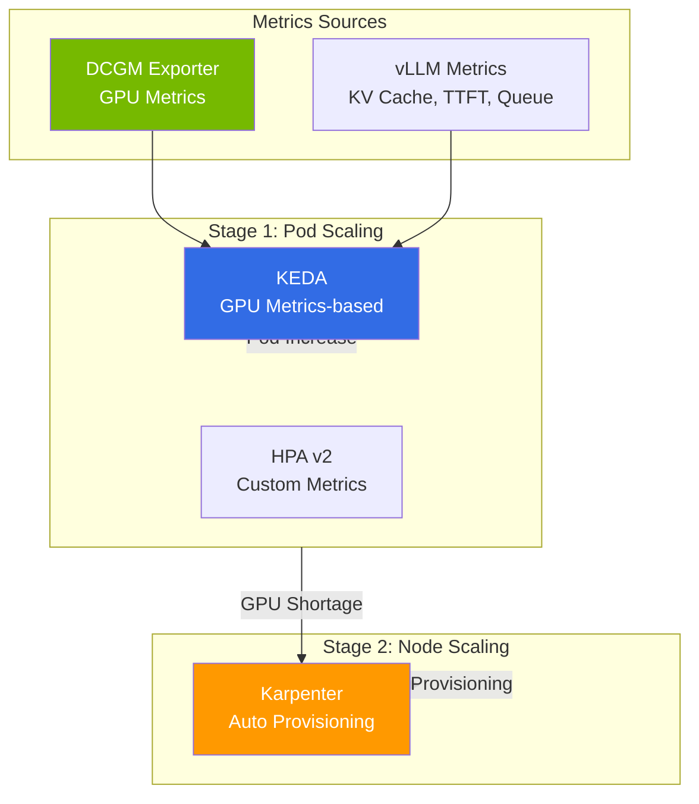

## Overview

In LLM serving operations, GPU uptime directly drives cost, and autoscaling that elastically scales resources up and down with traffic is the key to efficiency. This document consolidates 2-Tier scaling (Pod·node) tailored for LLM serving, the practical constraints of DRA (Dynamic Resource Allocation), and operational lessons learned from deploying large MoE models such as GLM-5 (744B) and Kimi K2.5 (1T).

:::info Related Topics
For GPU cost optimization (Spot·Consolidation·time-based scheduling), see [EKS Cost Management](/docs/eks-best-practices/resource-cost/cost-management); for GPU/vLLM monitoring and Cascade Fallback, see [Agent Monitoring & Operations](../../operations-mlops/observability/agent-monitoring.md); for on-premises GPU integration, see [EKS Hybrid Nodes Complete Guide](/docs/hybrid-infrastructure/hybrid-nodes-adoption-guide).
:::

## GPU Resource Management & Autoscaling

### 2-Tier Scaling Architecture

LLM serving configures Pod scaling and Node scaling in two stages.



### KEDA Scaling Configuration

Three core scaling signals for LLM serving:

```yaml
apiVersion: keda.sh/v1alpha1
kind: ScaledObject
metadata:
  name: llm-inference-scaler
spec:
  scaleTargetRef:
    name: vllm-deployment
  minReplicaCount: 2
  maxReplicaCount: 8
  triggers:
    # 1. KV Cache saturation — most sensitive signal
    - type: prometheus
      metadata:
        query: avg(vllm:kv_cache_usage_perc)
        threshold: "80"
    # 2. Number of waiting requests
    - type: prometheus
      metadata:
        query: sum(vllm:num_requests_waiting)
        threshold: "10"
    # 3. TTFT SLO violation proximity
    - type: prometheus
      metadata:
        query: |
          histogram_quantile(0.95,
            rate(vllm_time_to_first_token_seconds_bucket[5m]))
        threshold: "2"
```

### Disaggregated Serving Scaling Criteria

Prefill and Decode have different bottleneck signals.

| | Prefill | Decode |
|---|---|---|
| **Bottleneck Signal** | TTFT increase, input queue backlog | TPS decrease, KV Cache saturation |
| **Scaling Criterion** | Input token processing wait time | Concurrent generation session count |
| **GPU Characteristics** | Compute-intensive (compute bottleneck) | Memory-intensive (bandwidth bottleneck) |

### DRA (Dynamic Resource Allocation) Reality

DRA provides GPU partitioning/topology-aware scheduling as v1beta1 in K8s 1.32+ and GA in 1.34+. However, there is an **architectural limitation of incompatibility with Karpenter/Auto Mode**.

- Karpenter must simulate GPU resources **before node creation**, but DRA's ResourceSlice is published by DRA Driver **after node creation**
- Due to this "chicken and egg" problem, DRA Pods are skipped in Karpenter
- **When Using DRA**: MNG + Cluster Autoscaler required

:::info DRA Usage Decision
**When DRA is needed:** MIG partitioning, CEL-based attribute GPU selection, P6e-GB200 environments

**When Device Plugin is sufficient:** Whole GPU unit allocation, Karpenter/Auto Mode usage
:::

## Lessons Learned: Large MoE Model Deployment

### Image/Model Download Failure Mitigation

Large model (744GB+) weight download is the most common Cold Start bottleneck in LLM serving. Downloading hundreds of GB from HuggingFace Hub frequently fails due to network instability, timeouts, and disk shortage.

#### Problem Types and Responses

| Problem | Symptoms | Response |
|------|------|------|
| **HF Hub Download Timeout** | Pod CrashLoopBackOff, `ConnectionError` | Retry + resume support (`HF_HUB_ENABLE_HF_TRANSFER=1`) |
| **Large File Partial Download** | Corruption error during model loading | Checksum verification + re-download |
| **Slow Container Image Pull** | `ImagePullBackOff`, several minutes wait | Pre-cache images (Bottlerocket data volume, SOCI) |
| **Multi-node Simultaneous Download** | Network bandwidth contention | S3 caching + init container sequential loading |
| **Slow EFS Download** | 30+ minutes loading time | Switch to NVMe emptyDir |

#### Strategy 1: HuggingFace Transfer Acceleration

`hf_transfer` is a Rust-based high-speed download library, **3-5x faster** than default download.

```yaml
env:
  - name: HF_HUB_ENABLE_HF_TRANSFER
    value: "1"
  - name: HF_TOKEN
    valueFrom:
      secretKeyRef:
        name: hf-token
        key: token
  # Download retry configuration
  - name: HF_HUB_DOWNLOAD_TIMEOUT
    value: "600"            # 10 minute timeout
```

#### Strategy 2: S3 Pre-caching + Init Container

Most stable method. Pre-upload model weights to S3, copy to local NVMe in init container.

```yaml
apiVersion: apps/v1
kind: Deployment
metadata:
  name: vllm-with-s3-cache
spec:
  template:
    spec:
      initContainers:
        # Stage 1: Download model from S3 to NVMe
        - name: model-downloader
          image: amazon/aws-cli:latest
          command: ["/bin/sh", "-c"]
          args:
            - |
              echo "Checking local cache..."
              if [ -f /models/config.json ]; then
                echo "Model already cached, skipping download"
                exit 0
              fi
              echo "Downloading model from S3..."
              aws s3 sync s3://model-cache/qwen3-32b-fp8/ /models/ \
                --no-progress \
                --expected-size 65000000000
              echo "Download complete, verifying..."
              # Checksum verification
              if [ -f /models/model.safetensors.index.json ]; then
                echo "Model verified successfully"
              else
                echo "ERROR: Model incomplete, retrying..."
                rm -rf /models/*
                aws s3 sync s3://model-cache/qwen3-32b-fp8/ /models/
              fi
          volumeMounts:
            - name: model-cache
              mountPath: /models
          resources:
            requests:
              cpu: 2
              memory: 4Gi
      containers:
        - name: vllm
          image: vllm/vllm-openai:v0.6.3
          args:
            - /models
            - "--gpu-memory-utilization=0.95"
          volumeMounts:
            - name: model-cache
              mountPath: /models
      volumes:
        - name: model-cache
          emptyDir:
            sizeLimit: 200Gi  # NVMe emptyDir
```

#### Strategy 3: Container Image Pre-caching

Methods to reduce Pull time for vLLM/SGLang images (10-20GB).

```yaml
# Enable image pre-Pull in Karpenter NodePool
apiVersion: karpenter.sh/v1
kind: NodePool
metadata:
  name: gpu-inference
spec:
  template:
    spec:
      kubelet:
        # Raise image GC threshold to maintain cache
        imageGCHighThresholdPercent: 90
        imageGCLowThresholdPercent: 85
```

**Using SOCI (Seekable OCI) Index:**

Creating SOCI index in ECR enables image lazy-loading via Pull, **reducing container start time by 70-80%**.

```bash
# Create SOCI index (ECR)
aws soci create \
  --image-uri 123456789012.dkr.ecr.us-east-2.amazonaws.com/vllm:v0.6.3

# EKS Auto Mode automatically supports SOCI
# Karpenter: Native SOCI support when using Bottlerocket AMI
```

#### Strategy 4: Multi-node LWS Model Download Coordination

When deploying with LWS multi-node, network contention occurs if Leader and Worker simultaneously download the same model.

```yaml
# Leader Pod: Download from S3 then cache to NVMe
initContainers:
  - name: model-downloader
    command: ["/bin/sh", "-c"]
    args:
      - |
        # Only Leader downloads from S3
        aws s3 sync s3://model-cache/glm5-fp8/ /models/
        echo "READY" > /models/.download-complete

# Worker Pod: Wait for Leader completion then download independently
initContainers:
  - name: model-downloader
    command: ["/bin/sh", "-c"]
    args:
      - |
        # Worker downloads independently from S3
        # (NVMe emptyDir is node-independent, cannot share)
        aws s3 sync s3://model-cache/glm5-fp8/ /models/
```

:::tip Download Performance Comparison
| Method | 744GB Model Time | Stability | Cost |
|------|-------------------|--------|------|
| HF Hub Direct | 20-40min | Frequent timeouts | Free |
| HF Hub + hf_transfer | 10-15min | Good | Free |
| **S3 Pre-caching** | **5-10min** | **Very Stable** | **S3 Storage Cost** |
| FSx for Lustre | 5-8min | Stable | High |
| NVMe Local Cache (Restart) | &lt; 1min | Best | Free |
:::

### EKS Auto Mode GPU Limitations

Core limitations identified during GLM-5 (744B MoE) and Kimi K2.5 (1T MoE) deployments.

#### p6-b200 Not Supported

As of April 2026, EKS Auto Mode's managed Karpenter **cannot provision p6-b200.48xlarge**. NodePool validation passes but actual NodeClaim creation fails with `NoCompatibleInstanceTypes` error.

#### GPU Instance Capacity Acquisition

p5.48xlarge frequently has InsufficientCapacity in Seoul/Tokyo regions. **Available in us-east-2 (Ohio) Spot for $13-15/hr** (85% reduction vs On-Demand $98/hr).

| Region | p5.48xlarge On-Demand | p5.48xlarge Spot | Spot Price |
|------|---------------------|-----------------|----------|
| ap-northeast-2 (Seoul) | InsufficientCapacity | Unconfirmed | — |
| ap-northeast-1 (Tokyo) | InsufficientCapacity | Unconfirmed | — |
| **us-east-2 (Ohio)** | Variable availability | **Available** | **$13~15/hr** |

#### GPU Operator Conflict

Installing GPU Operator with `devicePlugin.enabled=true` conflicts with Auto Mode's built-in Device Plugin, resulting in `allocatable=0`. **Must install with `devicePlugin.enabled=false`**.

#### Cannot Directly Terminate EC2 Instances

Auto Mode managed nodes block `ec2:TerminateInstances` via resource-based policy. Node cleanup must be performed indirectly through Karpenter NodePool deletion or Pod removal.

### Serving Framework Compatibility

| Model | vLLM Support | SGLang Support | Notes |
|------|---------|-----------|------|
| Qwen3-32B | Supported | Supported | llm-d default model, Apache 2.0 |
| Kimi K2.5 (1T MoE) | Supported | Supported | INT4 W4A16 Marlin MoE, `gpu_memory_utilization=0.85` |
| GLM-5 (744B MoE) | Not supported | Supported | `glm_moe_dsa` architecture → requires transformers v5.2+, vLLM uses v4.x |
| DeepSeek V3.2 | Supported | Supported | MoE, 671B/37B active |

:::warning GLM-5 Deployment Caution
GLM-5 is not supported in vLLM. Must use SGLang-dedicated image (`lmsysorg/sglang:glm5-hopper`), and configure `--pp-size 2 --nnodes 2 --dist-init-addr <leader>:5000` for multi-node deployment.
:::

### Storage Strategy

Storage performance is critical for large model (744GB+) weight loading.

| Storage | Sequential Read | Multi-node Sharing | Recommended Scenario |
|---------|---------|------------|------------|
| **NVMe emptyDir** | ~3,500 MB/s | Node-independent | p5 built-in NVMe, best performance |
| EFS | ~100-300 MB/s | ReadWriteMany | Small models, when sharing needed |
| S3 + init container | ~1,000 MB/s | S3 shared | Medium performance, cost efficient |
| FSx for Lustre | ~1,000+ MB/s | ReadWriteMany | Training workloads |

:::tip Large Model Recommendation
Large models like GLM-5 (744GB) and Kimi K2.5 (630GB) recommend **local NVMe (emptyDir)**. p5.48xlarge has 8×3.84TB NVMe SSD built-in, providing best performance at no additional cost. First startup takes 10-20min with HuggingFace Hub direct download, but subsequent loads are fast.
:::

### GPU Quota Pitfall

EC2 vCPU quotas are separated by instance bucket, requiring caution.

| Quota | Applicable Instances | Default | Caution |
|------|------------|--------|---------|
| Running On-Demand P instances | p4d, p5, p5en | 384 | Can have 2 p5.48xlarge (192 vCPU each) |
| Running On-Demand G and VT instances | g5, g6, g6e | **64** | Cannot even have 1 g6e.48xlarge → quota increase required |

Setting `instance-category: [g, p]` together in GPU NodePool may cause Karpenter to try G types first, hitting the G quota (64 vCPU). If only P types are needed, specify explicitly.

## References

### Official Documentation
- [KEDA Documentation](https://keda.sh/docs/) — Kubernetes Event-driven Autoscaling
- [Karpenter Documentation](https://karpenter.sh/docs/) — Node auto-provisioning, Disruption, Consolidation
- [NVIDIA DCGM Exporter](https://github.com/NVIDIA/dcgm-exporter) — GPU sensor metrics collection
- [SOCI (Seekable OCI)](https://docs.aws.amazon.com/AmazonECR/latest/userguide/container-images-soci.html) — Container image lazy-loading

### Papers & Technical Blogs
- [a16z "The Economics of AI"](https://a16z.com/navigating-the-high-cost-of-ai-compute/) — GPU cost structure analysis
- [AWS Bottlerocket & SOCI](https://aws.amazon.com/blogs/containers/introducing-seekable-oci-for-lazy-loading-container-images/) — Container image lazy-loading
- [Spot Instance Operations Guide (AWS)](https://aws.amazon.com/ec2/spot/) — Karpenter Spot interruption response

### Related Documentation
- [Inference Optimization on EKS (Overview)](./index.md) — Inference optimization category entry point
- [KV Cache Optimization (vLLM Deep Dive + Cache-Aware Routing)](./kv-cache-optimization.md) — vLLM/llm-d/Dynamo deep dive
- [Disaggregated Serving + LWS Multi-Node](./disaggregated-serving.md) — Prefill/Decode separation, LWS deployment
- [GPU Resource Management](../gpu-infrastructure/gpu-resource-management.md) — GPU scaling, DRA
- [EKS Cost Management](/docs/eks-best-practices/resource-cost/cost-management) — GPU workload cost optimization (Spot·Consolidation)
- [Agent Monitoring & Operations](../../operations-mlops/observability/agent-monitoring.md) — GPU/vLLM monitoring, Cascade Fallback
- [EKS Hybrid Nodes Complete Guide](/docs/hybrid-infrastructure/hybrid-nodes-adoption-guide) — On-premises GPU inference, 3-Tier Cascade
