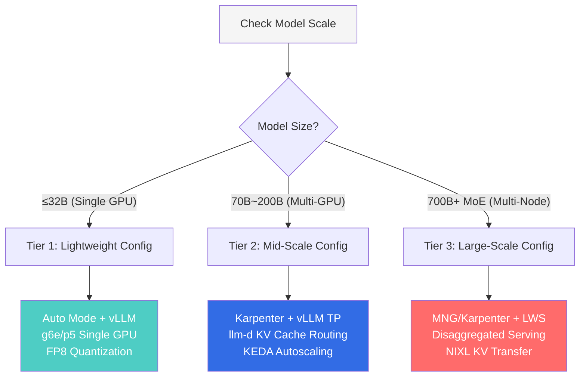
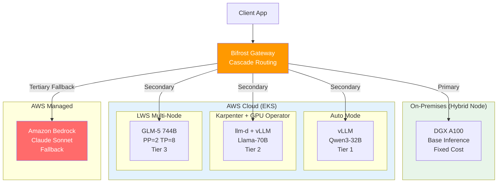

import DocCardList from '@theme/DocCardList';

## Overview

In production LLM services, **Inference costs account for 80-90% of total AI operational expenses** ([a16z "The Economics of AI"](https://a16z.com/navigating-the-high-cost-of-ai-compute/), [NVIDIA GTC 2024](https://www.nvidia.com/en-us/on-demand/), [SemiAnalysis](https://semianalysis.com/)). Training is a one-time operation, but inference runs 24/7 as long as the service is live. GPU time translates directly to cost, with a single p5.48xlarge (H100×8) On-Demand instance costing $98/hour. Operating two nodes monthly amounts to approximately $141,580.

This document consolidates architectural patterns for maximizing LLM Inference performance on EKS, based on lessons learned from building a telecommunications carrier's Agentic AI platform and deployment cases of large MoE models such as GLM-5 (744B) and Kimi K2.5 (1T).

## Covered Content

This category consists of three deep-dive documents.

<DocCardList items={[
  {
    type: 'link',
    href: '/docs/agentic-ai-platform/model-serving/inference-optimization/kv-cache-optimization',
    label: 'KV Cache Optimization (vLLM Deep Dive + Cache-Aware Routing)',
    description: 'Core technologies like vLLM PagedAttention, Continuous Batching, FP8 KV Cache, and comparison of llm-d/Dynamo KV Cache-Aware Routing'
  },
  {
    type: 'link',
    href: '/docs/agentic-ai-platform/model-serving/inference-optimization/disaggregated-serving',
    label: 'Disaggregated Serving + LWS Multi-Node',
    description: 'Prefill/Decode separation architecture, NIXL KV transfer, LeaderWorkerSet-based 700B+ large model multi-node deployment'
  },
  {
    type: 'link',
    href: '/docs/agentic-ai-platform/model-serving/inference-optimization/cost-optimization',
    label: 'GPU Resources · Observability · Hybrid Node · Lessons Learned',
    description: '2-Tier autoscaling, DCGM/vLLM monitoring, Bifrost→Bedrock Cascade Fallback, Hybrid Node on-premises integration, large MoE deployment lessons learned'
  }
]} />

### Key Topics by Document

1. **EKS GPU Infrastructure Strategy** — Auto Mode vs Karpenter vs MNG selection criteria (this document)
2. **Model Serving Engine** — vLLM core technologies and GPU memory design ([KV Cache Optimization](./kv-cache-optimization.md))
3. **KV Cache-Aware Routing** — Comparison of llm-d and NVIDIA Dynamo ([KV Cache Optimization](./kv-cache-optimization.md))
4. **Disaggregated Serving** — Prefill/Decode separation architecture ([Disaggregated Serving](./disaggregated-serving.md))
5. **LWS Multi-Node Serving** — LeaderWorkerSet-based 700B+ model deployment ([Disaggregated Serving](./disaggregated-serving.md))
6. **GPU Resource Management** — 2-Tier autoscaling and DRA ([Cost · Observability · Hybrid](./cost-optimization.md))
7. **Observability & Fallback** — GPU monitoring, Bifrost→Bedrock fallback ([Cost · Observability · Hybrid](./cost-optimization.md))
8. **Hybrid Node** — On-premises GPU farm integration with EKS ([Cost · Observability · Hybrid](./cost-optimization.md))
9. **Lessons Learned** — Image download failure mitigation, large MoE deployment pitfalls ([Cost · Observability · Hybrid](./cost-optimization.md))

## Key Performance Metrics

| Metric | Description | Optimization Target |
|------|------|-----------|
| **TTFT** (Time to First Token) | Time to generate first token | &lt; 2s (conversational), &lt; 5s (batch) |
| **TPS** (Tokens per Second) | Token generation rate | Varies by model |
| **GPU Utilization** | GPU compute utilization | &gt; 70% |
| **KV Cache Hit Rate** | KV cache reuse ratio | &gt; 60% (shared prompts) |
| **P99 Latency** | 99th percentile response time | Adhere to SLO requirements |

## EKS GPU Infrastructure Strategy

### Three Deployment Model Comparison

When running GPU workloads on EKS, capabilities and operational complexity vary significantly depending on node management approach.

| Criteria | EKS Auto Mode | Karpenter + GPU Operator | MNG + Cluster Autoscaler |
|------|:---:|:---:|:---:|
| **GPU Driver Management** | AWS managed | Pre-installed in AMI | Pre-installed in AMI |
| **MIG / Time-Slicing** | Not possible | Supported | Supported |
| **DRA Compatibility** | Not supported | Not supported | Only option |
| **DCGM Monitoring** | Possible with GPU Operator | Fully supported | Fully supported |
| **Operational Complexity** | Low | Medium | Medium |
| **Suitable Model Size** | 70B+ (full GPU utilization) | 7B~700B+ (MIG partitioning) | DRA-required workloads |

:::tip Selection Guide
- **Quick Start / PoC**: Auto Mode — Automatic GPU driver and Device Plugin management
- **Production (Fine GPU Control)**: Karpenter + GPU Operator — MIG and Custom AMI support
- **When DRA Required**: MNG + Cluster Autoscaler — Architectural limitation where Karpenter/Auto Mode skips DRA Pods
:::

### GPU Instance Selection Matrix

| Instance | GPU | GPU Memory (Total) | Suitable Model Size | Hourly Cost (On-Demand) |
|---------|-----|----------------|-------------|---------------------|
| g5.xlarge~48xlarge | A10G | 24~192GB | ≤7B | $1.01~$16.29 |
| g6e.xlarge~48xlarge | L40S | 48~384GB | 13B~70B | Cost-effective |
| p4d.24xlarge | A100 40GB × 8 | 320GB | 13B~70B | $32.77 |
| p5.48xlarge | H100 80GB × 8 | 640GB | 70B~700B+ | $98.32 |
| p5e.48xlarge | H200 141GB × 8 | 1,128GB | 100B+ | Maximum memory |

### Auto Mode GPU Operator Hybrid Configuration

GPU Operator can be installed on Auto Mode. Disable only the Device Plugin via node labels, while DCGM Exporter, NFD, and GFD operate normally.

```yaml
# GPU Operator installation (Auto Mode compatible)
helm install gpu-operator nvidia/gpu-operator \
  --namespace gpu-operator --create-namespace \
  --set driver.enabled=false \
  --set toolkit.enabled=false

# Add Device Plugin disable label to NodePool
# nvidia.com/gpu.deploy.device-plugin: "false"
```

This maintains Auto Mode convenience while collecting granular DCGM metrics (SM utilization, NVLink bandwidth). ClusterPolicy-dependent projects like KAI Scheduler are also usable.

:::warning GPU Operator + Auto Mode Caution
Installing with `devicePlugin.enabled=true` conflicts with Auto Mode's built-in Device Plugin, resulting in `allocatable=0`. **Must disable with `devicePlugin.enabled=false`** or via node labels.
:::

## Recommended Architecture by Model Scale

### Decision Flow



### 3-Tier Recommended Configuration

| Tier | Model Scale | Infrastructure | Serving Engine | Routing | Examples |
|------|---------|--------|---------|--------|------|
| **Tier 1** | ≤32B | Auto Mode, g6e/p5 | vLLM (Single GPU) | Round-Robin | Qwen3-32B FP8 |
| **Tier 2** | 70B~200B | Karpenter + GPU Operator | vLLM TP=4~8 | llm-d KV Cache-aware | Llama-3.3-70B |
| **Tier 3** | 700B+ MoE | MNG or Karpenter + LWS | vLLM/SGLang PP+TP | Disaggregated + NIXL | GLM-5, Kimi K2.5 |

**Common to All Tiers**: Bifrost Cascade Routing with Bedrock fallback recommended (uninterrupted service during GPU failures/Spot interruptions)

### Hybrid Architecture: Complete Picture



### Migration Path

Phased transitions minimize operational risk while progressively improving performance.

**Phase 1**: Auto Mode + vLLM + Bifrost→Bedrock fallback → PoC, dev environments

**Phase 1.5**: Auto Mode + GPU Operator + llm-d → Enhanced monitoring, KV Cache routing

**Phase 2**: Karpenter + llm-d Disaggregated + LWS multi-node → MIG, Prefill/Decode separation

**Phase 3**: Karpenter + Dynamo + Hybrid Node → On-premises integration, 3-Tier Cascade

**Phase 4**: Full integration → On-Prem→Cloud→Bedrock Cascade, SLO-based autoscaling

## References

### Official Documentation
- [Amazon EKS User Guide](https://docs.aws.amazon.com/eks/latest/userguide/) — EKS cluster and node management
- [EKS Hybrid Nodes](https://docs.aws.amazon.com/eks/latest/userguide/hybrid-nodes.html) — On-premises GPU server EKS integration
- [Amazon Bedrock Documentation](https://docs.aws.amazon.com/bedrock/) — Managed FM service (Cascade Fallback target)
- [SOCI (Seekable OCI)](https://docs.aws.amazon.com/AmazonECR/latest/userguide/container-images-soci.html) — Container image lazy-loading

### Papers & Technical Blogs
- [a16z "The Economics of AI"](https://a16z.com/navigating-the-high-cost-of-ai-compute/) — AI infrastructure cost structure
- [GenAI on EKS Starter Kit](https://github.com/aws-samples/sample-genai-on-eks-starter-kit) — Bifrost, vLLM, Langfuse deployment automation
- [Scalable Model Inference on Amazon EKS](https://github.com/aws-solutions-library-samples/guidance-for-scalable-model-inference-and-agentic-ai-on-amazon-eks) — Comprehensive llm-d, Karpenter, RAG architecture

### Related Documentation
- [EKS GPU Node Strategy](../gpu-infrastructure/eks-gpu-node-strategy.md) — Auto Mode, Karpenter, Hybrid Node comparison
- [GPU Resource Management](../gpu-infrastructure/gpu-resource-management.md) — GPU scaling, DRA, cost optimization
- [NVIDIA GPU Software Stack](../gpu-infrastructure/nvidia-gpu-stack.md) — GPU Operator, DCGM, MIG, Dynamo
- [vLLM-based FM Deployment and Performance Optimization](../inference-frameworks/vllm-model-serving.md) — vLLM detailed guide
- [llm-d-based EKS Distributed Inference](../inference-frameworks/llm-d-eks-automode.md) — llm-d deployment guide
- [MoE Model Serving Guide](../inference-frameworks/moe-model-serving.md) — MoE model deployment
