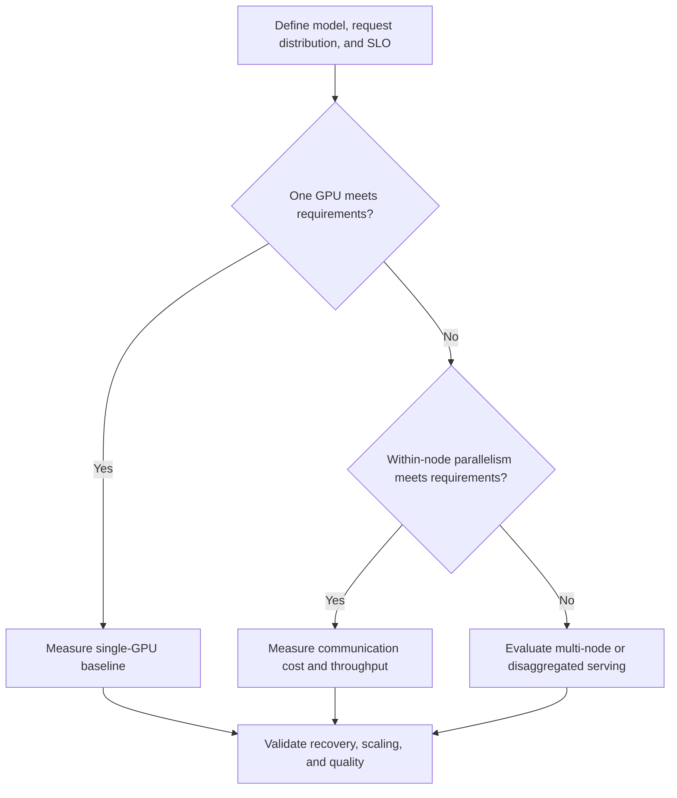

import DocCardList from '@theme/DocCardList';

## Overview

Guides for measuring inference latency, throughput, GPU memory, and cost, then choosing an optimization that addresses the observed bottleneck. Start with the L0–L5 tuning view in the [inference infrastructure overview](../index.md). These tuning layers are separate from the platform's six runtime layers.

Results depend on the model, input and output lengths, concurrency, hardware, and routing policy. This page helps select detailed guides; it does not prescribe a configuration that guarantees production performance or savings.

## Covered Content

All documents in this category are listed below. Gateway configuration and model selection policies belong to the separate [inference routing](../inference-routing/index.md) category.

<DocCardList />

### Key Topics by Document

- **Cache reuse**: [KV cache optimization](./kv-cache-optimization.md) → [LMCache](./lmcache.md) → [cache-hit strategy](./cache-hit-strategy.md)
- **Latency and throughput isolation**: compare the benefits and transfer costs of prefill/decode separation in [disaggregated serving](./disaggregated-serving.md).
- **Response-reuse quality**: review cache keys, tenant boundaries, and incorrect-hit evaluation in [semantic caching](./semantic-caching-strategy.md).
- **Capacity and recovery**: review queues, cold starts, and deployment failures in [GPU autoscaling](./gpu-autoscaling-operations.md).

## Key Performance Metrics

Compare before and after against the service SLO and the same request set. There is no universal target for the metrics below.

| Metric | What to inspect | Conditions to record |
|--------|-----------------|----------------------|
| **TTFT** | Request-start to first-token latency distribution | Queue-time inclusion, input length, concurrency |
| **Output-token throughput** | Generated tokens in completed requests / measurement duration | Per-client rate versus aggregate server throughput |
| **GPU memory and utilization** | Memory headroom, compute and memory bottlenecks | GPU type, precision, batch settings |
| **Cache-hit ratio** | Hits and lookups for each reuse unit | Token or request denominator, cache type, cold/warm interval |
| **Tail latency and errors** | p95/p99 response latency and completion rate | Timeouts, retries, and failed requests |
| **Quality and cost** | Evaluation pass rate and total cost per successful request | Evaluation set, idle GPU cost, gateway and storage costs |

## EKS GPU Infrastructure Strategy

### Three Deployment Model Comparison

Separate node management from ownership of GPU software. GPU count or model size alone does not determine the node-management approach.

| Approach | Management boundary | Detailed checks |
|----------|---------------------|-----------------|
| EKS Auto Mode | EKS manages the GPU driver and device plugin | Available features and support for user-installed components |
| Karpenter | Provisions nodes according to NodePool policy | Selected AMI, GPU components, static versus dynamic capacity |
| Managed node group | Manages capacity through a node group and AMI | Pre-installed components versus separately installed drivers/plugins |

Check DRA support against both Kubernetes version and capacity provisioning. The current [EKS NVIDIA device guide](https://docs.aws.amazon.com/eks/latest/userguide/device-management-nvidia.html) distinguishes Karpenter static capacity, managed node groups, and self-managed nodes while excluding Auto Mode. See [GPU node strategy](../gpu-infrastructure/eks-gpu-node-strategy.md) for selection criteria.

### GPU Instance Selection Matrix

| Decision | Evaluation criteria |
|----------|---------------------|
| Memory | Weight precision, KV cache, concurrency, runtime headroom |
| Communication | Bandwidth for single-GPU, within-node, or cross-node parallelism |
| Availability | Capacity, quotas, and alternatives in the target Region and AZs |
| Cost | Quote date, Region, purchase option, and measured throughput |

Do not derive GPU count from parameter count alone. Review memory settings in [vLLM serving](../inference-frameworks/vllm-model-serving.md) and allocation policies in [GPU resource management](../gpu-infrastructure/gpu-resource-management.md).

### Auto Mode GPU Operator Hybrid Configuration

A separate GPU Operator must not take duplicate ownership of components managed by Auto Mode. This overview does not provide a generic installation procedure that applies AL2023 or Bottlerocket GPU Operator options to Auto Mode.

The [accelerated AMI guide](https://docs.aws.amazon.com/eks/latest/userguide/ml-eks-optimized-ami.html) describes options according to each AMI's pre-installed components. Even when only observability is needed, verify support on the target nodes and consult the component descriptions in the [NVIDIA GPU stack](../gpu-infrastructure/nvidia-gpu-stack.md).

## Recommended Architecture by Model Scale

### Decision Flow

```mermaid
flowchart TD
    accTitle: Choosing an inference deployment
    accDescr: Test memory and SLOs on one GPU first, then evaluate within-node parallelism and multiple nodes when needed.
    A[Define model, request distribution, and SLO] --> B{One GPU meets requirements?}
    B -->|Yes| C[Measure single-GPU baseline]
    B -->|No| D{Within-node parallelism meets requirements?}
    D -->|Yes| E[Measure communication cost and throughput]
    D -->|No| F[Evaluate multi-node or disaggregated serving]
    C --> G[Validate recovery, scaling, and quality]
    E --> G
    F --> G
```

### 3-Tier Recommended Configuration

These are evaluation stages, not fixed specifications tied to parameter counts.

| Stage | Condition | Next guide |
|-------|-----------|------------|
| Single GPU | Meets both memory and SLO requirements | [vLLM serving](../inference-frameworks/vllm-model-serving.md) |
| Within-node parallelism | A single GPU reaches a memory or performance limit | [MoE serving](../inference-frameworks/moe-model-serving.md) |
| Multi-node or disaggregated serving | Measurements show within-node capacity is insufficient | [Disaggregated serving](./disaggregated-serving.md) |

### Hybrid Architecture: Complete Picture

When combining EKS, on-premises infrastructure, and managed model APIs, use the [tiered gateway](../inference-routing/tiered-gateway-architecture.md) guide to identify each layer's responsibilities. Validate fallback API and tool-call compatibility, data-transfer policy, quotas, and response quality. A routing path alone does not guarantee uninterrupted service.

### Migration Path

1. Record performance, quality, and cost on a single baseline path.
2. Change one cache, routing, or batching setting for an observed bottleneck.
3. Check regressions with the same evaluation set and load conditions.
4. Validate limited traffic before expansion and define when to restore the original path.

## References

### Official Documentation

- [EKS NVIDIA device management](https://docs.aws.amazon.com/eks/latest/userguide/device-management-nvidia.html)
- [EKS accelerated AMIs](https://docs.aws.amazon.com/eks/latest/userguide/ml-eks-optimized-ami.html)
- [EKS Compute and Autoscaling](https://docs.aws.amazon.com/eks/latest/best-practices/aiml-compute.html)

### Papers & Technical Blogs

Check implementation projects against the selected release and its documented examples.

- [GenAI on EKS Starter Kit](https://github.com/aws-samples/sample-genai-on-eks-starter-kit)
- [Scalable Model Inference on Amazon EKS](https://github.com/aws-solutions-library-samples/guidance-for-scalable-model-inference-and-agentic-ai-on-amazon-eks)

### Related Documentation

- [Serving optimization monitoring](../../operations-mlops/observability/llm-serving-optimization-monitoring.md) — measurement units and query validation
- [Prefix-cache tuning and accuracy](../../operations-mlops/observability/prefix-cache-tuning-accuracy-correlation.md) — experiment design and quality criteria
- [Routing strategy](../inference-routing/routing-strategy.md) — model selection and fallback boundaries
