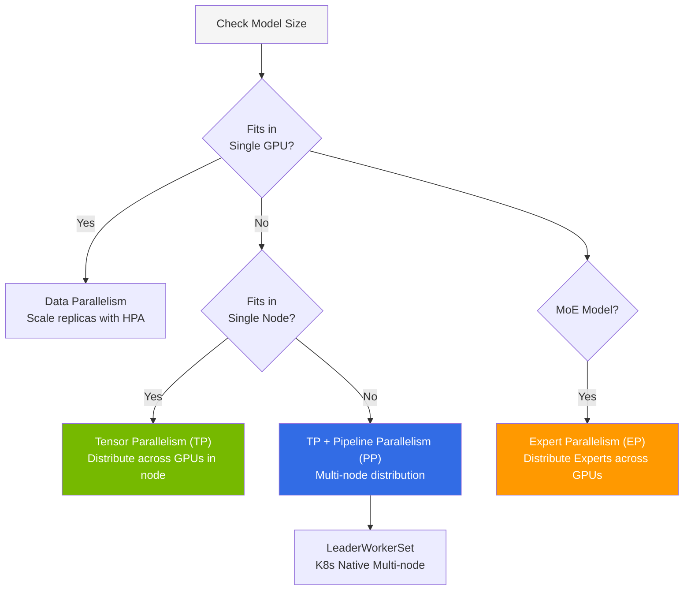
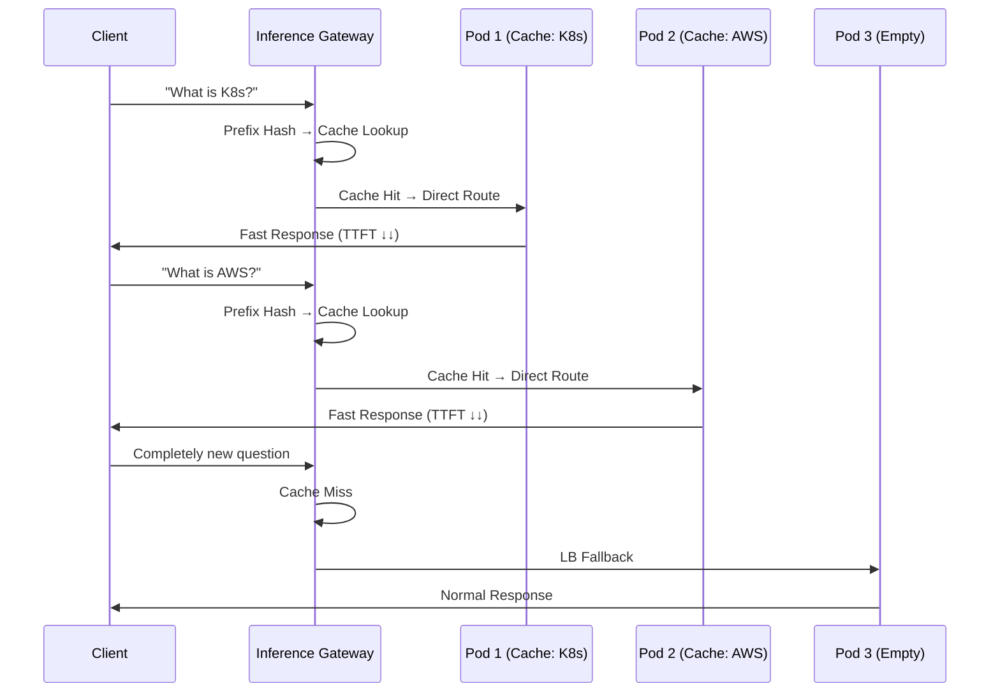
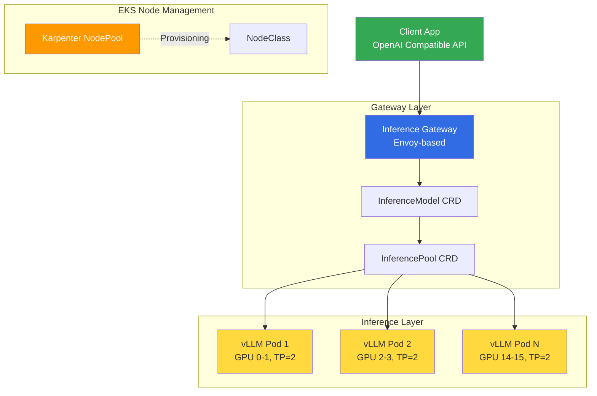

## Overview

LLM inference engine performance largely depends on how efficiently KV Cache (Key-Value Cache) is managed. This document covers vLLM's core technology stack and GPU memory design principles, as well as **KV Cache-Aware Routing** strategies (llm-d vs NVIDIA Dynamo) for sharing and reusing KV Cache across multiple Pods.

## vLLM Deep Dive

### Core Technology Stack

vLLM (v0.19.x) is currently the most widely used LLM inference engine. Core technologies and performance impacts are as follows.

| Technology | Performance Impact | Description |
|------|---------|------|
| **PagedAttention** | 60-80% KV Cache memory reduction | Stores KV cache in non-contiguous blocks using OS virtual memory techniques |
| **Continuous Batching** | 2-24x throughput improvement | Dynamically adds/removes requests at iteration level |
| **FP8 KV Cache** | 2x memory reduction | Stores KV cache in FP8 precision (v0.6+) |
| **Prefix Caching** | 400%+ improvement for repeated prompts | Reuses KV cache of common system prompts |
| **Speculative Decoding** | 2-3x speed improvement | Small draft model predicts tokens, main model validates |
| **Chunked Prefill** | TTFT/throughput balance improvement | Processes Prefill and Decode mixed in same batch |

### GPU Memory Calculation

Accurate GPU memory calculation is required before model deployment.

```
Required GPU Memory = Model Weights + Non-torch Memory + PyTorch Activation + (KV Cache × Batch Size)
```

**Memory Requirements by Precision:**

| Precision | Bytes per Parameter | 70B Model | 32B Model |
|--------|---------------|---------|---------|
| FP32 | 4 | 280GB | 128GB |
| BF16/FP16 | 2 | 140GB | 64GB |
| INT8 | 1 | 70GB | 32GB |
| INT4 | 0.5 | 35GB | 16GB |

### Parallelization Strategy Selection Criteria



**Recommended Configuration by Model Size:**

| Model Example | Parameters | Precision | GPU Configuration | Parallelization |
|-----------|---------|--------|---------|--------|
| Qwen3-32B | 32B | FP8 | 1× H100 80GB | None |
| Llama-3.3-70B | 70B | BF16 | 4× H100 (TP=4) | Tensor Parallel |
| Kimi K2.5 | 1T MoE (32B active) | INT4 | 8× H100 (TP=8) | Tensor + Expert Parallel |
| GLM-5 | 744B MoE (40B active) | FP8 | 16× H100 (PP=2, TP=8) | Pipeline + Tensor Parallel |

### Core Performance Parameters

```bash
vllm serve Qwen/Qwen3-32B-FP8 \
  --gpu-memory-utilization=0.95 \   # VRAM ratio to pre-allocate for KV cache (default 0.9)
  --max-model-len=32768 \           # Maximum sequence length (directly affects KV cache size)
  --enable-prefix-caching \         # Reuse KV cache for common prefixes
  --kv-cache-dtype=fp8 \            # 2x memory reduction with FP8 KV cache
  --enable-auto-tool-choice \       # Automatic tool calling support
  --tool-call-parser=hermes         # Tool call parser selection
```

### Quantization Strategy Comparison

| Quantization | Memory Reduction | Quality Loss | Inference Speed | Recommended Scenario |
|--------|----------|---------|---------|------------|
| **FP8** | 50% | Minimal | Fast | Production default (quality priority) |
| **AWQ** | 75% | Low | Very fast | Cost optimization |
| **GPTQ** | 75% | Low | Fast | Offline quantization |
| **GGUF** | 50-75% | Low~Medium | Fast | Various precision options |

## KV Cache-Aware Routing

### Existing Problem: Round-Robin Limitations

Existing vLLM deployments rely on simple Round-Robin load balancing. When requests using the same system prompt are distributed to different Pods each time, identical prefill operations are repeatedly executed in each Pod. This wastes GPU computation and increases TTFT.

### Solution: KV Cache State-Aware Routing

llm-d and NVIDIA Dynamo recognize the KV Cache state of each vLLM Pod and route requests with identical prefixes to Pods that already hold the corresponding KV Cache.



**Effects of KV Cache-Aware Routing:**

| Scenario | TTFT Improvement | GPU Computation Reduction | Throughput Improvement |
|---------|----------|-------------|-----------|
| Same system prompt | 50-80% reduction | Prefill skip | 400%+ |
| RAG repeated context | 30-60% reduction | Partial reuse | 200%+ |
| Completely random requests | No change | None | LB fallback |

### llm-d vs NVIDIA Dynamo Comparison

Both projects provide KV Cache-aware routing but with different approaches.

| Item | llm-d v0.5+ | NVIDIA Dynamo v1.0 |
|------|------------|-------------------|
| **Led by** | Red Hat (Apache 2.0) | NVIDIA (Apache 2.0) |
| **KV Cache Indexing** | Prefix-aware routing | Flash Indexer (radix tree) |
| **KV Cache Transfer** | NIXL (Network) | NIXL (NVLink/RDMA ultra-fast) |
| **Routing** | Gateway API + Envoy EPP | Dynamo Router + custom EPP |
| **Pod Scheduling** | K8s default scheduler | KAI Scheduler (GPU-aware) |
| **Autoscaling** | HPA/KEDA integration | Planner (SLO-based profiling) |
| **KV Cache Tiering** | Memory only | 3-tier: GPU→CPU→SSD |
| **Complexity** | Low | High |
| **Benchmark Performance** | Lightweight, K8s native | 7x (Flash Indexer + Planner) |

:::tip Selection Criteria
- **Small~Medium Scale (GPU ≤16)**: llm-d — Rapid adoption, K8s Gateway API native
- **Large Scale (GPU 16+), Maximum Throughput**: Dynamo — Flash Indexer, SLO-based autoscaling
- **Long Context (128K+)**: Dynamo — 3-tier KV Cache (GPU→CPU→SSD)
- **Gradual Transition**: Start with llm-d → Switch to Dynamo when scaling (both use NIXL)
:::

### Gateway Architecture: llm-d Deployment Configuration



## References

### Official Documentation
- [vLLM Official Documentation](https://docs.vllm.ai) — Optimization and tuning guide
- [vLLM GitHub](https://github.com/vllm-project/vllm) — v0.19.x release notes
- [llm-d GitHub](https://github.com/llm-d/llm-d) — K8s native distributed inference
- [NVIDIA Dynamo](https://developer.nvidia.com/dynamo) — Distributed inference framework

### Papers & Technical Blogs
- [PagedAttention Paper (SOSP 2023)](https://arxiv.org/abs/2309.06180) — "Efficient Memory Management for Large Language Model Serving with PagedAttention"
- [Flash Indexer Design (NVIDIA)](https://developer.nvidia.com/blog/introducing-nvidia-dynamo-a-low-latency-distributed-inference-framework-for-scaling-reasoning-ai-models/) — Radix tree-based KV Cache indexing
- [Red Hat llm-d Blog](https://llm-d.ai/blog) — KV Cache-aware routing design

### Related Documentation
- [Disaggregated Serving + LWS Multi-Node](./disaggregated-serving.md) — Prefill/Decode separation, NIXL KV transfer
- [GPU Resources · Observability · Hybrid Node · Lessons Learned](./cost-optimization.md) — KEDA scaling, monitoring
- [vLLM-based FM Deployment and Performance Optimization](../inference-frameworks/vllm-model-serving.md) — vLLM detailed guide
- [llm-d-based EKS Distributed Inference](../inference-frameworks/llm-d-eks-automode.md) — llm-d deployment guide
- [NVIDIA GPU Software Stack](../gpu-infrastructure/nvidia-gpu-stack.md) — GPU Operator, DCGM, Dynamo
