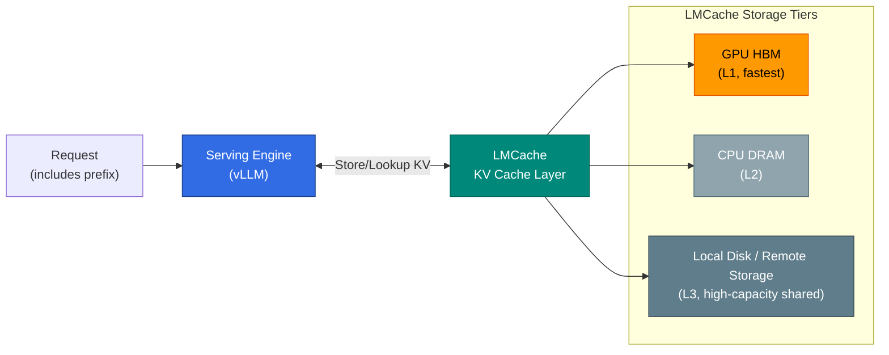

## Overview

**LMCache** is a KV cache tier that offloads the LLM inference KV cache (Key-Value Cache) beyond GPU memory to CPU DRAM, local disk, or remote storage, and makes it reusable across multiple inference instances. Integrated with serving engines such as vLLM, it shares KV cache — previously confined to a single Pod's GPU memory — across a broader scope.

This document explains what LMCache is and where it fits in the inference infrastructure. For the fundamentals of KV cache itself (PagedAttention, Prefix Caching), see [KV Cache Optimization](./kv-cache-optimization.md), and for the strategy that raises the cache hit rate, see [Cache-Hit Strategy](./cache-hit-strategy.md).

## Background: Why Offload KV Cache

vLLM's in-GPU Prefix Caching reuses prefill computation for requests that share the same prefix. However, this cache has two limitations.

- **Capacity constraint**: KV cache occupies GPU memory (HBM), so when contexts are long or concurrent requests are many, the cache is evicted and recomputation occurs.
- **Scope constraint**: The in-GPU cache is **valid only within a single Pod**. Even for requests sharing the same prefix, if they are routed to a different Pod they cannot reuse the cache.

LMCache mitigates both limitations by moving the KV cache to a layer outside the GPU. KV blocks evicted from the GPU are not discarded but stored in CPU or disk and brought back, and sharing external storage lets **multiple Pods reuse the same KV cache**.

## Position of LMCache

LMCache sits between the serving engine and the routing layer, handling KV cache storage and lookup. Its position in the overall inference infrastructure corresponds to L5 (cache layer) in the layered tuning model of the [Inference Infrastructure Overview](../inference-infrastructure-overview.md).

KV cache is stored in tiers with different access speeds and capacities. Blocks evicted from the fastest GPU HBM move to CPU DRAM, then down to disk or remote storage, and are pulled back upward in reverse order on reuse.

## Relationship with Adjacent Technologies

LMCache does not operate in isolation; it is used together with other inference optimization technologies.

| Technology | Relationship | Notes |
|------|------|------|
| **vLLM Prefix Cache** | LMCache extends it beyond the GPU | LMCache catches and preserves blocks evicted from the in-GPU cache |
| **NIXL** | KV transfer path | Used to move KV from prefill to decode in Disaggregated Serving (see [Disaggregated Serving](./disaggregated-serving.md#nixl-공통-kv-cache-전송-엔진)) |
| **kvaware Routing** | Leverages LMCache's shared cache | Routes to Pods holding the cache, raising hit rate |

In particular, **kvaware/prefixaware routing** becomes more effective when there is a shared KV layer like LMCache. If the router knows which Pod holds which KV blocks, it can send requests to a Pod with the cache and skip prefill. This routing strategy is covered in [KV Cache-Aware Routing](./kv-cache-optimization.md#kv-cache-aware-routing), and router option comparisons (EPP · HyperPod · Dynamo) are covered in [Routing Strategy — L2 Option Comparison](../inference-routing/routing-strategy.md#l2-옵션-비교-epp-vs-hyperpod-inference-operator-vs-dynamo).

In AWS managed environments, the SageMaker HyperPod Inference Operator provides KV cache configuration compatible with LMCache. For details, see [HyperPod Inference Operator — KV Cache Configuration](../inference-frameworks/hyperpod-inference-operator.md#kv-캐시-구성-l1l2-캐시와-라우팅-전략).

## Adoption Considerations

- **CPU offload trade-off**: GPU↔CPU KV transfer uses PCIe bandwidth, so for short contexts where transfer is slower than recomputation, the gain is small. The effect is large for long contexts and high prefix-sharing ratios.
- **Shared storage consistency**: When multiple Pods share external storage, KV block integrity and model/version consistency must be guaranteed.
- **Version compatibility**: LMCache is tightly coupled with the serving engine, so verify compatible versions with vLLM and the Inference Operator before adoption.

## References

### Official Documentation
- [LMCache GitHub](https://github.com/LMCache/LMCache) — LMCache open-source project repository
- [vLLM Documentation](https://docs.vllm.ai/) — vLLM serving engine and KV cache management

### Papers / Tech Blogs
- [CacheBlend (EuroSys 2025)](https://arxiv.org/abs/2405.16444) — Research on reusing non-prefix KV cache
- [PagedAttention (SOSP 2023)](https://arxiv.org/abs/2309.06180) — Foundational paper on vLLM KV cache management

### Related Documents (Internal)
- [KV Cache Optimization](./kv-cache-optimization.md) — PagedAttention · Prefix Caching · KV Cache-Aware Routing
- [Cache-Hit Strategy](./cache-hit-strategy.md) — Unified strategy across the KV/Prompt/Semantic 3-layer cache
- [Semantic Caching Strategy](./semantic-caching-strategy.md) — Gateway-level semantic caching design principles
- [Disaggregated Serving](./disaggregated-serving.md) — NIXL-based KV transfer and Prefill/Decode disaggregation
