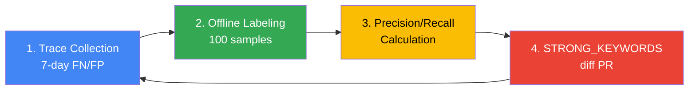

This document is a practical guide for **tuning Cascade Routing in production environments** for the Inference Gateway. Refer to [Gateway Routing Strategy](./routing-strategy.md) first for architecture concepts and basic implementation.

:::info Target Audience
This document targets platform operators and MLOps engineers. It assumes LLM Classifier or LiteLLM-based Cascade Routing is already deployed and seeks to improve accuracy and cost based on actual production traffic.
:::

:::caution Verification pending
Query contracts, rollout gates, and fallback design have received static review; operational verification remains pending. The earlier draft did not provide verifiable artifacts for its dates, request counts, or performance numbers, so those numbers are not presented as measurements. Operators must complete and review the evidence procedure below.

[Issue #5](https://github.com/devfloor9/engineering-playbook/issues/5)
:::

---

## Tuning Goals and SLO Definition

Evaluate cost, quality, and availability together. Workload owners must approve targets before evaluation; illustrative numbers below are not accepted SLOs.

### SLO Examples (GLM-5 + Qwen3-4B Environment)

| Metric | Definition | Required evidence |
|---|---|---|
| TTFT p95/p99 | Seconds from gateway receipt to first response token | Histograms by model/input length; separate total stream duration |
| Cost per request | Allocated window cost / initial requests in that window | Ledger including retries, fallback, and idle GPUs |
| Classification error | (FP + FN) / N labeled samples | Label rules, sample seed, denominator, confidence interval |
| Routing mismatch | classifier_result differs from actual_tier / completed requests | fallback_reason and actual model per attempt |
| SLM usage | Final weak responses / final responses | Failures, cache hits, and incomplete requests reported separately |

### Measurement Cycle

Observe errors, TTFT, and fallback_reason continuously and review daily labeled samples. Match control and candidate by time window, request class, and token-length distribution. Feedback-only samples do not estimate the overall error rate.

### Success Metric Calculation Example

This function consumes a normalized local export, not Langfuse SDK objects. Rates are fractions from 0 to 1; missing cost is not converted to zero.

```python
def calculate_metrics(rows):
    # Normalized local export: one row per initial request, not per attempt.
    labeled = [r for r in rows if r.get("required_tier") in {"weak", "strong"}
               and r.get("classifier_result") in {"weak", "strong"}]
    completed = [r for r in rows if r.get("actual_tier") in {"weak", "strong"}]
    known_cost = [r for r in rows if r.get("allocated_cost_usd") is not None]
    def ratio(n, denominator):
        return n / denominator if denominator else None
    return {
        "misroute_rate": ratio(sum(r["classifier_result"] != r["required_tier"]
                                   for r in labeled), len(labeled)),
        "label_coverage": ratio(len(labeled), len(rows)),
        "slm_usage_rate": ratio(sum(r["actual_tier"] == "weak" for r in completed),
                                len(completed)),
        "cost_coverage": ratio(len(known_cost), len(rows)),
        "cost_per_1k": (1000 * sum(r["allocated_cost_usd"] for r in rows) / len(rows)
                        if rows and len(known_cost) == len(rows) else None),
    }
```

## Classification Threshold Baseline (v7 baseline)

v7 names a comparison heuristic. It does not establish a deployed version or operational acceptance.

### Classification Criteria for Verification {#production-validated-classification-criteria}

The earlier 14-day, 42,000-request, cost, and error-rate claims lacked linked evidence and have been removed. Record the UTC window, private environment identifier, configuration digest, sample manifest, and labeling rubric for reevaluation. Publish only approved aggregates.

#### STRONG_KEYWORDS (17)

Keywords are candidate complexity signals, not proof that a request requires a particular model.

```python
STRONG_KEYWORDS = [
    "리팩터", "아키텍처", "설계", "분석", "최적화", "디버그", "마이그레이션",
    "refactor", "architect", "design", "analyze", "optimize", "debug",
    "migration", "complex", "performance", "security",
]
```

#### Character Threshold (500 chars) {#token_threshold-500-chars}

The previous `TOKEN_THRESHOLD` counted characters. The example uses `CHAR_THRESHOLD = 500`. Characters, UTF-8 bytes, and tokens are different units. Check model token limits separately using its tokenizer and chat template.

#### TURN_THRESHOLD (5 turns)

A turn is defined here as one user message, not `len(messages)` including system, assistant, and tool messages. Five is an unvalidated candidate threshold.

### v7 Classification Logic Complete Code

The code supports text messages only. Multimodal inputs require a separate contract and must not be silently omitted.

```python
CHAR_THRESHOLD = 500
TURN_THRESHOLD = 5

def classify_v7(messages: list[dict]) -> str:
    if any(not isinstance(m.get("content", ""), str) for m in messages):
        raise ValueError("Only text messages are supported by this example")
    content = " ".join(m.get("content", "") for m in messages)
    user_turns = sum(m.get("role") == "user" for m in messages)
    if any(kw in content.lower() for kw in STRONG_KEYWORDS):
        return "strong"
    if len(content) > CHAR_THRESHOLD or user_turns > TURN_THRESHOLD:
        return "strong"
    return "weak"
```

### Derivation Process Summary

Record version, configuration hash, sample hash, label count, FN/FP, and cost coverage. Do not use an unverified version-performance table as a baseline.

## Langfuse OTel Trace-based Misroute Detection

Classification quality, execution routing, and user feedback are different observations. Join by request_id without counting each retry as a new request.

### Misroute Definition

| Type | Exact condition |
|---|---|
| FN | classifier_result=weak, required_tier=strong |
| FP | classifier_result=strong, required_tier=weak |
| Routing mismatch | classifier_result != actual_tier; may be an intended fallback |
| Review candidate | Negative feedback or retry; not FN/FP until labeled |

### Langfuse Trace Tag Structure

Langfuse tags are a list of strings, not a dictionary. This illustrates the current OTel-based Python SDK. Pin server/SDK versions and verify export field mappings. Do not record request bodies or credentials.

```python
from langfuse import get_client, propagate_attributes

langfuse = get_client()
with propagate_attributes(tags=["classifier:v7"], metadata={
    "requestId": "synthetic-request-001",
    "classifierResult": "weak",
    "actualModelUsed": "qwen3-4b",
    "actualTier": "weak",
    "fallbackReason": "none",
    "classifierVersion": "v7",
}):
    with langfuse.start_as_current_observation(
        name="routing-decision", as_type="span"
    ):
        pass  # Synthetic instrumentation example; no model invocation.
# Short-lived scripts must flush before exit.
langfuse.flush()
```

The export adapter maps camelCase metadata to request_id, classifier_result, actual_model_used, actual_tier, fallback_reason, and classifier_version respectively. propagate_attributes metadata uses short string values and alphanumeric keys. Verify observation-to-trace aggregation locations for the pinned server/SDK versions.

### Misroute Detection Queries (Langfuse UI)

UI filters select candidates. The SQL below is a **read contract for a normalized export in SQLite/an analytics database**, not Langfuse internal tables or UI query syntax. OTel describes telemetry, not a SQL storage schema.

#### FN Detection (weak → strong needed)

Select candidates with classifier_result=weak and a low named feedback score, then confirm required_tier=strong with independent labeling. Binary thumbs use 0/1; star scores use a different scale. Fix the score name and scale.

#### FP Detection (strong → weak sufficient)

Count FP only when classifier_result=strong and required_tier=weak. A short prompt or fast TTFT does not establish that a weaker model is sufficient.

### Normalized Export and SQL Reconciliation {#automatic-extraction-via-python-script}

The export adapter must consume all pages and join the final execution outcome with an independent label per request_id. Load the schema below, then compare SQL results with calculate_metrics on the same local data. Report duplicate, unlabeled, and missing-cost counts separately.

```sql
-- One row per request; nullable labels/costs are intentional.
CREATE TABLE routing_evidence (
  request_id TEXT PRIMARY KEY, classifier_version TEXT NOT NULL,
  classifier_result TEXT NOT NULL CHECK (classifier_result IN ('weak','strong')),
  actual_tier TEXT CHECK (actual_tier IN ('weak','strong')),
  actual_model_used TEXT, fallback_reason TEXT,
  required_tier TEXT CHECK (required_tier IN ('weak','strong')),
  allocated_cost_usd REAL
);
SELECT classifier_version,
       COUNT(*) AS labeled_n,
       SUM(CASE WHEN classifier_result='weak' AND required_tier='strong'
                THEN 1 ELSE 0 END) AS fn,
       SUM(CASE WHEN classifier_result='strong' AND required_tier='weak'
                THEN 1 ELSE 0 END) AS fp,
       1.0 * SUM(CASE WHEN classifier_result<>required_tier THEN 1 ELSE 0 END)
         / NULLIF(COUNT(*), 0) AS misroute_rate
FROM routing_evidence
WHERE required_tier IN ('weak','strong')
GROUP BY classifier_version;
```

### Retry Pattern-based FN Detection (Advanced)

Sort requests within a pseudonymous session by UTC timestamp and use total_seconds() for elapsed time. Repeated/similar requests are review candidates only. Pin the similarity function and threshold. Neither retries nor fallback_reason replace required_tier labels.

## Keyword·Length·Turn 3-dim Tuning Playbook

### Weekly Tuning Cycle (4 stages)



### Stage 1: Trace Collection

Langfuse Public API trace retrieval uses GET and HTTP Basic authentication with the public/secret key pair. This read-only example retrieves one page; continue through meta.totalPages. Set host, window, and page explicitly; API JSON names differ from SDK attributes.

```bash
curl --fail-with-body --silent --show-error --get \
  "${LANGFUSE_HOST:?}/api/public/traces" \
  --user "${LANGFUSE_PUBLIC_KEY:?}:${LANGFUSE_SECRET_KEY:?}" \
  --data-urlencode "fromTimestamp=${FROM_UTC:?}" \
  --data-urlencode "toTimestamp=${TO_UTC:?}" \
  --data-urlencode "page=${PAGE:?}" \
  --data-urlencode "limit=100" > traces-page.json
```

Do not place keys in shared shell history or logs. Use approved secret injection.

### Stage 2: Offline Labeling (100 samples)

100 is illustrative. Sample the full traffic population with a fixed seed and report cohort/language/length coverage. Keep targeted severe-FN samples separate. Exclude unlabeled rows from the error denominator while reporting their rate.

### Stage 3: Precision/Recall Calculation

Keep raw TP/FP/FN/TN counts. precision=TP/(TP+FP), recall=TP/(TP+FN), misroute=(FP+FN)/labeled count. Display a zero denominator as N/A. Do not multiply a fraction by 100 before applying percent formatting.

### Stage 4: STRONG_KEYWORDS diff PR

Include the configuration diff, preregistered SLOs, label-set hash, sample size, observation window, before/after counts and confidence intervals, and rollback configuration. Leave unavailable results as pending.

## Canary Threshold Rollout

10% → 50% → 100% is a candidate progression. Each promotion requires both minimum observation time and minimum sample size; 48 elapsed hours alone is not approval.

### kgateway BackendRef Weight-based Canary

HTTPRoute backendRefs weights are relative. They do not guarantee an exact request percentage or session affinity. For a parentRef across namespaces, verify the Gateway listener’s allowedRoutes. Check Accepted, ResolvedRefs, and observed cohort share.

#### Phase 1: 10% Canary

This is an unapplied example. The cascade_* PromQL metrics are application-owned instrumentation, not default Envoy metrics. The TTFT histogram covers requests that received a first token, so also check failures before first token.

```yaml
apiVersion: gateway.networking.k8s.io/v1
kind: HTTPRoute
metadata:
  name: llm-classifier-canary
  namespace: ai-inference
spec:
  parentRefs:
    - name: unified-gateway
      namespace: ai-gateway
  rules:
    - matches:
        - path:
            type: PathPrefix
            value: /v1/
      backendRefs:
        - name: llm-classifier-v7
          port: 8080
          weight: 90
        - name: llm-classifier-v8
          port: 8080
          weight: 10
```

```promql
# Application-owned counters/histograms; instrument these names explicitly.
100 * sum by (classifier_version) (
  rate(cascade_requests_total{outcome="error"}[5m])
) / sum by (classifier_version) (rate(cascade_requests_total[5m]))

histogram_quantile(0.95,
  sum by (le, classifier_version) (rate(cascade_ttft_seconds_bucket[5m]))
)
```

#### Phase 2: 50% Acceptance Gates {#phase-2-50-error-rate--2}

Before changing 90:10 to 50:50, compare control and candidate errors, TTFT, FN/FP, cost coverage, and fallback rate. Promotion follows preregistered gates.

#### Phase 3: 100% Acceptance Gates {#phase-3-100-error-rate--2-p99--15s}

Before moving to 0:100, verify label quality, sample size, representative windows, and rollback rehearsal evidence. Approve end-to-end response duration separately from TTFT.

### Rollback Triggers

SLO violations, severe quality regression, missing cost/telemetry, and NaN/empty series stop promotion. Under approved rollback conditions, restore stable:canary to 100:0 and record controller propagation, surviving streams, and response recovery. One Prometheus sample cannot establish five continuous minutes; use an alert for: 5m or interval evidence.

## Spot Interruption·Rate Limit Fallback

Fallback depends on quality/security policy, remaining deadline, and execution state. Bound retries across both the gateway and Bifrost.

### Approved Alternate Paths on Spot Interruption {#automatic-downgrade-on-spot-interruption}

On Spot warning, direct new requests to healthy equivalent capacity. Use a lower tier only when the request policy permits it. Rate limiting is admission control, not a destination. Cache reuse requires matching tenant, authorization, model/prompt version, and TTL.

#### kgateway Retry Configuration

gateway.envoyproxy.io/BackendTrafficPolicy belongs to Envoy Gateway, not kgateway. Use the deployed kgateway version’s documented retry policy/CRD. HTTPRoute weights do not define a failover order. Honor Retry-After and the total deadline for 429.

#### LLM Classifier Internal Fallback Logic

This is an implementation state-machine contract, not executable code. Do not retry side-effecting tool calls unless deduplication has been verified.

```text
admit within quota and total deadline
  -> approved valid cache hit: return cached response
  -> healthy primary / equivalent backend
  -> retry eligible transient failure within shared attempt budget
  -> approved lower tier if quality/data policy allows
  -> approved cache if still valid and available
  -> explicit 429/503 (or stream error after headers)

401/403/invalid request: no downgrade or provider bypass
first response token sent: no transparent replay of the stream
record every attempt, model ID, reason, status, and elapsed time
```

### Rate Limit Fallback (External Providers)

Provider switching requires compatible data boundaries, model capabilities, context length, and tool schemas. Merely configuring another provider does not enable fallback.

#### LiteLLM Fallback Configuration

Define distinct LiteLLM model_name groups and reference those names in fallbacks. Two deployments with the same model_name form a load-balancing group. Do not attach an Anthropic API key to a Bedrock inference-profile ID. Verify actual model IDs, authentication, and retry settings against the pinned LiteLLM version.

#### Bifrost CEL Rules Fallback

Bifrost’s documented fallback request uses an ordered list of provider/model pairs. Validate governance rule configuration against the deployed schema. The speculative CEL/retry JSON has been removed. Replay 429, connection failure, exhausted deadline, authorization failure, and partial streams separately and record actual attempt order.

## Cost Drift Monitoring·Alerts

Derive estimates from a ledger that can be reconciled with billing. The count of up targets is not the number of billed nodes or idle cost.

### AMP Recording Rule (Hourly Cost)

cascade_allocated_cost_usd_total is a cumulative counter exported by the cost ledger. Allocate each cost interval once and handle retries, idle capacity, and shared-node double counting. Do not apply increase() to an hourly-cost gauge. AMP ruler files use groups/rules; PrometheusRule is an Operator CRD, not a direct AMP rule format.

```yaml
groups:
  - name: cascade_cost
    rules:
      - record: cascade:cost_usd_per_hour
        expr: sum(rate(cascade_allocated_cost_usd_total[1h])) * 3600
      - record: cascade:cost_per_request_usd
        expr: |
          (sum(increase(cascade_allocated_cost_usd_total[1h]))
           / sum(increase(cascade_requests_total[1h])))
          and (sum(increase(cascade_requests_total[1h])) > 0)
```

### Grafana Panel (Cost Trend)

Display cascade:cost_usd_per_hour as USD/hour and cascade:cost_per_request_usd as USD/request. Show collection delay, missing data, and request volume; zero-request windows are N/A.

### Budget 80% Alert

The $80 threshold is illustrative. [24h] is a rolling window, not a calendar day. Reconcile monthly budgets using a ledger aligned to billing time zone and calendar boundaries.

```yaml
groups:
  - name: cascade_budget
    rules:
      - alert: Rolling24HourBudget80Percent
        expr: sum(increase(cascade_allocated_cost_usd_total[24h])) > 80
        for: 5m
        labels:
          severity: warning
        annotations:
          summary: "Rolling 24-hour allocated cost exceeded example threshold"
```

### Cost Drift Detection (Weekly Comparison)

Compare weekly cost using increase(...[7d]) on the cumulative cost counter. Suppress ratio alerts when the previous period is zero or coverage is insufficient and report insufficient data. Separate volume, model mix, and token-length changes from unit-cost drift.

## Anti-patterns and Practical Pitfalls

These are risk scenarios for review. To publish one as an incident, an operator must supply date, versions, cause, response, and deidentified evidence.

### Anti-pattern 1: Bifrost single base_url Bypass Failure

Model distinct vLLM endpoints as separate Bifrost custom providers and validate base_provider_type, base_url, and allowed models against the versioned schema. Do not assume a path override also permits overriding the host.

### Anti-pattern 2: RouteLLM Production Deployment Forcing

Research results alone do not establish operational suitability for RouteLLM or another router. Verify pinned dependencies, image size, startup, quality, and failure behavior; do not claim a project always fails to install.

### Anti-pattern 3: model: "auto" Hardcoding Omission

Set the selected backend’s served model ID for OpenAI-compatible requests. Removing model may make the request invalid. Define precedence for explicit-model requests versus auto routing.

```python
SERVED_MODELS = {"weak": "qwen3-4b", "strong": "glm-5"}

def backend_body(body, tier):
    return {**body, "model": SERVED_MODELS[tier]}
```

### Anti-pattern 4: Korean/English Mixed Keyword Omission

Measure recall by language and cover mixed language, spacing, case, and boundaries with local fixtures. A missing keyword does not force every request to weak.

### Anti-pattern 5: v7 → v8 Transition Without Canary Rollout

Do not promote to 100% before validating promotion/rollback gates and endpoint propagation. The 10/50/100 shares are service-specific choices.

### Anti-pattern 6: Only Watch Misroute Rate, Ignore SLM Usage Rate

Do not sacrifice quality to maximize SLM share. Compare quality, cost per request, errors, and TTFT on the same labeled population.

## Operator acceptance evidence {#operator-acceptance-evidence}

1. Pin the UTC window, region, private cluster/namespace identifiers, Langfuse server/SDK, classifier, kgateway, Bifrost, model/tokenizer, and configuration digest in a private manifest. This documentation review performed no deployment, load test, or model invocation.
2. Check local synthetic fixtures with one TP/FP/FN/TN each, intended fallback, missing label, duplicate request_id, missing cost, and zero requests. The four base labels yield 2/4 errors. SQL and Python must agree on denominators and results. Static fixtures do not validate deployed Langfuse data.
3. Verify metadata-to-export schema mapping, pagination, and attempt deduplication on approved exports. Reconcile SQL results and missing-data rates with manually adjudicated counts.
4. In an operator-approved environment, preregister minimum cohort counts, observation time, and error/TTFT/classification/cost tolerances. Preserve control comparisons and rollback timelines at 10/50/100. Missing telemetry stops promotion.
5. Validate 429/Retry-After, 503, connection failure, both backends failing, cache miss/expiry/authorization mismatch, and partial streams. Expected and observed attempt order must match, without duplicate tool execution or unauthorized model/tenant switching.
6. Record deidentified results, configuration hash, UTC timestamps, decisions, and approver. Add incident examples only when real evidence is approved for publication. Keep verification pending until every residual item is accepted.

## Related documents {#references}

### Architecture and Strategy

- [Gateway Routing Strategy](./routing-strategy.md) - 2-Tier architecture, Cascade/Semantic Router, LLM Classifier concepts
- [Inference Gateway Deployment Guide](../../reference-architecture/inference-gateway/setup/) - kgateway Helm installation, HTTPRoute YAML, LLM Classifier deployment code

### Monitoring and Cost

- [Agent Monitoring](../../operations-mlops/observability/agent-monitoring.md) - Langfuse architecture, core metrics, alert strategy
- [Monitoring Stack Configuration Guide](../../reference-architecture/integrations/monitoring-observability-setup.md) - Langfuse Helm, AMP/AMG, ServiceMonitor, Grafana dashboard
- [Coding Tools & Cost Analysis](../../reference-architecture/integrations/coding-tools-cost-analysis.md) - Aider/Cline connection, cost optimization tips

### Frameworks and Models

- [vLLM Model Serving](../../model-serving/inference-frameworks/vllm-model-serving.md) - vLLM deployment, PagedAttention, Multi-LoRA
- [Semantic Caching Strategy](../inference-optimization/semantic-caching-strategy.md) - 3-tier cache, similarity thresholds, observability

---

## References {#references-1}

### Official Documentation

- [Langfuse Documentation](https://langfuse.com/docs)
- [LiteLLM Routing](https://docs.litellm.ai/docs/routing)
- [Bifrost Documentation](https://www.getmaxim.ai/bifrost/docs)
- [Kubernetes Gateway API](https://gateway-api.sigs.k8s.io/)
- [Amazon Managed Prometheus](https://docs.aws.amazon.com/prometheus/)
- [Langfuse SDK instrumentation](https://langfuse.com/docs/observability/sdk/instrumentation) — OTel SDK contract
- [Langfuse API reference](https://api.reference.langfuse.com/) — traces, pagination, HTTP Basic authentication
- [Gateway API traffic splitting](https://gateway-api.sigs.k8s.io/guides/user-guides/traffic-splitting/) — relative weights
- [Prometheus functions](https://prometheus.io/docs/prometheus/latest/querying/functions/) — counters, rate, histograms
- [Bifrost fallbacks](https://docs.getbifrost.ai/features/retries-and-fallbacks) — provider/model fallback order

### Research Materials

- [RouteLLM: Learning to Route LLMs with Preference Data (arXiv)](https://arxiv.org/abs/2406.18665)
- [LMSYS Chatbot Arena Leaderboard](https://arena.ai/leaderboard/text)
- [FrugalGPT: How to Use Large Language Models While Reducing Cost and Improving Performance](https://arxiv.org/abs/2305.05176)

### Related Blogs

- [LLM Router Pattern: Model Switching](https://markaicode.com/llm-router-pattern-model-switching/)
