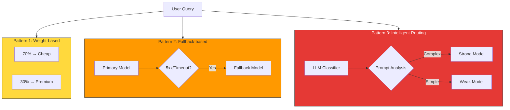
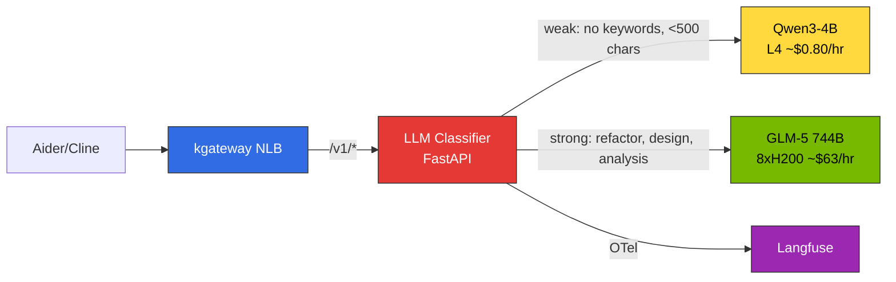
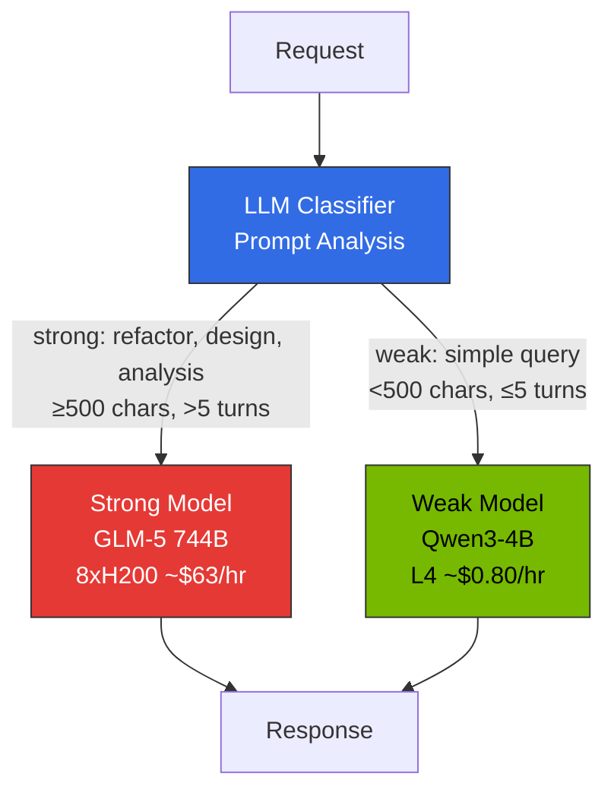

This document covers the implementation approaches (LLM Classifier, LiteLLM, vLLM Semantic Router) and selection criteria for **Request Cascading**, which analyzes request complexity and automatically distributes requests to the appropriate model. For the 2-Tier gateway architecture and overall routing strategy, see [Gateway Routing Strategy](./routing-strategy.md).

## Request Cascading: Intelligent Model Routing

### Concept

**Request Cascading** is an intelligent optimization technique that automatically analyzes request complexity and routes to appropriate models. Simple queries go to cheap and fast models, complex reasoning to powerful models, simultaneously improving cost and latency. IDEs use a single endpoint only; model selection is centrally controlled at platform level.

### Three Cascading Patterns

| Pattern | Description | Implementation | Use Case |
|------|------|------|----------|
| **1. Weight-based** | Distribute traffic by fixed ratio | kgateway `backendRef weight` | A/B testing, gradual model migration |
| **2. Fallback-based** | Auto-switch to another model on error | kgateway retry + multiple backendRef | Availability improvement, rate limit avoidance |
| **3. Intelligent routing** | Auto-select model after request analysis | **LLM Classifier** / LiteLLM / vLLM Semantic Router | Cost optimization, quality maintenance |



### Practical Request Cascading Implementation

Intelligent cascade routing analyzes request complexity and auto-routes to appropriate models. This section focuses on verified approaches in self-hosted environments.

#### Approach A: LLM Classifier (Recommended — Field-Validated)

**LLM Classifier** is a Python FastAPI-based lightweight router that directly analyzes prompt content to auto-select SLM/LLM. It operates as ExtProc (External Processing) or independent service behind kgateway, with clients using only a single endpoint (`/v1`).



**Classification Criteria:**

| Criteria | weak (SLM) | strong (LLM) |
|------|-----------|-------------|
| **Keywords** | None | Refactor, architecture, design, analysis, debug, optimization, migration, etc. |
| **Input length** | < 500 chars | ≥ 500 chars |
| **Conversation turns** | ≤ 5 turns | > 5 turns |

**Core Classification Logic:**

```python
STRONG_KEYWORDS = ["refactor", "architect", "design", "analyze",
                   "optimize", "debug", "migration", "complex"]
TOKEN_THRESHOLD = 500

def classify(messages: list[dict]) -> str:
    content = " ".join(m.get("content", "") for m in messages if m.get("content"))
    # Keyword matching
    if any(kw in content.lower() for kw in STRONG_KEYWORDS):
        return "strong"
    # Input length
    if len(content) > TOKEN_THRESHOLD:
        return "strong"
    # Conversation turns
    if len(messages) > 5:
        return "strong"
    return "weak"
```

**Pros**: No client modification needed, direct prompt analysis, direct Langfuse OTel transmission, simple deployment (single Pod)
**Cons**: Classification accuracy depends on heuristics (can be gradually improved with ML classifier)

:::tip Why LLM Classifier is Optimal
Standard OpenAI-compatible clients (Aider, Cline, etc.) only configure **a single `base_url`**. LLM Classifier analyzes prompts behind this single endpoint and proxies directly to backend vLLM instances. Clients are completely unaware of model selection.
:::

#### Bifrost Self-hosted Cascade Limitations

We attempted to use Bifrost for self-hosted vLLM cascade but switched to **LLM Classifier** due to the following limitations:

| Limitation | Description |
|------|------|
| **provider/model format enforcement** | Requires `openai/glm-5` format. Standard OpenAI clients (Aider, etc.) expect single model names like `model: "auto"` |
| **Single base_url per provider** | Only one `network_config.base_url` per provider (e.g., `openai`). Cannot route to same provider if SLM and LLM are on different Services |
| **No prompt access in CEL** | CEL Rules only access `request.headers`. Cannot analyze request body (prompt content) for routing |
| **Model name normalization issues** | Unpredictable normalization like hyphen removal causes mismatch with vLLM `served-model-name` |

:::warning Bifrost is Best for External LLM Provider Integration
Bifrost is optimized for **external provider integration** (OpenAI/Anthropic/Bedrock) and **failover**. LLM Classifier is better suited for intelligent cascade routing between self-hosted vLLM instances.
:::

#### RouteLLM Evaluation Results

[RouteLLM](https://github.com/lm-sys/RouteLLM) is an open-source routing framework developed by LMSYS, with academically validated Matrix Factorization-based classification models (90%+ accuracy on LMSYS Chatbot Arena data).

However, the following issues were confirmed during K8s deployment:

- **Dependency conflicts**: Large dependency trees like `torch`, `transformers`, `sentence-transformers` conflict with vLLM environments
- **Container size**: Image size 10GB+ with classification model (unsuitable for lightweight router)
- **Deployment instability**: High frequency of pip dependency resolution failures
- **Maintenance**: Research project nature with no production support

**Conclusion**: RouteLLM's MF classifier **concept** is valid, but for production deployment we recommend **LLM Classifier** (lightweight heuristics) or **LiteLLM complexity routing** (external provider environments).

#### Approach B: LiteLLM Native (External Provider Environment)

LiteLLM natively supports **complexity-based routing**. Adding just 1 line to the config file enables automatic request complexity analysis and model selection.

```yaml
model_list:
  - model_name: gpt-4-turbo
    litellm_params:
      model: gpt-4-turbo-preview
      api_key: os.environ/OPENAI_API_KEY
  - model_name: gpt-3.5-turbo
    litellm_params:
      model: gpt-3.5-turbo
      api_key: os.environ/OPENAI_API_KEY

router_settings:
  routing_strategy: complexity-based  # Enable with this 1 line
  complexity_threshold: 0.7           # ≥ 0.7 → stronger model
```

**Pros**: Activate with 1-line config, auto-analyzes prompt length·code inclusion·reasoning keywords, 100+ provider support
**Cons**: Python-based low throughput, complexity algorithm not customizable, overhead for self-hosted vLLM

#### Approach C: vLLM Semantic Router (vLLM-only)

In vLLM environments, **vLLM Semantic Router** can be used for lightweight embedding-based routing. It matches embeddings to pre-defined "categories" to select models.

```python
# vLLM Semantic Router configuration
from vllm import SemanticRouter

router = SemanticRouter(
    categories={
        "simple": ["basic question", "quick answer", "definition"],
        "complex": ["explain in detail", "analyze", "step by step"]
    },
    models={
        "simple": "qwen3-4b",
        "complex": "glm-5-744b"
    },
    threshold=0.85
)

# Auto-routing
response = router.route(prompt="Explain the architecture...")  # → glm-5-744b
```

**Pros**: vLLM native, lightweight embedding usage (inference latency < 5ms), simple configuration
**Cons**: vLLM-only, requires pre-defined categories

### Cascade Routing Implementation Selection Guide

| Environment | Recommended Approach | Reason |
|------|----------|------|
| **Self-hosted vLLM (Aider/Cline)** | **LLM Classifier** | Direct prompt analysis, single endpoint, no client modification |
| **External providers (OpenAI/Anthropic)** | **LiteLLM** | 100+ providers native, complexity routing 1-line |
| **vLLM standalone + embeddings available** | **vLLM Semantic Router** | vLLM native, lightweight |
| **Hybrid (external + self-hosted)** | **LLM Classifier + LiteLLM** | Self-hosted via Classifier, external via LiteLLM |

### Cascade Routing Strategy (Fallback-based)

Try **cheap -> balanced -> frontier** models progressively based on complexity.

**Complexity Classification Criteria (as of 2026-04):**

| Complexity | Conditions | Recommended Model | Cost per Token |
|--------|------|----------|-----------|
| **Simple** | Tokens < 200, no keywords | Haiku 4.5 / GPT-4.1 nano | $0.80-$0.15/M |
| **Medium** | Tokens 200-1000, code included | Sonnet 4.6 / Gemini 2.5 Flash | $3-$0.10/M |
| **Complex** | Tokens 1000+, reasoning keywords | Opus 4.7 / GPT-4.1 | $15-$10/M |

**Fallback Conditions**: HTTP 5xx, Rate Limit exceeded, Timeout, Quality Score < 0.7 (optional)

### Cost Savings Effect (as of 2026-04)

10,000 requests/day scenario:
- Simple (50%): Haiku 4.5 — 50 tok in, 100 tok out → $0.50/day
- Medium (30%): Sonnet 4.6 — 500 tok in, 500 tok out → $2.70/day
- Complex (15%): Opus 4.7 — 1500 tok in, 1000 tok out → $3.38/day
- Very Complex (5%): Opus 4.7 — 3000 tok in, 2000 tok out → $3.00/day

**Total cost: $9.58/day ($287/month)**

Processing all requests with Opus 4.7: $45/day ($1,350/month) → **79% savings**

**Self-hosted LLM Classifier Scenario** (as of 2026-04):
- Qwen3-4B (70% weak, L4 ~$0.80/hr × 24hr × 30d) = $216/month
- GLM-5 744B (30% strong, H200 $12/hr × 24hr × 30d × 0.3) = $2,592/month
- Langfuse + AMP/AMG = $200/month

**Total cost: $3,008/month** (vs GLM-5 alone $8,900/month → **66% savings**)

### Enterprise Model Routing Patterns

**Implementation Location Priority**: Gateway > IDE > Client

| Location | Advantages | Suitable Environment |
|------|------|----------|
| **Gateway (LLM Classifier)** | Prompt analysis, central control, no client modification | Self-hosted **(Recommended)** |
| **Gateway (LiteLLM/Bifrost)** | Multi-provider, policy consistency | External providers |
| **IDE (Claude Code)** | Context awareness | Dev tool vendors |
| **Client (SDK)** | High flexibility | Prototype |

**Field Recommendation**: In self-hosted environments, deploy with **kgateway → LLM Classifier → vLLM** structure for centralized routing. Developers use only a single endpoint (`/v1`), and platform teams manage classification policies. For detailed deployment guide, refer to [Inference Gateway Deployment: LLM Classifier](../../reference-architecture/inference-gateway/setup/advanced-features.md#llm-classifier-deployment).

---

## Research Reference: RouteLLM

**RouteLLM** is an open-source LLM routing framework developed by LMSYS. A lightweight classification model (Matrix Factorization) analyzes requests to automatically select strong/weak models.



| Item | RouteLLM (Research) | LLM Classifier (Production) |
|------|----------------|---------------------|
| **Classification method** | Matrix Factorization embedding | Keywords + token length + conversation turns |
| **Input** | User prompt + conversation history | Same |
| **Output** | Strong/Weak + confidence score | Strong/Weak |
| **Added latency** | < 10ms (MF inference) | < 1ms (rule-based) |
| **Dependencies** | torch, transformers, sentence-transformers | FastAPI, httpx (lightweight) |
| **K8s deployment** | Unstable (dependency conflicts) | Stable (50MB image) |

:::warning RouteLLM Production Deployment Caution
RouteLLM is a research project; K8s production deployment is not recommended. Dependency conflicts and large image size (10GB+) are problematic. The MF classifier **concept** is useful, but for production we recommend **LLM Classifier** (self-hosted) or **LiteLLM complexity routing** (external provider environments).
:::

For detailed deployment code, refer to [Inference Gateway Deployment Guide: LLM Classifier](../../reference-architecture/inference-gateway/setup/advanced-features.md#llm-classifier-deployment).

---

## References

### Official Documentation
- [LiteLLM Routing](https://docs.litellm.ai/docs/routing) — LiteLLM built-in routing strategies and custom strategies
- [vLLM Semantic Router](https://github.com/vllm-project/semantic-router) — Standalone routing service under the vLLM project
- [RouteLLM](https://github.com/lm-sys/RouteLLM) — LMSYS open-source LLM routing framework

### Related Documents (Internal)
- [Gateway Routing Strategy](./routing-strategy.md) — 2-Tier architecture, Gateway API Inference Extension, solution comparison
- [Cascade Routing Tuning](./cascade-routing-tuning.md) — Classification threshold/keyword tuning, misroute detection, cost drift alerting
- [Inference Gateway Deployment: Advanced Features](../../reference-architecture/inference-gateway/setup/advanced-features.md) — LLM Classifier deployment code
