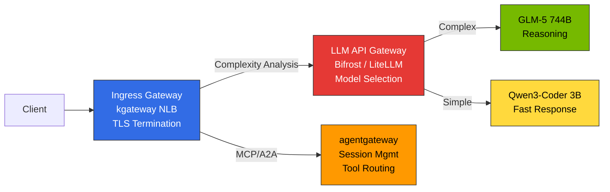
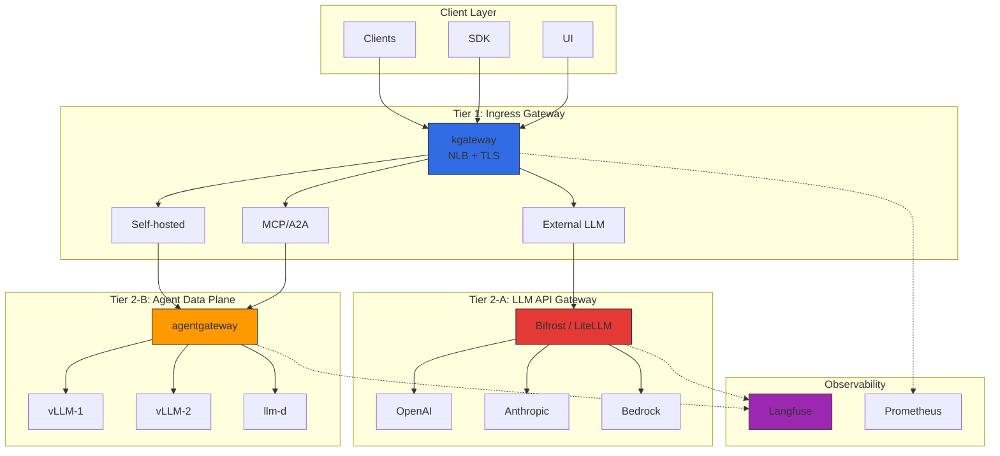
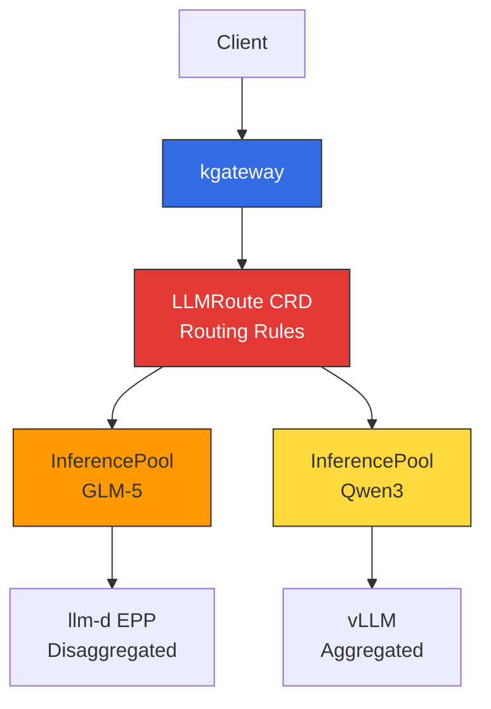

This document covers **design principles** for 2-Tier gateway architecture and routing strategies (Cascade / Semantic Router / Hybrid). For actual **deployment procedures** including Helm installation, HTTPRoute manifests, and OTel integration, refer to [Inference Gateway Deployment Guide](../../reference-architecture/inference-gateway/setup/).

## Overview

In large-scale AI model serving environments, **infrastructure traffic management** and **LLM provider abstraction** must be separated. A single gateway leads to exponential complexity and makes optimizing each layer difficult.

**2-Tier Gateway Architecture**:
- **L1 (Ingress Gateway)**: kgateway — Kubernetes Gateway API standard, traffic routing, mTLS, rate limiting
- **L2-A (Inference Gateway)**: Bifrost/LiteLLM — Provider integration, cascade routing, semantic caching
- **L2-B (Data Plane)**: agentgateway — MCP/A2A protocols, stateful session management

Each tier is managed independently, separating infrastructure and AI workloads.

---

## 2-Tier Gateway Architecture

:::tip Gateway layer definitions are unified in a dedicated document
The platform-wide gateway-layer terminology and role definitions are consolidated in [Tiered Gateway Architecture](./tiered-gateway-architecture.md). This document focuses on the routing strategy of **Tier 2-A (LLM API Gateway)**. For in-cluster inference pod routing (Tier 2 ① Inference Extension), see the [Gateway API Inference Extension](#gateway-api-inference-extension) section below.
:::

### Gateway Layer Separation

LLM inference platforms must clearly distinguish **3 different Gateway roles**. (For the full layer definitions, see [Tiered Gateway Architecture](./tiered-gateway-architecture.md))

| Gateway Type | Role | Implementation | Location |
|-------------|------|-------|------|
| **Ingress Gateway** | External traffic ingress, TLS termination, path-based routing | kgateway (NLB integration) | Tier 1 |
| **LLM API Gateway** | Model selection, intelligent routing, request cascading (external/internal model abstraction) | Bifrost / LiteLLM | Tier 2-A |
| **Agent Data Plane** | MCP/A2A protocols, stateful sessions, tool routing | agentgateway | Tier 2-B |

> **Terminology note**: Here, **Tier 2-A "LLM API Gateway"** is a provider proxy (Bifrost/LiteLLM) that abstracts the model API. It serves a different purpose from the **Gateway API Inference Extension** (Tier 2 ①, later in this document) that routes to in-cluster inference pods.

**Core Principles:**
- **Ingress Gateway (kgateway)**: Handles network-level traffic control only. Does not include model selection logic
- **LLM API Gateway (Bifrost/LiteLLM)**: Analyzes request complexity → Automatically selects appropriate model → Cost optimization
- **Agent Data Plane (agentgateway)**: Handles AI-specific protocols (MCP/A2A), maintains stateful sessions

### Overall Architecture

### Responsibility Separation by Tier

| Tier | Component | Responsibility | Protocol |
|------|----------|------|----------|
| **Tier 1** (Ingress Gateway) | kgateway (Envoy-based) | Traffic routing, mTLS, rate limiting, network policies | HTTP/HTTPS, gRPC |
| **Tier 2-A** (LLM API Gateway) | Bifrost / LiteLLM | Intelligent model selection, cost tracking, request cascading, semantic caching | OpenAI-compatible API |
| **Tier 2-B** (Agent Data Plane) | agentgateway | MCP/A2A session management, self-hosted inference routing, Tool Poisoning prevention | HTTP, JSON-RPC, MCP, A2A |

### Traffic Flow

**External LLM**: Client → kgateway → Bifrost/LiteLLM (Cascade + Cache) → OpenAI → Response + Cost tracking
**Self-hosted vLLM**: Client → kgateway → agentgateway → vLLM → Response

---

## kgateway (L1 Inference Gateway)

### Gateway API-based Routing

kgateway implements the Kubernetes Gateway API standard, enabling vendor-neutral configuration.

import { ComponentStructureTable } from '@site/src/components/InferenceGatewayTables';

<ComponentStructureTable />

Gateway API v1.2.0+ provides HTTPRoute improvements, GRPCRoute stabilization, and BackendTLSPolicy, fully supported by kgateway v2.0+.

### Dynamic Routing Concepts

| Routing Type | Criteria | Use Case |
|------------|------|----------|
| **Header-based** | `x-model-id`, `x-provider` | Backend selection by model/provider |
| **Path-based** | `/v1/chat/completions`, `/v1/embeddings` | Service separation by API type |
| **Weight-based** | backendRef weight | Canary deployment, A/B testing |
| **Composite conditions** | Headers + Path + Tier | Premium/standard customer backends |

Canary deployments start with 5-10% traffic and gradually increase, with immediate rollback via weight=0 on issues.

### Load Balancing Strategies

| Strategy | Description | Suitable Scenario |
|------|------|--------------|
| **Round Robin** | Sequential distribution (default) | Uniform model instances |
| **Random** | Random distribution | Large backend pools |
| **Consistent Hash** | Same key → Same backend | KV Cache reuse, session affinity |

Consistent Hash is particularly useful for LLM inference. Routing requests from the same user to the same vLLM instance increases prefix cache hit rates, significantly improving TTFT (Time to First Token).

### Topology-Aware Routing (Kubernetes 1.33+)

Kubernetes 1.33+ topology-aware routing prioritizes same-AZ Pod communication to reduce cross-AZ data transfer costs.

import { TopologyEffectsTable } from '@site/src/components/InferenceGatewayTables';

<TopologyEffectsTable />

### Failure Handling Concepts

| Mechanism | Description | LLM Inference Considerations |
|----------|------|-------------------|
| **Timeout** | Maximum processing time per request | LLM long response generation takes tens of seconds. Adequate timeout needed (120s+) |
| **Retry** | Auto-retry on 5xx, timeout, connection failure | Max 3 retries. Infinite retries cause system overload |
| **Circuit Breaker** | Temporarily block backend on consecutive failures | Set `maxEjectionPercent` to 50% or below to ensure at least half backends available |

For streaming responses, `backendRequest` timeout is for first byte, `request` is for total time. POST retries require idempotency guarantees (caution with tool calls).

---

## LLM Gateway Solution Comparison

### Major Solution Comparison Table

| Solution | Language | Key Features | Cascade Routing | License | Best For |
|--------|------|-----------|-----------------|----------|-----------|
| **Bifrost** | Go/Rust | 50x faster, CEL Rules conditional routing, failover | CEL Rules + external classifier | Apache 2.0 | High performance, low cost, self-hosted |
| **LiteLLM** | Python | 100+ providers, native complexity-based routing | `routing_strategy: complexity-based` | MIT | Python ecosystem, rapid prototyping |
| **vLLM Semantic Router** | Python | vLLM-only, lightweight embedding-based routing | Embedding similarity-based | Apache 2.0 | vLLM standalone environment |
| **Portkey** | TypeScript | SOC2 certified, semantic caching, Virtual Keys | Supported | Proprietary + OSS | Enterprise, compliance |
| **Kong AI Gateway** | Lua/C | MCP support, leverages existing Kong infra | Plugin | Apache 2.0 / Enterprise | Existing Kong users |
| **Helicone** | Rust | Gateway + Observability integrated, high performance | Supported | Apache 2.0 | High performance + observability needed |
| **OpenRouter** | SaaS (hosted) | Unified API for 400+ models·60+ providers, provider fallback, OpenAI-compatible | Provider routing supported | SaaS (commercial) | Fast multi-provider integration, prototyping |

:::note Self-hosted vs SaaS
In the table above, Bifrost·LiteLLM·Helicone·vLLM Semantic Router are **self-hosted** (deployed in-cluster), whereas **OpenRouter is hosted SaaS**. SaaS provides instant access to 400+ models and delegates provider fallback/billing, which is advantageous for fast integration and prototyping. However, since prompts are sent to an external service, review the [governance considerations](../../operations-mlops/governance/ai-gateway-guardrails.md#openrouter-등-saas-게이트웨이-데이터-주권) for environments with data sovereignty or regulatory requirements.
:::

### Bifrost vs LiteLLM

**Bifrost**: Go/Rust implementation with 50x faster throughput than Python, 1/10 memory usage. CEL Rules enable conditional routing (header-based cascade, failover). Helm Chart deployment, OpenAI-compatible API. Proxy latency < 100us. Intelligent cascade via app-side complexity score calculation → `x-complexity-score` header → CEL rule branching pattern or Go Plugin.

**LiteLLM**: 100+ provider support, **native complexity-based routing** (activate with 1-line `routing_strategy: complexity-based` config), one-line Langfuse integration (`success_callback: ["langfuse"]`), direct LangChain/LlamaIndex integration. However, Python-based with lower throughput, higher memory usage.

### Selection Criteria

| Use Case | Recommended Solution | Reason |
|-----------|-----------|------|
| Intelligent cascade (convenience priority) | **LiteLLM** | Native complexity-based routing, 1-line config |
| Intelligent cascade (performance priority) | **Bifrost** | CEL Rules + external classifier, 50x faster |
| vLLM standalone environment | **vLLM Semantic Router** | vLLM native, lightweight routing |
| High performance, low cost self-hosted | **Bifrost** | 50x faster processing, low memory |
| Python ecosystem (LangChain) | **LiteLLM** | Native integration, 100+ providers |
| Enterprise compliance | **Portkey** | SOC2/HIPAA/GDPR, Semantic Cache |
| High performance + observability integrated | **Helicone** | Rust-based All-in-one |

### Recommended Combinations by Scenario

| Scenario | Recommended Stack | Reason |
|----------|----------|------|
| **Startup/PoC** | kgateway + LiteLLM | Low cost, 10-min deployment, complexity routing 1-line |
| **Self-hosted focused (performance)** | kgateway + Bifrost (CEL cascade) + agentgateway | High performance, external+self-hosted pool 2-Tier |
| **Enterprise multi-provider** | kgateway + Portkey + Langfuse | Compliance, 250+ providers |
| **Hybrid (external+self-hosted)** | kgateway + Bifrost/LiteLLM + agentgateway | External via Bifrost/LiteLLM, self-hosted via agentgateway |
| **Global deployment** | Cloudflare AI Gateway + kgateway | Edge caching, DDoS protection |

---

## Request Cascading: Intelligent Model Routing

**Request Cascading** is an intelligent optimization technique that automatically analyzes request complexity and routes to the appropriate model. The three patterns (weight-based, fallback-based, intelligent routing), implementation approach comparison (LLM Classifier, LiteLLM, vLLM Semantic Router), RouteLLM research reference, and cost savings are covered in detail in [Request Cascading — Intelligent Model Routing](./request-cascading.md).

For threshold/keyword tuning and misroute detection operations, see [Cascade Routing Tuning](./cascade-routing-tuning.md).

---

## Gateway API Inference Extension

Kubernetes Gateway API enables managing LLM inference as Kubernetes-native resources through **Inference Extension**.

### Core CRDs (Custom Resource Definitions)

| CRD | Role | Example |
|-----|------|------|
| **InferenceModel** | Define per-model serving policies (criticality, routing rules) | `criticality: high` → dedicated GPU allocation |
| **InferencePool** | Model serving Pod group (vLLM replicas) | `replicas: 3` → 3 vLLM instances |
| **LLMRoute** | Rules for routing requests to InferenceModel | `x-model-id: glm-5` → GLM-5 Pool |

For detailed YAML manifests, refer to [Inference Gateway Deployment Guide](../../reference-architecture/inference-gateway/setup/).

### Gateway API Inference Extension Integration

Gateway API Inference Extension integrates with **kgateway + llm-d EPP** to provide Kubernetes-native inference routing:

**Current Status**: Actively developed as CNCF project. Expected to provide alpha in Kubernetes 1.34+; production use not currently recommended. For production deployment, refer to [Reference Architecture](../../reference-architecture/) guides.

---

## Semantic Caching

Semantic Caching detects semantically similar prompts and reuses previous responses, simultaneously reducing LLM API costs and latency. At the Gateway level (Bifrost/LiteLLM/Portkey), HIT/MISS is determined by embedding similarity, so it can be combined independently with KV Cache (vLLM) · Prompt Cache (provider-managed).

**Recommended default threshold**: 0.85 — allows same meaning, different expression

Design principles (3-tier cache comparison, similarity threshold tradeoffs, tool comparison table, cache key design, observability·production checklist) are covered in detail in separate documentation.

- **Design Principles**: [Semantic Caching Strategy](../inference-optimization/semantic-caching-strategy.md)
- **Production Deployment Example**: LiteLLM + Redis configuration in [OpenClaw AI Gateway Deployment](./openclaw-example.md)

---

## agentgateway Data Plane

### Overview

**agentgateway** is an AI workload-dedicated data plane for kgateway. Traditional Envoy is optimized for stateless HTTP/gRPC, but AI agents have special requirements like stateful JSON-RPC sessions, MCP protocols, and Tool Poisoning prevention.

### Envoy vs agentgateway Comparison

| Item | Envoy Data Plane | agentgateway |
|------|---------------------|---------------------------|
| **Session Management** | Stateless, HTTP cookie-based | Stateful JSON-RPC sessions, in-memory session store |
| **Protocols** | HTTP/1.1, HTTP/2, gRPC | MCP (Model Context Protocol), A2A (Agent-to-Agent) |
| **Security** | mTLS, RBAC | Tool Poisoning prevention, per-session Authorization |
| **Routing** | Path/header-based | Session ID-based, tool call validation |
| **Observability** | HTTP metrics, Access Log | LLM token tracking, tool call chains, cost |

### Core Features

**1. Stateful JSON-RPC Session Management**: `X-MCP-Session-ID` header-based session tracking, Sticky Session routing, automatic inactive session cleanup (default 30 minutes)

**2. Native MCP/A2A Protocol Support**: `/mcp/v1` (MCP protocol), `/a2a/v1` (A2A agent communication) path support

**3. Tool Poisoning Prevention**: Allowed tool list, dangerous tool blocking (`exec_shell`, `read_credentials`), response size limits, integrity verification (SHA-256)

**4. Per-session Authorization**: JWT token verification, role-based tool access, session hijacking prevention

:::info agentgateway Project Status
agentgateway is an AI-dedicated data plane separated from the kgateway project in late 2025, currently under active development. Features are continuously added to keep pace with rapid evolution of MCP and A2A protocols.
:::

---

## Monitoring & Observability

### Core Metrics

Core metrics to monitor in AI inference gateways:

import { MonitoringMetricsTable } from '@site/src/components/InferenceGatewayTables';

<MonitoringMetricsTable />

| Metric Category | Key Item | Meaning |
|----------------|----------|------|
| **Latency** | TTFT (Time to First Token) | Time until first token generation. User-perceived responsiveness |
| **Throughput** | TPS (Tokens Per Second) | Tokens generated per second. Model serving efficiency |
| **Error Rate** | 5xx / Total Requests | Backend failure ratio. Immediate action if > 5% |
| **Cache Hit Rate** | Cache Hit / Total Requests | Semantic Cache efficiency. 30%+ recommended |
| **Cost** | Token usage by model × unit price | Real-time cost tracking |

### Langfuse OTel Integration

Send OTel traces from Bifrost/LiteLLM to Langfuse to track prompts/completions, token usage, cost analysis, and tool call chains. Bifrost activates via `otel` plugin, LiteLLM via `success_callback: ["langfuse"]` config. For detailed configuration, refer to [Monitoring Stack Setup](../../reference-architecture/integrations/monitoring-observability-setup.md).

### Recommended Alert Rules

| Alert | Condition | Severity |
|------|------|--------|
| High error rate | 5xx > 5% (5 min) | Critical |
| High latency | P99 > 30s (5 min) | Warning |
| Circuit breaker activated | circuit_breaker_open == 1 | Critical |
| Cache hit rate drop | Cache hit < 30% | Warning |
| Budget approaching | Budget > 80% | Warning |

---

## Related Documentation

### Production Deployment Guides

For actual code examples and YAML manifests, refer to Reference Architecture section:

- [Request Cascading — Intelligent Model Routing](./request-cascading.md) - Comparison of LLM Classifier, LiteLLM, and vLLM Semantic Router implementation approaches
- [Inference Gateway Deployment Guide](../../reference-architecture/inference-gateway/setup/) - kgateway, Bifrost, agentgateway installation and YAML manifests
- [OpenClaw AI Gateway Deployment](./openclaw-example.md) - OpenClaw + Bifrost + Hubble production deployment
- [Custom Model Deployment](../../reference-architecture/model-lifecycle/custom-model-deployment.md) - vLLM/llm-d deployment guide

### Cost and Observability

- [Coding Tools & Cost Analysis](../../reference-architecture/integrations/coding-tools-cost-analysis.md) - Aider/Cline connection, NLB unified routing patterns
- [Monitoring Stack Setup](../../reference-architecture/integrations/monitoring-observability-setup.md) - Langfuse OTel integration, Prometheus, Grafana dashboards
- [LLMOps Observability](../../operations-mlops/observability/llmops-observability.md) - Langfuse/LangSmith-based LLM observability

### Related Infrastructure

- [GPU Resource Management](../../model-serving/gpu-infrastructure/gpu-resource-management.md) - Dynamic resource allocation strategies
- [llm-d Distributed Inference](../../model-serving/inference-frameworks/llm-d-eks-automode.md) - EKS Auto Mode-based distributed inference
- [Agent Monitoring](../../operations-mlops/observability/agent-monitoring.md) - Langfuse integration guide

---

## References

### Official Documentation

- [Kubernetes Gateway API](https://gateway-api.sigs.k8s.io/)
- [Gateway API Inference Extension (Proposal)](https://github.com/kubernetes-sigs/gateway-api/issues/2813)
- [kgateway Official Documentation](https://kgateway.dev/docs/)
- [agentgateway GitHub](https://github.com/kgateway-dev/agentgateway)
- [Bifrost Official Documentation](https://www.getmaxim.ai/bifrost/docs)
- [LiteLLM Official Documentation](https://docs.litellm.ai/)
- [LiteLLM Complexity Routing](https://docs.litellm.ai/docs/routing)
- [vLLM Semantic Router](https://github.com/vllm-project/semantic-router)

### LLM Providers

- [OpenAI API Reference](https://platform.openai.com/docs/api-reference)
- [Anthropic Claude API](https://docs.anthropic.com/claude/reference)
- [AWS Bedrock](https://docs.aws.amazon.com/bedrock/)

### Related Protocols

- [Model Context Protocol (MCP) Spec](https://modelcontextprotocol.io/specification)
- [Agent-to-Agent (A2A) Protocol](https://github.com/a2a-protocol/spec)

### Research Papers & Patterns

- [RouteLLM: Learning to Route LLMs with Preference Data (arXiv)](https://arxiv.org/abs/2406.18665)
- [LMSYS Chatbot Arena Leaderboard](https://chat.lmsys.org/?leaderboard)
- [LLM Router Pattern: Model Switching](https://markaicode.com/llm-router-pattern-model-switching/)
