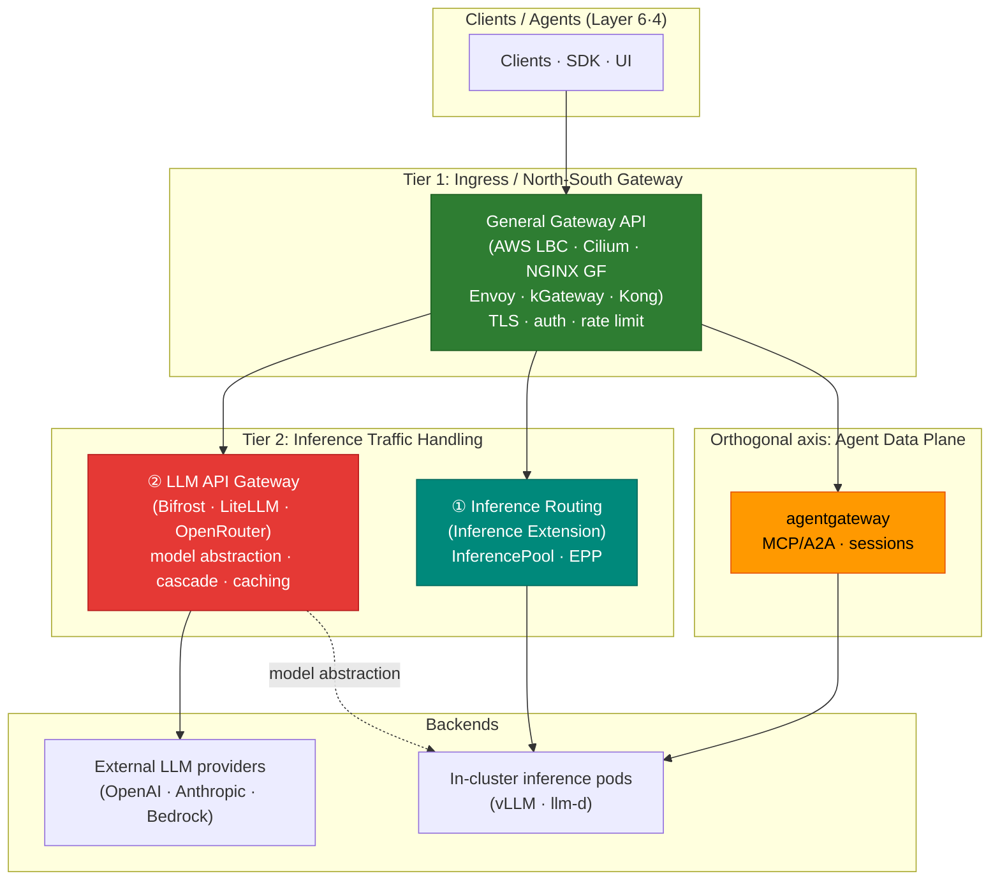

import Tabs from '@theme/Tabs';
import TabItem from '@theme/TabItem';

> 📅 **Written**: 2026-06-17 | **Updated**: 2026-06-17 | ⏱️ **Reading time**: ~9 min

## Overview

The gateway layer of the Agentic AI Platform consists of multiple components with distinct responsibilities. The term "Inference Gateway" has been ambiguous — it referred to both **in-cluster inference pod routing** and **external LLM provider proxying**, causing confusion. This document **defines the gateway-layer terminology and roles unambiguously** and provides criteria for deciding which solution fills each layer.

This document focuses on **definition and mapping**. For detailed comparison and deployment of each layer, follow the links to the dedicated documents.

:::info Where this document sits
The gateway layer corresponds to **Layer 5 (Gateway & Routing)** of the [platform architecture](../../design-architecture/foundations/agentic-platform-architecture.md). The request flow descends Layer 6 (entry) → Layer 5 (gateway) → Layer 4 (Agent), and when an agent needs inference it goes back through Layer 5 to call Layer 2 (Model Serving).
:::

## Gateway Layer Definitions

The following terms are used across the platform. Instead of the ambiguous "Inference Gateway", in-cluster routing and LLM API proxying are **explicitly distinguished**.

| Layer | Name | Role | Representative Implementations |
|-------|------|------|-------------------------------|
| **Tier 1** | Ingress / North-South Gateway | External traffic ingress, TLS termination, path routing, auth, rate limiting | AWS LBC · Cilium · NGINX GF · Envoy Gateway · kGateway · Kong |
| **Tier 2 ①** | Inference Routing (in-cluster) | Routing to in-cluster inference pod groups, KV-cache/load-aware endpoint selection | Gateway API **Inference Extension** (InferencePool · EPP) |
| **Tier 2 ②** | LLM API Gateway (provider proxy) | Model abstraction, model selection/cascade, cost tracking, semantic caching | Bifrost · LiteLLM · OpenRouter · Portkey · Helicone · Kong AI Gateway |
| **Orthogonal axis** | Agent Data Plane | MCP/A2A protocols, stateful sessions, tool routing | agentgateway |

:::tip Key distinction — Tier 2 ① vs ②
- **Tier 2 ① Inference Routing** operates **inside the cluster**. An HTTPRoute references an InferencePool as its backend, and the EPP (Endpoint Picker) selects a vLLM/llm-d pod endpoint considering KV cache and load. It handles self-hosted model infrastructure.
- **Tier 2 ② LLM API Gateway** **abstracts the model API**. It exposes external providers (OpenAI · Anthropic · Bedrock) or self-hosted models through a single OpenAI-compatible interface, performing complexity-based cascade, cost tracking, and caching.
- The two are **not mutually exclusive.** A hybrid setup — ① for self-hosted inference, ② for external provider integration — is common.
:::

The `Agent Data Plane` (agentgateway) is an **orthogonal axis**, not a tier. Because it handles AI-specific protocols (MCP/A2A) and stateful sessions rather than HTTP traffic, it is not grouped into the linear Tier 1–2 layering.

## Overall Structure

## How to Fill Each Layer

Solution selection, detailed comparison, and deployment procedures for each layer are covered in dedicated documents. This table is a **map of what to read where**.

| Layer | What fills it | Detailed reference |
|-------|---------------|--------------------|
| **Tier 1** Ingress | Comparison/selection of 6 general Gateway API implementations | [Gateway API Adoption Guide](/docs/eks-best-practices/networking-performance/gateway-api-adoption-guide) (EKS Best Practices) |
| **Tier 2 ①** Inference Routing | Gateway API Inference Extension (InferencePool · EPP) | [Routing Strategy — Gateway API Inference Extension](./routing-strategy.md#gateway-api-inference-extension) |
| **Tier 2 ②** LLM API Gateway | Comparison of Bifrost·LiteLLM·OpenRouter etc. and Cascade/Semantic strategies | [Routing Strategy — LLM Gateway Comparison](./routing-strategy.md#llm-gateway-solution-comparison) · [Setup Guide](../../reference-architecture/inference-gateway/setup/) |
| **Agent Data Plane** | agentgateway (MCP/A2A) | [Routing Strategy — agentgateway Data Plane](./routing-strategy.md#agentgateway-data-plane) |

:::note Relationship between Tier 1 and Tier 2
**Tier 1 (general gateway)** is covered in depth from the EKS networking perspective and is responsible for all North-South traffic, including the NGINX Ingress retirement response. **Tier 2** handles inference-specialized routing on top of it. Most agentic platforms configure Tier 1 and Tier 2 **together**, and the core design decision is which combination of solutions fills the two layers.
:::

## Traffic Flow Examples

- **External LLM call**: Client → Tier 1 (kgateway) → Tier 2 ② (Bifrost/LiteLLM, cascade·cache) → external provider → response + cost record
- **Self-hosted inference**: Client → Tier 1 (kgateway) → Tier 2 ① (InferencePool·EPP) → vLLM/llm-d pod → response
- **Agent tool call**: Client → Tier 1 (kgateway) → Agent Data Plane (agentgateway, MCP/A2A) → tools·session

## References

### Official Documentation
- [Kubernetes Gateway API](https://gateway-api.sigs.k8s.io/) — Tier 1 general gateway standard
- [Gateway API Inference Extension](https://gateway-api-inference-extension.sigs.k8s.io/) — Tier 2 ① in-cluster inference routing (InferencePool·EPP)

### Related Documents (internal)
- [Inference Gateway & LLM Gateway Routing Strategy](./routing-strategy.md) — Tier 2 solution comparison, cascade, semantic strategies
- [Inference Gateway Setup Guide](../../reference-architecture/inference-gateway/setup/) — Tier 2 deployment procedures (Helm·HTTPRoute·OTel)
- [Gateway API Adoption Guide](/docs/eks-best-practices/networking-performance/gateway-api-adoption-guide) — Tier 1 comparison/selection of 6 general gateways
- [Platform Architecture](../../design-architecture/foundations/agentic-platform-architecture.md) — Layer 5 (Gateway & Routing) definition
