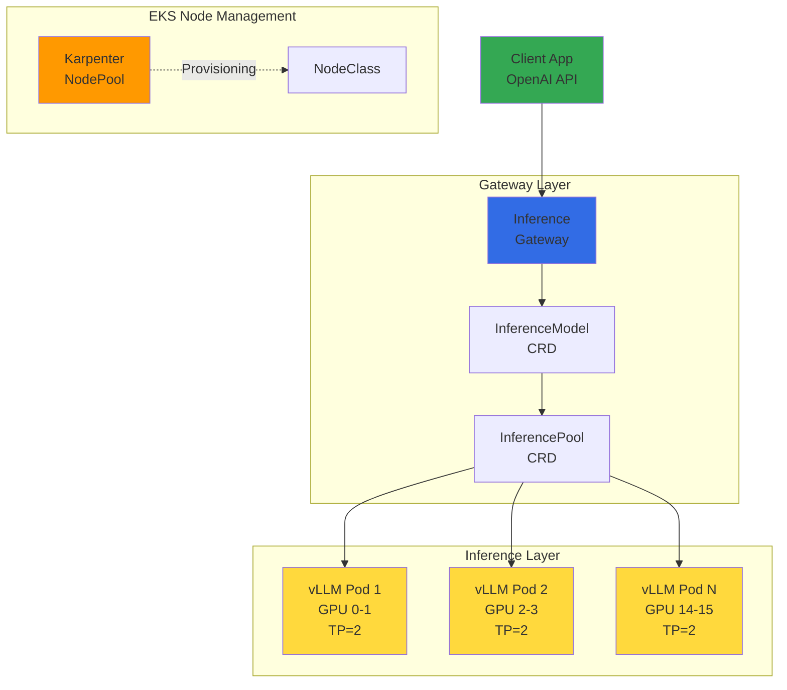
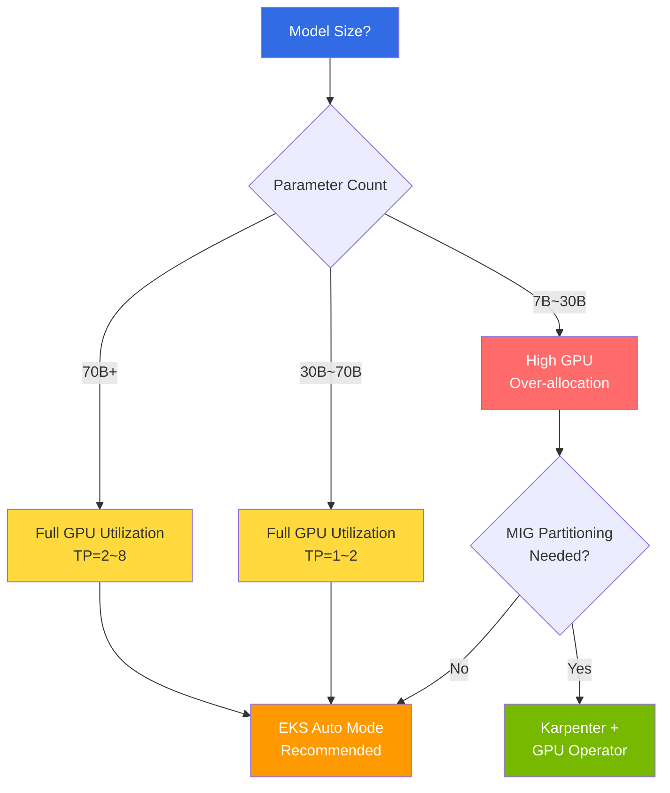
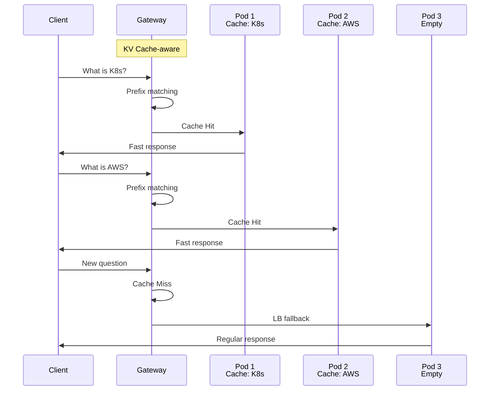

import { ComparisonTable, SpecificationTable } from '@site/src/components/tables';
import {
  WellLitPathTable,
  VllmComparisonTable,
  Qwen3SpecsTable,
  PrerequisitesTable,
  P5InstanceTable,
  P5eInstanceTable,
  GatewayCRDTable,
  DefaultDeploymentTable,
  KVCacheEffectsTable,
  MonitoringMetricsTable,
  ModelLoadingTable,
  CostOptimizationTable,
  TroubleshootingTable
} from '@site/src/components/LlmdTables';

# llm-d-based EKS Distributed Inference Deployment Guide

> **📌 Current Version**: llm-d v0.4 (2025). Deployment examples in this document are based on the Intelligent Inference Scheduling well-lit path.

> 📅 **Written**: 2026-02-10 | **Updated**: 2026-03-16 | ⏱️ **Reading Time**: Approximately 10 minutes

## Overview

llm-d is a Kubernetes-native distributed inference stack with Apache 2.0 license led by Red Hat. It combines vLLM inference engine, Envoy-based Inference Gateway, and Kubernetes Gateway API to provide intelligent inference routing for large language models.

While existing vLLM deployments rely on simple Round-Robin load balancing, llm-d provides intelligent routing aware of KV Cache state, directing requests with the same prefix to Pods that already have the corresponding KV Cache. This significantly reduces Time To First Token (TTFT) and saves GPU computation.

llm-d can be deployed across various node management methods in EKS, and the optimal deployment method varies depending on model size and GPU utilization strategy. This document primarily covers deployment examples in **EKS Auto Mode** environments while also explaining differences and selection criteria for **Karpenter self-managed** environments.

:::caution Deployment Strategy Selection: Auto Mode vs Karpenter
llm-d's core value of KV Cache-aware routing **works identically regardless of deployment environment**. However, when **GPU resource partitioning (MIG, Time-Slicing)** is needed, you must choose Karpenter + GPU Operator environment instead of EKS Auto Mode.

| Criteria | EKS Auto Mode | Auto Mode + GPU Operator | Karpenter + GPU Operator |
|------|:---:|:---:|:---:|
| **Suitable Model Size** | 70B+ (Full GPU) | 70B+ (Full GPU) | 7B~30B (MIG partitionable) |
| **GPU Driver Management** | AWS automatic | AWS automatic | Manual (GPU Operator) |
| **GPU Operator** | Not installed | Installed (Device Plugin disabled) | Installed (full control) |
| **DCGM Exporter** | Not available | Available | Available |
| **MIG / Time-Slicing** | Not possible | Not possible | Possible |
| **Operational Complexity** | Low | Low-Medium | Medium |
| **GPU Cost Efficiency** | Optimal for large models | Optimal for large models | Optimal for small models |

For detailed cost analysis by model size and decision flowchart, refer to [EKS GPU Node Strategy](./eks-gpu-node-strategy.md).
:::

:::warning llm-d Inference Gateway ≠ General-purpose Gateway API Implementation
llm-d's Envoy-based Inference Gateway is a special-purpose gateway designed **exclusively for LLM inference requests**. Its purpose and scope differ from general-purpose Gateway API implementations (AWS LBC v3, Cilium, Envoy Gateway, etc.) that replace NGINX Ingress Controller.

- **llm-d Gateway**: InferenceModel/InferencePool CRD-based, KV Cache-aware routing, inference traffic only
- **General-purpose Gateway API**: HTTPRoute/GRPCRoute-based, TLS/auth/Rate Limiting, cluster-wide traffic management

In production environments, it's recommended that general-purpose Gateway API implementations handle cluster entry points, with llm-d optimizing AI inference traffic underneath. For general-purpose Gateway API implementation selection, refer to [Gateway API Adoption Guide](/docs/infrastructure-optimization/gateway-api-adoption-guide).
:::

### Key Objectives

- **Understanding llm-d Architecture**: How Inference Gateway and KV Cache-aware routing work
- **Deployment Strategy Selection**: Comparison of Auto Mode vs Karpenter environment pros/cons
- **EKS Auto Mode GPU Configuration**: Automatic provisioning setup for p5.48xlarge nodes
- **Qwen3-32B Deployment**: Integrated deployment and verification using helmfile
- **Inference Testing**: Inference requests and streaming via OpenAI-compatible API
- **Operational Optimization**: Monitoring, cost optimization, troubleshooting

### llm-d's Three Well-Lit Paths

llm-d provides three validated deployment paths.

<WellLitPathTable />

---

## Architecture

The Intelligent Inference Scheduling architecture of llm-d is structured as follows.



### llm-d vs Existing vLLM Deployment Comparison

<VllmComparisonTable />

### Reasons for Selecting Qwen3-32B Model

<Qwen3SpecsTable />

:::info Background for Selecting Qwen3-32B
Qwen3-32B is llm-d's official default model and is commercially usable with Apache 2.0 license. It requires approximately 65GB VRAM with BF16 precision, allowing stable serving on H100 80GB with TP=2 (2× GPU).
:::

---

## Prerequisites

<PrerequisitesTable />

### Client Tools Installation

```bash
# Install eksctl (macOS)
brew install eksctl

# Install helmfile
brew install helmfile

# Install yq
brew install yq

# Verify versions
eksctl version
kubectl version --client
helm version
helmfile --version
yq --version
```

:::warning p5.48xlarge Quota Check
p5.48xlarge uses 192 vCPUs. Verify that **Running On-Demand P instances** limit in AWS Service Quotas is at least 192. Quota increase requests may take 1-3 business days for approval.

```bash
# Check current P instance quota
aws service-quotas get-service-quota \
  --service-code ec2 \
  --quota-code L-417A185B \
  --region us-west-2 \
  --query 'Quota.Value'
```

:::

---

## Deployment Strategy Selection: Auto Mode vs Karpenter

llm-d itself uses standard Kubernetes resources (Deployment, Service, CRD), making it independent of node management methods. However, **GPU resource utilization efficiency** varies greatly depending on the deployment environment.



### When Auto Mode is Suitable

- **70B+ Large Models**: Models that fully utilize GPUs like Qwen3-32B(TP=2), Llama-3-70B(TP=4), DeepSeek-V3(TP=8)
- **Fast Prototyping**: When you want to deploy immediately with AWS-managed GPU driver/AMI
- **Operational Simplification Priority**: When you want to reduce GPU Operator installation/update burden

### When Karpenter + GPU Operator is Suitable

- **7B~13B Small Models**: 75% cost savings by partitioning H100 into 7 instances with MIG
- **Multi-tenancy**: When GPU slices need to be isolated and allocated per team
- **MIG/Time-Slicing**: When GPU partitioning features unavailable in Auto Mode are required
- **Custom AMI/Driver**: When specific CUDA version or driver pinning is required

:::info GPU Operator on Auto Mode
GPU Operator **can be installed on EKS Auto Mode** by disabling the Device Plugin via node label (`nvidia.com/gpu.deploy.device-plugin=false`). This allows DCGM Exporter to be used for GPU-level monitoring on Auto Mode. However, GPU Operator's MIG/Time-Slicing features remain unavailable on Auto Mode due to AWS-managed driver constraints.

For detailed GPU Operator installation on Auto Mode, refer to [GPU Resource Management — GPU Operator on Auto Mode](./gpu-resource-management.md#gpu-operator-on-auto-mode).
:::

:::info Karpenter Deployment Example
For llm-d deployment in Karpenter + GPU Operator environments, only change the following from the Auto Mode examples in this document:
1. **Cluster Creation**: Install Karpenter directly instead of `autoModeConfig`
2. **NodePool**: Change `nodeClassRef` to `EC2NodeClass` (including custom AMI, GPU Operator userData)
3. **GPU Operator Installation**: `helm install gpu-operator nvidia/gpu-operator`

For detailed configuration, refer to [EKS GPU Node Strategy — Karpenter + GPU Operator](./eks-gpu-node-strategy.md#4-karpenter--gpu-operator-optimal-combination).
:::

---

## EKS Auto Mode Cluster Creation

### Cluster Configuration File

```yaml
# cluster-config.yaml
apiVersion: eksctl.io/v1alpha5
kind: ClusterConfig
metadata:
  name: llm-d-cluster
  region: us-west-2
  version: "1.33"
autoModeConfig:
  enabled: true
```

```bash
# Create cluster (takes approximately 15-20 minutes)
eksctl create cluster -f cluster-config.yaml

# Verify cluster status
kubectl get nodes
kubectl cluster-info
```

### GPU NodePool Creation

Create Karpenter NodePool for automatic provisioning of p5.48xlarge instances in EKS Auto Mode.

```yaml
# gpu-nodepool.yaml
apiVersion: karpenter.sh/v1
kind: NodePool
metadata:
  name: gpu-p5
spec:
  template:
    spec:
      requirements:
        - key: eks.amazonaws.com/instance-family
          operator: In
          values: ["p5"]
        - key: kubernetes.io/arch
          operator: In
          values: ["amd64"]
        - key: karpenter.sh/capacity-type
          operator: In
          values: ["on-demand"]
      nodeClassRef:
        group: eks.amazonaws.com
        kind: NodeClass
        name: default
      taints:
        - key: nvidia.com/gpu
          effect: NoSchedule
  limits:
    cpu: "384"
    memory: 4096Gi
    nvidia.com/gpu: "16"
  disruption:
    consolidationPolicy: WhenEmpty
    consolidateAfter: 30s
```

```bash
kubectl apply -f gpu-nodepool.yaml

# Verify NodePool status
kubectl get nodepool gpu-p5
```

:::info EKS Auto Mode GPU Support
EKS Auto Mode automatically installs and manages NVIDIA GPU drivers. By default, no separate GPU Operator or NVIDIA Device Plugin installation is required. Using NodeClass `default` allows Auto Mode to automatically select optimal AMI and driver versions.

**GPU Operator Installation (Optional)**: GPU Operator can be installed on Auto Mode by disabling the Device Plugin via node label (`nvidia.com/gpu.deploy.device-plugin=false`). This enables DCGM Exporter for GPU-level monitoring while keeping Auto Mode's driver management.

**Constraint**: Auto Mode's NodeClass is AWS-managed (read-only), making GPU partitioning settings like MIG and Time-Slicing impossible even with GPU Operator installed. GPU efficiency may be low with small models (7B~13B). If GPU partitioning is needed, refer to [Karpenter + GPU Operator Strategy](./eks-gpu-node-strategy.md).
:::

### p5.48xlarge Instance Specifications

<P5InstanceTable />

### p5e.48xlarge Instance Specifications (H200)

<P5eInstanceTable />

:::tip Instance Selection Guide
- **p5e.48xlarge (H200)**: 100B+ parameter models, maximum memory utilization
- **p5.48xlarge (H100)**: 70B+ parameter models, highest performance
- **g6e family (L40S)**: 13B-70B models, cost-effective inference
:::

---

## llm-d Deployment

### 5.1 Namespace and Secret Creation

```bash
export NAMESPACE=llm-d
kubectl create namespace ${NAMESPACE}

# Create HuggingFace token secret
kubectl create secret generic llm-d-hf-token \
  --from-literal=HF_TOKEN=<your-huggingface-token> \
  -n ${NAMESPACE}

# Verify secret creation
kubectl get secret llm-d-hf-token -n ${NAMESPACE}
```

### 5.2 Clone llm-d Repository

```bash
git clone https://github.com/llm-d/llm-d.git
cd llm-d/guides/inference-scheduling
```

Directory structure:

```
guides/inference-scheduling/
├── helmfile.yaml          # Integrated deployment definition
├── values/
│   ├── vllm-values.yaml   # vLLM server configuration
│   ├── gateway-values.yaml # Gateway configuration
│   └── ...
└── README.md
```

### 5.3 Install Gateway API CRDs

llm-d uses Kubernetes Gateway API and Inference Extension CRDs.

```bash
# Install Gateway API standard CRDs (v1.2.0+)
kubectl apply -f https://github.com/kubernetes-sigs/gateway-api/releases/download/v1.2.0/standard-install.yaml

# Install Inference Extension CRDs (InferencePool, InferenceModel)
kubectl apply -f https://github.com/kubernetes-sigs/gateway-api-inference-extension/releases/download/v0.3.0/manifests.yaml
```

:::info Gateway API v1.2.0+ Features
Gateway API v1.2.0 provides enhanced features:
- **HTTPRoute Improvements**: More flexible routing rules
- **GRPCRoute Stabilization**: gRPC service routing support
- **BackendTLSPolicy**: Standardized backend TLS configuration
- **Kubernetes 1.33+ Integration**: Topology-aware routing support
:::

Installed CRDs:

<GatewayCRDTable />

```bash
# Verify CRD installation
kubectl get crd | grep -E "gateway|inference"
```

### 5.4 Install Gateway Control Plane

```bash
# Install Istio-based Gateway control plane
helmfile apply -n ${NAMESPACE} -l component=gateway-control-plane
```

### 5.5 Deploy llm-d Complete Stack

```bash
# Deploy all components (vLLM + Gateway + InferencePool + InferenceModel)
helmfile apply -n ${NAMESPACE}
```

Default deployment configuration:

<DefaultDeploymentTable />

:::tip Resource Adjustment
The default configuration uses 8 replicas × 2 GPU = 16 GPUs. For testing purposes, you can reduce `replicaCount` in `helmfile.yaml` to save costs. For example, setting 4 replicas allows operation on a single p5.48xlarge (8 GPUs).
:::

### 5.6 Verify Deployment

```bash
# Verify Helm releases
helm list -n ${NAMESPACE}

# Check all resources
kubectl get all -n ${NAMESPACE}

# Check InferencePool status
kubectl get inferencepool -n ${NAMESPACE}

# Check InferenceModel status
kubectl get inferencemodel -n ${NAMESPACE}

# Check vLLM Pod status (including GPU allocation)
kubectl get pods -n ${NAMESPACE} -o wide

# Wait for Pods to be Ready (model loading takes 5-10 minutes)
kubectl wait --for=condition=Ready pods -l app=vllm \
  -n ${NAMESPACE} --timeout=600s
```

:::warning Model Loading Time
Qwen3-32B (BF16, ~65GB) may take 10-20 minutes for initial download from HuggingFace Hub depending on network speed. Subsequent deployments use node's local cache, significantly reducing loading time.
:::

---

## Inference Request Testing

### 6.1 Port Forwarding

```bash
# Port forward Inference Gateway
kubectl port-forward svc/inference-gateway -n ${NAMESPACE} 8080:8080
```

### 6.2 Basic curl Test

```bash
curl -s http://localhost:8080/v1/chat/completions \
  -H "Content-Type: application/json" \
  -d '{
    "model": "Qwen/Qwen3-32B",
    "messages": [
      {
        "role": "user",
        "content": "What is Kubernetes? Please explain briefly."
      }
    ],
    "max_tokens": 256,
    "temperature": 0.7
  }' | jq .
```

Expected response structure:

```json
{
  "id": "chatcmpl-...",
  "object": "chat.completion",
  "model": "Qwen/Qwen3-32B",
  "choices": [
    {
      "index": 0,
      "message": {
        "role": "assistant",
        "content": "Kubernetes is an open-source container orchestration platform for deploying, scaling..."
      },
      "finish_reason": "stop"
    }
  ],
  "usage": {
    "prompt_tokens": 15,
    "completion_tokens": 128,
    "total_tokens": 143
  }
}
```

### 6.3 Python Client

```python
from openai import OpenAI

client = OpenAI(
    base_url="http://localhost:8080/v1",
    api_key="not-needed"  # llm-d doesn't require authentication
)

response = client.chat.completions.create(
    model="Qwen/Qwen3-32B",
    messages=[
        {"role": "system", "content": "You are a cloud native expert."},
        {"role": "user", "content": "Explain 3 advantages of EKS Auto Mode."}
    ],
    max_tokens=512,
    temperature=0.7
)
print(response.choices[0].message.content)
```

### 6.4 Streaming Response Test

```python
stream = client.chat.completions.create(
    model="Qwen/Qwen3-32B",
    messages=[
        {"role": "user", "content": "How does llm-d's KV Cache-aware routing work?"}
    ],
    max_tokens=512,
    stream=True
)

for chunk in stream:
    if chunk.choices[0].delta.content:
        print(chunk.choices[0].delta.content, end="", flush=True)
print()
```

### 6.5 Verify Model List

```bash
curl -s http://localhost:8080/v1/models | jq .
```

:::info OpenAI-Compatible API
llm-d provides OpenAI-compatible API. Applications using existing OpenAI SDK can be used immediately by changing only `base_url`. Supports `/v1/chat/completions`, `/v1/completions`, `/v1/models` endpoints.
:::

---

## Understanding KV Cache-aware Routing

llm-d's core differentiator is intelligent routing aware of KV Cache state.



### Routing Operation Principles

1. **Request Reception**: Client sends inference request to Inference Gateway
2. **Prefix Analysis**: Gateway hashes request's prompt prefix for identification
3. **Cache Lookup**: Check KV Cache state of each vLLM Pod to find Pod with that prefix
4. **Intelligent Routing**: Route to that Pod on cache hit, load-based balancing on miss
5. **Response Return**: vLLM returns inference result to client through Gateway

### Effects of KV Cache-aware Routing

<KVCacheEffectsTable />

:::tip Maximizing Cache Hit Rate
The effect of KV Cache-aware routing is maximized in applications using the same system prompt. For example, in RAG pipelines that repeatedly reference the same context documents, reusing KV Cache for that prefix can significantly reduce TTFT.
:::

---

## Monitoring and Verification

### 8.1 Verify vLLM Metrics

```bash
# Access vLLM Pod's metrics endpoint
VLLM_POD=$(kubectl get pods -n ${NAMESPACE} -l app=vllm -o jsonpath='{.items[0].metadata.name}')
kubectl port-forward ${VLLM_POD} -n ${NAMESPACE} 9090:9090

# Query metrics
curl -s http://localhost:9090/metrics | grep -E "vllm_"
```

### Key Monitoring Metrics

<MonitoringMetricsTable />

### 8.2 Verify GPU Utilization

```bash
# Run nvidia-smi in specific vLLM Pod
kubectl exec -it ${VLLM_POD} -n ${NAMESPACE} -- nvidia-smi

# Real-time GPU monitoring (1-second interval)
kubectl exec -it ${VLLM_POD} -n ${NAMESPACE} -- nvidia-smi dmon -s u -d 1
```

### 8.3 Check Gateway Logs

```bash
# Check Inference Gateway logs
kubectl logs -f deployment/inference-gateway -n ${NAMESPACE}

# Detailed InferencePool status check
kubectl describe inferencepool -n ${NAMESPACE}
```

### 8.4 Configure Prometheus ServiceMonitor

```yaml
apiVersion: monitoring.coreos.com/v1
kind: ServiceMonitor
metadata:
  name: llm-d-vllm-monitor
  namespace: monitoring
spec:
  selector:
    matchLabels:
      app: vllm
  endpoints:
    - port: metrics
      path: /metrics
      interval: 15s
  namespaceSelector:
    matchNames:
      - llm-d
```

---

## Operational Considerations

### 9.1 S3 Model Caching

Downloading models from HuggingFace Hub every time increases Cold Start time. You can reduce loading time by caching model weights in S3.

```yaml
# Add S3 cache path to vLLM environment variables
env:
  - name: VLLM_S3_MODEL_CACHE
    value: "s3://your-bucket/model-cache/qwen3-32b/"
```

<ModelLoadingTable />

### 9.2 HPA (Horizontal Pod Autoscaler) Configuration

You can configure automatic scaling based on vLLM waiting request count.

```yaml
apiVersion: autoscaling/v2
kind: HorizontalPodAutoscaler
metadata:
  name: vllm-hpa
  namespace: llm-d
spec:
  scaleTargetRef:
    apiVersion: apps/v1
    kind: Deployment
    name: vllm-deployment
  minReplicas: 2
  maxReplicas: 8
  metrics:
    - type: Pods
      pods:
        metric:
          name: vllm_num_requests_waiting
        target:
          type: AverageValue
          averageValue: "5"
  behavior:
    scaleUp:
      stabilizationWindowSeconds: 60
      policies:
        - type: Pods
          value: 2
          periodSeconds: 120
    scaleDown:
      stabilizationWindowSeconds: 300
      policies:
        - type: Pods
          value: 1
          periodSeconds: 180
```

:::info HPA and Karpenter Integration
When HPA increases vLLM replicas and additional GPUs are needed, Karpenter automatically provisions new p5.48xlarge nodes. This process is fully automated in EKS Auto Mode.
:::

### 9.3 Cost Optimization

<CostOptimizationTable />

:::warning Cost Warning
p5.48xlarge costs approximately $98.32 per hour (us-west-2 On-Demand). Operating 2 instances costs **approximately $141,580 per month**. Be sure to clean up resources after testing.

```bash
# Clean up resources
helmfile destroy -n ${NAMESPACE}
kubectl delete namespace ${NAMESPACE}
kubectl delete nodepool gpu-p5

# Delete cluster (if needed)
eksctl delete cluster --name llm-d-cluster --region us-west-2
```

:::

---

## Troubleshooting

### Common Issues and Solutions

<TroubleshootingTable />

### Debugging Command Collection

```bash
# Check Pod status and events
kubectl describe pod <pod-name> -n llm-d

# Check vLLM logs (last 100 lines)
kubectl logs <vllm-pod> -n llm-d --tail=100

# Check GPU status
kubectl exec -it <vllm-pod> -n llm-d -- nvidia-smi

# Detailed InferencePool status check
kubectl describe inferencepool -n llm-d

# Check InferenceModel status
kubectl describe inferencemodel -n llm-d

# Check Gateway logs
kubectl logs -f deployment/inference-gateway -n llm-d

# Check node GPU resources
kubectl get nodes -o custom-columns=\
  NAME:.metadata.name,\
  GPU:.status.allocatable.nvidia\\.com/gpu,\
  STATUS:.status.conditions[-1].type

# Check Karpenter logs (node provisioning issues)
kubectl logs -f deployment/karpenter -n kube-system
```

:::tip NCCL Debugging
If multi-GPU communication issues occur, add the following environment variables to check detailed logs:

```yaml
env:
  - name: NCCL_DEBUG
    value: "INFO"
  - name: NCCL_DEBUG_SUBSYS
    value: "ALL"
```

:::

---

## Next Steps

This guide covered llm-d's Intelligent Inference Scheduling path. You can explore advanced features as next steps.

- **Prefill/Decode Disaggregation**: Separate Prefill and Decode stages into separate Pod groups to maximize throughput for large-batch processing and long-context workloads
- **Expert Parallelism**: Distribute Experts of MoE models (Mixtral, DeepSeek, etc.) across multiple nodes for ultra-large model serving
- **LoRA Adapter Hot-swapping**: Dynamically load/unload multiple LoRA adapters on single base model for multi-task serving
- **Prometheus + Grafana Dashboard**: Configure real-time monitoring dashboard based on vLLM metrics
- **Multi-model Serving**: Simultaneously serve multiple models in one llm-d cluster using InferenceModel CRD

### Related Documentation

- [EKS GPU Node Strategy](./eks-gpu-node-strategy.md) — Auto Mode vs Karpenter vs Hybrid Node, cost analysis by model size
- [vLLM-based FM Deployment and Performance Optimization](./vllm-model-serving.md) — vLLM basic concepts and deployment
- [MoE Model Serving Guide](./moe-model-serving.md) — Mixture of Experts model serving
- [Inference Gateway and Dynamic Routing](../gateway-agents/inference-gateway-routing.md) — Inference routing strategies
- [GPU Resource Management](./gpu-resource-management.md) — GPU cluster resource management, MIG/Time-Slicing configuration

---

## References

- [llm-d GitHub](https://github.com/llm-d/llm-d)
- [llm-d Deployer (Helm Charts)](https://github.com/llm-d/llm-d-deployer)
- [EKS Auto Mode Documentation](https://docs.aws.amazon.com/eks/latest/userguide/automode.html)
- [Gateway API Inference Extension](https://gateway-api.sigs.k8s.io/geps/gep-3567/)
- [vLLM Official Documentation](https://docs.vllm.ai/)
- [Qwen3-32B HuggingFace](https://huggingface.co/Qwen/Qwen3-32B)
- [Kubernetes Gateway API v1.4](https://gateway-api.sigs.k8s.io/)
