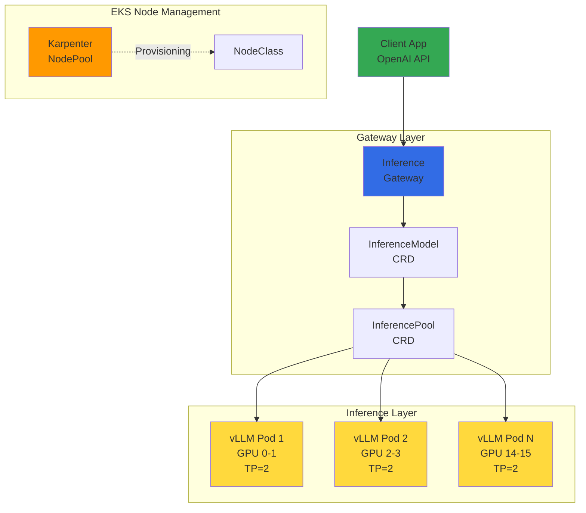
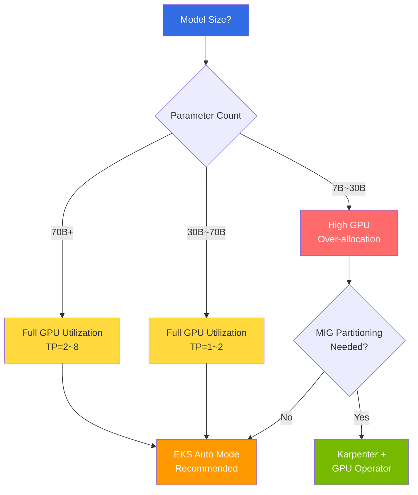
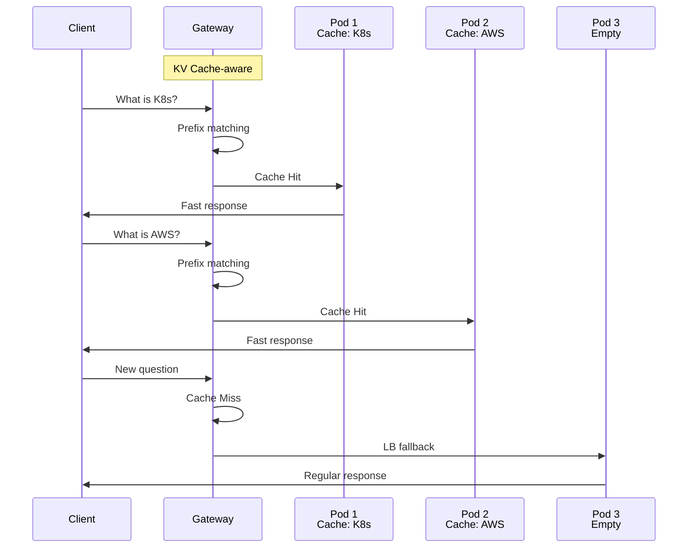
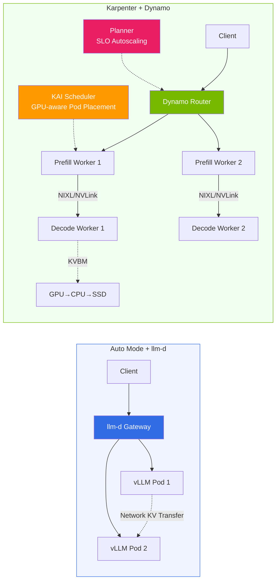

import { ComparisonTable, SpecificationTable } from '@site/src/components/tables';
import {
  WellLitPathTable,
  VllmComparisonTable,
  Qwen3SpecsTable,
  PrerequisitesTable,
  P5InstanceTable,
  P5eInstanceTable,
  GatewayCRDTable,
  DefaultDeploymentTable,
  KVCacheEffectsTable,
  MonitoringMetricsTable,
  ModelLoadingTable,
  CostOptimizationTable,
  TroubleshootingTable
} from '@site/src/components/LlmdTables';

# llm-d-based EKS Distributed Inference Deployment Guide

> **Current Version**: llm-d v0.5+ (2026.03). Deployment examples in this document are based on the Intelligent Inference Scheduling well-lit path.

> **Written**: 2026-02-10 | **Updated**: 2026-03-20 | **Reading Time**: Approximately 10 minutes

## Overview

llm-d is a Kubernetes-native distributed inference stack with Apache 2.0 license led by Red Hat. It combines vLLM inference engine, Envoy-based Inference Gateway, and Kubernetes Gateway API to provide intelligent inference routing for large language models.

While existing vLLM deployments rely on simple Round-Robin load balancing, llm-d provides intelligent routing aware of KV Cache state, directing requests with the same prefix to Pods that already have the corresponding KV Cache. This significantly reduces Time To First Token (TTFT) and saves GPU computation.

llm-d can be deployed across various node management methods in EKS, and the optimal deployment method varies depending on model size and GPU utilization strategy. This document primarily covers deployment examples in **EKS Auto Mode** environments while also explaining differences and selection criteria for **Karpenter self-managed** environments.

### Auto Mode Advantages and Limitations

EKS Auto Mode has the following advantages and limitations for GPU workloads.

**Advantages:**

- **Automatic GPU Driver Management**: AWS automatically installs and updates NVIDIA GPU drivers. Device Plugin is also managed by AWS.
- **Automatic NodeClass Selection**: Using `default` NodeClass allows Auto Mode to automatically select optimal AMI and driver versions.
- **Operational Simplification**: Removes operational burden of driver installation, CUDA version management, driver compatibility verification, etc.
- **GPU Operator Installation Available**: GPU Operator can be installed on Auto Mode. Only disable Device Plugin with node label (`nvidia.com/gpu.deploy.device-plugin: "false"`), while DCGM Exporter, NFD, GFD, etc. operate normally. GPU Operator installation is recommended for projects depending on ClusterPolicy such as KAI Scheduler.

**Limitations:**

- **No MIG/Time-Slicing**: Auto Mode's NodeClass is AWS-managed (read-only), making GPU partitioning configuration impossible. GPU efficiency may be low with small models (7B~13B).
- **No Custom AMI**: Cannot accommodate specific CUDA versions or driver pinning requirements with Auto Mode.

:::tip GPU Operator + Auto Mode Hybrid Configuration
Even on Auto Mode, installing GPU Operator allows collecting detailed GPU metrics (SM utilization, NVLink bandwidth, etc.) with DCGM Exporter. Refer to [ai-on-eks PR #288](https://github.com/awslabs/ai-on-eks/pull/288) pattern:
- `driver.enabled: false`, `toolkit.enabled: false` (pre-installed in AMI)
- NodePool label: `nvidia.com/gpu.deploy.device-plugin: "false"`
- DCGM Exporter, NFD, GFD, MIG Manager: `enabled: true`
:::

**Auto Mode vs Karpenter + GPU Operator Comparison:**

| Criteria | EKS Auto Mode | EKS Auto Mode + GPU Operator | Karpenter + GPU Operator |
|------|:---:|:---:|:---:|
| **Suitable Model Size** | 70B+ (Full GPU utilization) | 70B+ (Full GPU utilization) | 7B~30B (MIG partitionable) |
| **GPU Driver Management** | AWS automatic | AWS automatic | Pre-installed in AMI (driver.enabled=false) |
| **Device Plugin** | AWS managed | Disabled via label | GPU Operator managed |
| **DCGM Monitoring** | Basic metrics only | DCGM Exporter detailed metrics | DCGM Exporter detailed metrics |
| **MIG / Time-Slicing** | Not possible | Not possible | Possible |
| **KAI Scheduler** | Not possible | Possible (ClusterPolicy dependent) | Possible |
| **Operational Complexity** | Low | Medium | Medium |
| **GPU Cost Efficiency** | Optimal for large models | Optimal for large models | Optimal for small models |

For detailed cost analysis by model size, refer to [EKS GPU Node Strategy](./eks-gpu-node-strategy.md).

:::warning llm-d Inference Gateway ≠ General-purpose Gateway API Implementation
llm-d's Envoy-based Inference Gateway is a special-purpose gateway designed **exclusively for LLM inference requests**. Its purpose and scope differ from general-purpose Gateway API implementations (AWS LBC v3, Cilium, Envoy Gateway, etc.) that replace NGINX Ingress Controller.

- **llm-d Gateway**: InferenceModel/InferencePool CRD-based, KV Cache-aware routing, inference traffic only
- **General-purpose Gateway API**: HTTPRoute/GRPCRoute-based, TLS/auth/Rate Limiting, cluster-wide traffic management

In production environments, it's recommended that general-purpose Gateway API implementations handle cluster entry points, with llm-d optimizing AI inference traffic underneath. For general-purpose Gateway API implementation selection, refer to [Gateway API Adoption Guide](/docs/infrastructure-optimization/gateway-api-adoption-guide).
:::

### Key Objectives

- **Understanding llm-d Architecture**: How Inference Gateway and KV Cache-aware routing work
- **Deployment Strategy Selection**: Comparison of Auto Mode vs Karpenter environment pros/cons
- **EKS Auto Mode GPU Configuration**: Automatic provisioning setup for p5.48xlarge nodes
- **Qwen3-32B Deployment**: Integrated deployment and verification using helmfile
- **Inference Testing**: Inference requests and streaming via OpenAI-compatible API
- **Operational Optimization**: Monitoring, cost optimization, troubleshooting

### llm-d's Three Well-Lit Paths

llm-d provides three validated deployment paths.

<WellLitPathTable />

---

## Prerequisites

<PrerequisitesTable />

### Client Tools Installation

```bash
# Install eksctl (macOS)
brew install eksctl

# Install helmfile
brew install helmfile

# Install yq
brew install yq

# Verify versions
eksctl version
kubectl version --client
helm version
helmfile --version
yq --version
```

:::warning p5.48xlarge Quota Check
p5.48xlarge uses 192 vCPUs. Verify that **Running On-Demand P instances** limit in AWS Service Quotas is at least 192. Quota increase requests may take 1-3 business days for approval.

```bash
# Check current P instance quota
aws service-quotas get-service-quota \
  --service-code ec2 \
  --quota-code L-417A185B \
  --region us-west-2 \
  --query 'Quota.Value'
```

:::

---

## Architecture

The Intelligent Inference Scheduling architecture of llm-d is structured as follows.



### llm-d vs Existing vLLM Deployment Comparison

<VllmComparisonTable />

### Reasons for Selecting Qwen3-32B Model

<Qwen3SpecsTable />

:::info Background for Selecting Qwen3-32B
Qwen3-32B is llm-d's official default model and is commercially usable with Apache 2.0 license. It requires approximately 65GB VRAM with BF16 precision, allowing stable serving on H100 80GB with TP=2 (2× GPU).
:::

---

## Prerequisites

<PrerequisitesTable />

### Client Tools Installation

```bash
# Install eksctl (macOS)
brew install eksctl

# Install helmfile
brew install helmfile

# Install yq
brew install yq

# Verify versions
eksctl version
kubectl version --client
helm version
helmfile --version
yq --version
```

:::warning p5.48xlarge Quota Check
p5.48xlarge uses 192 vCPUs. Verify that **Running On-Demand P instances** limit in AWS Service Quotas is at least 192. Quota increase requests may take 1-3 business days for approval.

```bash
# Check current P instance quota
aws service-quotas get-service-quota \
  --service-code ec2 \
  --quota-code L-417A185B \
  --region us-west-2 \
  --query 'Quota.Value'
```

:::

---

## Deployment Strategy Selection: Auto Mode vs Karpenter

llm-d itself uses standard Kubernetes resources (Deployment, Service, CRD), making it independent of node management methods. However, **GPU resource utilization efficiency** varies greatly depending on the deployment environment.



### When Auto Mode is Suitable

- **70B+ Large Models**: Models that fully utilize GPUs like Qwen3-32B(TP=2), Llama-3-70B(TP=4), DeepSeek-V3(TP=8)
- **Fast Prototyping**: When you want to deploy immediately with AWS-managed GPU driver/AMI
- **Operational Simplification Priority**: When you want to reduce GPU Operator installation/update burden

### When Karpenter + GPU Operator is Suitable

- **7B~13B Small Models**: 75% cost savings by partitioning H100 into 7 instances with MIG
- **Multi-tenancy**: When GPU slices need to be isolated and allocated per team
- **MIG/Time-Slicing**: When GPU partitioning features unavailable in Auto Mode are required
- **Custom AMI/Driver**: When specific CUDA version or driver pinning is required

:::info GPU Operator on Auto Mode
GPU Operator **can be installed on EKS Auto Mode** by disabling the Device Plugin via node label (`nvidia.com/gpu.deploy.device-plugin=false`). This allows DCGM Exporter to be used for GPU-level monitoring on Auto Mode. However, GPU Operator's MIG/Time-Slicing features remain unavailable on Auto Mode due to AWS-managed driver constraints.

For detailed GPU Operator installation on Auto Mode, refer to [GPU Resource Management — GPU Operator on Auto Mode](./gpu-resource-management.md#gpu-operator-on-auto-mode).
:::

:::info Karpenter Deployment Example
For llm-d deployment in Karpenter + GPU Operator environments, only change the following from the Auto Mode examples in this document:
1. **Cluster Creation**: Install Karpenter directly instead of `autoModeConfig`
2. **NodePool**: Change `nodeClassRef` to `EC2NodeClass` (including custom AMI, GPU Operator userData)
3. **GPU Operator Installation**: `helm install gpu-operator nvidia/gpu-operator`

For detailed configuration, refer to [EKS GPU Node Strategy — Karpenter + GPU Operator](./eks-gpu-node-strategy.md#4-karpenter--gpu-operator-optimal-combination).
:::

### llm-d vs Existing vLLM Deployment Comparison

<VllmComparisonTable />

### Reasons for Selecting Qwen3-32B Model

<Qwen3SpecsTable />

:::info Background for Selecting Qwen3-32B
Qwen3-32B is llm-d's official default model and is commercially usable with Apache 2.0 license. It requires approximately 65GB VRAM with BF16 precision, allowing stable serving on H100 80GB with TP=2 (2× GPU).
:::

---

## EKS Auto Mode Cluster Creation

### Cluster Configuration File

```yaml
# cluster-config.yaml
apiVersion: eksctl.io/v1alpha5
kind: ClusterConfig
metadata:
  name: llm-d-cluster
  region: us-west-2
  version: "1.33"
autoModeConfig:
  enabled: true
```

```bash
# Create cluster (takes approximately 15-20 minutes)
eksctl create cluster -f cluster-config.yaml

# Verify cluster status
kubectl get nodes
kubectl cluster-info
```

### GPU NodePool Creation

Create Karpenter NodePool for automatic provisioning of p5.48xlarge instances in EKS Auto Mode.

```yaml
# gpu-nodepool.yaml
apiVersion: karpenter.sh/v1
kind: NodePool
metadata:
  name: gpu-p5
spec:
  template:
    spec:
      requirements:
        - key: eks.amazonaws.com/instance-family
          operator: In
          values: ["p5"]
        - key: kubernetes.io/arch
          operator: In
          values: ["amd64"]
        - key: karpenter.sh/capacity-type
          operator: In
          values: ["on-demand"]
      nodeClassRef:
        group: eks.amazonaws.com
        kind: NodeClass
        name: default
      taints:
        - key: nvidia.com/gpu
          effect: NoSchedule
  limits:
    cpu: "384"
    memory: 4096Gi
    nvidia.com/gpu: "16"
  disruption:
    consolidationPolicy: WhenEmpty
    consolidateAfter: 30s
```

```bash
kubectl apply -f gpu-nodepool.yaml

# Verify NodePool status
kubectl get nodepool gpu-p5
```

:::info EKS Auto Mode GPU Support
EKS Auto Mode automatically installs and manages NVIDIA GPU drivers. By default, no separate GPU Operator or NVIDIA Device Plugin installation is required. Using NodeClass `default` allows Auto Mode to automatically select optimal AMI and driver versions.

**GPU Operator Installation (Optional)**: GPU Operator can be installed on Auto Mode by disabling the Device Plugin via node label (`nvidia.com/gpu.deploy.device-plugin=false`). This enables DCGM Exporter for GPU-level monitoring while keeping Auto Mode's driver management.

**Constraint**: Auto Mode's NodeClass is AWS-managed (read-only), making GPU partitioning settings like MIG and Time-Slicing impossible even with GPU Operator installed. GPU efficiency may be low with small models (7B~13B). If GPU partitioning is needed, refer to [Karpenter + GPU Operator Strategy](./eks-gpu-node-strategy.md).
:::

### p5.48xlarge Instance Specifications

<P5InstanceTable />

### p5e.48xlarge Instance Specifications (H200)

<P5eInstanceTable />

:::tip Instance Selection Guide
- **p5e.48xlarge (H200)**: 100B+ parameter models, maximum memory utilization
- **p5.48xlarge (H100)**: 70B+ parameter models, highest performance
- **g6e family (L40S)**: 13B-70B models, cost-effective inference
:::

---

## llm-d Deployment

### 5.1 Namespace and Secret Creation

```bash
export NAMESPACE=llm-d
kubectl create namespace ${NAMESPACE}

# Create HuggingFace token secret
kubectl create secret generic llm-d-hf-token \
  --from-literal=HF_TOKEN=<your-huggingface-token> \
  -n ${NAMESPACE}

# Verify secret creation
kubectl get secret llm-d-hf-token -n ${NAMESPACE}
```

### 5.2 Clone llm-d Repository

```bash
git clone https://github.com/llm-d/llm-d.git
cd llm-d/guides/inference-scheduling
```

Directory structure:

```
guides/inference-scheduling/
├── helmfile.yaml          # Integrated deployment definition
├── values/
│   ├── vllm-values.yaml   # vLLM server configuration
│   ├── gateway-values.yaml # Gateway configuration
│   └── ...
└── README.md
```

### 5.3 Install Gateway API CRDs

llm-d uses Kubernetes Gateway API and Inference Extension CRDs.

```bash
# Install Gateway API standard CRDs (v1.2.0+)
kubectl apply -f https://github.com/kubernetes-sigs/gateway-api/releases/download/v1.2.0/standard-install.yaml

# Install Inference Extension CRDs (InferencePool, InferenceModel)
kubectl apply -f https://github.com/kubernetes-sigs/gateway-api-inference-extension/releases/download/v0.3.0/manifests.yaml
```

:::info Gateway API v1.2.0+ Features
Gateway API v1.2.0 provides enhanced features:
- **HTTPRoute Improvements**: More flexible routing rules
- **GRPCRoute Stabilization**: gRPC service routing support
- **BackendTLSPolicy**: Standardized backend TLS configuration
- **Kubernetes 1.33+ Integration**: Topology-aware routing support
:::

Installed CRDs:

<GatewayCRDTable />

```bash
# Verify CRD installation
kubectl get crd | grep -E "gateway|inference"
```

### 5.4 Install Gateway Control Plane

```bash
# Install Istio-based Gateway control plane
helmfile apply -n ${NAMESPACE} -l component=gateway-control-plane
```

### 5.5 Deploy llm-d Complete Stack

```bash
# Deploy all components (vLLM + Gateway + InferencePool + InferenceModel)
helmfile apply -n ${NAMESPACE}
```

Default deployment configuration:

<DefaultDeploymentTable />

:::tip Resource Adjustment
The default configuration uses 8 replicas × 2 GPU = 16 GPUs. For testing purposes, you can reduce `replicaCount` in `helmfile.yaml` to save costs. For example, setting 4 replicas allows operation on a single p5.48xlarge (8 GPUs).
:::

### 5.6 Verify Deployment

```bash
# Verify Helm releases
helm list -n ${NAMESPACE}

# Check all resources
kubectl get all -n ${NAMESPACE}

# Check InferencePool status
kubectl get inferencepool -n ${NAMESPACE}

# Check InferenceModel status
kubectl get inferencemodel -n ${NAMESPACE}

# Check vLLM Pod status (including GPU allocation)
kubectl get pods -n ${NAMESPACE} -o wide

# Wait for Pods to be Ready (model loading takes 5-10 minutes)
kubectl wait --for=condition=Ready pods -l app=vllm \
  -n ${NAMESPACE} --timeout=600s
```

:::warning Model Loading Time
Qwen3-32B (BF16, ~65GB) may take 10-20 minutes for initial download from HuggingFace Hub depending on network speed. Subsequent deployments use node's local cache, significantly reducing loading time.
:::

---

## Inference Request Testing

### 6.1 Port Forwarding

```bash
# Port forward Inference Gateway
kubectl port-forward svc/inference-gateway -n ${NAMESPACE} 8080:8080
```

### 6.2 Basic curl Test

```bash
curl -s http://localhost:8080/v1/chat/completions \
  -H "Content-Type: application/json" \
  -d '{
    "model": "Qwen/Qwen3-32B",
    "messages": [
      {
        "role": "user",
        "content": "What is Kubernetes? Please explain briefly."
      }
    ],
    "max_tokens": 256,
    "temperature": 0.7
  }' | jq .
```

Expected response structure:

```json
{
  "id": "chatcmpl-...",
  "object": "chat.completion",
  "model": "Qwen/Qwen3-32B",
  "choices": [
    {
      "index": 0,
      "message": {
        "role": "assistant",
        "content": "Kubernetes is an open-source container orchestration platform for deploying, scaling..."
      },
      "finish_reason": "stop"
    }
  ],
  "usage": {
    "prompt_tokens": 15,
    "completion_tokens": 128,
    "total_tokens": 143
  }
}
```

### 6.3 Python Client

```python
from openai import OpenAI

client = OpenAI(
    base_url="http://localhost:8080/v1",
    api_key="not-needed"  # llm-d doesn't require authentication
)

response = client.chat.completions.create(
    model="Qwen/Qwen3-32B",
    messages=[
        {"role": "system", "content": "You are a cloud native expert."},
        {"role": "user", "content": "Explain 3 advantages of EKS Auto Mode."}
    ],
    max_tokens=512,
    temperature=0.7
)
print(response.choices[0].message.content)
```

### 6.4 Streaming Response Test

```python
stream = client.chat.completions.create(
    model="Qwen/Qwen3-32B",
    messages=[
        {"role": "user", "content": "How does llm-d's KV Cache-aware routing work?"}
    ],
    max_tokens=512,
    stream=True
)

for chunk in stream:
    if chunk.choices[0].delta.content:
        print(chunk.choices[0].delta.content, end="", flush=True)
print()
```

### 6.5 Verify Model List

```bash
curl -s http://localhost:8080/v1/models | jq .
```

:::info OpenAI-Compatible API
llm-d provides OpenAI-compatible API. Applications using existing OpenAI SDK can be used immediately by changing only `base_url`. Supports `/v1/chat/completions`, `/v1/completions`, `/v1/models` endpoints.
:::

---

## Understanding KV Cache-aware Routing

llm-d's core differentiator is intelligent routing aware of KV Cache state.



### Routing Operation Principles

1. **Request Reception**: Client sends inference request to Inference Gateway
2. **Prefix Analysis**: Gateway hashes request's prompt prefix for identification
3. **Cache Lookup**: Check KV Cache state of each vLLM Pod to find Pod with that prefix
4. **Intelligent Routing**: Route to that Pod on cache hit, load-based balancing on miss
5. **Response Return**: vLLM returns inference result to client through Gateway

### Effects of KV Cache-aware Routing

<KVCacheEffectsTable />

:::tip Maximizing Cache Hit Rate
The effect of KV Cache-aware routing is maximized in applications using the same system prompt. For example, in RAG pipelines that repeatedly reference the same context documents, reusing KV Cache for that prefix can significantly reduce TTFT.
:::

---

## Monitoring and Verification

### 8.1 Verify vLLM Metrics

```bash
# Access vLLM Pod's metrics endpoint
VLLM_POD=$(kubectl get pods -n ${NAMESPACE} -l app=vllm -o jsonpath='{.items[0].metadata.name}')
kubectl port-forward ${VLLM_POD} -n ${NAMESPACE} 9090:9090

# Query metrics
curl -s http://localhost:9090/metrics | grep -E "vllm_"
```

### Key Monitoring Metrics

<MonitoringMetricsTable />

### 8.2 Verify GPU Utilization

```bash
# Run nvidia-smi in specific vLLM Pod
kubectl exec -it ${VLLM_POD} -n ${NAMESPACE} -- nvidia-smi

# Real-time GPU monitoring (1-second interval)
kubectl exec -it ${VLLM_POD} -n ${NAMESPACE} -- nvidia-smi dmon -s u -d 1
```

### 8.3 Check Gateway Logs

```bash
# Check Inference Gateway logs
kubectl logs -f deployment/inference-gateway -n ${NAMESPACE}

# Detailed InferencePool status check
kubectl describe inferencepool -n ${NAMESPACE}
```

### 8.4 Configure Prometheus ServiceMonitor

```yaml
apiVersion: monitoring.coreos.com/v1
kind: ServiceMonitor
metadata:
  name: llm-d-vllm-monitor
  namespace: monitoring
spec:
  selector:
    matchLabels:
      app: vllm
  endpoints:
    - port: metrics
      path: /metrics
      interval: 15s
  namespaceSelector:
    matchNames:
      - llm-d
```

---

## Operational Considerations

### 9.1 S3 Model Caching

Downloading models from HuggingFace Hub every time increases Cold Start time. You can reduce loading time by caching model weights in S3.

```yaml
# Add S3 cache path to vLLM environment variables
env:
  - name: VLLM_S3_MODEL_CACHE
    value: "s3://your-bucket/model-cache/qwen3-32b/"
```

<ModelLoadingTable />

### 9.2 HPA (Horizontal Pod Autoscaler) Configuration

You can configure automatic scaling based on vLLM waiting request count.

```yaml
apiVersion: autoscaling/v2
kind: HorizontalPodAutoscaler
metadata:
  name: vllm-hpa
  namespace: llm-d
spec:
  scaleTargetRef:
    apiVersion: apps/v1
    kind: Deployment
    name: vllm-deployment
  minReplicas: 2
  maxReplicas: 8
  metrics:
    - type: Pods
      pods:
        metric:
          name: vllm_num_requests_waiting
        target:
          type: AverageValue
          averageValue: "5"
  behavior:
    scaleUp:
      stabilizationWindowSeconds: 60
      policies:
        - type: Pods
          value: 2
          periodSeconds: 120
    scaleDown:
      stabilizationWindowSeconds: 300
      policies:
        - type: Pods
          value: 1
          periodSeconds: 180
```

:::info HPA and Karpenter Integration
When HPA increases vLLM replicas and additional GPUs are needed, Karpenter automatically provisions new p5.48xlarge nodes. This process is fully automated in EKS Auto Mode.
:::

### 9.3 Cost Optimization

<CostOptimizationTable />

:::warning Cost Warning
p5.48xlarge costs approximately $98.32 per hour (us-west-2 On-Demand). Operating 2 instances costs **approximately $141,580 per month**. Be sure to clean up resources after testing.

```bash
# Clean up resources
helmfile destroy -n ${NAMESPACE}
kubectl delete namespace ${NAMESPACE}
kubectl delete nodepool gpu-p5

# Delete cluster (if needed)
eksctl delete cluster --name llm-d-cluster --region us-west-2
```

:::

---

## Troubleshooting

### Common Issues and Solutions

<TroubleshootingTable />

### Debugging Command Collection

```bash
# Check Pod status and events
kubectl describe pod <pod-name> -n llm-d

# Check vLLM logs (last 100 lines)
kubectl logs <vllm-pod> -n llm-d --tail=100

# Check GPU status
kubectl exec -it <vllm-pod> -n llm-d -- nvidia-smi

# Detailed InferencePool status check
kubectl describe inferencepool -n llm-d

# Check InferenceModel status
kubectl describe inferencemodel -n llm-d

# Check Gateway logs
kubectl logs -f deployment/inference-gateway -n llm-d

# Check node GPU resources
kubectl get nodes -o custom-columns=\
  NAME:.metadata.name,\
  GPU:.status.allocatable.nvidia\\.com/gpu,\
  STATUS:.status.conditions[-1].type

# Check Karpenter logs (node provisioning issues)
kubectl logs -f deployment/karpenter -n kube-system
```

:::tip NCCL Debugging
If multi-GPU communication issues occur, add the following environment variables to check detailed logs:

```yaml
env:
  - name: NCCL_DEBUG
    value: "INFO"
  - name: NCCL_DEBUG_SUBSYS
    value: "ALL"
```

:::

---

## llm-d v0.5+ Major Features

This guide covered the Intelligent Inference Scheduling path. Additional features supported in llm-d v0.5+:

| Feature | Description | Status |
|---------|-------------|:------:|
| **Prefill/Decode Disaggregation** | Separate Prefill and Decode into separate Pod groups, maximizing throughput for large batches and long contexts | GA |
| **Expert Parallelism** | Distribute Experts of MoE models (Mixtral, DeepSeek) across multiple nodes for serving | GA |
| **LoRA Adapter Hot-swapping** | Dynamically load/unload multiple LoRA adapters on a single base model | GA |
| **Multi-model Serving** | Simultaneously serve multiple models in one cluster using InferenceModel CRD | GA |
| **Gateway API Inference Extension** | K8s-native routing based on InferencePool/InferenceModel CRD | GA |

### Disaggregated Serving

```yaml
# Prefill Pod Group
apiVersion: apps/v1
kind: Deployment
metadata:
  name: vllm-prefill
  namespace: llm-d
spec:
  replicas: 2
  template:
    spec:
      containers:
        - name: vllm
          image: vllm/vllm-openai:latest
          args:
            - "--model"
            - "Qwen/Qwen3-32B"
            - "--tensor-parallel-size"
            - "4"
            - "--disaggregated-prefill"   # Prefill-only mode
          resources:
            limits:
              nvidia.com/gpu: 4
---
# Decode Pod Group
apiVersion: apps/v1
kind: Deployment
metadata:
  name: vllm-decode
  namespace: llm-d
spec:
  replicas: 4
  template:
    spec:
      containers:
        - name: vllm
          image: vllm/vllm-openai:latest
          args:
            - "--model"
            - "Qwen/Qwen3-32B"
            - "--tensor-parallel-size"
            - "2"
            - "--disaggregated-decode"    # Decode-only mode
          resources:
            limits:
              nvidia.com/gpu: 2
```

:::info Benefits of Disaggregated Serving
- **Prefill**: Focus GPU computing on prompt processing (compute-bound)
- **Decode**: Focus GPU memory on token generation (memory-bound)
- Independently scale each stage to maximize GPU utilization
- llm-d can also use **NIXL** in Disaggregated Serving sidecar for KV Cache transfer (NIXL is the common transfer engine used by most projects including Dynamo, llm-d, production-stack, aibrix)
:::

:::danger llm-d + DRA Node Constraints
When llm-d ModelService requests GPUs using **DRA (ResourceClaim)** method, node provisioning does not work in Karpenter and EKS Auto Mode. Karpenter skips Pods with `spec.resourceClaims` ([PR #2384](https://github.com/kubernetes-sigs/karpenter/pull/2384)).

This is not simply a CRD parsing issue but an architectural limitation — DRA's ResourceSlice is published by the DRA Driver after node creation, making it impossible for Karpenter to perform necessary simulations before node creation.

**When deploying llm-d with DRA**: You must manage GPU nodes with **Managed Node Group + Cluster Autoscaler**. If both Prefill/Decode use DRA, both must run on MNG (mixing with Karpenter risks KV Cache transfer topology mismatch).

**When deploying without DRA** (`nvidia.com/gpu` Device Plugin method): Works normally on Auto Mode and Karpenter. The deployment examples in this document use the Device Plugin method.

**PoC Workaround**: Enabling Karpenter's `IGNORE_DRA_REQUESTS` flag allows provisioning based on nodeSelector/labels while ignoring DRA requirements, but is not recommended for production due to bin-packing errors and scale-down misjudgment risks.

Details: [EKS GPU Node Strategy — MNG Strategy for DRA Workloads](./eks-gpu-node-strategy.md#managed-node-group-strategy-for-dra-workloads)
:::

### Disaggregated Serving on EKS Auto Mode

Since MIG partitioning is not possible on EKS Auto Mode (NodeClass read-only), **separate Prefill/Decode roles at the instance (node) level**. GPU Operator can be installed, but MIG partitioning is only supported in Karpenter environments.

```
Prefill NodePool (compute-heavy):
  p5.48xlarge × N nodes → Prefill Pods (each TP=4, 4 GPUs)
  → Focus on prompt processing

Decode NodePool (memory-heavy):
  p5.48xlarge × N nodes → Decode Pods (each TP=2, 2 GPUs × 4 Pods/node)
  → Focus on token generation
```

**Separate NodePools by role** and control Pod placement with taint/toleration.

```yaml
# Prefill-only NodePool
apiVersion: karpenter.sh/v1
kind: NodePool
metadata:
  name: gpu-prefill
spec:
  template:
    metadata:
      labels:
        llm-d-role: prefill
    spec:
      requirements:
        - key: eks.amazonaws.com/instance-family
          operator: In
          values: ["p5"]
      nodeClassRef:
        group: eks.amazonaws.com
        kind: NodeClass
        name: default
      taints:
        - key: llm-d-role
          value: prefill
          effect: NoSchedule
---
# Decode-only NodePool
apiVersion: karpenter.sh/v1
kind: NodePool
metadata:
  name: gpu-decode
spec:
  template:
    metadata:
      labels:
        llm-d-role: decode
    spec:
      requirements:
        - key: eks.amazonaws.com/instance-family
          operator: In
          values: ["p5"]
      nodeClassRef:
        group: eks.amazonaws.com
        kind: NodeClass
        name: default
      taints:
        - key: llm-d-role
          value: decode
          effect: NoSchedule
```

**Auto Mode vs Karpenter + GPU Operator Tradeoffs:**

| Item | Auto Mode (Node Separation) | Karpenter + GPU Operator (MIG Separation) |
|------|----------------------------|-------------------------------------------|
| **Separation Unit** | Instance (node) | GPU unit (MIG partition) |
| **Minimum Cost** | p5 × 2 nodes (~$197/hr) | p5 × 1 node (~$98/hr) + MIG partitioning |
| **GPU Utilization** | Can optimize with Decode Pod TP=2 × 4 per node | MIG partitions within one GPU, high utilization |
| **Operational Complexity** | Low | Medium (GPU Operator + MIG configuration) |
| **Scaling** | Easy independent Prefill/Decode scaling | Interruption occurs when reconfiguring MIG within node |

:::tip Minimize GPU Idle Time
Using only TP=2 for Decode Pods allows placing 4 Decode Pods per p5.48xlarge (8 GPU) node to increase GPU utilization. Prefill Pods can also place 2 per node with TP=4.

**Recommended Strategy**: First validate with Auto Mode, then transition to Karpenter + GPU Operator + MIG if cost optimization is needed.
:::

---

## llm-d vs NVIDIA Dynamo

llm-d and NVIDIA Dynamo both provide LLM inference routing/scheduling but with different approaches. For detailed comparison, refer to [NVIDIA GPU Stack — llm-d vs Dynamo](./nvidia-gpu-stack.md#llm-d-vs-dynamo-selection-guide).

| Item | llm-d | NVIDIA Dynamo |
|------|-------|---------------|
| **Led by** | Red Hat (Apache 2.0) | NVIDIA (Apache 2.0) |
| **Architecture** | Aggregated + Disaggregated | Aggregated + Disaggregated (equal support) |
| **KV Cache Transfer** | NIXL (network also supported) | NIXL (NVLink/RDMA ultra-fast) |
| **KV Cache Indexing** | Prefix-aware routing | Flash Indexer (radix tree-based) |
| **Routing** | Gateway API + Envoy EPP | Dynamo Router + custom EPP (Gateway API integration) |
| **Pod Scheduling** | K8s default scheduler (no built-in) | KAI Scheduler (GPU-aware Pod placement) |
| **Autoscaling** | HPA/KEDA integration | Planner (SLO-based: profiling → autoscale) + KEDA/HPA |
| **K8s Integration** | Gateway API native (InferencePool/InferenceModel CRD) | Operator + CRD (DGDR) + Gateway API EPP |
| **GPU Operator Required** | Optional (Auto Mode compatible) | Required (KAI Scheduler depends on ClusterPolicy) |
| **Complexity** | Low | High |
| **Strengths** | K8s native, lightweight, quick adoption | Flash Indexer, KAI Scheduler, Planner SLO autoscaling |

:::tip Selection Guide
- **EKS Auto Mode + Quick Start**: llm-d (GPU Operator optional, recommended for DCGM monitoring)
- **Small-to-Medium Scale (≤16 GPUs)**: llm-d
- **Large Scale (16+ GPUs), Maximum Throughput**: Dynamo (Flash Indexer + Planner SLO autoscaling)
- **Long Context (128K+)**: Dynamo (3-tier KV Cache: GPU→CPU→SSD)
- **K8s Gateway API Standards Compliance**: llm-d

It's practical to start with llm-d and transition to Dynamo as scale increases. Both use NIXL for KV transfer. Dynamo 1.0 can integrate llm-d as an internal component, so rather than being complete alternatives, Dynamo can be viewed as a superset containing llm-d.
:::

### Leveraging Full Dynamo Features: Karpenter Transition

GPU Operator can be installed on Auto Mode (only disable Device Plugin via label), but for Dynamo's **MIG-based GPU partitioning** and **maximum performance**, **Karpenter + GPU Operator** environment is recommended. KAI Scheduler (GPU-aware Pod placement) depends on ClusterPolicy so GPU Operator is required, and it can be used even on Auto Mode with GPU Operator installed.

#### Why Karpenter is Needed

NIXL (NVIDIA Inference Xfer Library) is the common KV transfer engine used by most projects including Dynamo, llm-d, production-stack, aibrix. It transfers KV Cache ultra-fast via direct GPU-to-GPU communication (NVLink/RDMA). To fully utilize GPUDirect RDMA, NCCL/EFA configuration provided by GPU Operator is needed, and this configuration is possible by installing GPU Operator even on Auto Mode. However, if MIG-based GPU partitioning is needed, transition to Karpenter is necessary.

KAI Scheduler is a GPU-aware K8s Pod scheduler that performs optimal Pod placement by recognizing GPU topology and MIG slices (unrelated to autoscaling). It requires GPU Operator installation as it depends on ClusterPolicy. Even on Auto Mode, KAI Scheduler can be used by installing GPU Operator. Dynamo's autoscaling is handled by a separate **Planner** component — Run Profiling and provide results to Planner for automatic scaling based on SLO targets.

#### Transition Checklist

Steps for transition to leverage full Dynamo features.

- [ ] **Create Karpenter-based EKS Cluster**: Install Karpenter on existing cluster or create new Karpenter-based cluster. Include custom AMI and GPU driver configuration in `EC2NodeClass`.
- [ ] **Install GPU Operator**: Install GPU Operator with `helm install gpu-operator nvidia/gpu-operator --namespace gpu-operator --create-namespace --set driver.enabled=false --set toolkit.enabled=false` (AL2023/Bottlerocket AMI has pre-installed driver). DCGM Exporter, NFD, GFD, MIG Manager are automatically deployed.
- [ ] **Enable DCGM Exporter**: Enabled by default when installing GPU Operator. Configure Prometheus ServiceMonitor to collect detailed GPU metrics (SM utilization, NVLink bandwidth, memory usage, etc.).
- [ ] **Configure MIG (if needed)**: Configure MIG profiles when separating Prefill/Decode for small models. On H100, configure `3g.40gb` profile for Prefill-only, `1g.10gb` for Decode-only partitions.
- [ ] **Install Dynamo Platform**: Install Dynamo Operator, KAI Scheduler, Planner, NIXL runtime with `helm install dynamo-platform nvidia/dynamo-platform --namespace dynamo-system --create-namespace`.
- [ ] **Deploy Workloads with DGDR CRD**: Define workloads in Aggregated or Disaggregated mode using `DynamoGraphDeploymentRequest` CRD and enable ultra-fast KV Cache transfer via NIXL.
- [ ] **Configure Planner**: Run Profiling and provide results to Planner to configure SLO-based autoscaling.

#### Architecture Comparison



#### Migration Path

Step-by-step transition path to minimize operational risk while gradually improving performance.

**Phase 1: Auto Mode + llm-d (Validation and Prototyping)**
- Deploy llm-d on EKS Auto Mode to validate effects of KV Cache-aware routing.
- Start quickly without GPU Operator, building model serving pipeline and monitoring system.
- Suitable for: PoC, development environments, small production (≤16 GPUs)

**Phase 1.5: Auto Mode + GPU Operator + llm-d (Enhanced Monitoring)**
- Add GPU Operator installation on Auto Mode (disable Device Plugin via label).
- Collect detailed GPU metrics with DCGM Exporter and enable GPU-aware Pod placement with KAI Scheduler.
- Suitable for: Environments wanting to enhance monitoring/scheduling while maintaining Auto Mode convenience

**Phase 2a: Karpenter + llm-d Disaggregated (MIG Utilization, Device Plugin Method)**
- Transition to Karpenter + GPU Operator to enable MIG-based GPU partitioning.
- Maximize throughput by separating Prefill/Decode with llm-d's Disaggregated Serving + NIXL.
- Use Device Plugin method for GPU allocation (`nvidia.com/gpu`, `nvidia.com/mig-*`).
- Suitable for: Medium production, environments where cost optimization is important

**Phase 2b: MNG + DRA + llm-d (Advanced GPU Management)**
- Transition to DRA (ResourceClaim) method to utilize attribute-based GPU selection and topology-aware scheduling.
- **DRA not supported by Karpenter/Auto Mode** — Manage GPU nodes with Managed Node Group + Cluster Autoscaler.
- Hybrid configuration maintaining non-GPU workloads on Karpenter/Auto Mode.
- DRA is required for P6e-GB200 UltraServer environments (Device Plugin not supported).
- Suitable for: DRA advanced features needed, P6e-GB200 environments, K8s 1.34+ clusters

**Phase 3: Karpenter + Dynamo (Maximum Performance, Large Scale)**
- Install Dynamo Platform to enable Flash Indexer (radix tree KV indexing) and Planner (SLO-based autoscaling).
- GPU-aware Pod placement with KAI Scheduler, efficient handling of 128K+ long contexts with 3-tier KV Cache management (GPU→CPU→SSD).
- Native integration with Gateway API via Dynamo's own EPP.
- Suitable for: Large production (16+ GPUs), maximum throughput/lowest latency requirements

:::caution Transition Considerations
When transitioning from Phase 1 to Phase 2, cluster recreation may be needed. Auto Mode and Karpenter self-management can be mixed in the same cluster. In Phase 1.5, add `nvidia.com/gpu.deploy.device-plugin: "false"` label to Auto Mode NodePool to prevent Device Plugin conflicts.
:::

---

## Next Steps

### Related Documentation

- [EKS GPU Node Strategy](./eks-gpu-node-strategy.md) — Auto Mode vs Karpenter vs Hybrid Node, cost analysis by model size
- [vLLM-based FM Deployment and Performance Optimization](./vllm-model-serving.md) — vLLM basic concepts and deployment
- [MoE Model Serving Guide](./moe-model-serving.md) — Mixture of Experts model serving
- [Inference Gateway and Dynamic Routing](../gateway-agents/inference-gateway-routing.md) — Inference routing strategies
- [GPU Resource Management](./gpu-resource-management.md) — GPU cluster resource management, MIG/Time-Slicing configuration

---

## References

- [llm-d GitHub](https://github.com/llm-d/llm-d)
- [llm-d Deployer (Helm Charts)](https://github.com/llm-d/llm-d-deployer)
- [EKS Auto Mode Documentation](https://docs.aws.amazon.com/eks/latest/userguide/automode.html)
- [Gateway API Inference Extension](https://gateway-api.sigs.k8s.io/geps/gep-3567/)
- [vLLM Official Documentation](https://docs.vllm.ai/)
- [Qwen3-32B HuggingFace](https://huggingface.co/Qwen/Qwen3-32B)
- [Kubernetes Gateway API v1.4](https://gateway-api.sigs.k8s.io/)
