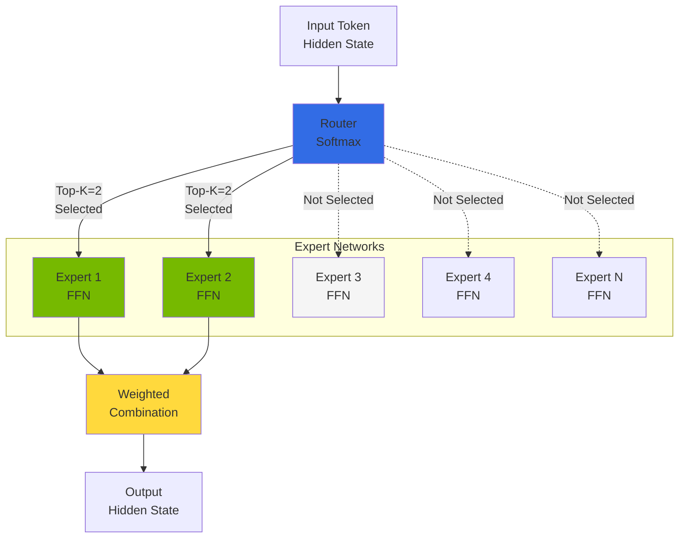
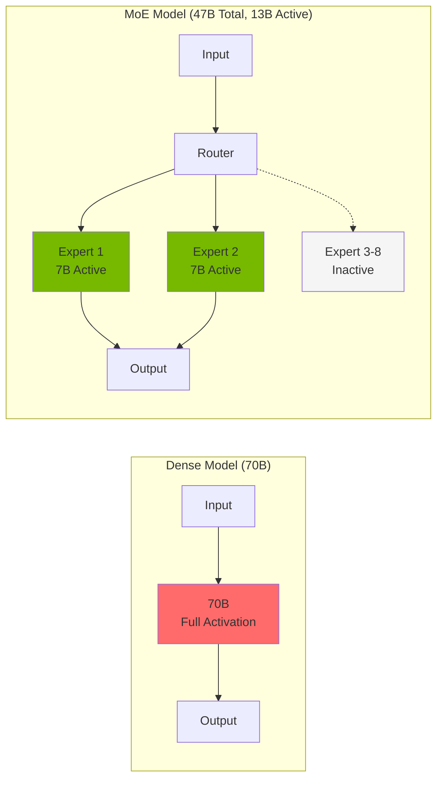
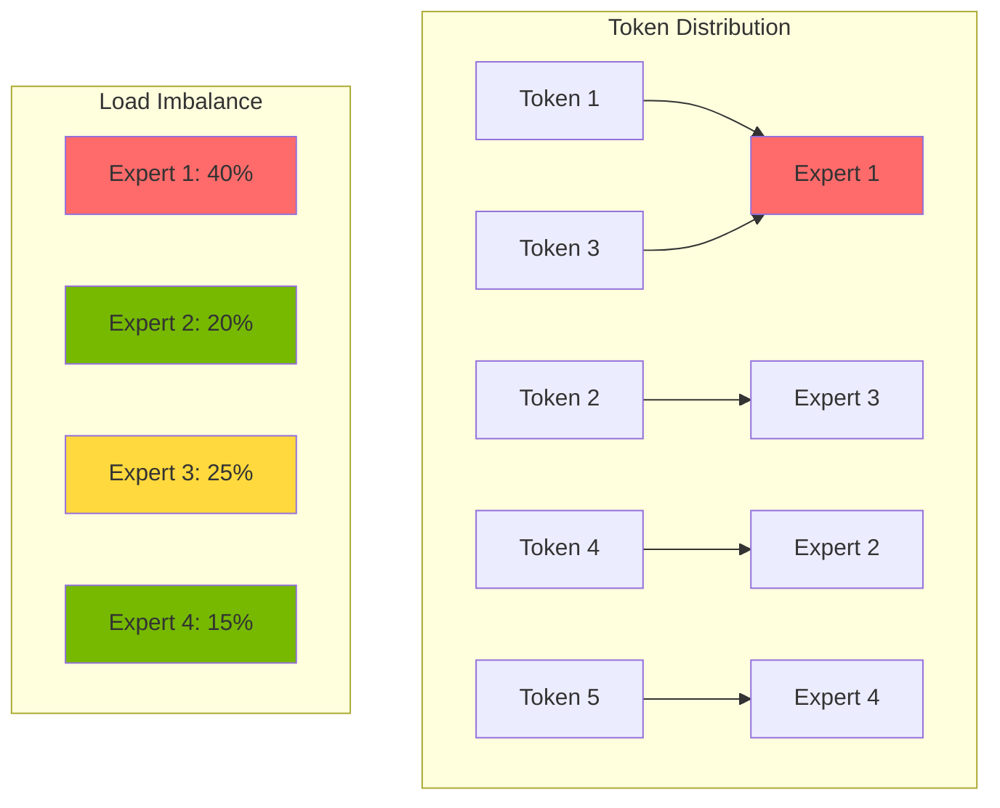
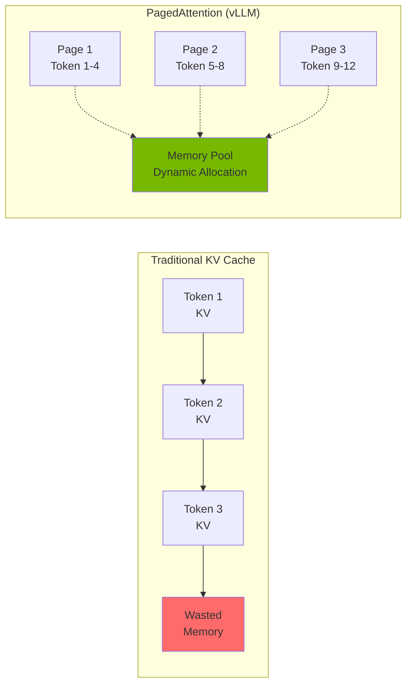
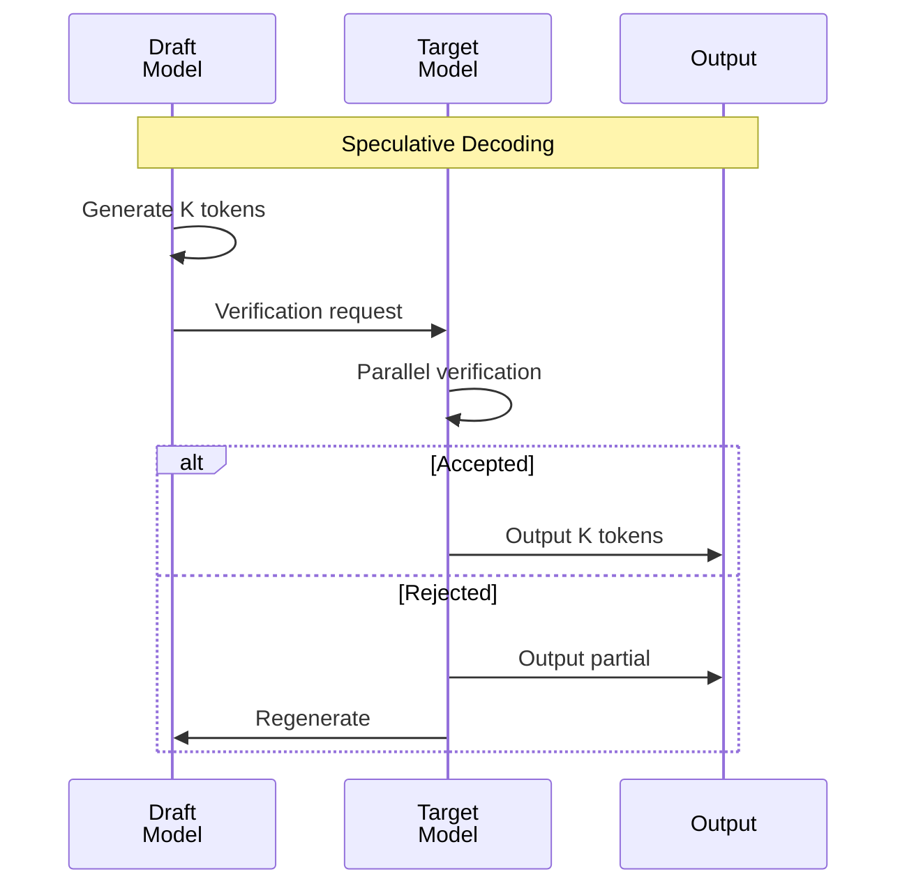

import { RoutingMechanisms, MoeVsDense, GpuMemoryRequirements, ParallelizationStrategies, TensorParallelismConfig, VllmVsTgi, KvCacheConfig, BatchOptimization, MonitoringMetrics, GpuVsTrainium2 } from '@site/src/components/MoeModelTables';

# MoE Model Serving Guide

> **📌 Current Version**: vLLM v0.6.3 / v0.7.x (2025-02 stable release), TGI 3.3.5 (Legacy - for reference). Deployment examples in this document are based on the latest stable versions.

> 📅 **Written**: 2025-02-09 | **Updated**: 2026-03-17 | ⏱️ **Reading Time**: Approximately 9 minutes

## Overview

Mixture of Experts (MoE) models are an innovative architecture that maximizes the efficiency of large language models. This document covers how to efficiently deploy and operate MoE models such as Mixtral, DeepSeek-MoE, and Qwen-MoE in Amazon EKS environments.

### Key Objectives

- **Understanding MoE Architecture**: How expert networks and routing mechanisms work
- **Efficient Deployment**: Optimized MoE model serving using vLLM (TGI as legacy reference)
- **Resource Optimization**: GPU memory management and distributed deployment strategies
- **Performance Tuning**: Advanced optimization techniques including KV Cache and Speculative Decoding

---

## Understanding MoE Architecture

### Expert Network Structure

MoE models consist of multiple "Expert" networks and a "Router (Gate)" network that selects them.



### Routing Mechanisms

The core of MoE models is the routing mechanism that selects appropriate Experts based on input tokens.

<RoutingMechanisms />

:::info Routing Operation Principle

1. **Gate Computation**: Pass input token's hidden state through Gate network
2. **Expert Selection**: Select Top-K Experts from Softmax output
3. **Parallel Processing**: Selected Experts process input in parallel
4. **Weighted Combination**: Combine Expert outputs with Gate weights

:::

### MoE vs Dense Model Comparison

<MoeVsDense />



:::tip Advantages of MoE Models

- **Computational Efficiency**: Improved inference speed by activating only a portion of total parameters
- **Scalability**: Model capacity can be expanded by adding Experts
- **Specialization**: Each Expert specializes in specific domains/tasks

:::

---

## MoE Model Serving Considerations

### GPU Memory Requirements

MoE models activate fewer parameters, but all Experts must be loaded into memory.

<GpuMemoryRequirements />

:::info DeepSeek-V3 Memory Optimization
DeepSeek-V3 uses Multi-head Latent Attention (MLA) architecture to significantly reduce KV cache memory. It achieves approximately 40% memory reduction compared to traditional MHA (Multi-Head Attention), so actual memory requirements may be lower than indicated values. Exact memory requirements depend on batch size and sequence length, so profiling is recommended.
:::

:::warning Memory Calculation Considerations

- **KV Cache**: Additional memory required based on batch size and sequence length
- **Activation Memory**: Space for storing intermediate activation values during inference
- **CUDA Context**: Approximately 1-2GB CUDA overhead per GPU
- **Safety Margin**: Recommended to secure 10-20% buffer space for actual operations

:::

### Distributed Deployment Strategy

Large-scale MoE models cannot be loaded into a single GPU, requiring distributed deployment.

```mermaid
flowchart TB
    subgraph TP["Tensor Parallelism (TP=4)"]
        TP1[GPU 0<br/>Shard 1/4]
        TP2[GPU 1<br/>Shard 2/4]
        TP3[GPU 2<br/>Shard 3/4]
        TP4[GPU 3<br/>Shard 4/4]
        TP1 <-->|All-Reduce| TP2
        TP2 <-->|All-Reduce| TP3
        TP3 <-->|All-Reduce| TP4
    end

    subgraph EP["Expert Parallelism (EP=2)"]
        EP1[GPU 0-1<br/>Expert 1-4]
        EP2[GPU 2-3<br/>Expert 5-8]
        EP1 -.->|Routing| EP2
    end

    subgraph PP["Pipeline Parallelism (PP=2)"]
        PP1[GPU 0-3<br/>Layer 1-16]
        PP2[GPU 4-7<br/>Layer 17-32]
        PP1 -->|Sequential| PP2
    end

    style TP1 fill:#76b900
    style TP2 fill:#76b900
    style EP1 fill:#326ce5
    style EP2 fill:#326ce5
    style PP1 fill:#ffd93d
    style PP2 fill:#ffd93d
```



<ParallelizationStrategies />

### Expert Activation Patterns

Understanding Expert activation patterns is essential for optimizing MoE model performance.



:::info Expert Load Balancing

- **Auxiliary Loss**: Auxiliary loss during training to encourage equal distribution among Experts
- **Capacity Factor**: Limit on maximum tokens each Expert can process
- **Token Dropping**: Drop tokens when capacity is exceeded (recommended to disable during inference)

:::

---

## vLLM-based MoE Deployment

### vLLM MoE Support Features

vLLM v0.6+ provides the following optimizations for MoE models:

- **Expert Parallelism**: Distribute Experts across multiple GPUs
- **Tensor Parallelism**: Tensor splitting within layers
- **PagedAttention**: Efficient KV Cache management
- **Continuous Batching**: Dynamic batch processing
- **FP8 KV Cache**: 2x memory savings (v0.6+)
- **Improved Prefix Caching**: 400%+ throughput improvement (v0.6+)
- **Multi-LoRA Serving**: Simultaneously serve multiple LoRA adapters on single base model (v0.6+)
- **GGUF Quantization**: Support for GGUF format quantized models (v0.6+)

### Mixtral 8x7B Deployment YAML

```yaml
apiVersion: apps/v1
kind: Deployment
metadata:
  name: mixtral-8x7b-vllm
  namespace: inference
  labels:
    app: mixtral-8x7b
    serving-engine: vllm
spec:
  replicas: 1
  selector:
    matchLabels:
      app: mixtral-8x7b
  template:
    metadata:
      labels:
        app: mixtral-8x7b
        serving-engine: vllm
    spec:
      nodeSelector:
        node.kubernetes.io/instance-type: p4d.24xlarge
      tolerations:
        - key: nvidia.com/gpu
          operator: Exists
          effect: NoSchedule
      containers:
        - name: vllm
          image: vllm/vllm-openai:v0.6.3
          ports:
            - name: http
              containerPort: 8000
              protocol: TCP
          env:
            - name: HUGGING_FACE_HUB_TOKEN
              valueFrom:
                secretKeyRef:
                  name: hf-token
                  key: token
            - name: VLLM_ATTENTION_BACKEND
              value: "FLASH_ATTN"
          args:
            - "--model"
            - "mistralai/Mixtral-8x7B-Instruct-v0.1"
            - "--tensor-parallel-size"
            - "2"
            - "--max-model-len"
            - "32768"
            - "--gpu-memory-utilization"
            - "0.90"
            - "--enable-chunked-prefill"
            - "--max-num-batched-tokens"
            - "32768"
            - "--enable-prefix-caching"
            - "--kv-cache-dtype"
            - "fp8"
            - "--trust-remote-code"
            - "--dtype"
            - "bfloat16"
          resources:
            requests:
              nvidia.com/gpu: 2
              memory: "180Gi"
              cpu: "24"
            limits:
              nvidia.com/gpu: 2
              memory: "200Gi"
              cpu: "32"
          volumeMounts:
            - name: model-cache
              mountPath: /root/.cache/huggingface
            - name: shm
              mountPath: /dev/shm
          livenessProbe:
            httpGet:
              path: /health
              port: 8000
            initialDelaySeconds: 300
            periodSeconds: 30
            timeoutSeconds: 10
          readinessProbe:
            httpGet:
              path: /health
              port: 8000
            initialDelaySeconds: 120
            periodSeconds: 10
            timeoutSeconds: 5
      volumes:
        - name: model-cache
          persistentVolumeClaim:
            claimName: model-cache-pvc
        - name: shm
          emptyDir:
            medium: Memory
            sizeLimit: 16Gi
      terminationGracePeriodSeconds: 120
```

### Mixtral 8x22B Large-scale Deployment (4 GPU)

```yaml
apiVersion: apps/v1
kind: Deployment
metadata:
  name: mixtral-8x22b-vllm
  namespace: inference
  labels:
    app: mixtral-8x22b
    serving-engine: vllm
spec:
  replicas: 1
  selector:
    matchLabels:
      app: mixtral-8x22b
  template:
    metadata:
      labels:
        app: mixtral-8x22b
        serving-engine: vllm
    spec:
      nodeSelector:
        node.kubernetes.io/instance-type: p5.48xlarge
      tolerations:
        - key: nvidia.com/gpu
          operator: Exists
          effect: NoSchedule
      containers:
        - name: vllm
          image: vllm/vllm-openai:v0.6.3
          ports:
            - name: http
              containerPort: 8000
          env:
            - name: HUGGING_FACE_HUB_TOKEN
              valueFrom:
                secretKeyRef:
                  name: hf-token
                  key: token
            - name: NCCL_DEBUG
              value: "INFO"
            - name: NCCL_IB_DISABLE
              value: "0"
          args:
            - "--model"
            - "mistralai/Mixtral-8x22B-Instruct-v0.1"
            - "--tensor-parallel-size"
            - "4"
            - "--max-model-len"
            - "65536"
            - "--gpu-memory-utilization"
            - "0.92"
            - "--enable-chunked-prefill"
            - "--max-num-batched-tokens"
            - "65536"
            - "--enable-prefix-caching"
            - "--kv-cache-dtype"
            - "fp8"
            - "--dtype"
            - "bfloat16"
            - "--enforce-eager"
          resources:
            requests:
              nvidia.com/gpu: 4
              memory: "400Gi"
              cpu: "48"
            limits:
              nvidia.com/gpu: 4
              memory: "500Gi"
              cpu: "64"
          volumeMounts:
            - name: model-cache
              mountPath: /root/.cache/huggingface
            - name: shm
              mountPath: /dev/shm
      volumes:
        - name: model-cache
          persistentVolumeClaim:
            claimName: model-cache-pvc
        - name: shm
          emptyDir:
            medium: Memory
            sizeLimit: 32Gi
```

### vLLM Tensor Parallelism Configuration

Tensor Parallelism splits each layer of the model across multiple GPUs.

<TensorParallelismConfig />

:::tip Tensor Parallelism Optimization

- **NVLink Utilization**: Use NVLink-enabled instances for high-speed inter-GPU communication
- **TP Size Selection**: Choose minimum TP size based on model size and GPU memory
- **Communication Overhead**: Larger TP size increases All-Reduce communication

:::

### vLLM Expert Parallelism Configuration

Expert Parallelism distributes Experts of MoE models across multiple GPUs.

```yaml
# Expert Parallelism activation example
args:
  - "--model"
  - "mistralai/Mixtral-8x7B-Instruct-v0.1"
  - "--tensor-parallel-size"
  - "2"
  # Expert Parallelism is automatically optimized in vLLM
  # Experts are distributed within TP
  - "--distributed-executor-backend"
  - "ray"  # or "mp" (multiprocessing)
```

---

## TGI-based MoE Deployment

:::warning Legacy - TGI-based Deployment (Reference)

**TGI Maintenance Mode - Not Recommended for New Deployments**: Text Generation Inference (TGI) entered maintenance mode starting 2025. Hugging Face recommends using downstream inference engines like vLLM and SGLang. **Use vLLM for new deployments.** Existing TGI deployments will continue to work, but new feature updates or optimizations will not be provided.

### Migrating from TGI to vLLM

If you're using TGI, you can migrate to vLLM with the following steps:

1. **API Compatibility**: vLLM provides OpenAI-compatible API, minimizing client code changes
2. **Environment Variable Mapping**:
   - TGI `MODEL_ID` → vLLM `--model`
   - TGI `NUM_SHARD` → vLLM `--tensor-parallel-size`
   - TGI `MAX_TOTAL_TOKENS` → vLLM `--max-model-len`
3. **Performance Improvement**: 2-3x throughput improvement with vLLM's PagedAttention and Continuous Batching
4. **Latest Features**: Utilize latest optimization techniques like FP8 KV Cache, Prefix Caching, Multi-LoRA

### TGI MoE Support Features (Legacy)

Text Generation Inference (TGI) is a high-performance inference server developed by Hugging Face.

- **Flash Attention 2**: Memory-efficient attention operations
- **Paged Attention**: Dynamic KV Cache management
- **Tensor Parallelism**: Multi-GPU distributed inference
- **Quantization**: AWQ, GPTQ, EETQ support

### TGI Mixtral 8x7B Deployment YAML

```yaml
apiVersion: apps/v1
kind: Deployment
metadata:
  name: mixtral-8x7b-tgi
  namespace: inference
  labels:
    app: mixtral-8x7b
    serving-engine: tgi
spec:
  replicas: 1
  selector:
    matchLabels:
      app: mixtral-8x7b-tgi
  template:
    metadata:
      labels:
        app: mixtral-8x7b-tgi
        serving-engine: tgi
    spec:
      nodeSelector:
        node.kubernetes.io/instance-type: p4d.24xlarge
      tolerations:
        - key: nvidia.com/gpu
          operator: Exists
          effect: NoSchedule
      containers:
        - name: tgi
          image: ghcr.io/huggingface/text-generation-inference:3.3.5
          ports:
            - name: http
              containerPort: 8080
              protocol: TCP
          env:
            - name: HUGGING_FACE_HUB_TOKEN
              valueFrom:
                secretKeyRef:
                  name: hf-token
                  key: token
            - name: MODEL_ID
              value: "mistralai/Mixtral-8x7B-Instruct-v0.1"
            - name: NUM_SHARD
              value: "2"
            - name: MAX_INPUT_LENGTH
              value: "8192"
            - name: MAX_TOTAL_TOKENS
              value: "32768"
            - name: MAX_BATCH_PREFILL_TOKENS
              value: "32768"
            - name: DTYPE
              value: "bfloat16"
            - name: QUANTIZE
              value: ""  # or "awq", "gptq"
            - name: TRUST_REMOTE_CODE
              value: "true"
          resources:
            requests:
              nvidia.com/gpu: 2
              memory: "180Gi"
              cpu: "24"
            limits:
              nvidia.com/gpu: 2
              memory: "200Gi"
              cpu: "32"
          volumeMounts:
            - name: model-cache
              mountPath: /data
            - name: shm
              mountPath: /dev/shm
          livenessProbe:
            httpGet:
              path: /health
              port: 8080
            initialDelaySeconds: 300
            periodSeconds: 30
          readinessProbe:
            httpGet:
              path: /health
              port: 8080
            initialDelaySeconds: 120
            periodSeconds: 10
      volumes:
        - name: model-cache
          persistentVolumeClaim:
            claimName: model-cache-pvc
        - name: shm
          emptyDir:
            medium: Memory
            sizeLimit: 16Gi
```

### TGI Quantized Deployment (AWQ)

You can use AWQ quantized models for memory efficiency.

```yaml
apiVersion: apps/v1
kind: Deployment
metadata:
  name: mixtral-8x7b-tgi-awq
  namespace: inference
spec:
  replicas: 1
  selector:
    matchLabels:
      app: mixtral-8x7b-tgi-awq
  template:
    metadata:
      labels:
        app: mixtral-8x7b-tgi-awq
    spec:
      nodeSelector:
        node.kubernetes.io/instance-type: g5.48xlarge
      tolerations:
        - key: nvidia.com/gpu
          operator: Exists
          effect: NoSchedule
      containers:
        - name: tgi
          image: ghcr.io/huggingface/text-generation-inference:3.3.5
          ports:
            - name: http
              containerPort: 8080
          env:
            - name: HUGGING_FACE_HUB_TOKEN
              valueFrom:
                secretKeyRef:
                  name: hf-token
                  key: token
            - name: MODEL_ID
              value: "TheBloke/Mixtral-8x7B-Instruct-v0.1-AWQ"
            - name: NUM_SHARD
              value: "2"
            - name: MAX_INPUT_LENGTH
              value: "8192"
            - name: MAX_TOTAL_TOKENS
              value: "16384"
            - name: QUANTIZE
              value: "awq"
          resources:
            requests:
              nvidia.com/gpu: 2
              memory: "90Gi"
              cpu: "16"
            limits:
              nvidia.com/gpu: 2
              memory: "120Gi"
              cpu: "24"
```

### vLLM vs TGI Performance Comparison

<VllmVsTgi />

:::

---

## AWS Trainium2-based MoE Deployment

### Trainium2 Overview

AWS Trainium2 is AWS's second-generation ML accelerator optimized for large language model inference. It provides cost-effective inference compared to GPUs and enables easy PyTorch model deployment through NeuronX SDK.

**Key Features:**
- **High Performance**: Single trn2.48xlarge instance can perform Llama 3.1 405B inference
- **Cost Efficiency**: Up to 50% cost savings compared to GPUs
- **NeuronX SDK**: PyTorch 2.5+ support, minimal code changes for model onboarding
- **NxD Inference**: PyTorch-based library that simplifies large LLM deployment
- **FP8 Quantization**: Enhanced memory efficiency
- **Flash Decoding**: Speculative Decoding support

### Trainium2 Instance Types and Cost Comparison

<GpuVsTrainium2 />

### NeuronX SDK Installation

```bash
# Install Neuron SDK 2.21+
pip install neuronx-cc==2.* torch-neuronx torchvision

# Install NxD Inference library
pip install neuronx-distributed-inference

# Install Transformers NeuronX
pip install transformers-neuronx
```

### Mixtral 8x7B Trainium2 Deployment

```yaml
apiVersion: apps/v1
kind: Deployment
metadata:
  name: mixtral-8x7b-trainium2
  namespace: inference
  labels:
    app: mixtral-8x7b
    accelerator: trainium2
spec:
  replicas: 1
  selector:
    matchLabels:
      app: mixtral-8x7b-trainium2
  template:
    metadata:
      labels:
        app: mixtral-8x7b-trainium2
    spec:
      nodeSelector:
        node.kubernetes.io/instance-type: trn2.48xlarge
      tolerations:
        - key: aws.amazon.com/neuron
          operator: Exists
          effect: NoSchedule
      containers:
        - name: neuron-inference
          image: public.ecr.aws/neuron/pytorch-inference-neuronx:2.1.2-neuronx-py310-sdk2.21.0-ubuntu20.04
          ports:
            - name: http
              containerPort: 8000
          env:
            - name: HUGGING_FACE_HUB_TOKEN
              valueFrom:
                secretKeyRef:
                  name: hf-token
                  key: token
            - name: NEURON_RT_NUM_CORES
              value: "16"
            - name: NEURON_CC_FLAGS
              value: "--model-type=transformer"
          command:
            - python
            - -m
            - neuronx_distributed_inference.serve
          args:
            - --model_id
            - mistralai/Mixtral-8x7B-Instruct-v0.1
            - --batch_size
            - "4"
            - --sequence_length
            - "2048"
            - --tp_degree
            - "8"
            - --amp
            - "fp16"
          resources:
            requests:
              aws.amazon.com/neuron: 16
              memory: "400Gi"
              cpu: "96"
            limits:
              aws.amazon.com/neuron: 16
              memory: "480Gi"
              cpu: "128"
          volumeMounts:
            - name: model-cache
              mountPath: /root/.cache/huggingface
            - name: neuron-cache
              mountPath: /var/tmp/neuron-compile-cache
      volumes:
        - name: model-cache
          persistentVolumeClaim:
            claimName: model-cache-pvc
        - name: neuron-cache
          emptyDir:
            sizeLimit: 50Gi
```

### NxD Inference Python Example

```python
# neuron_inference.py
import torch
from transformers import AutoTokenizer
from neuronx_distributed_inference import NxDInference

# Load model and tokenizer
model_id = "mistralai/Mixtral-8x7B-Instruct-v0.1"
tokenizer = AutoTokenizer.from_pretrained(model_id)

# Initialize NxD Inference
nxd_model = NxDInference(
    model_id=model_id,
    tp_degree=8,  # Tensor Parallelism
    batch_size=4,
    sequence_length=2048,
    amp="fp16",
    neuron_config={
        "enable_bucketing": True,
        "enable_saturate_infinity": True,
    }
)

# Perform inference
prompt = "Explain Mixture of Experts architecture"
inputs = tokenizer(prompt, return_tensors="pt")

with torch.inference_mode():
    outputs = nxd_model.generate(
        input_ids=inputs.input_ids,
        max_new_tokens=512,
        temperature=0.7,
        top_p=0.9,
    )

response = tokenizer.decode(outputs[0], skip_special_tokens=True)
print(response)
```


:::tip Recommended Scenarios for Trainium2

- **Cost Optimization**: When 50%+ cost reduction compared to GPU is needed
- **Large-scale Deployment**: Operating dozens to hundreds of inference endpoints
- **Stable Workloads**: Production environments where stability and cost are more important than experimental features
- **AWS Native**: Prefer fully managed solutions within AWS ecosystem

:::

:::warning Trainium2 Constraints

- **Model Support**: Not all models are supported, need to verify NeuronX SDK compatibility
- **Custom Kernels**: Some custom CUDA kernels need to be ported to Neuron
- **Debugging**: Debugging tools are more limited compared to GPUs
- **Region Availability**: Only available in some AWS regions

:::

---

## Service and Ingress Configuration

### MoE Model Service YAML

```yaml
apiVersion: v1
kind: Service
metadata:
  name: mixtral-8x7b-service
  namespace: inference
  labels:
    app: mixtral-8x7b
spec:
  type: ClusterIP
  ports:
    - name: http
      port: 8000
      targetPort: 8000
      protocol: TCP
  selector:
    app: mixtral-8x7b
---
apiVersion: v1
kind: Service
metadata:
  name: mixtral-8x7b-tgi-service
  namespace: inference
  labels:
    app: mixtral-8x7b-tgi
spec:
  type: ClusterIP
  ports:
    - name: http
      port: 8080
      targetPort: 8080
      protocol: TCP
  selector:
    app: mixtral-8x7b-tgi
```

### Gateway API HTTPRoute Configuration

```yaml
apiVersion: gateway.networking.k8s.io/v1
kind: HTTPRoute
metadata:
  name: moe-model-route
  namespace: inference
spec:
  parentRefs:
    - name: inference-gateway
      namespace: kgateway-system
  hostnames:
    - "inference.example.com"
  rules:
    - matches:
        - path:
            type: PathPrefix
            value: /v1/mixtral
      backendRefs:
        - name: mixtral-8x7b-service
          port: 8000
      filters:
        - type: URLRewrite
          urlRewrite:
            path:
              type: ReplacePrefixMatch
              replacePrefixMatch: /v1
    - matches:
        - path:
            type: PathPrefix
            value: /v1/mixtral-tgi
      backendRefs:
        - name: mixtral-8x7b-tgi-service
          port: 8080
```

---

## Performance Optimization

### KV Cache Optimization

KV Cache is a key factor that greatly affects inference performance.



#### vLLM KV Cache Configuration

```yaml
args:
  - "--model"
  - "mistralai/Mixtral-8x7B-Instruct-v0.1"
  # Ratio of GPU memory to allocate to KV Cache
  - "--gpu-memory-utilization"
  - "0.90"
  # Maximum sequence length (affects KV Cache size)
  - "--max-model-len"
  - "32768"
  # Chunked Prefill for improved memory efficiency
  - "--enable-chunked-prefill"
  # Maximum tokens per batch
  - "--max-num-batched-tokens"
  - "32768"
```

<KvCacheConfig />

### Speculative Decoding

Speculative Decoding improves inference speed using a small draft model.



#### vLLM Speculative Decoding Configuration

```yaml
args:
  - "--model"
  - "mistralai/Mixtral-8x7B-Instruct-v0.1"
  - "--tensor-parallel-size"
  - "2"
  # Enable Speculative Decoding
  - "--speculative-model"
  - "mistralai/Mistral-7B-Instruct-v0.2"
  # Number of tokens for draft model to generate
  - "--num-speculative-tokens"
  - "5"
  # Draft model tensor parallel size
  - "--speculative-draft-tensor-parallel-size"
  - "1"
```

:::info Speculative Decoding Effect

- **Speed Improvement**: 1.5x - 2.5x throughput increase (varies by workload)
- **Quality Preservation**: Output quality is identical (guaranteed by verification)
- **Additional Memory**: Requires additional GPU memory for draft model

:::

### Batch Processing Optimization

Efficient batch processing maximizes GPU utilization.

```yaml
args:
  - "--model"
  - "mistralai/Mixtral-8x7B-Instruct-v0.1"
  # Continuous Batching related settings
  - "--max-num-seqs"
  - "256"  # Maximum number of concurrent sequences
  - "--max-num-batched-tokens"
  - "32768"  # Maximum tokens per batch
  # Separate Prefill and Decode
  - "--enable-chunked-prefill"
  - "--max-num-batched-tokens"
  - "32768"
```

<BatchOptimization />

---

## Monitoring and Alerts

### MoE Model-specific Metrics

```yaml
apiVersion: monitoring.coreos.com/v1
kind: ServiceMonitor
metadata:
  name: moe-model-monitor
  namespace: monitoring
spec:
  selector:
    matchLabels:
      app: mixtral-8x7b
  endpoints:
    - port: http
      path: /metrics
      interval: 15s
  namespaceSelector:
    matchNames:
      - inference
```

### Key Monitoring Metrics

<MonitoringMetrics />

### Prometheus Alert Rules

```yaml
apiVersion: monitoring.coreos.com/v1
kind: PrometheusRule
metadata:
  name: moe-model-alerts
  namespace: monitoring
spec:
  groups:
    - name: moe-model-alerts
      rules:
        - alert: MoEModelHighLatency
          expr: |
            histogram_quantile(0.95,
              rate(vllm:e2e_request_latency_seconds_bucket[5m])
            ) > 30
          for: 5m
          labels:
            severity: warning
          annotations:
            summary: "MoE model response delay (P95 > 30s)"
            description: "{{ $labels.model_name }} model's P95 latency exceeded 30 seconds."

        - alert: MoEModelKVCacheFull
          expr: vllm:gpu_cache_usage_perc > 0.95
          for: 2m
          labels:
            severity: critical
          annotations:
            summary: "KV Cache capacity shortage"
            description: "KV Cache usage exceeded 95%. New requests may be rejected."

        - alert: MoEModelQueueBacklog
          expr: vllm:num_requests_waiting > 100
          for: 5m
          labels:
            severity: warning
          annotations:
            summary: "Request queue increase"
            description: "Waiting requests exceeded 100. Consider scaling out."
```

---

## Troubleshooting

### Common Issues and Solutions

#### OOM (Out of Memory) Errors

```bash
# Symptom: CUDA out of memory error
# Solution:
# 1. Lower gpu-memory-utilization value
--gpu-memory-utilization 0.85

# 2. Reduce max-model-len
--max-model-len 16384

# 3. Increase tensor parallel size (use more GPUs)
--tensor-parallel-size 4
```

#### Slow Model Loading

```bash
# Symptom: Model loading takes 10+ minutes
# Solution:
# 1. Use model cache PVC
# 2. Use FSx for Lustre for fast model loading
# 3. Pre-download model
```

#### Expert Load Imbalance

```bash
# Symptom: Only specific GPU has high utilization
# Solution:
# 1. Increase batch size to improve token distribution
--max-num-seqs 256

# 2. Distribute Expert activation with diverse inputs
```

:::warning Debugging Tips

- **Adjust log level**: Check detailed logs with `VLLM_LOGGING_LEVEL=DEBUG` environment variable
- **NCCL debugging**: Diagnose inter-GPU communication issues with `NCCL_DEBUG=INFO`
- **Memory profiling**: Real-time GPU memory monitoring with `nvidia-smi dmon`

:::

---

## Summary

MoE model serving enables efficient deployment of large language models.

### Key Points

1. **Architecture Understanding**: Understand how expert networks and routing mechanisms work
2. **Memory Planning**: Secure sufficient GPU memory as all Experts must be loaded
3. **Distributed Deployment**: Properly combine tensor parallelism and expert parallelism
4. **Inference Engine Selection**: vLLM recommended (latest optimization techniques and active updates)
5. **Performance Optimization**: Apply KV Cache, Speculative Decoding, batch processing optimizations

### Next Steps

- [GPU Resource Management](./gpu-resource-management.md) - GPU cluster dynamic resource allocation
- [Inference Gateway Routing](../gateway-agents/inference-gateway-routing.md) - Multi-model routing strategy
- [Agentic AI Platform Architecture](../design-architecture/agentic-platform-architecture.md) - Overall platform configuration

---

## References

- [vLLM Official Documentation](https://docs.vllm.ai/)
- [TGI Official Documentation](https://huggingface.co/docs/text-generation-inference)
- [Mixtral Model Card](https://huggingface.co/mistralai/Mixtral-8x7B-Instruct-v0.1)
- [MoE Architecture Paper](https://arxiv.org/abs/2101.03961)
- [PagedAttention Paper](https://arxiv.org/abs/2309.06180)
