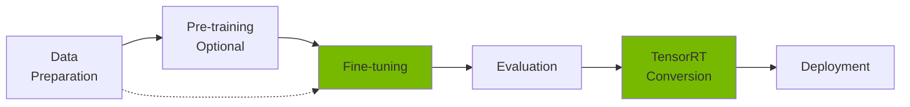
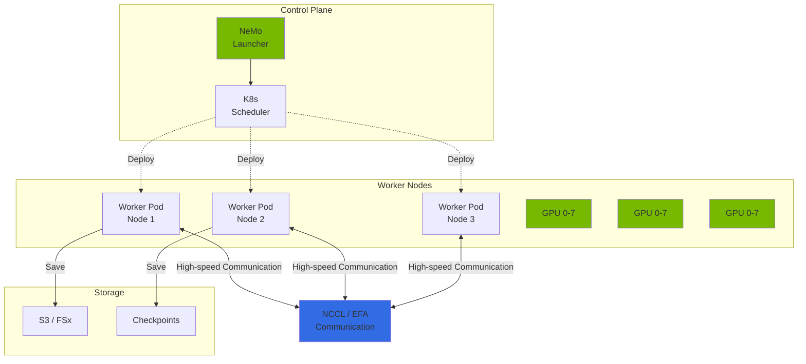
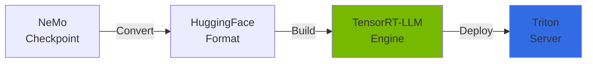
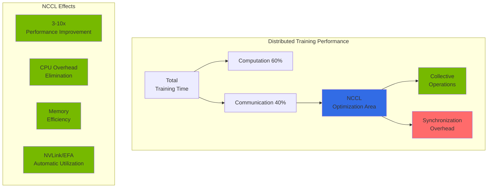
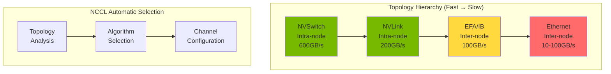

import { NemoComponents, GPURequirements, CheckpointSharding, MonitoringMetrics, NCCLImportance } from '@site/src/components/NemoTables';

# NeMo Framework

> 📅 **Written**: 2026-02-13 | **Updated**: 2026-02-14 | ⏱️ **Reading Time**: Approximately 4 minutes

NVIDIA NeMo is an end-to-end framework for training, fine-tuning, and optimizing large language models (LLMs). It supports distributed training and efficient model deployment in Kubernetes environments.

## Overview

### Why NeMo is Needed

When domain-specific models are required in Agentic AI platforms:

- **Domain Adaptation**: Customizing models for specific industries/fields
- **Performance Optimization**: Inference acceleration through TensorRT-LLM
- **Cost Efficiency**: Replacing large models with smaller fine-tuned models
- **Data Privacy**: On-premises training with sensitive data



### NeMo Framework Components

<NemoComponents />

## EKS Deployment Architecture

### Distributed Training Architecture



### GPU Node Requirements

<GPURequirements />

## NeMo Container Deployment

### Helm Chart Installation

```bash
# NVIDIA NGC registry authentication
kubectl create secret docker-registry ngc-secret \
  --docker-server=nvcr.io \
  --docker-username='$oauthtoken' \
  --docker-password=${NGC_API_KEY} \
  --namespace=nemo

# Install NeMo Operator
helm repo add nvidia https://helm.ngc.nvidia.com/nvidia
helm repo update

helm install nemo-operator nvidia/nemo-operator \
  --namespace nemo \
  --create-namespace \
  --set operator.image.repository=nvcr.io/nvidia/nemo-operator \
  --set operator.image.tag=24.07
```

### NeMo Training Job Definition

:::info Note
The `NeMoTraining` CRD below is an example showing NeMo's declarative training definition concept. In actual deployment, use Kubeflow Training Operator's PyTorchJob to configure distributed training.
:::

```yaml
# NeMo training concept example (actually use PyTorchJob)
apiVersion: nemo.nvidia.com/v1alpha1
kind: NeMoTraining
metadata:
  name: llama-finetune
  namespace: nemo
spec:
  # Model configuration
  model:
    name: "meta-llama/Llama-3.1-8B-Instruct"
    source: "huggingface"

  # Training configuration
  training:
    type: "sft"  # supervised fine-tuning
    epochs: 3
    batchSize: 4
    gradientAccumulationSteps: 8
    learningRate: 2e-5

    # Distributed training configuration
    distributed:
      tensorParallelism: 1
      pipelineParallelism: 1
      dataParallelism: 8

  # Data configuration
  data:
    trainDataset: "s3://nemo-data/train.jsonl"
    valDataset: "s3://nemo-data/val.jsonl"
    format: "jsonl"

  # Resource configuration
  resources:
    nodes: 1
    gpusPerNode: 8
    gpuType: "nvidia.com/gpu"

  # Checkpoint configuration
  checkpoint:
    enabled: true
    path: "s3://nemo-checkpoints/llama-finetune"
    saveInterval: 500

  # Container image
  image:
    repository: "nvcr.io/nvidia/nemo"
    tag: "24.07"
    pullSecrets:
      - name: ngc-secret
```

### Distributed Training via PyTorchJob

```yaml
apiVersion: kubeflow.org/v1
kind: PyTorchJob
metadata:
  name: nemo-distributed-training
  namespace: nemo
spec:
  pytorchReplicaSpecs:
    Master:
      replicas: 1
      restartPolicy: OnFailure
      template:
        spec:
          containers:
          - name: pytorch
            image: nvcr.io/nvidia/nemo:24.07
            command:
            - python
            - -m
            - nemo.collections.llm.recipes.finetune
            - --config-path=/config
            - --config-name=llama_finetune
            env:
            - name: NCCL_DEBUG
              value: "INFO"
            - name: NCCL_IB_DISABLE
              value: "0"
            - name: FI_PROVIDER
              value: "efa"
            - name: FI_EFA_USE_DEVICE_RDMA
              value: "1"
            - name: NCCL_PROTO
              value: "simple"
            resources:
              limits:
                nvidia.com/gpu: 8
                vpc.amazonaws.com/efa: 4
            volumeMounts:
            - name: config
              mountPath: /config
            - name: data
              mountPath: /data
            - name: shm
              mountPath: /dev/shm
          volumes:
          - name: config
            configMap:
              name: nemo-config
          - name: data
            persistentVolumeClaim:
              claimName: training-data-pvc
          - name: shm
            emptyDir:
              medium: Memory
              sizeLimit: 64Gi
    Worker:
      replicas: 3
      restartPolicy: OnFailure
      template:
        spec:
          containers:
          - name: pytorch
            image: nvcr.io/nvidia/nemo:24.07
            # Worker configuration same as Master
```

## Fine-tuning Guide

### SFT (Supervised Fine-Tuning)

```python
# nemo_sft_config.yaml
trainer:
  devices: 8
  num_nodes: 1
  accelerator: gpu
  precision: bf16
  max_epochs: 3
  val_check_interval: 500

model:
  # Base model
  restore_from_path: /models/llama-3.1-8b.nemo

  # LoRA configuration (efficient fine-tuning)
  peft:
    peft_scheme: "lora"
    lora_tuning:
      adapter_dim: 32
      alpha: 32
      dropout: 0.1
      target_modules:
        - "q_proj"
        - "v_proj"
        - "k_proj"
        - "o_proj"

  # Data configuration
  data:
    train_ds:
      file_path: /data/train.jsonl
      micro_batch_size: 4
      global_batch_size: 32
    validation_ds:
      file_path: /data/val.jsonl
      micro_batch_size: 4

  # Optimizer configuration
  optim:
    name: fused_adam
    lr: 2e-5
    weight_decay: 0.01
    betas:
      - 0.9
      - 0.98
```

### Data Format

```json
{"input": "Answer the following question: What is EKS?", "output": "Amazon EKS (Elastic Kubernetes Service) is a managed Kubernetes service provided by AWS."}
{"input": "Explain the main features of Karpenter.", "output": "Karpenter is a Kubernetes node autoscaler that provides automatic node provisioning, consolidation, and drift detection features."}
```

### PEFT/LoRA Fine-tuning

```python
from nemo.collections.llm import finetune
from nemo.collections.llm.peft import LoRA

# LoRA configuration
lora_config = LoRA(
    r=32,
    alpha=32,
    dropout=0.1,
    target_modules=["q_proj", "v_proj", "k_proj", "o_proj"],
)

# Execute fine-tuning
model = finetune(
    model_path="/models/llama-3.1-8b.nemo",
    data_path="/data/train.jsonl",
    peft_config=lora_config,
    trainer_config={
        "devices": 8,
        "max_epochs": 3,
        "precision": "bf16",
    },
    output_path="/output/llama-2-7b-finetuned",
)
```

## Checkpoint Management

### Large-scale Model Checkpoint Sharding (>70B)

For large-scale models over 70B, single checkpoint files can reach hundreds of GB. NeMo manages this efficiently through checkpoint sharding:

```yaml
# Large-scale model checkpoint sharding configuration
trainer:
  checkpoint:
    # Enable sharding
    save_sharded_checkpoint: true

    # Shard size (in GB)
    shard_size_gb: 10

    # Number of parallel save workers
    num_workers: 8

    # Checkpoint compression
    compression: "gzip"
```

**Sharding Strategy:**

<CheckpointSharding />

```python
# Load sharded checkpoint
from nemo.collections.nlp.models import MegatronGPTModel

# Automatically load all shards in parallel
model = MegatronGPTModel.restore_from(
    restore_path="s3://checkpoints/llama-405b/sharded",
    trainer=trainer,
)
```

### S3 Checkpoint Saving

```yaml
apiVersion: v1
kind: ConfigMap
metadata:
  name: nemo-checkpoint-config
  namespace: nemo
data:
  checkpoint.yaml: |
    checkpoint:
      save_dir: "s3://nemo-checkpoints/${JOB_NAME}"
      save_top_k: 3
      save_last: true
      save_interval: 500

      # Automatic recovery configuration
      resume:
        enabled: true
        resume_from_checkpoint: "auto"  # Automatically resume from latest checkpoint
```

### Checkpoint Conversion

```bash
# Convert NeMo checkpoint to HuggingFace format
python -m nemo.collections.llm.scripts.convert_nemo_to_hf \
  --input_path /checkpoints/llama-finetuned.nemo \
  --output_path /models/llama-finetuned-hf \
  --model_type llama
```

## TensorRT-LLM Conversion and Optimization

### Model Conversion Pipeline



### TensorRT-LLM Conversion Script

```python
# convert_to_trt.py
# Using TensorRT-LLM 0.8+ API
from tensorrt_llm import LLM

# Model conversion (using from_pretrained API)
llm = LLM(
    model="/models/llama-finetuned-hf",
    # Build configuration
    max_input_len=4096,
    max_output_len=2048,
    max_batch_size=64,

    # Quantization configuration
    dtype="fp8",  # FP8 quantization for memory savings

    # Optimization configuration
    enable_paged_kv_cache=True,
    enable_chunked_context=True,
)

# Save engine
llm.save("/engines/llama-finetuned-trt")
```

### Running Conversion as Kubernetes Job

```yaml
apiVersion: batch/v1
kind: Job
metadata:
  name: trt-llm-conversion
  namespace: nemo
spec:
  template:
    spec:
      containers:
      - name: converter
        image: nvcr.io/nvidia/tritonserver:24.07-trtllm-python-py3
        command:
        - python
        - /scripts/convert_to_trt.py
        - --input=/models/llama-finetuned-hf
        - --output=/engines/llama-finetuned-trt
        - --quantization=fp8
        - --max-batch-size=64
        resources:
          limits:
            nvidia.com/gpu: 1
            memory: "80Gi"
        volumeMounts:
        - name: models
          mountPath: /models
        - name: engines
          mountPath: /engines
        - name: scripts
          mountPath: /scripts
      volumes:
      - name: models
        persistentVolumeClaim:
          claimName: models-pvc
      - name: engines
        persistentVolumeClaim:
          claimName: engines-pvc
      - name: scripts
        configMap:
          name: conversion-scripts
      restartPolicy: Never
```

## Triton Inference Server Deployment

### TensorRT-LLM Backend Configuration

```yaml
apiVersion: apps/v1
kind: Deployment
metadata:
  name: triton-trtllm
  namespace: inference
spec:
  replicas: 2
  selector:
    matchLabels:
      app: triton-trtllm
  template:
    metadata:
      labels:
        app: triton-trtllm
    spec:
      containers:
      - name: triton
        image: nvcr.io/nvidia/tritonserver:24.07-trtllm-python-py3
        args:
        - tritonserver
        - --model-repository=/models
        - --http-port=8000
        - --grpc-port=8001
        - --metrics-port=8002
        ports:
        - containerPort: 8000
          name: http
        - containerPort: 8001
          name: grpc
        - containerPort: 8002
          name: metrics
        resources:
          limits:
            nvidia.com/gpu: 1
            memory: "80Gi"
        volumeMounts:
        - name: model-repository
          mountPath: /models
      volumes:
      - name: model-repository
        persistentVolumeClaim:
          claimName: triton-models-pvc
```

### Model Repository Structure

```
/models/
└── llama-finetuned/
    ├── config.pbtxt
    ├── 1/
    │   └── model.plan
    └── tokenizer/
        ├── tokenizer.json
        └── tokenizer_config.json
```

### config.pbtxt Configuration

```protobuf
name: "llama-finetuned"
backend: "tensorrtllm"
max_batch_size: 64

input [
  {
    name: "input_ids"
    data_type: TYPE_INT32
    dims: [-1]
  },
  {
    name: "input_lengths"
    data_type: TYPE_INT32
    dims: [1]
  }
]

output [
  {
    name: "output_ids"
    data_type: TYPE_INT32
    dims: [-1]
  }
]

instance_group [
  {
    count: 1
    kind: KIND_GPU
    gpus: [0]
  }
]

parameters {
  key: "max_tokens_in_paged_kv_cache"
  value: { string_value: "8192" }
}

parameters {
  key: "batch_scheduler_policy"
  value: { string_value: "inflight_fused_batching" }
}
```

## Monitoring and Logging

### Training Metrics Collection

```yaml
apiVersion: monitoring.coreos.com/v1
kind: ServiceMonitor
metadata:
  name: nemo-training-monitor
  namespace: nemo
spec:
  selector:
    matchLabels:
      app: nemo-training
  endpoints:
  - port: metrics
    interval: 30s
    path: /metrics
```

### Key Monitoring Metrics

<MonitoringMetrics />

---

## NCCL In-depth Analysis: Distributed Training Communication Optimization

### NCCL's Role and Importance

NCCL (**NVIDIA Collective Communication Library**) is a core library responsible for **high-speed communication between multi-GPUs** in distributed GPU training. Deep learning model performance is directly affected by NCCL optimization level.



**Why NCCL is Important in Distributed Training:**

<NCCLImportance />

### Core Collective Operations

#### 1. AllReduce - Most Important Operation

AllReduce sums data from all GPUs and distributes results to all GPUs:

```
Initial state:
GPU 0: [1, 2, 3]
GPU 1: [4, 5, 6]
GPU 2: [7, 8, 9]
GPU 3: [10, 11, 12]

After AllReduce:
GPU 0: [22, 26, 30]  # 1+4+7+10, 2+5+8+11, 3+6+9+12
GPU 1: [22, 26, 30]
GPU 2: [22, 26, 30]
GPU 3: [22, 26, 30]
```

**AllReduce Usage Example (in distributed training):**

```python
import torch
import torch.distributed as dist

# Initialize distributed training
dist.init_process_group("nccl")
rank = dist.get_rank()
world_size = dist.get_world_size()

# Each GPU's gradients (different)
gradients = torch.randn(1024, device=f"cuda:{rank}")

# AllReduce: Sum and average gradients from all GPUs
dist.all_reduce(gradients, op=dist.ReduceOp.SUM)
gradients /= world_size

# Now all GPUs have identical gradients
# Model weights are synchronized during update
```

#### 2. AllGather - Collect All Data

AllGather collects data from all GPUs and distributes complete data to each GPU:

```
Initial state:
GPU 0: [1, 2]
GPU 1: [3, 4]
GPU 2: [5, 6]
GPU 3: [7, 8]

After AllGather:
GPU 0: [1, 2, 3, 4, 5, 6, 7, 8]
GPU 1: [1, 2, 3, 4, 5, 6, 7, 8]
GPU 2: [1, 2, 3, 4, 5, 6, 7, 8]
GPU 3: [1, 2, 3, 4, 5, 6, 7, 8]
```

**AllGather Use Case:**

```python
# Example: Collect statistics from all GPUs in batch normalization
local_batch_stats = compute_batch_stats(local_batch)

# Collect statistics from all GPUs with AllGather
all_batch_stats = [torch.empty_like(local_batch_stats) for _ in range(world_size)]
dist.all_gather(all_batch_stats, local_batch_stats)

# Calculate global statistics
global_mean = torch.stack(all_batch_stats).mean(dim=0)
global_std = torch.stack(all_batch_stats).std(dim=0)
```

#### 3. ReduceScatter - Inverse of AllGather

ReduceScatter first sums data then distributes partitions to each GPU:

```
Initial state:
GPU 0: [1, 2, 3, 4, 5, 6, 7, 8]
GPU 1: [9, 10, 11, 12, 13, 14, 15, 16]
GPU 2: [17, 18, 19, 20, 21, 22, 23, 24]
GPU 3: [25, 26, 27, 28, 29, 30, 31, 32]

After ReduceScatter sum and partition:
GPU 0: [52, 56]      # (1+9+17+25), (2+10+18+26)
GPU 1: [60, 64]      # (3+11+19+27), (4+12+20+28)
GPU 2: [68, 72]      # (5+13+21+29), (6+14+22+30)
GPU 3: [76, 80]      # (7+15+23+31), (8+16+24+32)
```

**ReduceScatter Use Case (Model Parallelism):**

```python
# Sum and partition computation results in model parallelism
local_output = model_fragment(input_data)

# ReduceScatter: Sum all fragments then partition to each GPU
reduced_output = torch.empty(output_size // world_size, device=local_output.device)
dist.reduce_scatter(reduced_output, [local_output] * world_size)
```

#### 4. Broadcast - Data Distribution

Broadcast copies data from one GPU to all GPUs:

```
Initial state:
GPU 0: [1, 2, 3, 4]
GPU 1: [0, 0, 0, 0]
GPU 2: [0, 0, 0, 0]
GPU 3: [0, 0, 0, 0]

After Broadcast:
GPU 0: [1, 2, 3, 4]
GPU 1: [1, 2, 3, 4]
GPU 2: [1, 2, 3, 4]
GPU 3: [1, 2, 3, 4]
```

**Broadcast Use Case:**

```python
# Broadcast model checkpoint from master GPU
model_state = load_checkpoint() if rank == 0 else None

# Broadcast: Distribute master GPU's model state to all GPUs
dist.broadcast_object_list([model_state], src=0)
model.load_state_dict(model_state)
```

### Network Topology Awareness

NCCL automatically detects physical connection topology between GPUs and selects optimal paths:



### NCCL Performance Tuning Parameters

```yaml
# Complete NCCL Environment Variable Guide

# 1. Algorithm Selection
export NCCL_ALGO=Ring           # Ring (default), Tree, CollNet
export NCCL_ALGO_ALL=Ring       # Specify AllReduce algorithm
export NCCL_ALGO_TREE=Tree      # Force Tree algorithm

# 2. Protocol Selection
export NCCL_PROTO=Simple        # Simple (default) or LL (Low Latency)

# 3. Channel Settings (Very Important)
export NCCL_MIN_NCHANNELS=4     # Minimum channels (default 4)
export NCCL_MAX_NCHANNELS=8     # Maximum channels (default 32)

# 4. Buffer Size
export NCCL_BUFFSIZE=2097152    # Default 2MB, recommended 1MB-4MB

# 5. Debug Settings
export NCCL_DEBUG=INFO          # TRACE, DEBUG, INFO, WARN
export NCCL_DEBUG_FILE=/var/log/nccl-debug.txt
export NCCL_DEBUG_SUBSYS=ALL    # Trace all subsystems

# 6. Network Interface
export NCCL_SOCKET_IFNAME=eth0  # Network interface to use
export NCCL_IB_DISABLE=0        # Use InfiniBand

# 7. EFA Settings (AWS)
export FI_PROVIDER=efa
export FI_EFA_USE_DEVICE_RDMA=1
export FI_EFA_FORK_SAFE=1

# 8. Kernel Optimization
export NCCL_CHECKS_DISABLE=0    # Enable safety checks (production)
export NCCL_COMM_BLOCKING_WAIT=0
export NCCL_ASYNC_ERROR_HANDLING=1

# 9. P2P Settings
export NCCL_P2P_DISABLE=0       # Enable GPU P2P communication
export NCCL_P2P_LEVEL=SYS       # P2P level: LOC (local), SYS (system)

# 10. Timeout Settings
export NCCL_COMM_WAIT_TIMEOUT=0 # 0 = infinite wait
```

---

## Related Documentation

- [GPU Resource Management](./gpu-resource-management.md)
- [MoE Model Serving](./moe-model-serving.md)
- [Inference Gateway](../gateway-agents/inference-gateway-routing.md)

:::tip Recommendations

- Measure baseline performance with base model before fine-tuning
- LoRA/QLoRA enables large model fine-tuning with fewer GPUs
- TensorRT-LLM conversion can improve inference performance 2-4x
- Properly configured NCCL environment variables can significantly improve distributed training performance
:::

:::warning Precautions

- Large-scale training incurs significant GPU costs. Use Spot instances and checkpoints
- Consider NCCL communication overhead when determining node count for distributed training
- Always save checkpoints to persistent storage like S3
- EFA usage requires proper security group settings (allow all traffic)
:::
