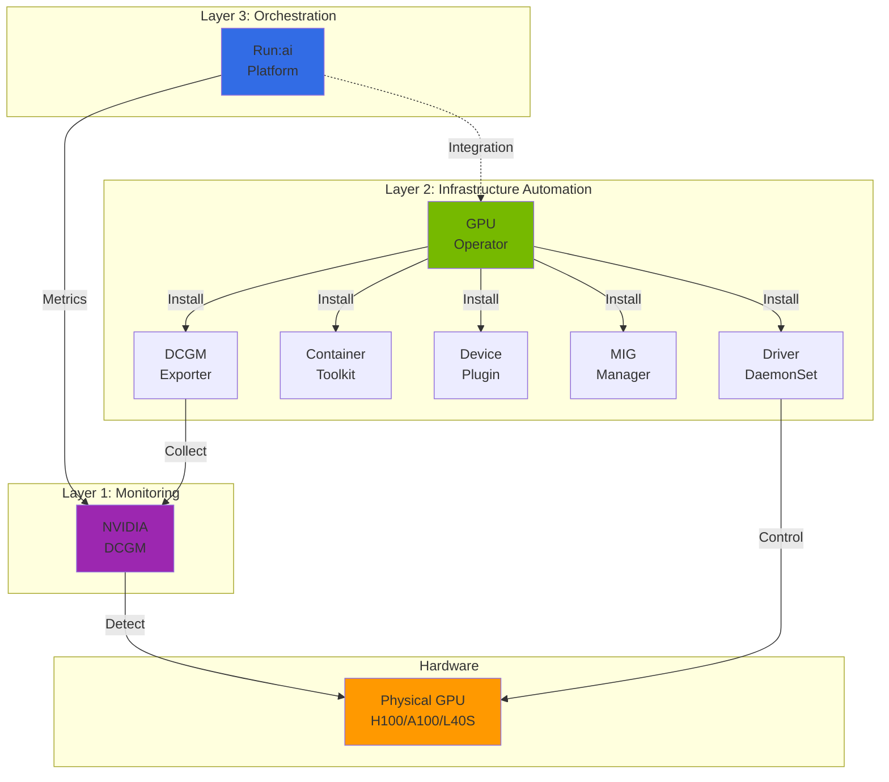
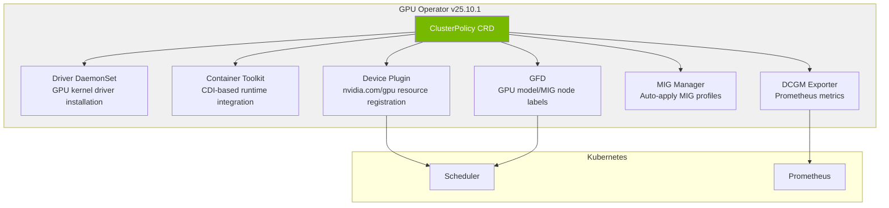
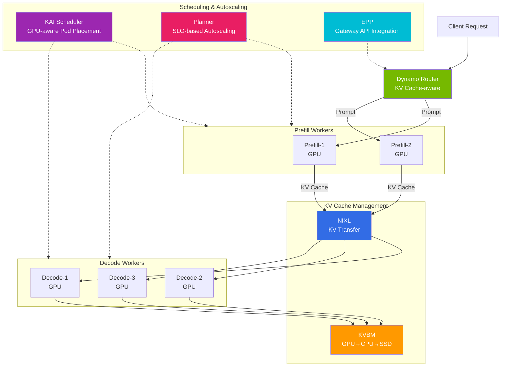

import Tabs from '@theme/Tabs';
import TabItem from '@theme/TabItem';
import { SpecificationTable, ComparisonTable } from '@site/src/components/tables';

# NVIDIA GPU Software Stack

> 📅 **Created**: 2026-03-20 | **Updated**: 2026-03-20 | ⏱️ **Reading Time**: ~10 minutes


## Overview

The NVIDIA GPU software stack is structured in three layers for efficient GPU operations in Kubernetes environments. **GPU Operator** (driver and infrastructure automation) connects GPUs to Kubernetes, **DCGM** (Data Center GPU Manager) monitors GPU status, and **Run:ai** handles GPU orchestration at the top layer. This document covers the configuration and operation of each layer, along with MIG/Time-Slicing partitioning strategies and the NVIDIA Dynamo distributed inference framework.

---

## GPU Operator Architecture

:::info GPU Operator Latest Version (v25.10.1, as of March 2026)

| Component | Version | Role |
|----------|------|------|
| GPU Operator | **v25.10.1** | Full GPU stack lifecycle management |
| NVIDIA Driver | **580.126.18** | GPU kernel driver |
| DCGM | **v4.5.2** | GPU monitoring engine |
| DCGM Exporter | **v4.5.2-4.8.1** | Prometheus metrics exposure |
| Device Plugin | **v0.19.0** | K8s GPU resource registration |
| GFD (GPU Feature Discovery) | **v0.19.0** | GPU node labeling |
| MIG Manager | **v0.13.1** | MIG partition auto-management |
| Container Toolkit (CDI) | **v1.17.5** | Container GPU runtime |

**v25.10.1 Key Features:**
- **Blackwell Architecture Support**: Full support for B200/GB200 GPUs
- **HPC Job Mapping**: GPU job-level metrics collection and accounting
- **CDMM (Confidential Data & Model Management)**: GPU support for Confidential Computing environments
- **CDI (Container Device Interface)**: Container runtime-independent device management
:::

### 3-Layer Architecture



Role of each layer:

- **GPU Operator** (Orchestrator): Orchestration layer that bundles the entire GPU stack via **ClusterPolicy CRD**. Each component (Driver, Container Toolkit, Device Plugin, DCGM Exporter, NFD, GFD, MIG Manager) can be **independently enabled/disabled**. Can be installed on EKS Auto Mode — only Device Plugin is disabled via node labels while other components (DCGM Exporter, NFD, GFD, etc.) operate normally.
- **DCGM** (Sensor): Monitoring engine that reads GPU status. Collects SM Utilization, Tensor Core Activity, Memory, Power, Temperature, ECC Errors, etc.
- **Run:ai** (Control Tower): Scheduling/management layer operating on top of GPU Operator and DCGM. Provides Fractional GPU, Dynamic MIG, Gang Scheduling, and Quota management.

### Dependencies

| Combination | Possible | Use Case |
|---|---|---|
| GPU Operator Only | Yes | Basic GPU inference, manual MIG setup, DCGM metrics |
| GPU Operator + Run:ai | Yes | Enterprise GPU cluster management (recommended) |
| DCGM Only (manual driver install) | Yes | Bare metal, single server monitoring |
| Run:ai Only (without GPU Operator) | **No** | GPU Operator ClusterPolicy is required dependency |
| EKS Auto Mode + Run:ai | **Yes** | Install GPU Operator, disable Device Plugin via label |

### GPU Management by EKS Environment

| Node Type | GPU Driver | GPU Operator | MIG Support | Run:ai Support |
|---|---|---|---|---|
| Auto Mode | AWS auto-install | Installable (Device Plugin disabled via label) | Not supported | Supported (Device Plugin disabled via label) |
| Karpenter (Self-Managed) | GPU Operator install | Full support | Full support | Full support |
| Managed Node Group | GPU Operator install | Full support | Full support | Full support |
| Hybrid Node (on-premises) | GPU Operator required | Required | Full support | Full support |

:::tip Node Strategy Detailed Guide
For detailed information on hybrid configuration of EKS Auto Mode and Karpenter, GPU Operator installation methods, and Hybrid Node GPU farm setup, refer to [EKS GPU Node Strategy](./eks-gpu-node-strategy.md).
:::

### GPU Operator Component Details

GPU Operator manages the entire GPU stack declaratively through the ClusterPolicy CRD.



:::caution GPU Driver Constraints by AMI
- **AL2023 / Bottlerocket**: GPU drivers are pre-installed in the AMI, so GPU Operator's `driver` component must be set to `enabled: false`.
- **AL2 (Custom AMI)**: GPU Operator can install drivers directly.
- **EKS Auto Mode**: AWS manages drivers automatically, so both `driver` and `toolkit` must be set to `enabled: false`.
:::

**Helm Installation Example (Karpenter + Self-Managed):**

```bash
# Add NVIDIA Helm repository
helm repo add nvidia https://helm.ngc.nvidia.com/nvidia
helm repo update

# Install GPU Operator (AL2023/Bottlerocket — disable driver/toolkit)
helm install gpu-operator nvidia/gpu-operator \
  --namespace gpu-operator --create-namespace \
  --set driver.enabled=false \
  --set toolkit.enabled=false \
  --set dcgmExporter.serviceMonitor.enabled=true \
  --set migManager.enabled=true \
  --set gfd.enabled=true \
  --set nfd.enabled=true
```

**ClusterPolicy CRD Example:**

```yaml
apiVersion: nvidia.com/v1
kind: ClusterPolicy
metadata:
  name: cluster-policy
spec:
  operator:
    defaultRuntime: containerd
  driver:
    enabled: false          # AL2023/Bottlerocket: pre-installed in AMI
  toolkit:
    enabled: false          # AL2023/Bottlerocket: pre-installed in AMI
  devicePlugin:
    enabled: true
  dcgmExporter:
    enabled: true
    version: "4.5.2-4.8.1"
    serviceMonitor:
      enabled: true
  migManager:
    enabled: true
    config:
      name: default-mig-parted-config
  gfd:
    enabled: true
  nfd:
    enabled: true
  nodeStatusExporter:
    enabled: false
```

**EKS Auto Mode NodePool Labels (Device Plugin Disabled):**

On Auto Mode, install GPU Operator but disable only the Device Plugin via node labels. GPU Operator installation is required for projects like KAI Scheduler that depend on ClusterPolicy.

```yaml
apiVersion: karpenter.sh/v1
kind: NodePool
metadata:
  name: gpu-auto-mode
spec:
  template:
    metadata:
      labels:
        nvidia.com/gpu.deploy.device-plugin: "false"  # Disable Device Plugin
    spec:
      requirements:
        - key: eks.amazonaws.com/instance-family
          operator: In
          values: ["p5", "p4d"]
      nodeClassRef:
        group: eks.amazonaws.com
        kind: NodeClass
        name: default
```

### GPU Operator Configuration by EKS Environment

| Environment | GPU Operator | Driver Management | MIG | Limitations |
|------|-------------|-------------|-----|---------|
| EKS Auto Mode | Installable (Device Plugin disabled) | AWS automatic (AMI pre-installed) | Not supported | Device Plugin disabled via label, DCGM/NFD/GFD operate normally |
| EKS + Karpenter | Helm install | Operator managed | Full support | GPU AMI required in NodePool |
| EKS Managed Node Group | Helm install | Operator managed | Full support | Node group-level management |
| EKS Hybrid Nodes | Helm install (required) | Operator required | Full support | On-premises GPU farm, network setup required |

---

## DCGM Monitoring

NVIDIA DCGM (Data Center GPU Manager) is a core component that monitors GPU status and exposes metrics to Prometheus.

### Deployment Method Selection

DCGM Exporter can be deployed as DaemonSet or Sidecar. DaemonSet is recommended for most production environments.

<Tabs>
  <TabItem value="daemonset" label="DaemonSet (Recommended)" default>

| Item | Description |
|------|------|
| **Resource Efficiency** | 1 instance per node -- minimal overhead |
| **Management** | Centralized, auto-managed by GPU Operator |
| **Metrics Scope** | Collects all GPU metrics on the node |
| **Security** | Only DaemonSet needs `SYS_ADMIN` |
| **Suitable Environment** | Production environments (most cases) |

  </TabItem>
  <TabItem value="sidecar" label="Sidecar (Special Purpose)">

| Item | Description |
|------|------|
| **Resource Efficiency** | 1 instance per Pod -- high overhead |
| **Management** | Included in Pod spec, individual management |
| **Metrics Scope** | Collects only that Pod's GPU metrics |
| **Security** | All GPU Pods need `SYS_ADMIN` |
| **Suitable Environment** | Multi-tenant isolation, per-Pod billing tracking |

  </TabItem>
</Tabs>

**Valid Sidecar Scenarios:**
- **Multi-tenant billing**: Need to precisely track GPU usage by tenant at Pod level
- **Cannot install DaemonSet**: Environments with limited node access like EKS Auto Mode
- **Pod isolation**: Need to independently monitor only specific Pod's GPU metrics

### DaemonSet Deployment (Recommended)

```yaml
apiVersion: apps/v1
kind: DaemonSet
metadata:
  name: dcgm-exporter
  namespace: gpu-monitoring
  labels:
    app: dcgm-exporter
spec:
  selector:
    matchLabels:
      app: dcgm-exporter
  template:
    metadata:
      labels:
        app: dcgm-exporter
    spec:
      nodeSelector:
        nvidia.com/gpu.present: "true"
      tolerations:
        - key: nvidia.com/gpu
          operator: Exists
          effect: NoSchedule
      containers:
        - name: dcgm-exporter
          image: nvcr.io/nvidia/k8s/dcgm-exporter:4.5.2-4.8.1-ubuntu22.04
          ports:
            - name: metrics
              containerPort: 9400
          env:
            - name: DCGM_EXPORTER_LISTEN
              value: ":9400"
            - name: DCGM_EXPORTER_KUBERNETES
              value: "true"
            - name: DCGM_EXPORTER_COLLECTORS
              value: "/etc/dcgm-exporter/dcp-metrics-included.csv"
          volumeMounts:
            - name: pod-resources
              mountPath: /var/lib/kubelet/pod-resources
              readOnly: true
          securityContext:
            runAsNonRoot: false
            runAsUser: 0
            capabilities:
              add: ["SYS_ADMIN"]
      volumes:
        - name: pod-resources
          hostPath:
            path: /var/lib/kubelet/pod-resources
```

:::info DCGM Exporter 3.3+ Features
DCGM Exporter 3.3+ provides the following enhanced features:
- **H100/H200 Support**: Latest GPU metrics collection
- **Enhanced Metrics**: More granular GPU status monitoring
- **Performance Improvements**: Metrics collection with lower overhead
:::

### Sidecar Deployment (Special Purpose)

Use Kubernetes 1.33+'s stabilized Sidecar Containers to collect GPU metrics at Pod level.

```yaml
apiVersion: v1
kind: Pod
metadata:
  name: vllm-with-monitoring
  namespace: ai-inference
spec:
  initContainers:
    # DCGM Exporter running as Sidecar (special purpose)
    - name: dcgm-sidecar
      image: nvcr.io/nvidia/k8s/dcgm-exporter:4.5.2-4.8.1-ubuntu22.04
      restartPolicy: Always  # K8s 1.33+ Sidecar feature
      ports:
        - name: metrics
          containerPort: 9400
      securityContext:
        capabilities:
          add: ["SYS_ADMIN"]
      resources:
        requests:
          cpu: "100m"
          memory: "128Mi"
        limits:
          cpu: "200m"
          memory: "256Mi"
  containers:
    - name: vllm
      image: vllm/vllm-openai:latest
      resources:
        requests:
          nvidia.com/gpu: 2
        limits:
          nvidia.com/gpu: 2
```

### Key GPU Metrics

Core metrics collected by DCGM Exporter.

<SpecificationTable
  headers={['Metric Name', 'Description', 'Scaling Usage']}
  rows={[
    { id: '1', cells: ['DCGM_FI_DEV_GPU_UTIL', 'GPU core utilization (%)', 'HPA trigger criterion'] },
    { id: '2', cells: ['DCGM_FI_DEV_MEM_COPY_UTIL', 'Memory bandwidth utilization (%)', 'Memory bottleneck detection'] },
    { id: '3', cells: ['DCGM_FI_DEV_FB_USED', 'Framebuffer usage (MB)', 'OOM prevention'] },
    { id: '4', cells: ['DCGM_FI_DEV_FB_FREE', 'Framebuffer available (MB)', 'Capacity planning'] },
    { id: '5', cells: ['DCGM_FI_DEV_POWER_USAGE', 'Power usage (W)', 'Cost monitoring'] },
    { id: '6', cells: ['DCGM_FI_DEV_SM_CLOCK', 'SM clock speed (MHz)', 'Performance monitoring'] },
    { id: '7', cells: ['DCGM_FI_DEV_GPU_TEMP', 'GPU temperature (C)', 'Thermal management'] }
  ]}
/>

### Prometheus ServiceMonitor

```yaml
apiVersion: monitoring.coreos.com/v1
kind: ServiceMonitor
metadata:
  name: dcgm-exporter
  namespace: gpu-monitoring
spec:
  selector:
    matchLabels:
      app: dcgm-exporter
  endpoints:
    - port: metrics
      interval: 15s
      path: /metrics
  namespaceSelector:
    matchNames:
      - gpu-monitoring
```

---

## GPU Partitioning Strategies

### MIG (Multi-Instance GPU) Based Partitioning

MIG divides H100, A100, H200, and other Ampere/Hopper/Blackwell architecture GPUs into up to 7 independent GPU instances. Each MIG instance has isolated memory, cache, and SM (Streaming Multiprocessor), ensuring stable performance without workload interference.

GPU Operator's MIG Manager automatically manages MIG profiles based on ConfigMap.

```yaml
# MIG Profile ConfigMap (mig-parted format)
apiVersion: v1
kind: ConfigMap
metadata:
  name: default-mig-parted-config
  namespace: gpu-operator
data:
  config.yaml: |
    version: v1
    mig-configs:
      # 7 small instances: multi-serving of small models
      all-1g.5gb:
        - devices: all
          mig-enabled: true
          mig-devices:
            "1g.5gb": 7

      # Mixed configuration: simultaneous large + small operation
      mixed-balanced:
        - devices: all
          mig-enabled: true
          mig-devices:
            "3g.20gb": 1
            "2g.10gb": 1
            "1g.5gb": 2

      # Single large instance: 70B+ models
      single-7g:
        - devices: all
          mig-enabled: true
          mig-devices:
            "7g.40gb": 1

---

# Apply MIG profile (select by node label)
# kubectl label node gpu-node-01 nvidia.com/mig.config=mixed-balanced

---

# Use MIG device in Pod
apiVersion: v1
kind: Pod
metadata:
  name: vllm-mig-inference
  namespace: ai-inference
spec:
  containers:
    - name: vllm
      image: vllm/vllm-openai:latest
      command: ["python", "-m", "vllm.entrypoints.openai.api_server"]
      args:
        - "--model"
        - "meta-llama/Llama-2-7b-hf"
        - "--gpu-memory-utilization"
        - "0.9"
      resources:
        requests:
          memory: "4Gi"
          cpu: "4"
          nvidia.com/mig-1g.5gb: 1   # Specify MIG profile
        limits:
          nvidia.com/mig-1g.5gb: 1
```

**A100 40GB MIG Profiles:**

<SpecificationTable
  headers={['Profile', 'Memory', 'SM Count', 'Use Case', 'Expected Throughput']}
  rows={[
    { id: '1', cells: ['1g.5gb', '5GB', '14', 'Small models (3B or less)', '~20 tok/s'] },
    { id: '2', cells: ['1g.10gb', '10GB', '14', 'Small models (3B-7B)', '~25 tok/s'] },
    { id: '3', cells: ['2g.10gb', '10GB', '28', 'Medium models (7B-13B)', '~50 tok/s'] },
    { id: '4', cells: ['3g.20gb', '20GB', '42', 'Medium-large models (13B-30B)', '~100 tok/s'] },
    { id: '5', cells: ['4g.20gb', '20GB', '56', 'Large models (13B-30B)', '~130 tok/s'] },
    { id: '6', cells: ['7g.40gb', '40GB', '84', 'Extra-large models (70B+)', '~200 tok/s'] }
  ]}
/>

### Time-Slicing Based Partitioning

Time-Slicing divides GPU computing time on a time basis, allowing multiple Pods to share the same GPU. Unlike MIG, it is **available on all NVIDIA GPUs** but lacks memory isolation between workloads and performance degradation occurs during concurrent execution.

Configure Time-Slicing via GPU Operator's ClusterPolicy or ConfigMap.

```yaml
# Time-Slicing ConfigMap
apiVersion: v1
kind: ConfigMap
metadata:
  name: time-slicing-config
  namespace: gpu-operator
data:
  any: |-
    version: v1
    sharing:
      timeSlicing:
        renameByDefault: false
        failRequestsGreaterThanOne: false
        resources:
          - name: nvidia.com/gpu
            replicas: 4  # Each GPU shared by 4 Pods

---

# Enable Time-Slicing in ClusterPolicy
apiVersion: nvidia.com/v1
kind: ClusterPolicy
metadata:
  name: cluster-policy
spec:
  devicePlugin:
    enabled: true
    config:
      name: time-slicing-config  # Reference ConfigMap
      default: any

---

# Use Time-Sliced GPU in Pod (same as regular GPU request)
apiVersion: apps/v1
kind: Deployment
metadata:
  name: vllm-timeslice-replicas
  namespace: ai-inference
spec:
  replicas: 3  # 3 Pods share the same GPU
  selector:
    matchLabels:
      app: vllm-slice
  template:
    metadata:
      labels:
        app: vllm-slice
    spec:
      containers:
        - name: vllm
          image: vllm/vllm-openai:latest
          resources:
            requests:
              nvidia.com/gpu: 1  # GPU slice allocated when Time-Slicing enabled
              memory: "8Gi"
              cpu: "2"
            limits:
              nvidia.com/gpu: 1
```

**Time-Slicing Performance Considerations:**

:::warning Time-Slicing Performance Characteristics
- **Context Switching Overhead**: Minimal at ~1% level
- **Concurrent Execution Performance Degradation**: Shares GPU memory and compute, resulting in **50-100% performance degradation** depending on concurrent workload count
- **No Memory Isolation**: Unlike MIG, GPU memory not isolated between workloads, so one workload's OOM affects others
:::

| Use Case | Suitability | Reason |
|----------|:------:|------|
| Batch inference, non-urgent tasks | Suitable | Sequential execution minimizes performance impact |
| Development/test environments | Suitable | GPU cost savings, performance guarantee unnecessary |
| Real-time inference (with SLA) | Unsuitable | Unpredictable latency during concurrent workloads |
| High-performance training | Unsuitable | Requires full GPU memory utilization |

---

## NVIDIA Dynamo: Datacenter-Scale Inference Optimization

### Overview

**NVIDIA Dynamo** is an open-source framework that optimizes LLM inference at datacenter scale. It supports vLLM, SGLang, and TensorRT-LLM as backends, achieving **up to 7x performance improvement** over existing solutions in the SemiAnalysis InferenceX benchmark.

:::info Dynamo v1.0 (2026.03 GA)
- **Supported Backends**: vLLM, SGLang, TensorRT-LLM
- **Serving Modes**: Both Aggregated + Disaggregated equally supported
- **Core Technologies**: Flash Indexer (radix tree KV indexing), NIXL (common KV transfer), KAI Scheduler (GPU-aware Pod placement), Planner (SLO-based autoscaling), EPP (Gateway API integration)
- **Deployment**: Kubernetes Operator + CRD based
- **License**: Apache 2.0
:::

### Core Architecture

Dynamo **equally supports both Aggregated Serving and Disaggregated Serving**. In Disaggregated mode, it separates Prefill (prompt processing) and Decode (token generation) for independent scaling per stage. The latest release introduces **radix tree-based Flash Indexer** for indexing KV cache per worker to optimize prefix matching.



### Core Components

| Component | Role | Benefits |
|----------|------|------|
| **Disaggregated Serving** | Separate Prefill/Decode workers (Aggregated also supported) | Independent scaling per stage, maximize GPU utilization |
| **KV Cache Routing** | Prefix-aware request routing | Improve KV Cache hit rate, reduce TTFT |
| **Flash Indexer** | Radix tree-based KV cache indexing per worker | Optimize prefix matching, maximize KV reuse rate |
| **KVBM (KV Block Manager)** | GPU → CPU → SSD 3-tier cache | Maximize memory efficiency, support large contexts |
| **NIXL** | NVIDIA Inference Transfer Library (common KV transfer engine) | Ultra-fast KV Cache transfer between GPUs (NVLink/RDMA). Used by Dynamo, llm-d, production-stack, aibrix, and most other projects |
| **KAI Scheduler** | GPU-aware K8s Pod scheduler | GPU topology, MIG slice-aware Pod placement. Depends on ClusterPolicy |
| **Planner** | SLO-based autoscaling | Run profiling → supply results to Planner → automatic scaling based on SLO targets |
| **EPP (Endpoint Picker Protocol)** | Gateway API integration | Dynamo's own EPP implementation for native K8s Gateway API integration |

### EKS Deployment

Dynamo is deployed to EKS using the Kubernetes Operator pattern.

**Installation Steps:**

```bash
# 1. Monitoring stack (Prometheus + Grafana)
helm install kube-prometheus-stack prometheus-community/kube-prometheus-stack \
  --namespace monitoring --create-namespace

# 2. GPU Operator (skip if already installed)
helm install gpu-operator nvidia/gpu-operator \
  --namespace gpu-operator --create-namespace

# 3. Dynamo Platform (Operator + etcd + NATS)
helm install dynamo-platform nvidia/dynamo-platform \
  --namespace dynamo-system --create-namespace

# 4. Deploy Dynamo vLLM workload
kubectl apply -f dynamo-vllm-deployment.yaml
```

**DynamoGraphDeploymentRequest (DGDR) CRD-based deployment:**

```yaml
apiVersion: dynamo.nvidia.com/v1alpha1
kind: DynamoGraphDeploymentRequest
metadata:
  name: llama-70b-disagg
  namespace: ai-inference
spec:
  graph:
    name: disaggregated-llm
    engine: vllm
    model: meta-llama/Llama-3.1-70B-Instruct
  serving:
    mode: disaggregated  # aggregated | disaggregated
    prefill:
      replicas: 2
      resources:
        nvidia.com/gpu: 4
    decode:
      replicas: 4
      resources:
        nvidia.com/gpu: 2
  routing:
    strategy: prefix-aware
    kvCacheRouting: true
  sla:
    maxTTFT: 500ms
    maxITL: 50ms
  autoscaling:
    enabled: true
    minReplicas: 2
    maxReplicas: 16
    targetUtilization: 70
```

### AIConfigurator

Dynamo's **AIConfigurator** automatically recommends optimal Tensor Parallelism (TP) and Pipeline Parallelism (PP) settings based on model and hardware configuration.

| Feature | Description |
|------|------|
| Automatic TP/PP Recommendation | Optimal parallelization based on model size, GPU memory, network topology |
| Pareto Frontier | Find optimal points on throughput-latency tradeoff |
| Hardware Profiling | Auto-detect GPU-to-GPU bandwidth, NVLink topology |
| SLA-based Optimization | Configuration recommendations based on target TTFT/ITL |

---

## llm-d vs Dynamo Selection Guide

Both llm-d and NVIDIA Dynamo handle LLM inference routing/scheduling, but they are **alternatives** and should be selected rather than used together.

### Feature Comparison

| Item | llm-d | NVIDIA Dynamo |
|------|-------|---------------|
| **Architecture** | Aggregated + Disaggregated | Aggregated + Disaggregated (equally supported) |
| **KV Cache Routing** | Prefix-aware routing | Prefix-aware + Flash Indexer (radix tree) |
| **KV Cache Transfer** | NIXL (network also supported) | NIXL (NVLink/RDMA ultra-fast transfer) |
| **Routing** | Gateway API + Envoy EPP | Dynamo Router + own EPP (Gateway API integration) |
| **Pod Scheduling** | Default K8s scheduler (no built-in) | KAI Scheduler (GPU-aware Pod placement) |
| **Autoscaling** | HPA/KEDA integration | Planner (SLO-based: profiling → autoscale) + KEDA/HPA |
| **vLLM Backend** | Supported | Supported (also SGLang, TRT-LLM) |
| **Kubernetes Integration** | Gateway API native | Operator + CRD (DGDR) + Gateway API EPP |
| **Complexity** | Low -- add router to existing vLLM | High -- replace entire serving stack |
| **Performance Gain** | Reduce TTFT via prefix hit | Flash Indexer + Disaggregated for up to 7x throughput |
| **Maturity** | v0.5+ | v1.0 GA (2026.03) |

### Why Difficult to Use Together

Both act as **routers that decide which backend to send requests to**. Since they compete at the routing layer, connecting two routers serially makes no sense.

```text
llm-d alone:    Client → llm-d Router → vLLM Workers (Aggregated or Prefill/Decode separated)
Dynamo alone:   Client → Dynamo Router → Prefill Workers → (NIXL) → Decode Workers
```

:::info Dynamo + llm-d Integration Possibility
Dynamo 1.0 can integrate llm-d as an internal component. In this case, llm-d acts not as an independent router but as Dynamo's KV Cache-aware routing layer. Rather than being complete alternatives, Dynamo can be viewed as a superset containing llm-d.
:::

### Selection Criteria

| Scenario | Recommendation |
|----------|------|
| Add routing only to existing vLLM deployment | **llm-d** |
| Small to medium scale (8 GPUs or fewer) | **llm-d** |
| Gateway API-based K8s native routing | **llm-d** |
| Large scale (16+ GPUs), maximize throughput | **Dynamo** |
| Need NIXL-based ultra-fast KV transfer between GPUs | **Dynamo** |
| Long context (128K+) workloads | **Dynamo** (NIXL + 3-tier KV cache) |
| Fast adoption, low operational complexity | **llm-d** |

:::tip Migration Path
Starting with llm-d and transitioning to Dynamo as scale grows is practical. Both use vLLM as backend and leverage NIXL for KV transfer. Key differences are Dynamo's Flash Indexer (radix tree KV indexing), KAI Scheduler (GPU-aware Pod placement), and Planner (SLO-based autoscaling).
:::

---

## Summary

The NVIDIA GPU software stack consists of three layers: GPU Operator (infrastructure automation), DCGM (monitoring), and Run:ai (orchestration). GPUs can be efficiently partitioned through MIG and Time-Slicing, and NVIDIA Dynamo can be used to optimize LLM inference at datacenter scale.

### Next Steps

- [EKS GPU Resource Management](./gpu-resource-management.md) -- Karpenter, KEDA, DRA, cost optimization
- [EKS GPU Node Strategy](./eks-gpu-node-strategy.md) -- Auto Mode + Karpenter + Hybrid Node configuration
- [vLLM Model Serving](./vllm-model-serving.md) -- vLLM-based inference engine

---

## References

- [NVIDIA GPU Operator Documentation](https://docs.nvidia.com/datacenter/cloud-native/gpu-operator/latest/)
- [NVIDIA DCGM Exporter](https://github.com/NVIDIA/dcgm-exporter)
- [NVIDIA Dynamo GitHub](https://github.com/ai-dynamo/dynamo)
- [Dynamo Architecture Overview](https://github.com/ai-dynamo/dynamo/blob/main/docs/architecture.md)
- [NIXL - NVIDIA Inference Transfer Library](https://github.com/ai-dynamo/nixl)
- [KAI Scheduler](https://github.com/NVIDIA/KAI-Scheduler)
