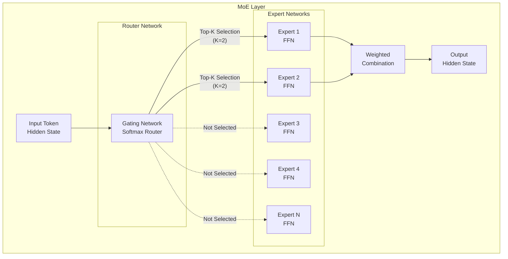
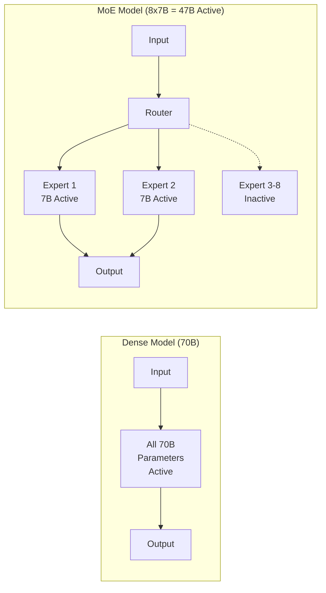
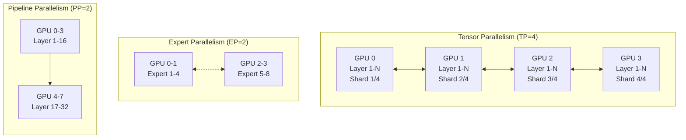
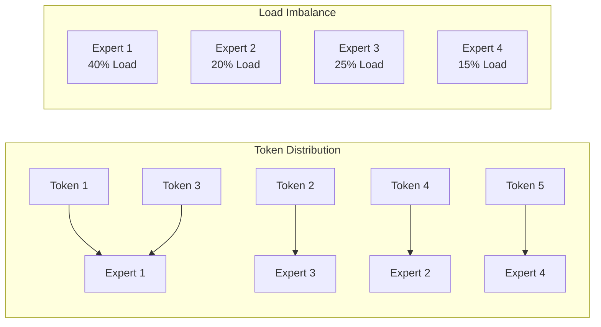
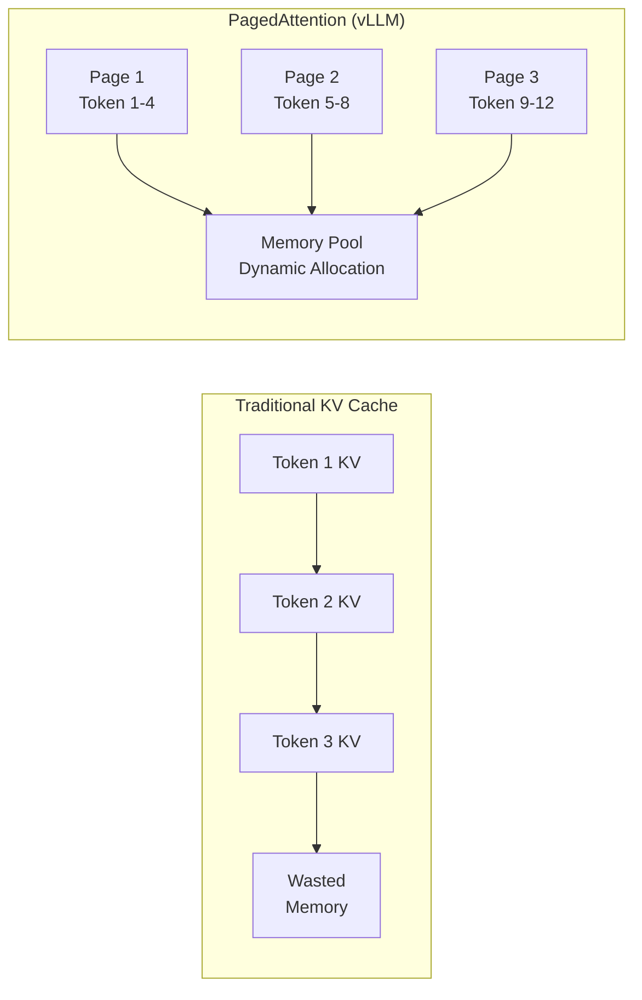
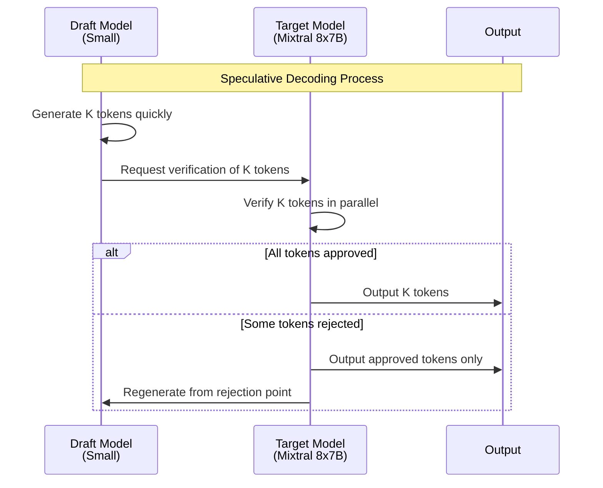

import { RoutingMechanisms, MoeVsDense, GpuMemoryRequirements, ParallelizationStrategies, TensorParallelismConfig, VllmVsTgi, KvCacheConfig, BatchOptimization, MonitoringMetrics, GpuVsTrainium2 } from '@site/src/components/MoeModelTables';

# MoE Model Serving Guide

> 📅 **Written**: 2025-02-05 | **Last Modified**: 2026-02-14 | ⏱️ **Reading Time**: ~5 min

## Overview

Mixture of Experts (MoE) models represent an innovative architecture that maximizes the efficiency of large language models. This document covers how to efficiently deploy and operate MoE models such as Mixtral, DeepSeek-MoE, and Qwen-MoE in Amazon EKS environments.

### Key Objectives

- **Understanding MoE Architecture**: Learn the operational principles of expert networks and routing mechanisms
- **Efficient Deployment**: Optimize MoE model serving using vLLM and TGI
- **Resource Optimization**: GPU memory management and distributed deployment strategies
- **Performance Tuning**: Advanced optimization techniques like KV Cache and Speculative Decoding

---

## Understanding MoE Architecture

### Expert Network Structure

MoE models consist of multiple "Expert" networks and a "Router (Gate)" network that selects among them.



### Routing Mechanism

The core of MoE models is the routing mechanism that selects appropriate experts based on input tokens.

<RoutingMechanisms />

:::info How Routing Works

1. **Gate Calculation**: Pass the hidden state of input tokens through the gate network
2. **Expert Selection**: Select top-K experts from softmax output
3. **Parallel Processing**: Selected experts process input in parallel
4. **Weighted Combination**: Combine expert outputs using gate weights

:::

### MoE vs Dense Model Comparison

<MoeVsDense />



:::tip Advantages of MoE Models

- **Computational Efficiency**: Activate only a subset of all parameters to improve inference speed
- **Scalability**: Expand model capacity by adding experts
- **Specialization**: Each expert can specialize in specific domains/tasks

:::

---

## MoE Model Serving Considerations

### GPU Memory Requirements

MoE models activate fewer parameters, but must load all experts into memory.

<GpuMemoryRequirements />

:::warning Important Memory Calculation Notes

- **KV Cache**: Additional memory needed based on batch size and sequence length
- **Activation Memory**: Space for intermediate activation values during inference
- **CUDA Context**: Approximately 1-2GB CUDA overhead per GPU
- **Safety Margin**: Reserve 10-20% additional space for production operations

:::

### Distributed Deployment Strategies

Large MoE models cannot be loaded on a single GPU, making distributed deployment essential.



<ParallelizationStrategies />

### Expert Activation Patterns

Understanding expert activation patterns is crucial for optimizing MoE model performance.



:::info Expert Load Balancing

- **Auxiliary Loss**: During training, use auxiliary loss to encourage uniform expert distribution
- **Capacity Factor**: Limit maximum tokens per expert
- **Token Dropping**: Drop tokens when capacity is exceeded (not recommended for inference)

:::

---

## MoE Deployment with vLLM

### vLLM MoE Support Features

vLLM provides the following optimizations for MoE models:

- **Expert Parallelism**: Distribute experts across multiple GPUs
- **Tensor Parallelism**: Split tensors within layers
- **PagedAttention**: Efficient KV Cache management
- **Continuous Batching**: Dynamic batch processing

### Mixtral 8x7B Deployment YAML

```yaml
apiVersion: apps/v1
kind: Deployment
metadata:
  name: mixtral-8x7b-vllm
  namespace: inference
  labels:
    app: mixtral-8x7b
    serving-engine: vllm
spec:
  replicas: 1
  selector:
    matchLabels:
      app: mixtral-8x7b
  template:
    metadata:
      labels:
        app: mixtral-8x7b
        serving-engine: vllm
    spec:
      nodeSelector:
        node.kubernetes.io/instance-type: p4d.24xlarge
      tolerations:
        - key: nvidia.com/gpu
          operator: Exists
          effect: NoSchedule
      containers:
        - name: vllm
          image: vllm/vllm-openai:v0.6.0
          ports:
            - name: http
              containerPort: 8000
              protocol: TCP
          env:
            - name: HUGGING_FACE_HUB_TOKEN
              valueFrom:
                secretKeyRef:
                  name: hf-token
                  key: token
            - name: VLLM_ATTENTION_BACKEND
              value: "FLASH_ATTN"
          args:
            - "--model"
            - "mistralai/Mixtral-8x7B-Instruct-v0.1"
            - "--tensor-parallel-size"
            - "2"
            - "--max-model-len"
            - "32768"
            - "--gpu-memory-utilization"
            - "0.90"
            - "--enable-chunked-prefill"
            - "--max-num-batched-tokens"
            - "32768"
            - "--trust-remote-code"
            - "--dtype"
            - "bfloat16"
          resources:
            requests:
              nvidia.com/gpu: 2
              memory: "180Gi"
              cpu: "24"
            limits:
              nvidia.com/gpu: 2
              memory: "200Gi"
              cpu: "32"
          volumeMounts:
            - name: model-cache
              mountPath: /root/.cache/huggingface
            - name: shm
              mountPath: /dev/shm
          livenessProbe:
            httpGet:
              path: /health
              port: 8000
            initialDelaySeconds: 300
            periodSeconds: 30
            timeoutSeconds: 10
          readinessProbe:
            httpGet:
              path: /health
              port: 8000
            initialDelaySeconds: 120
            periodSeconds: 10
            timeoutSeconds: 5
      volumes:
        - name: model-cache
          persistentVolumeClaim:
            claimName: model-cache-pvc
        - name: shm
          emptyDir:
            medium: Memory
            sizeLimit: 16Gi
      terminationGracePeriodSeconds: 120
```

### Mixtral 8x22B Large-Scale Deployment (4 GPU)

```yaml
apiVersion: apps/v1
kind: Deployment
metadata:
  name: mixtral-8x22b-vllm
  namespace: inference
  labels:
    app: mixtral-8x22b
    serving-engine: vllm
spec:
  replicas: 1
  selector:
    matchLabels:
      app: mixtral-8x22b
  template:
    metadata:
      labels:
        app: mixtral-8x22b
        serving-engine: vllm
    spec:
      nodeSelector:
        node.kubernetes.io/instance-type: p5.48xlarge
      tolerations:
        - key: nvidia.com/gpu
          operator: Exists
          effect: NoSchedule
      containers:
        - name: vllm
          image: vllm/vllm-openai:v0.6.0
          ports:
            - name: http
              containerPort: 8000
          env:
            - name: HUGGING_FACE_HUB_TOKEN
              valueFrom:
                secretKeyRef:
                  name: hf-token
                  key: token
            - name: NCCL_DEBUG
              value: "INFO"
            - name: NCCL_IB_DISABLE
              value: "0"
          args:
            - "--model"
            - "mistralai/Mixtral-8x22B-Instruct-v0.1"
            - "--tensor-parallel-size"
            - "4"
            - "--max-model-len"
            - "65536"
            - "--gpu-memory-utilization"
            - "0.92"
            - "--enable-chunked-prefill"
            - "--max-num-batched-tokens"
            - "65536"
            - "--dtype"
            - "bfloat16"
            - "--enforce-eager"
          resources:
            requests:
              nvidia.com/gpu: 4
              memory: "400Gi"
              cpu: "48"
            limits:
              nvidia.com/gpu: 4
              memory: "500Gi"
              cpu: "64"
          volumeMounts:
            - name: model-cache
              mountPath: /root/.cache/huggingface
            - name: shm
              mountPath: /dev/shm
      volumes:
        - name: model-cache
          persistentVolumeClaim:
            claimName: model-cache-pvc
        - name: shm
          emptyDir:
            medium: Memory
            sizeLimit: 32Gi
```

### vLLM Tensor Parallelism Configuration

Tensor parallelism splits each layer of the model across multiple GPUs.

<TensorParallelismConfig />

:::tip Tensor Parallelism Optimization

- **NVLink Utilization**: Use NVLink-capable instances for high-speed GPU communication
- **TP Size Selection**: Choose minimum TP size based on model size and GPU memory
- **Communication Overhead**: Larger TP size increases all-reduce communication

:::

### vLLM Expert Parallelism Configuration

Expert parallelism distributes MoE model experts across multiple GPUs.

```yaml
# Enable Expert Parallelism Example
args:
  - "--model"
  - "mistralai/Mixtral-8x7B-Instruct-v0.1"
  - "--tensor-parallel-size"
  - "2"
  # Expert Parallelism is automatically optimized in vLLM
  # Experts are distributed within TP
  - "--distributed-executor-backend"
  - "ray"  # or "mp" (multiprocessing)
```

---

## MoE Deployment with TGI

### TGI MoE Support Features

Text Generation Inference (TGI) is a high-performance inference server developed by Hugging Face.

- **Flash Attention 2**: Memory-efficient attention computation
- **Paged Attention**: Dynamic KV Cache management
- **Tensor Parallelism**: Multi-GPU distributed inference
- **Quantization**: Support for AWQ, GPTQ, EETQ

### TGI Mixtral 8x7B Deployment YAML

```yaml
apiVersion: apps/v1
kind: Deployment
metadata:
  name: mixtral-8x7b-tgi
  namespace: inference
  labels:
    app: mixtral-8x7b
    serving-engine: tgi
spec:
  replicas: 1
  selector:
    matchLabels:
      app: mixtral-8x7b-tgi
  template:
    metadata:
      labels:
        app: mixtral-8x7b-tgi
        serving-engine: tgi
    spec:
      nodeSelector:
        node.kubernetes.io/instance-type: p4d.24xlarge
      tolerations:
        - key: nvidia.com/gpu
          operator: Exists
          effect: NoSchedule
      containers:
        - name: tgi
          image: ghcr.io/huggingface/text-generation-inference:2.3.0
          ports:
            - name: http
              containerPort: 8080
              protocol: TCP
          env:
            - name: HUGGING_FACE_HUB_TOKEN
              valueFrom:
                secretKeyRef:
                  name: hf-token
                  key: token
            - name: MODEL_ID
              value: "mistralai/Mixtral-8x7B-Instruct-v0.1"
            - name: NUM_SHARD
              value: "2"
            - name: MAX_INPUT_LENGTH
              value: "8192"
            - name: MAX_TOTAL_TOKENS
              value: "32768"
            - name: MAX_BATCH_PREFILL_TOKENS
              value: "32768"
            - name: DTYPE
              value: "bfloat16"
            - name: QUANTIZE
              value: ""  # or "awq", "gptq"
            - name: TRUST_REMOTE_CODE
              value: "true"
          resources:
            requests:
              nvidia.com/gpu: 2
              memory: "180Gi"
              cpu: "24"
            limits:
              nvidia.com/gpu: 2
              memory: "200Gi"
              cpu: "32"
          volumeMounts:
            - name: model-cache
              mountPath: /data
            - name: shm
              mountPath: /dev/shm
          livenessProbe:
            httpGet:
              path: /health
              port: 8080
            initialDelaySeconds: 300
            periodSeconds: 30
          readinessProbe:
            httpGet:
              path: /health
              port: 8080
            initialDelaySeconds: 120
            periodSeconds: 10
      volumes:
        - name: model-cache
          persistentVolumeClaim:
            claimName: model-cache-pvc
        - name: shm
          emptyDir:
            medium: Memory
            sizeLimit: 16Gi
```

### TGI Quantized Deployment (AWQ)

Use AWQ-quantized models for improved memory efficiency.

```yaml
apiVersion: apps/v1
kind: Deployment
metadata:
  name: mixtral-8x7b-tgi-awq
  namespace: inference
spec:
  replicas: 1
  selector:
    matchLabels:
      app: mixtral-8x7b-tgi-awq
  template:
    metadata:
      labels:
        app: mixtral-8x7b-tgi-awq
    spec:
      nodeSelector:
        node.kubernetes.io/instance-type: g5.48xlarge
      tolerations:
        - key: nvidia.com/gpu
          operator: Exists
          effect: NoSchedule
      containers:
        - name: tgi
          image: ghcr.io/huggingface/text-generation-inference:2.3.0
          ports:
            - name: http
              containerPort: 8080
          env:
            - name: HUGGING_FACE_HUB_TOKEN
              valueFrom:
                secretKeyRef:
                  name: hf-token
                  key: token
            - name: MODEL_ID
              value: "TheBloke/Mixtral-8x7B-Instruct-v0.1-AWQ"
            - name: NUM_SHARD
              value: "2"
            - name: MAX_INPUT_LENGTH
              value: "8192"
            - name: MAX_TOTAL_TOKENS
              value: "16384"
            - name: QUANTIZE
              value: "awq"
          resources:
            requests:
              nvidia.com/gpu: 2
              memory: "90Gi"
              cpu: "16"
            limits:
              nvidia.com/gpu: 2
              memory: "120Gi"
              cpu: "24"
```

### vLLM vs TGI Performance Comparison

<VllmVsTgi />

:::tip Inference Engine Selection Guide

- **vLLM**: When maximum throughput is needed, large-scale batch processing
- **TGI**: Hugging Face ecosystem integration, easy deployment
- **Both**: Both engines support MoE models well; choose based on workload

:::

---

## Service and Ingress Configuration

### MoE Model Service YAML

```yaml
apiVersion: v1
kind: Service
metadata:
  name: mixtral-8x7b-service
  namespace: inference
  labels:
    app: mixtral-8x7b
spec:
  type: ClusterIP
  ports:
    - name: http
      port: 8000
      targetPort: 8000
      protocol: TCP
  selector:
    app: mixtral-8x7b
---
apiVersion: v1
kind: Service
metadata:
  name: mixtral-8x7b-tgi-service
  namespace: inference
  labels:
    app: mixtral-8x7b-tgi
spec:
  type: ClusterIP
  ports:
    - name: http
      port: 8080
      targetPort: 8080
      protocol: TCP
  selector:
    app: mixtral-8x7b-tgi
```

### Gateway API HTTPRoute Configuration

```yaml
apiVersion: gateway.networking.k8s.io/v1
kind: HTTPRoute
metadata:
  name: moe-model-route
  namespace: inference
spec:
  parentRefs:
    - name: inference-gateway
      namespace: gateway-system
  hostnames:
    - "inference.example.com"
  rules:
    - matches:
        - path:
            type: PathPrefix
            value: /v1/mixtral
      backendRefs:
        - name: mixtral-8x7b-service
          port: 8000
      filters:
        - type: URLRewrite
          urlRewrite:
            path:
              type: ReplacePrefixMatch
              replacePrefixMatch: /v1
    - matches:
        - path:
            type: PathPrefix
            value: /v1/mixtral-tgi
      backendRefs:
        - name: mixtral-8x7b-tgi-service
          port: 8080
```

---

## Performance Optimization

### KV Cache Optimization

KV Cache is a critical element that significantly impacts inference performance.



#### vLLM KV Cache Configuration

```yaml
args:
  - "--model"
  - "mistralai/Mixtral-8x7B-Instruct-v0.1"
  # Ratio of GPU memory to allocate for KV Cache
  - "--gpu-memory-utilization"
  - "0.90"
  # Maximum sequence length (affects KV Cache size)
  - "--max-model-len"
  - "32768"
  # Improve memory efficiency with chunked prefill
  - "--enable-chunked-prefill"
  # Maximum tokens per batch
  - "--max-num-batched-tokens"
  - "32768"
```

<KvCacheConfig />

### Speculative Decoding

Speculative decoding uses a small draft model to accelerate inference speed.



#### vLLM Speculative Decoding Configuration

```yaml
args:
  - "--model"
  - "mistralai/Mixtral-8x7B-Instruct-v0.1"
  - "--tensor-parallel-size"
  - "2"
  # Enable speculative decoding
  - "--speculative-model"
  - "mistralai/Mistral-7B-Instruct-v0.2"
  # Number of tokens draft model generates
  - "--num-speculative-tokens"
  - "5"
  # Tensor parallel size for draft model
  - "--speculative-draft-tensor-parallel-size"
  - "1"
```

:::info Speculative Decoding Effects

- **Speed Improvement**: 1.5x - 2.5x throughput increase (varies by workload)
- **Quality Preservation**: Output quality remains the same (guaranteed by verification)
- **Additional Memory**: Requires additional GPU memory for draft model

:::

### Batch Processing Optimization

Efficient batch processing maximizes GPU utilization.

```yaml
args:
  - "--model"
  - "mistralai/Mixtral-8x7B-Instruct-v0.1"
  # Continuous batching settings
  - "--max-num-seqs"
  - "256"  # Maximum concurrent sequences
  - "--max-num-batched-tokens"
  - "32768"  # Maximum tokens per batch
  # Separate prefill and decode
  - "--enable-chunked-prefill"
  - "--max-num-batched-tokens"
  - "32768"
```

<BatchOptimization />

---

## Monitoring and Alerting

### MoE Model-Specific Metrics

```yaml
apiVersion: monitoring.coreos.com/v1
kind: ServiceMonitor
metadata:
  name: moe-model-monitor
  namespace: monitoring
spec:
  selector:
    matchLabels:
      app: mixtral-8x7b
  endpoints:
    - port: http
      path: /metrics
      interval: 15s
  namespaceSelector:
    matchNames:
      - inference
```

### Key Monitoring Metrics

<MonitoringMetrics />

### Prometheus Alert Rules

```yaml
apiVersion: monitoring.coreos.com/v1
kind: PrometheusRule
metadata:
  name: moe-model-alerts
  namespace: monitoring
spec:
  groups:
    - name: moe-model-alerts
      rules:
        - alert: MoEModelHighLatency
          expr: |
            histogram_quantile(0.95,
              rate(vllm:e2e_request_latency_seconds_bucket[5m])
            ) > 30
          for: 5m
          labels:
            severity: warning
          annotations:
            summary: "MoE model response latency (P95 > 30s)"
            description: "P95 latency for {{ $labels.model_name }} exceeds 30 seconds."

        - alert: MoEModelKVCacheFull
          expr: vllm:gpu_cache_usage_perc > 0.95
          for: 2m
          labels:
            severity: critical
          annotations:
            summary: "KV Cache capacity insufficient"
            description: "KV Cache utilization exceeds 95%. New requests may be rejected."

        - alert: MoEModelQueueBacklog
          expr: vllm:num_requests_waiting > 100
          for: 5m
          labels:
            severity: warning
          annotations:
            summary: "Request queue backlog increasing"
            description: "Waiting requests exceed 100. Consider scaling out."
```

---

## Troubleshooting

### Common Problems and Solutions

#### OOM (Out of Memory) Error

```bash
# Symptom: CUDA out of memory error
# Solution:
# 1. Lower gpu-memory-utilization value
--gpu-memory-utilization 0.85

# 2. Reduce max-model-len
--max-model-len 16384

# 3. Increase tensor parallel size (use more GPUs)
--tensor-parallel-size 4
```

#### Slow Model Loading

```bash
# Symptom: Model loading takes over 10 minutes
# Solution:
# 1. Use model cache PVC
# 2. Use FSx for Lustre for fast model loading
# 3. Pre-download models
```

#### Expert Load Imbalance

```bash
# Symptom: Only specific GPUs show high utilization
# Solution:
# 1. Increase batch size to improve token distribution
--max-num-seqs 256

# 2. Diversify inputs to activate different experts
```

:::warning Debugging Tips

- **Adjust Log Level**: Use `VLLM_LOGGING_LEVEL=DEBUG` environment variable for detailed logs
- **NCCL Debug**: Use `NCCL_DEBUG=INFO` to diagnose GPU communication issues
- **Memory Profiling**: Use `nvidia-smi dmon` for real-time GPU memory monitoring

:::

---

## Summary

MoE model serving enables efficient deployment of large language models.

### Key Takeaways

1. **Understand Architecture**: Learn how expert networks and routing mechanisms work
2. **Plan Memory**: Ensure sufficient GPU memory to load all experts
3. **Distribute Deployment**: Combine tensor and expert parallelism appropriately
4. **Choose Engine**: Select vLLM (high throughput) or TGI (easy deployment)
5. **Optimize Performance**: Apply KV Cache, speculative decoding, and batch processing optimizations

### Next Steps

- [GPU Resource Management](./gpu-resource-management.md) - Dynamic GPU cluster resource allocation
- [Inference Gateway Routing](./inference-gateway-routing.md) - Multi-model routing strategies
- [Agentic AI Platform Architecture](./agentic-platform-architecture.md) - Complete platform setup

---

## References

- [vLLM Official Documentation](https://docs.vllm.ai/)
- [TGI Official Documentation](https://huggingface.co/docs/text-generation-inference)
- [Mixtral Model Card](https://huggingface.co/mistralai/Mixtral-8x7B-Instruct-v0.1)
- [MoE Architecture Paper](https://arxiv.org/abs/2101.03961)
- [PagedAttention Paper](https://arxiv.org/abs/2309.06180)
