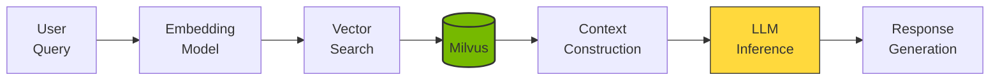
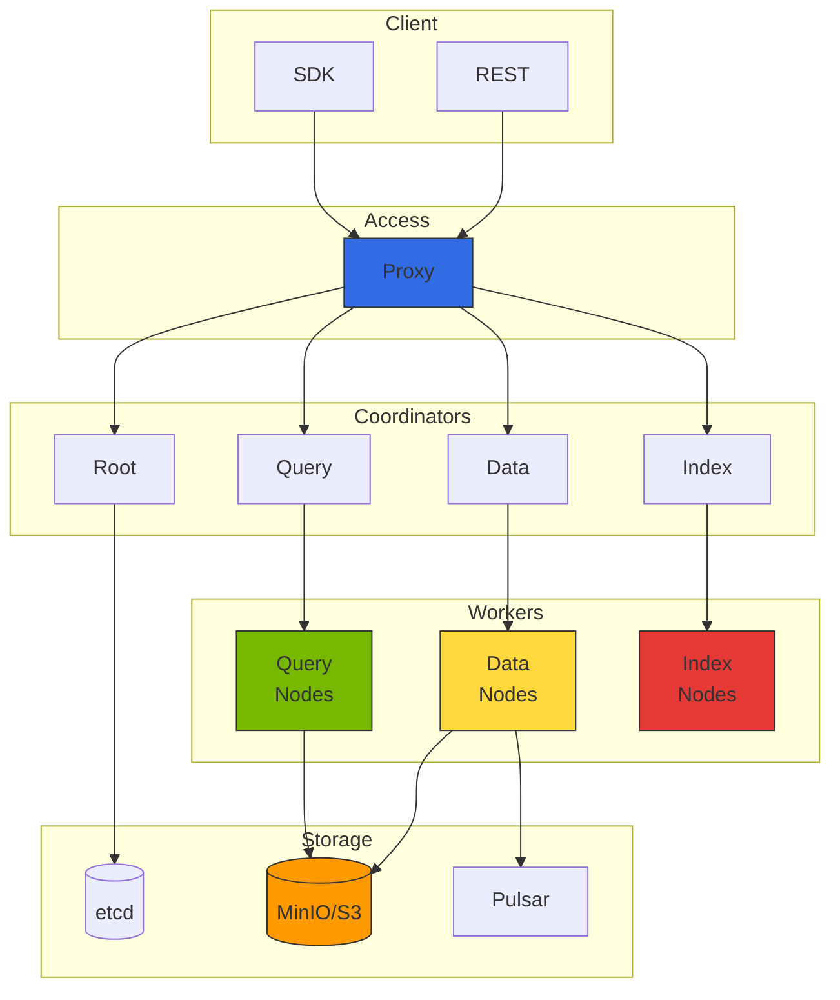

import {
  ComponentRolesTable,
  IndexComparisonTable,
  MonitoringMetricsTable,
  GPUInstanceTable,
  GPUIndexingPerformanceTable,
  StorageCostComparisonTable
} from '@site/src/components/MilvusTables';

Milvus v2.4.x is an open-source vector database for large-scale vector similarity search. It serves as a core component of RAG (Retrieval-Augmented Generation) pipelines in the Agentic AI Platform.

## 1. Overview

### Why Milvus Is Needed

In Agentic AI systems, vector databases perform the following roles:

- **Knowledge store**: Store documents, FAQs, product information as embedding vectors
- **Semantic search**: Search based on semantic similarity rather than keywords
- **Context provision**: Provide relevant information to LLMs to reduce hallucination
- **Long-term memory**: Store agent conversation history and learned content



## 2. Milvus Cluster Architecture

### Distributed Architecture Components



### Component Roles

<ComponentRolesTable />

## 3. EKS Deployment Guide

### Deployment Overview

Milvus can be deployed on EKS via Helm charts. For production environments, consider:

- **Cluster Mode**: Distributed architecture for high availability
- **etcd**: Metadata storage (minimum 3 replicas recommended)
- **Storage**: MinIO or Amazon S3/S3 Express One Zone
- **Message Queue**: Pulsar (event streaming)
- **Query/Data/Index Nodes**: Scale based on workload

**Recommended resource configuration:**
- Proxy: 2+ replicas, 1-2 CPU, 2-4Gi memory
- Query Node: 3+ replicas, 2-4 CPU, 8-16Gi memory
- Data Node: 2+ replicas, 1-2 CPU, 4-8Gi memory
- Index Node: 2+ replicas, 2-4 CPU, 8-16Gi memory

### Amazon S3 Integration

Using Amazon S3 directly instead of MinIO reduces operational burden. S3 Express One Zone provides faster performance and lower latency.

:::tip S3 Express One Zone Benefits

- **10x faster performance**: 10x faster data access vs standard S3
- **Consistent millisecond latency**: Single-digit millisecond latency
- **Cost efficiency**: 50% request cost reduction
- **Single AZ**: Optimal when used with compute resources in the same AZ

:::

**S3 Integration Considerations:**
- Use IRSA (IAM Roles for Service Accounts) for permission management
- S3 bucket policy: Requires GetObject, PutObject, DeleteObject, ListBucket permissions
- S3 Express One Zone: Single AZ limitation, recommended for high-performance requirements

:::info Detailed Deployment Guide
For Milvus deployment procedures, Helm values configuration, and S3 IAM policy examples, see [Milvus Official Helm Chart Documentation](https://milvus.io/docs/install_cluster-helm.md).
:::

## 4. Index Type Selection Guide

### Major Index Type Comparison

<IndexComparisonTable />

### SCANN Index (Milvus 2.4+)

Google's Scalable Nearest Neighbors (SCANN) index is a high-performance index added in Milvus 2.4:

```python
# Create SCANN index
index_params = {
    "metric_type": "COSINE",
    "index_type": "SCANN",
    "params": {
        "nlist": 1024,  # Number of clusters
        "with_raw_data": True,  # Store raw data
    }
}

collection.create_index(field_name="embedding", index_params=index_params)
collection.load()
```

**SCANN advantages:**
- Search speed similar to HNSW
- Higher accuracy than IVF family
- Lower memory usage than HNSW
- Excellent performance on large datasets

### Index Creation Example

```python
from pymilvus import Collection, CollectionSchema, FieldSchema, DataType

# Define collection schema
fields = [
    FieldSchema(name="id", dtype=DataType.INT64, is_primary=True, auto_id=True),
    FieldSchema(name="text", dtype=DataType.VARCHAR, max_length=65535),
    FieldSchema(name="embedding", dtype=DataType.FLOAT_VECTOR, dim=1536),
    FieldSchema(name="metadata", dtype=DataType.JSON),
]

schema = CollectionSchema(fields=fields, description="Document embeddings")
collection = Collection(name="documents", schema=schema)

# Create HNSW index (for high-performance search)
index_params = {
    "metric_type": "COSINE",
    "index_type": "HNSW",
    "params": {
        "M": 16,           # Graph connections (higher = more accurate, more memory)
        "efConstruction": 256  # Index build quality (higher = more accurate, longer build)
    }
}

collection.create_index(field_name="embedding", index_params=index_params)
collection.load()
```

## 5. LangChain/LlamaIndex Integration

### LangChain Integration Example

```python
from langchain_community.vectorstores import Milvus
from langchain_openai import OpenAIEmbeddings
from langchain.text_splitter import RecursiveCharacterTextSplitter
from langchain_community.document_loaders import DirectoryLoader

# Load and split documents
loader = DirectoryLoader("./documents", glob="**/*.md")
documents = loader.load()

text_splitter = RecursiveCharacterTextSplitter(
    chunk_size=1000,
    chunk_overlap=200,
    length_function=len,
)
splits = text_splitter.split_documents(documents)

# Configure embedding model
embeddings = OpenAIEmbeddings(model="text-embedding-3-small")

# Create Milvus vector store
vectorstore = Milvus.from_documents(
    documents=splits,
    embedding=embeddings,
    connection_args={
        "host": "milvus-proxy.ai-data.svc.cluster.local",
        "port": "19530",
    },
    collection_name="langchain_docs",
    drop_old=True,
)

# Similarity search
query = "How to schedule GPUs in Kubernetes"
docs = vectorstore.similarity_search(query, k=5)

for doc in docs:
    print(f"Content: {doc.page_content[:200]}...")
    print(f"Metadata: {doc.metadata}")
    print("---")
```

### LlamaIndex Integration Example

```python
from llama_index.core import VectorStoreIndex, SimpleDirectoryReader, Settings
from llama_index.vector_stores.milvus import MilvusVectorStore
from llama_index.embeddings.openai import OpenAIEmbedding

# Configure embedding model
Settings.embed_model = OpenAIEmbedding(model="text-embedding-3-small")

# Configure Milvus vector store
vector_store = MilvusVectorStore(
    uri="http://milvus-proxy.ai-data.svc.cluster.local:19530",
    collection_name="llamaindex_docs",
    dim=1536,
    overwrite=True,
)

# Load documents and index
documents = SimpleDirectoryReader("./documents").load_data()
index = VectorStoreIndex.from_documents(
    documents,
    vector_store=vector_store,
)

# Create query engine
query_engine = index.as_query_engine(similarity_top_k=5)

# Execute query
response = query_engine.query("Explain Agentic AI platform architecture")
print(response)
```

### Complete RAG Pipeline Configuration

```python
from langchain_openai import ChatOpenAI
from langchain.chains import RetrievalQA
from langchain.prompts import PromptTemplate

# Configure LLM
llm = ChatOpenAI(
    model="gpt-4o",
    temperature=0,
)

# Prompt template
prompt_template = """Use the following context to answer the question.
If the answer is not in the context, say "No information available."

Context:
{context}

Question: {question}

Answer:"""

PROMPT = PromptTemplate(
    template=prompt_template,
    input_variables=["context", "question"]
)

# Configure RAG chain
qa_chain = RetrievalQA.from_chain_type(
    llm=llm,
    chain_type="stuff",
    retriever=vectorstore.as_retriever(
        search_type="mmr",  # Maximum Marginal Relevance
        search_kwargs={"k": 5, "fetch_k": 10}
    ),
    chain_type_kwargs={"prompt": PROMPT},
    return_source_documents=True,
)

# Execute query
result = qa_chain.invoke({"query": "How to manage GPU resources?"})
print(f"Answer: {result['result']}")
print(f"Sources: {[doc.metadata for doc in result['source_documents']]}")
```

## 6. Query Optimization

### Search Parameter Tuning

```python
# Configure search parameters
search_params = {
    "metric_type": "COSINE",
    "params": {
        "ef": 128,  # HNSW search range (higher = more accurate, slower)
    }
}

# Search with filtering
results = collection.search(
    data=[query_embedding],
    anns_field="embedding",
    param=search_params,
    limit=10,
    expr='metadata["category"] == "kubernetes"',  # Metadata filter
    output_fields=["text", "metadata"],
)
```

### Hybrid Search (Vector + Keyword)

```python
from pymilvus import AnnSearchRequest, RRFRanker

# Vector search request
vector_search = AnnSearchRequest(
    data=[query_embedding],
    anns_field="embedding",
    param={"metric_type": "COSINE", "params": {"ef": 64}},
    limit=20
)

# BM25 score for keyword search (requires separate field)
# Supported in Milvus 2.4+

# Merge results with RRF (Reciprocal Rank Fusion)
results = collection.hybrid_search(
    reqs=[vector_search],
    ranker=RRFRanker(k=60),
    limit=10,
    output_fields=["text", "metadata"]
)
```

## 7. High Availability and Backup

### Data Backup Strategy

Milvus provides an official backup tool (`milvus-backup`) for backing up and restoring collection data.

**Backup considerations:**
- Backup target: Export collection data to MinIO/S3 bucket
- Backup frequency: Daily or weekly backup recommended
- Backup size limit: Control chunk size with `maxSegmentGroupSize` setting
- Restore strategy: Restore to same or different cluster

### Disaster Recovery Configuration

Production environments should implement disaster recovery strategy through cross-region replication.

**DR strategy:**
- **Cross-region S3 replication**: Automatically replicate backup data to another AWS region
- **Recovery Time Objective (RTO)**: S3 replication delay + Milvus cluster provisioning time
- **Recovery Point Objective (RPO)**: Determined by backup frequency (typically 6-24 hours)
- **Automation**: Periodic backup and synchronization using CronJob

:::info Detailed Backup Guide
For backup tool installation, configuration file creation, CronJob setup procedures, see [Milvus Backup and Restore Guide](https://milvus.io/docs/backup_and_restore.md).
:::

## 8. Monitoring and Metrics

### Prometheus Metrics Collection

Milvus provides Prometheus-format metrics at the `/metrics` endpoint. ServiceMonitor can be used to automatically collect metrics.

**Metrics collection configuration:**
- Endpoint: `/metrics` (default port 9091)
- Collection interval: 30 seconds recommended
- Label: Filter by `app.kubernetes.io/name: milvus`

### Key Monitoring Metrics

<MonitoringMetricsTable />

### Grafana Dashboard

**Recommended visualization panels:**
- Search Latency P99: `histogram_quantile(0.99, rate(milvus_proxy_search_latency_bucket[5m]))`
- Query Throughput: `sum(rate(milvus_proxy_search_vectors_count[5m]))`
- Memory Usage: `milvus_querynode_memory_used_bytes`
- Collection Size: `milvus_collection_num_entities`

:::info Detailed Monitoring Guide
For ServiceMonitor YAML, Grafana dashboard JSON, alarm rule configuration, see [Milvus Monitoring Guide](https://milvus.io/docs/monitor.md).
:::

---

## 9. Kubernetes Operator-based Deployment

### Milvus Operator Overview

**Operator advantages:**
- **Declarative management**: Define cluster configuration with Milvus CRD
- **Auto-scaling**: Component-level auto-scaling integrated with HPA
- **Rolling updates**: Zero-downtime upgrade support
- **Dependency management**: Automatic etcd, MinIO, Pulsar deployment

**Key component configuration:**
- Enable Cluster Mode
- etcd replica count (minimum 3 recommended)
- Storage backend (MinIO or S3)
- Enable Pulsar message queue
- Configure replica and resources per node type

### GPU Accelerated Indexing

Assigning GPUs to Index Nodes can significantly improve index build speed.

**GPU indexing configuration:**
- GPU resource request: `nvidia.com/gpu: 1`
- Specify GPU nodes with NodeSelector
- Handle GPU taints with Toleration

**Recommended GPU instances:**

<GPUInstanceTable />

**GPU Indexing Performance Comparison:**

<GPUIndexingPerformanceTable />

:::info Detailed Operator Guide
For Milvus Operator installation, CRD schema, GPU configuration examples, see [Milvus Operator Documentation](https://milvus.io/docs/install_cluster-milvusoperator.md).
:::

---

## References

### Official Documentation
- [Milvus Official Documentation](https://milvus.io/docs)
- [Milvus Helm Chart](https://milvus.io/docs/install_cluster-helm.md)
- [Milvus Backup and Restore](https://milvus.io/docs/backup_and_restore.md)
- [Milvus Monitoring](https://milvus.io/docs/monitor.md)
- [Milvus Operator](https://milvus.io/docs/install_cluster-milvusoperator.md)

### Related Documents

- [Agentic AI Platform Architecture](../../design-architecture/foundations/agentic-platform-architecture.md)
- [Agentic AI Technical Challenges](../../design-architecture/foundations/agentic-ai-challenges.md)
- [Ragas RAG Evaluation Framework](../governance/ragas-evaluation.md)
- [Agent Monitoring](../observability/agent-monitoring.md)

:::info Recommendations

- Operate at least 3 Query Nodes in production environments
- Consider DISKANN index for large datasets (100M+ vectors)
- Using S3 as storage significantly reduces operational complexity
- S3 Express One Zone provides 10x faster performance and 50% cheaper request costs
- GPU-accelerated indexing can significantly reduce build times (g5.xlarge recommended)
- Milvus v2.4.x provides advanced features including SCANN index, hybrid search, scalar filtering, and dynamic schema
- Use Helm chart version 4.1.x to deploy Milvus 2.4.x
:::

### Storage Cost Comparison

<StorageCostComparisonTable />

**Recommendations:**
- **Dev/Test**: MinIO (simple setup)
- **Production (general)**: S3 Standard (cost efficient)
- **Production (high-perf)**: S3 Express One Zone (10x faster performance)

:::warning Cautions

- Index builds are CPU/memory intensive; perform during off-peak hours
- Collection deletion permanently removes data; verify backups first
- GPU Index Nodes are costly; enable only when needed
- S3 Express One Zone is limited to a single AZ; consider HA requirements
:::
