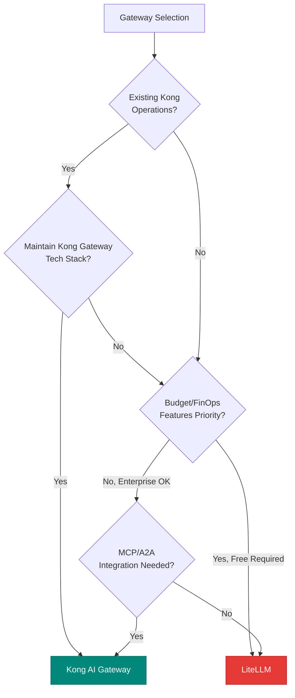
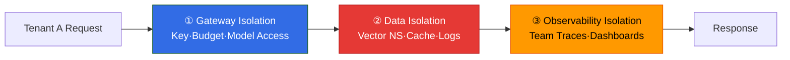

In enterprise LLM platforms, multi-tenancy is a core architecture that implements isolation and budget control per organization, team, and user. While sharing a single LLM infrastructure, it must ensure **cost accountability separation**, **data isolation**, and **policy differentiation**. This document covers two primary approaches for implementing multi-tenancy at the LLM Gateway level (LiteLLM / Kong) and the 3-tier isolation model.

:::info Document Location
- **This Document**: Gateway-level tenancy hierarchical model and isolation strategy
- [AI Gateway Guardrails](./ai-gateway-guardrails.md): Threat model, PII/Injection defense (security framework)
- [LLM FinOps Chargeback](./llm-finops-chargeback.md): Cost allocation and chargeback details (post-budget execution)
- [Inference Gateway Routing](../../model-serving/inference-routing/routing-strategy.md): L1/L2 Gateway architecture
:::

---

## 1. Background: Why Gateway-Level Multi-Tenancy Is Necessary

### Challenges of Shared Infrastructure

In large organizations, LLM platforms are shared by multiple organizations, teams, and projects using a **single inference infrastructure**. This requires solving the following problems:

| Challenge | Gateway Multi-Tenancy Solution |
|---------|---------------------------|
| **Budget Explosion**: One team's excessive usage exhausts entire budget | Team-level hard limit budgets, block on exceed |
| **Data Leak**: Tenant A's prompts exposed to Tenant B | Cache/log namespace separation, vector DB isolation |
| **Noisy Neighbor**: One user's bulk requests cause latency for others | Rate Limiting (QPM/TPM), priority queues |
| **Policy Differentiation**: Finance team needs strict Guardrails, research team relaxed | Tenant-specific policy profiles |

### Benefits of Gateway-Level Isolation

Implementing multi-tenancy at the **application level** requires each app to independently implement budgets and policies. Elevating to the **Gateway level** provides the following benefits:

- **Centralized Control**: Enforce budget, rate limits, and guardrails at a single point
- **Unified Audit Trail**: Record all tenant LLM calls in a single audit log
- **Cost Transparency**: Provide real-time token usage and costs per tenant via dashboard
- **Policy Consistency**: All apps within the same organization comply with identical security and regulatory policies

---

## 2. LiteLLM Tenancy Model

LiteLLM Proxy supports **hierarchical budget and rate limit configuration**, enabling cost control at organization, team, user, and key levels.

### Hierarchical Structure and Budget Policies

LiteLLM allows setting budgets and rate limits at the following levels:

| Level | Configuration Target | Budget/Limit Scope | Example |
|------|----------|-------------------|------|
| **Global (Global Proxy)** | Entire proxy | All requests | $50,000 monthly cap |
| **Team** | Team unit | All keys belonging to team | Engineering team $10,000 |
| **User (Internal User)** | User unit | All keys owned by user | alice@example.com $1,000 |
| **Virtual Key** | Individual API key | That key only | `sk-proj-abc123` $100 |

:::info Hierarchical Budget Priority
LiteLLM official documentation states that when a key belongs to a team, **the team budget is applied and the user's personal budget is not applied**. Hierarchical budget enforcement (upper levels capping lower levels) is not explicitly described with terms like "inward enforcement" in the documentation, but hierarchical control is possible through `max_budget` upper bound settings during key generation (`upperbound_key_generate_params`) and team/user expenditure tracking.
:::

### Cost Tracking Mechanism

LiteLLM tracks costs as follows:

- **Key-level expenditure**: Token usage and costs automatically recorded in `LiteLLM_VerificationToken` table
- **User-level aggregation**: Keys linked to users during creation → summed into user expenditure
- **Team-level aggregation**: Expenditure of team member keys aggregated into team total
- **Reset period**: `budget_duration` allows daily, weekly, or monthly reset configuration

Asynchronous logging processes outside the request path minimize latency impact.

### Rate Limiting Strategy

LiteLLM supports the following rate limits:

- **QPM (Queries Per Minute)**: Limit requests per minute
- **TPM (Tokens Per Minute)**: Limit tokens per minute (input + output sum)
- **RPM (Requests Per Minute)**: Limit API calls per minute

Budget validation is performed by reading current expenditure from Redis cross-pod counters. The `fail_closed_budget_enforcement: true` option enables **fail-closed** behavior that rejects requests with 503 when expenditure cannot be verified from Redis/DB (not the default, requires explicit configuration).

---

## 3. Kong AI Gateway Tenancy Model

Kong AI Gateway implements multi-tenancy through **Consumer/Consumer Group** based policies, with token-aware Rate Limiting strengthening cost control.

### Consumer-Based Policies

Kong's multi-tenancy consists of the following entities:

| Entity | Role | Policy Application Scope |
|--------|------|---------------|
| **Consumer** | Individual clients identified by API keys or JWT | Consumer-level rate limit, ACL |
| **Consumer Group** | Logical group bundling Consumers | Group-level policies (e.g., Premium vs Free tier) |

Kong's **AI Rate Limiting Advanced plugin** can define policies along the following dimensions:

- Consumer / Consumer Group
- IP address
- HTTP headers
- Path
- Model (e.g., `gpt-4o`, `claude-opus-5`)
- Provider (e.g., OpenAI, Anthropic)

Match conditions can be combined with **AND logic**, enabling multi-dimensional control like "specific Consumer + `gpt-4o` model."

### Token-Aware Rate Limiting

Kong's most powerful feature is **token-level Rate Limiting**. Traditional request count (QPM) limits are inaccurate in LLM environments where each request has different costs. Kong supports four token counting strategies:

| Strategy | Calculation Basis | Use Case |
|------|----------|----------|
| `total_tokens` | Prompt + completion token sum | General throughput control |
| `prompt_tokens` | Input tokens only | Input size-based limiting |
| `completion_tokens` | Generated tokens only | Output cost control |
| `cost` | (input tokens × input price + output tokens × output price) / 1M | Real dollar cost-based limiting |

:::warning Token Cost Reflected in Next Request
Since the LLM must generate a response to know the token count, token costs are reflected in the **next request**. That is, a request that already exceeded the budget completes, and the following request is blocked. This is a fundamental constraint of all token-aware Rate Limiting.
:::

### Fundamental Differences Between Kong and LiteLLM

| Item | LiteLLM | Kong AI Gateway |
|------|---------|-----------------|
| **Architecture** | LLM proxy (100+ provider integration) | API Gateway + AI plugins |
| **Tenancy Unit** | Organization·Team·User·Key hierarchy | Consumer·Consumer Group |
| **Cost Tracking** | Included in free OSS core | Basic rate limit free, advanced AI features Enterprise/Konnect only |
| **Token-Aware Limiting** | TPM (tokens per minute) | 4 strategies based on token count/cost |
| **Deployment Form** | Python-based, self-host or Cloud | Lua/C-based, self-host or Konnect SaaS |
| **Existing Infrastructure** | LLM-centric new builds | Organizations operating existing Kong, official support for LLM·MCP·A2A traffic gateway |

---

## 4. Selection Criteria: LiteLLM vs Kong (Either/Or) {#4-selection-criteria-litellm-vs-kong}

:::danger Kong + LiteLLM Combined Architecture Prohibited
These two solutions are **either/or choices**. Combined architectures like "Kong in front, LiteLLM in back" have no validated references and are **absolutely prohibited from documentation**. Select one and configure as a single Gateway.
:::

### Selection Decision Tree



### Selection Criteria Table

| Condition | Recommendation | Reason |
|------|------|------|
| **Existing Kong operations** | Kong AI Gateway | Reuse existing infrastructure and operational knowledge, supports LLM·MCP·A2A traffic gateway |
| **OSS-first, free FinOps** | LiteLLM | Budget and cost tracking included in free core, 100+ provider integration |
| **Enterprise, advanced AI plugins** | Kong Enterprise/Konnect | Token-based rate limiting, AI Proxy Advanced when needed |
| **Python ecosystem** | LiteLLM | Direct LangChain/LlamaIndex integration, rapid prototyping |
| **High performance, low memory** | Kong | Lua/C-based, large-scale traffic handling |

### Migration Cost Considerations

Both solutions are **self-hostable**, so the cost of migrating from initial selection to another solution is at the **configuration work level**. Vendor lock-in risk is low. However, the following items require rework:

- API key scheme (LiteLLM virtual key ↔ Kong Consumer mapping)
- Policy configuration migration (YAML ↔ Kong declarative config)
- Dashboard and monitoring stack reconfiguration

---

## 5. 3-Tier Isolation Model

Multi-tenancy is insufficient with **gateway isolation** alone. Data and observability must also be isolated to ensure complete tenant separation.

### Isolation Layers



### ① Gateway Isolation

| Isolation Target | LiteLLM Implementation | Kong Implementation |
|----------|-------------|----------|
| **Authentication** | Virtual Key issuance and validation | Consumer API Key or JWT |
| **Budget Blocking** | Reject requests exceeding `max_budget` (budget_exceeded error) | 429 on exceeding `cost` rate limit |
| **Model Access Control** | Allowed model list per key | Consumer ACL + model policy |
| **Rate Limiting** | QPM and TPM limits | 4 strategies based on token count/cost |

### ② Data Isolation

**Vector DB Namespace Separation**: Vector DBs (Milvus, Qdrant, Redis) used in RAG or Semantic Cache must be separated by tenant namespace.

```python
# pseudo-code: Milvus per-tenant collections
collection_name = f"embeddings_{tenant_id}"
milvus_client.create_collection(collection_name)
```

**Cache Key Namespace**: Semantic Cache keys must include `tenant_id` as a prefix. For detailed design, see [Semantic Caching Strategy — Cache Key Design and Multi-Tenancy](../../model-serving/inference-optimization/semantic-caching-strategy.md#5-cache-key-design-and-multi-tenancy).

```python
# pseudo-code: Redis cache key namespace
cache_key = f"cache:{tenant_id}:{language}:{embedding_hash}"
```

**Row-level Isolation**: When storing prompt/response logs in relational DBs (PostgreSQL, etc.), enforce tenant isolation with **Row-level Security (RLS)**.

### ③ Observability Isolation

**Team-level Trace Routing**: Separate traces per tenant in Langfuse or LangSmith so one team cannot view another team's prompts and responses.

```python
# pseudo-code: Langfuse per-tenant projects
langfuse_context.update_current_observation(
    metadata={"tenant_id": tenant_id, "team": team_name}
)
```

**Dashboard Permissions**: Grafana and CloudWatch dashboards provide team-filtered views. Separate metrics by `tenant_id` label, and control dashboard permissions through IAM or Grafana organization units.

---

## 6. Budget Policy Matrix

How to respond when tenants exceed budgets is a **policy choice**. Various strategies can be combined, including hard blocking, soft alerts, and model downgrading.

### Policy Patterns

| Policy | Behavior | Use Case | Implementation |
|------|------|----------|------|
| **Hard Block** | Immediately return 403/429 on budget exceed | Strict cost control, internal departmental budgets | Gateway blocks when `max_budget` reached |
| **Soft Alert** | Warning email at 80% budget, continue allowing on exceed | Research teams, prototyping, post-billing | CloudWatch Alarm + SNS |
| **Fallback (Downgrade)** | Automatically switch to lower-cost model on budget exceed | Internal tools with low SLA, FAQ chatbots | Gateway Cascade Routing policy |
| **Throttling** | Reduce QPM by half after budget exceed | Gradual limiting, avoid complete blocking | Dynamic Rate Limit adjustment |

:::tip Fallback Strategy and Cascade Routing
"Downgrade to lower-cost model on budget exceed" is implemented with the Budget-based Routing pattern in [Request Cascading — Intelligent Model Routing](../../model-serving/inference-routing/request-cascading.md). Example: Automatically fall back to `gpt-4o-mini` or self-hosted vLLM when Premium model (`gpt-4o`) budget is exhausted.
:::

### Detailed Metering and Chargeback

The **back-end** of budget policies (billing and allocation after budget execution) is covered in a separate document. For team cost allocation, inter-department chargeback, AWS Cost Allocation Tags integration, etc., refer to [LLM FinOps Chargeback](./llm-finops-chargeback.md).

---

## 7. Practical Checklist

### Gateway Configuration

- [ ] Issue virtual keys or Consumers per tenant
- [ ] Configure team, user, and key hierarchical budgets and rate limits
- [ ] Decide budget exceed policy (hard block / soft alert / fallback)
- [ ] Enable token-aware rate limiting (for Kong)

### Data Isolation

- [ ] Separate vector DB namespaces by `tenant_id`
- [ ] Include `tenant_id` prefix in Semantic Cache keys
- [ ] Enable Row-level Security (RLS) (PostgreSQL, etc.)
- [ ] Write unit tests for cross-tenant data access

### Observability and Audit

- [ ] Tag Langfuse traces with `tenant_id`
- [ ] Configure team-level dashboard filters (Grafana `tenant_id` label)
- [ ] SNS and email alerts at 80% budget threshold
- [ ] Retain audit logs for minimum 90 days (tenant costs and usage)

### Security

- [ ] Enforce Virtual Key or Consumer authentication (prohibit anonymous access)
- [ ] Redact PII-containing prompts with Guardrails before logging
- [ ] Prohibit key sharing between tenants (document policy)

---

## References

### Official Documentation

- [LiteLLM — Virtual Keys](https://docs.litellm.ai/docs/proxy/virtual_keys) — Virtual Key issuance and expenditure tracking
- [LiteLLM — Budgets, Rate Limits](https://docs.litellm.ai/docs/proxy/users) — Hierarchical budget and rate limit configuration
- [Kong AI Rate Limiting Advanced](https://developer.konghq.com/plugins/ai-rate-limiting-advanced/) — Consumer/Consumer Group-based token-aware Rate Limiting
- [Kong AI Gateway](https://developer.konghq.com/ai-gateway/) — Kong AI Gateway official documentation

### Related Documentation (Internal)

- [AI Gateway Guardrails](./ai-gateway-guardrails.md) — PII and Injection defense, threat model
- [LLM FinOps Chargeback](./llm-finops-chargeback.md) — Token metering and showback/chargeback methodology
- [Inference Gateway Routing Strategy](../../model-serving/inference-routing/routing-strategy.md) — L1/L2 Gateway architecture, LiteLLM and Kong comparison
- [Semantic Caching Strategy](../../model-serving/inference-optimization/semantic-caching-strategy.md) — Tenant cache key namespace design
