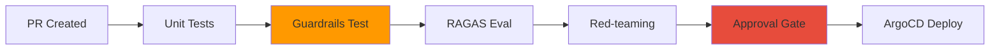
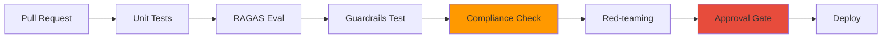

Provides compliance frameworks and practical mapping guides that must be followed when operating AI platforms in enterprise environments.

## Why AI Compliance Is Needed

### Traditional IT Compliance vs AI Operations Compliance

:::info Key Difference
Traditional IT compliance deals with **static systems**, while AI compliance deals with **non-deterministic, learning systems**.
:::

| Area | Traditional IT Compliance | AI Operations Compliance |
|------|--------------------------|-------------------------|
| **Predictability** | Code → Same input = Same output | Model → Same input may produce varying outputs |
| **Access Control** | DB/API level | Model API + Prompt + Output filtering |
| **Audit Trail** | Transaction logs | Inference traces + Token usage |
| **Change Management** | Code deployment | Model version + LoRA adapter + Playbook |
| **Incident Response** | Rollback + Hotfix | Model swap + Guardrails hardening |

### AI-Specific Risks

:::caution AI-Specific Compliance Risks
- **Hallucination**: Model generates factually incorrect information
- **Prompt Injection**: Malicious input manipulates model behavior
- **PII Exposure**: Personal information leaked from training data
- **Model Bias**: Discriminatory outputs against specific groups
- **Token Abuse**: Cost explosion and resource exhaustion
:::

These risks must be mapped to existing compliance frameworks to establish **actionable controls**.

---

## SOC2 Trust Criteria ↔ AI Operations Mapping

SOC2 (Service Organization Control 2) is a global standard for verifying cloud service security, availability, and confidentiality.

### SOC2 Control Mapping Table

| SOC2 Control | Trust Criteria | AI Operations Implementation | Technology Stack |
|-------------|----------------|---------------------------|-----------------|
| **CC6.1-6.8** | Logical/Physical access control | Model API auth + Data access control | **Pod Identity + RBAC + API Key** |
| **CC7.1-7.4** | System monitoring | Inference request tracking + GPU resource monitoring | **LLM Tracing + AMP/AMG + DCGM** |
| **CC7.3** | Anomaly detection and incident response | Automatic alerts + Playbook rollback | **PagerDuty + ArgoCD** |
| **CC8.1** | Change management | Playbook version control + Approval gates | **GitOps + Approval Gate** |

### CC6: Access Control Implementation Example

```yaml
# EKS Pod Identity + RBAC-based model API access control
apiVersion: v1
kind: ServiceAccount
metadata:
  name: model-api-sa
  annotations:
    eks.amazonaws.com/role-arn: arn:aws:iam::123456789012:role/ModelAPIAccessRole
---
apiVersion: rbac.authorization.k8s.io/v1
kind: Role
metadata:
  name: model-reader
rules:
- apiGroups: ["serving.kserve.io"]
  resources: ["inferenceservices"]
  verbs: ["get", "list"]
---
apiVersion: rbac.authorization.k8s.io/v1
kind: RoleBinding
metadata:
  name: model-reader-binding
subjects:
- kind: ServiceAccount
  name: model-api-sa
roleRef:
  kind: Role
  name: model-reader
  apiGroup: rbac.authorization.k8s.io
```

:::tip CC7.1-7.4 Implementation: LLM Tracing
Record all inference requests as auditable traces. For implementation methods, see [Agent Monitoring](../observability/agent-monitoring.md) and [LLM Tracing Deployment](../../reference-architecture/integrations/monitoring-observability-setup.md).
:::

---

## ISO27001 Annex A ↔ AI Operations Mapping

ISO27001 is the international standard for Information Security Management Systems (ISMS). Annex A defines 114 control items.

### ISO27001 Control Mapping Table

| Annex A | Control Area | AI Operations Implementation | Technology Stack |
|---------|-------------|---------------------------|-----------------|
| **A.8** | Asset management | Model registry + LoRA adapter management | **ECR + MLflow Model Registry** |
| **A.9** | Access control | API Key management + RBAC + Multi-tenant isolation | **kgateway + Pod Identity** |
| **A.12** | Operational security | Logging + Monitoring + Backup | **CloudTrail + AMP/AMG + S3** |
| **A.14** | System development security | Playbook CI/CD + Automated code review | **ArgoCD + Guardrails API** |
| **A.16** | Information security incident management | Automatic detection + Automatic response | **Alerts + Playbook rollback** |
| **A.17** | Business continuity | Multi-AZ deployment + Autoscaling | **EKS + Karpenter** |

### A.14 Implementation: Playbook CI/CD Pipeline



:::warning A.16 Incident Management: Auto-Rollback Example
```yaml
apiVersion: argoproj.io/v1alpha1
kind: Rollout
metadata:
  name: inference-api
spec:
  strategy:
    canary:
      analysis:
        templates:
        - templateName: hallucination-check
        args:
        - name: threshold
          value: "0.05"  # Auto-rollback if hallucination rate > 5%
```
:::

---

## Financial Regulation Mapping

### Electronic Financial Supervisory Regulation (전자금융감독규정) Mapping

| Article | Content | AI Operations Mapping | Implementation |
|---------|---------|----------------------|---------------|
| **Article 15** | Access control and authorization management | Model API authentication + Audit logs | **API Key + CloudTrail** |
| **Article 17** | Electronic financial transaction data encryption | Data encryption + TLS | **KMS + ALB TLS** |
| **Article 34** | Transaction and transfer limit settings | Token usage limits + Rate Limiting | **kgateway rate-limit** |

#### Article 34 Implementation: Token Usage Limits

```yaml
apiVersion: gateway.solo.io/v1
kind: RateLimitConfig
metadata:
  name: token-limit
spec:
  rateLimits:
  - actions:
    - genericKey:
        descriptorValue: "token-usage"
    limit:
      requestsPerUnit: 100000  # 100K tokens/hour
      unit: HOUR
```

### ISMS-P (Korean Personal Information & Information Security Management System) Mapping

| Item | Requirement | AI Operations Mapping | Implementation |
|------|-----------|----------------------|---------------|
| **2.6** | Access control | API Key + RBAC + Multi-factor authentication | **Pod Identity + MFA** |
| **2.9** | System and service development security | Playbook version control + Guardrails | **Git + [Guardrails Stack](./ai-gateway-guardrails.md)** |
| **2.11** | Information security incident management | Automatic incident detection and response | **Alerts + Auto rollback** |

:::caution ISMS-P Related: PII Detection and Blocking
PII detection/blocking through Guardrails is a technical control that satisfies ISMS-P personal information processing and access control requirements.

**For technical implementation, refer to [AI Gateway Guardrails](./ai-gateway-guardrails.md)** — provides implementation patterns and kgateway/Bifrost integration examples including Microsoft Presidio Korean recognizer, Bedrock Guardrails ApplyGuardrail API, and Guardrails AI `DetectPII` validator.
:::

---

## Automated Verification CI/CD Pipeline



### Pipeline Stage Description

| Stage | Purpose | Tool | Action on Failure |
|-------|---------|------|-------------|
| **Unit Tests** | Verify functional integrity | pytest | Block PR |
| **RAGAS Eval** | Verify RAG accuracy | RAGAS | Block PR if below threshold |
| **Guardrails Test** | Verify PII, hallucination, bias | Guardrails AI | Immediate failure |
| **Compliance Check** | Verify SOC2/ISO27001 controls | Custom script | Notify audit team |
| **Red-teaming** | Test adversarial prompts | Garak | Escalate to security team |
| **Approval Gate** | Manual approval | GitHub Actions | Wait for approval |

:::tip Compliance Check Automation Example
```python
def check_compliance(playbook_path):
    """SOC2 CC8.1: Change management control"""
    # 1. Verify approvers
    approvers = get_pr_approvers()
    if len(approvers) < 2:
        raise Exception("Requires at least 2 approvers (SOC2 CC8.1)")
    
    # 2. Analyze change impact
    affected_models = analyze_affected_models(playbook_path)
    if "production" in affected_models:
        notify_audit_team(playbook_path)
    
    # 3. Record audit log
    log_to_cloudtrail(playbook_path, approvers)
```
:::

---

## Audit Data Retention Policy

### Per-Data-Classification Retention Criteria

| Data | Storage Location | Retention Period | Access Authority | Legal Basis |
|------|-----------------|-----------------|-----------------|------------|
| **Inference traces** | LLM Tracing + S3 | 3 years | Audit team, DevOps | ISO27001 A.12.4 |
| **API call logs** | CloudTrail + S3 | 5 years | Security team, Audit team | Electronic Financial Supervisory Regulation (전자금융감독규정) Article 19 |
| **Model change history** | Git + ECR | Permanent | DevOps, ML team | SOC2 CC8.1 |
| **GPU metrics** | AMP + S3 | 1 year | Operations team | Internal policy |
| **PII detection logs** | CloudWatch + S3 | 3 years | Security team, Compliance team | ISMS-P 2.11 |

### S3 Lifecycle Policy Example

```json
{
  "Rules": [
    {
      "Id": "inference-trace-lifecycle",
      "Status": "Enabled",
      "Transitions": [
        {
          "Days": 90,
          "StorageClass": "STANDARD_IA"
        },
        {
          "Days": 365,
          "StorageClass": "GLACIER"
        }
      ],
      "Expiration": {
        "Days": 1095
      }
    }
  ]
}
```

:::warning Ensuring Audit Data Integrity
- **S3 Object Lock**: Prevent deletion (WORM mode)
- **CloudTrail Validation**: Verify tampering with `aws cloudtrail validate-logs`
- **Immutable Trace**: Traces in LLM tracing systems are immutable after creation (e.g., Langfuse)
:::

---

## Practical Checklists

### SOC2 Audit Preparation

- [ ] CC6.1-6.8: Pod Identity + RBAC configuration complete
- [ ] CC7.1-7.4: LLM Tracing + AMP/AMG monitoring built
- [ ] CC7.3: PagerDuty alerts + Auto rollback configured
- [ ] CC8.1: GitOps + Approval Gate applied

### ISO27001 Certification Preparation

- [ ] A.8: MLflow Model Registry built
- [ ] A.9: kgateway + API Key management system
- [ ] A.12: CloudTrail + S3 audit log retention
- [ ] A.14: CI/CD pipeline automated verification
- [ ] A.16: Incident response Playbook created
- [ ] A.17: Multi-AZ + Karpenter autoscaling

### Financial Regulation Compliance

- [ ] Electronic Financial Supervisory Regulation (전자금융감독규정) Article 15: API access control
- [ ] Electronic Financial Supervisory Regulation (전자금융감독규정) Article 17: TLS + KMS encryption
- [ ] Electronic Financial Supervisory Regulation (전자금융감독규정) Article 34: Rate Limiting
- [ ] ISMS-P 2.6: MFA applied
- [ ] ISMS-P 2.9: Guardrails API integration
- [ ] ISMS-P 2.11: Automated incident response

---

## References

- [SOC2 Trust Services Criteria](https://www.aicpa-cima.com/resources/landing/trust-services-criteria)
- [ISO/IEC 27001:2022](https://www.iso.org/standard/82875.html)
- [Electronic Financial Supervisory Regulations (FSC)](https://www.law.go.kr/)
- [ISMS-P Certification Standards (KISA)](https://isms.kisa.or.kr/)
- [Agent Monitoring Architecture](../observability/agent-monitoring.md)
- [LLMOps Observability Comparison](../observability/llmops-observability.md)
- [AI Gateway Guardrails](./ai-gateway-guardrails.md) — Technical implementation details (PII, Injection defense, tool comparison)
- [Guardrails AI Security](https://docs.guardrailsai.com/concepts/security/)
