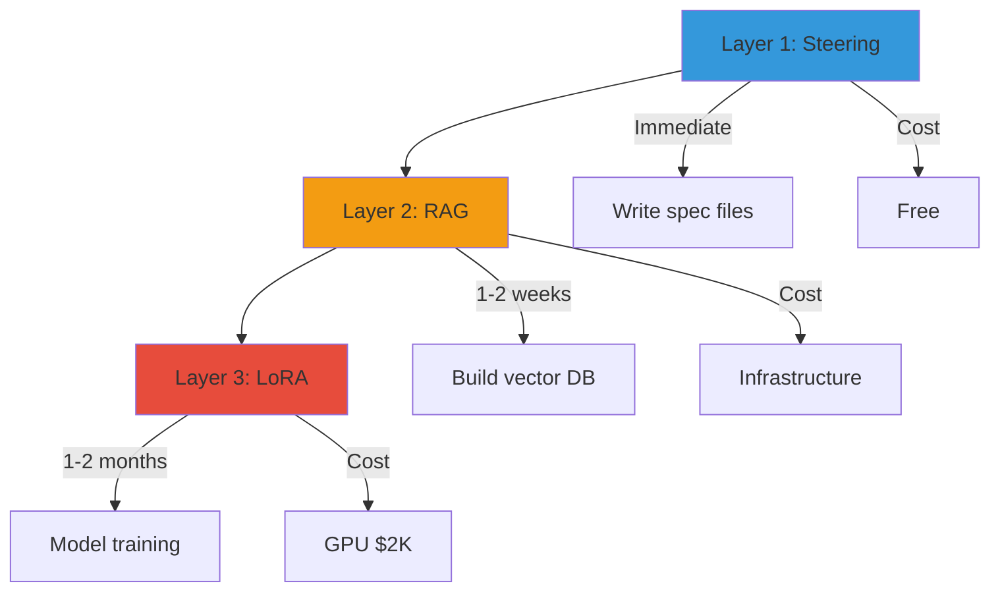
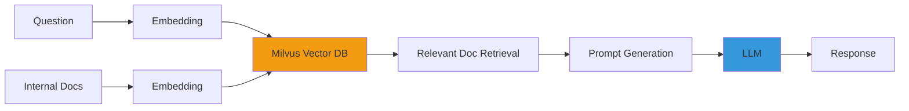
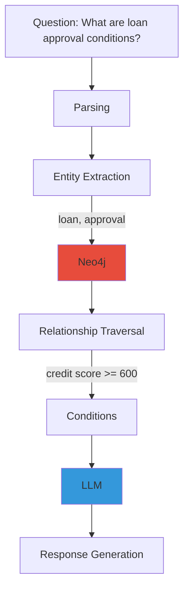

# Domain Specialization (LoRA + RAG)

Provides a 3-stage strategy for **optimizing general-purpose LLMs for specific domains** such as finance, telecommunications, and manufacturing to dramatically improve coding quality.

:::tip Core Question
"Why doesn't code generated by Claude or GPT follow our company standards?"
→ **Because the model hasn't learned your domain knowledge.**
:::

---

## 3-Layer Details

Domain specialization is applied progressively: **Steering → RAG → LoRA**.

### Layer 1: Steering (Immediate)

**Definition**: Explicitly define coding rules in spec files to instruct the LLM.

**Pros**: Immediately applicable, zero cost, easy maintenance (just edit spec files)
**Cons**: Limited for complex domain logic, context window waste

### Layer 2: RAG (1-2 weeks)

**Definition**: Embed internal documents in a vector DB for real-time retrieval, including relevant information in prompts.

**Pros**: Auto-reflects latest documents (no retraining), high accuracy for internal API specs, no model weight changes
**Cons**: Infrastructure required (Milvus, Neo4j), retrieval quality directly impacts output quality

### Layer 3: LoRA (1-2 months)

**Definition**: Adjust model weights with domain data to generate **domain expert-level** output.

**Pros**: Consistent code style, highest domain terminology accuracy, complex pattern learning
**Cons**: GPU training cost ($2,000), training data collection required

For detailed QLoRA training, NeMo/Unsloth frameworks, and checkpoint management, see the [Custom Model Pipeline Guide](../../reference-architecture/model-lifecycle/custom-model-pipeline.md#2-lora-fine-tuning-pipeline).

---

## Per-Scenario Required Layers

| Requirement | Layer 1 (Steering) | Layer 2 (RAG) | Layer 3 (LoRA) | Recommended Combination |
|------------|-------------------|--------------|---------------|------------------------|
| **Coding conventions** | Sufficient | Excessive | Unnecessary | **Layer 1** |
| **Internal API usage** | Insufficient | Required | Unnecessary | **Layer 1 + 2** |
| **Domain terminology** | Limited | Supplementary | Required | **Layer 2 + 3** |
| **SOC2 procedures** | Playbook sufficient | Unnecessary | Unnecessary | **Layer 1** |
| **Consistent code style** | Basic only | Supplementary | Most effective | **Layer 1 + 3** |
| **Legacy migration patterns** | Impossible | Example provision | Core | **Layer 2 + 3** |

:::tip Cost vs Effect
- **Layer 1 only**: Free, 60% improvement
- **Layer 1 + 2**: Infrastructure cost, 80% improvement
- **Layer 1 + 2 + 3**: $2,000, **95% improvement**
:::

---

## VectorRAG Configuration

VectorRAG is a **document retrieval-based** domain specialization approach.

### Architecture

## GraphRAG Configuration

GraphRAG is a **knowledge graph-based** domain specialization approach. It explicitly models **relationships** of domain terminology and regulations.

### Architecture

### VectorRAG + GraphRAG Hybrid

**Advantages**:
- VectorRAG: Reflects latest documents
- GraphRAG: Complex rule reasoning
- Hybrid: **Accuracy + Flexibility**

---

## FSI SI Production Scenarios

### Scenario 1: COBOL → Java Legacy Migration

#### Per-Layer Effect Comparison

| Approach | Accuracy | Consistency | Cost | Notes |
|----------|----------|-------------|------|-------|
| **Steering only** | 60% | Low | Free | Syntax correct but financial logic errors |
| **+ RAG** | 80% | Medium | Infrastructure | Improved accuracy, inconsistent patterns |
| **+ LoRA** | **95%** | **High** | **$2,000** | **Consistent patterns + financial logic** |

#### ROI Analysis

**Assumptions**: 10,000 modules to migrate, developer hourly rate: $50/hr

| Method | Time/Module | Total Time | Total Cost | Notes |
|--------|-----------|------------|------------|-------|
| **Manual** | 2 hours | 20,000 hrs | $1,000,000 | - |
| **LLM (Steering+RAG)** | 1 hour | 10,000 hrs | $500,000 | **Savings: $500,000** |
| **LLM (+ LoRA)** | 30 min | 5,000 hrs | $252,000 | **Savings: $748,000** |

**ROI**: LoRA training cost: $2,000 / Savings: $748,000 = **374x ROI**

### Scenario 2: Internal Framework Code Generation

In SI environments using proprietary frameworks (Samsung SDS Devon, LG CNS Anyframe, etc.), general-purpose LLMs cannot generate accurate code.

### Scenario 3: Regulatory Compliance Code Auto-Generation

Automatically reflects financial regulations into code.

### Scenario 4: Multi-Customer Operations

When an SI company **operates multiple customers on the same platform**, per-customer LoRA adapters are hot-swapped.

---

## Phase-by-Phase Adoption Roadmap

| Phase | Duration | Configuration | Effect | Cost |
|-------|----------|--------------|--------|------|
| **1** | Immediate | Steering + Playbook | Compliance + Basic quality | Free |
| **2** | 1-2 weeks | + VectorRAG (Milvus) | Internal knowledge accuracy improvement | Infrastructure |
| **3** | 2-4 weeks | + SLM Cascade | Cost optimization (70% savings) | +$500/month |
| **4** | 1-2 months | + LoRA Fine-tuning | Domain expertise + Style consistency | GPU $2K |

For detailed per-phase implementation guides, see the [Custom Model Pipeline Guide](../../reference-architecture/model-lifecycle/custom-model-pipeline.md#6-phase-by-phase-roadmap).

---

## References

- [LoRA Paper (Hu et al., 2021)](https://arxiv.org/abs/2106.09685)
- [QLoRA Paper (Dettmers et al., 2023)](https://arxiv.org/abs/2305.14314)
- [vLLM Multi-LoRA](https://docs.vllm.ai/en/latest/models/lora.html)
- [Langchain RAG Tutorial](https://python.langchain.com/docs/tutorials/rag/)
- [Neo4j GraphRAG](https://neo4j.com/labs/genai-ecosystem/langchain/)
- [RAGAS Evaluation](https://docs.ragas.io/)
- [Unsloth Fast Training](https://github.com/unslothai/unsloth)
- [NeMo Framework](https://docs.nvidia.com/nemo-framework/user-guide/latest/)
