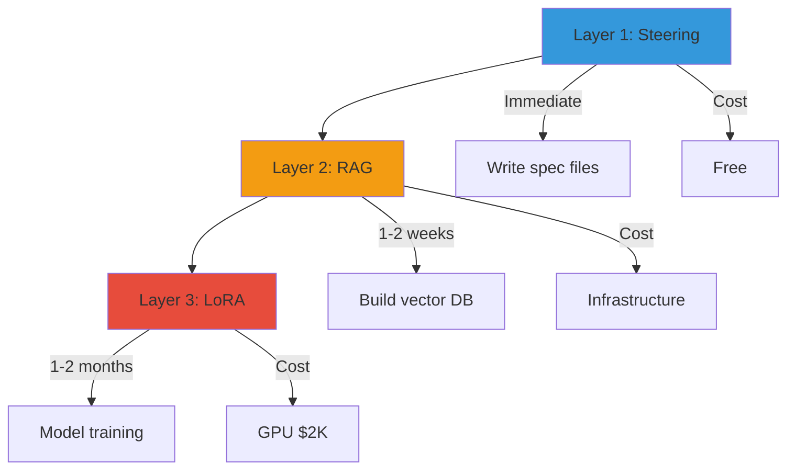
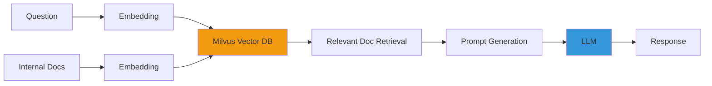
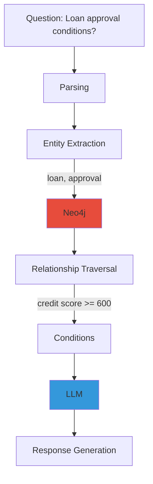
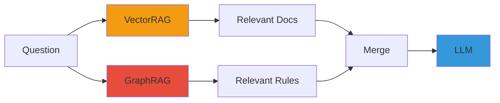

Provides a 3-stage strategy for **optimizing general-purpose LLMs for specific domains** such as finance, telecommunications, and manufacturing to dramatically improve coding quality.

:::tip Core Question
"Why doesn't code generated by Claude or GPT follow our company standards?"
→ **Because the model hasn't learned your domain knowledge.**
:::

---

## 3-Layer Strategy

Domain specialization is applied progressively: **Steering → RAG → LoRA**.



### Layer 1: Steering (Immediate)

**Definition**: Explicitly define coding rules in spec files to instruct the LLM.

**Pros**:
- Immediately applicable
- Zero cost
- Easy maintenance (just edit spec files)

**Cons**:
- Limited for complex domain logic
- Context window waste

**Example**:
```markdown
# coding-standards.md

## Coding Conventions
- Class names: PascalCase
- Method names: camelCase
- Constants: UPPER_SNAKE_CASE

## Transaction Handling
- All DB operations must use @Transactional
- Rollback condition: on RuntimeException

## Logging Standards
- Entry point: log.info("Method {} started", methodName)
- Exceptions: log.error("Error in {}: {}", methodName, e.getMessage())
```

### Layer 2: RAG (1-2 weeks)

**Definition**: Embed internal documents in a vector DB for real-time retrieval, including relevant information in prompts.

**Pros**:
- Auto-reflects latest documents (no retraining)
- High accuracy for internal API specs
- No model weight changes

**Cons**:
- Infrastructure required (Milvus, Neo4j)
- Retrieval quality directly impacts output quality
- Embedding costs

**Example**:
```python
from langchain.vectorstores import Milvus
from langchain.embeddings import OpenAIEmbeddings

# 1. Embed internal API documentation
embeddings = OpenAIEmbeddings()
vectorstore = Milvus.from_documents(
    documents=internal_api_docs,
    embedding=embeddings,
    connection_args={"host": "milvus.cluster.local", "port": 19530}
)

# 2. Search for relevant documents
query = "How to call user authentication API?"
docs = vectorstore.similarity_search(query, k=3)

# 3. Pass search results + query to LLM
prompt = f"Context: {docs}\n\nQuestion: {query}"
```

### Layer 3: LoRA (1-2 months)

**Definition**: Adjust model weights with domain data to generate **domain expert-level** output.

**Pros**: Consistent code style, highest domain terminology accuracy, complex pattern learning
**Cons**: GPU training cost ($2,000), training data collection required

:::info Kiro GLM-5 vs Self-Hosting
Kiro IDE has natively supported GLM-5 since April 2026 and is immediately available. However, **LoRA Fine-tuning, Multi-LoRA hot-swap for multiple customers, and self-controlled compliance** are only possible with self-hosting.
**Recommendation**: Kiro for prototyping, self-hosting for production domain specialization
:::

For detailed LoRA training and deployment pipeline implementation, see [Custom Model Pipeline — LoRA Training & Deployment Pipeline (Domain Specialization)](../../reference-architecture/model-lifecycle/custom-model-pipeline.md). Includes QLoRA GPU optimization, training data format, NeMo/Unsloth frameworks, checkpoint management, and Multi-LoRA hot-swap deployment configuration.

---

## Required Layers by Scenario

| Requirement | Layer 1 (Steering) | Layer 2 (RAG) | Layer 3 (LoRA) | Recommended Combination |
|---------|-------------------|--------------|---------------|----------|
| **Coding conventions** | ✅ Sufficient | △ Excessive | ❌ Unnecessary | **Layer 1** |
| **Internal API usage** | △ Insufficient | ✅ Required | ❌ Unnecessary | **Layer 1 + 2** |
| **Domain terminology** | ❌ Limited | △ Supplementary | ✅ Required | **Layer 2 + 3** |
| **SOC2 procedures** | ✅ Playbook sufficient | ❌ Unnecessary | ❌ Unnecessary | **Layer 1** |
| **Consistent code style** | △ Basic only | △ Supplementary | ✅ Most effective | **Layer 1 + 3** |
| **Legacy migration patterns** | ❌ Impossible | △ Example provision | ✅ Core | **Layer 2 + 3** |

:::tip Cost vs Effect
- **Layer 1 only**: Free, 60% improvement
- **Layer 1 + 2**: Infrastructure cost, 80% improvement
- **Layer 1 + 2 + 3**: $2,000, **95% improvement**
:::

---

## VectorRAG Configuration

VectorRAG is a **document retrieval-based** domain specialization approach.

### Architecture



### Knowledge Feature Store Integration

Integrates with **Layer 5: Knowledge Feature Store** of the LG U+ Agentic AI Platform for vector search.

```yaml
apiVersion: feast.dev/v1alpha1
kind: FeatureStore
metadata:
  name: knowledge-feature-store
spec:
  online_store:
    type: milvus
    connection:
      host: milvus.cluster.local
      port: 19530
  entities:
  - name: api_doc
    value_type: STRING
  features:
  - name: api_embedding
    dtype: FLOAT_LIST
    dimensions: 1536  # OpenAI ada-002
```

### Data Flow

1. **Document Collection**: Confluence, GitHub, Wiki → Crawling
2. **Chunk Splitting**: Split into 512-token chunks (50-token overlap)
3. **Embedding**: OpenAI `text-embedding-3-large` or BGE-M3
4. **Vector Storage**: Store in Milvus collection
5. **Search**: Question embedding → Cosine similarity Top-K
6. **LLM Delivery**: Search results + question → LLM

:::warning Chunk Size Optimization
- Too small: Context loss
- Too large: Noise increase
- **Recommended**: 512 tokens, 50-token overlap
:::

---

## GraphRAG Configuration

GraphRAG is a **knowledge graph-based** domain specialization approach. It explicitly models **relationships** between financial business terminology and regulations.

### Architecture



### Ontology-Based Structure

Defines entities, relations, and attributes in the financial domain.

```cypher
// Entity definitions
CREATE (loan:Product {name: "Mortgage Loan", type: "Loan"})
CREATE (credit:Criteria {name: "Credit Score", threshold: 600})
CREATE (reg:Regulation {code: "Banking Supervision Regulation Article 35"})

// Relationship definitions
CREATE (loan)-[:REQUIRES]->(credit)
CREATE (loan)-[:GOVERNED_BY]->(reg)
CREATE (credit)-[:VERIFIED_BY]->(cbService:Service {name: "CB Inquiry"})
```

### VectorRAG + GraphRAG Hybrid



**Advantages**:
- VectorRAG: Reflects latest documents
- GraphRAG: Complex rule reasoning
- Hybrid: **Accuracy + Flexibility**

:::tip Production Example
Question: "Can a customer with credit score 550 get a mortgage loan?"

1. **VectorRAG**: Search "mortgage loan" documents → "Credit score 600+ required"
2. **GraphRAG**: Traverse `(loan)-[:REQUIRES]->(credit {threshold: 600})`
3. **LLM Judgment**: "550 < 600 → Not eligible" + "Credit score improvement guidance"
:::

---

## FSI SI Production Scenarios

### Scenario 1: COBOL → Java Legacy Migration

#### Effect Comparison by Layer

| Approach | Accuracy | Consistency | Cost | Notes |
|--------|--------|--------|------|------|
| **Steering only** | 60% | Low | Free | Syntax correct but financial logic errors |
| **+ RAG** | 80% | Medium | Infrastructure | Improved accuracy, inconsistent patterns |
| **+ LoRA** | **95%** | **High** | **$2,000** | **Consistent patterns + financial logic** |

#### ROI Analysis

**Assumptions**:
- 10,000 modules to migrate
- Developer hourly rate: $50/hr

| Method | Time/Module | Total Time | Total Cost | Notes |
|------|----------|---------|---------|------|
| **Manual** | 2 hours | 20,000 hrs | $1,000,000 | - |
| **LLM (Steering+RAG)** | 1 hour | 10,000 hrs | $500,000 | **Savings: $500,000** |
| **LLM (+ LoRA)** | 30 min | 5,000 hrs | $250,000 + $2,000 | **Savings: $748,000** |

**ROI**:
- LoRA training cost: $2,000
- Cost savings: $748,000
- **ROI: 374x**

:::tip Production Example
**Input (COBOL)**:
```cobol
PERFORM CALC-INTEREST
    USING WS-PRINCIPAL WS-RATE
    GIVING WS-INTEREST.
IF WS-CREDIT-SCORE < 600
    MOVE 'REJECT' TO WS-RESULT
ELSE
    MOVE 'APPROVE' TO WS-RESULT.
```

**Output (Java, after LoRA training)**:
```java
@Service
@Transactional
public class LoanService {
    
    @AuditLog(regulation = "Banking Supervision Regulation Article 35")
    public LoanDecision processLoan(BigDecimal principal, BigDecimal rate, int creditScore) {
        BigDecimal interest = calcInterest(principal, rate);
        
        if (creditScore < 600) {
            return LoanDecision.REJECT;
        }
        return LoanDecision.APPROVE;
    }
    
    private BigDecimal calcInterest(BigDecimal principal, BigDecimal rate) {
        return principal.multiply(rate).setScale(2, RoundingMode.HALF_UP);
    }
}
```
:::

---

### Scenario 2: Internal Framework Code Generation

In SI environments using proprietary frameworks (Samsung SDS Devon, LG CNS Anyframe, etc.), general-purpose LLMs cannot generate accurate code.

#### Solution

1. **LoRA learns framework patterns**
   ```json
   {"input": "Create user lookup API", "output": "@DevonController\npublic class UserController extends AbstractController {\n    @DevonService\n    private UserService userService;\n    ..."}
   ```

2. **RAG searches framework API documentation**
   ```python
   # Embed Devon API documentation
   docs = ["DevonController usage", "DevonService transaction handling", ...]
   vectorstore.add_documents(docs)
   ```

3. **Steering enforces conventions**
   ```markdown
   - All Controllers must extend AbstractController
   - Services must use @DevonService annotation
   ```

#### Effect

- **Internal framework code generation accuracy**: 95%
- **Junior developer onboarding time**: 3 months → 1 month

---

### Scenario 3: Regulatory Compliance Code Auto-Generation

Automatically reflects financial regulations (Electronic Financial Supervisory Regulation (전자금융감독규정), Banking Supervision Regulation (은행업감독규정)) into code.

#### Training Data Example

```json
{"input": "Loan approval API", "output": "@AuditLog(regulation = \"Banking Supervision Regulation Article 35\")\n@AccessControl(level = AccessLevel.CRITICAL)\npublic TransferResult executeTransfer(TransferRequest req) {\n    validateTransactionLimit(req); // Article 34\n    fdsService.checkAnomalySync(req); // FDS integration\n    ...\n}"}
```

#### Auto-Generated Result

```java
@RestController
@RequestMapping("/api/loan")
public class LoanController {
    
    @AuditLog(regulation = "Banking Supervision Regulation Article 35")
    @AccessControl(level = AccessLevel.CRITICAL)
    @PostMapping("/approve")
    public LoanResponse approveLoan(@RequestBody LoanRequest req) {
        // Article 34: Transaction limit validation
        validateTransactionLimit(req);
        
        // FDS anomaly detection (Article 15)
        if (fdsService.detectAnomaly(req)) {
            throw new FraudException("Anomaly detected");
        }
        
        // Identity verification (Article 17)
        if (!authService.verifyIdentity(req.getSsn())) {
            throw new AuthException("Identity verification failed");
        }
        
        return loanService.approve(req);
    }
}
```

:::caution Regulatory Change Response
When regulations change:
1. Update training data
2. Retrain LoRA (2-3 days)
3. Auto-scan existing code → Detect violations
:::

---

### Scenario 4: Multi-Customer Operations

When an SI company **operates multiple customers on the same platform**, per-customer LoRA adapters are hot-swapped.

#### Per-Customer Configuration

| Customer | Domain | Base Model | LoRA | RAG |
|------|--------|-----------|------|-----|
| **Bank A** | Core banking | GLM-5-32B | Bank-Core | Bank-API |
| **Securities B** | Order execution | GLM-5-32B | Securities-Order | Securities-API |
| **Insurance C** | Contract management | GLM-5-32B | Insurance-Contract | Insurance-API |

For Multi-LoRA deployment and per-customer routing implementation, see [Custom Model Pipeline — LoRA Training & Deployment Pipeline](../../reference-architecture/model-lifecycle/custom-model-pipeline.md).

---

## Evaluation Pipeline

Continuously validate the quality of domain-specialized models. Follow these evaluation methods and baselines:

- [RAGAS Evaluation Framework](./ragas-evaluation.md): Measures RAG accuracy (faithfulness, relevancy, context recall)
- [Custom Model Pipeline — Evaluation Pipeline](../../reference-architecture/model-lifecycle/custom-model-pipeline.md): LoRA adapter evaluation metrics, A/B testing

---

## Phase-by-Phase Adoption Roadmap

| Phase | Duration | Configuration | Effect | Cost |
|-------|----------|--------------|--------|------|
| **1** | Immediate | Steering + Playbook | Compliance + Basic quality | Free |
| **2** | 1-2 weeks | + VectorRAG (Milvus) | Internal knowledge accuracy improvement | Infrastructure |
| **3** | 2-4 weeks | + SLM Cascade | Cost optimization (70% savings) | +$500/month |
| **4** | 1-2 months | + LoRA Fine-tuning | Domain expertise + Style consistency | GPU $2K |

For detailed per-phase implementation guides, see the [Custom Model Pipeline Guide](../../reference-architecture/model-lifecycle/custom-model-pipeline.md).

---

## References

### Official Documentation
- [LoRA Paper (Hu et al., 2021)](https://arxiv.org/abs/2106.09685)
- [QLoRA Paper (Dettmers et al., 2023)](https://arxiv.org/abs/2305.14314)
- [vLLM Multi-LoRA](https://docs.vllm.ai/en/latest/models/lora.html)
- [Langchain RAG Tutorial](https://python.langchain.com/docs/tutorials/rag/)
- [Neo4j GraphRAG](https://neo4j.com/labs/genai-ecosystem/langchain/)
- [RAGAS Evaluation](https://docs.ragas.io/)
- [Unsloth Fast Training](https://github.com/unslothai/unsloth)
- [NeMo Framework](https://docs.nvidia.com/nemo-framework/user-guide/latest/)

### Related Documentation
- [Custom Model Pipeline](../../reference-architecture/model-lifecycle/custom-model-pipeline.md)
- [RAGAS Evaluation Framework](./ragas-evaluation.md)
