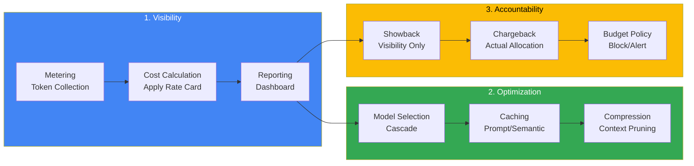
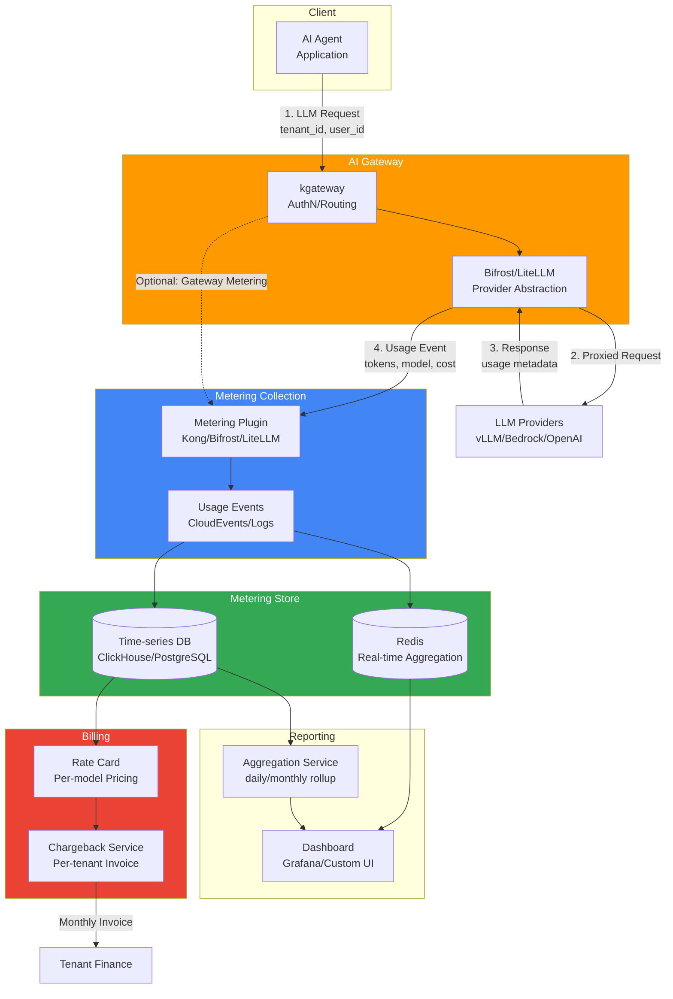
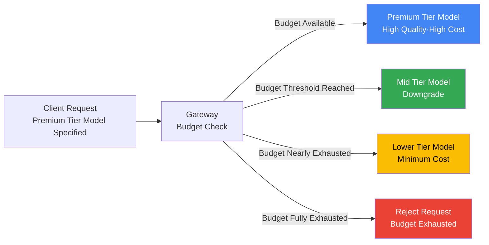

In enterprise LLM platforms, FinOps (Financial Operations) consists of three pillars: **Cost Visibility**, **Optimization**, and **Chargeback**. This document covers token metering pipelines, cost unit modeling, showback/chargeback methodologies, and budget policy design.

:::info Related Documents
- **This Document**: FinOps chargeback methodology (cost allocation strategies, metering architecture)
- [Agent Monitoring](../observability/agent-monitoring.md): Cost tracking PromQL queries (observability canonical implementation)
- [Request Cascading](../../model-serving/inference-routing/request-cascading.md): Cost-saving routing strategies
- [AI Gateway Guardrails](./ai-gateway-guardrails.md): Budget exhaustion blocking/fallback policies
:::

---

## 1. Overview

### 1.1 Why FinOps Is Necessary

LLM operational costs have distinct characteristics compared to traditional cloud infrastructure:

| Characteristic | Traditional Infrastructure | LLM Platform |
|------|------------|-----------|
| **Cost Unit** | CPU·Memory·Storage per hour | Input/Output token count |
| **Variability** | Relatively predictable | Varies rapidly with prompt length and turn count |
| **Cost Subject** | Instance·Service | Model·Tenant·Session·Agent |
| **Accumulation Pattern** | Linear growth | Can grow exponentially in multi-turn dialogs |
| **Optimization Opportunity** | Instance sizing | Model selection, prompt compression, caching |

Agentic AI applications can consume **10x or more tokens per request** due to tool invocation loops and context accumulation, making cost prediction difficult.

### 1.2 Three Pillars of FinOps



---

## 2. Cost Unit Modeling

### 2.1 Token Flow Model

The basic unit of LLM cost is **session-level cost**. The total cost of a single session (N request-response pairs) is determined by the following factors:

```
C_session = Σ (C_input * T_in + C_output * T_out) * (1 - R_cache)

Where:
  C_input  = Input token unit price ($/1M tokens)
  C_output = Output token unit price ($/1M tokens, typically 2~5x input)
  T_in     = Input tokens per turn
  T_out    = Output tokens per turn
  R_cache  = Cache hit rate (0~1, prompt caching·semantic caching)
  Σ        = Sum of all LLM calls within session (user turns + agent internal loops)
```

### 2.2 Agentic-Specific Risk: Context Compounding Effect

**General Chat** (single turn):
- Turn 1: User prompt 500 tokens → Model response 200 tokens
- Total cost: (500 * C_in + 200 * C_out) × 1 time

**Agentic Loop** (3 tool invocations):
- Turn 1: Prompt 500 + previous context 0 = 500 → Response 200 (tool call request)
- Turn 2: Prompt 500 + Turn 1 context 700 = 1,200 → Response 300 (tool call request)
- Turn 3: Prompt 500 + Turn 1~2 context 2,000 = 2,500 → Response 300 (tool call request)
- Turn 4: Prompt 500 + Turn 1~3 context 4,800 = 5,300 → Final response 400
- **Total input tokens: 9,500 (19x single turn)**

:::warning Cost Runaway Risk
In multi-turn agent loops, context accumulates with each turn, causing token consumption to increase **super-linearly**. When loop depth exceeds 10, single session costs can exceed $1 (Claude Opus 4.8, assumption).
:::

### 2.3 Cost Mitigation Strategies

| Strategy | Effect | Implementation Location |
|------|------|----------|
| **Max iterations limit** | Cap loop count (e.g., 10 times) | Agent framework configuration |
| **Intermediate summarization** | Replace long context with short summary | Summarization step within agent loop |
| **Context window budget** | Remove oldest turn when input tokens exceed N | Gateway policy or agent framework |
| **Prompt Caching** | Reuse system prompts and common context | Model API level (Claude, GPT-4.1, Gemini support) |
| **Semantic Caching** | Reuse responses for similar queries | Gateway layer |

---

## 3. Metering Pipeline Architecture

### 3.1 Data Flow



### 3.2 Metering Tool Implementation

#### LiteLLM Proxy

LiteLLM automatically calculates token counts and costs from request/response metadata and stores them in the `LiteLLM_SpendLogs` table.

**Tag-based Tracking** (Enterprise):
```python
# Add tags to request body
{
  "model": "claude-sonnet-4.6",
  "messages": [...],
  "metadata": {
    "tags": ["team:data-science", "project:rag-bot", "env:prod"]
  }
}
```

**Cost Query API**:
```bash
# Query spend logs (period filter, summarize=true by default)
curl "https://litellm.example.com/spend/logs?start_date=2026-08-01&end_date=2026-08-31"

# Daily user activity (breakdown by model·provider·key)
curl "https://litellm.example.com/user/daily/activity?start_date=2026-08-01&end_date=2026-08-31"
```

**Chargeback Report** (Enterprise — `group_by` supports `team`/`customer`):
```bash
# Period billing report by team or customer
curl "https://litellm.example.com/global/spend/report?start_date=2026-08-01&end_date=2026-08-31&group_by=customer"
```

:::tip LiteLLM Spend Tracking Details
LiteLLM maintains a built-in model cost map with official pricing for 100+ models and automatically reflects provider-specific pricing changes such as Bedrock tiers and Vertex AI PayGo. Detailed documentation: [LiteLLM Cost Tracking](https://docs.litellm.ai/docs/proxy/cost_tracking)
:::

#### Kong Metering & Billing Plugin

Kong's [Metering & Billing plugin](https://developer.konghq.com/plugins/metering-and-billing/) is a Kong Gateway 3.14+ Enterprise add-on (separately purchased) that publishes API requests and AI token usage as **immutable usage events in CloudEvents format**.

Key operational mechanics:

- **Subject Interpretation**: Each event contains a billing subject identifier, resolved from Consumer, Dev Portal application, or request headers (e.g., `x-customer-id`). Events without resolvable subjects are discarded.
- **Event Delivery**: Batch delivery to Konnect or self-hosted OpenMeter ingest endpoints. The plugin itself is stateless and does not preserve events on restart.
- **Metering Only**: This plugin collects usage only and does not enforce limits. For budget enforcement, combine with the AI Rate Limiting Advanced plugin ([AI Gateway Multi-Tenancy](./ai-gateway-multi-tenancy.md) reference).

---

## 4. Showback vs Chargeback

### 4.1 Definition and Differences

| Item | Showback | Chargeback |
|------|---------|-----------|
| **Purpose** | Cost visibility and awareness | Actual cost allocation (accounting treatment) |
| **Accounting** | None (informational) | Yes (budget deduction, invoice issuance) |
| **Adoption Difficulty** | Low (dashboard only) | High (rate card, billing system integration) |
| **Policy Impact** | Drive organizational awareness | Budget control and resource allocation decisions |
| **Adoption Order** | Phase 1 | Phase 2 (after showback) |

### 4.2 Phased Adoption Strategy

**Phase 1: Visibility** (1~3 months)
- Goal: Collect all LLM usage and display on dashboard
- Deliverable: Grafana dashboard (per-tenant, per-model, daily cost)
- Organizational reaction: "Our team is spending $2,000 per month"

**Phase 2: Showback** (3~6 months)
- Goal: Distribute per-team/per-project costs in monthly reports (no accounting treatment)
- Deliverable: Monthly showback reports (CSV/PDF), email distribution
- Organizational reaction: Cost awareness improvement, voluntary optimization attempts begin

**Phase 3: Soft Chargeback** (6~12 months)
- Goal: Deduct actual costs from team budgets (but no service blocking on overrun)
- Deliverable: Finance system integration, monthly invoices (soft limit)
- Organizational reaction: Budget planning and model selection optimization incentives

**Phase 4: Hard Chargeback** (12+ months)
- Goal: Block requests or downgrade to cheaper models when budget exhausted
- Deliverable: Gateway-level budget policies (hard limit)
- Organizational reaction: Strict cost control, resource competition (policy coordination required)

:::warning Hard Chargeback Risk
Immediately blocking service when budget exhausted can interrupt **business-critical workloads**. In production environments, recommend **fallback to cheaper models** or **alert + grace period** policies when budget exceeded.
:::

---

## 5. Budget Policy Design

### 5.1 Policy Matrix

| Policy Type | Trigger Condition | Action | UX Impact | Risk |
|----------|-----------|------|---------|--------|
| **Soft Budget — Alert Only** | 80% of monthly budget consumed | Slack/Email alert, service continues | None | Budget overrun possible |
| **Soft Budget — Visual Warning** | 90% of monthly budget consumed | Warning banner in UI, service continues | Warning message only | Budget overrun possible |
| **Hard Budget — Block** | 100% of monthly budget consumed | Reject requests (HTTP 429) | Service interruption | Business impact |
| **Hard Budget — Fallback** | 100% of monthly budget consumed | Downgrade to cheaper model (e.g., Opus → Haiku) | Response quality may degrade | User experience degradation |
| **Dynamic Budget — Priority** | 100% of monthly budget consumed | Allow only high-priority requests (e.g., prod > dev) | Dev environment blocked | Dev productivity loss |

### 5.2 Fallback Strategy (Budget Cascade)

Configuring **Cascade Routing** to automatically switch from expensive to cheaper models on budget overrun enables cost control without service interruption.



:::info Gateway Default Behavior Is Hard Block
Validated gateways' default budget exhaustion behavior is **blocking** — LiteLLM returns `budget_exceeded` error, Bifrost returns 402 `budget_exceeded`. Automatic downgrade to cheaper models on threshold breach is not a gateway budget feature but a separate **routing policy** (fallback·cascade configuration) that must be implemented separately. Support varies by gateway, so verify the product's routing documentation before adoption.
:::

:::tip Cascade Routing Details
Cascade Routing is used not only for cost reduction but also for availability (fallback to Bedrock on self-hosted failure). For detailed strategies, refer to [Request Cascading](../../model-serving/inference-routing/request-cascading.md).
:::

### 5.3 Priority-based Budget

Apply differentiated budget priorities by environment and workload.

| Priority | Environment | Monthly Budget Allocation | Action on Overrun |
|----------|------|-------------|-------------|
| **P0 — Critical** | Production customer-facing | 70% | Continue allowing (separate alert) |
| **P1 — High** | Internal production tools | 20% | Fallback to cheaper model |
| **P2 — Medium** | Staging environment | 7% | Fallback to cheaper model |
| **P3 — Low** | Development·Experiments | 3% | Block (429) |

---

## 6. FinOps FOCUS Spec Mapping

### 6.1 What Is FOCUS?

[FOCUS](https://focus.finops.org/) (FinOps Open Cost & Usage Specification) is an open specification supported by the Linux Foundation FinOps Foundation that normalizes billing data from diverse vendors (AI, cloud, SaaS) to reduce complexity for FinOps practitioners.

**Major Cloud Provider Support**: AWS, Azure, Google Cloud, Oracle, Alibaba, Tencent, Huawei, etc. support FOCUS format data exports (v1.0~v1.4).

### 6.2 LLM Cost and FOCUS Mapping (assumption)

FOCUS currently standardizes GPU and compute instance costs, but **token-based LLM billing does not yet have explicit mapping** (as of 2026-08, assumption). The following proposes mapping LLM metering to FOCUS columns:

| FOCUS Column | LLM Metering Mapping (Proposal) | Example Value |
|-----------|----------------------|---------|
| `ServiceName` | LLM service name | "LLM Inference Platform" |
| `ResourceId` | Model resource ID | "claude-sonnet-4.6" |
| `UsageQuantity` | Input + output token sum | 15000 |
| `PricingUnit` | Pricing unit | "1M tokens" |
| `PricingQuantity` | Pricing unit quantity | 0.015 (= 15000 / 1M) |
| `BilledCost` | Billed cost | 0.045 USD |
| `Tags` | Tenant·Team·Project tags | `{"tenant": "abc", "team": "data-science"}` |

:::info Factual Boundary
Whether FOCUS v1.4 standard explicitly addresses LLM token billing must be verified directly in the official specification document. The above mapping is a proposal applying the general `UsageQuantity` concept to tokens.
:::

---

## 7. Cost Tracking PromQL (Canonical Reference)

For **PromQL query implementation** of cost metrics, refer to the [Agent Monitoring — Cost Tracking](../observability/agent-monitoring.md#6-cost-tracking) section. Only concepts are summarized here.

### 7.1 Tracked Metrics

| Metric | Definition | Tracking Criteria |
|--------|------|----------|
| `llm_cost_dollars_total` | Cumulative LLM cost (counter) | Per-model, per-tenant, per-environment |
| `llm_tokens_input_total` | Cumulative input tokens (counter) | Per-model, per-tenant |
| `llm_tokens_output_total` | Cumulative output tokens (counter) | Per-model, per-tenant |
| `tenant_monthly_budget_usd` | Tenant monthly budget (gauge) | Per-tenant |

### 7.2 Key Queries (Concepts Only — Implementation in Canonical)

```prometheus
# Daily total cost
sum(increase(llm_cost_dollars_total[24h]))

# Daily cost per tenant
sum(increase(llm_cost_dollars_total[24h])) by (tenant_id)

# Budget utilization (monthly)
sum(increase(llm_cost_dollars_total[30d])) by (tenant_id)
/ on(tenant_id) group_left
tenant_monthly_budget_usd
```

:::tip Detailed PromQL Queries
For actual PromQL, ServiceMonitor configuration, and Grafana dashboard JSON, refer to the **Cost Metrics** section in [Agent Monitoring](../observability/agent-monitoring.md).
:::

---

## 8. Practical Checklist

### 8.1 Metering Pipeline
- [ ] LiteLLM or Kong Metering plugin deployed
- [ ] All LLM requests attach `tenant_id`, `user_id` metadata
- [ ] Verify metering events stored in TSDB (ClickHouse/PostgreSQL)
- [ ] Configure Redis cache for real-time aggregation (optional)

### 8.2 Cost Visibility
- [ ] Display per-tenant, per-model daily costs on Grafana dashboard
- [ ] Verify cost tracking PromQL operates correctly in AMP
- [ ] Cost spike alerts (when daily budget threshold exceeded)

### 8.3 Rate Card
- [ ] Obtain latest official pricing (input/output) per model
- [ ] Update LiteLLM model cost map or custom rate card
- [ ] Define self-hosted model cost calculation method (GPU time or fixed cost)

### 8.4 Showback/Chargeback
- [ ] Phase 1 (Visibility) complete: Dashboard shared
- [ ] Phase 2 (Showback) report auto-generation script (monthly CSV/PDF)
- [ ] Phase 3 (Soft Chargeback) finance system integration (if applicable)
- [ ] Phase 4 (Hard Chargeback) budget policy gateway integration (if applicable)

### 8.5 Budget Policy
- [ ] Set monthly budget per tenant (initial value: estimated from observation data)
- [ ] Decide budget policy type (alert only / fallback / block)
- [ ] Configure Cascade Routing (fallback to cheaper model on budget overrun)
- [ ] Allocate budgets by priority (production > staging > dev)

### 8.6 Optimization
- [ ] Enable Prompt Caching (models supporting Claude, GPT-4.1, Gemini)
- [ ] Configure Semantic Caching (gateway layer)
- [ ] Limit agent loop max iterations (e.g., 10 times)
- [ ] Context window budget policy (e.g., pruning when input tokens > 10k)

---

## 9. Conclusion

LLM FinOps consists of four stages: token metering, cost visibility, budget policy, and chargeback. Agentic AI applications experience super-linear cost growth due to multi-turn context accumulation, making **loop limits**, **intermediate summarization**, and **budget-based Cascade Routing** essential.

Adoption order should follow **Visibility (dashboard) → Showback (report) → Soft Chargeback (accounting integration) → Hard Chargeback (budget blocking)** phases. Hard Chargeback should be operated with **fallback policies** considering production workload interruption risks.

For cost tracking PromQL implementation, refer to [Agent Monitoring](../observability/agent-monitoring.md), and for cost-saving routing strategies, refer to [Request Cascading](../../model-serving/inference-routing/request-cascading.md).

---

## References

### Official Documentation
- [LiteLLM Cost Tracking](https://docs.litellm.ai/docs/proxy/cost_tracking) — Tag-based cost tracking, spend logging, chargeback API
- [Kong Metering & Billing Plugin](https://developer.konghq.com/plugins/metering-and-billing/) — CloudEvents-based usage metering
- [FinOps Foundation FOCUS](https://focus.finops.org/) — Cloud cost data standardization open specification
- [OpenAI Pricing](https://openai.com/api/pricing/) — Official GPT model pricing
- [Anthropic Pricing](https://www.anthropic.com/pricing) — Official Claude model pricing
- [Google AI Pricing](https://ai.google.dev/pricing) — Official Gemini model pricing

### Related Documentation (Internal)
- [Agent Monitoring](../observability/agent-monitoring.md) — Cost tracking PromQL query canonical
- [Request Cascading](../../model-serving/inference-routing/request-cascading.md) — Cost-saving routing strategies
- [AI Gateway Guardrails](./ai-gateway-guardrails.md) — Budget exhaustion blocking policies
- [AI Gateway Multi-Tenancy](./ai-gateway-multi-tenancy.md) — Tenant isolation and budget policies (in parallel development)
