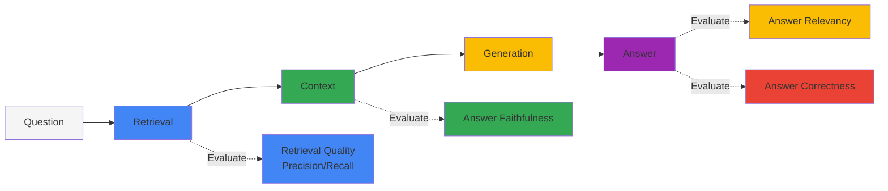
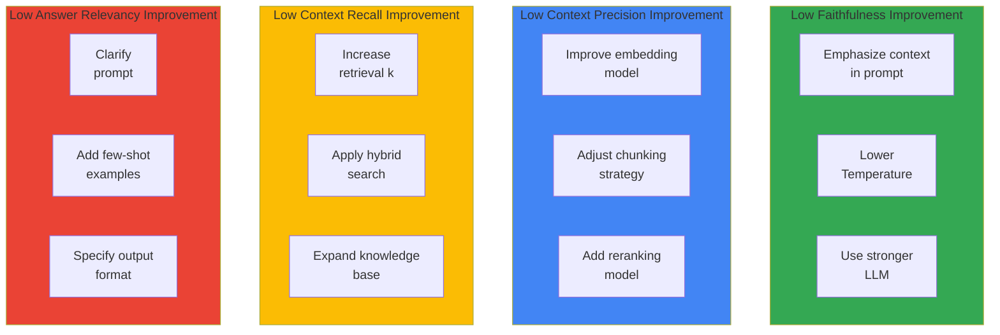

import { RagasVsBedrockComparison, RagasMetrics, CostOptimizationStrategies, CostComparison, ImprovementChecklist } from '@site/src/components/RagasTables';

Ragas (RAG Assessment) is an open-source framework for objectively evaluating the quality of RAG (Retrieval-Augmented Generation) pipelines. It is essential for measuring and continuously improving RAG system performance in Agentic AI platforms.

## 1. Overview

### Why RAG Evaluation Is Needed

RAG systems consist of multiple components (retrieval, generation, context processing), making it difficult to measure overall quality:



### Ragas vs AWS Bedrock RAG Evaluation

:::tip AWS Bedrock RAG Evaluation GA
AWS Bedrock RAG Evaluation became **GA in March 2025**. With Bedrock native integration, RAG evaluation can be performed without additional setup.
:::

<RagasVsBedrockComparison />

**AWS Bedrock RAG Evaluation Metrics:**

- **Context Relevance**: Whether retrieved context is relevant to the question
- **Coverage**: Whether the answer covers all aspects of the question
- **Correctness**: Whether the answer is accurate (compared to ground truth)
- **Faithfulness**: Whether the answer is faithful to the context

### Ragas Core Metrics

<RagasMetrics />

:::note Ragas baseline for this page
Use Ragas **0.4.3**, Python **3.11**, and `ascore()` from `ragas.metrics.collections`. Following the [official migration guide](https://docs.ragas.io/en/stable/howtos/migrations/migrate_from_v03_to_v04/), configure LLMs and embeddings explicitly and read `MetricResult.value`. Basic, comprehensive, CI, and caching examples all use this API.
:::

## 2. Installation and Basic Setup

### Python Environment Setup

The runnable module and pinned dependencies are in [examples/ragas-evaluation](https://github.com/devfloor9/engineering-playbook/tree/main/examples/ragas-evaluation). Run the subsequent Python examples from that directory after installation.

```bash
# Run from the repository root; Python 3.11 is the verified baseline.
python3.11 -m venv /tmp/ragas-evaluation-venv
source /tmp/ragas-evaluation-venv/bin/activate
python -m pip install -r examples/ragas-evaluation/requirements.txt
cd examples/ragas-evaluation
python test_smoke.py
```

`requirements.txt` pins Ragas 0.4.3, OpenAI 2.54.0, Instructor 1.17.0, and the tested transitive dependencies. Ragas 0.4.3 imports a VertexAI module absent from `langchain-community` 0.4.2, so the environment pins the verified 0.3.31 release. The example itself does not use LangChain wrappers. Installing only `ragas>=0.2` does not reproduce this configuration.

`test_smoke.py` blocks network connections and runs real metrics against mocked HTTP responses. It needs neither an API key nor paid calls. These checks do not validate model quality or access to a live service.

### Basic Evaluation Code

`make_metrics()` in `ragas_eval.py` configures evaluators as shown below. The LLM produces structured judgments; embeddings provide question similarity for `AnswerRelevancy`. Both models are explicit.

```python
from openai import AsyncOpenAI
from ragas.embeddings import OpenAIEmbeddings
from ragas.llms import llm_factory
from ragas.metrics.collections import (
    Faithfulness, AnswerRelevancy, ContextPrecision, ContextRecall,
)

# The caller supplies an AsyncOpenAI client with an explicit API key and base URL.
def make_basic_metrics(client: AsyncOpenAI):
    llm = llm_factory("gpt-4o-mini", provider="openai", client=client, temperature=0)
    embeddings = OpenAIEmbeddings(client=client, model="text-embedding-3-small")
    return {
        "faithfulness": Faithfulness(llm=llm),
        "answer_relevancy": AnswerRelevancy(llm=llm, embeddings=embeddings, strictness=3),
        "context_precision": ContextPrecision(llm=llm),
        "context_recall": ContextRecall(llm=llm),
    }
```

The following code **makes paid API calls**. Set `OPENAI_API_KEY` in the environment and confirm access to both configured models before running it. Keep credentials out of source files. `CASES` and `demo_pipeline` are two deterministic fixtures defined in the module, not a dataset measuring production RAG quality.

```python
import asyncio
import os
from openai import AsyncOpenAI
from ragas_eval import (
    BASE_URL, CASES, collect_samples, demo_pipeline,
    make_metrics, quality_failures, score_samples,
)

async def main():
    samples = collect_samples(CASES, demo_pipeline)
    async with AsyncOpenAI(
        api_key=os.environ["OPENAI_API_KEY"], base_url=BASE_URL,
        timeout=60, max_retries=0,
    ) as client:
        report = await score_samples(samples, make_metrics(client))
    print(report["metrics"])
    failures = quality_failures(report)
    if failures:
        raise RuntimeError("; ".join(failures))

asyncio.run(main())
```

`score_samples()` passes only the required fields to each `await metric.ascore(...)`. Exceptions, NaN, infinity, and nonnumeric results become `null` scores with an error type. If any sample fails a metric, that metric's aggregate is `null` and quality gates fail. Failed rows are neither omitted from averages nor replaced with zero. In a notebook, use `await main()` instead of `asyncio.run(main())`.

## 3. Core Metric Details

### 1. Faithfulness

`Faithfulness(llm=llm)` splits the response into claims and checks whether retrieved contexts support each claim. Call `ascore(user_input=..., response=..., retrieved_contexts=...)`. The 0.4.3 implementation can return NaN when no statements are generated, so validate that every result is finite.

### 2. Answer Relevancy

`AnswerRelevancy(llm=llm, embeddings=embeddings, strictness=3)` generates questions from the response and compares their embeddings with the original question. Call `ascore(user_input=..., response=...)`. Evaluate factual correctness separately; treat NaN as an evaluation failure rather than a low relevance score.

### 3. Context Precision

This example uses `ContextPrecision(llm=llm)` **with a reference answer**. Call `ascore(user_input=..., reference=..., retrieved_contexts=...)` to evaluate how early useful contexts appear in the retrieval ranking. It is not simply the fraction of retrieved documents that are relevant.

### 4. Context Recall

`ContextRecall(llm=llm)` evaluates the fraction of reference-answer claims supported by retrieved contexts. Call `ascore(user_input=..., retrieved_contexts=..., reference=...)`. A missing reference therefore violates this page's evaluation data contract.

These descriptions follow the [official metric documentation](https://docs.ragas.io/en/stable/concepts/metrics/available_metrics/faithfulness/) and the [0.4.3 implementation](https://github.com/vibrantlabsai/ragas/tree/v0.4.3/src/ragas/metrics/collections).

## 4. Comprehensive Evaluation Pipeline

### Full RAG System Evaluation

The adapter contract is `pipeline(question: str) -> {"response": str, "retrieved_contexts": list[str]}`. `collect_samples(cases, pipeline)` joins its output with questions and references. Preserve retrieval order and return the contexts actually supplied to the generator. This complete adapter uses fixtures so that the example can run as written.

```python
from pathlib import Path
from ragas_eval import CASES, DEMO_DOCUMENTS, collect_samples, save_json

# A complete fixture adapter. Replace its body with your initialized RAG pipeline.
def pipeline(question: str) -> dict:
    context = DEMO_DOCUMENTS[question]
    return {"response": context, "retrieved_contexts": [context]}

# Only the question goes to the pipeline; reference answers stay with the evaluator.
samples = collect_samples(CASES, pipeline)
save_json(Path("samples.json"), samples)
```

```bash
# Paid evaluation, after setting OPENAI_API_KEY in the environment.
python ragas_eval.py --live --comprehensive --samples samples.json \
  --output results/evaluation.json
```

For a real system, replace the body of `pipeline()` with calls to your initialized retriever and generator, and replace `CASES` with questions and references reviewed by domain experts. The adapter is synchronous. An asynchronous pipeline can instead save its outputs as a JSON array with the same schema and pass it through `--samples`. Inputs must be nonempty; every sample requires `user_input`, `response`, `retrieved_contexts`, and `reference`. Adapter or input-validation errors fail the run before evaluation starts.

`--comprehensive` adds `AnswerCorrectness(llm=llm, embeddings=embeddings, weights=[0.75, 0.25], beta=1.0)` to the four basic metrics. It evaluates `user_input`, `response`, and `reference` using the same evaluator, with configuration recorded in the report. The CLI requires both `--live` and an API key before making calls.

### Evaluation Result Analysis

```python
import json
from pathlib import Path
from ragas_eval import quality_failures

report = json.loads(Path("results/evaluation.json").read_text(encoding="utf-8"))
for metric, score in report["metrics"].items():
    print(f"{metric}: {score:.3f}" if score is not None else f"{metric}: FAILED")
print(f"Failed samples: {report['failed_samples']}/{report['sample_count']}")
for failure in quality_failures(report):
    print(failure)
```

The report contains `metrics` (means across all samples), `rows` (per-sample scores, errors, and cache status), `failed_samples`, `sample_count`, and `config`. A `null` score is not a valid result that can be excluded from comparisons. Resolve that sample's error and rerun evaluation. Reports include questions, responses, contexts, and references, so choose suitable sharing rules for test data and result files.

## 5. CI/CD Pipeline Integration

### GitHub Actions Workflow

This illustrative workflow can be installed separately by a consuming project. Pull requests run only offline checks; selecting `live` during manual dispatch enables evaluation with a repository secret. The paid example evaluates fixtures; supply your own `--samples` file for an actual regression gate. Execution on a Linux GitHub runner is outside this page's local verification scope.

```yaml
# Illustrative .github/workflows/rag-evaluation.yml; not installed by this guide.
name: Ragas Evaluation
on:
  pull_request:
    paths:
      - 'examples/ragas-evaluation/**'
  workflow_dispatch:
    inputs:
      live:
        description: 'Run paid evaluation of the bundled fixtures'
        type: boolean
        default: false
permissions:
  contents: read
jobs:
  evaluate:
    runs-on: ubuntu-latest
    defaults:
      run:
        working-directory: examples/ragas-evaluation
    steps:
      - uses: actions/checkout@v4
      - uses: actions/setup-python@v5
        with:
          python-version: '3.11'
      - name: Install the same pinned dependencies
        run: python -m pip install -r requirements.txt
      - name: Offline smoke checks
        run: python test_smoke.py
      - name: Evaluate and enforce quality gates
        if: github.event_name == 'workflow_dispatch' && inputs.live
        env:
          OPENAI_API_KEY: ${{ secrets.OPENAI_API_KEY }}
          RAGAS_DO_NOT_TRACK: 'true'
        run: python ragas_eval.py --live --comprehensive --output results/evaluation.json
      - name: Upload evaluation report even if quality gates fail
        if: always() && github.event_name == 'workflow_dispatch' && inputs.live
        uses: actions/upload-artifact@v4
        with:
          name: evaluation-results
          path: examples/ragas-evaluation/results/evaluation.json
```

### Quality Gate Script

The CLI writes the report before returning exit code 1 on gate failure. Recheck a saved report using the same function:

```python
import json
from pathlib import Path
from ragas_eval import quality_failures

report = json.loads(Path("results/evaluation.json").read_text(encoding="utf-8"))
failures = quality_failures(report)
for failure in failures:
    print(failure)
raise SystemExit(1 if failures else 0)
```

Illustrative thresholds are 0.8 for faithfulness, 0.75 for answer relevancy, and 0.7 each for context precision and recall. These are neither Ragas defaults nor measured acceptance criteria; calibrate them against your evaluation set. Missing or non-finite scores, empty results, incomplete row counts, and inconsistent aggregates also fail. Comprehensive evaluation checks answer correctness for validity but does not assign it a separate score threshold in this example.

## 6. Kubernetes Job for Regular Evaluation

:::note Deployment outline
The Kubernetes resources in this section assume a custom evaluator image, configuration loader, and storage integrations. The Python example above does not implement ConfigMap loading, S3 output, or Milvus connectivity. Verification of the runnable Ragas example covers local smoke checks only.
:::

### Evaluation Job Definition

```yaml
apiVersion: batch/v1
kind: CronJob
metadata:
  name: rag-evaluation
  namespace: genai-platform
spec:
  schedule: "0 6 * * *"  # Daily at 6 AM
  jobTemplate:
    spec:
      template:
        spec:
          containers:
          - name: evaluator
            image: your-registry/rag-evaluator:latest
            env:
            - name: OPENAI_API_KEY
              valueFrom:
                secretKeyRef:
                  name: openai-credentials
                  key: api-key
            - name: MILVUS_HOST
              value: "milvus-proxy.ai-data.svc.cluster.local"
            - name: RESULTS_BUCKET
              value: "s3://rag-evaluation-results"
            command:
            - python
            - /app/evaluate.py
            - --config=/app/config/evaluation.yaml
            - --output=s3
            resources:
              requests:
                cpu: "1"
                memory: "2Gi"
              limits:
                cpu: "2"
                memory: "4Gi"
          restartPolicy: OnFailure
          serviceAccountName: rag-evaluator
```

### Evaluation Configuration ConfigMap

```yaml
apiVersion: v1
kind: ConfigMap
metadata:
  name: rag-evaluation-config
  namespace: genai-platform
data:
  evaluation.yaml: |
    evaluation:
      metrics:
        - faithfulness
        - answer_relevancy
        - context_precision
        - context_recall
      
      test_sets:
        - name: "general_knowledge"
          path: "s3://test-data/general.json"
          weight: 0.4
        - name: "technical_docs"
          path: "s3://test-data/technical.json"
          weight: 0.6
      
      quality_gates:
        faithfulness: 0.8
        answer_relevancy: 0.75
        context_precision: 0.7
        context_recall: 0.7
      
      alerts:
        slack_webhook: "https://hooks.slack.com/..."
        threshold_drop: 0.1  # Alert on 10%+ drop
```

## 7. Evaluation Result Interpretation and Improvement Guide

### Cost Optimization Strategies

RAG evaluation requires LLM API calls, so costs are incurred. Optimize costs with the following strategies:

<CostOptimizationStrategies />

Caching is an optional feature of the same runnable module. It preserves input order and reuses duplicate inputs within a run. Keys include the question, response, retrieved contexts, reference, metric list, model and endpoint configuration, parameters, dependency versions, and prompt revision. Only samples with all metrics successful are stored; failed or NaN cache entries are recomputed.

```bash
# The same metrics, configuration, sample format, and quality gates as above.
python ragas_eval.py --live --comprehensive --samples samples.json \
  --cache results/eval-cache.json --revision default-prompts-v1 \
  --output results/evaluation.json
```

Change `--revision` or remove the cache when the model behind an alias, prompts, or metric settings change. Reusing old scores cannot measure quality after those changes. This JSON cache is for one process and does not provide concurrent-writer locking or automatic expiration.

### AWS Bedrock RAG Evaluation Usage

AWS Bedrock RAG Evaluation provides simpler evaluation with Bedrock native integration:

```python
import boto3

bedrock = boto3.client('bedrock-agent-runtime')

# Run RAG evaluation
response = bedrock.evaluate_rag(
    evaluationJobName='rag-eval-2026-02-13',
    evaluationDatasetLocation={
        's3Uri': 's3://my-bucket/eval-dataset.jsonl'
    },
    evaluationMetrics=[
        'CONTEXT_RELEVANCE',
        'COVERAGE',
        'CORRECTNESS',
        'FAITHFULNESS'
    ],
    modelId='anthropic.claude-3-sonnet-20240229-v1:0',
    outputDataConfig={
        's3Uri': 's3://my-bucket/eval-results/'
    }
)

job_id = response['evaluationJobId']

# Query evaluation results
result = bedrock.get_evaluation_job(evaluationJobId=job_id)
print(f"Status: {result['status']}")
print(f"Metrics: {result['metrics']}")
```

**Bedrock RAG Evaluation Advantages:**

- Native integration with Bedrock models
- S3-based large-scale batch evaluation
- Automatic CloudWatch metric publishing
- IAM-based access control
- No separate infrastructure required

**Cost Comparison (per 1000 evaluations):**

<CostComparison />

### Per-Metric Improvement Directions



### Improvement Checklist

<ImprovementChecklist />

## References

### Official Documentation
- [Ragas 0.4 migration guide](https://docs.ragas.io/en/stable/howtos/migrations/migrate_from_v03_to_v04/)
- [Ragas 0.4.3 collections source](https://github.com/vibrantlabsai/ragas/tree/v0.4.3/src/ragas/metrics/collections)
- [Ragas 0.4.3 LLM factory and imports](https://github.com/vibrantlabsai/ragas/blob/v0.4.3/src/ragas/llms/base.py)
- [Ragas 0.4.3 native OpenAI embeddings](https://github.com/vibrantlabsai/ragas/blob/v0.4.3/src/ragas/embeddings/openai_provider.py)
- [AWS Bedrock RAG Evaluation](https://docs.aws.amazon.com/bedrock/)

### Related Documentation
- [Milvus Vector Database](../data-infrastructure/milvus-vector-database.md)
- [Agent Monitoring](../observability/agent-monitoring.md)
- [Agentic AI Platform Architecture](../../design-architecture/foundations/agentic-platform-architecture.md)

:::tip Recommendations

- Include at least 50 diverse questions in evaluation datasets
- Use ground truths verified by domain experts
- Track quality changes over time through regular evaluation
:::

:::warning Cautions

- Ragas evaluation requires LLM API calls, incurring costs
- Use batch processing and caching for large-scale evaluations
- Evaluation results may vary depending on the LLM used
:::
