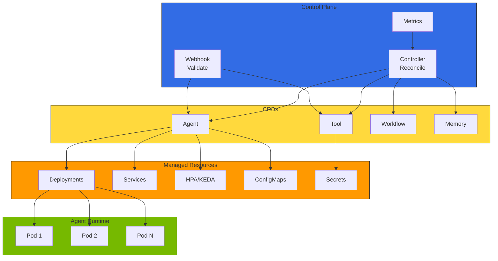
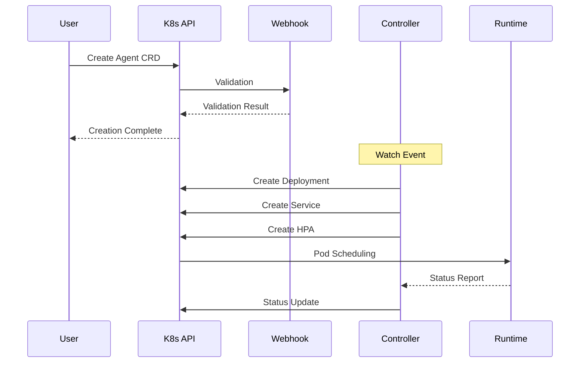
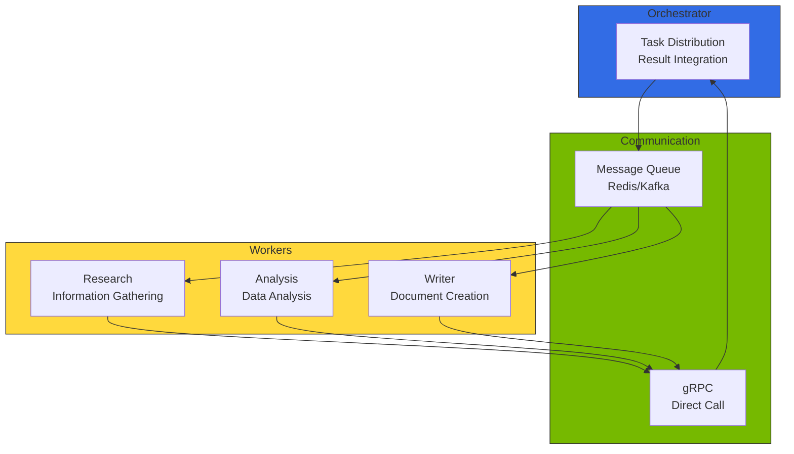
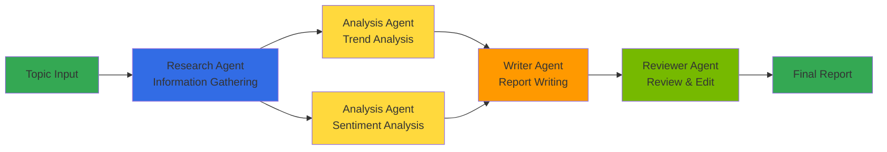

# Kagent - Kubernetes AI Agent Management

In a multi-model ecosystem, AI agents must call multiple LLMs/SLMs, connect to tools and other agents via MCP/A2A protocols, and dynamically scale based on traffic. Kubernetes' **Operator pattern** is the most natural approach for declaratively defining such agents as CRDs and automatically managing their lifecycles. Kagent is a reference architecture that applies this pattern to AI agents.

## Overview

Kagent declaratively defines agents, tools, and workflows through Custom Resource Definitions (CRDs), with an Operator automatically deploying and managing them. Instead of manually writing Deployments, Services, and ConfigMaps, a single `Agent` CRD integrates model connections, tool bindings, and scaling policies.

:::warning Kagent Project Status
Kagent is currently in the reference architecture and design pattern stage, and an official open-source project has not yet been released. Examples in this document are based on conceptual implementations. For production environments, consider validated alternatives such as **Bedrock AgentCore**, **KubeAI**, or **LangGraph Platform**.

See the [Kagent official documentation](https://github.com/kagent-dev/kagent) for deployment guides.
:::

### Alternative Solutions Comparison

import { SolutionsComparisonTable } from '@site/src/components/KagentTables';

<SolutionsComparisonTable />

### Key Features

- **Declarative agent management**: YAML-based agent definition and deployment
- **Tool registry**: Central management of tools available to agents via CRDs
- **Auto-scaling**: Dynamic scaling through HPA/KEDA integration
- **Multi-agent orchestration**: Inter-agent collaboration for complex workflows
- **Observability integration**: Native integration with Langfuse/LangSmith, OpenTelemetry

:::info Target Audience
This document is intended for Kubernetes administrators, platform engineers, and MLOps engineers. Understanding of basic Kubernetes concepts (Pod, Deployment, CRD) is required.
:::

:::tip re:Invent 2025 Related Session

**CNS421: Streamline Amazon EKS Operations with Agentic AI** — A code talk session covering automated EKS cluster management, real-time issue diagnosis, and automatic recovery using AI agents like Kagent.

**Key Topics:**
- **Model Context Protocol (MCP)**: Standard protocol for AI agent integration with AWS services
- **Automated Incident Response**: Automatic diagnosis and recovery for Pod failures, resource shortages, network issues
- **AWS Service Integration**: Native integration with CloudWatch, Systems Manager, EKS API

[Watch the session](https://www.youtube.com/watch?v=4s-a0jY4kSE)
:::

---

## Kagent Architecture

Kagent follows the Kubernetes Operator pattern, consisting of Controller, CRDs, and Webhooks.



### Component Description

import { ComponentsTable } from '@site/src/components/KagentTables';

<ComponentsTable />

### Component Interaction



### Prerequisites

- Kubernetes cluster (v1.25+)
- kubectl CLI tool
- Helm v3 (for Helm installation)
- cert-manager (Webhook TLS certificate management)

---

## CRD Structure

### Agent CRD

The Agent CRD declaratively defines all settings for an AI agent. Below is the core spec structure:

```yaml
apiVersion: kagent.dev/v1alpha1
kind: Agent
metadata:
  name: customer-support-agent
  namespace: ai-agents
spec:
  # Agent basic info
  displayName: "Customer Support Agent"
  description: "AI agent that responds to customer inquiries and creates tickets"

  # Model configuration
  model:
    provider: openai          # openai, anthropic, bedrock, vllm
    name: gpt-4-turbo
    endpoint: ""              # Custom endpoint (vLLM, etc.)
    temperature: 0.7
    maxTokens: 4096
    apiKeySecretRef:
      name: openai-api-key
      key: api-key

  # System prompt
  systemPrompt: |
    You are a friendly and professional customer support agent.

  # Tool list
  tools:
    - name: search-knowledge-base
    - name: create-ticket

  # Memory configuration
  memory:
    type: redis
    config:
      host: redis-master.ai-data.svc.cluster.local
      ttl: 3600
      maxHistory: 50

  # Scaling configuration
  scaling:
    minReplicas: 2
    maxReplicas: 10
    metrics:
      - type: cpu
        target:
          averageUtilization: 70
    keda:
      enabled: true
      triggers:
        - type: prometheus
          metadata:
            metricName: agent_active_sessions
            threshold: "50"

  # Resource limits
  resources:
    requests:
      memory: "512Mi"
      cpu: "250m"
    limits:
      memory: "1Gi"
      cpu: "500m"

  # Observability configuration
  observability:
    tracing:
      enabled: true
      provider: langfuse       # langfuse, langsmith, cloudwatch
    metrics:
      enabled: true
      port: 9090
```

### Tool CRD

The Tool CRD defines tools available to agents. Tool types include `api`, `retrieval`, `code`, and `human`.

**Key fields:**

| Field | Description | Example |
|-------|-------------|---------|
| `spec.type` | Tool type | `retrieval`, `api`, `code`, `human` |
| `spec.description` | Description referenced by LLM for tool selection | "Search documents in knowledge base" |
| `spec.retrieval` | Vector store connection config | Milvus, Pinecone, etc. |
| `spec.api` | REST API call config | Endpoint, auth, timeout |
| `spec.parameters` | Input parameter schema | name, type, required, enum |
| `spec.output` | Output schema | JSON Schema format |

### Memory CRD

Memory configuration for storing agent conversation context and state.

**Key features:**

| Feature | Description |
|---------|-------------|
| **Session memory** | Redis/PostgreSQL-based short-term conversation history (TTL config) |
| **Conversation compression** | LLM-based conversation summarization when threshold exceeded |
| **Long-term memory** | Vector store-based agent experience accumulation |
| **Memory types** | `redis`, `postgres`, `in-memory` |

### Workflow CRD

Define multi-agent workflows using the Workflow CRD.

**Core structure:**

| Field | Description |
|-------|-------------|
| `spec.input` | Workflow input parameter definition |
| `spec.steps` | Per-step agent execution definition (sequential/parallel) |
| `spec.steps[].dependsOn` | Dependency step specification (DAG construction) |
| `spec.steps[].parallel` | Parallel execution flag |
| `spec.output` | Workflow final output mapping |
| `spec.errorHandling` | Behavior on step/workflow failure |
| `spec.timeout` | Overall workflow timeout |
| `spec.concurrency` | Concurrent execution limit (queue/reject/replace) |

---

## Multi-Agent Orchestration

Define workflows where multiple agents collaborate to handle complex tasks.

### Inter-Agent Communication Patterns



### Orchestration Patterns

| Pattern | Description | Suitable For |
|---------|-------------|-------------|
| **Sequential Pipeline** | Step-by-step sequential execution, previous step output feeds next input | Data processing, ETL |
| **Parallel Fan-out** | Same input sent to multiple agents in parallel | Multi-angle analysis, A/B comparison |
| **DAG Workflow** | Dependency-based directed acyclic graph execution | Complex research, report generation |
| **Loop** | Repeated execution until condition is met | Review-revision cycles, quality verification |
| **Routing** | Branch to different agents based on input content | Inquiry classification, domain distribution |

### Workflow Example: Research Report



Workflow execution status is tracked via `WorkflowRun` CRD:

| Status | Description |
|--------|-------------|
| `Pending` | Waiting for execution |
| `Running` | One or more steps are running |
| `Succeeded` | All steps completed successfully |
| `Failed` | One or more steps failed (retries exhausted) |

---

## Agent Lifecycle Management

### Operator-Managed Resources

When an Agent CRD is created, the Controller automatically creates/manages the following resources:

```
Agent CRD Creation
  ├── Deployment (agent Pod management)
  ├── Service (network access)
  ├── HPA/KEDA ScaledObject (autoscaling)
  ├── ConfigMap (agent configuration)
  └── Secret reference (API keys, credentials)
```

### Update Strategies

| Strategy | Description | Recommended Scenario |
|----------|-------------|---------------------|
| **Rolling Update** | Default strategy. Progressively replace Pods | General config changes |
| **Canary Deployment** | Test new version with separate Agent CRD | Model changes, major prompt revisions |
| **Blue-Green** | Run two versions simultaneously, switch traffic | Zero-downtime migration |

### Scaling Strategies

| Metric | Description | Threshold Example |
|--------|-------------|------------------|
| CPU utilization | Basic resource-based scaling | 70% |
| Memory utilization | Scale out on memory pressure | 80% |
| Active session count | KEDA + Prometheus custom metric | 50 sessions/Pod |
| Request throughput | Requests per second based | 100 RPS/Pod |

---

## Observability Integration

### Supported Observability Providers

| Provider | Type | Description |
|----------|------|-------------|
| **Langfuse** | Tracing | OSS LLM observability (self-hostable) |
| **LangSmith** | Tracing | LangChain ecosystem tracing |
| **CloudWatch** | Metrics/Logs | AWS native Generative AI Observability |
| **OpenTelemetry** | Universal | Distributed tracing standard |
| **Prometheus** | Metrics | ServiceMonitor-based metrics collection |

### Key Alert Rules

| Alert | Condition | Severity |
|-------|----------|----------|
| Agent error rate increase | Error rate > 5% (5 min sustained) | Critical |
| Agent response delay | P99 > 30s (5 min sustained) | Warning |
| Pod availability degradation | Ready Pods < 50% (5 min sustained) | Critical |

---

## Conclusion

Using Kagent enables declarative management of AI agents in Kubernetes environments. Key benefits include:

- **Declarative management**: YAML-based agent definitions support GitOps workflows
- **Automated operations**: Automatic recovery and scaling through the Operator pattern
- **Standardization**: Agent definition standardization through CRDs
- **Scalability**: Leveraging Kubernetes-native scaling mechanisms
- **Observability**: Integrated monitoring and tracing support

:::tip Next Steps

- [Agentic AI Platform Architecture](../design-architecture/agentic-platform-architecture.md) - Overall platform design
- [Agent Monitoring](../operations-mlops/agent-monitoring.md) - Langfuse/LangSmith integration guide
- [GPU Resource Management](../model-serving/gpu-resource-management.md) - Dynamic resource allocation

:::

---

## References

- [Kagent Concepts and Design Patterns](https://github.com/kagent-dev/kagent) (reference architecture)
- [KubeAI - Kubernetes AI Platform](https://github.com/substratusai/kubeai)
- [Bedrock AgentCore](https://docs.aws.amazon.com/bedrock/latest/userguide/agents-core.html) - AWS managed Agent runtime
- [LangGraph Platform](https://langchain-ai.github.io/langgraph/) - Agent workflow framework
- [Kubernetes Operator Pattern](https://kubernetes.io/docs/concepts/extend-kubernetes/operator/)
- [KEDA Documentation](https://keda.sh/docs/)
- [re:Invent 2025 CNS421 - Streamline EKS Operations with Agentic AI](https://www.youtube.com/watch?v=4s-a0jY4kSE)
